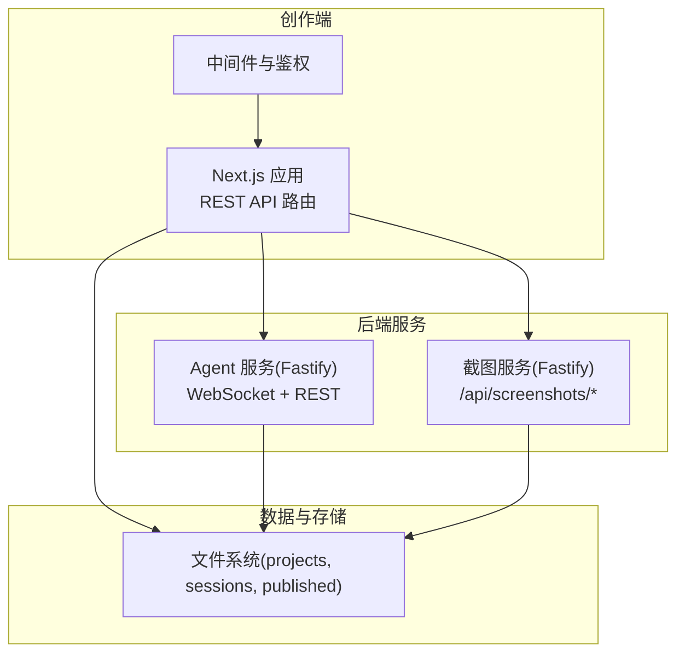
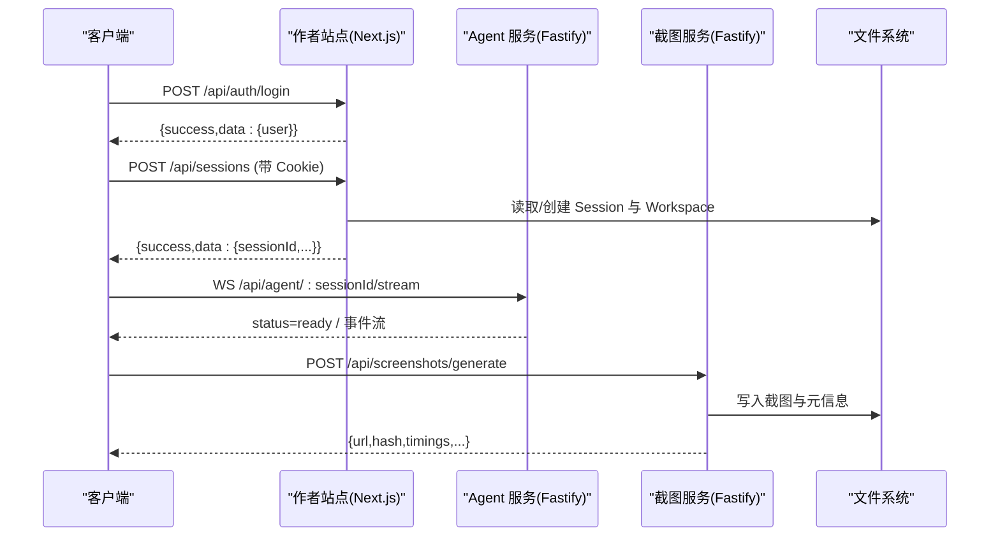
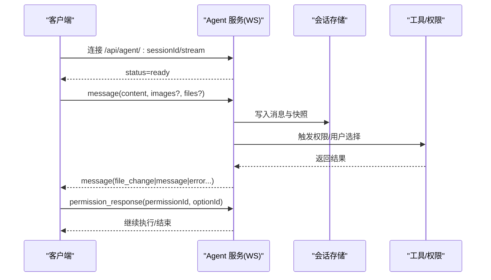
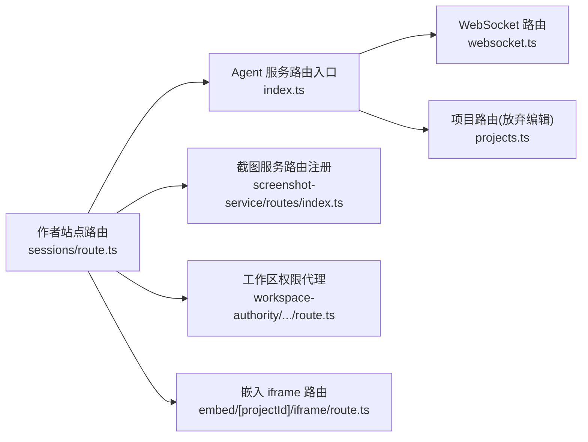

# API 接口参考

<cite>
**本文引用的文件**
- [路由设计文档](file://docs/项目文档/创作端/06-基础设施/技术/01_路由设计.md)
- [作者站点会话管理路由](file://packages/author-site/src/app/api/sessions/route.ts)
- [作者站点登录路由](file://packages/author-site/src/app/api/auth/login/route.ts)
- [作者站点嵌入 iframe 路由](file://packages/author-site/src/app/api/embed/[projectId]/iframe/route.ts)
- [截图服务路由注册](file://packages/screenshot-service/src/routes/index.ts)
- [截图服务路由实现](file://packages/screenshot-service/src/routes/screenshots.ts)
- [Agent 服务路由总入口](file://packages/agent-service/src/routes/index.ts)
- [Agent 服务 WebSocket 路由](file://packages/agent-service/src/routes/websocket.ts)
- [Agent 服务统一响应工具](file://packages/agent-service/src/routes/api-response.ts)
- [Agent 服务项目路由（放弃编辑）](file://packages/agent-service/src/routes/projects.ts)
- [工作区权限代理路由](file://packages/author-site/src/app/api/workspace-authority/[projectId]/[workspaceId]/[...segments]/route.ts)
- [外部认证回调路由](file://packages/author-site/src/app/api/user/external-auth/[provider]/callback/route.ts)
- [路由守卫与访问控制文档](file://docs/项目文档/创作端/01-用户鉴权/技术/04_路由守卫与访问控制.md)
</cite>

## 目录
1. [简介](#简介)
2. [项目结构](#项目结构)
3. [核心组件](#核心组件)
4. [架构总览](#架构总览)
5. [详细组件分析](#详细组件分析)
6. [依赖关系分析](#依赖关系分析)
7. [性能考虑](#性能考虑)
8. [故障排查指南](#故障排查指南)
9. [结论](#结论)
10. [附录](#附录)

## 简介
本文件为 Workbench 平台的完整 API 接口参考，覆盖以下范围：
- HTTP REST API：项目管理、会话管理、文件操作、截图服务、嵌入 iframe 等
- WebSocket 实时通信协议：连接建立、消息格式、事件类型与错误处理
- iframe 嵌入协议：postMessage 通信规范、安全策略与集成示例
- 认证授权机制、错误码定义与速率限制策略
- 请求/响应示例、客户端实现指南与调试工具使用
- API 版本管理与向后兼容性说明、迁移指南

## 项目结构
Workbench 采用多包协作的架构：
- author-site：基于 Next.js 14 App Router 提供 REST API 与页面渲染
- agent-service：基于 Fastify 提供 Agent 能力、WebSocket 流式通信与部分业务路由
- screenshot-service：独立截图服务，提供高性能截图生成与缓存
- viewer-site：预览展示端
- shared 与 preview-contract：跨包共享类型与契约

图表来源
- [路由设计文档](file://docs/项目文档/创作端/06-基础设施/技术/01_路由设计.md)
- [作者站点会话管理路由](file://packages/author-site/src/app/api/sessions/route.ts)
- [Agent 服务路由总入口](file://packages/agent-service/src/routes/index.ts)
- [截图服务路由注册](file://packages/screenshot-service/src/routes/index.ts)

章节来源
- [路由设计文档](file://docs/项目文档/创作端/06-基础设施/技术/01_路由设计.md)

## 核心组件
- 统一响应格式：所有 API 返回 { success: true/false, data?: T, error?: { code, message, details? } }
- 认证机制：Cookie 中携带 JWT，中间件校验后放行或重定向
- 会话管理：创建/恢复/归档编辑会话，支持多页面 workspace
- 截图服务：按优先级与变体生成并缓存截图，支持批量任务
- WebSocket：长连接流式交互，心跳保活，权限确认与用户选择回传
- 嵌入 iframe：服务端编译代码并注入配置，返回可嵌入 HTML

章节来源
- [路由设计文档](file://docs/项目文档/创作端/06-基础设施/技术/01_路由设计.md)
- [作者站点会话管理路由](file://packages/author-site/src/app/api/sessions/route.ts)
- [截图服务路由实现](file://packages/screenshot-service/src/routes/screenshots.ts)
- [Agent 服务 WebSocket 路由](file://packages/agent-service/src/routes/websocket.ts)
- [作者站点嵌入 iframe 路由](file://packages/author-site/src/app/api/embed/[projectId]/iframe/route.ts)

## 架构总览

图表来源
- [作者站点登录路由](file://packages/author-site/src/app/api/auth/login/route.ts)
- [作者站点会话管理路由](file://packages/author-site/src/app/api/sessions/route.ts)
- [Agent 服务 WebSocket 路由](file://packages/agent-service/src/routes/websocket.ts)
- [截图服务路由实现](file://packages/screenshot-service/src/routes/screenshots.ts)

## 详细组件分析

### HTTP REST API 总览
- 基础路径：/api
- 统一响应：{ success, data?, error? }
- 认证：通过 Cookie 中的 auth_token；未登录将返回 401 或重定向
- 分页：部分列表接口支持 limit/offset 查询参数

章节来源
- [路由设计文档](file://docs/项目文档/创作端/06-基础设施/技术/01_路由设计.md)

#### 认证与授权
- POST /api/auth/login
  - 请求体：username, password
  - 成功响应：{ success: true, data: { user: { id, username } } }
  - 失败：VALIDATION_ERROR、AGENT_SERVICE_ERROR
- GET /api/auth/me
  - 返回当前登录用户信息
- POST /api/auth/logout
  - 清除认证 Cookie
- 外部认证回调：GET /api/user/external-auth/:provider/callback
  - 验证 state 签名与过期时间，成功后重定向至前端并附带状态参数

章节来源
- [作者站点登录路由](file://packages/author-site/src/app/api/auth/login/route.ts)
- [外部认证回调路由](file://packages/author-site/src/app/api/user/external-auth/[provider]/callback/route.ts)
- [路由守卫与访问控制文档](file://docs/项目文档/创作端/01-用户鉴权/技术/04_路由守卫与访问控制.md)

#### 项目管理
- GET /api/projects
  - 返回列表，按更新时间倒序
- POST /api/projects
  - 请求体：name, description?
  - 返回新建项目详情
- GET /api/projects/:id
  - 返回项目详情
- DELETE /api/projects/:id
  - 删除项目
- GET /api/projects/:id/config
  - 获取项目配置 schema
- PUT /api/projects/:id/config
  - 更新项目配置
- GET /api/projects/:id/demo-pages/reorder
  - 调整 Demo 页面排序
- GET /api/projects/:id/demos
  - 列出项目内 Demos
- POST /api/projects/:id/demos
  - 新增 Demo
- GET/PATCH/DELETE /api/projects/:id/demos/:demoId
  - 获取/更新/删除 Demo
- GET/PUT /api/projects/:id/demos/:demoId/files
  - 获取/更新 Demo 文件
- GET/POST /api/projects/:id/folders
  - 列出/创建文件夹
- PATCH/DELETE /api/projects/:id/folders/:folderId
  - 更新/删除文件夹
- GET/POST /api/projects/:id/resources/:kind/:resourceId/versions
  - 资源版本列表/创建
- POST /api/projects/:id/resources/:kind/:resourceId/versions/:versionId
  - 版本发布/回滚
- GET /api/projects/:id/versions
  - 项目版本历史
- GET /api/projects/:id/publish-status
  - 获取发布状态

章节来源
- [路由设计文档](file://docs/项目文档/创作端/06-基础设施/技术/01_路由设计.md)

#### 会话管理
- GET /api/sessions
  - 查询参数：status?, limit?, offset?
  - 返回会话列表
- POST /api/sessions
  - 请求体：projectId, forceNew?, workspaceId?
  - 行为：
    - 若存在活跃会话且未指定 workspaceId，则复用并推送模型与外部认证配置
    - 否则创建新编辑会话，设置并发上限
  - 返回：sessionId, workspaceId, workspaceScope, isSharedWorkspace, code, schema, workspacePath, tempWorkspace
- GET /api/sessions/project/:projectId
  - 获取某项目的会话上下文
- GET /api/sessions/:id
  - 获取会话详情
- DELETE /api/sessions/:id
  - 删除会话
- POST /api/sessions/cleanup
  - 清理过期会话
- POST /api/sessions/:id/save
  - 保存会话变更
- POST /api/sessions/:id/merge
  - 合并会话变更
- POST /api/sessions/:id/discard
  - 放弃编辑（需 projectId）
- GET /api/sessions/:id/meta
  - 获取会话元信息
- GET /api/sessions/:id/messages
  - 获取会话消息历史
- GET/PUT /api/sessions/:id/files
  - 获取/更新会话根级文件
- GET/PUT /api/sessions/:id/files/:demoId
  - 获取/更新指定 Demo 的文件
- POST /api/sessions/:id/assets/upload
  - 上传会话资源
- GET /api/sessions/:id/assets/:filename
  - 下载会话资源

章节来源
- [作者站点会话管理路由](file://packages/author-site/src/app/api/sessions/route.ts)
- [路由设计文档](file://docs/项目文档/创作端/06-基础设施/技术/01_路由设计.md)
- [Agent 服务项目路由（放弃编辑）](file://packages/agent-service/src/routes/projects.ts)

#### 文件操作与工作区权限
- 工作区权限代理：/api/workspace-authority/:projectId/:workspaceId/:segments
  - 仅允许白名单 GET/POST 端点
  - 从 URL 查询或 JSON body 解析 sessionId，缺失则返回 401
  - 用于转发受控的文件与资源访问

章节来源
- [工作区权限代理路由](file://packages/author-site/src/app/api/workspace-authority/[projectId]/[workspaceId]/[...segments]/route.ts)

#### 截图服务
- 基础路径：/api/screenshots
- 主要接口
  - POST /api/screenshots/generate
    - 请求体字段：
      - projectId, pageId
      - runtimeType: "high-fidelity-react" | "prototype-html-css" | "sketch-scene"
      - 对应内容：code | prototypeHtml(+prototypeCss, prototypeMeta) | sketchScene(+sketchMeta)
      - configData?: Record<string, unknown>
      - previewSize?: { width, height }
      - width?, height?, fullPage?, sessionId?, priority?, renderMode?, measuredHeight?, force?
    - 响应：包含 url, assetUrl, hash, elapsed, cached, timings, renderBox, variant, quality 等
  - POST /api/screenshots/batch
    - 请求体：projectId, pages[], sessionId?
    - 支持优先级队列与进度统计
  - GET /api/screenshots/file/:projectId/:pageId
    - 查询参数：hash, variant?
    - 返回图片二进制
- 特性
  - 编译缓存与截图缓存
  - 并发去重（in-flight 合并）
  - 优先级调度（active/visible/nearby/thumbnail/background）
  - 渲染阶段计时与指标上报
  - 空图检测与旧截图清理

章节来源
- [截图服务路由注册](file://packages/screenshot-service/src/routes/index.ts)
- [截图服务路由实现](file://packages/screenshot-service/src/routes/screenshots.ts)

#### 嵌入 iframe
- GET /api/embed/:projectId/iframe
  - 查询参数：page?
  - 行为：
    - 若无 page，自动选择首个 demo 页或回退到单页 index.tsx
    - 合并项目与页面 schema 默认值，注入运行时选项
    - 返回 text/html，可被 <iframe src="..."> 直接加载
  - 注意：v2.0 起不再要求 postMessage 通信，由 viewer 内部处理

章节来源
- [作者站点嵌入 iframe 路由](file://packages/author-site/src/app/api/embed/[projectId]/iframe/route.ts)
- [iframe 通信机制（已废弃）](file://docs/项目文档/使用端/02-预览与配置/技术/02_iframe通信机制.md)

#### AI 与编译
- POST /api/ai/chat
  - 与 Agent 服务协同，进行对话与代码生成
- POST /api/compile
  - 在线编译代码，供预览与截图使用

章节来源
- [路由设计文档](file://docs/项目文档/创作端/06-基础设施/技术/01_路由设计.md)

### WebSocket 实时通信协议
- 连接建立
  - GET /api/agent/:sessionId/stream
  - 握手成功后返回 status=ready
- 心跳与超时
  - 客户端发送 ping，服务端回复 pong
  - 服务端周期性检查 lastPing，超过阈值关闭连接
- 消息类型（客户端 -> 服务端）
  - message：发送聊天消息，支持 workingDir, images, files, systemPrompt 等
  - cancel：取消当前执行
  - resume：恢复会话
  - set_model/get_models：切换/查询模型
  - permission_response：权限确认（permissionId, optionId, responseContent?）
  - user_choice_response：需求确认（requestId, choice）
  - console_data：控制台日志条目（entries[]）
  - ping：心跳
- 事件类型（服务端 -> 客户端）
  - status：会话状态（如 ready）
  - message：消息增量
  - file_change：文件变更
  - permission_request：权限请求
  - user_choice_request：需求确认请求
  - error：错误事件
  - pong：心跳应答
- 错误处理
  - 无效 JSON 或参数缺失时返回 INVALID_PARAMS
  - 业务异常映射为具体 code 与 message

图表来源
- [Agent 服务 WebSocket 路由](file://packages/agent-service/src/routes/websocket.ts)

章节来源
- [Agent 服务 WebSocket 路由](file://packages/agent-service/src/routes/websocket.ts)
- [Agent 服务统一响应工具](file://packages/agent-service/src/routes/api-response.ts)

### iframe 嵌入协议（postMessage）
- 历史说明：v1.0 使用 postMessage 与 iframe 通信，v2.0 已废弃
- 旧消息格式示例：{ type: "UPDATE_CONFIG", payload: { config: {...} } }
- 安全约束：sandbox 属性与 targetOrigin 严格匹配
- 建议：在新架构下直接使用 /api/embed/:projectId/iframe 返回的 HTML，无需 postMessage

章节来源
- [iframe 通信机制（已废弃）](file://docs/项目文档/使用端/02-预览与配置/技术/02_iframe通信机制.md)

## 依赖关系分析

图表来源
- [作者站点会话管理路由](file://packages/author-site/src/app/api/sessions/route.ts)
- [Agent 服务路由总入口](file://packages/agent-service/src/routes/index.ts)
- [Agent 服务 WebSocket 路由](file://packages/agent-service/src/routes/websocket.ts)
- [Agent 服务项目路由（放弃编辑）](file://packages/agent-service/src/routes/projects.ts)
- [截图服务路由注册](file://packages/screenshot-service/src/routes/index.ts)
- [作者站点嵌入 iframe 路由](file://packages/author-site/src/app/api/embed/[projectId]/iframe/route.ts)
- [工作区权限代理路由](file://packages/author-site/src/app/api/workspace-authority/[projectId]/[workspaceId]/[...segments]/route.ts)

## 性能考虑
- 截图服务
  - 多级缓存：编译缓存、截图缓存、并发去重
  - 优先级调度：优先渲染 active/visible，降低首屏等待
  - 渲染阶段计时：便于定位瓶颈（浏览器、页面创建、网络空闲、截图等）
- 会话管理
  - 并发上限：限制同一项目同时编辑的会话数
  - 懒加载：首次复用活跃会话减少创建开销
- WebSocket
  - 心跳保活：避免空闲连接占用资源
  - 消息超时：最小/最大超时保护，防止长时间阻塞

章节来源
- [截图服务路由实现](file://packages/screenshot-service/src/routes/screenshots.ts)
- [作者站点会话管理路由](file://packages/author-site/src/app/api/sessions/route.ts)
- [Agent 服务 WebSocket 路由](file://packages/agent-service/src/routes/websocket.ts)

## 故障排查指南
- 认证问题
  - 未登录或 Token 过期：检查 Cookie 是否携带 auth_token，中间件是否正确校验
  - 外部认证回调失败：核对 state 签名与过期时间
- 会话问题
  - 创建失败：检查 projectId 是否存在、文件系统权限
  - 放弃编辑失败：确认会话处于编辑状态
- 截图问题
  - 编译错误：检查代码语法与依赖
  - 空截图：查看 renderBox 与空图检测逻辑
  - 缓存命中：确认 hash 计算一致性与 force 参数
- WebSocket 问题
  - 连接断开：检查心跳间隔与超时配置
  - 权限拒绝：确认 permission_response 正确传递

章节来源
- [作者站点登录路由](file://packages/author-site/src/app/api/auth/login/route.ts)
- [外部认证回调路由](file://packages/author-site/src/app/api/user/external-auth/[provider]/callback/route.ts)
- [Agent 服务项目路由（放弃编辑）](file://packages/agent-service/src/routes/projects.ts)
- [截图服务路由实现](file://packages/screenshot-service/src/routes/screenshots.ts)
- [Agent 服务 WebSocket 路由](file://packages/agent-service/src/routes/websocket.ts)

## 结论
Workbench 平台通过清晰的 REST 分层、稳定的 WebSocket 流式通信与高性能截图服务，提供了完整的开发、预览与协作体验。统一的响应格式与严格的鉴权机制保障了接口的易用性与安全性。建议在集成时遵循本文档的接口规范与安全策略，并结合性能与排障建议优化客户端实现。

## 附录

### 错误码定义（节选）
- VALIDATION_ERROR：参数校验失败
- UNAUTHORIZED：未登录或 Token 无效
- PROJECT_NOT_FOUND：项目不存在
- FILE_WRITE_ERROR：文件写入失败
- FILE_READ_ERROR：文件读取失败
- AGENT_SERVICE_ERROR：Agent 服务调用失败
- INVALID_REQUEST：请求不合法
- SESSION_NOT_FOUND：会话不存在
- SESSION_NOT_EDITING：会话不在编辑状态
- COMPILE_ERROR：代码编译失败
- INVALID_PARAMS：消息参数无效

章节来源
- [路由设计文档](file://docs/项目文档/创作端/06-基础设施/技术/01_路由设计.md)
- [作者站点会话管理路由](file://packages/author-site/src/app/api/sessions/route.ts)
- [Agent 服务项目路由（放弃编辑）](file://packages/agent-service/src/routes/projects.ts)
- [截图服务路由实现](file://packages/screenshot-service/src/routes/screenshots.ts)

### 速率限制策略
- 会话创建：同一项目最多 5 个并发编辑会话
- WebSocket：针对流式接口禁用全局限流，但具备心跳与超时保护
- 截图服务：基于优先级与并发度控制，避免过载

章节来源
- [作者站点会话管理路由](file://packages/author-site/src/app/api/sessions/route.ts)
- [Agent 服务 WebSocket 路由](file://packages/agent-service/src/routes/websocket.ts)
- [截图服务路由实现](file://packages/screenshot-service/src/routes/screenshots.ts)

### 客户端实现指南
- 认证流程
  - 调用 /api/auth/login 获取用户信息并设置 Cookie
  - 后续请求自动携带 Cookie，必要时在中间件中校验
- 会话流程
  - 调用 /api/sessions 创建或恢复会话
  - 根据返回的 sessionId 建立 WebSocket 连接
- 截图流程
  - 调用 /api/screenshots/generate 提交渲染任务
  - 轮询或异步回调获取结果，或使用批量接口提升吞吐
- 嵌入流程
  - 使用 /api/embed/:projectId/iframe 作为 iframe 源，无需 postMessage

章节来源
- [作者站点登录路由](file://packages/author-site/src/app/api/auth/login/route.ts)
- [作者站点会话管理路由](file://packages/author-site/src/app/api/sessions/route.ts)
- [截图服务路由实现](file://packages/screenshot-service/src/routes/screenshots.ts)
- [作者站点嵌入 iframe 路由](file://packages/author-site/src/app/api/embed/[projectId]/iframe/route.ts)

### 调试工具使用
- 浏览器开发者工具
  - Network：查看 REST 请求/响应与状态码
  - Application：检查 Cookie 与本地存储
  - Console：捕获 WebSocket 消息与错误
- 命令行
  - curl：快速测试 REST 接口
  - wscat：连接 WebSocket 并发送/接收消息
- 服务端日志
  - 关注关键错误码与堆栈，结合 requestId 追踪链路

章节来源
- [路由设计文档](file://docs/项目文档/创作端/06-基础设施/技术/01_路由设计.md)
- [Agent 服务 WebSocket 路由](file://packages/agent-service/src/routes/websocket.ts)

### API 版本管理与迁移指南
- 版本策略
  - 主版本变更通过路由前缀或兼容层过渡
  - 次版本保持向后兼容，逐步弃用旧字段
- 迁移建议
  - 从 v1.0 的 postMessage 迁移至 v2.0 的嵌入 HTML 模式
  - 升级截图客户端以支持新的优先级与变体参数
  - 适配新的错误码与响应结构

章节来源
- [iframe 通信机制（已废弃）](file://docs/项目文档/使用端/02-预览与配置/技术/02_iframe通信机制.md)
- [路由设计文档](file://docs/项目文档/创作端/06-基础设施/技术/01_路由设计.md)