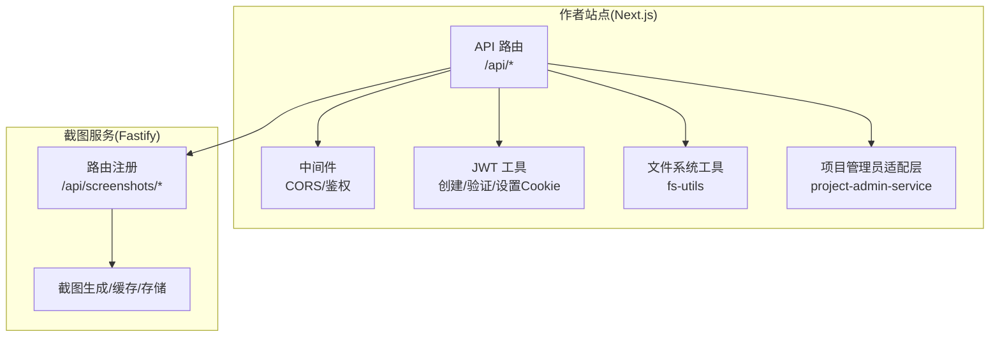
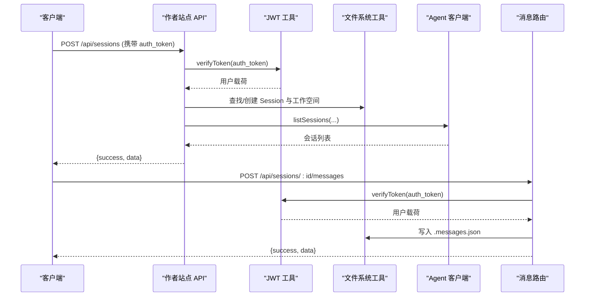
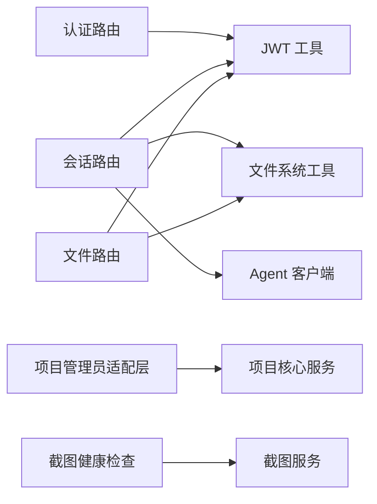

# REST API 接口

<cite>
**本文引用的文件**
- [packages/author-site/src/app/api/auth/login/route.ts](file://packages/author-site/src/app/api/auth/login/route.ts)
- [packages/author-site/src/app/api/auth/me/route.ts](file://packages/author-site/src/app/api/auth/me/route.ts)
- [packages/author-site/src/lib/auth/jwt.ts](file://packages/author-site/src/lib/auth/jwt.ts)
- [packages/author-site/src/middleware.ts](file://packages/author-site/src/middleware.ts)
- [packages/author-site/src/app/api/sessions/route.ts](file://packages/author-site/src/app/api/sessions/route.ts)
- [packages/author-site/src/app/api/sessions/[sessionId]/messages/route.ts](file://packages/author-site/src/app/api/sessions/[sessionId]/messages/route.ts)
- [packages/author-site/src/app/api/sessions/[sessionId]/files/route.ts](file://packages/author-site/src/app/api/sessions/[sessionId]/files/route.ts)
- [packages/author-site/src/components/ai-elements/chat/services/message-service.ts](file://packages/author-site/src/components/ai-elements/chat/services/message-service.ts)
- [packages/author-site/src/lib/project-admin-service.ts](file://packages/author-site/src/lib/project-admin-service.ts)
- [packages/author-site/src/app/api/demos/[id]/route.ts](file://packages/author-site/src/app/api/demos/[id]/route.ts)
- [packages/project-core/src/service.ts](file://packages/project-core/src/service.ts)
- [packages/author-site/src/app/api/screenshots/health/route.ts](file://packages/author-site/src/app/api/screenshots/health/route.ts)
- [packages/screenshot-service/src/routes/index.ts](file://packages/screenshot-service/src/routes/index.ts)
- [packages/screenshot-service/src/routes/screenshots.ts](file://packages/screenshot-service/src/routes/screenshots.ts)
- [docs/项目文档/创作端/06-基础设施/技术/01_路由设计.md](file://docs/项目文档/创作端/06-基础设施/技术/01_路由设计.md)
</cite>

## 目录
1. [简介](#简介)
2. [项目结构](#项目结构)
3. [核心组件](#核心组件)
4. [架构总览](#架构总览)
5. [详细组件分析](#详细组件分析)
6. [依赖分析](#依赖分析)
7. [性能考虑](#性能考虑)
8. [故障排查指南](#故障排查指南)
9. [结论](#结论)
10. [附录](#附录)

## 简介
本文件为 Workbench 平台的 REST API 接口规范，覆盖认证授权、项目管理（含版本控制）、会话管理（AI 对话与消息）、工作区文件操作以及截图服务。所有接口采用统一响应格式，支持基于 Cookie 的 JWT 认证，并给出错误码、状态码与最佳实践建议。

## 项目结构
Workbench 使用 Next.js App Router 提供 REST API，同时包含独立的截图服务（Fastify）。整体结构如下：

图表来源
- [packages/author-site/src/middleware.ts:1-43](file://packages/author-site/src/middleware.ts#L1-L43)
- [packages/author-site/src/lib/auth/jwt.ts:1-70](file://packages/author-site/src/lib/auth/jwt.ts#L1-L70)
- [packages/author-site/src/app/api/sessions/route.ts:1-211](file://packages/author-site/src/app/api/sessions/route.ts#L1-L211)
- [packages/author-site/src/lib/fs-utils.ts:1-800](file://packages/author-site/src/lib/fs-utils.ts#L1-L800)
- [packages/author-site/src/lib/project-admin-service.ts:1-56](file://packages/author-site/src/lib/project-admin-service.ts#L1-L56)
- [packages/screenshot-service/src/routes/index.ts:1-6](file://packages/screenshot-service/src/routes/index.ts#L1-L6)
- [packages/screenshot-service/src/routes/screenshots.ts:1-800](file://packages/screenshot-service/src/routes/screenshots.ts#L1-L800)

章节来源
- [docs/项目文档/创作端/06-基础设施/技术/01_路由设计.md:1-113](file://docs/项目文档/创作端/06-基础设施/技术/01_路由设计.md#L1-L113)

## 核心组件
- 认证与授权
  - 登录、获取当前用户信息、JWT 令牌签发与校验、Cookie 设置策略、CORS 配置。
- 会话管理
  - 创建/恢复编辑会话、列出会话、读取/保存会话消息、更新会话元数据。
- 工作区文件操作
  - 读取工作区多页面清单与文件、兼容单页写入、Live Workspace 变更通过权限客户端提交。
- 项目管理与版本控制
  - 项目 CRUD、Demo 资源、版本快照、发布提交等（由项目管理员服务与 core 服务实现）。
- 截图服务
  - 健康检查、批量/单页截图生成、渲染模式、优先级队列、缓存命中与指标统计。

章节来源
- [packages/author-site/src/app/api/auth/login/route.ts:1-48](file://packages/author-site/src/app/api/auth/login/route.ts#L1-L48)
- [packages/author-site/src/app/api/auth/me/route.ts:1-35](file://packages/author-site/src/app/api/auth/me/route.ts#L1-L35)
- [packages/author-site/src/lib/auth/jwt.ts:1-70](file://packages/author-site/src/lib/auth/jwt.ts#L1-L70)
- [packages/author-site/src/middleware.ts:1-43](file://packages/author-site/src/middleware.ts#L1-L43)
- [packages/author-site/src/app/api/sessions/route.ts:1-211](file://packages/author-site/src/app/api/sessions/route.ts#L1-L211)
- [packages/author-site/src/app/api/sessions/[sessionId]/messages/route.ts](file://packages/author-site/src/app/api/sessions/[sessionId]/messages/route.ts#L1-L107)
- [packages/author-site/src/app/api/sessions/[sessionId]/files/route.ts](file://packages/author-site/src/app/api/sessions/[sessionId]/files/route.ts#L1-L275)
- [packages/author-site/src/lib/project-admin-service.ts:1-56](file://packages/author-site/src/lib/project-admin-service.ts#L1-L56)
- [packages/project-core/src/service.ts:1945-1986](file://packages/project-core/src/service.ts#L1945-L1986)
- [packages/screenshot-service/src/routes/screenshots.ts:1-800](file://packages/screenshot-service/src/routes/screenshots.ts#L1-L800)

## 架构总览
下图展示一次“创建会话并保存消息”的典型调用链：

图表来源
- [packages/author-site/src/app/api/sessions/route.ts:70-179](file://packages/author-site/src/app/api/sessions/route.ts#L70-L179)
- [packages/author-site/src/app/api/sessions/[sessionId]/messages/route.ts](file://packages/author-site/src/app/api/sessions/[sessionId]/messages/route.ts#L1-L107)
- [packages/author-site/src/lib/auth/jwt.ts:1-70](file://packages/author-site/src/lib/auth/jwt.ts#L1-L70)
- [packages/author-site/src/lib/fs-utils.ts:1-800](file://packages/author-site/src/lib/fs-utils.ts#L1-L800)

## 详细组件分析

### 认证与授权
- 登录
  - 方法/路径：POST /api/auth/login
  - 请求体：用户名、密码（用户名会去除首尾空白）
  - 成功响应：返回用户基本信息；服务端设置 httpOnly Cookie（auth_token）
  - 失败响应：参数校验错误、凭据错误、内部错误
- 获取当前用户
  - 方法/路径：GET /api/auth/me
  - 认证：需要有效的 auth_token
  - 成功响应：返回用户 id、username
  - 失败响应：未登录、已过期、用户不存在
- 认证机制
  - JWT：HS256，默认有效期 7 天；生产环境默认启用 secure Cookie，可通过环境变量关闭
  - 中间件：CORS 白名单、受保护路由标记（如 /api/sessions）

章节来源
- [packages/author-site/src/app/api/auth/login/route.ts:1-48](file://packages/author-site/src/app/api/auth/login/route.ts#L1-L48)
- [packages/author-site/src/app/api/auth/me/route.ts:1-35](file://packages/author-site/src/app/api/auth/me/route.ts#L1-L35)
- [packages/author-site/src/lib/auth/jwt.ts:1-70](file://packages/author-site/src/lib/auth/jwt.ts#L1-L70)
- [packages/author-site/src/middleware.ts:1-43](file://packages/author-site/src/middleware.ts#L1-L43)

### 会话管理（AI 对话与消息）
- 创建/恢复会话
  - 方法/路径：POST /api/sessions
  - 认证：需要有效 auth_token
  - 请求体：projectId（必填），可选 forceNew、workspaceId
  - 行为：若存在活跃会话且未指定 workspaceId，则复用并推送模型与外部认证配置；否则新建会话并限制并发上限
  - 成功响应：返回 sessionId、workspaceId、代码与 schema、工作空间路径等
  - 失败响应：未登录、参数无效、项目不存在、内部错误
- 列出会话
  - 方法/路径：GET /api/sessions?status=&limit=&offset=
  - 行为：转发至 Agent 服务进行查询
  - 成功响应：会话列表
- 读取/保存会话消息
  - 方法/路径：GET/POST /api/sessions/:sessionId/messages
  - 认证：需要有效 auth_token
  - GET：返回 .messages.json 内容（不存在时返回空数组）
  - POST：接收 messages 数组并持久化
  - 失败响应：未登录、会话不存在、参数非法、读写失败
- 更新会话元数据（标题）
  - 方法/路径：PATCH /api/sessions/:sessionId/meta
  - 请求体：title
  - 说明：前端在首次用户消息后自动更新标题

章节来源
- [packages/author-site/src/app/api/sessions/route.ts:1-211](file://packages/author-site/src/app/api/sessions/route.ts#L1-L211)
- [packages/author-site/src/app/api/sessions/[sessionId]/messages/route.ts](file://packages/author-site/src/app/api/sessions/[sessionId]/messages/route.ts#L1-L107)
- [packages/author-site/src/components/ai-elements/chat/services/message-service.ts:1-52](file://packages/author-site/src/components/ai-elements/chat/services/message-service.ts#L1-L52)

### 工作区文件操作（Session 文件读写）
- 读取工作区文件与页面清单
  - 方法/路径：GET /api/sessions/:sessionId/files
  - 认证：无需（但需会话存在且未过期）
  - 成功响应：返回多页面文件清单、页面与文件夹元数据、工作空间路径
- 兼容写入（旧前端）
  - 方法/路径：PUT /api/sessions/:sessionId/files
  - 认证：需要有效 auth_token
  - 请求体：code 或 schema（至少一个）
  - 行为：将数据保存到第一个页面作为兼容；Live Workspace 通过权限客户端提交变更，分支工作空间直接写盘
  - 失败响应：未登录、会话不存在/过期、未绑定 workspaceId、无页面、写入失败
- 新前端推荐
  - 使用 PUT /api/sessions/:sessionId/files/:demoId 精确更新指定页面

章节来源
- [packages/author-site/src/app/api/sessions/[sessionId]/files/route.ts](file://packages/author-site/src/app/api/sessions/[sessionId]/files/route.ts#L1-L275)

### 项目管理（CRUD、版本控制）
- 项目 Demo 资源
  - 方法/路径：GET/DELETE /api/demos/:id
  - 行为：删除预览与执行计划（二次确认流程）
  - 成功响应：null
  - 失败响应：文件写入错误等
- 版本历史与发布提交
  - 能力：列出提交历史、创建发布提交（protected visibility）
  - 说明：由项目核心服务提供，API 层通过管理员适配层映射错误码与状态码
- 统一错误映射
  - 将内部错误码映射为对外 ErrorCodeType，并返回对应 HTTP 状态码

章节来源
- [packages/author-site/src/app/api/demos/[id]/route.ts](file://packages/author-site/src/app/api/demos/[id]/route.ts#L69-L109)
- [packages/project-core/src/service.ts:1945-1986](file://packages/project-core/src/service.ts#L1945-L1986)
- [packages/author-site/src/lib/project-admin-service.ts:1-56](file://packages/author-site/src/lib/project-admin-service.ts#L1-L56)

### 截图服务
- 健康检查
  - 方法/路径：GET /api/screenshots/health
  - 行为：代理到截图服务健康端点，异常时返回不可用或超时响应
- 截图生成与下载
  - 前缀：/api/screenshots
  - 能力：单页/批量生成、优先级队列、渲染模式（fast/strict）、缓存命中（编译/截图/并发）、指标统计
  - 关键参数：projectId、pageId、width/height、fullPage、priority、renderMode、force、sessionId 等
  - 输出：返回截图 URL、hash、耗时、是否命中缓存、渲染阶段耗时等

章节来源
- [packages/author-site/src/app/api/screenshots/health/route.ts:1-29](file://packages/author-site/src/app/api/screenshots/health/route.ts#L1-L29)
- [packages/screenshot-service/src/routes/index.ts:1-6](file://packages/screenshot-service/src/routes/index.ts#L1-L6)
- [packages/screenshot-service/src/routes/screenshots.ts:1-800](file://packages/screenshot-service/src/routes/screenshots.ts#L1-L800)

## 依赖分析
- 模块耦合
  - 作者站点 API 依赖 JWT 工具、文件系统工具、项目管理员适配层、Agent 客户端
  - 截图服务独立部署，通过 HTTP 被作者站点代理访问
- 外部依赖
  - Fastify（截图服务）
  - jose（JWT）
  - 文件系统（本地磁盘）
- 潜在循环依赖
  - 未见明显循环；API 层主要面向上层业务编排与错误映射

图表来源
- [packages/author-site/src/app/api/auth/login/route.ts:1-48](file://packages/author-site/src/app/api/auth/login/route.ts#L1-L48)
- [packages/author-site/src/app/api/sessions/route.ts:1-211](file://packages/author-site/src/app/api/sessions/route.ts#L1-L211)
- [packages/author-site/src/app/api/sessions/[sessionId]/files/route.ts](file://packages/author-site/src/app/api/sessions/[sessionId]/files/route.ts#L1-L275)
- [packages/author-site/src/lib/project-admin-service.ts:1-56](file://packages/author-site/src/lib/project-admin-service.ts#L1-L56)
- [packages/author-site/src/app/api/screenshots/health/route.ts:1-29](file://packages/author-site/src/app/api/screenshots/health/route.ts#L1-L29)

## 性能考虑
- 会话与文件
  - 避免频繁全量读取大文件；优先增量更新与分页
  - Live Workspace 写入走权限客户端，注意重试与幂等
- 截图服务
  - 利用编译缓存与截图缓存减少重复渲染
  - 合理设置 priority 与 renderMode，降低高负载时的排队等待
  - 关注 metrics 中的 compile/render/write 耗时分布

[本节为通用指导，不直接分析具体文件]

## 故障排查指南
- 常见错误码
  - UNAUTHORIZED：未登录或登录已过期
  - INVALID_REQUEST：参数缺失或类型不符
  - SESSION_NOT_FOUND：会话不存在
  - FILE_READ_ERROR/FILE_WRITE_ERROR：文件系统读写失败
  - FORBIDDEN：越权访问
  - AGENT_SERVICE_ERROR：下游服务异常
- 定位步骤
  - 检查 auth_token 是否存在且未过期
  - 核对请求体字段与类型
  - 查看日志中错误码与堆栈
  - 对截图服务，先调用健康检查确认可用性

章节来源
- [packages/author-site/src/app/api/sessions/[sessionId]/messages/route.ts](file://packages/author-site/src/app/api/sessions/[sessionId]/messages/route.ts#L1-L107)
- [packages/author-site/src/app/api/sessions/[sessionId]/files/route.ts](file://packages/author-site/src/app/api/sessions/[sessionId]/files/route.ts#L1-L275)
- [packages/author-site/src/lib/project-admin-service.ts:1-56](file://packages/author-site/src/lib/project-admin-service.ts#L1-L56)

## 结论
Workbench 的 REST API 以 Next.js Route Handlers 为核心，结合 JWT 认证、统一的响应结构与完善的错误映射，提供了从认证、会话、文件到截图的一体化能力。建议在集成时遵循统一响应格式、严格校验参数、合理使用缓存与优先级，并对敏感接口做好鉴权与限流。

[本节为总结性内容，不直接分析具体文件]

## 附录

### 统一响应格式
- 成功
  - { success: true, data: T }
- 失败
  - { success: false, error: { code, message, details? } }

章节来源
- [docs/项目文档/创作端/06-基础设施/技术/01_路由设计.md:117-172](file://docs/项目文档/创作端/06-基础设施/技术/01_路由设计.md#L117-L172)

### 认证与请求头
- 认证方式：Cookie（auth_token）
- 必要请求头：Content-Type: application/json（JSON 接口）
- CORS：允许 Origin、Methods、Headers 与 Credentials

章节来源
- [packages/author-site/src/middleware.ts:1-43](file://packages/author-site/src/middleware.ts#L1-L43)
- [packages/author-site/src/lib/auth/jwt.ts:1-70](file://packages/author-site/src/lib/auth/jwt.ts#L1-L70)

### 速率限制策略
- 会话并发限制：同一用户/项目下最多 N 个活跃会话（示例为 5）
- 截图服务：按优先级队列调度，支持 in-flight 合并与缓存命中

章节来源
- [packages/author-site/src/app/api/sessions/route.ts:160-164](file://packages/author-site/src/app/api/sessions/route.ts#L160-L164)
- [packages/screenshot-service/src/routes/screenshots.ts:1-800](file://packages/screenshot-service/src/routes/screenshots.ts#L1-L800)