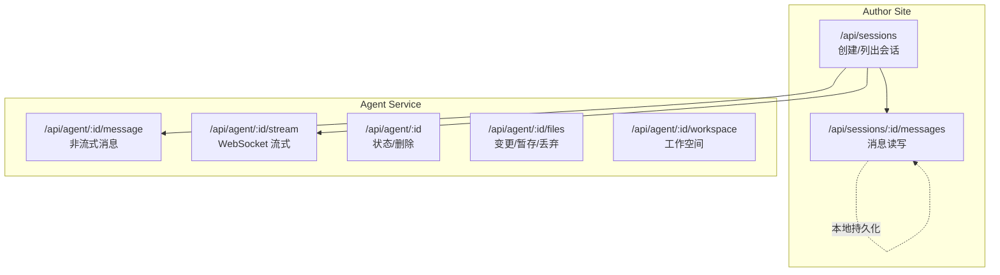
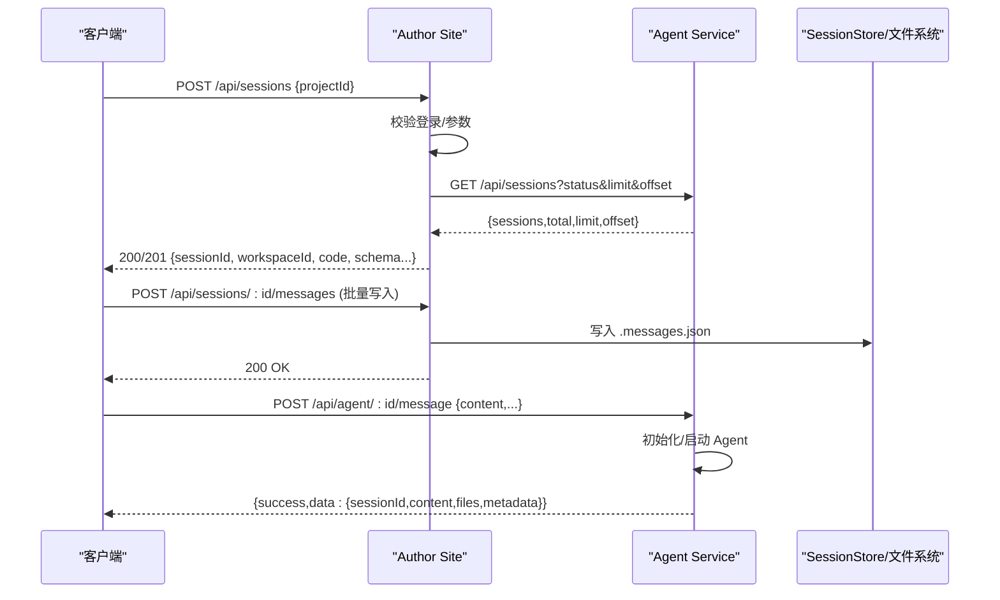
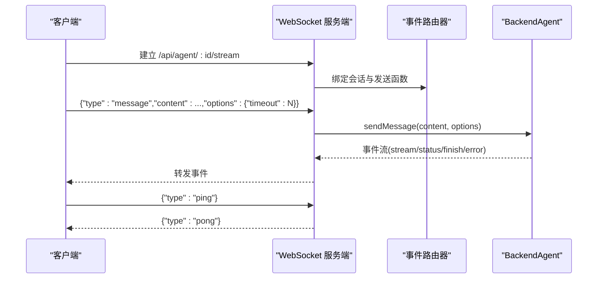
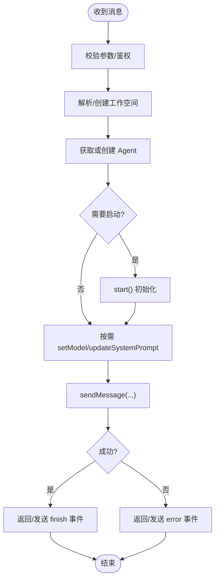
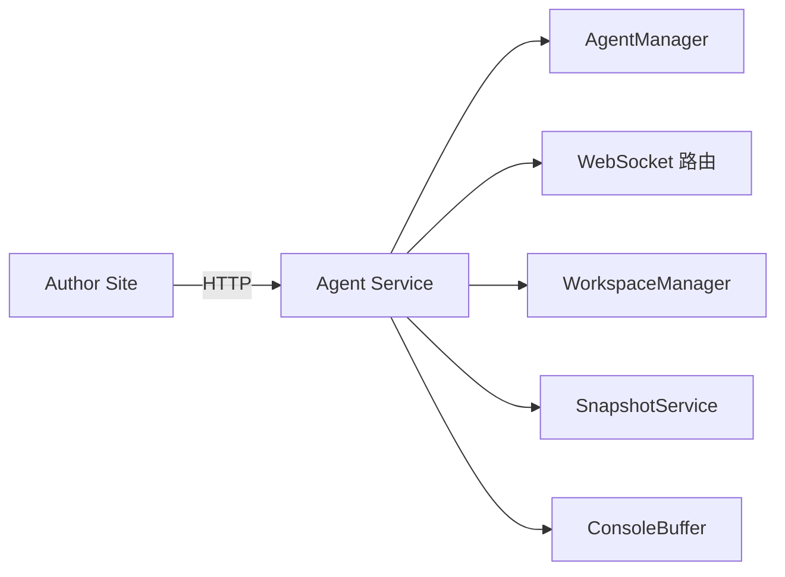

# 会话管理接口

<cite>
**本文引用的文件**
- [packages/author-site/src/app/api/sessions/route.ts](file://packages/author-site/src/app/api/sessions/route.ts)
- [packages/author-site/src/app/api/sessions/[sessionId]/messages/route.ts](file://packages/author-site/src/app/api/sessions/[sessionId]/messages/route.ts)
- [packages/agent-service/src/routes/agent.ts](file://packages/agent-service/src/routes/agent.ts)
- [packages/agent-service/src/routes/websocket.ts](file://packages/agent-service/src/routes/websocket.ts)
- [packages/agent-client/src/client.ts](file://packages/agent-client/src/client.ts)
- [packages/author-site/src/components/ai-elements/chat/services/stream-service.ts](file://packages/author-site/src/components/ai-elements/chat/services/stream-service.ts)
- [packages/shared/src/ai-error-normalizer.ts](file://packages/shared/src/ai-error-normalizer.ts)
- [docs/项目文档/独立Agent服务层/02-接口规范.md](file://docs/项目文档/独立Agent服务层/02-接口规范.md)
</cite>

## 目录
1. [简介](#简介)
2. [项目结构](#项目结构)
3. [核心组件](#核心组件)
4. [架构总览](#架构总览)
5. [详细组件分析](#详细组件分析)
6. [依赖分析](#依赖分析)
7. [性能考虑](#性能考虑)
8. [故障排查指南](#故障排查指南)
9. [结论](#结论)
10. [附录](#附录)

## 简介
本文件为 Workbench 平台的 AI 会话管理 REST API 与 WebSocket 实时通信的权威文档。内容覆盖：
- 会话创建、删除、列表查询
- 消息发送（REST 非流式）、历史读取与持久化
- 会话状态管理与上下文信息
- 自然语言指令处理流程、AI 模型调用接口
- 流式响应处理与错误重试机制
- 工具调用能力与权限交互
- 完整的请求/响应示例与 WebSocket 协议说明

## 项目结构
Workbench 的会话管理由两层组成：
- author-site（Next.js）：对外暴露 REST 端点，负责鉴权、会话元数据与消息持久化、代理转发到 agent-service
- agent-service（Fastify）：实现 Agent 生命周期、工作空间快照、模型调用、WebSocket 流式事件路由

图表来源
- [packages/author-site/src/app/api/sessions/route.ts:70-179](file://packages/author-site/src/app/api/sessions/route.ts#L70-L179)
- [packages/author-site/src/app/api/sessions/[sessionId]/messages/route.ts:14-107](file://packages/author-site/src/app/api/sessions/[sessionId]/messages/route.ts#L14-L107)
- [packages/agent-service/src/routes/agent.ts:101-366](file://packages/agent-service/src/routes/agent.ts#L101-L366)
- [packages/agent-service/src/routes/websocket.ts:134-206](file://packages/agent-service/src/routes/websocket.ts#L134-L206)

章节来源
- [packages/author-site/src/app/api/sessions/route.ts:70-210](file://packages/author-site/src/app/api/sessions/route.ts#L70-L210)
- [packages/author-site/src/app/api/sessions/[sessionId]/messages/route.ts:14-107](file://packages/author-site/src/app/api/sessions/[sessionId]/messages/route.ts#L14-L107)
- [packages/agent-service/src/routes/agent.ts:101-366](file://packages/agent-service/src/routes/agent.ts#L101-L366)
- [packages/agent-service/src/routes/websocket.ts:134-206](file://packages/agent-service/src/routes/websocket.ts#L134-L206)

## 核心组件
- 会话管理（author-site）
  - POST /api/sessions：创建或复用会话，返回工作区与代码片段等上下文
  - GET /api/sessions：分页列出会话（通过 agent-service）
  - DELETE /api/sessions/:id：删除会话（由前端调用）
- 消息历史（author-site）
  - GET /api/sessions/:id/messages：读取会话消息历史
  - POST /api/sessions/:id/messages：批量写入消息历史
- Agent 服务（agent-service）
  - POST /api/agent/:id/message：非流式消息发送
  - GET /api/agent/:id：获取会话状态
  - DELETE /api/agent/:id：销毁会话并清理资源
  - GET /api/agent/:id/files：查看工作区变更
  - POST /api/agent/:id/rollback：回滚变更
  - GET/PUT /api/agent/:id/workspace：获取/切换工作空间
  - POST /api/agent/:id/files/stage：暂存变更
  - POST /api/agent/:id/files/discard：丢弃变更
  - GET /api/agent/:id/stream：WebSocket 流式通道
  - GET /api/tools/capabilities：工具能力清单

章节来源
- [packages/author-site/src/app/api/sessions/route.ts:70-210](file://packages/author-site/src/app/api/sessions/route.ts#L70-L210)
- [packages/author-site/src/app/api/sessions/[sessionId]/messages/route.ts:14-107](file://packages/author-site/src/app/api/sessions/[sessionId]/messages/route.ts#L14-L107)
- [packages/agent-service/src/routes/agent.ts:94-646](file://packages/agent-service/src/routes/agent.ts#L94-L646)
- [packages/agent-service/src/routes/websocket.ts:134-206](file://packages/agent-service/src/routes/websocket.ts#L134-L206)

## 架构总览
以下序列图展示“创建会话 + 发送消息”的典型端到端流程：

图表来源
- [packages/author-site/src/app/api/sessions/route.ts:70-179](file://packages/author-site/src/app/api/sessions/route.ts#L70-L179)
- [packages/author-site/src/app/api/sessions/[sessionId]/messages/route.ts:59-107](file://packages/author-site/src/app/api/sessions/[sessionId]/messages/route.ts#L59-L107)
- [packages/agent-service/src/routes/agent.ts:101-246](file://packages/agent-service/src/routes/agent.ts#L101-L246)

## 详细组件分析

### REST 端点：会话管理
- POST /api/sessions
  - 鉴权：Cookie JWT；未登录/过期返回 401
  - 入参：{ demoId(projectId), forceNew?, workspaceId? }
  - 行为：
    - 若存在活跃会话且未指定 workspaceId，则复用该会话并返回当前工作区与代码片段
    - 否则创建新编辑会话，推送用户模型配置与外部认证配置，限制最大并发会话数
  - 出参：{ sessionId, workspaceId, workspaceScope, isSharedWorkspace, code, schema, workspacePath, tempWorkspace }
  - 错误码：UNAUTHORIZED、INVALID_REQUEST、PROJECT_NOT_FOUND、FILE_WRITE_ERROR
- GET /api/sessions
  - 查询参数：status?, limit?, offset?
  - 行为：透传到 agent-service 的 /api/sessions 进行分页过滤
  - 出参：{ sessions[], total, limit, offset }
  - 错误码：AGENT_SERVICE_ERROR、FILE_READ_ERROR
- DELETE /api/sessions/:id
  - 行为：删除会话（前端侧调用）
  - 错误码：SESSION_NOT_FOUND、FILE_WRITE_ERROR

章节来源
- [packages/author-site/src/app/api/sessions/route.ts:70-210](file://packages/author-site/src/app/api/sessions/route.ts#L70-L210)

### REST 端点：消息历史
- GET /api/sessions/:id/messages
  - 鉴权：Cookie JWT
  - 行为：从会话目录读取 .messages.json，不存在则返回空数组
  - 出参：ChatMessage[]
  - 错误码：SESSION_NOT_FOUND、FILE_READ_ERROR
- POST /api/sessions/:id/messages
  - 鉴权：Cookie JWT
  - 入参：{ messages: ChatMessage[] }
  - 行为：覆写写入 .messages.json
  - 错误码：SESSION_NOT_FOUND、INVALID_REQUEST、FILE_WRITE_ERROR

章节来源
- [packages/author-site/src/app/api/sessions/[sessionId]/messages/route.ts:14-107](file://packages/author-site/src/app/api/sessions/[sessionId]/messages/route.ts#L14-L107)

### REST 端点：Agent 消息与会话
- POST /api/agent/:sessionId/message
  - 入参关键字段：content、model、systemPrompt、images、files、options.timeout、options.stream、workingDir、customWorkspace、demoId、projectId
  - 行为：
    - 解析/创建工作空间，初始化或复用 Agent
    - 支持动态设置 model、注入静态 systemPrompt
    - 更新 SessionStore 状态为 processing/ready/error
    - 返回 data.sessionId、data.content、data.files、data.metadata
  - 错误码：INVALID_PARAMS、MESSAGE_SEND_ERROR、AGENT_BUSY(409)
- GET /api/agent/:sessionId
  - 返回 Agent 当前状态信息
- DELETE /api/agent/:sessionId
  - 清理临时工作空间、快照、控制台缓冲，删除会话配置
- GET /api/agent/:sessionId/files
  - 返回 staged/unstaged 变更列表
- POST /api/agent/:sessionId/rollback
  - 支持按文件或全量回撤，并重新初始化快照
- GET/PUT /api/agent/:sessionId/workspace
  - 获取/切换工作空间，含路径安全校验与快照初始化
- POST /api/agent/:sessionId/files/stage
  - 暂存指定文件变更
- POST /api/agent/:sessionId/files/discard
  - 丢弃指定文件变更
- GET /api/tools/capabilities
  - 返回 Pi Tools 版本与工具名列表

章节来源
- [packages/agent-service/src/routes/agent.ts:94-646](file://packages/agent-service/src/routes/agent.ts#L94-L646)
- [docs/项目文档/独立Agent服务层/02-接口规范.md:26-72](file://docs/项目文档/独立Agent服务层/02-接口规范.md#L26-L72)

### WebSocket 流式协议
- 连接建立
  - 端点：GET /api/agent/:sessionId/stream（websocket: true）
  - 服务端维护心跳与空闲超时，自动关闭长时间无 ping 的连接
- 客户端消息类型
  - message：发送自然语言消息，支持 images、files、systemPrompt、options.timeout/resumeSessionId
  - cancel：取消当前运行中的请求
  - resume：恢复指定 sessionId 的会话
  - set_model/get_models：设置/获取可用模型列表
  - permission_response/user_choice_response：权限确认与需求选择
  - console_data：辅助日志通道
  - ping/pong：心跳
- 服务端事件类型
  - status：initializing/processing/ready
  - stream：增量内容片段
  - finish：完成，包含 content、files、metadata
  - error：错误，包含 code、message、retryable
  - models：模型列表与当前模型
  - pong：心跳响应
- 超时与进度
  - 显式消息超时：客户端可传入 options.timeout，服务端在 MIN/MAX 范围内钳制
  - 进度心跳：周期性发送 status=processing 保持长连接活性
- 错误与重试
  - AGENT_BUSY：上一轮仍在运行，需等待或先 cancel
  - MESSAGE_TIMEOUT：达到显式上限后自动取消，标记 retryable=true
  - 其他错误：根据错误分类生成用户友好提示

图表来源
- [packages/agent-service/src/routes/websocket.ts:134-206](file://packages/agent-service/src/routes/websocket.ts#L134-L206)
- [packages/agent-service/src/routes/websocket.ts:208-486](file://packages/agent-service/src/routes/websocket.ts#L208-L486)
- [packages/agent-client/src/client.ts:380-408](file://packages/agent-client/src/client.ts#L380-L408)
- [packages/author-site/src/components/ai-elements/chat/services/stream-service.ts:185-212](file://packages/author-site/src/components/ai-elements/chat/services/stream-service.ts#L185-L212)

### 自然语言指令处理流程
- 入口：REST 非流式或 WebSocket 流式
- 步骤：
  1) 校验与准备：鉴权、参数校验、工作空间解析/创建
  2) Agent 生命周期：getOrCreate -> start（必要时）-> setModel/updateSystemPrompt
  3) 执行：sendMessage 并记录 SessionStore 状态
  4) 结果：返回 content/files/metadata 或通过 stream/finish 事件下发
  5) 收尾：清理定时器、释放资源、同步最终状态

图表来源
- [packages/agent-service/src/routes/agent.ts:101-246](file://packages/agent-service/src/routes/agent.ts#L101-L246)
- [packages/agent-service/src/routes/websocket.ts:208-486](file://packages/agent-service/src/routes/websocket.ts#L208-L486)

### 多轮对话与会话上下文
- 多轮对话：通过同一 sessionId 持续发送 message 事件或调用非流式接口，Agent 内部维护上下文
- 上下文注入：
  - 静态 systemPrompt：可在首次或每轮前注入（v3.2）
  - 动态上下文：作者端将 L3 上下文拼接到 content 头部
  - 工作空间快照：支持 staged/unstaged 变更感知与回滚
- 会话状态：
  - ready/processing/error 三种状态，由 SessionStore 维护
  - 支持 resume 恢复已存在的会话

章节来源
- [packages/agent-service/src/routes/websocket.ts:208-332](file://packages/agent-service/src/routes/websocket.ts#L208-L332)
- [packages/agent-service/src/routes/agent.ts:189-192](file://packages/agent-service/src/routes/agent.ts#L189-L192)

### 工具调用接口
- 能力查询：GET /api/tools/capabilities
- 工具执行：由 Agent 内部驱动，结合工作空间快照与权限确认（permission_response）
- 权限交互：
  - 服务端发出权限询问
  - 客户端通过 permission_response 回复 allow_once 或其他选项
  - 支持 user_choice_response 进行需求确认

章节来源
- [packages/agent-service/src/routes/agent.ts:94-99](file://packages/agent-service/src/routes/agent.ts#L94-L99)
- [packages/agent-service/src/routes/websocket.ts:723-797](file://packages/agent-service/src/routes/websocket.ts#L723-L797)

### 错误处理与重试机制
- 统一错误归一化：将不同来源的错误转换为标准结构，提供用户可读提示
- 常见错误类别：connection、timeout、auth、quota、busy、cancelled、server、unknown
- 重试建议：
  - AGENT_BUSY：等待或先 cancel
  - MESSAGE_TIMEOUT：可重试，注意控制频率
  - 网络/鉴权类错误：提示用户检查网络或配置

章节来源
- [packages/shared/src/ai-error-normalizer.ts:1-156](file://packages/shared/src/ai-error-normalizer.ts#L1-L156)
- [packages/agent-service/src/routes/websocket.ts:419-445](file://packages/agent-service/src/routes/websocket.ts#L419-L445)

## 依赖分析
- author-site 对 agent-service 的依赖
  - 会话列表：/api/sessions 透传
  - 消息发送：POST /api/agent/:id/message
  - 流式通道：GET /api/agent/:id/stream
- agent-service 内部依赖
  - AgentManager：会话级 Agent 实例管理、空闲回收
  - Workspace/Snapshot：工作空间与快照管理
  - ConsoleBuffer：控制台日志缓冲
  - Model Manager：模型能力与密钥解析

图表来源
- [packages/agent-service/src/core/agent-manager.ts:44-77](file://packages/agent-service/src/core/agent-manager.ts#L44-L77)
- [packages/agent-service/src/routes/agent.ts:94-366](file://packages/agent-service/src/routes/agent.ts#L94-L366)
- [packages/agent-service/src/routes/websocket.ts:134-206](file://packages/agent-service/src/routes/websocket.ts#L134-L206)

章节来源
- [packages/agent-service/src/core/agent-manager.ts:44-77](file://packages/agent-service/src/core/agent-manager.ts#L44-L77)
- [packages/agent-service/src/routes/agent.ts:94-366](file://packages/agent-service/src/routes/agent.ts#L94-L366)
- [packages/agent-service/src/routes/websocket.ts:134-206](file://packages/agent-service/src/routes/websocket.ts#L134-L206)

## 性能考虑
- 流式传输优先：长任务使用 WebSocket 流式，避免大响应体阻塞
- 显式超时控制：客户端合理设置 options.timeout，服务端在安全区间内钳制
- 心跳保活：定期 ping/pong 与 progress 心跳，防止中间设备断开
- 工作空间快照：仅对比变更集，减少 IO 开销
- 并发控制：AGENT_BUSY 保护，避免重复进入

[本节为通用指导，不直接分析具体文件]

## 故障排查指南
- 无法建立 WebSocket
  - 检查路由是否启用 websocket: true
  - 检查防火墙/网关是否允许 ws/wss
- 连接频繁断开
  - 检查客户端是否定时发送 ping
  - 检查服务端心跳与空闲超时配置
- 消息发送失败
  - 关注 error.code 与 retryable 字段
  - 若是 AGENT_BUSY，先 cancel 再重试
  - 若是 MESSAGE_TIMEOUT，适当增大 timeout 或拆分任务
- 权限/需求确认无响应
  - 确保正确发送 permission_response/user_choice_response
  - 核对 requestId/permissionId/optionId 一致性

章节来源
- [packages/agent-service/src/routes/websocket.ts:134-206](file://packages/agent-service/src/routes/websocket.ts#L134-L206)
- [packages/agent-service/src/routes/websocket.ts:419-486](file://packages/agent-service/src/routes/websocket.ts#L419-L486)
- [packages/agent-service/src/routes/websocket.ts:723-797](file://packages/agent-service/src/routes/websocket.ts#L723-L797)

## 结论
本接口体系以 author-site 作为统一入口，agent-service 承载 Agent 运行时与流式事件分发，配合工作空间快照与权限交互，形成完整的 AI 会话管理能力。通过统一的错误归一化与显式超时控制，提升了稳定性与可观测性。

[本节为总结性内容，不直接分析具体文件]

## 附录

### 请求/响应示例（摘要）
- 创建会话
  - POST /api/sessions
  - 请求体：{ demoId: string, forceNew?: boolean, workspaceId?: string }
  - 响应体：{ success: true, data: { sessionId, workspaceId, workspaceScope, isSharedWorkspace, code, schema, workspacePath, tempWorkspace } }
- 列出会话
  - GET /api/sessions?status=&limit=&offset=
  - 响应体：{ success: true, data: { sessions: [], total, limit, offset } }
- 发送消息（非流式）
  - POST /api/agent/:sessionId/message
  - 请求体：{ content, model?, systemPrompt?, images?, files?, options?: { timeout?, stream? }, workingDir?, customWorkspace?, projectId?, demoId? }
  - 响应体：{ success: true, data: { sessionId, content, files, metadata } }
- 读取消息历史
  - GET /api/sessions/:sessionId/messages
  - 响应体：{ success: true, data: ChatMessage[] }
- 写入消息历史
  - POST /api/sessions/:sessionId/messages
  - 请求体：{ messages: ChatMessage[] }
  - 响应体：{ success: true, data: null }

章节来源
- [packages/author-site/src/app/api/sessions/route.ts:70-210](file://packages/author-site/src/app/api/sessions/route.ts#L70-L210)
- [packages/author-site/src/app/api/sessions/[sessionId]/messages/route.ts:14-107](file://packages/author-site/src/app/api/sessions/[sessionId]/messages/route.ts#L14-L107)
- [packages/agent-service/src/routes/agent.ts:101-246](file://packages/agent-service/src/routes/agent.ts#L101-L246)

### WebSocket 消息类型速查
- 客户端 -> 服务端
  - message、cancel、resume、set_model、get_models、permission_response、user_choice_response、console_data、ping
- 服务端 -> 客户端
  - status、stream、finish、error、models、pong

章节来源
- [packages/agent-service/src/routes/websocket.ts:39-67](file://packages/agent-service/src/routes/websocket.ts#L39-L67)
- [packages/agent-service/src/routes/websocket.ts:208-486](file://packages/agent-service/src/routes/websocket.ts#L208-L486)