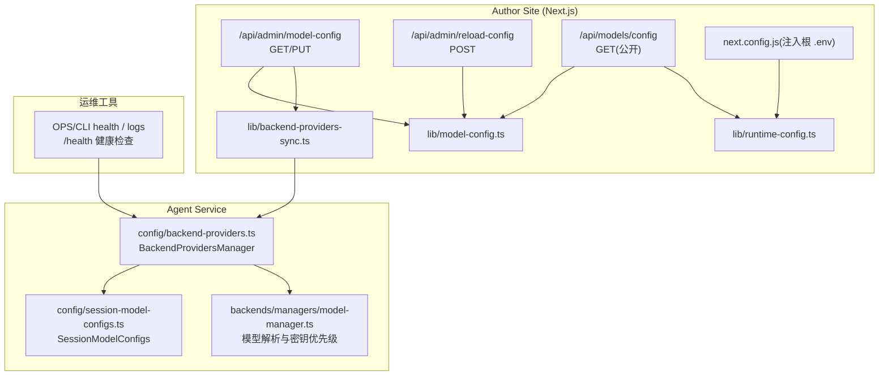
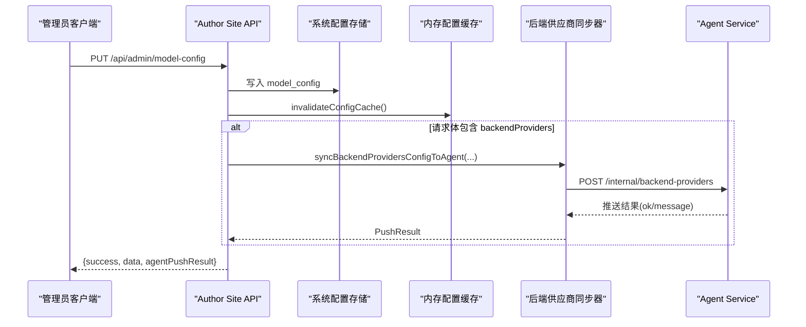
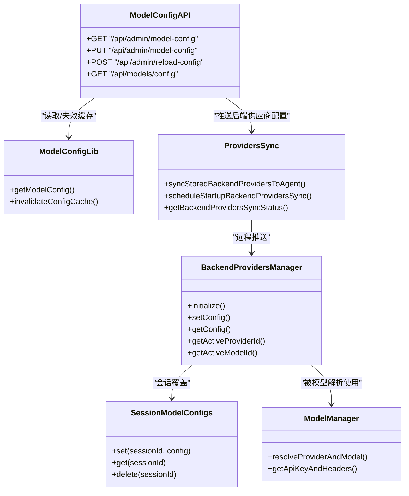

# 内部配置接口

<cite>
**本文引用的文件**   
- [packages/author-site/src/app/api/admin/model-config/route.ts](file://packages/author-site/src/app/api/admin/model-config/route.ts)
- [packages/author-site/src/app/api/admin/reload-config/route.ts](file://packages/author-site/src/app/api/admin/reload-config/route.ts)
- [packages/author-site/src/app/api/models/config/route.ts](file://packages/author-site/src/app/api/models/config/route.ts)
- [packages/author-site/src/lib/model-config.ts](file://packages/author-site/src/lib/model-config.ts)
- [packages/author-site/src/lib/backend-providers-sync.ts](file://packages/author-site/src/lib/backend-providers-sync.ts)
- [packages/agent-service/src/config/backend-providers.ts](file://packages/agent-service/src/config/backend-providers.ts)
- [packages/agent-service/src/config/session-model-configs.ts](file://packages/agent-service/src/config/session-model-configs.ts)
- [packages/agent-service/src/backends/managers/model-manager.ts](file://packages/agent-service/src/backends/managers/model-manager.ts)
- [packages/author-site/src/lib/runtime-config.ts](file://packages/author-site/src/lib/runtime-config.ts)
- [packages/author-site/next.config.js](file://packages/author-site/next.config.js)
- [scripts/deploy.sh](file://scripts/deploy.sh)
- [OPS/CLI/src/commands/health.ts](file://OPS/CLI/src/commands/health.ts)
- [OPS/CLI/src/commands/logs.ts](file://OPS/CLI/src/commands/logs.ts)
</cite>

## 目录
1. [简介](#简介)
2. [项目结构](#项目结构)
3. [核心组件](#核心组件)
4. [架构总览](#架构总览)
5. [详细组件分析](#详细组件分析)
6. [依赖关系分析](#依赖关系分析)
7. [性能与一致性](#性能与一致性)
8. [故障排查指南](#故障排查指南)
9. [结论](#结论)
10. [附录：环境变量与部署要点](#附录环境变量与部署要点)

## 简介
本文件为 Workbench 平台“内部配置管理”的 REST API 文档，覆盖系统配置、模型配置、AI 后端供应商（服务发现）同步、动态加载与热更新机制、配置校验与回滚策略、健康检查与监控指标暴露等。读者可据此完成管理员端配置变更、前端只读读取、以及 agent-service 运行时热更新的端到端集成。

## 项目结构
围绕配置管理的代码主要分布在 author-site（Next.js 服务端路由与库）、agent-service（运行时配置管理与会话级配置），以及运维 CLI 的健康检查脚本中。

图表来源
- [packages/author-site/src/app/api/admin/model-config/route.ts:1-353](file://packages/author-site/src/app/api/admin/model-config/route.ts#L1-L353)
- [packages/author-site/src/app/api/admin/reload-config/route.ts:1-45](file://packages/author-site/src/app/api/admin/reload-config/route.ts#L1-L45)
- [packages/author-site/src/app/api/models/config/route.ts:1-67](file://packages/author-site/src/app/api/models/config/route.ts#L1-L67)
- [packages/author-site/src/lib/model-config.ts:1-219](file://packages/author-site/src/lib/model-config.ts#L1-L219)
- [packages/author-site/src/lib/backend-providers-sync.ts:1-283](file://packages/author-site/src/lib/backend-providers-sync.ts#L1-L283)
- [packages/agent-service/src/config/backend-providers.ts:1-188](file://packages/agent-service/src/config/backend-providers.ts#L1-L188)
- [packages/agent-service/src/config/session-model-configs.ts:1-27](file://packages/agent-service/src/config/session-model-configs.ts#L1-L27)
- [packages/agent-service/src/backends/managers/model-manager.ts:198-230](file://packages/agent-service/src/backends/managers/model-manager.ts#L198-L230)
- [packages/author-site/src/lib/runtime-config.ts:46-79](file://packages/author-site/src/lib/runtime-config.ts#L46-L79)
- [packages/author-site/next.config.js:1-24](file://packages/author-site/next.config.js#L1-L24)
- [OPS/CLI/src/commands/health.ts:1-54](file://OPS/CLI/src/commands/health.ts#L1-L54)
- [OPS/CLI/src/commands/logs.ts:138-160](file://OPS/CLI/src/commands/logs.ts#L138-L160)

章节来源
- [packages/author-site/src/app/api/admin/model-config/route.ts:1-353](file://packages/author-site/src/app/api/admin/model-config/route.ts#L1-L353)
- [packages/author-site/src/app/api/admin/reload-config/route.ts:1-45](file://packages/author-site/src/app/api/admin/reload-config/route.ts#L1-L45)
- [packages/author-site/src/app/api/models/config/route.ts:1-67](file://packages/author-site/src/app/api/models/config/route.ts#L1-L67)
- [packages/author-site/src/lib/model-config.ts:1-219](file://packages/author-site/src/lib/model-config.ts#L1-L219)
- [packages/author-site/src/lib/backend-providers-sync.ts:1-283](file://packages/author-site/src/lib/backend-providers-sync.ts#L1-L283)
- [packages/agent-service/src/config/backend-providers.ts:1-188](file://packages/agent-service/src/config/backend-providers.ts#L1-L188)
- [packages/agent-service/src/config/session-model-configs.ts:1-27](file://packages/agent-service/src/config/session-model-configs.ts#L1-L27)
- [packages/agent-service/src/backends/managers/model-manager.ts:198-230](file://packages/agent-service/src/backends/managers/model-manager.ts#L198-L230)
- [packages/author-site/src/lib/runtime-config.ts:46-79](file://packages/author-site/src/lib/runtime-config.ts#L46-L79)
- [packages/author-site/next.config.js:1-24](file://packages/author-site/next.config.js#L1-L24)
- [OPS/CLI/src/commands/health.ts:1-54](file://OPS/CLI/src/commands/health.ts#L1-L54)
- [OPS/CLI/src/commands/logs.ts:138-160](file://OPS/CLI/src/commands/logs.ts#L138-L160)

## 核心组件
- 模型配置 API（管理员）
  - GET /api/admin/model-config：获取当前模型配置（数据库优先，无则回退环境变量）。
  - PUT /api/admin/model-config：更新模型配置（支持部分字段更新；自动规范化新旧结构；可选推送 backendProviders 到 agent-service）。
- 配置缓存失效 API（管理员）
  - POST /api/admin/reload-config：清除内存配置缓存，使新配置立即生效。
- 模型配置公开 API（登录用户）
  - GET /api/models/config：返回合并后的模型配置（包含用户级 provider 前缀增强）。
- AI 后端供应商管理器（agent-service）
  - 启动时从环境变量 PI_AGENT_PROVIDERS 加载；运行时通过 author-site 推送进行热更新。
- 会话级模型配置（agent-service）
  - 按会话维度保存/读取后端供应商配置，用于会话内覆盖全局配置。
- 模型解析与密钥优先级（agent-service）
  - 解析 provider/model，并确定最终使用的 apiKey。

章节来源
- [packages/author-site/src/app/api/admin/model-config/route.ts:1-353](file://packages/author-site/src/app/api/admin/model-config/route.ts#L1-L353)
- [packages/author-site/src/app/api/admin/reload-config/route.ts:1-45](file://packages/author-site/src/app/api/admin/reload-config/route.ts#L1-L45)
- [packages/author-site/src/app/api/models/config/route.ts:1-67](file://packages/author-site/src/app/api/models/config/route.ts#L1-L67)
- [packages/author-site/src/lib/model-config.ts:1-219](file://packages/author-site/src/lib/model-config.ts#L1-L219)
- [packages/agent-service/src/config/backend-providers.ts:1-188](file://packages/agent-service/src/config/backend-providers.ts#L1-L188)
- [packages/agent-service/src/config/session-model-configs.ts:1-27](file://packages/agent-service/src/config/session-model-configs.ts#L1-L27)
- [packages/agent-service/src/backends/managers/model-manager.ts:198-230](file://packages/agent-service/src/backends/managers/model-manager.ts#L198-L230)

## 架构总览
下图展示了管理员更新模型配置后，如何持久化、刷新缓存、并推送到 agent-service 实现热更新的全链路。

图表来源
- [packages/author-site/src/app/api/admin/model-config/route.ts:176-353](file://packages/author-site/src/app/api/admin/model-config/route.ts#L176-L353)
- [packages/author-site/src/lib/model-config.ts:206-208](file://packages/author-site/src/lib/model-config.ts#L206-L208)
- [packages/author-site/src/lib/backend-providers-sync.ts:207-236](file://packages/author-site/src/lib/backend-providers-sync.ts#L207-L236)
- [packages/agent-service/src/config/backend-providers.ts:96-113](file://packages/agent-service/src/config/backend-providers.ts#L96-L113)

## 详细组件分析

### 管理员模型配置接口
- 端点
  - GET /api/admin/model-config
  - PUT /api/admin/model-config
- 鉴权
  - 需要管理员凭据（由 verifyAdminRequest 校验）。
- 行为
  - GET：从数据库读取 model_config；若不存在，返回基于环境变量的默认值。
  - PUT：支持部分更新 frontend、backendProviders、multimodalModels；自动将提交的新旧结构互相补齐；当包含 backendProviders 时，自动将启用供应商的前缀规则加入 frontend.autoEnableRules 与 allowedPrefixes；写入数据库后清除内存缓存；如包含 backendProviders，则异步推送到 agent-service。
- 错误码
  - 401：未授权
  - 400：参数校验失败（例如字段类型不合法或请求体为空）
  - 500：内部错误
- 响应示例（字段说明）
  - success: boolean
  - data: ModelConfigData（见下方数据模型）
  - message: string（更新成功时的提示）
  - agentPushResult: { ok: boolean; message: string } | null（推送结果）

章节来源
- [packages/author-site/src/app/api/admin/model-config/route.ts:138-173](file://packages/author-site/src/app/api/admin/model-config/route.ts#L138-L173)
- [packages/author-site/src/app/api/admin/model-config/route.ts:179-353](file://packages/author-site/src/app/api/admin/model-config/route.ts#L179-L353)

### 配置缓存失效接口
- 端点
  - POST /api/admin/reload-config
- 鉴权
  - 需要管理员凭据。
- 行为
  - 调用 invalidateConfigCache() 清空内存缓存，确保后续读取走数据库。
- 错误码
  - 401：未授权
  - 500：内部错误

章节来源
- [packages/author-site/src/app/api/admin/reload-config/route.ts:14-44](file://packages/author-site/src/app/api/admin/reload-config/route.ts#L14-L44)
- [packages/author-site/src/lib/model-config.ts:206-208](file://packages/author-site/src/lib/model-config.ts#L206-L208)

### 公开模型配置接口（登录用户）
- 端点
  - GET /api/models/config
- 鉴权
  - 需要登录用户（JWT Cookie 校验）。
- 行为
  - 读取全局模型配置；若当前用户存在用户级 backendProviders，则将启用的供应商 ID 前缀合并入 autoEnableRules 与 allowedPrefixes，从而在 UI 中可见。
- 错误码
  - 500：内部错误

章节来源
- [packages/author-site/src/app/api/models/config/route.ts:18-66](file://packages/author-site/src/app/api/models/config/route.ts#L18-L66)

### AI 后端供应商管理器（agent-service）
- 职责
  - 维护全局 BackendProvidersConfig；提供 setConfig/getConfig/getActiveProviderId/getActiveModelId 等方法。
- 初始化与热更新
  - initialize()：启动时从环境变量 PI_AGENT_PROVIDERS 加载；若无则等待 author-site 推送。
  - setConfig()：运行时接收 author-site 推送的配置，直接替换内存中的配置，实现热更新。
- 激活模型选择
  - getActiveModelId()：优先使用 activeModelId；否则取 activeProviderId 对应的 defaultModel 或 models[0]。
- 模型列表
  - getProviderModels(providerId)：返回统一格式的模型列表（id 形如 providerId/modelId）。

章节来源
- [packages/agent-service/src/config/backend-providers.ts:28-47](file://packages/agent-service/src/config/backend-providers.ts#L28-L47)
- [packages/agent-service/src/config/backend-providers.ts:96-113](file://packages/agent-service/src/config/backend-providers.ts#L96-L113)
- [packages/agent-service/src/config/backend-providers.ts:137-162](file://packages/agent-service/src/config/backend-providers.ts#L137-L162)
- [packages/agent-service/src/config/backend-providers.ts:169-177](file://packages/agent-service/src/config/backend-providers.ts#L169-L177)

### 会话级模型配置（agent-service）
- 职责
  - 以 Map 形式按 sessionId 保存/读取 BackendProvidersConfig，用于会话覆盖。
- 典型用法
  - 在创建会话时设置，会话结束时删除。

章节来源
- [packages/agent-service/src/config/session-model-configs.ts:1-27](file://packages/agent-service/src/config/session-model-configs.ts#L1-L27)

### 模型解析与密钥优先级（agent-service）
- 行为
  - resolveProviderAndModel() 解析当前会话的 provider 与 model。
  - getApiKeyAndHeaders() 决定最终使用的 apiKey，优先级顺序：providerConfig.apiKey > model.apiKey > piAgent.apiKey > 环境变量 > 服务配置。
- 影响
  - 决定了实际调用外部 LLM 时使用的凭证来源。

章节来源
- [packages/agent-service/src/backends/managers/model-manager.ts:198-230](file://packages/agent-service/src/backends/managers/model-manager.ts#L198-L230)

### 配置同步与重试（author-site）
- 职责
  - 负责将 model_config.backendProviders 推送到 agent-service，并提供状态查询与指数退避重试。
- 关键流程
  - syncStoredBackendProvidersToAgent(source, options)：从数据库读取最新配置并推送。
  - scheduleStartupBackendProvidersSync()：服务启动延迟后尝试一次推送。
  - getBackendProvidersSyncStatus()：聚合 DB 摘要、运行态同步状态、agent-service 可达性与当前配置摘要。
- 重试策略
  - 最大重试次数、指数退避上限、定时器 unref 避免阻塞进程退出。

章节来源
- [packages/author-site/src/lib/backend-providers-sync.ts:207-236](file://packages/author-site/src/lib/backend-providers-sync.ts#L207-L236)
- [packages/author-site/src/lib/backend-providers-sync.ts:238-248](file://packages/author-site/src/lib/backend-providers-sync.ts#L238-L248)
- [packages/author-site/src/lib/backend-providers-sync.ts:250-260](file://packages/author-site/src/lib/backend-providers-sync.ts#L250-L260)
- [packages/author-site/src/lib/backend-providers-sync.ts:262-283](file://packages/author-site/src/lib/backend-providers-sync.ts#L262-L283)

### 配置数据结构与兼容性
- ModelConfigData
  - frontend.enabledModels：有序启用列表（新结构）
  - frontend.autoEnableRules：自动启用规则（prefix/nameFilter）
  - frontend.allowedPrefixes：白名单分组前缀（旧结构兼容）
  - frontend.blacklist：黑名单模型 ID（旧结构兼容）
  - frontend.defaultModelIds：默认模型 ID 列表（旧结构兼容）
  - frontend.nameFilters：名称过滤器（旧结构兼容）
  - multimodalModels：多模态模型 ID 列表
  - backendProviders：AI 后端供应商配置（可选）
- 兼容性
  - 提交任意一种结构，服务端会双向补齐，保证下游消费一致。

章节来源
- [packages/author-site/src/lib/model-config.ts:32-53](file://packages/author-site/src/lib/model-config.ts#L32-L53)
- [packages/author-site/src/lib/model-config.ts:90-163](file://packages/author-site/src/lib/model-config.ts#L90-L163)
- [packages/author-site/src/app/api/admin/model-config/route.ts:56-132](file://packages/author-site/src/app/api/admin/model-config/route.ts#L56-L132)

## 依赖关系分析
- author-site 侧
  - 路由层依赖 lib/model-config.ts 与 lib/backend-providers-sync.ts。
  - runtime-config.ts 提供环境变量解析与默认值。
  - next.config.js 在构建期注入根目录 .env 变量，便于 Next.js 访问 INTERNAL_API_TOKEN 等。
- agent-service 侧
  - BackendProvidersManager 作为单例，被模型解析与管理器使用。
  - SessionModelConfigs 提供会话级覆盖能力。
- 运维 CLI
  - health 与 logs 命令通过 /health 探测 agent-service 健康状态。

图表来源
- [packages/author-site/src/app/api/admin/model-config/route.ts:1-353](file://packages/author-site/src/app/api/admin/model-config/route.ts#L1-L353)
- [packages/author-site/src/app/api/admin/reload-config/route.ts:1-45](file://packages/author-site/src/app/api/admin/reload-config/route.ts#L1-L45)
- [packages/author-site/src/app/api/models/config/route.ts:1-67](file://packages/author-site/src/app/api/models/config/route.ts#L1-L67)
- [packages/author-site/src/lib/model-config.ts:1-219](file://packages/author-site/src/lib/model-config.ts#L1-L219)
- [packages/author-site/src/lib/backend-providers-sync.ts:1-283](file://packages/author-site/src/lib/backend-providers-sync.ts#L1-L283)
- [packages/agent-service/src/config/backend-providers.ts:1-188](file://packages/agent-service/src/config/backend-providers.ts#L1-L188)
- [packages/agent-service/src/config/session-model-configs.ts:1-27](file://packages/agent-service/src/config/session-model-configs.ts#L1-L27)
- [packages/agent-service/src/backends/managers/model-manager.ts:198-230](file://packages/agent-service/src/backends/managers/model-manager.ts#L198-L230)

## 性能与一致性
- 内存缓存
  - 模型配置在服务端有 1 分钟 TTL 的内存缓存，减少数据库压力。
  - 管理员可通过 POST /api/admin/reload-config 强制失效缓存，实现即时生效。
- 幂等与并发
  - 配置更新采用“先写库、再清缓存、再推送”的顺序，避免脏读。
  - 后端供应商推送具备去重与互斥（inProgress 标志），防止重复推送。
- 重试与容错
  - 启动延迟推送与失败指数退避重试，提升弱网或服务重启场景下的成功率。
- 一致性
  - 提交新结构会自动补齐旧结构，反之亦然，保证前后端与下游消费的一致性。

章节来源
- [packages/author-site/src/lib/model-config.ts:15-20](file://packages/author-site/src/lib/model-config.ts#L15-L20)
- [packages/author-site/src/lib/model-config.ts:172-201](file://packages/author-site/src/lib/model-config.ts#L172-L201)
- [packages/author-site/src/lib/backend-providers-sync.ts:182-205](file://packages/author-site/src/lib/backend-providers-sync.ts#L182-L205)
- [packages/author-site/src/lib/backend-providers-sync.ts:207-236](file://packages/author-site/src/lib/backend-providers-sync.ts#L207-L236)

## 故障排查指南
- 常见问题
  - 401 未授权：确认管理员凭据是否正确传递。
  - 400 参数校验失败：检查请求体字段类型与必填项。
  - 500 内部错误：查看服务端日志定位具体异常。
- 配置未生效
  - 调用 POST /api/admin/reload-config 清理缓存。
  - 检查数据库是否已写入 model_config。
  - 若涉及 backendProviders，确认推送是否成功（查看 agentPushResult）。
- 推送失败
  - 使用 GET /api/admin/backend-providers/sync 查看同步状态与最近失败原因。
  - 观察指数退避重试是否触发。
- 健康检查
  - 使用 OPS CLI 的 health 命令检查 agent-service 的 /health 端点。
  - 使用 logs 命令收集健康信息。

章节来源
- [packages/author-site/src/app/api/admin/reload-config/route.ts:14-44](file://packages/author-site/src/app/api/admin/reload-config/route.ts#L14-L44)
- [packages/author-site/src/lib/backend-providers-sync.ts:262-283](file://packages/author-site/src/lib/backend-providers-sync.ts#L262-L283)
- [OPS/CLI/src/commands/health.ts:11-54](file://OPS/CLI/src/commands/health.ts#L11-L54)
- [OPS/CLI/src/commands/logs.ts:138-160](file://OPS/CLI/src/commands/logs.ts#L138-L160)

## 结论
Workbench 的内部配置管理通过“数据库持久化 + 内存缓存 + 运行时推送”的组合，实现了模型配置与 AI 后端供应商配置的动态加载与热更新。管理员端提供强校验与兼容性处理，公开端点满足前端只读需求，agent-service 侧提供健壮的运行时管理与会话覆盖能力，配合运维 CLI 的健康检查，形成完整的配置治理闭环。

## 附录：环境变量与部署要点
- 关键环境变量
  - NEXT_PUBLIC_ALLOWED_MODEL_PREFIXES：模型分组前缀白名单（逗号分隔）
  - NEXT_PUBLIC_MODEL_NAME_FILTERS：名称过滤器（逗号分隔）
  - NEXT_PUBLIC_DEFAULT_MODEL_IDS：默认模型 ID 列表（逗号分隔）
  - NEXT_PUBLIC_MODEL_BLACKLIST：黑名单模型 ID 列表（逗号分隔）
  - AGENT_SERVICE_API_KEY：访问 agent-service 的密钥
  - INTERNAL_API_TOKEN：内部 API 令牌（开发默认值在非生产环境可用）
  - SCREENSHOT_SERVICE_URL / NEXT_PUBLIC_SCREENSHOT_SERVICE_URL：截图服务地址
  - SCREENSHOT_PROXY_TIMEOUT_MS：截图代理超时毫秒数
  - PI_AGENT_PROVIDERS：agent-service 启动时 fallback 的后端供应商 JSON 数组
  - PI_AGENT_PROVIDER / PI_AGENT_MODEL：agent-service 激活的 provider/model
- 部署与环境注入
  - Next.js 构建期会从仓库根 .env 注入变量，确保 process.env 可用。
  - 部署脚本会生成 .env.docker 并输出构建信息与镜像目录，便于追踪版本与时间戳。

章节来源
- [packages/author-site/src/lib/runtime-config.ts:46-79](file://packages/author-site/src/lib/runtime-config.ts#L46-L79)
- [packages/author-site/next.config.js:1-24](file://packages/author-site/next.config.js#L1-L24)
- [scripts/deploy.sh:79-108](file://scripts/deploy.sh#L79-L108)
- [packages/agent-service/src/config/backend-providers.ts:52-94](file://packages/agent-service/src/config/backend-providers.ts#L52-L94)