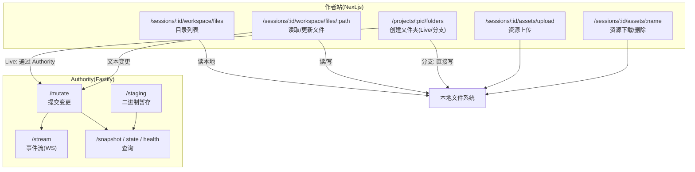
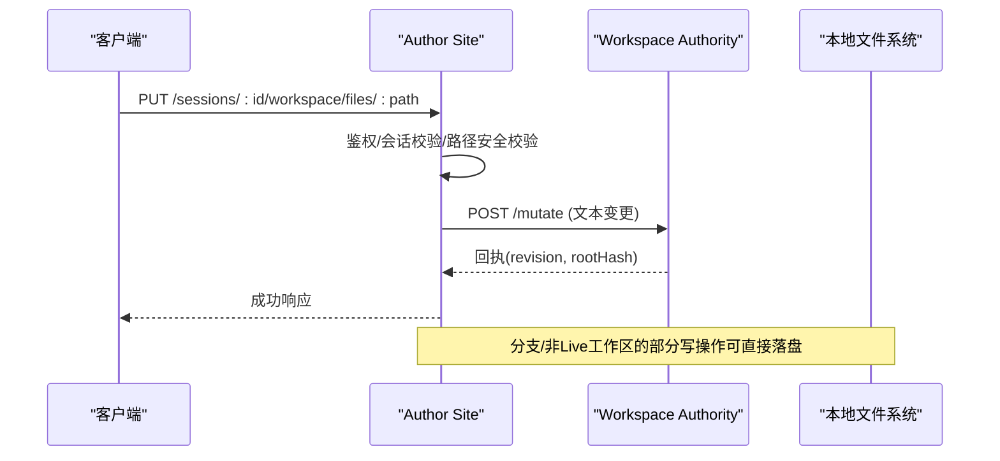
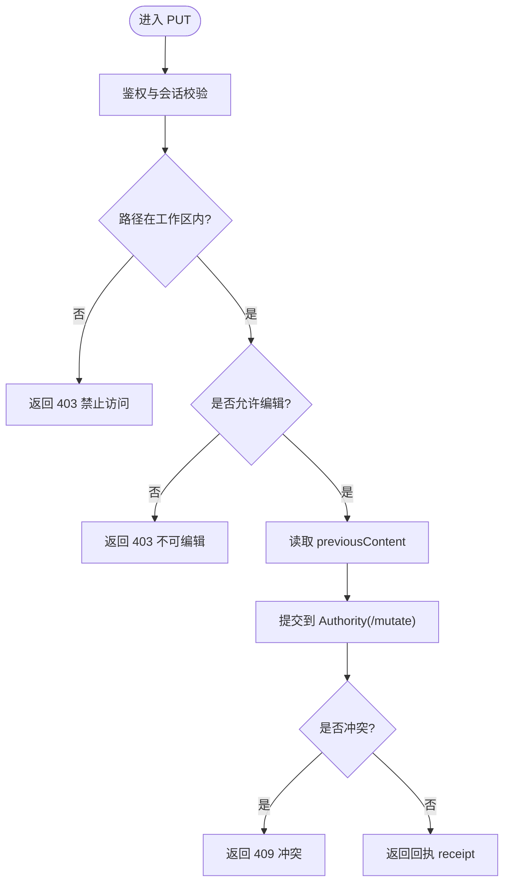
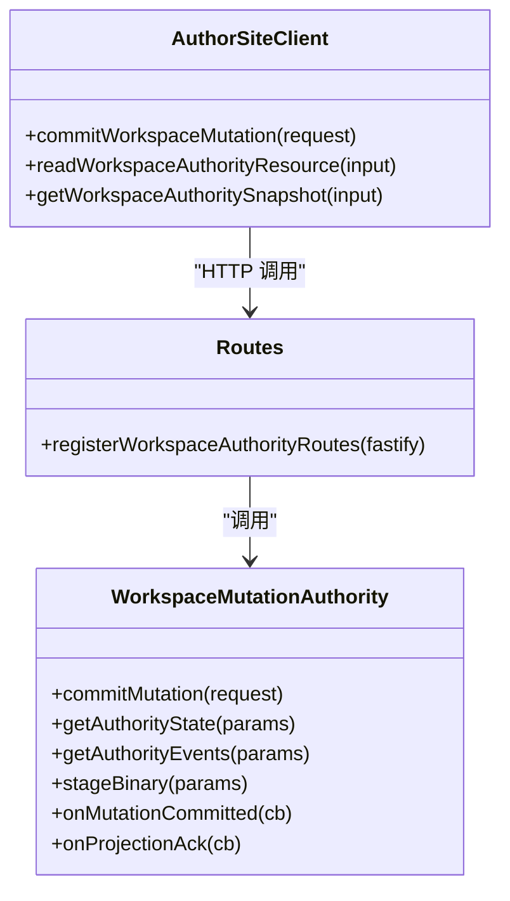
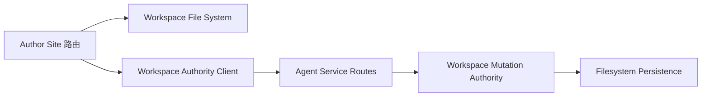

# 工作区文件接口

<cite>
**本文引用的文件**
- [packages/author-site/src/app/api/sessions/[sessionId]/workspace/files/route.ts](file://packages/author-site/src/app/api/sessions/[sessionId]/workspace/files/route.ts)
- [packages/author-site/src/app/api/sessions/[sessionId]/workspace/files/[...filePath]/route.ts](file://packages/author-site/src/app/api/sessions/[sessionId]/workspace/files/[...filePath]/route.ts)
- [packages/author-site/src/app/api/projects/[projectId]/folders/route.ts](file://packages/author-site/src/app/api/projects/[projectId]/folders/route.ts)
- [packages/author-site/src/app/api/sessions/[sessionId]/assets/upload/route.ts](file://packages/author-site/src/app/api/sessions/[sessionId]/assets/upload/route.ts)
- [packages/author-site/src/app/api/sessions/[sessionId]/assets/[filename]/route.ts](file://packages/author-site/src/app/api/sessions/[sessionId]/assets/[filename]/route.ts)
- [packages/agent-service/src/routes/workspace-authority.ts](file://packages/agent-service/src/routes/workspace-authority.ts)
- [packages/author-site/src/lib/workspace-authority-client.ts](file://packages/author-site/src/lib/workspace-authority-client.ts)
- [packages/agent-service/src/workspace/workspace-mutation-authority.ts](file://packages/agent-service/src/workspace/workspace-mutation-authority.ts)
- [test/创作端E2E回归测试/workspace-mutation-authority.spec.ts](file://test/创作端E2E回归测试/workspace-mutation-authority.spec.ts)
</cite>

## 目录
1. [简介](#简介)
2. [项目结构](#项目结构)
3. [核心组件](#核心组件)
4. [架构总览](#架构总览)
5. [详细组件分析](#详细组件分析)
6. [依赖关系分析](#依赖关系分析)
7. [性能与扩展性](#性能与扩展性)
8. [故障排查指南](#故障排查指南)
9. [结论](#结论)
10. [附录：API 参考](#附录api-参考)

## 简介
本文件为 Workbench 平台“工作区与文件系统”的 REST API 文档，覆盖以下能力：
- 工作区目录遍历、文件读取与更新
- 资源（图片等）上传与下载、删除
- 文件夹创建（含 Live Workspace 树变更）
- 权限控制、路径安全校验
- 冲突检测与版本同步（基于 Workspace Authority）
- 二进制暂存（staging）用于大文件写入
- 增量事件订阅（WebSocket）与断点续传思路

说明：
- 当前实现未提供分片上传与断点续传的完整 HTTP 端点；但提供了二进制暂存接口，可作为分片/断点续传的基础。
- 所有请求需携带认证 Cookie，服务端会校验会话归属与过期状态。

## 项目结构
与本文相关的代码主要分布在两个服务中：
- author-site（Next.js）：面向创作者的前后端一体化站点，暴露工作区与资源相关 REST 路由
- agent-service（Fastify）：Workspace Authority 服务，负责并发写锁、冲突检测、事件流与快照

图示来源
- [packages/author-site/src/app/api/sessions/[sessionId]/workspace/files/route.ts](file://packages/author-site/src/app/api/sessions/[sessionId]/workspace/files/route.ts)
- [packages/author-site/src/app/api/sessions/[sessionId]/workspace/files/[...filePath]/route.ts](file://packages/author-site/src/app/api/sessions/[sessionId]/workspace/files/[...filePath]/route.ts)
- [packages/author-site/src/app/api/projects/[projectId]/folders/route.ts](file://packages/author-site/src/app/api/projects/[projectId]/folders/route.ts)
- [packages/author-site/src/app/api/sessions/[sessionId]/assets/upload/route.ts](file://packages/author-site/src/app/api/sessions/[sessionId]/assets/upload/route.ts)
- [packages/author-site/src/app/api/sessions/[sessionId]/assets/[filename]/route.ts](file://packages/author-site/src/app/api/sessions/[sessionId]/assets/[filename]/route.ts)
- [packages/agent-service/src/routes/workspace-authority.ts](file://packages/agent-service/src/routes/workspace-authority.ts)

章节来源
- [packages/author-site/src/app/api/sessions/[sessionId]/workspace/files/route.ts](file://packages/author-site/src/app/api/sessions/[sessionId]/workspace/files/route.ts)
- [packages/author-site/src/app/api/sessions/[sessionId]/workspace/files/[...filePath]/route.ts](file://packages/author-site/src/app/api/sessions/[sessionId]/workspace/files/[...filePath]/route.ts)
- [packages/author-site/src/app/api/projects/[projectId]/folders/route.ts](file://packages/author-site/src/app/api/projects/[projectId]/folders/route.ts)
- [packages/author-site/src/app/api/sessions/[sessionId]/assets/upload/route.ts](file://packages/author-site/src/app/api/sessions/[sessionId]/assets/upload/route.ts)
- [packages/author-site/src/app/api/sessions/[sessionId]/assets/[filename]/route.ts](file://packages/author-site/src/app/api/sessions/[sessionId]/assets/[filename]/route.ts)
- [packages/agent-service/src/routes/workspace-authority.ts](file://packages/agent-service/src/routes/workspace-authority.ts)

## 核心组件
- 工作区文件路由
  - 目录列表：GET /api/sessions/{sessionId}/workspace/files?path=...
  - 文件内容：GET/PUT /api/sessions/{sessionId}/workspace/files/{...filePath}
- 资源管理路由
  - 上传：POST /api/sessions/{sessionId}/assets/upload
  - 下载/删除：GET/DELETE /api/sessions/{sessionId}/assets/{filename}
- 文件夹操作路由
  - 获取/创建：GET/POST /api/projects/{projectId}/folders
- Workspace Authority（权威写入口）
  - 变更提交：POST /api/workspace-authority/.../mutate
  - 二进制暂存：POST /api/workspace-authority/.../staging
  - 事件流：GET /api/workspace-authority/.../stream (WebSocket)
  - 快照/健康：GET /api/workspace-authority/.../{snapshot|state|health}

章节来源
- [packages/author-site/src/app/api/sessions/[sessionId]/workspace/files/route.ts](file://packages/author-site/src/app/api/sessions/[sessionId]/workspace/files/route.ts)
- [packages/author-site/src/app/api/sessions/[sessionId]/workspace/files/[...filePath]/route.ts](file://packages/author-site/src/app/api/sessions/[sessionId]/workspace/files/[...filePath]/route.ts)
- [packages/author-site/src/app/api/projects/[projectId]/folders/route.ts](file://packages/author-site/src/app/api/projects/[projectId]/folders/route.ts)
- [packages/author-site/src/app/api/sessions/[sessionId]/assets/upload/route.ts](file://packages/author-site/src/app/api/sessions/[sessionId]/assets/upload/route.ts)
- [packages/author-site/src/app/api/sessions/[sessionId]/assets/[filename]/route.ts](file://packages/author-site/src/app/api/sessions/[sessionId]/assets/[filename]/route.ts)
- [packages/agent-service/src/routes/workspace-authority.ts](file://packages/agent-service/src/routes/workspace-authority.ts)

## 架构总览
- 读路径：author-site 直接读取本地工作区或资源目录
- 写路径：
  - 分支/非 Live 工作区：部分操作可直接落盘（如创建文件夹）
  - Live 工作区：所有变更必须通过 Workspace Authority 提交，确保并发安全与冲突检测
- 冲突与版本：
  - Authority 维护 revision/rootHash/resourceHashes，支持乐观锁式提交
  - 客户端可订阅事件流进行增量同步
- 二进制大文件：
  - 通过 staging 接口暂存二进制，后续由 mutate 操作引用完成落盘

图示来源
- [packages/author-site/src/app/api/sessions/[sessionId]/workspace/files/[...filePath]/route.ts](file://packages/author-site/src/app/api/sessions/[sessionId]/workspace/files/[...filePath]/route.ts)
- [packages/agent-service/src/routes/workspace-authority.ts](file://packages/agent-service/src/routes/workspace-authority.ts)

## 详细组件分析

### 工作区目录遍历
- 端点
  - GET /api/sessions/{sessionId}/workspace/files?path={相对路径}&showKnowledge={true|false}
- 行为
  - 校验登录与会话有效性、会话归属、会话是否过期
  - 解析 path 并做路径穿越防护，仅允许在 workspace 根下访问
  - 返回单层目录节点（目录在前，文件在后），对页面运行时文件按类型过滤
- 错误码
  - 401 未登录/已过期
  - 403 越权访问
  - 404 路径不存在
  - 400 路径不是目录
  - 500 内部错误

章节来源
- [packages/author-site/src/app/api/sessions/[sessionId]/workspace/files/route.ts](file://packages/author-site/src/app/api/sessions/[sessionId]/workspace/files/route.ts)

### 工作区文件读取
- 端点
  - GET /api/sessions/{sessionId}/workspace/files/{...filePath}
- 行为
  - 鉴权与会话校验
  - 路径安全校验，禁止访问工作区外路径
  - 限制文件大小（超过阈值拒绝）
  - 返回 content、editable、size 等元信息
- 错误码
  - 401/403/404/400/413/500

章节来源
- [packages/author-site/src/app/api/sessions/[sessionId]/workspace/files/[...filePath]/route.ts](file://packages/author-site/src/app/api/sessions/[sessionId]/workspace/files/[...filePath]/route.ts)

### 工作区文件更新（文本）
- 端点
  - PUT /api/sessions/{sessionId}/workspace/files/{...filePath}
- 行为
  - 鉴权与会话校验
  - 白名单校验（仅允许编辑特定文件）
  - 读取 previousContent，调用 Authority 提交文本变更
  - 返回 receipt（包含 revision、rootHash 等）
- 错误码
  - 401/403/404/400/409（冲突）/500

图示来源
- [packages/author-site/src/app/api/sessions/[sessionId]/workspace/files/[...filePath]/route.ts](file://packages/author-site/src/app/api/sessions/[sessionId]/workspace/files/[...filePath]/route.ts)
- [packages/author-site/src/lib/workspace-authority-client.ts](file://packages/author-site/src/lib/workspace-authority-client.ts)
- [packages/agent-service/src/routes/workspace-authority.ts](file://packages/agent-service/src/routes/workspace-authority.ts)

### 资源上传
- 端点
  - POST /api/sessions/{sessionId}/assets/upload
- 行为
  - 鉴权与会话校验
  - 校验文件类型（白名单 MIME/扩展名）
  - 限制大小（默认 50MB）
  - 保存至会话资源目录，返回 url、filename、size、mimeType
- 错误码
  - 400 不支持的文件类型/缺少文件
  - 401/403/404
  - 413 文件过大
  - 500 上传失败

章节来源
- [packages/author-site/src/app/api/sessions/[sessionId]/assets/upload/route.ts](file://packages/author-site/src/app/api/sessions/[sessionId]/assets/upload/route.ts)

### 资源下载与删除
- 端点
  - GET /api/sessions/{sessionId}/assets/{filename}
  - DELETE /api/sessions/{sessionId}/assets/{filename}
- 行为
  - 下载：根据扩展名设置 Content-Type，带缓存头
  - 删除：校验登录与会话，删除对应文件
- 错误码
  - 401/403/404/500

章节来源
- [packages/author-site/src/app/api/sessions/[sessionId]/assets/[filename]/route.ts](file://packages/author-site/src/app/api/sessions/[sessionId]/assets/[filename]/route.ts)

### 文件夹操作（含 Live Workspace）
- 端点
  - GET /api/projects/{projectId}/folders
  - POST /api/projects/{projectId}/folders
- 行为
  - 获取：返回当前项目的文件夹元数据
  - 创建：
    - 若为 Live Workspace：读取 workspace-tree.json，构造 put_text 操作并通过 Authority 提交
    - 若为分支/非 Live：直接创建文件夹
  - 校验：父文件夹存在性、深度限制（最大 3 层）、会话与项目匹配
- 错误码
  - 400/404/409/500

章节来源
- [packages/author-site/src/app/api/projects/[projectId]/folders/route.ts](file://packages/author-site/src/app/api/projects/[projectId]/folders/route.ts)

### Workspace Authority（并发写锁、冲突与同步）
- 关键端点
  - POST /api/workspace-authority/projects/:projectId/workspaces/:workspaceId/mutate
  - POST /api/workspace-authority/projects/:projectId/workspaces/:workspaceId/staging
  - GET /api/workspace-authority/projects/:projectId/workspaces/:workspaceId/stream (WebSocket)
  - GET /api/workspace-authority/projects/:projectId/workspaces/:workspaceId/{snapshot|state|health}
- 行为
  - mutate：串行化执行、写租约、计算哈希、记录事件、返回回执
  - staging：接收二进制数据，生成 stagingId/hash/size，供后续 mutate 引用
  - stream：推送 committed 事件与 projection ack，支持 afterRevision 增量拉取
  - snapshot/state/health：查询工作区状态与健康度
- 错误码映射
  - 400 INVALID_REQUEST
  - 401 SESSION_NOT_FOUND/SESSION_EXPIRED
  - 403 PROJECT_MISMATCH/WORKSPACE_MISMATCH/WORKSPACE_PROJECT_MISMATCH
  - 404 WORKSPACE_NOT_FOUND/WORKSPACE_RESOURCE_NOT_FOUND
  - 409 WORKSPACE_RESOURCE_CONFLICT/WORKSPACE_MUTATION_ID_REUSED/WORKSPACE_EXTERNAL_DRIFT
  - 503 WORKSPACE_AUTHORITY_NOT_READY/WORKSPACE_WRITE_LEASE_UNAVAILABLE/WORKSPACE_AUTHORITY_BACKUP_MISSING
  - 500 WORKSPACE_MUTATION_FAILED

图示来源
- [packages/agent-service/src/routes/workspace-authority.ts](file://packages/agent-service/src/routes/workspace-authority.ts)
- [packages/agent-service/src/workspace/workspace-mutation-authority.ts](file://packages/agent-service/src/workspace/workspace-mutation-authority.ts)
- [packages/author-site/src/lib/workspace-authority-client.ts](file://packages/author-site/src/lib/workspace-authority-client.ts)

章节来源
- [packages/agent-service/src/routes/workspace-authority.ts](file://packages/agent-service/src/routes/workspace-authority.ts)
- [packages/agent-service/src/workspace/workspace-mutation-authority.ts](file://packages/agent-service/src/workspace/workspace-mutation-authority.ts)
- [packages/author-site/src/lib/workspace-authority-client.ts](file://packages/author-site/src/lib/workspace-authority-client.ts)

## 依赖关系分析
- author-site 对本地文件系统有读写依赖（目录列表、资源存取、分支工作区直写）
- author-site 通过 workspace-authority-client 调用 agent-service 的 Authority 接口
- agent-service 使用文件系统持久化与队列/租约机制保证并发安全
- 测试用例验证了旧 revision 提交产生 409 冲突且磁盘不回退的行为

图示来源
- [packages/author-site/src/app/api/sessions/[sessionId]/workspace/files/route.ts](file://packages/author-site/src/app/api/sessions/[sessionId]/workspace/files/route.ts)
- [packages/author-site/src/app/api/sessions/[sessionId]/workspace/files/[...filePath]/route.ts](file://packages/author-site/src/app/api/sessions/[sessionId]/workspace/files/[...filePath]/route.ts)
- [packages/author-site/src/lib/workspace-authority-client.ts](file://packages/author-site/src/lib/workspace-authority-client.ts)
- [packages/agent-service/src/routes/workspace-authority.ts](file://packages/agent-service/src/routes/workspace-authority.ts)
- [packages/agent-service/src/workspace/workspace-mutation-authority.ts](file://packages/agent-service/src/workspace/workspace-mutation-authority.ts)

章节来源
- [test/创作端E2E回归测试/workspace-mutation-authority.spec.ts](file://test/创作端E2E回归测试/workspace-mutation-authority.spec.ts)

## 性能与扩展性
- 目录遍历
  - 仅返回单层节点，避免一次性加载深层目录
  - 可按 showKnowledge 参数控制是否展示知识目录
- 文件读取
  - 限制单次读取大小，防止大文件阻塞
- 并发写
  - Authority 串行化同一工作区的写操作，避免竞争条件
  - 使用写租约与队列深度监控，便于观测与告警
- 大文件与分片
  - 当前未提供分片上传端点，但可通过 staging 接口先暂存二进制，再由 mutate 操作合并落盘
  - 建议前端实现分片、去重（hash）、重试与进度上报
- 增量同步
  - 使用 stream 事件流配合 afterRevision 实现增量拉取，减少全量同步开销

[本节为通用指导，不直接分析具体文件]

## 故障排查指南
- 常见错误码
  - 401 未登录/会话过期：检查 Cookie 与 token 有效期
  - 403 越权：确认 sessionId 与当前用户一致，且路径在工作区内
  - 404 资源不存在：核对路径与会话绑定是否正确
  - 409 冲突：旧 revision 提交导致，应重新拉取最新内容后重试
  - 503 Authority 不可用/无写租约：等待恢复或人工 reconcile
- 调试建议
  - 查看 snapshot/state/health 接口了解工作区状态
  - 通过 stream 观察事件序列与 gap 提示
  - 对于 Live 工作区，优先走 Authority 而非直写文件系统

章节来源
- [packages/agent-service/src/routes/workspace-authority.ts](file://packages/agent-service/src/routes/workspace-authority.ts)
- [packages/author-site/src/lib/workspace-authority-client.ts](file://packages/author-site/src/lib/workspace-authority-client.ts)

## 结论
- 工作区文件接口以“读直写权威”为核心：读路径高效直接，写路径统一经 Authority 保障一致性与并发安全
- 通过 staging 与 stream 可扩展出大文件分片与增量同步方案
- 完善的错误码与状态查询有助于快速定位问题与恢复

[本节为总结，不直接分析具体文件]

## 附录：API 参考

### 工作区文件
- GET /api/sessions/{sessionId}/workspace/files
  - 查询参数：path（可选）、showKnowledge（可选）
  - 成功响应：{ success: true, data: { path, type: "directory", name, children: [...] } }
  - 错误响应：{ success: false, error: { code, message } }
- GET /api/sessions/{sessionId}/workspace/files/{...filePath}
  - 成功响应：{ success: true, data: { path, content, editable, size } }
- PUT /api/sessions/{sessionId}/workspace/files/{...filePath}
  - 请求体：{ content: string }
  - 成功响应：{ success: true, data: { path, message, receipt } }

章节来源
- [packages/author-site/src/app/api/sessions/[sessionId]/workspace/files/route.ts](file://packages/author-site/src/app/api/sessions/[sessionId]/workspace/files/route.ts)
- [packages/author-site/src/app/api/sessions/[sessionId]/workspace/files/[...filePath]/route.ts](file://packages/author-site/src/app/api/sessions/[sessionId]/workspace/files/[...filePath]/route.ts)

### 资源管理
- POST /api/sessions/{sessionId}/assets/upload
  - 表单字段：file（image/* 或 .svga）
  - 成功响应：{ success: true, data: { url, filename, size, mimeType } }
- GET /api/sessions/{sessionId}/assets/{filename}
  - 返回二进制流，Content-Type 由扩展名决定
- DELETE /api/sessions/{sessionId}/assets/{filename}
  - 成功响应：{ success: true, data: null }

章节来源
- [packages/author-site/src/app/api/sessions/[sessionId]/assets/upload/route.ts](file://packages/author-site/src/app/api/sessions/[sessionId]/assets/upload/route.ts)
- [packages/author-site/src/app/api/sessions/[sessionId]/assets/[filename]/route.ts](file://packages/author-site/src/app/api/sessions/[sessionId]/assets/[filename]/route.ts)

### 文件夹
- GET /api/projects/{projectId}/folders
  - 成功响应：{ success: true, data: { folders: [...] } }
- POST /api/projects/{projectId}/folders
  - 请求体：{ sessionId, name, parentId? }
  - 成功响应：{ success: true, data: folderMeta }

章节来源
- [packages/author-site/src/app/api/projects/[projectId]/folders/route.ts](file://packages/author-site/src/app/api/projects/[projectId]/folders/route.ts)

### Workspace Authority
- POST /api/workspace-authority/projects/:projectId/workspaces/:workspaceId/mutate
  - 请求体：WorkspaceMutationRequest
  - 成功响应：{ success: true, data: WorkspaceMutationReceipt }
- POST /api/workspace-authority/projects/:projectId/workspaces/:workspaceId/staging
  - 请求体：application/octet-stream
  - 成功响应：{ success: true, data: { stagingId, hash, size } }
- GET /api/workspace-authority/projects/:projectId/workspaces/:workspaceId/stream
  - WebSocket，事件包括 ready、committed、projection-ack、revision-gap 等
- GET /api/workspace-authority/projects/:projectId/workspaces/:workspaceId/{snapshot|state|health}
  - 成功响应：{ success: true, data: ... }

章节来源
- [packages/agent-service/src/routes/workspace-authority.ts](file://packages/agent-service/src/routes/workspace-authority.ts)
- [packages/author-site/src/lib/workspace-authority-client.ts](file://packages/author-site/src/lib/workspace-authority-client.ts)