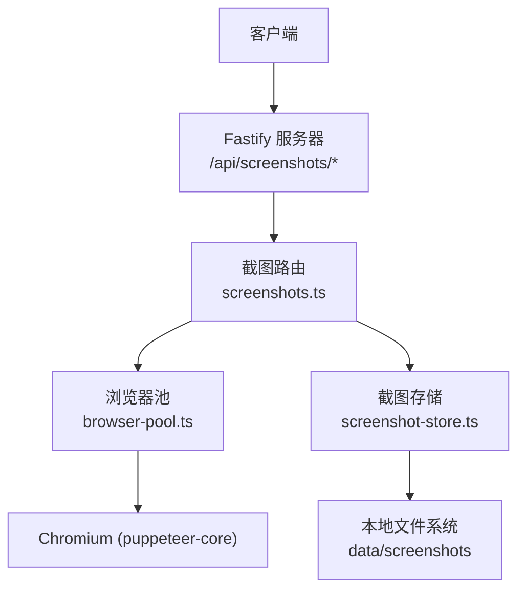
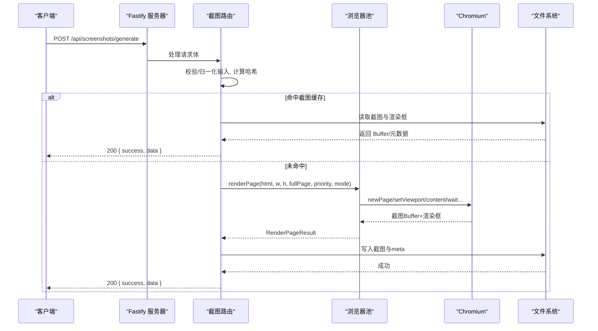
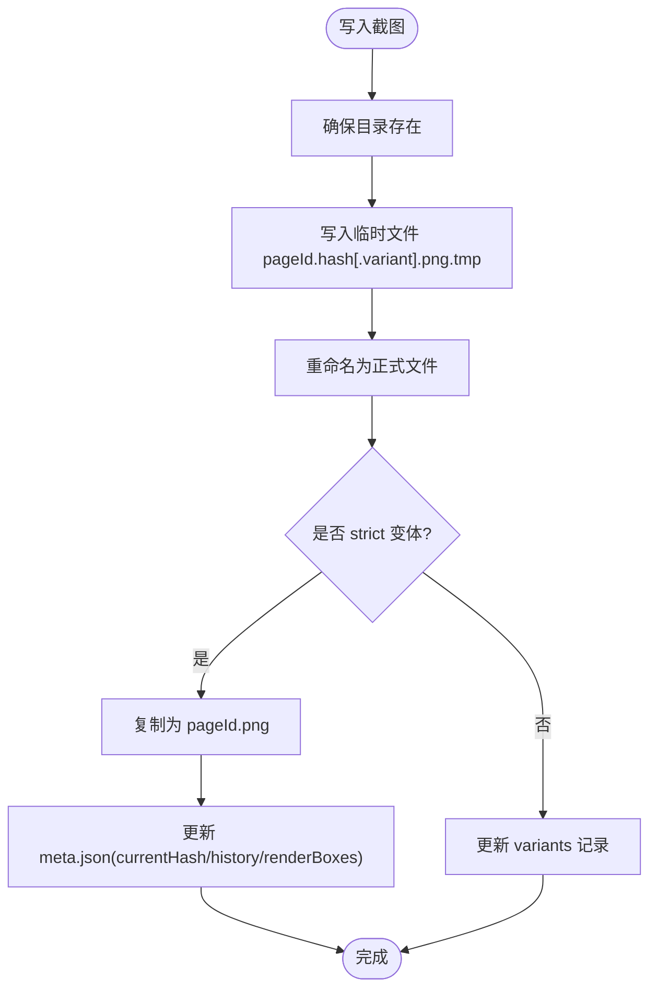
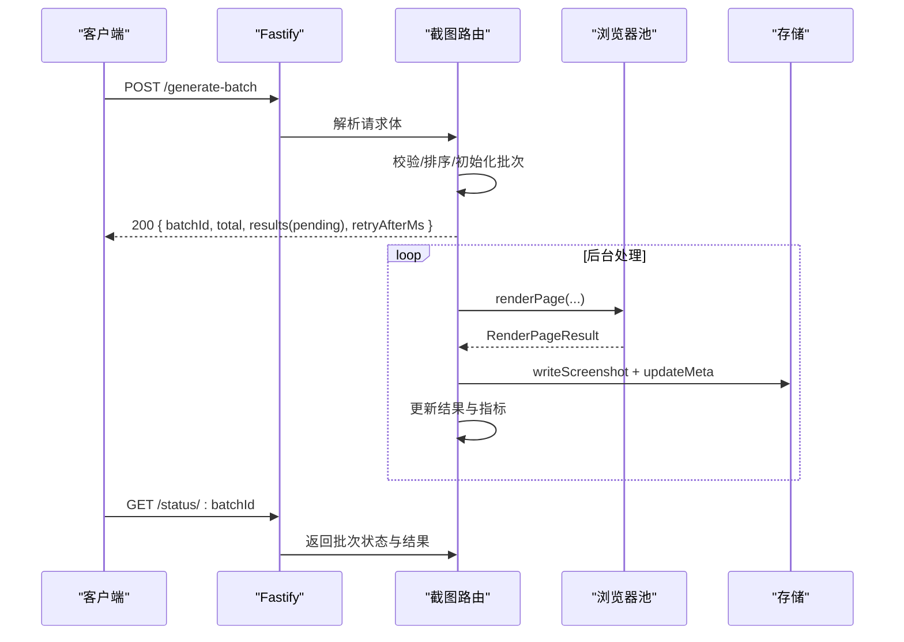
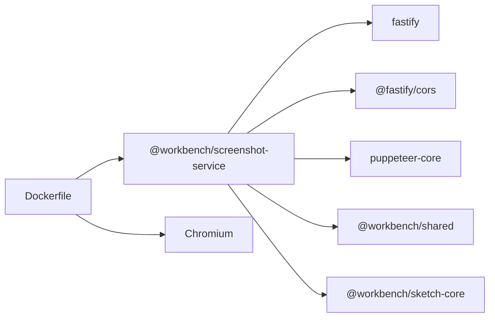

# 截图服务接口

<cite>
**本文引用的文件**
- [packages/screenshot-service/src/server.ts](file://packages/screenshot-service/src/server.ts)
- [packages/screenshot-service/src/config.ts](file://packages/screenshot-service/src/config.ts)
- [packages/screenshot-service/src/routes/index.ts](file://packages/screenshot-service/src/routes/index.ts)
- [packages/screenshot-service/src/routes/screenshots.ts](file://packages/screenshot-service/src/routes/screenshots.ts)
- [packages/screenshot-service/src/utils/browser-pool.ts](file://packages/screenshot-service/src/utils/browser-pool.ts)
- [packages/screenshot-service/src/utils/screenshot-store.ts](file://packages/screenshot-service/src/utils/screenshot-store.ts)
- [packages/screenshot-service/package.json](file://packages/screenshot-service/package.json)
- [docker/screenshot-service/Dockerfile](file://docker/screenshot-service/Dockerfile)
</cite>

## 目录
1. [简介](#简介)
2. [项目结构](#项目结构)
3. [核心组件](#核心组件)
4. [架构总览](#架构总览)
5. [详细组件分析](#详细组件分析)
6. [依赖分析](#依赖分析)
7. [性能考虑](#性能考虑)
8. [故障排查指南](#故障排查指南)
9. [结论](#结论)
10. [附录：REST API 参考](#附录rest-api-参考)

## 简介
本文件为 Workbench 平台的截图服务提供完整的 REST API 文档，覆盖页面截图、组件预览图生成与批量截图任务。服务基于 Fastify 构建 HTTP 层，使用 Puppeteer（puppeteer-core）驱动 Chromium 进行渲染与截图，并通过本地文件系统实现截图缓存与版本管理。支持优先级队列、并发控制、超时控制、错误分类与重试建议、以及多种渲染模式（严格/快速）。

## 项目结构
截图服务位于 packages/screenshot-service 下，采用“路由 + 工具”分层组织：
- server.ts：应用启动、CORS、健康检查、优雅关闭
- routes/index.ts：统一注册路由前缀 /api/screenshots
- routes/screenshots.ts：所有截图相关端点与业务逻辑
- utils/browser-pool.ts：Puppeteer 浏览器池、任务队列、渲染流程
- utils/screenshot-store.ts：截图文件存储、元数据、清理策略
- config.ts：全局配置与环境变量映射
- package.json：依赖与脚本
- docker/screenshot-service/Dockerfile：容器化构建与运行



图示来源
- [packages/screenshot-service/src/server.ts:1-110](file://packages/screenshot-service/src/server.ts#L1-L110)
- [packages/screenshot-service/src/routes/index.ts:1-7](file://packages/screenshot-service/src/routes/index.ts#L1-L7)
- [packages/screenshot-service/src/routes/screenshots.ts:1301-1310](file://packages/screenshot-service/src/routes/screenshots.ts#L1301-L1310)
- [packages/screenshot-service/src/utils/browser-pool.ts:126-295](file://packages/screenshot-service/src/utils/browser-pool.ts#L126-L295)
- [packages/screenshot-service/src/utils/screenshot-store.ts:1-328](file://packages/screenshot-service/src/utils/screenshot-store.ts#L1-L328)

章节来源
- [packages/screenshot-service/src/server.ts:1-110](file://packages/screenshot-service/src/server.ts#L1-L110)
- [packages/screenshot-service/src/routes/index.ts:1-7](file://packages/screenshot-service/src/routes/index.ts#L1-L7)
- [packages/screenshot-service/src/package.json:1-39](file://packages/screenshot-service/package.json#L1-L39)

## 核心组件
- 路由层
  - 统一前缀：/api/screenshots
  - 端点：生成单张截图、批量生成、取消任务、查询状态、获取文件/元数据
- 浏览器池
  - 单例 Chromium 进程复用
  - 优先级队列（active > visible > nearby > thumbnail > background）
  - 并发上限 maxConcurrentPages
  - 渲染阶段计时与空页检测
- 存储层
  - 按 projectId/pageId 组织目录
  - 文件名含 hash，支持 strict/fast 变体
  - meta.json 记录当前版本、历史、渲染框信息
  - 后台清理旧文件
- 配置与环境
  - 端口、主机、日志级别
  - 作者站点与 CDN 基址
  - Puppeteer 可执行路径、沙箱开关、视口尺寸
  - 超时：队列、任务、网络空闲等待
  - 预热与健康检查开关

章节来源
- [packages/screenshot-service/src/routes/screenshots.ts:1301-1310](file://packages/screenshot-service/src/routes/screenshots.ts#L1301-L1310)
- [packages/screenshot-service/src/utils/browser-pool.ts:126-295](file://packages/screenshot-service/src/utils/browser-pool.ts#L126-L295)
- [packages/screenshot-service/src/utils/screenshot-store.ts:1-328](file://packages/screenshot-service/src/utils/screenshot-store.ts#L1-L328)
- [packages/screenshot-service/src/config.ts:1-52](file://packages/screenshot-service/src/config.ts#L1-L52)

## 架构总览
截图请求从 HTTP 进入路由，经参数校验与输入归一化后，计算哈希并命中缓存或入队渲染；渲染完成后写入磁盘并更新元数据；文件读取端点根据 hash 返回 PNG 图片。



图示来源
- [packages/screenshot-service/src/routes/screenshots.ts:841-934](file://packages/screenshot-service/src/routes/screenshots.ts#L841-L934)
- [packages/screenshot-service/src/utils/browser-pool.ts:227-366](file://packages/screenshot-service/src/utils/browser-pool.ts#L227-L366)
- [packages/screenshot-service/src/utils/screenshot-store.ts:123-157](file://packages/screenshot-service/src/utils/screenshot-store.ts#L123-L157)

## 详细组件分析

### 浏览器池（Puppeteer 集成与队列）
- 功能要点
  - 单例管理 Chromium 生命周期，自动发现可执行路径
  - 任务入队时按优先级排序，限制并发数
  - 渲染阶段计时：浏览器启动、创建页面、设置视口、加载内容、等待选择器、网络空闲、动画帧、运行时错误检查、测量、视口调整、截图
  - 空页检测：结合渲染框面积与字节大小判断空白截图
  - 超时控制：队列排队超时、任务渲染超时
- 关键类型
  - ScreenshotPriority：active/visible/nearby/thumbnail/background
  - ScreenshotRenderMode：strict/fast
  - RenderStageTimings：各阶段耗时统计
  - ScreenshotRenderBox：截图尺寸与视口信息

```mermaid
classDiagram
class BrowserPool {
-Browser browser
-string status
-number activePages
-RenderTask[] queue
+getBrowser() Promise~Browser~
+renderPage(html,width,height,fullPage,priority,mode,measuredHeight) Promise~RenderPageResult~
+getStatus() BrowserPoolStatus
+runDeepHealthCheck() Promise~{ok,elapsed,error}~
+warmup() Promise~{ok,elapsed,error}~
+close() Promise~void~
}
class RenderTask {
+string html
+number width
+number height
+boolean fullPage
+ScreenshotPriority priority
+ScreenshotRenderMode renderMode
+number sequence
+number enqueuedAt
}
class RenderPageResult {
+Buffer buffer
+ScreenshotRenderBox renderBox
+number queueWaitMs
+number renderMs
+RenderStageTimings renderTimings
}
BrowserPool --> RenderTask : "管理"
BrowserPool --> RenderPageResult : "返回"
```

图示来源
- [packages/screenshot-service/src/utils/browser-pool.ts:126-295](file://packages/screenshot-service/src/utils/browser-pool.ts#L126-L295)
- [packages/screenshot-service/src/utils/browser-pool.ts:15-44](file://packages/screenshot-service/src/utils/browser-pool.ts#L15-L44)

章节来源
- [packages/screenshot-service/src/utils/browser-pool.ts:126-800](file://packages/screenshot-service/src/utils/browser-pool.ts#L126-L800)

### 截图存储（缓存与版本管理）
- 功能要点
  - computeScreenshotHash：对代码/配置/尺寸/全屏/版本/身份等组合求哈希
  - 文件命名：pageId.hash.png（strict），pageId.hash.fast.png（fast）
  - meta.json：记录 currentHash、history、renderBoxes、variants
  - 写入原子性：先写 .tmp 再 rename，成功后复制为当前版本并更新 meta
  - 清理策略：仅保留 history 中的 hash 对应文件与最近 N 个变体
- 数据结构
  - ScreenshotMeta：当前版本、生成时间、耗时、历史列表、渲染框集合、变体集合
  - ScreenshotVariant：strict/fast



图示来源
- [packages/screenshot-service/src/utils/screenshot-store.ts:123-157](file://packages/screenshot-service/src/utils/screenshot-store.ts#L123-L157)
- [packages/screenshot-service/src/utils/screenshot-store.ts:192-232](file://packages/screenshot-service/src/utils/screenshot-store.ts#L192-L232)
- [packages/screenshot-service/src/utils/screenshot-store.ts:248-284](file://packages/screenshot-service/src/utils/screenshot-store.ts#L248-L284)
- [packages/screenshot-service/src/utils/screenshot-store.ts:286-328](file://packages/screenshot-service/src/utils/screenshot-store.ts#L286-L328)

章节来源
- [packages/screenshot-service/src/utils/screenshot-store.ts:1-328](file://packages/screenshot-service/src/utils/screenshot-store.ts#L1-L328)

### 路由与业务逻辑（生成、批量、文件、状态）
- 单张生成
  - 输入校验与归一化（支持 high-fidelity-react、prototype-html-css、sketch-scene）
  - 计算哈希，命中缓存直接返回；否则入队渲染
  - 返回包含 timings、cache 命中情况、渲染框、URL 等信息
- 批量生成
  - 按优先级排序，后台并行处理（受 maxConcurrentPages 限制）
  - 维护批次状态、优先级切片统计、指标聚合
  - 支持取消与轮询状态
- 文件与元数据
  - GET /file/:projectId/:pageId?hash=...&variant=strict|fast
  - ?meta=1 返回当前版本与渲染框
- 健康检查
  - /health 返回浏览器状态、队列、缓存条目、指标、最后错误等



图示来源
- [packages/screenshot-service/src/routes/screenshots.ts:936-1024](file://packages/screenshot-service/src/routes/screenshots.ts#L936-L1024)
- [packages/screenshot-service/src/routes/screenshots.ts:1026-1150](file://packages/screenshot-service/src/routes/screenshots.ts#L1026-L1150)
- [packages/screenshot-service/src/routes/screenshots.ts:1229-1267](file://packages/screenshot-service/src/routes/screenshots.ts#L1229-L1267)

章节来源
- [packages/screenshot-service/src/routes/screenshots.ts:1-1310](file://packages/screenshot-service/src/routes/screenshots.ts#L1-L1310)
- [packages/screenshot-service/src/server.ts:44-71](file://packages/screenshot-service/src/server.ts#L44-L71)

## 依赖分析
- 外部依赖
  - fastify、@fastify/cors、pino/pino-pretty、dotenv、puppeteer-core
- 内部依赖
  - @workbench/shared（iframe 模板、原型预览 HTML 构建）
  - @workbench/sketch-core（Sketch 场景预览 HTML 构建）
- 容器镜像
  - 预装 Chromium，设置 PUPPETEER_EXECUTABLE_PATH，跳过下载
  - 暴露端口 3202，健康检查 /health



图示来源
- [packages/screenshot-service/package.json:17-26](file://packages/screenshot-service/package.json#L17-L26)
- [docker/screenshot-service/Dockerfile:27-48](file://docker/screenshot-service/Dockerfile#L27-L48)

章节来源
- [packages/screenshot-service/package.json:1-39](file://packages/screenshot-service/package.json#L1-L39)
- [docker/screenshot-service/Dockerfile:1-56](file://docker/screenshot-service/Dockerfile#L1-L56)

## 性能考虑
- 并发与队列
  - 通过 maxConcurrentPages 控制同时渲染的页面数
  - 优先级权重保证活跃/可见内容优先渲染
- 缓存策略
  - 截图缓存：相同哈希直接返回
  - 编译缓存：React 代码编译结果按 session/global 作用域缓存
  - 在途去重：同一请求键合并等待
- 渲染优化
  - strict 模式等待网络空闲与稳定测量，fast 模式仅等待两帧
  - 全页截图时动态调整视口高度，避免多次重排
- 超时与健壮性
  - 队列排队超时、任务渲染超时、选择器等待超时
  - 空页检测避免无效写入
- 指标与观测
  - 记录各阶段耗时、命中率、错误码分布
  - /health 暴露队列与浏览器状态

章节来源
- [packages/screenshot-service/src/config.ts:17-41](file://packages/screenshot-service/src/config.ts#L17-L41)
- [packages/screenshot-service/src/utils/browser-pool.ts:227-366](file://packages/screenshot-service/src/utils/browser-pool.ts#L227-L366)
- [packages/screenshot-service/src/routes/screenshots.ts:576-696](file://packages/screenshot-service/src/routes/screenshots.ts#L576-L696)

## 故障排查指南
- 常见问题定位
  - 选择器等待失败：确认目标根节点 #root 是否存在且可渲染
  - 运行时错误：页面注入的错误信息会透传至响应
  - 空渲染：当渲染框面积大但字节过小，视为空白被拒绝
  - 队列超时：提高 SCREENSHOT_QUEUE_TIMEOUT_MS 或降低并发
  - 任务超时：增大 SCREENSHOT_TASK_TIMEOUT_MS 或优化页面资源
- 健康检查
  - /health 返回浏览器状态、队列长度、运行中任务、缓存条目、最后错误
  - 可选 deep=1 触发一次端到端渲染验证
- 日志与指标
  - pino 输出结构化日志，包含 requestId、优先级、缓存命中、耗时
  - 错误码分类便于上层重试与告警

章节来源
- [packages/screenshot-service/src/server.ts:44-71](file://packages/screenshot-service/src/server.ts#L44-L71)
- [packages/screenshot-service/src/utils/browser-pool.ts:368-507](file://packages/screenshot-service/src/utils/browser-pool.ts#L368-L507)
- [packages/screenshot-service/src/routes/screenshots.ts:911-934](file://packages/screenshot-service/src/routes/screenshots.ts#L911-L934)

## 结论
该截图服务以 Fastify 作为 HTTP 入口，结合 Puppeteer 与本地文件系统实现了高可用、可观测、可伸缩的截图能力。通过优先级队列、并发控制、多级缓存与严格的超时/错误处理，满足页面截图与组件预览图的规模化生产需求。

## 附录：REST API 参考

### 通用说明
- 基础路径：/api/screenshots
- 认证头：Authorization（如需要由上游网关鉴权）
- 跨域：默认允许 localhost:3200/3300，可通过 CORS_ORIGINS 配置
- 请求标识：X-Request-Id（用于追踪）

### 健康检查
- GET /health
- 响应字段：status、timestamp、uptime、browser、queue、cache、metrics、lastError、deepCheck（可选）

章节来源
- [packages/screenshot-service/src/server.ts:44-71](file://packages/screenshot-service/src/server.ts#L44-L71)

### 生成单张截图
- POST /api/screenshots/generate
- 请求体字段
  - 必填：projectId、pageId
  - 输入（三选一）
    - runtimeType="high-fidelity-react"：code、configData、previewSize
    - runtimeType="prototype-html-css"：prototypeHtml、prototypeCss、prototypeMeta、configData、previewSize
    - runtimeType="sketch-scene"：sketchScene、sketchMeta、configData、previewSize
  - 可选：width、height、fullPage、sessionId、priority、renderMode、measuredHeight、force
- 响应
  - success: boolean
  - data: { url, assetUrl, hash, elapsed, cached, requestId, queueWaitMs, timings, renderBox, cache, variant, quality }
- 错误码
  - INVALID_REQUEST、COMPILE_ERROR、RUNTIME_ERROR、EMPTY_RENDER、SCREENSHOT_ERROR、QUEUE_TIMEOUT、RENDER_TIMEOUT、SELECTOR_TIMEOUT、BROWSER_LAUNCH_ERROR、SCREENSHOT_WRITE_ERROR

章节来源
- [packages/screenshot-service/src/routes/screenshots.ts:841-934](file://packages/screenshot-service/src/routes/screenshots.ts#L841-L934)
- [packages/screenshot-service/src/routes/screenshots.ts:46-85](file://packages/screenshot-service/src/routes/screenshots.ts#L46-L85)
- [packages/screenshot-service/src/utils/errors.ts](file://packages/screenshot-service/src/utils/errors.ts)

### 批量生成截图
- POST /api/screenshots/generate-batch
- 请求体字段
  - projectId: string
  - pages: BatchPage[]（每个元素同 generate 的输入字段，额外支持 pageId、priority、renderMode、measuredHeight、force）
  - sessionId?: string
- 响应
  - success: boolean
  - data: { batchId, total, cached, priorityStats, prioritySlices, metrics, retryAfterMs, results }
- 后续轮询
  - GET /api/screenshots/status/:projectId/:batchId
  - POST /api/screenshots/cancel/:projectId/:batchId

章节来源
- [packages/screenshot-service/src/routes/screenshots.ts:936-1024](file://packages/screenshot-service/src/routes/screenshots.ts#L936-L1024)
- [packages/screenshot-service/src/routes/screenshots.ts:1026-1150](file://packages/screenshot-service/src/routes/screenshots.ts#L1026-L1150)
- [packages/screenshot-service/src/routes/screenshots.ts:1229-1267](file://packages/screenshot-service/src/routes/screenshots.ts#L1229-L1267)
- [packages/screenshot-service/src/routes/screenshots.ts:1269-1297](file://packages/screenshot-service/src/routes/screenshots.ts#L1269-L1297)

### 获取截图文件与元数据
- GET /api/screenshots/file/:projectId/:pageId
- 查询参数
  - hash?: string（16 位十六进制）
  - variant?: strict|fast
  - meta?: "1"（返回元数据而非图片）
- 响应
  - 无 meta：返回 image/png 二进制
  - meta=1：返回 { success, data: { currentHash, url, renderBox } }
- 缓存头
  - 带 hash：public, max-age=31536000, immutable
  - 不带 hash：no-store

章节来源
- [packages/screenshot-service/src/routes/screenshots.ts:1152-1227](file://packages/screenshot-service/src/routes/screenshots.ts#L1152-L1227)

### 配置与环境变量
- 端口与主机：PORT、HOST
- 日志：LOG_LEVEL
- 站点与 CDN：AUTHOR_SITE_URL、CDN_BASE_URL、PREVIEW_RUNTIME_SOURCE
- 数据目录：DATA_DIR
- Puppeteer：PUPPETEER_EXECUTABLE_PATH、PUPPETEER_DISABLE_SANDBOX
- 视口与并发：viewport.width/height、maxConcurrentPages
- 超时：SCREENSHOT_QUEUE_TIMEOUT_MS、SCREENSHOT_TASK_TIMEOUT_MS、waitForNetworkIdleTimeout
- 批处理 TTL：SCREENSHOT_BATCH_TTL_MS
- 健康与预热：SCREENSHOT_DEEP_HEALTH、SCREENSHOT_WARMUP
- 选择器：waitForSelector

章节来源
- [packages/screenshot-service/src/config.ts:1-52](file://packages/screenshot-service/src/config.ts#L1-L52)

### 支持的格式与尺寸
- 格式：PNG（当前实现固定 PNG）
- 尺寸：width、height 自定义；fullPage 开启全页截图
- 质量/变体：strict（高质量/严格等待）、fast（快速/轻量等待）

章节来源
- [packages/screenshot-service/src/utils/browser-pool.ts:368-507](file://packages/screenshot-service/src/utils/browser-pool.ts#L368-L507)
- [packages/screenshot-service/src/utils/screenshot-store.ts:52-60](file://packages/screenshot-service/src/utils/screenshot-store.ts#L52-L60)

### 错误码与重试建议
- COMPILE_ERROR：检查代码与依赖，必要时 force=true 强制重新生成
- RUNTIME_ERROR：查看页面运行时错误详情，修复后再试
- EMPTY_RENDER：检查页面可见性与资源加载
- QUEUE_TIMEOUT：提升队列超时或降低并发
- RENDER_TIMEOUT：增加任务超时或优化页面
- SELECTOR_TIMEOUT：确认 #root 存在并可渲染
- BROWSER_LAUNCH_ERROR：检查 Chromium 安装与权限
- SCREENSHOT_WRITE_ERROR：检查磁盘空间与权限

章节来源
- [packages/screenshot-service/src/routes/screenshots.ts:911-934](file://packages/screenshot-service/src/routes/screenshots.ts#L911-L934)
- [packages/screenshot-service/src/utils/browser-pool.ts:227-366](file://packages/screenshot-service/src/utils/browser-pool.ts#L227-L366)