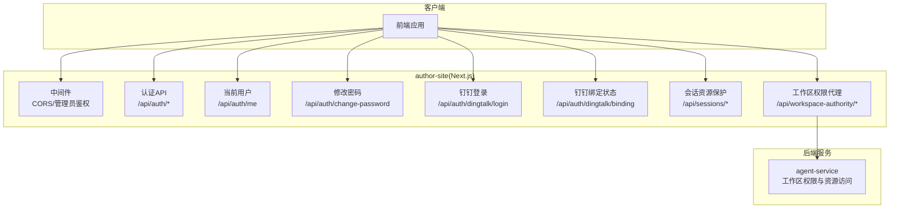
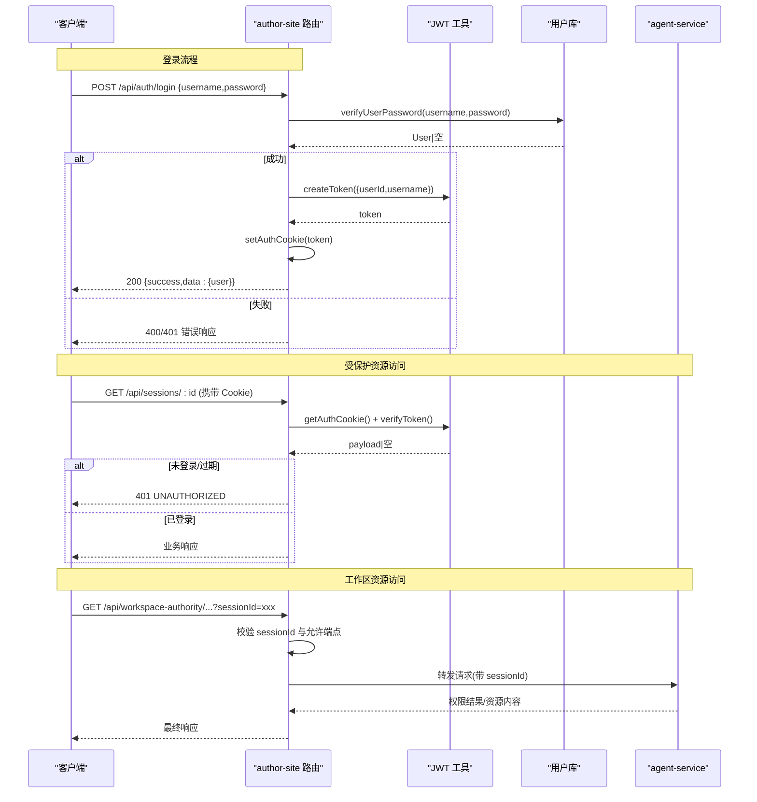
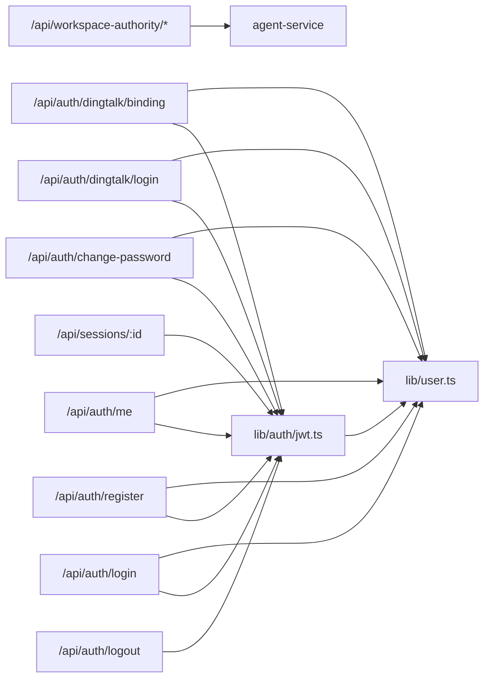

# 认证授权接口

<cite>
**本文引用的文件**   
- [packages/author-site/src/app/api/auth/login/route.ts](file://packages/author-site/src/app/api/auth/login/route.ts)
- [packages/author-site/src/app/api/auth/register/route.ts](file://packages/author-site/src/app/api/auth/register/route.ts)
- [packages/author-site/src/app/api/auth/logout/route.ts](file://packages/author-site/src/app/api/auth/logout/route.ts)
- [packages/author-site/src/app/api/auth/me/route.ts](file://packages/author-site/src/app/api/auth/me/route.ts)
- [packages/author-site/src/app/api/auth/change-password/route.ts](file://packages/author-site/src/app/api/auth/change-password/route.ts)
- [packages/author-site/src/app/api/auth/dingtalk/login/route.ts](file://packages/author-site/src/app/api/auth/dingtalk/login/route.ts)
- [packages/author-site/src/app/api/auth/dingtalk/binding/route.ts](file://packages/author-site/src/app/api/auth/dingtalk/binding/route.ts)
- [packages/author-site/src/lib/auth/jwt.ts](file://packages/author-site/src/lib/auth/jwt.ts)
- [packages/author-site/src/lib/auth/password.ts](file://packages/author-site/src/lib/auth/password.ts)
- [packages/author-site/src/lib/user.ts](file://packages/author-site/src/lib/user.ts)
- [packages/author-site/src/middleware.ts](file://packages/author-site/src/middleware.ts)
- [packages/author-site/src/app/api/sessions/[sessionId]/route.ts](file://packages/author-site/src/app/api/sessions/[sessionId]/route.ts)
- [packages/agent-service/src/routes/workspace-authority.ts](file://packages/agent-service/src/routes/workspace-authority.ts)
- [packages/author-site/src/app/api/workspace-authority/[projectId]/[workspaceId]/[...segments]/route.ts](file://packages/author-site/src/app/api/workspace-authority/[projectId]/[workspaceId]/[...segments]/route.ts)
</cite>

## 目录
1. [简介](#简介)
2. [项目结构](#项目结构)
3. [核心组件](#核心组件)
4. [架构总览](#架构总览)
5. [详细组件分析](#详细组件分析)
6. [依赖关系分析](#依赖关系分析)
7. [性能与安全考量](#性能与安全考量)
8. [故障排查指南](#故障排查指南)
9. [结论](#结论)
10. [附录：错误码与最佳实践](#附录错误码与最佳实践)

## 简介
本文件为 Workbench 平台创作端（author-site）的认证与授权 REST API 文档，覆盖用户注册、登录、登出、获取当前用户信息、修改密码、钉钉第三方登录与绑定等能力；同时说明 JWT 令牌管理、Cookie 会话策略、权限校验与多租户隔离机制。文档还包含完整的调用流程示例、错误处理规范以及安全性最佳实践建议。

## 项目结构
认证相关能力集中在 author-site 的 Next.js App Router 路由中，并通过共享库实现 JWT、密码加密、用户数据访问与中间件鉴权。工作区资源访问通过 workspace-authority 代理到 agent-service 进行细粒度权限控制。

图表来源
- [packages/author-site/src/middleware.ts:1-153](file://packages/author-site/src/middleware.ts#L1-L153)
- [packages/author-site/src/app/api/auth/login/route.ts:1-47](file://packages/author-site/src/app/api/auth/login/route.ts#L1-L47)
- [packages/author-site/src/app/api/auth/register/route.ts:1-55](file://packages/author-site/src/app/api/auth/register/route.ts#L1-L55)
- [packages/author-site/src/app/api/auth/logout/route.ts:1-9](file://packages/author-site/src/app/api/auth/logout/route.ts#L1-L9)
- [packages/author-site/src/app/api/auth/me/route.ts:1-35](file://packages/author-site/src/app/api/auth/me/route.ts#L1-L35)
- [packages/author-site/src/app/api/auth/change-password/route.ts:1-44](file://packages/author-site/src/app/api/auth/change-password/route.ts#L1-L44)
- [packages/author-site/src/app/api/auth/dingtalk/login/route.ts:1-59](file://packages/author-site/src/app/api/auth/dingtalk/login/route.ts#L1-L59)
- [packages/author-site/src/app/api/auth/dingtalk/binding/route.ts:1-34](file://packages/author-site/src/app/api/auth/dingtalk/binding/route.ts#L1-L34)
- [packages/author-site/src/app/api/sessions/[sessionId]/route.ts](file://packages/author-site/src/app/api/sessions/[sessionId]/route.ts#L1-L54)
- [packages/author-site/src/app/api/workspace-authority/[projectId]/[workspaceId]/[...segments]/route.ts](file://packages/author-site/src/app/api/workspace-authority/[projectId]/[workspaceId]/[...segments]/route.ts#L28-L47)
- [packages/agent-service/src/routes/workspace-authority.ts:67-90](file://packages/agent-service/src/routes/workspace-authority.ts#L67-L90)

章节来源
- [packages/author-site/src/middleware.ts:1-153](file://packages/author-site/src/middleware.ts#L1-L153)

## 核心组件
- 认证路由层：提供登录、注册、登出、当前用户、修改密码、钉钉登录与绑定查询等 HTTP 端点。
- JWT 工具库：负责签发、验证、设置/清除 Cookie。
- 密码与用户库：bcrypt 加盐哈希、用户名/密码校验、用户增删改查、钉钉身份关联。
- 中间件：统一 CORS、页面/API 鉴权、管理员访问控制。
- 工作区权限代理：将工作区资源访问请求转发至 agent-service，结合 sessionId 做资源级鉴权。

章节来源
- [packages/author-site/src/lib/auth/jwt.ts:1-70](file://packages/author-site/src/lib/auth/jwt.ts#L1-L70)
- [packages/author-site/src/lib/auth/password.ts:1-34](file://packages/author-site/src/lib/auth/password.ts#L1-L34)
- [packages/author-site/src/lib/user.ts:1-339](file://packages/author-site/src/lib/user.ts#L1-L339)
- [packages/author-site/src/middleware.ts:1-153](file://packages/author-site/src/middleware.ts#L1-L153)
- [packages/author-site/src/app/api/workspace-authority/[projectId]/[workspaceId]/[...segments]/route.ts:28-47](file://packages/author-site/src/app/api/workspace-authority/[projectId]/[workspaceId]/[...segments]/route.ts#L28-L47)
- [packages/agent-service/src/routes/workspace-authority.ts:67-90](file://packages/agent-service/src/routes/workspace-authority.ts#L67-L90)

## 架构总览
认证授权整体采用“无状态 JWT + HttpOnly Cookie”的会话方案。客户端在登录成功后获得 auth_token Cookie，后续请求由中间件或具体路由读取并验证该 Cookie，完成身份识别与基础鉴权。敏感资源访问（如工作区资源）进一步通过 sessionId 与工作区权限系统联动，实现多租户与资源级隔离。

图表来源
- [packages/author-site/src/app/api/auth/login/route.ts:1-47](file://packages/author-site/src/app/api/auth/login/route.ts#L1-L47)
- [packages/author-site/src/lib/auth/jwt.ts:1-70](file://packages/author-site/src/lib/auth/jwt.ts#L1-L70)
- [packages/author-site/src/lib/user.ts:264-281](file://packages/author-site/src/lib/user.ts#L264-L281)
- [packages/author-site/src/app/api/sessions/[sessionId]/route.ts:1-54](file://packages/author-site/src/app/api/sessions/[sessionId]/route.ts#L1-L54)
- [packages/author-site/src/app/api/workspace-authority/[projectId]/[workspaceId]/[...segments]/route.ts:28-47](file://packages/author-site/src/app/api/workspace-authority/[projectId]/[workspaceId]/[...segments]/route.ts#L28-L47)
- [packages/agent-service/src/routes/workspace-authority.ts:67-90](file://packages/agent-service/src/routes/workspace-authority.ts#L67-L90)

## 详细组件分析

### 认证与账户管理 API
- 用户注册
  - 方法路径：POST /api/auth/register
  - 请求体：{ username, password }
  - 行为：校验用户名/密码规则 -> 检查用户名唯一性 -> 创建用户并写入密码哈希 -> 签发 JWT -> 设置 auth_token Cookie -> 返回用户基本信息
  - 成功响应：200 { success:true, data:{ user:{ id, username } } }
  - 错误码：VALIDATION_ERROR（400）、重复用户名（409）、内部错误（500）
  - 参考实现：[注册路由:1-55](file://packages/author-site/src/app/api/auth/register/route.ts#L1-L55)、[密码校验:16-34](file://packages/author-site/src/lib/auth/password.ts#L16-L34)、[用户创建:32-46](file://packages/author-site/src/lib/user.ts#L32-L46)、[JWT 签发与 Cookie:16-56](file://packages/author-site/src/lib/auth/jwt.ts#L16-L56)

- 用户登录
  - 方法路径：POST /api/auth/login
  - 请求体：{ username, password }
  - 行为：去除用户名首尾空白 -> 校验非空 -> 校验密码 -> 签发 JWT -> 设置 auth_token Cookie -> 返回用户基本信息
  - 成功响应：200 { success:true, data:{ user:{ id, username } } }
  - 错误码：VALIDATION_ERROR（400/401）、内部错误（500）
  - 参考实现：[登录路由:1-47](file://packages/author-site/src/app/api/auth/login/route.ts#L1-L47)、[密码校验:29-34](file://packages/author-site/src/lib/auth/password.ts#L29-L34)、[用户密码校验:264-281](file://packages/author-site/src/lib/user.ts#L264-L281)、[JWT 签发与 Cookie:16-56](file://packages/author-site/src/lib/auth/jwt.ts#L16-L56)

- 登出
  - 方法路径：POST /api/auth/logout
  - 行为：清除 auth_token Cookie
  - 成功响应：200 { success:true, data:{ message:"已登出" } }
  - 参考实现：[登出路由:1-9](file://packages/author-site/src/app/api/auth/logout/route.ts#L1-L9)、[清除 Cookie:68-70](file://packages/author-site/src/lib/auth/jwt.ts#L68-L70)

- 获取当前用户
  - 方法路径：GET /api/auth/me
  - 行为：从 Cookie 解析并验证 JWT -> 根据 userId 查询用户 -> 返回用户基本信息
  - 成功响应：200 { success:true, data:{ id, username } }
  - 错误码：UNAUTHORIZED（401）、用户不存在（404）
  - 参考实现：[当前用户路由:1-35](file://packages/author-site/src/app/api/auth/me/route.ts#L1-L35)、[JWT 验证:27-34](file://packages/author-site/src/lib/auth/jwt.ts#L27-L34)、[用户查询:94-103](file://packages/author-site/src/lib/user.ts#L94-L103)

- 修改密码
  - 方法路径：POST /api/auth/change-password
  - 请求体：{ newPassword }
  - 行为：验证登录态 -> 校验新密码规则 -> 更新密码哈希 -> 记录重置日志 -> 清除当前 Cookie（强制重新登录）
  - 成功响应：200 { success:true, data:{ message:"密码修改成功，请重新登录" } }
  - 错误码：UNAUTHORIZED（401）、VALIDATION_ERROR（400）、内部错误（500）
  - 参考实现：[修改密码路由:1-44](file://packages/author-site/src/app/api/auth/change-password/route.ts#L1-L44)、[密码校验:29-34](file://packages/author-site/src/lib/auth/password.ts#L29-L34)、[用户密码更新:298-308](file://packages/author-site/src/lib/user.ts#L298-L308)、[日志记录:325-338](file://packages/author-site/src/lib/user.ts#L325-L338)、[清除 Cookie:68-70](file://packages/author-site/src/lib/auth/jwt.ts#L68-L70)

- 钉钉登录
  - 方法路径：POST /api/auth/dingtalk/login
  - 请求体：{ authCode | code }
  - 行为：交换授权码 -> 查找或创建本地用户 -> 签发 JWT -> 设置 auth_token Cookie -> 返回用户与钉钉身份信息
  - 成功响应：200 { success:true, data:{ user, dingtalk, created } }
  - 错误码：VALIDATION_ERROR（400）、内部错误（500）
  - 参考实现：[钉钉登录路由:1-59](file://packages/author-site/src/app/api/auth/dingtalk/login/route.ts#L1-L59)、[用户创建/查找:167-259](file://packages/author-site/src/lib/user.ts#L167-L259)、[JWT 签发与 Cookie:16-56](file://packages/author-site/src/lib/auth/jwt.ts#L16-L56)

- 钉钉绑定状态
  - 方法路径：GET /api/auth/dingtalk/binding
  - 行为：验证登录态 -> 查询当前用户的钉钉绑定信息 -> 返回配置与绑定状态
  - 成功响应：200 { success:true, data:{ config, binding|null } }
  - 错误码：UNAUTHORIZED（401）
  - 参考实现：[钉钉绑定路由:1-34](file://packages/author-site/src/app/api/auth/dingtalk/binding/route.ts#L1-L34)、[用户钉钉身份查询:152-165](file://packages/author-site/src/lib/user.ts#L152-L165)

章节来源
- [packages/author-site/src/app/api/auth/register/route.ts:1-55](file://packages/author-site/src/app/api/auth/register/route.ts#L1-L55)
- [packages/author-site/src/app/api/auth/login/route.ts:1-47](file://packages/author-site/src/app/api/auth/login/route.ts#L1-L47)
- [packages/author-site/src/app/api/auth/logout/route.ts:1-9](file://packages/author-site/src/app/api/auth/logout/route.ts#L1-L9)
- [packages/author-site/src/app/api/auth/me/route.ts:1-35](file://packages/author-site/src/app/api/auth/me/route.ts#L1-L35)
- [packages/author-site/src/app/api/auth/change-password/route.ts:1-44](file://packages/author-site/src/app/api/auth/change-password/route.ts#L1-L44)
- [packages/author-site/src/app/api/auth/dingtalk/login/route.ts:1-59](file://packages/author-site/src/app/api/auth/dingtalk/login/route.ts#L1-L59)
- [packages/author-site/src/app/api/auth/dingtalk/binding/route.ts:1-34](file://packages/author-site/src/app/api/auth/dingtalk/binding/route.ts#L1-L34)
- [packages/author-site/src/lib/auth/password.ts:1-34](file://packages/author-site/src/lib/auth/password.ts#L1-L34)
- [packages/author-site/src/lib/user.ts:32-46](file://packages/author-site/src/lib/user.ts#L32-L46)
- [packages/author-site/src/lib/user.ts:94-103](file://packages/author-site/src/lib/user.ts#L94-L103)
- [packages/author-site/src/lib/user.ts:152-165](file://packages/author-site/src/lib/user.ts#L152-L165)
- [packages/author-site/src/lib/user.ts:167-259](file://packages/author-site/src/lib/user.ts#L167-L259)
- [packages/author-site/src/lib/user.ts:264-281](file://packages/author-site/src/lib/user.ts#L264-L281)
- [packages/author-site/src/lib/user.ts:298-308](file://packages/author-site/src/lib/user.ts#L298-L308)
- [packages/author-site/src/lib/user.ts:325-338](file://packages/author-site/src/lib/user.ts#L325-L338)
- [packages/author-site/src/lib/auth/jwt.ts:16-56](file://packages/author-site/src/lib/auth/jwt.ts#L16-L56)
- [packages/author-site/src/lib/auth/jwt.ts:27-34](file://packages/author-site/src/lib/auth/jwt.ts#L27-L34)
- [packages/author-site/src/lib/auth/jwt.ts:68-70](file://packages/author-site/src/lib/auth/jwt.ts#L68-L70)

### 会话与资源访问保护
- 会话资源访问
  - 方法路径：GET /api/sessions/:sessionId
  - 行为：读取 Cookie -> 验证 JWT -> 校验会话存在性与归属（meta.userId 与 payload.userId 一致） -> 返回元数据
  - 错误码：UNAUTHORIZED（401）、SESSION_NOT_FOUND（404）、FORBIDDEN（403）
  - 参考实现：[会话路由:1-54](file://packages/author-site/src/app/api/sessions/[sessionId]/route.ts#L1-L54)、[JWT 验证:27-34](file://packages/author-site/src/lib/auth/jwt.ts#L27-L34)

- 工作区权限代理
  - 方法路径：/api/workspace-authority/projects/:projectId/workspaces/:workspaceId/...
  - 行为：解析 sessionId（优先 querystring，其次 JSON body） -> 校验端点白名单 -> 转发到 agent-service 执行权限与资源访问
  - 错误码：INVALID_REQUEST（400）、SESSION_NOT_FOUND（401）
  - 参考实现：[代理路由:28-47](file://packages/author-site/src/app/api/workspace-authority/[projectId]/[workspaceId]/[...segments]/route.ts#L28-L47)、[agent-service 权限接口:67-90](file://packages/agent-service/src/routes/workspace-authority.ts#L67-L90)

章节来源
- [packages/author-site/src/app/api/sessions/[sessionId]/route.ts:1-L54](file://packages/author-site/src/app/api/sessions/[sessionId]/route.ts#L1-L54)
- [packages/author-site/src/app/api/workspace-authority/[projectId]/[workspaceId]/[...segments]/route.ts:28-L47](file://packages/author-site/src/app/api/workspace-authority/[projectId]/[workspaceId]/[...segments]/route.ts#L28-L47)
- [packages/agent-service/src/routes/workspace-authority.ts:67-90](file://packages/agent-service/src/routes/workspace-authority.ts#L67-L90)

### JWT 令牌管理与会话策略
- 令牌算法与载荷
  - 算法：HS256
  - 载荷字段：userId、username
  - 有效期：7 天
  - 参考实现：[JWT 工具:1-34](file://packages/author-site/src/lib/auth/jwt.ts#L1-L34)

- Cookie 策略
  - 名称：auth_token
  - 属性：httpOnly=true；secure 在生产环境默认启用（可通过 USE_SECURE_COOKIE=false 禁用）；sameSite=lax；maxAge=7 天；path=/
  - 参考实现：[设置 Cookie:44-56](file://packages/author-site/src/lib/auth/jwt.ts#L44-L56)

- 中间件鉴权
  - 对受保护的页面与 API 路由进行登录态校验，未登录时重定向或返回 401 JSON
  - 支持 CORS 预检与跨域白名单
  - 管理员路由使用 admin_secret/admin_token 独立鉴权
  - 参考实现：[中间件:1-153](file://packages/author-site/src/middleware.ts#L1-L153)

章节来源
- [packages/author-site/src/lib/auth/jwt.ts:1-70](file://packages/author-site/src/lib/auth/jwt.ts#L1-L70)
- [packages/author-site/src/middleware.ts:1-153](file://packages/author-site/src/middleware.ts#L1-L153)

### 密码加密存储与安全策略
- 密码哈希：bcrypt，轮数 10
- 用户名/密码输入校验：长度、字符集、最小长度等
- 安全建议：生产环境务必启用 HTTPS 与 secure Cookie；定期轮换 JWT_SECRET；限制登录尝试频率（可在网关或中间件扩展）
- 参考实现：[密码工具:1-34](file://packages/author-site/src/lib/auth/password.ts#L1-L34)、[用户创建/更新:32-46](file://packages/author-site/src/lib/user.ts#L32-L46)、[修改密码:1-44](file://packages/author-site/src/app/api/auth/change-password/route.ts#L1-L44)

章节来源
- [packages/author-site/src/lib/auth/password.ts:1-34](file://packages/author-site/src/lib/auth/password.ts#L1-L34)
- [packages/author-site/src/lib/user.ts:32-46](file://packages/author-site/src/lib/user.ts#L32-L46)
- [packages/author-site/src/app/api/auth/change-password/route.ts:1-44](file://packages/author-site/src/app/api/auth/change-password/route.ts#L1-L44)

### 多租户与资源隔离
- 会话与会话归属：会话元数据包含 userId，访问时需与当前登录用户匹配，防止越权
- 工作区权限：通过 sessionId 与工作区权限系统联动，按项目/工作区维度控制资源访问
- 参考实现：[会话归属校验:42-54](file://packages/author-site/src/app/api/sessions/[sessionId]/route.ts#L42-L54)、[工作区权限代理:28-47](file://packages/author-site/src/app/api/workspace-authority/[projectId]/[workspaceId]/[...segments]/route.ts#L28-L47)、[agent-service 权限接口:67-90](file://packages/agent-service/src/routes/workspace-authority.ts#L67-L90)

章节来源
- [packages/author-site/src/app/api/sessions/[sessionId]/route.ts:42-L54](file://packages/author-site/src/app/api/sessions/[sessionId]/route.ts#L42-L54)
- [packages/author-site/src/app/api/workspace-authority/[projectId]/[workspaceId]/[...segments]/route.ts:28-L47](file://packages/author-site/src/app/api/workspace-authority/[projectId]/[workspaceId]/[...segments]/route.ts#L28-L47)
- [packages/agent-service/src/routes/workspace-authority.ts:67-90](file://packages/agent-service/src/routes/workspace-authority.ts#L67-L90)

## 依赖关系分析
- 路由层依赖：
  - 认证路由依赖 JWT 工具与用户库
  - 会话与工作区权限路由依赖 JWT 与外部 agent-service
- 中间件依赖：
  - 全局 CORS、管理员鉴权、登录态拦截
- 外部依赖：
  - jose（JWT 签名与验证）
  - bcrypt（密码哈希）
  - SQLite（用户数据持久化，通过 lib/db 访问）

图表来源
- [packages/author-site/src/app/api/auth/login/route.ts:1-47](file://packages/author-site/src/app/api/auth/login/route.ts#L1-L47)
- [packages/author-site/src/app/api/auth/register/route.ts:1-55](file://packages/author-site/src/app/api/auth/register/route.ts#L1-L55)
- [packages/author-site/src/app/api/auth/logout/route.ts:1-9](file://packages/author-site/src/app/api/auth/logout/route.ts#L1-L9)
- [packages/author-site/src/app/api/auth/me/route.ts:1-35](file://packages/author-site/src/app/api/auth/me/route.ts#L1-L35)
- [packages/author-site/src/app/api/auth/change-password/route.ts:1-44](file://packages/author-site/src/app/api/auth/change-password/route.ts#L1-L44)
- [packages/author-site/src/app/api/auth/dingtalk/login/route.ts:1-59](file://packages/author-site/src/app/api/auth/dingtalk/login/route.ts#L1-L59)
- [packages/author-site/src/app/api/auth/dingtalk/binding/route.ts:1-34](file://packages/author-site/src/app/api/auth/dingtalk/binding/route.ts#L1-L34)
- [packages/author-site/src/app/api/sessions/[sessionId]/route.ts:1-L54](file://packages/author-site/src/app/api/sessions/[sessionId]/route.ts#L1-L54)
- [packages/author-site/src/app/api/workspace-authority/[projectId]/[workspaceId]/[...segments]/route.ts:28-L47](file://packages/author-site/src/app/api/workspace-authority/[projectId]/[workspaceId]/[...segments]/route.ts#L28-L47)
- [packages/author-site/src/lib/auth/jwt.ts:1-70](file://packages/author-site/src/lib/auth/jwt.ts#L1-L70)
- [packages/author-site/src/lib/user.ts:1-339](file://packages/author-site/src/lib/user.ts#L1-L339)
- [packages/agent-service/src/routes/workspace-authority.ts:67-90](file://packages/agent-service/src/routes/workspace-authority.ts#L67-L90)

## 性能与安全考量
- 性能
  - JWT 验证为轻量 CPU 操作，开销低；避免在高频路径中进行额外数据库查询
  - 会话与工作区权限代理尽量复用 sessionId，减少多次鉴权
- 安全
  - 生产环境必须启用 HTTPS 与 secure Cookie
  - 使用强随机且安全的 JWT_SECRET，定期轮换
  - 对所有输入进行严格校验（用户名、密码、JSON 结构）
  - 遵循最小权限原则，仅暴露必要端点
  - 记录关键审计事件（如密码修改）

## 故障排查指南
- 常见问题
  - 401 未登录：检查 Cookie 是否发送、是否被浏览器策略拦截（如 sameSite/secure）
  - 401 登录已过期：JWT 过期需重新登录
  - 403 无权访问：确认当前用户与会话/资源的归属一致
  - 400 参数无效：检查请求体结构与字段类型
- 定位步骤
  - 查看服务端日志输出（登录/注册/修改密码等路由均包含错误日志）
  - 核对环境变量：JWT_SECRET、USE_SECURE_COOKIE、CORS_ORIGINS
  - 检查数据库连接与表结构（users、password_reset_logs、user_dingtalk_identities）

章节来源
- [packages/author-site/src/app/api/auth/login/route.ts:38-46](file://packages/author-site/src/app/api/auth/login/route.ts#L38-L46)
- [packages/author-site/src/app/api/auth/register/route.ts:46-54](file://packages/author-site/src/app/api/auth/register/route.ts#L46-L54)
- [packages/author-site/src/app/api/auth/change-password/route.ts:28-43](file://packages/author-site/src/app/api/auth/change-password/route.ts#L28-L43)
- [packages/author-site/src/middleware.ts:89-116](file://packages/author-site/src/middleware.ts#L89-L116)

## 结论
Workbench 创作端的认证授权体系以 JWT + HttpOnly Cookie 为核心，结合中间件与路由级校验，实现了统一的登录态管理与基础鉴权。通过会话归属与工作区权限代理，进一步达成多租户与资源级隔离。建议在部署时强化安全策略（HTTPS、密钥管理、限流），并在需要时引入刷新令牌机制以提升用户体验与安全性。

## 附录：错误码与最佳实践
- 常见错误码
  - VALIDATION_ERROR：参数校验失败（400）
  - UNAUTHORIZED：未登录或登录已过期（401）
  - FORBIDDEN：权限不足（403）
  - SESSION_NOT_FOUND：会话不存在（404）
  - INVALID_REQUEST：请求格式或端点不支持（400）
  - INTERNAL_ERROR/AGENT_SERVICE_ERROR：内部错误或下游服务异常（500）
- 最佳实践
  - 始终使用 HTTPS，开启 secure Cookie
  - 使用强随机 JWT_SECRET，定期轮换
  - 对敏感操作（修改密码）要求重新登录
  - 记录审计日志（密码修改、登录失败等）
  - 对外部依赖（钉钉、agent-service）增加超时与重试策略