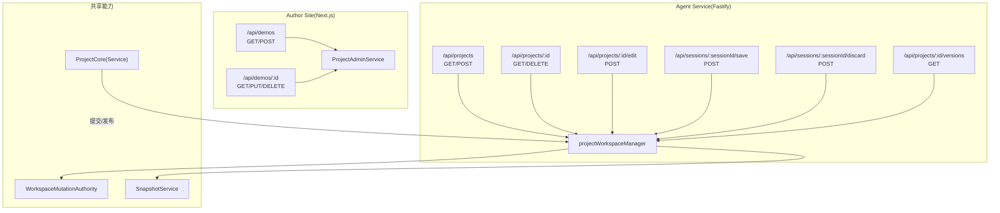
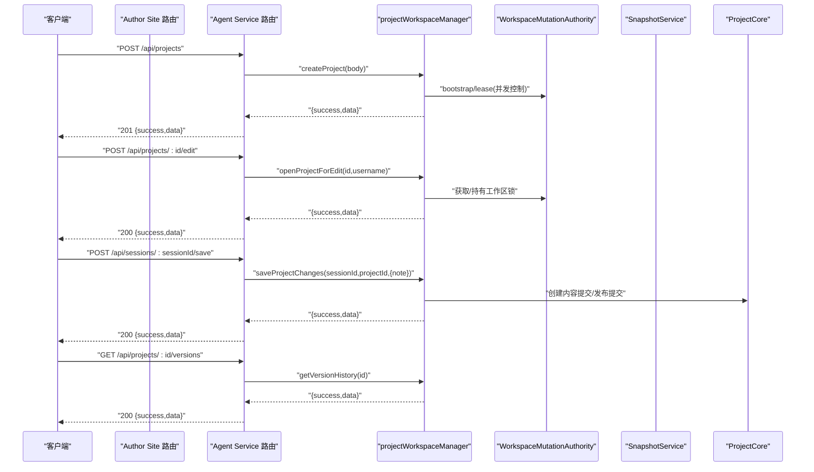
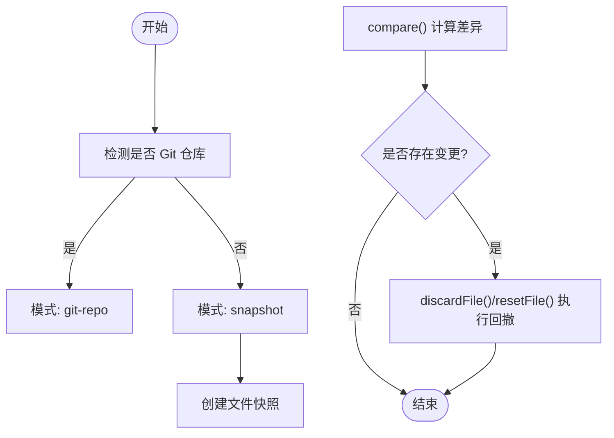
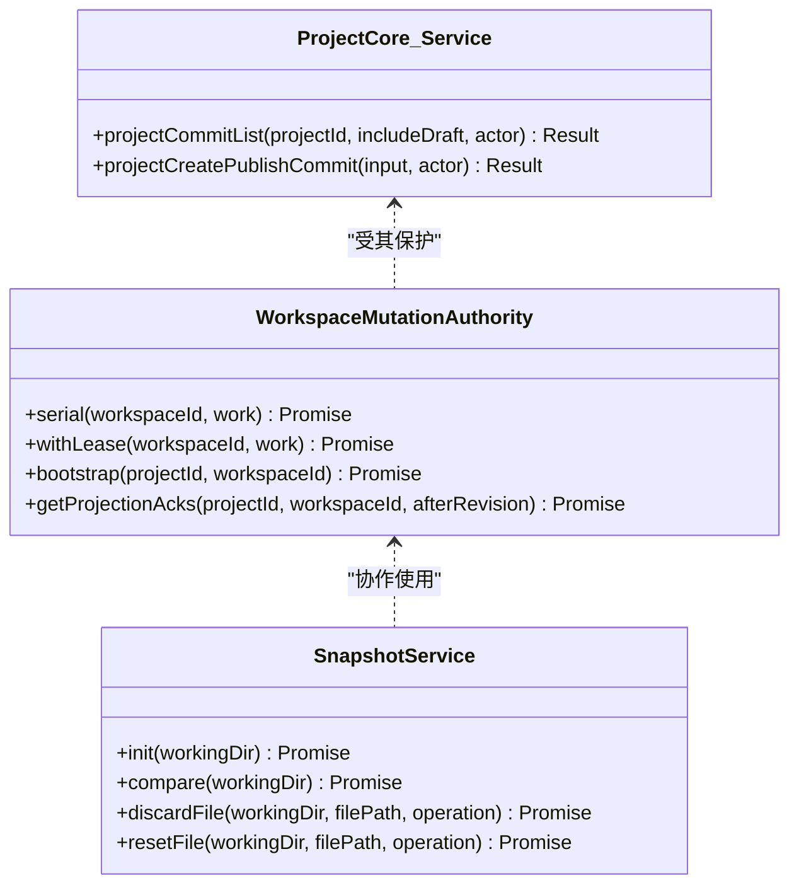
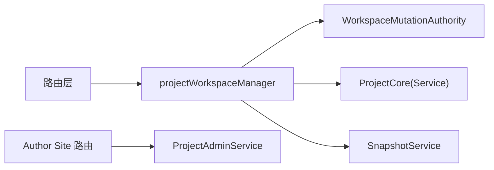

# 项目管理接口

<cite>
**本文引用的文件**   
- [packages/agent-service/src/routes/projects.ts](file://packages/agent-service/src/routes/projects.ts)
- [packages/author-site/src/app/api/demos/route.ts](file://packages/author-site/src/app/api/demos/route.ts)
- [packages/author-site/src/app/api/demos/[id]/route.ts](file://packages/author-site/src/app/api/demos/[id]/route.ts)
- [packages/author-site/src/lib/project-admin-service.ts](file://packages/author-site/src/lib/project-admin-service.ts)
- [packages/agent-service/src/workspace/workspace-mutation-authority.ts](file://packages/agent-service/src/workspace/workspace-mutation-authority.ts)
- [packages/agent-service/src/session/snapshot-service.ts](file://packages/agent-service/src/session/snapshot-service.ts)
- [packages/agent-service/src/routes/agent.ts](file://packages/agent-service/src/routes/agent.ts)
- [packages/project-core/src/service.ts](file://packages/project-core/src/service.ts)
- [docs/项目文档/创作端/06-基础设施/技术/01_路由设计.md](file://docs/项目文档/创作端/06-基础设施/技术/01_路由设计.md)
</cite>

## 目录
1. [简介](#简介)
2. [项目结构](#项目结构)
3. [核心组件](#核心组件)
4. [架构总览](#架构总览)
5. [详细组件分析](#详细组件分析)
6. [依赖关系分析](#依赖关系分析)
7. [性能与并发](#性能与并发)
8. [故障排查指南](#故障排查指南)
9. [结论](#结论)
10. [附录：API 规范与示例](#附录api-规范与示例)

## 简介
本文件为 Workbench 平台“项目管理”功能的 REST API 文档，覆盖以下范围：
- 项目 CRUD（创建、读取、更新、删除）
- 项目列表查询
- 项目配置管理（作者偏好等）
- 版本控制操作（快照、回滚、差异比较）
- 权限验证、工作区同步机制与并发访问控制
- 统一响应格式、错误码策略与最佳实践

说明：
- 本文同时记录两套实现路径：
  - Agent Service（Fastify）：面向后端服务集成的稳定接口
  - Author Site（Next.js App Router）：面向创作端的演示与管理入口
- 所有 HTTP 方法、URL 模式、请求参数、响应结构与状态码均以源码为依据进行整理。

## 项目结构
与项目管理相关的代码主要分布在以下位置：
- Agent Service 路由层：定义 /api/projects 系列端点
- Author Site 路由层：提供演示与管理类的项目操作
- 工作区与权限：工作区变更权限与并发控制
- 快照服务：非 Git 仓库场景下的快照与回滚能力
- 项目核心服务：提交历史、发布提交等能力

图表来源
- [packages/agent-service/src/routes/projects.ts:1-309](file://packages/agent-service/src/routes/projects.ts#L1-L309)
- [packages/author-site/src/app/api/demos/route.ts:1-74](file://packages/author-site/src/app/api/demos/route.ts#L1-L74)
- [packages/author-site/src/app/api/demos/[id]/route.ts:69-109](file://packages/author-site/src/app/api/demos/[id]/route.ts#L69-L109)
- [packages/agent-service/src/workspace/workspace-mutation-authority.ts:160-179](file://packages/agent-service/src/workspace/workspace-mutation-authority.ts#L160-L179)
- [packages/agent-service/src/session/snapshot-service.ts:1-38](file://packages/agent-service/src/session/snapshot-service.ts#L1-L38)
- [packages/project-core/src/service.ts:1945-1986](file://packages/project-core/src/service.ts#L1945-L1986)

章节来源
- [packages/agent-service/src/routes/projects.ts:1-309](file://packages/agent-service/src/routes/projects.ts#L1-L309)
- [packages/author-site/src/app/api/demos/route.ts:1-74](file://packages/author-site/src/app/api/demos/route.ts#L1-L74)
- [packages/author-site/src/app/api/demos/[id]/route.ts:69-109](file://packages/author-site/src/app/api/demos/[id]/route.ts#L69-L109)

## 核心组件
- 路由层
  - Agent Service：/api/projects 系列端点，负责项目生命周期与会话编辑流程
  - Author Site：/api/demos 系列端点，用于演示与管理项目
- 服务层
  - ProjectAdminService：封装项目管理的业务逻辑与错误映射
  - projectWorkspaceManager：工作空间管理器，协调项目、会话、版本等操作
  - SnapshotService：快照与回滚能力（支持 Git 与非 Git 两种模式）
  - WorkspaceMutationAuthority：工作区并发与权限控制（租约、序列化队列）
- 核心能力
  - ProjectCore：提交历史、发布提交等底层能力

章节来源
- [packages/author-site/src/lib/project-admin-service.ts:1-56](file://packages/author-site/src/lib/project-admin-service.ts#L1-L56)
- [packages/agent-service/src/routes/projects.ts:1-309](file://packages/agent-service/src/routes/projects.ts#L1-L309)
- [packages/agent-service/src/session/snapshot-service.ts:1-38](file://packages/agent-service/src/session/snapshot-service.ts#L1-L38)
- [packages/agent-service/src/workspace/workspace-mutation-authority.ts:160-179](file://packages/agent-service/src/workspace/workspace-mutation-authority.ts#L160-L179)
- [packages/project-core/src/service.ts:1945-1986](file://packages/project-core/src/service.ts#L1945-L1986)

## 架构总览
下图展示了从客户端到各层的调用链路，包括权限校验、工作区并发控制与快照/版本能力。

图表来源
- [packages/agent-service/src/routes/projects.ts:36-91](file://packages/agent-service/src/routes/projects.ts#L36-L91)
- [packages/agent-service/src/routes/projects.ts:113-151](file://packages/agent-service/src/routes/projects.ts#L113-L151)
- [packages/agent-service/src/routes/projects.ts:193-235](file://packages/agent-service/src/routes/projects.ts#L193-L235)
- [packages/agent-service/src/routes/projects.ts:279-305](file://packages/agent-service/src/routes/projects.ts#L279-L305)
- [packages/agent-service/src/workspace/workspace-mutation-authority.ts:160-179](file://packages/agent-service/src/workspace/workspace-mutation-authority.ts#L160-L179)
- [packages/project-core/src/service.ts:1945-1986](file://packages/project-core/src/service.ts#L1945-L1986)

## 详细组件分析

### Agent Service 项目管理 API
- 基础约定
  - 成功响应：{ success: true, data: T }
  - 失败响应：{ success: false, error: { code, message, details? } }
  - 常见状态码：200/201/400/404/500

- 端点清单
  - GET /api/projects
    - 功能：获取项目列表
    - 成功：200
    - 失败：500（FILE_READ_ERROR）
  - POST /api/projects
    - 功能：创建新项目
    - 请求体：CreateProjectRequest（至少包含 name）
    - 成功：201
    - 失败：400（INVALID_REQUEST）、500（WORKSPACE_CREATE_ERROR）
  - GET /api/projects/:id
    - 功能：获取项目详情
    - 成功：200
    - 失败：404（PROJECT_NOT_FOUND）、500（FILE_READ_ERROR）
  - DELETE /api/projects/:id
    - 功能：删除项目
    - 成功：200
    - 失败：500（FILE_WRITE_ERROR）
  - POST /api/projects/:id/edit
    - 功能：打开项目编辑（建立会话）
    - 请求体：OpenProjectEditRequest（至少包含 username）
    - 成功：200
    - 失败：400（INVALID_REQUEST）、404（PROJECT_NOT_FOUND）、500（WORKSPACE_CREATE_ERROR）
  - GET /api/sessions/:sessionId
    - 功能：获取会话信息
    - 查询参数：projectId（必填）
    - 成功：200
    - 失败：400（INVALID_REQUEST）、404（SESSION_NOT_FOUND）、500（FILE_READ_ERROR）
  - POST /api/sessions/:sessionId/save
    - 功能：保存项目变更
    - 查询参数：projectId（必填）
    - 请求体：SaveProjectChangesRequest（可含 note）
    - 成功：200
    - 失败：400（INVALID_REQUEST/SESSION_NOT_EDITING）、500（FILE_WRITE_ERROR）
  - POST /api/sessions/:sessionId/discard
    - 功能：放弃编辑
    - 查询参数：projectId（必填）
    - 成功：200
    - 失败：400（INVALID_REQUEST/SESSION_NOT_EDITING）、500（FILE_WRITE_ERROR）
  - GET /api/projects/:id/versions
    - 功能：获取版本历史
    - 成功：200
    - 失败：404（PROJECT_NOT_FOUND）、500（FILE_READ_ERROR）

- 关键实现要点
  - 参数校验：对必填字段进行类型与存在性检查
  - 错误映射：将内部异常转换为标准错误码与消息
  - 日志记录：关键路径均记录错误上下文

章节来源
- [packages/agent-service/src/routes/projects.ts:19-34](file://packages/agent-service/src/routes/projects.ts#L19-L34)
- [packages/agent-service/src/routes/projects.ts:36-63](file://packages/agent-service/src/routes/projects.ts#L36-L63)
- [packages/agent-service/src/routes/projects.ts:65-91](file://packages/agent-service/src/routes/projects.ts#L65-L91)
- [packages/agent-service/src/routes/projects.ts:93-109](file://packages/agent-service/src/routes/projects.ts#L93-L109)
- [packages/agent-service/src/routes/projects.ts:113-151](file://packages/agent-service/src/routes/projects.ts#L113-L151)
- [packages/agent-service/src/routes/projects.ts:153-191](file://packages/agent-service/src/routes/projects.ts#L153-L191)
- [packages/agent-service/src/routes/projects.ts:193-235](file://packages/agent-service/src/routes/projects.ts#L193-L235)
- [packages/agent-service/src/routes/projects.ts:237-275](file://packages/agent-service/src/routes/projects.ts#L237-L275)
- [packages/agent-service/src/routes/projects.ts:279-305](file://packages/agent-service/src/routes/projects.ts#L279-L305)

### Author Site 演示与管理 API
- 端点清单
  - GET /api/demos
    - 功能：列出项目（演示用途）
    - 成功：200
    - 失败：500（FILE_READ_ERROR）
  - POST /api/demos
    - 功能：创建项目（演示用途）
    - 请求体：name（必填字符串）、category（可选字符串）、templateId（可选字符串）
    - 成功：201
    - 失败：400（INVALID_REQUEST）、404（TEMPLATE_NOT_FOUND 映射为 PROJECT_NOT_FOUND）、500（FILE_WRITE_ERROR）
  - GET /api/demos/:id
    - 功能：获取项目详情（演示用途）
    - 成功：200
    - 失败：500（FILE_WRITE_ERROR）
  - PUT /api/demos/:id
    - 功能：更新项目配置（如 authoringPreferences）
    - 成功：200
    - 失败：500（FILE_WRITE_ERROR）
  - DELETE /api/demos/:id
    - 功能：删除项目（演示用途）
    - 成功：200
    - 失败：500（FILE_WRITE_ERROR）

- 错误映射与统一响应
  - 使用 projectAdminResponse 将内部结果映射为标准响应
  - 错误码映射表：例如 TEMPLATE_NOT_FOUND → PROJECT_NOT_FOUND、PROJECT_LOCKED → FORBIDDEN 等

章节来源
- [packages/author-site/src/app/api/demos/route.ts:8-21](file://packages/author-site/src/app/api/demos/route.ts#L8-L21)
- [packages/author-site/src/app/api/demos/route.ts:23-74](file://packages/author-site/src/app/api/demos/route.ts#L23-L74)
- [packages/author-site/src/app/api/demos/[id]/route.ts:69-109](file://packages/author-site/src/app/api/demos/[id]/route.ts#L69-L109)
- [packages/author-site/src/lib/project-admin-service.ts:14-34](file://packages/author-site/src/lib/project-admin-service.ts#L14-L34)
- [packages/author-site/src/lib/project-admin-service.ts:36-56](file://packages/author-site/src/lib/project-admin-service.ts#L36-L56)

### 版本控制与快照能力
- 版本历史
  - GET /api/projects/:id/versions
  - 返回 headCommitId、commits、totalCommits 等信息
  - 底层由 ProjectCore 的提交列表与发布提交能力支撑

- 快照与回滚
  - 初始化：根据工作区是否为 Git 仓库选择模式（git-repo 或 snapshot）
  - 差异比较：compare() 返回 staged/unstaged 变更集合
  - 文件回撤：discardFile()/resetFile() 支持按文件粒度恢复
  - 全量回撤：基于 compare 结果批量处理

图表来源
- [packages/agent-service/src/session/snapshot-service.ts:17-37](file://packages/agent-service/src/session/snapshot-service.ts#L17-L37)
- [packages/agent-service/src/session/snapshot-service.ts:302-329](file://packages/agent-service/src/session/snapshot-service.ts#L302-L329)
- [packages/agent-service/src/routes/agent.ts:396-430](file://packages/agent-service/src/routes/agent.ts#L396-L430)
- [packages/project-core/src/service.ts:1945-1986](file://packages/project-core/src/service.ts#L1945-L1986)

章节来源
- [packages/agent-service/src/routes/projects.ts:279-305](file://packages/agent-service/src/routes/projects.ts#L279-L305)
- [packages/agent-service/src/session/snapshot-service.ts:1-38](file://packages/agent-service/src/session/snapshot-service.ts#L1-L38)
- [packages/agent-service/src/session/snapshot-service.ts:302-329](file://packages/agent-service/src/session/snapshot-service.ts#L302-L329)
- [packages/agent-service/src/routes/agent.ts:396-430](file://packages/agent-service/src/routes/agent.ts#L396-L430)
- [packages/project-core/src/service.ts:1945-1986](file://packages/project-core/src/service.ts#L1945-L1986)

### 权限验证与工作区并发控制
- 权限验证
  - 通过 requireProjectAccess 等方法校验操作者对项目资源的访问权限
  - 无权限时返回 FORBIDDEN

- 并发控制
  - 基于工作区维度的串行化队列 serial(workspaceId, work)
  - 租约机制 withLease 保证同一工作区的写操作串行执行
  - 投影确认（projection-acks）用于协作一致性

图表来源
- [packages/agent-service/src/workspace/workspace-mutation-authority.ts:160-179](file://packages/agent-service/src/workspace/workspace-mutation-authority.ts#L160-L179)
- [packages/agent-service/src/workspace/workspace-mutation-authority.ts:853-877](file://packages/agent-service/src/workspace/workspace-mutation-authority.ts#L853-L877)
- [packages/agent-service/src/session/snapshot-service.ts:1-38](file://packages/agent-service/src/session/snapshot-service.ts#L1-L38)
- [packages/project-core/src/service.ts:1945-1986](file://packages/project-core/src/service.ts#L1945-L1986)

章节来源
- [packages/agent-service/src/workspace/workspace-mutation-authority.ts:160-179](file://packages/agent-service/src/workspace/workspace-mutation-authority.ts#L160-L179)
- [packages/agent-service/src/workspace/workspace-mutation-authority.ts:853-877](file://packages/agent-service/src/workspace/workspace-mutation-authority.ts#L853-L877)
- [packages/project-core/src/service.ts:1945-1986](file://packages/project-core/src/service.ts#L1945-L1986)

## 依赖关系分析
- 路由层依赖
  - Agent Service 路由依赖 projectWorkspaceManager 完成具体业务
  - Author Site 路由依赖 ProjectAdminService 并统一错误映射
- 服务层依赖
  - projectWorkspaceManager 依赖 WorkspaceMutationAuthority 进行并发与权限控制
  - 版本与提交能力依赖 ProjectCore
  - 快照能力由 SnapshotService 提供，并在需要时配合 Git 命令

图表来源
- [packages/agent-service/src/routes/projects.ts:1-309](file://packages/agent-service/src/routes/projects.ts#L1-L309)
- [packages/author-site/src/app/api/demos/route.ts:1-74](file://packages/author-site/src/app/api/demos/route.ts#L1-L74)
- [packages/author-site/src/lib/project-admin-service.ts:1-56](file://packages/author-site/src/lib/project-admin-service.ts#L1-L56)
- [packages/agent-service/src/workspace/workspace-mutation-authority.ts:160-179](file://packages/agent-service/src/workspace/workspace-mutation-authority.ts#L160-L179)
- [packages/agent-service/src/session/snapshot-service.ts:1-38](file://packages/agent-service/src/session/snapshot-service.ts#L1-L38)
- [packages/project-core/src/service.ts:1945-1986](file://packages/project-core/src/service.ts#L1945-L1986)

章节来源
- [packages/agent-service/src/routes/projects.ts:1-309](file://packages/agent-service/src/routes/projects.ts#L1-L309)
- [packages/author-site/src/app/api/demos/route.ts:1-74](file://packages/author-site/src/app/api/demos/route.ts#L1-L74)
- [packages/author-site/src/lib/project-admin-service.ts:1-56](file://packages/author-site/src/lib/project-admin-service.ts#L1-L56)

## 性能与并发
- 并发控制
  - 通过 serial 与 withLease 确保同一工作区写操作的串行化，避免竞态条件
- I/O 优化
  - 项目列表与详情尽量采用元数据快速读取
  - 版本历史仅加载必要字段，减少传输体积
- 幂等性与重试
  - 建议客户端对创建/保存等写操作实现幂等键与重试退避
- 缓存建议
  - 项目列表与版本历史适合短 TTL 缓存，降低重复扫描开销

[本节为通用指导，不直接分析具体文件]

## 故障排查指南
- 常见问题定位
  - 400 INVALID_REQUEST：检查必填字段与类型（如 name、username、projectId）
  - 404 PROJECT_NOT_FOUND/SESSION_NOT_FOUND：确认 ID 是否正确、资源是否存在
  - 403 FORBIDDEN：检查当前操作者是否有项目访问权限
  - 423 PROJECT_LOCKED：项目被锁定，等待解锁或联系管理员
  - 500 FILE_READ_ERROR/FILE_WRITE_ERROR：查看服务端日志，确认文件系统权限与路径
- 日志与诊断
  - 路由层在捕获异常时记录错误上下文，便于定位问题
  - 快照与 Git 操作失败会输出详细错误信息

章节来源
- [packages/agent-service/src/routes/projects.ts:24-33](file://packages/agent-service/src/routes/projects.ts#L24-L33)
- [packages/agent-service/src/routes/projects.ts:53-62](file://packages/agent-service/src/routes/projects.ts#L53-L62)
- [packages/agent-service/src/routes/projects.ts:71-90](file://packages/agent-service/src/routes/projects.ts#L71-L90)
- [packages/agent-service/src/routes/projects.ts:99-108](file://packages/agent-service/src/routes/projects.ts#L99-L108)
- [packages/agent-service/src/routes/projects.ts:131-150](file://packages/agent-service/src/routes/projects.ts#L131-L150)
- [packages/agent-service/src/routes/projects.ts:171-190](file://packages/agent-service/src/routes/projects.ts#L171-L190)
- [packages/agent-service/src/routes/projects.ts:215-234](file://packages/agent-service/src/routes/projects.ts#L215-L234)
- [packages/agent-service/src/routes/projects.ts:255-274](file://packages/agent-service/src/routes/projects.ts#L255-L274)
- [packages/agent-service/src/routes/projects.ts:285-304](file://packages/agent-service/src/routes/projects.ts#L285-L304)

## 结论
- Agent Service 提供了完整的项目管理与编辑会话 API，具备完善的参数校验与错误映射
- Author Site 提供演示与管理入口，便于快速体验与调试
- 工作区并发控制与快照能力为多用户协作与版本回溯提供了保障
- 建议在集成时遵循统一响应格式与错误码策略，结合幂等与重试提升稳定性

[本节为总结，不直接分析具体文件]

## 附录：API 规范与示例

### 统一响应格式
- 成功：{ success: true, data: T }
- 失败：{ success: false, error: { code, message, details? } }

章节来源
- [docs/项目文档/创作端/06-基础设施/技术/01_路由设计.md:117-171](file://docs/项目文档/创作端/06-基础设施/技术/01_路由设计.md#L117-L171)

### 请求/响应示例（摘要）
- 创建项目（Agent Service）
  - POST /api/projects
  - 请求体：{ name: "示例项目", description?: "可选描述" }
  - 成功响应：{ success: true, data: { id, name, ... } }
  - 失败响应：{ success: false, error: { code: "INVALID_REQUEST", message: "项目名称不能为空" } }

- 打开编辑（Agent Service）
  - POST /api/projects/:id/edit
  - 请求体：{ username: "张三" }
  - 成功响应：{ success: true, data: { sessionId, ... } }

- 保存变更（Agent Service）
  - POST /api/sessions/:sessionId/save?projectId=...
  - 请求体：{ note: "修复了首页布局" }
  - 成功响应：{ success: true, data: { commitId, ... } }

- 获取版本历史（Agent Service）
  - GET /api/projects/:id/versions
  - 成功响应：{ success: true, data: { projectId, headCommitId, commits: [...], totalCommits: N } }

- 演示创建项目（Author Site）
  - POST /api/demos
  - 请求体：{ name: "演示项目", category?: "前端", templateId?: "tpl-xxx" }
  - 成功响应：{ success: true, data: { id, name, ... } }

注意：以上示例字段以实际实现为准，具体字段请参考对应路由与服务实现。

章节来源
- [packages/agent-service/src/routes/projects.ts:36-63](file://packages/agent-service/src/routes/projects.ts#L36-L63)
- [packages/agent-service/src/routes/projects.ts:113-151](file://packages/agent-service/src/routes/projects.ts#L113-L151)
- [packages/agent-service/src/routes/projects.ts:193-235](file://packages/agent-service/src/routes/projects.ts#L193-L235)
- [packages/agent-service/src/routes/projects.ts:279-305](file://packages/agent-service/src/routes/projects.ts#L279-L305)
- [packages/author-site/src/app/api/demos/route.ts:23-74](file://packages/author-site/src/app/api/demos/route.ts#L23-L74)