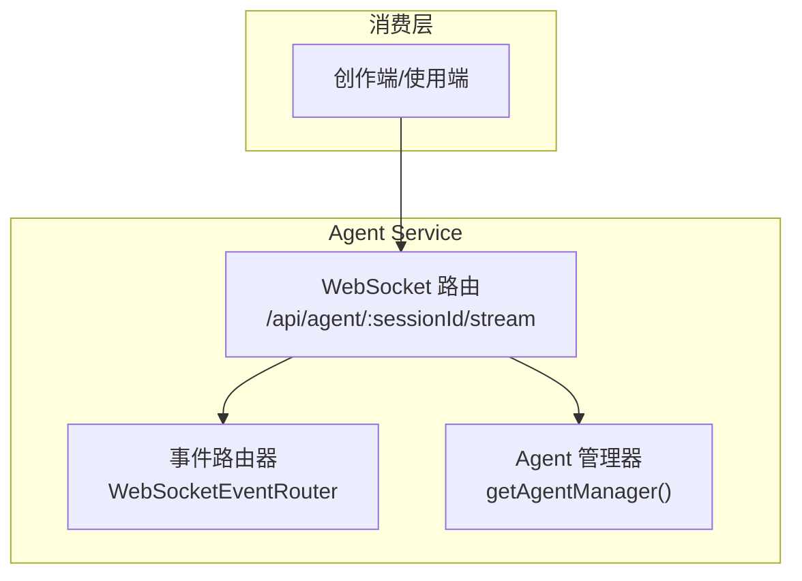
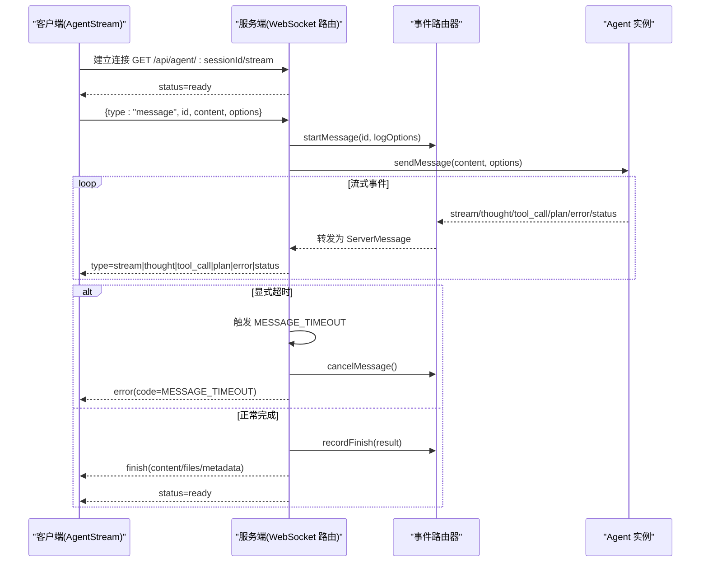
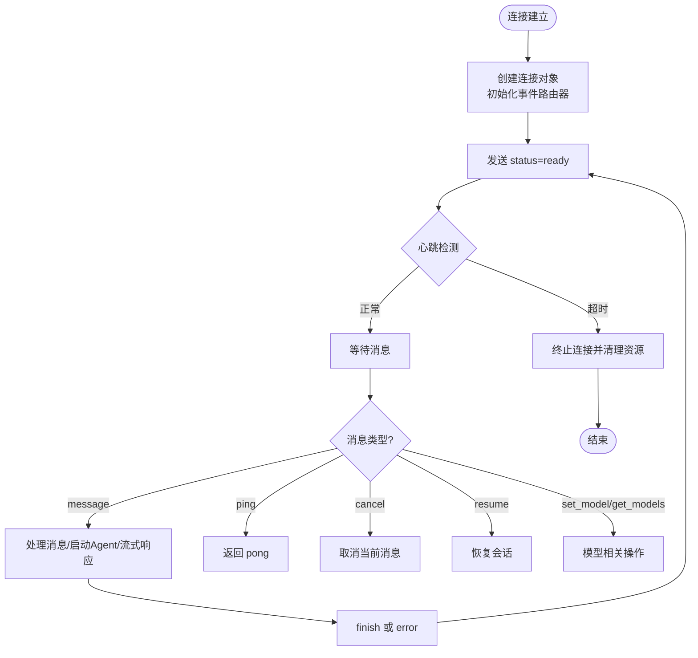
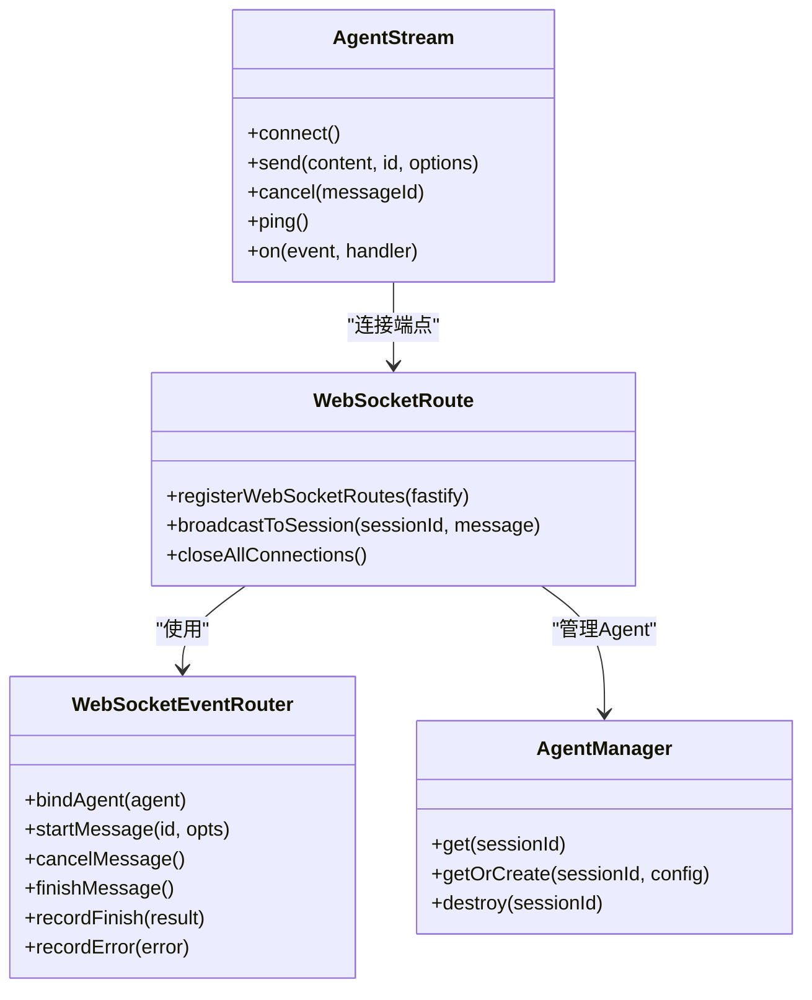

# WebSocket API

<cite>
**本文引用的文件**   
- [packages/agent-service/src/routes/websocket.ts](file://packages/agent-service/src/routes/websocket.ts)
- [packages/agent-service/src/routes/ws-event-router.ts](file://packages/agent-service/src/routes/ws-event-router.ts)
- [packages/agent-client/src/client.ts](file://packages/agent-client/src/client.ts)
- [packages/agent-client/src/types.ts](file://packages/agent-client/src/types.ts)
- [packages/agent-service/src/core/types.ts](file://packages/agent-service/src/core/types.ts)
- [docs/项目文档/独立Agent服务层/02-接口规范.md](file://docs/项目文档/独立Agent服务层/02-接口规范.md)
- [docs/项目文档/项目总览.md](file://docs/项目文档/项目总览.md)
</cite>

## 目录
1. [简介](#简介)
2. [项目结构](#项目结构)
3. [核心组件](#核心组件)
4. [架构总览](#架构总览)
5. [详细组件分析](#详细组件分析)
6. [依赖关系分析](#依赖关系分析)
7. [性能与连接池策略](#性能与连接池策略)
8. [故障排查指南](#故障排查指南)
9. [结论](#结论)
10. [附录：消息格式与事件清单](#附录消息格式与事件清单)

## 简介
本文件为 Workbench 平台的 WebSocket API 技术文档，聚焦于 Agent Service 提供的实时通信协议。内容涵盖：
- 连接建立、认证机制与连接生命周期管理
- 客户端配置、重连机制、心跳检测与错误处理
- 所有消息类型与事件格式（AI 对话流式响应、权限与用户选择交互、模型切换等）
- 调试工具使用建议与性能优化要点

说明：
- 当前公开的 Agent HTTP/WebSocket 路由不在 agent-service 内单独实现 API Key 或 Bearer Token 鉴权，访问控制主要由上游创作端登录态、CORS 和部署网络边界承担。内部接口用于 author-site 管理后台向 agent-service 推送全局或 Session 级模型配置时，使用 x-internal-token 头与 INTERNAL_API_TOKEN 做内部接口鉴权。

章节来源
- [docs/项目文档/独立Agent服务层/02-接口规范.md](file://docs/项目文档/独立Agent服务层/02-接口规范.md)

## 项目结构
Workbench 的 WebSocket 能力由 Agent Service 提供，前端通过 Agent Client SDK 建立连接并收发事件。整体角色如下：
- Agent Service：基于 Fastify + ws 暴露 /api/agent/:sessionId/stream 的 WebSocket 端点，负责会话管理、Agent 生命周期、事件路由与广播。
- Agent Client：浏览器/Node 环境下的轻量客户端，封装连接、发送消息、自动重连与事件分发。
- 事件路由器：将后端 Agent 事件统一转换为面向前端的 ServerMessage 格式。

图表来源
- [packages/agent-service/src/routes/websocket.ts:134-180](file://packages/agent-service/src/routes/websocket.ts#L134-L180)
- [packages/agent-service/src/routes/ws-event-router.ts:113-147](file://packages/agent-service/src/routes/ws-event-router.ts#L113-L147)

章节来源
- [docs/项目文档/项目总览.md:33-82](file://docs/项目文档/项目总览.md#L33-L82)
- [packages/agent-service/src/routes/websocket.ts:134-180](file://packages/agent-service/src/routes/websocket.ts#L134-L180)

## 核心组件
- WebSocket 路由与连接管理
  - 注册 /api/agent/:sessionId/stream 端点，维护 ActiveConnection 集合，支持心跳清理、关闭回收、按会话广播。
- 事件路由器
  - 绑定 Agent 事件到统一的 ServerMessage 输出，支持消息开始/取消/结束、运行日志记录。
- 客户端 SDK
  - 提供 stream(sessionId) 方法构建 ws://.../api/agent/{sessionId}/stream 连接，内置指数退避重连、ping/pong、事件分发。

章节来源
- [packages/agent-service/src/routes/websocket.ts:134-180](file://packages/agent-service/src/routes/websocket.ts#L134-L180)
- [packages/agent-service/src/routes/ws-event-router.ts:113-147](file://packages/agent-service/src/routes/ws-event-router.ts#L113-L147)
- [packages/agent-client/src/client.ts:200-204](file://packages/agent-client/src/client.ts#L200-L204)

## 架构总览
下图展示一次“发送消息并接收流式响应”的端到端流程，包括状态推进、进度心跳、超时控制与完成收尾。

图表来源
- [packages/agent-service/src/routes/websocket.ts:208-486](file://packages/agent-service/src/routes/websocket.ts#L208-L486)
- [packages/agent-service/src/routes/ws-event-router.ts:149-195](file://packages/agent-service/src/routes/ws-event-router.ts#L149-L195)

## 详细组件分析

### 连接建立与生命周期
- 连接建立
  - 客户端调用 client.stream(sessionId)，构造 ws://baseUrl/api/agent/{sessionId}/stream 并发起握手。
  - 服务端收到后创建 ActiveConnection，初始化事件路由器，发送 status=ready。
- 心跳与保活
  - 服务端周期性扫描 connections，超过 HEARTBEAT_TIMEOUT 未收到 ping 的连接将被终止。
  - 客户端可主动发送 {type:"ping"}，服务端返回 {type:"pong", timestamp}。
- 关闭与清理
  - close 事件中销毁事件路由器、从连接表移除；若该 sessionId 无其他连接且 Agent 非 processing，则销毁 Agent 并清理临时工作空间与会话元数据。

图表来源
- [packages/agent-service/src/routes/websocket.ts:122-132](file://packages/agent-service/src/routes/websocket.ts#L122-L132)
- [packages/agent-service/src/routes/websocket.ts:715-721](file://packages/agent-service/src/routes/websocket.ts#L715-L721)
- [packages/agent-service/src/routes/websocket.ts:812-846](file://packages/agent-service/src/routes/websocket.ts#L812-L846)

章节来源
- [packages/agent-client/src/client.ts:200-204](file://packages/agent-client/src/client.ts#L200-L204)
- [packages/agent-service/src/routes/websocket.ts:134-180](file://packages/agent-service/src/routes/websocket.ts#L134-L180)
- [packages/agent-service/src/routes/websocket.ts:122-132](file://packages/agent-service/src/routes/websocket.ts#L122-L132)
- [packages/agent-service/src/routes/websocket.ts:812-846](file://packages/agent-service/src/routes/websocket.ts#L812-L846)

### 认证机制
- 公开路由鉴权：当前 Agent HTTP/WebSocket 路由不实现 API Key/Bearer Token 鉴权，安全由上游登录态、CORS 与部署网络边界保障。
- 内部接口鉴权：author-site 管理后台向 agent-service 推送模型配置时使用 x-internal-token 与 INTERNAL_API_TOKEN。

章节来源
- [docs/项目文档/独立Agent服务层/02-接口规范.md](file://docs/项目文档/独立Agent服务层/02-接口规范.md)

### 消息类型与事件格式

#### 客户端 → 服务端（ClientMessage）
- message：发送 AI 对话消息
  - 字段：id?, content, workingDir?, projectId?, demoId?, model?, images?, files?, systemPrompt?, options{timeout?, stream?, resumeSessionId?}, timestamp?
- cancel：取消当前正在处理的请求
  - 字段：id?, sessionId?
- ping：心跳探测
  - 字段：timestamp?
- resume：恢复指定会话
  - 字段：options.resumeSessionId?, workingDir?, projectId?, demoId?
- set_model：设置当前会话模型
  - 字段：modelId
- get_models：获取可用模型列表
  - 字段：workingDir?, projectId?, demoId?
- permission_response：权限确认响应
  - 字段：permissionId, optionId, responseContent?
- user_choice_response：用户选择响应
  - 字段：requestId, choice{type:"option"/"custom"/"cancel", ...}
- console_data：控制台日志批量上报
  - 字段：entries[{level, args, timestamp}]

章节来源
- [packages/agent-service/src/routes/websocket.ts:39-67](file://packages/agent-service/src/routes/websocket.ts#L39-L67)
- [packages/agent-service/src/routes/websocket.ts:208-808](file://packages/agent-service/src/routes/websocket.ts#L208-L808)

#### 服务端 → 客户端（ServerMessage）
- stream：文本流片段
  - 字段：id?, sessionId?, content, done?
- thought：思考过程片段
  - 字段：id?, sessionId?, content, done?
- tool_call：工具调用开始
  - 字段：id?, sessionId?, toolCallId, title, kind, toolCallStatus, parameters
- tool_call_update：工具调用更新/结果
  - 字段：id?, sessionId?, toolCallId, toolCallStatus, content, result, details, durationMs, error
- plan：计划信息
  - 字段：id?, sessionId?, content
- error：错误
  - 字段：id?, sessionId?, error{code, message, details?}
- finish：完成
  - 字段：id?, sessionId?, content, files, metadata
- status：状态
  - 字段：id?, sessionId?, status
- pong：心跳应答
  - 字段：timestamp
- permission_request：权限请求
  - 字段：id?, sessionId?, permissionRequest{sessionId, options[], toolCall{...}}
- user_choice_request：用户选择请求
  - 字段：id?, sessionId?, userChoiceRequest{requestId, sessionId, question, description?, options[], allowCustom}
- models：模型列表
  - 字段：sessionId, models[], currentModelId?, canSwitch?

章节来源
- [packages/agent-service/src/routes/ws-event-router.ts:22-104](file://packages/agent-service/src/routes/ws-event-router.ts#L22-L104)
- [packages/agent-service/src/routes/ws-event-router.ts:197-321](file://packages/agent-service/src/routes/ws-event-router.ts#L197-L321)

#### 事件映射与处理
- 事件路由器将 Agent 事件（stream/thought/tool_call/tool_call_update/plan/error/status/permission_request/user_choice_request）映射为对应的 ServerMessage 并下发。
- 对 activeMessage 进行开始/取消/结束标记，确保取消后的事件不再转发。

章节来源
- [packages/agent-service/src/routes/ws-event-router.ts:10-20](file://packages/agent-service/src/routes/ws-event-router.ts#L10-L20)
- [packages/agent-service/src/routes/ws-event-router.ts:149-195](file://packages/agent-service/src/routes/ws-event-router.ts#L149-L195)
- [packages/agent-service/src/routes/ws-event-router.ts:197-321](file://packages/agent-service/src/routes/ws-event-router.ts#L197-L321)

### 客户端连接配置与重连
- 连接 URL：client.stream(sessionId) 会将 baseUrl 的 http(s) 替换为 ws(s)，拼接 /api/agent/{sessionId}/stream。
- 重连策略：指数退避，最大重试次数默认 5，每次延迟 = baseDelay * attempt。
- 状态事件：on("status") 监听 connected/disconnected。
- 发送与取消：send(content, id, options)、cancel(messageId)。
- 心跳：ping() 发送心跳，服务端回 pong。

章节来源
- [packages/agent-client/src/client.ts:200-204](file://packages/agent-client/src/client.ts#L200-L204)
- [packages/agent-client/src/client.ts:279-338](file://packages/agent-client/src/client.ts#L279-L338)
- [packages/agent-client/src/client.ts:340-386](file://packages/agent-client/src/client.ts#L340-L386)

### 错误处理与超时
- 参数校验：缺失必填字段返回 INVALID_PARAMS。
- 会话不存在：SESSION_NOT_FOUND。
- 消息发送异常：MESSAGE_SEND_ERROR。
- 显式超时：MESSAGE_TIMEOUT（由 options.timeout 驱动），会触发 cancel 并返回错误。
- 未知消息类型：INVALID_PARAMS（包含具体类型提示）。

章节来源
- [packages/agent-service/src/routes/websocket.ts:182-206](file://packages/agent-service/src/routes/websocket.ts#L182-L206)
- [packages/agent-service/src/routes/websocket.ts:208-220](file://packages/agent-service/src/routes/websocket.ts#L208-L220)
- [packages/agent-service/src/routes/websocket.ts:419-421](file://packages/agent-service/src/routes/websocket.ts#L419-L421)
- [packages/agent-service/src/routes/websocket.ts:800-808](file://packages/agent-service/src/routes/websocket.ts#L800-L808)

### 协作编辑与预览更新
- 当前协议中不包含专用的“文件同步事件”或“预览更新通知”。文件变更通常随 finish 中的 files 字段或工具调用结果体现。
- 如需在创作端触发预览刷新，应关注 finish 或工具调用结果中包含的文件路径变化，并结合业务侧刷新逻辑。

章节来源
- [packages/agent-service/src/routes/ws-event-router.ts:22-104](file://packages/agent-service/src/routes/ws-event-router.ts#L22-L104)
- [packages/agent-service/src/routes/websocket.ts:425-445](file://packages/agent-service/src/routes/websocket.ts#L425-L445)

## 依赖关系分析
- 路由层依赖：ws、Fastify、Agent 管理器、事件路由器、会话存储、快照服务、控制台缓冲、工具能力查询。
- 事件路由器依赖：Agent 基础事件类型、运行日志存储、日志器。
- 客户端依赖：原生 WebSocket、事件分发、重连计时器。

图表来源
- [packages/agent-service/src/routes/websocket.ts:134-180](file://packages/agent-service/src/routes/websocket.ts#L134-L180)
- [packages/agent-service/src/routes/ws-event-router.ts:113-147](file://packages/agent-service/src/routes/ws-event-router.ts#L113-L147)
- [packages/agent-client/src/client.ts:279-338](file://packages/agent-client/src/client.ts#L279-L338)

章节来源
- [packages/agent-service/src/routes/websocket.ts:134-180](file://packages/agent-service/src/routes/websocket.ts#L134-L180)
- [packages/agent-service/src/routes/ws-event-router.ts:113-147](file://packages/agent-service/src/routes/ws-event-router.ts#L113-L147)
- [packages/agent-client/src/client.ts:279-338](file://packages/agent-client/src/client.ts#L279-L338)

## 性能与连接池策略
- 心跳与空闲清理
  - 服务端每 HEARTBEAT_INTERVAL 扫描一次，超过 HEARTBEAT_TIMEOUT 未收到 ping 的连接会被终止，避免僵尸连接占用资源。
- 消息进度心跳
  - 长耗时任务期间，服务端周期性发送 status=processing 以保持链路活跃与前端反馈。
- 显式超时控制
  - 客户端可通过 options.timeout 限制单次消息处理时长，防止长时间阻塞。
- 连接复用与多连接
  - 同一 sessionId 允许多个连接并存；当最后一个连接断开且 Agent 非 processing 时，服务端清理 Agent 及临时资源。
- 客户端重连
  - 指数退避重连，避免雪崩；建议在业务层增加抖动与上限保护。

章节来源
- [packages/agent-service/src/routes/websocket.ts:78-92](file://packages/agent-service/src/routes/websocket.ts#L78-L92)
- [packages/agent-service/src/routes/websocket.ts:122-132](file://packages/agent-service/src/routes/websocket.ts#L122-L132)
- [packages/agent-service/src/routes/websocket.ts:361-371](file://packages/agent-service/src/routes/websocket.ts#L361-L371)
- [packages/agent-service/src/routes/websocket.ts:812-846](file://packages/agent-service/src/routes/websocket.ts#L812-L846)
- [packages/agent-client/src/client.ts:279-338](file://packages/agent-client/src/client.ts#L279-L338)

## 故障排查指南
- 连接无法建立
  - 检查 baseUrl 是否指向正确的 Agent Service 地址，URL 是否已正确替换为 ws(s)。
  - 观察 status 事件是否为 connected。
- 频繁断线
  - 确认客户端是否定期发送 ping；检查服务端心跳阈值配置。
- 消息无响应
  - 检查是否收到 status=processing 进度心跳；确认是否触发 MESSAGE_TIMEOUT。
- 权限/选择交互未出现
  - 监听 permission_request 与 user_choice_request 事件，并确保客户端正确回发 permission_response 与 user_choice_response。
- 模型切换失败
  - 先调用 get_models 获取可用模型；再调用 set_model 切换，注意 canSwitch 标志。

章节来源
- [packages/agent-client/src/client.ts:279-338](file://packages/agent-client/src/client.ts#L279-L338)
- [packages/agent-service/src/routes/websocket.ts:715-721](file://packages/agent-service/src/routes/websocket.ts#L715-L721)
- [packages/agent-service/src/routes/websocket.ts:208-220](file://packages/agent-service/src/routes/websocket.ts#L208-L220)
- [packages/agent-service/src/routes/websocket.ts:574-622](file://packages/agent-service/src/routes/websocket.ts#L574-L622)
- [packages/agent-service/src/routes/websocket.ts:625-712](file://packages/agent-service/src/routes/websocket.ts#L625-L712)

## 结论
本 WebSocket API 以会话为中心，围绕 Agent 的生命周期与事件流提供稳定可靠的实时通信能力。通过明确的消息/事件契约、完善的心跳与超时机制、以及客户端的重连策略，能够满足 AI 对话、工具调用、权限与用户选择交互等复杂场景。对于文件同步与预览更新，建议结合 finish 与工具调用结果进行业务层刷新。

## 附录：消息格式与事件清单

### 客户端 → 服务端（摘要）
- message：发送对话消息（支持图片/文件附件、systemPrompt、options）
- cancel：取消当前请求
- ping：心跳探测
- resume：恢复会话
- set_model：设置模型
- get_models：获取模型列表
- permission_response：权限确认
- user_choice_response：用户选择
- console_data：控制台日志批量上报

章节来源
- [packages/agent-service/src/routes/websocket.ts:39-67](file://packages/agent-service/src/routes/websocket.ts#L39-L67)
- [packages/agent-service/src/routes/websocket.ts:208-808](file://packages/agent-service/src/routes/websocket.ts#L208-L808)

### 服务端 → 客户端（摘要）
- stream/thought：流式内容
- tool_call/tool_call_update：工具调用与结果
- plan：计划
- error/finish/status：错误/完成/状态
- pong：心跳应答
- permission_request/user_choice_request：交互请求
- models：模型列表

章节来源
- [packages/agent-service/src/routes/ws-event-router.ts:22-104](file://packages/agent-service/src/routes/ws-event-router.ts#L22-L104)
- [packages/agent-service/src/routes/ws-event-router.ts:197-321](file://packages/agent-service/src/routes/ws-event-router.ts#L197-L321)

### 类型定义参考
- 服务端核心类型（AgentStatus、ErrorCode、AgentResult、FileChange、AgentEvent 等）
- 客户端类型（AgentStatus、ErrorCode、SendMessageOptions、ImageAttachment、FileAttachment、AgentInfo、ApiResponse 等）

章节来源
- [packages/agent-service/src/core/types.ts:17-35](file://packages/agent-service/src/core/types.ts#L17-L35)
- [packages/agent-service/src/core/types.ts:101-128](file://packages/agent-service/src/core/types.ts#L101-L128)
- [packages/agent-service/src/core/types.ts:167-177](file://packages/agent-service/src/core/types.ts#L167-L177)
- [packages/agent-client/src/types.ts:3-18](file://packages/agent-client/src/types.ts#L3-L18)
- [packages/agent-client/src/types.ts:70-97](file://packages/agent-client/src/types.ts#L70-L97)
- [packages/agent-client/src/types.ts:99-127](file://packages/agent-client/src/types.ts#L99-L127)
- [packages/agent-client/src/types.ts:129-160](file://packages/agent-client/src/types.ts#L129-L160)