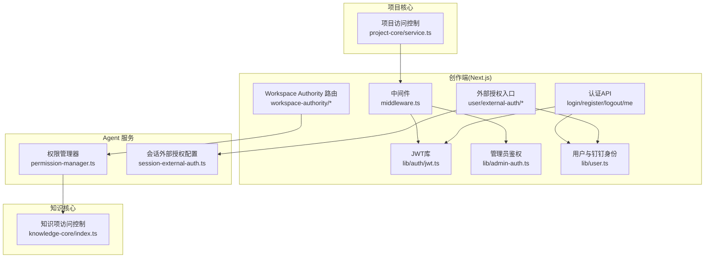
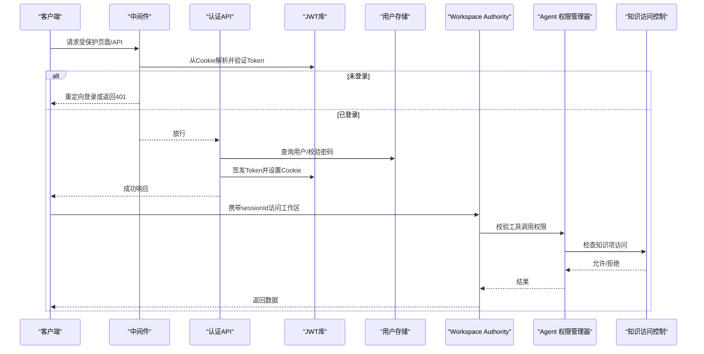
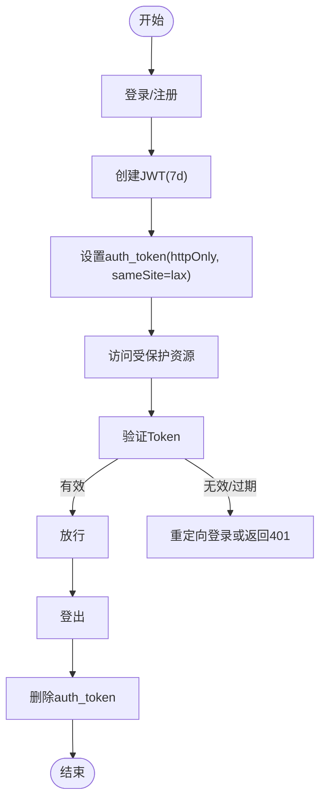
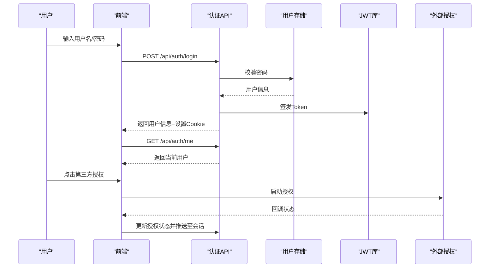
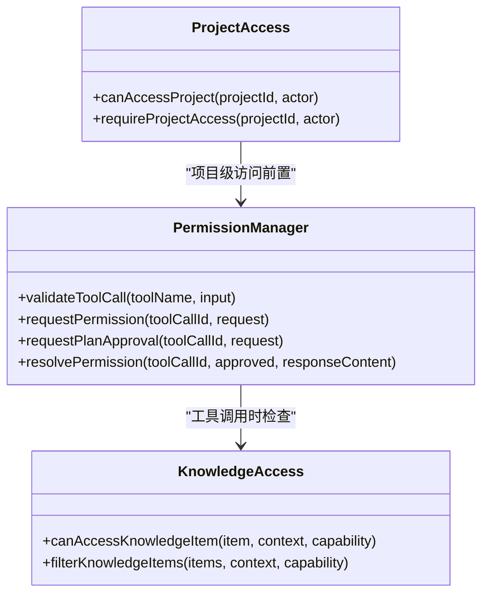
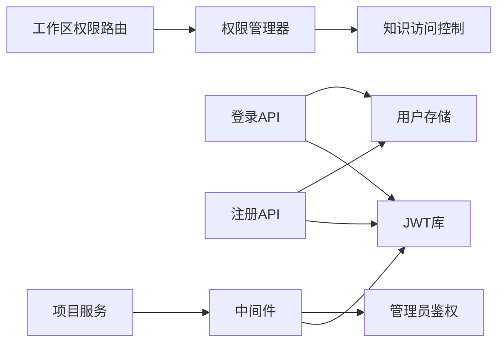

# 认证与授权

<cite>
**本文引用的文件**   
- [packages/author-site/src/middleware.ts](file://packages/author-site/src/middleware.ts)
- [packages/author-site/src/lib/auth/jwt.ts](file://packages/author-site/src/lib/auth/jwt.ts)
- [packages/author-site/src/app/api/auth/login/route.ts](file://packages/author-site/src/app/api/auth/login/route.ts)
- [packages/author-site/src/app/api/auth/register/route.ts](file://packages/author-site/src/app/api/auth/register/route.ts)
- [packages/author-site/src/app/api/auth/logout/route.ts](file://packages/author-site/src/app/api/auth/logout/route.ts)
- [packages/author-site/src/lib/admin-auth.ts](file://packages/author-site/src/lib/admin-auth.ts)
- [packages/author-site/src/lib/user.ts](file://packages/author-site/src/lib/user.ts)
- [packages/author-site/src/lib/auth/password.ts](file://packages/author-site/src/lib/auth/password.ts)
- [packages/author-site/src/app/api/workspace-authority/[projectId]/[workspaceId]/[...segments]/route.ts](file://packages/author-site/src/app/api/workspace-authority/[projectId]/[workspaceId]/[...segments]/route.ts)
- [packages/agent-service/src/backends/managers/permission-manager.ts](file://packages/agent-service/src/backends/managers/permission-manager.ts)
- [packages/knowledge-core/src/index.ts](file://packages/knowledge-core/src/index.ts)
- [packages/author-site/src/app/api/user/external-auth/[provider]/start/route.ts](file://packages/author-site/src/app/api/user/external-auth/[provider]/start/route.ts)
- [packages/author-site/src/app/api/user/external-auth/[provider]/callback/route.ts](file://packages/author-site/src/app/api/user/external-auth/[provider]/callback/route.ts)
- [packages/author-site/src/lib/external-auth.ts](file://packages/author-site/src/lib/external-auth.ts)
- [packages/author-site/src/components/ai-elements/assistant-message.tsx](file://packages/author-site/src/components/ai-elements/assistant-message.tsx)
- [packages/agent-service/src/config/session-external-auth.ts](file://packages/agent-service/src/config/session-external-auth.ts)
- [packages/project-core/src/service.ts](file://packages/project-core/src/service.ts)
- [docs/项目文档/创作端/01-用户鉴权/技术/04_路由守卫与访问控制.md](file://docs/项目文档/创作端/01-用户鉴权/技术/04_路由守卫与访问控制.md)
- [docs/项目文档/创作端/05-AI对话/技术/03_AI行为约束机制.md](file://docs/项目文档/创作端/05-AI对话/技术/03_AI行为约束机制.md)
</cite>

## 目录
1. [简介](#简介)
2. [项目结构](#项目结构)
3. [核心组件](#核心组件)
4. [架构总览](#架构总览)
5. [详细组件分析](#详细组件分析)
6. [依赖关系分析](#依赖关系分析)
7. [性能与安全考量](#性能与安全考量)
8. [故障排查指南](#故障排查指南)
9. [结论](#结论)
10. [附录：API 与实现参考](#附录api-与实现参考)

## 简介
本文件系统化梳理 Workbench 平台的认证与授权机制，覆盖以下方面：
- JWT 令牌生命周期管理（签发、验证、Cookie 存储、登出）
- 用户身份验证流程（用户名密码、第三方外部授权）
- 权限控制模型（页面/API 中间件、工作区权限、知识库访问控制、项目访问控制）
- API 的认证要求与错误码约定
- 角色与资源访问控制（含多租户隔离）
- 审计日志记录要点
- 客户端认证示例与最佳实践
- 多租户隔离、API 密钥管理与第三方集成认证方案

## 项目结构
认证与授权相关代码主要分布在以下模块：
- 创作端（Next.js）：中间件、登录注册、JWT、管理员鉴权、外部授权、会话与权限校验
- Agent 服务：工具调用权限、计划审批、会话级外部授权配置
- 知识核心：基于主体、可见性与租户范围的细粒度访问控制
- 项目核心：项目级访问控制与锁

图表来源
- [packages/author-site/src/middleware.ts:1-153](file://packages/author-site/src/middleware.ts#L1-L153)
- [packages/author-site/src/lib/auth/jwt.ts:1-70](file://packages/author-site/src/lib/auth/jwt.ts#L1-L70)
- [packages/author-site/src/app/api/auth/login/route.ts:1-47](file://packages/author-site/src/app/api/auth/login/route.ts#L1-L47)
- [packages/author-site/src/lib/admin-auth.ts:1-135](file://packages/author-site/src/lib/admin-auth.ts#L1-L135)
- [packages/author-site/src/lib/user.ts:1-339](file://packages/author-site/src/lib/user.ts#L1-L339)
- [packages/author-site/src/app/api/user/external-auth/[provider]/start/route.ts](file://packages/author-site/src/app/api/user/external-auth/[provider]/start/route.ts#L81-L114)
- [packages/author-site/src/app/api/workspace-authority/[projectId]/[workspaceId]/[...segments]/route.ts](file://packages/author-site/src/app/api/workspace-authority/[projectId]/[workspaceId]/[...segments]/route.ts#L28-L47)
- [packages/agent-service/src/backends/managers/permission-manager.ts:1-200](file://packages/agent-service/src/backends/managers/permission-manager.ts#L1-L200)
- [packages/knowledge-core/src/index.ts:250-433](file://packages/knowledge-core/src/index.ts#L250-L433)
- [packages/project-core/src/service.ts:6392-6420](file://packages/project-core/src/service.ts#L6392-L6420)

章节来源
- [packages/author-site/src/middleware.ts:1-153](file://packages/author-site/src/middleware.ts#L1-L153)
- [docs/项目文档/创作端/01-用户鉴权/技术/04_路由守卫与访问控制.md:1-153](file://docs/项目文档/创作端/01-用户鉴权/技术/04_路由守卫与访问控制.md#L1-L153)

## 核心组件
- JWT 令牌库：负责创建、验证、设置/读取/清除 Cookie
- 中间件：统一拦截请求，完成用户态校验、CORS、管理员鉴权、重定向策略
- 认证 API：登录、注册、登出、当前用户信息
- 管理员鉴权：独立 Secret 校验，支持 URL 参数与 Cookie
- 外部授权：第三方平台（如钉钉）OAuth 流程与状态同步
- 工作区权限：按 Session 校验 Workspace Authority 访问
- Agent 权限管理器：工具调用路径白名单/黑名单、知识库写保护、异步审批
- 知识访问控制：主体类型、能力、可见性、租户范围综合判定
- 项目访问控制：基于允许的项目 ID 列表进行访问限制

章节来源
- [packages/author-site/src/lib/auth/jwt.ts:1-70](file://packages/author-site/src/lib/auth/jwt.ts#L1-L70)
- [packages/author-site/src/middleware.ts:1-153](file://packages/author-site/src/middleware.ts#L1-L153)
- [packages/author-site/src/app/api/auth/login/route.ts:1-47](file://packages/author-site/src/app/api/auth/login/route.ts#L1-L47)
- [packages/author-site/src/app/api/auth/register/route.ts:1-55](file://packages/author-site/src/app/api/auth/register/route.ts#L1-L55)
- [packages/author-site/src/app/api/auth/logout/route.ts:1-8](file://packages/author-site/src/app/api/auth/logout/route.ts#L1-L8)
- [packages/author-site/src/lib/admin-auth.ts:1-135](file://packages/author-site/src/lib/admin-auth.ts#L1-L135)
- [packages/author-site/src/lib/user.ts:1-339](file://packages/author-site/src/lib/user.ts#L1-L339)
- [packages/author-site/src/app/api/user/external-auth/[provider]/start/route.ts:81-L114](file://packages/author-site/src/app/api/user/external-auth/[provider]/start/route.ts#L81-L114)
- [packages/author-site/src/app/api/workspace-authority/[projectId]/[workspaceId]/[...segments]/route.ts:28-L47](file://packages/author-site/src/app/api/workspace-authority/[projectId]/[workspaceId]/[...segments]/route.ts#L28-L47)
- [packages/agent-service/src/backends/managers/permission-manager.ts:1-200](file://packages/agent-service/src/backends/managers/permission-manager.ts#L1-L200)
- [packages/knowledge-core/src/index.ts:250-433](file://packages/knowledge-core/src/index.ts#L250-L433)
- [packages/project-core/src/service.ts:6392-6420](file://packages/project-core/src/service.ts#L6392-L6420)

## 架构总览
整体认证与授权链路如下：
- 浏览器发起请求 → Next.js 中间件校验用户态与管理员态 → 路由分发到具体 API
- 登录/注册成功后签发 JWT 并写入 httpOnly Cookie
- 受保护页面/API 在中间件层拒绝未登录访问
- 工作区权限通过 sessionId 校验；Agent 侧对工具调用进行路径与命令白名单/黑名单校验
- 知识访问控制依据主体、能力、可见性与租户范围过滤
- 外部授权通过 OAuth 回调建立连接，并将配置推送到活跃会话

图表来源
- [packages/author-site/src/middleware.ts:45-153](file://packages/author-site/src/middleware.ts#L45-L153)
- [packages/author-site/src/lib/auth/jwt.ts:16-34](file://packages/author-site/src/lib/auth/jwt.ts#L16-L34)
- [packages/author-site/src/app/api/auth/login/route.ts:6-47](file://packages/author-site/src/app/api/auth/login/route.ts#L6-L47)
- [packages/author-site/src/app/api/workspace-authority/[projectId]/[workspaceId]/[...segments]/route.ts:28-L47](file://packages/author-site/src/app/api/workspace-authority/[projectId]/[workspaceId]/[...segments]/route.ts#L28-L47)
- [packages/agent-service/src/backends/managers/permission-manager.ts:54-78](file://packages/agent-service/src/backends/managers/permission-manager.ts#L54-L78)
- [packages/knowledge-core/src/index.ts:284-324](file://packages/knowledge-core/src/index.ts#L284-L324)

## 详细组件分析

### JWT 令牌生命周期管理
- 令牌签发：登录/注册成功后，使用 HS256 算法签发，有效期 7 天
- 令牌验证：中间件与服务端 API 均通过 jose 库验证签名与过期时间
- Cookie 存储：httpOnly、sameSite=lax、path=/，生产环境默认 secure
- 登出：删除 auth_token Cookie

图表来源
- [packages/author-site/src/lib/auth/jwt.ts:16-56](file://packages/author-site/src/lib/auth/jwt.ts#L16-L56)
- [packages/author-site/src/app/api/auth/login/route.ts:27-37](file://packages/author-site/src/app/api/auth/login/route.ts#L27-L37)
- [packages/author-site/src/app/api/auth/register/route.ts:34-45](file://packages/author-site/src/app/api/auth/register/route.ts#L34-L45)
- [packages/author-site/src/app/api/auth/logout/route.ts:5-8](file://packages/author-site/src/app/api/auth/logout/route.ts#L5-L8)

章节来源
- [packages/author-site/src/lib/auth/jwt.ts:1-70](file://packages/author-site/src/lib/auth/jwt.ts#L1-L70)
- [packages/author-site/src/app/api/auth/login/route.ts:1-47](file://packages/author-site/src/app/api/auth/login/route.ts#L1-L47)
- [packages/author-site/src/app/api/auth/register/route.ts:1-55](file://packages/author-site/src/app/api/auth/register/route.ts#L1-L55)
- [packages/author-site/src/app/api/auth/logout/route.ts:1-8](file://packages/author-site/src/app/api/auth/logout/route.ts#L1-L8)

### 用户身份验证流程
- 用户名密码登录：校验用户名与密码，成功后签发 Token 并设置 Cookie
- 注册：校验用户名与密码规则，唯一性检查，成功后自动登录
- 登出：清除 Cookie
- 第三方外部授权：启动授权流程，回调后更新状态并推送至活跃会话

图表来源
- [packages/author-site/src/app/api/auth/login/route.ts:6-47](file://packages/author-site/src/app/api/auth/login/route.ts#L6-L47)
- [packages/author-site/src/app/api/auth/register/route.ts:7-55](file://packages/author-site/src/app/api/auth/register/route.ts#L7-L55)
- [packages/author-site/src/app/api/auth/logout/route.ts:5-8](file://packages/author-site/src/app/api/auth/logout/route.ts#L5-L8)
- [packages/author-site/src/app/api/user/external-auth/[provider]/start/route.ts:81-L114](file://packages/author-site/src/app/api/user/external-auth/[provider]/start/route.ts#L81-L114)
- [packages/author-site/src/app/api/user/external-auth/[provider]/callback/route.ts:18-L59](file://packages/author-site/src/app/api/user/external-auth/[provider]/callback/route.ts#L18-L59)

章节来源
- [packages/author-site/src/lib/user.ts:264-281](file://packages/author-site/src/lib/user.ts#L264-L281)
- [packages/author-site/src/lib/auth/password.ts:1-34](file://packages/author-site/src/lib/auth/password.ts#L1-L34)
- [packages/author-site/src/app/api/user/external-auth/[provider]/start/route.ts:81-L114](file://packages/author-site/src/app/api/user/external-auth/[provider]/start/route.ts#L81-L114)
- [packages/author-site/src/app/api/user/external-auth/[provider]/callback/route.ts:18-L59](file://packages/author-site/src/app/api/user/external-auth/[provider]/callback/route.ts#L18-L59)

### 权限控制模型
- 页面与 API 中间件：区分受保护页面、受保护 API、认证路由、管理员路由
- 工作区权限：通过 sessionId 校验，仅允许允许的端点与方法
- Agent 权限管理器：工具调用路径白名单/黑名单、知识库写保护、异步审批
- 知识访问控制：主体类型、能力、可见性、租户范围
- 项目访问控制：基于 allowedProjectIds 判断是否可访问

图表来源
- [packages/agent-service/src/backends/managers/permission-manager.ts:54-78](file://packages/agent-service/src/backends/managers/permission-manager.ts#L54-L78)
- [packages/knowledge-core/src/index.ts:284-324](file://packages/knowledge-core/src/index.ts#L284-L324)
- [packages/project-core/src/service.ts:6404-6420](file://packages/project-core/src/service.ts#L6404-L6420)

章节来源
- [packages/author-site/src/middleware.ts:75-135](file://packages/author-site/src/middleware.ts#L75-L135)
- [packages/author-site/src/app/api/workspace-authority/[projectId]/[workspaceId]/[...segments]/route.ts:28-L47](file://packages/author-site/src/app/api/workspace-authority/[projectId]/[workspaceId]/[...segments]/route.ts#L28-L47)
- [packages/agent-service/src/backends/managers/permission-manager.ts:1-200](file://packages/agent-service/src/backends/managers/permission-manager.ts#L1-L200)
- [packages/knowledge-core/src/index.ts:250-433](file://packages/knowledge-core/src/index.ts#L250-L433)
- [packages/project-core/src/service.ts:6392-6420](file://packages/project-core/src/service.ts#L6392-L6420)

### 管理员鉴权
- 通过环境变量 ADMIN_SECRET 生成哈希值
- 支持 URL 参数 secret 与 admin_token Cookie 两种验证方式
- 中间件对 /admin 与 /api/admin/* 进行强制校验

章节来源
- [packages/author-site/src/lib/admin-auth.ts:1-135](file://packages/author-site/src/lib/admin-auth.ts#L1-L135)
- [packages/author-site/src/middleware.ts:100-135](file://packages/author-site/src/middleware.ts#L100-L135)

### 外部授权与第三方集成
- 启动授权：根据 provider 调用对应流程，必要时更新状态并同步到活跃会话
- 回调处理：校验 state 签名与过期时间，更新授权状态
- 前端交互：在助手消息中触发授权流程，显示连接状态与提示

章节来源
- [packages/author-site/src/app/api/user/external-auth/[provider]/start/route.ts:81-L114](file://packages/author-site/src/app/api/user/external-auth/[provider]/start/route.ts#L81-L114)
- [packages/author-site/src/app/api/user/external-auth/[provider]/callback/route.ts:18-L59](file://packages/author-site/src/app/api/user/external-auth/[provider]/callback/route.ts#L18-L59)
- [packages/author-site/src/components/ai-elements/assistant-message.tsx:1173-1211](file://packages/author-site/src/components/ai-elements/assistant-message.tsx#L1173-L1211)
- [packages/agent-service/src/config/session-external-auth.ts:1-26](file://packages/agent-service/src/config/session-external-auth.ts#L1-L26)

## 依赖关系分析
- 中间件依赖 JWT 库与管理员鉴权模块
- 认证 API 依赖用户存储与密码校验
- 工作区权限路由依赖 Agent 权限管理器
- 知识访问控制被权限管理器与上层逻辑共同使用
- 项目访问控制在项目服务层进行前置校验

图表来源
- [packages/author-site/src/middleware.ts:1-153](file://packages/author-site/src/middleware.ts#L1-L153)
- [packages/author-site/src/lib/auth/jwt.ts:1-70](file://packages/author-site/src/lib/auth/jwt.ts#L1-L70)
- [packages/author-site/src/app/api/auth/login/route.ts:1-47](file://packages/author-site/src/app/api/auth/login/route.ts#L1-L47)
- [packages/author-site/src/app/api/auth/register/route.ts:1-55](file://packages/author-site/src/app/api/auth/register/route.ts#L1-L55)
- [packages/author-site/src/app/api/workspace-authority/[projectId]/[workspaceId]/[...segments]/route.ts:28-L47](file://packages/author-site/src/app/api/workspace-authority/[projectId]/[workspaceId]/[...segments]/route.ts#L28-L47)
- [packages/agent-service/src/backends/managers/permission-manager.ts:1-200](file://packages/agent-service/src/backends/managers/permission-manager.ts#L1-L200)
- [packages/knowledge-core/src/index.ts:250-433](file://packages/knowledge-core/src/index.ts#L250-L433)
- [packages/project-core/src/service.ts:6392-6420](file://packages/project-core/src/service.ts#L6392-L6420)

章节来源
- [packages/author-site/src/middleware.ts:1-153](file://packages/author-site/src/middleware.ts#L1-L153)
- [packages/author-site/src/lib/auth/jwt.ts:1-70](file://packages/author-site/src/lib/auth/jwt.ts#L1-L70)
- [packages/author-site/src/app/api/auth/login/route.ts:1-47](file://packages/author-site/src/app/api/auth/login/route.ts#L1-L47)
- [packages/author-site/src/app/api/auth/register/route.ts:1-55](file://packages/author-site/src/app/api/auth/register/route.ts#L1-L55)
- [packages/author-site/src/app/api/workspace-authority/[projectId]/[workspaceId]/[...segments]/route.ts:28-L47](file://packages/author-site/src/app/api/workspace-authority/[projectId]/[workspaceId]/[...segments]/route.ts#L28-L47)
- [packages/agent-service/src/backends/managers/permission-manager.ts:1-200](file://packages/agent-service/src/backends/managers/permission-manager.ts#L1-L200)
- [packages/knowledge-core/src/index.ts:250-433](file://packages/knowledge-core/src/index.ts#L250-L433)
- [packages/project-core/src/service.ts:6392-6420](file://packages/project-core/src/service.ts#L6392-L6420)

## 性能与安全考量
- 令牌验证无数据库查询，中间件层快速失败，降低延迟
- Cookie 采用 httpOnly 与 sameSite=lax，减少 XSS 与 CSRF 风险
- 生产环境启用 secure Cookie，建议强制 HTTPS
- 管理员 Secret 使用 SHA-256 哈希比较，避免明文泄露
- 外部授权回调校验 state 签名与过期时间，防止重放攻击
- 工作区权限与 Agent 工具调用权限双重校验，最小化越权面
- 知识访问控制基于主体、能力、可见性与租户范围，精细化过滤

## 故障排查指南
- 登录失败：检查用户名/密码校验与用户存储；确认 JWT 签发与 Cookie 设置
- 未登录访问受保护路由：确认中间件匹配规则与重定向逻辑
- 管理员后台无法访问：检查 ADMIN_SECRET 与 admin_token Cookie
- 外部授权失败：核对回调 state 签名与过期时间；检查授权状态同步
- 工作区权限拒绝：确认 sessionId 是否正确传递；检查允许的端点与方法
- Agent 工具调用被拦截：检查路径白名单/黑名单与 workingDir 配置

章节来源
- [packages/author-site/src/middleware.ts:75-135](file://packages/author-site/src/middleware.ts#L75-L135)
- [packages/author-site/src/lib/admin-auth.ts:38-84](file://packages/author-site/src/lib/admin-auth.ts#L38-L84)
- [packages/author-site/src/app/api/user/external-auth/[provider]/callback/route.ts:18-L59](file://packages/author-site/src/app/api/user/external-auth/[provider]/callback/route.ts#L18-L59)
- [packages/author-site/src/app/api/workspace-authority/[projectId]/[workspaceId]/[...segments]/route.ts:28-L47](file://packages/author-site/src/app/api/workspace-authority/[projectId]/[workspaceId]/[...segments]/route.ts#L28-L47)
- [packages/agent-service/src/backends/managers/permission-manager.ts:54-78](file://packages/agent-service/src/backends/managers/permission-manager.ts#L54-L78)

## 结论
Workbench 的认证与授权体系以 JWT 为核心，结合中间件统一鉴权、工作区权限与 Agent 工具权限、知识访问控制与项目访问控制，形成多层防护。通过外部授权与管理员鉴权扩展了多场景接入能力。建议在部署中严格配置安全参数，遵循最小权限原则，并结合审计日志完善可观测性。

## 附录：API 与实现参考

### 认证 API 概览
- POST /api/auth/login：用户名密码登录，成功后签发 JWT 并设置 Cookie
- POST /api/auth/register：注册新用户，成功后自动登录
- POST /api/auth/logout：登出，清除 Cookie
- GET /api/auth/me：获取当前用户信息（需登录）
- GET /api/user/external-auth/{provider}/start：启动第三方授权
- GET /api/user/external-auth/{provider}/callback：第三方回调，更新授权状态

章节来源
- [packages/author-site/src/app/api/auth/login/route.ts:1-47](file://packages/author-site/src/app/api/auth/login/route.ts#L1-L47)
- [packages/author-site/src/app/api/auth/register/route.ts:1-55](file://packages/author-site/src/app/api/auth/register/route.ts#L1-L55)
- [packages/author-site/src/app/api/auth/logout/route.ts:1-8](file://packages/author-site/src/app/api/auth/logout/route.ts#L1-L8)
- [packages/author-site/src/app/api/user/external-auth/[provider]/start/route.ts:81-L114](file://packages/author-site/src/app/api/user/external-auth/[provider]/start/route.ts#L81-L114)
- [packages/author-site/src/app/api/user/external-auth/[provider]/callback/route.ts:18-L59](file://packages/author-site/src/app/api/user/external-auth/[provider]/callback/route.ts#L18-L59)

### 客户端认证实现示例与最佳实践
- 登录成功后保存服务端设置的 Cookie，后续请求自动携带
- 受保护页面由中间件重定向到登录页，携带 redirect 参数
- 登出后清除 Cookie，确保会话失效
- 生产环境启用 HTTPS，确保 secure Cookie 生效

章节来源
- [packages/author-site/src/middleware.ts:75-98](file://packages/author-site/src/middleware.ts#L75-L98)
- [packages/author-site/src/lib/auth/jwt.ts:44-56](file://packages/author-site/src/lib/auth/jwt.ts#L44-L56)
- [docs/项目文档/创作端/01-用户鉴权/技术/04_路由守卫与访问控制.md:87-153](file://docs/项目文档/创作端/01-用户鉴权/技术/04_路由守卫与访问控制.md#L87-L153)

### 多租户隔离与资源访问控制
- 知识访问控制基于主体类型、能力、可见性与租户范围
- 项目访问控制基于 allowedProjectIds 判断
- 工作区权限通过 sessionId 与端点白名单控制

章节来源
- [packages/knowledge-core/src/index.ts:284-324](file://packages/knowledge-core/src/index.ts#L284-L324)
- [packages/project-core/src/service.ts:6404-6420](file://packages/project-core/src/service.ts#L6404-L6420)
- [packages/author-site/src/app/api/workspace-authority/[projectId]/[workspaceId]/[...segments]/route.ts:28-L47](file://packages/author-site/src/app/api/workspace-authority/[projectId]/[workspaceId]/[...segments]/route.ts#L28-L47)

### API 密钥管理与第三方集成认证方案
- 外部授权通过 start 与 callback 流程完成，状态持久化并推送至活跃会话
- 会话级外部授权配置在 Agent 服务内存中维护，供工具调用使用

章节来源
- [packages/author-site/src/lib/external-auth.ts:91-141](file://packages/author-site/src/lib/external-auth.ts#L91-L141)
- [packages/agent-service/src/config/session-external-auth.ts:1-26](file://packages/agent-service/src/config/session-external-auth.ts#L1-L26)

### 审计日志记录要点
- 运行进度与事件日志包含关键边界事件与脱敏后的 payload
- 每轮结束时记录 finish 摘要，便于问题定位与合规审计

章节来源
- [docs/项目文档/创作端/05-AI对话/技术/03_AI行为约束机制.md:109-223](file://docs/项目文档/创作端/05-AI对话/技术/03_AI行为约束机制.md#L109-L223)
- [docs/项目文档/创作端/05-AI对话/技术/07_运行进度与事件日志.md:61-81](file://docs/项目文档/创作端/05-AI对话/技术/07_运行进度与事件日志.md#L61-L81)