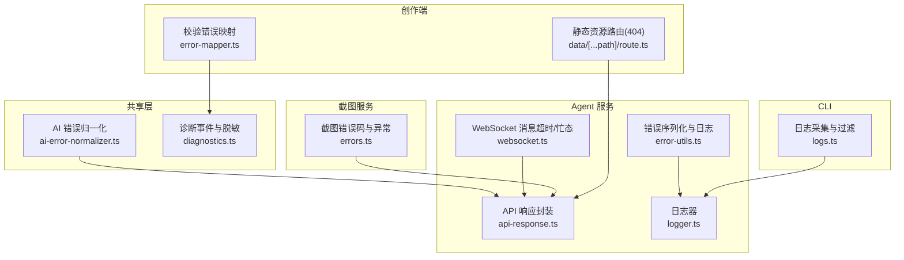
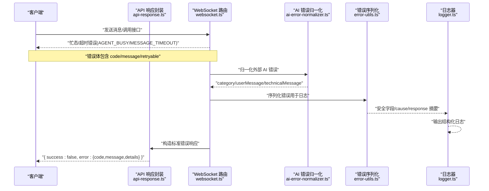
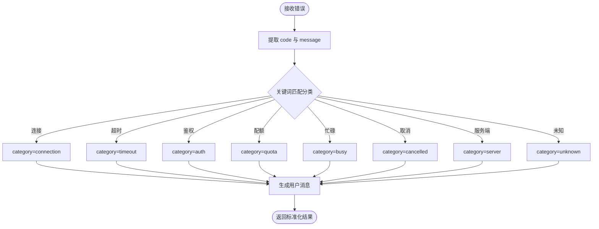
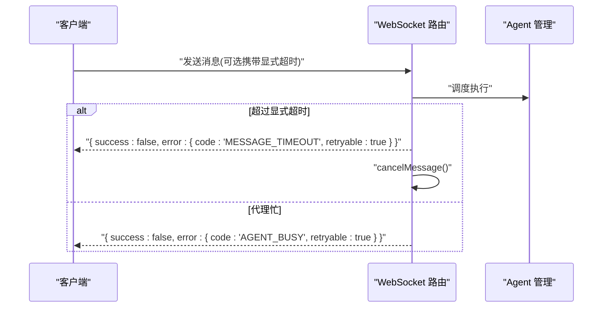
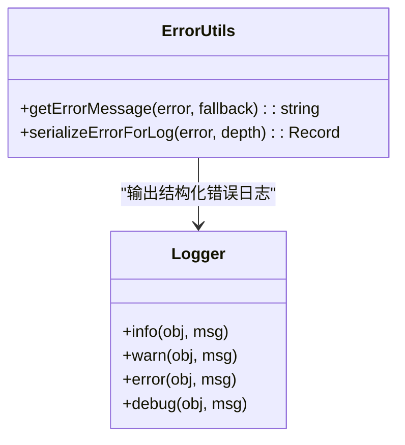
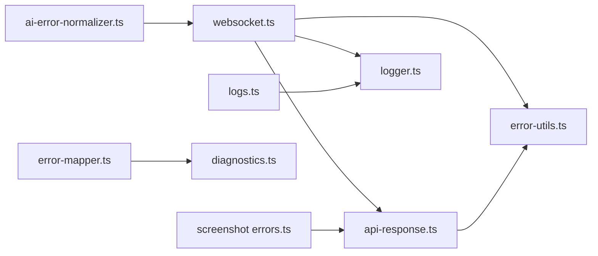

# 错误码与异常处理

<cite>
**本文引用的文件**   
- [packages/shared/src/ai-error-normalizer.ts](file://packages/shared/src/ai-error-normalizer.ts)
- [packages/agent-service/src/routes/api-response.ts](file://packages/agent-service/src/routes/api-response.ts)
- [packages/agent-service/src/utils/error-utils.ts](file://packages/agent-service/src/utils/error-utils.ts)
- [packages/agent-service/src/utils/logger.ts](file://packages/agent-service/src/utils/logger.ts)
- [packages/agent-service/src/routes/websocket.ts](file://packages/agent-service/src/routes/websocket.ts)
- [packages/agent-service/tests/unit/websocket-timeout.test.ts](file://packages/agent-service/tests/unit/websocket-timeout.test.ts)
- [packages/screenshot-service/src/utils/errors.ts](file://packages/screenshot-service/src/utils/errors.ts)
- [packages/author-site/lib/error-mapper.ts](file://packages/author-site/lib/error-mapper.ts)
- [packages/shared/src/diagnostics.ts](file://packages/shared/src/diagnostics.ts)
- [OPS/CLI/src/commands/logs.ts](file://OPS/CLI/src/commands/logs.ts)
- [packages/author-site/src/app/data/[...path]/route.ts](file://packages/author-site/src/app/data/[...path]/route.ts)
</cite>

## 目录
1. [引言](#引言)
2. [项目结构](#项目结构)
3. [核心组件](#核心组件)
4. [架构总览](#架构总览)
5. [详细组件分析](#详细组件分析)
6. [依赖分析](#依赖分析)
7. [性能考虑](#性能考虑)
8. [故障排查指南](#故障排查指南)
9. [结论](#结论)
10. [附录](#附录)

## 引言
本文件为 Workbench 平台的错误码与异常处理规范，覆盖 HTTP 状态码、业务错误码与系统异常的统一约定；定义错误响应的统一格式与字段语义；给出客户端重试、降级与用户体验优化策略；并提供常见错误的诊断方法与监控告警建议。文档内容基于仓库中现有实现进行归纳与提炼，确保与实际代码一致。

## 项目结构
围绕错误处理的相关能力分布在以下模块：
- 共享层（shared）：AI 错误归一化、诊断事件白名单与脱敏
- Agent 服务（agent-service）：API 响应封装、日志序列化、WebSocket 消息超时与忙态返回
- 截图服务（screenshot-service）：截图相关错误码与异常类
- 创作端（author-site）：校验错误映射为用户友好提示、静态资源路由的 404 错误
- CLI（OPS/CLI）：日志采集与过滤展示

图表来源
- [packages/shared/src/ai-error-normalizer.ts:1-156](file://packages/shared/src/ai-error-normalizer.ts#L1-L156)
- [packages/agent-service/src/routes/api-response.ts:1-25](file://packages/agent-service/src/routes/api-response.ts#L1-L25)
- [packages/agent-service/src/utils/error-utils.ts:1-134](file://packages/agent-service/src/utils/error-utils.ts#L1-L134)
- [packages/agent-service/src/utils/logger.ts:1-41](file://packages/agent-service/src/utils/logger.ts#L1-L41)
- [packages/agent-service/src/routes/websocket.ts:402-423](file://packages/agent-service/src/routes/websocket.ts#L402-L423)
- [packages/screenshot-service/src/utils/errors.ts:1-39](file://packages/screenshot-service/src/utils/errors.ts#L1-L39)
- [packages/author-site/lib/error-mapper.ts:1-54](file://packages/author-site/lib/error-mapper.ts#L1-L54)
- [packages/author-site/src/app/data/[...path]/route.ts:54-86](file://packages/author-site/src/app/data/[...path]/route.ts#L54-L86)
- [OPS/CLI/src/commands/logs.ts:46-136](file://OPS/CLI/src/commands/logs.ts#L46-L136)

章节来源
- [packages/shared/src/ai-error-normalizer.ts:1-156](file://packages/shared/src/ai-error-normalizer.ts#L1-L156)
- [packages/agent-service/src/routes/api-response.ts:1-25](file://packages/agent-service/src/routes/api-response.ts#L1-L25)
- [packages/agent-service/src/utils/error-utils.ts:1-134](file://packages/agent-service/src/utils/error-utils.ts#L1-L134)
- [packages/agent-service/src/utils/logger.ts:1-41](file://packages/agent-service/src/utils/logger.ts#L1-L41)
- [packages/agent-service/src/routes/websocket.ts:402-423](file://packages/agent-service/src/routes/websocket.ts#L402-L423)
- [packages/screenshot-service/src/utils/errors.ts:1-39](file://packages/screenshot-service/src/utils/errors.ts#L1-L39)
- [packages/author-site/lib/error-mapper.ts:1-54](file://packages/author-site/lib/error-mapper.ts#L1-L54)
- [packages/author-site/src/app/data/[...path]/route.ts:54-86](file://packages/author-site/src/app/data/[...path]/route.ts#L54-L86)
- [OPS/CLI/src/commands/logs.ts:46-136](file://OPS/CLI/src/commands/logs.ts#L46-L136)

## 核心组件
- API 响应封装：提供成功与失败的标准返回结构，错误体包含 code、message、details 等字段。
- AI 错误归一化：将外部 AI 服务的原始错误分类为连接、超时、鉴权、配额、忙碌、取消、服务端、未知等类别，并生成用户可读消息。
- 错误序列化与日志：对错误对象进行安全字段提取、嵌套 cause 与 response 摘要、长度截断，便于日志记录与追踪。
- WebSocket 超时与忙态：显式消息超时返回 MESSAGE_TIMEOUT，忙态返回 AGENT_BUSY，均标记可重试。
- 截图错误码：定义截图流程中的具体错误类型与异常类，便于上层统一处理。
- 校验错误映射：将结构化校验错误聚合为用户友好的摘要与详情，支持一键修复引导。
- 诊断与脱敏：定义编辑器诊断事件结构与允许字段白名单，敏感信息自动脱敏。
- 日志采集：CLI 支持按级别、模式与会话过滤本地或远程日志。

章节来源
- [packages/agent-service/src/routes/api-response.ts:1-25](file://packages/agent-service/src/routes/api-response.ts#L1-L25)
- [packages/shared/src/ai-error-normalizer.ts:1-156](file://packages/shared/src/ai-error-normalizer.ts#L1-L156)
- [packages/agent-service/src/utils/error-utils.ts:1-134](file://packages/agent-service/src/utils/error-utils.ts#L1-L134)
- [packages/agent-service/src/routes/websocket.ts:402-423](file://packages/agent-service/src/routes/websocket.ts#L402-L423)
- [packages/agent-service/tests/unit/websocket-timeout.test.ts:1-53](file://packages/agent-service/tests/unit/websocket-timeout.test.ts#L1-L53)
- [packages/screenshot-service/src/utils/errors.ts:1-39](file://packages/screenshot-service/src/utils/errors.ts#L1-L39)
- [packages/author-site/lib/error-mapper.ts:1-54](file://packages/author-site/lib/error-mapper.ts#L1-L54)
- [packages/shared/src/diagnostics.ts:1-200](file://packages/shared/src/diagnostics.ts#L1-L200)
- [OPS/CLI/src/commands/logs.ts:46-136](file://OPS/CLI/src/commands/logs.ts#L46-L136)

## 架构总览
下图展示了从请求进入、错误分类、标准化到最终返回与日志记录的端到端流程。

图表来源
- [packages/agent-service/src/routes/api-response.ts:1-25](file://packages/agent-service/src/routes/api-response.ts#L1-L25)
- [packages/agent-service/src/routes/websocket.ts:402-423](file://packages/agent-service/src/routes/websocket.ts#L402-L423)
- [packages/shared/src/ai-error-normalizer.ts:1-156](file://packages/shared/src/ai-error-normalizer.ts#L1-L156)
- [packages/agent-service/src/utils/error-utils.ts:1-134](file://packages/agent-service/src/utils/error-utils.ts#L1-L134)
- [packages/agent-service/src/utils/logger.ts:1-41](file://packages/agent-service/src/utils/logger.ts#L1-L41)

## 详细组件分析

### API 响应封装与统一错误体
- 成功响应：{ success:true, data }
- 失败响应：{ success:false, error:{ code:string, message:string, details?:unknown } }
- HTTP 状态码由调用方设置，错误体中的 code 表示业务错误码，message 面向用户或调试，details 承载附加上下文。

章节来源
- [packages/agent-service/src/routes/api-response.ts:1-25](file://packages/agent-service/src/routes/api-response.ts#L1-L25)

### AI 错误分类与用户消息
- 分类维度：连接、超时、鉴权、配额、忙碌、取消、服务端、未知
- 输入：任意错误对象或字符串
- 输出：标准化结果包含 code、category、userMessage、technicalMessage
- 分类依据：错误 code/name、message 片段匹配（如 401/403/429/5xx、rate limit、timeout、connection 等）

图表来源
- [packages/shared/src/ai-error-normalizer.ts:1-156](file://packages/shared/src/ai-error-normalizer.ts#L1-L156)

章节来源
- [packages/shared/src/ai-error-normalizer.ts:1-156](file://packages/shared/src/ai-error-normalizer.ts#L1-L156)

### WebSocket 消息超时与忙态
- 显式消息超时：返回错误码 MESSAGE_TIMEOUT，message 包含上限秒数，retryable=true
- 忙态：返回错误码 AGENT_BUSY，message 明确上一轮仍在运行，retryable=true
- 超时触发后，会主动取消当前消息处理，避免挂起

图表来源
- [packages/agent-service/src/routes/websocket.ts:402-423](file://packages/agent-service/src/routes/websocket.ts#L402-L423)
- [packages/agent-service/tests/unit/websocket-timeout.test.ts:1-53](file://packages/agent-service/tests/unit/websocket-timeout.test.ts#L1-L53)

章节来源
- [packages/agent-service/src/routes/websocket.ts:402-423](file://packages/agent-service/src/routes/websocket.ts#L402-L423)
- [packages/agent-service/tests/unit/websocket-timeout.test.ts:1-53](file://packages/agent-service/tests/unit/websocket-timeout.test.ts#L1-L53)

### 错误序列化与日志记录
- 安全字段白名单：仅复制 name、message、code、status、statusCode、type、errno、syscall、path、url、method 等
- 嵌套 cause 与 response 摘要：限制深度，避免过大日志
- 字符串截断：最大长度限制，防止日志膨胀
- 日志器：使用 pino，支持 err/error 标准序列化与 pretty 输出

图表来源
- [packages/agent-service/src/utils/error-utils.ts:1-134](file://packages/agent-service/src/utils/error-utils.ts#L1-L134)
- [packages/agent-service/src/utils/logger.ts:1-41](file://packages/agent-service/src/utils/logger.ts#L1-L41)

章节来源
- [packages/agent-service/src/utils/error-utils.ts:1-134](file://packages/agent-service/src/utils/error-utils.ts#L1-L134)
- [packages/agent-service/src/utils/logger.ts:1-41](file://packages/agent-service/src/utils/logger.ts#L1-L41)

### 截图服务错误码与异常
- 错误码集合：编译错误、运行时错误、浏览器启动错误、渲染超时、空渲染、选择器超时、队列超时、写入错误、通用截图错误
- 异常类：ScreenshotError，附带 code 与 cause
- 工具函数：根据错误对象推断截图错误码与提取消息

章节来源
- [packages/screenshot-service/src/utils/errors.ts:1-39](file://packages/screenshot-service/src/utils/errors.ts#L1-L39)

### 校验错误映射与用户友好提示
- 输入：结构化校验错误数组（含 type、severity、location、fixSuggestion 等）
- 输出：用户友好摘要与详情，统计各类错误数量，支持“一键修复”引导

章节来源
- [packages/author-site/lib/error-mapper.ts:1-54](file://packages/author-site/lib/error-mapper.ts#L1-L54)

### 静态资源路由错误（404）
- 当请求路径不是文件时，返回 404 与错误体 { success:false, error:{ code:"NOT_FOUND", message:"不是文件" } }

章节来源
- [packages/author-site/src/app/data/[...path]/route.ts:54-86](file://packages/author-site/src/app/data/[...path]/route.ts#L54-L86)

### 诊断事件与脱敏
- 事件结构：包含 id、schemaVersion、ts、source、level、eventGroup、eventType、payload 等
- 白名单：默认允许字段集与按事件类型的扩展白名单
- 脱敏：敏感键自动替换为 "[redacted]"，禁止字段进行摘要处理

章节来源
- [packages/shared/src/diagnostics.ts:1-200](file://packages/shared/src/diagnostics.ts#L1-L200)
- [packages/shared/src/diagnostics.ts:418-459](file://packages/shared/src/diagnostics.ts#L418-L459)

### 日志采集与过滤（CLI）
- 支持本地文件与远程会话诊断收集
- 过滤条件：日志级别、正则模式、最近行数、会话 ID
- 输出：JSON 或格式化文本

章节来源
- [OPS/CLI/src/commands/logs.ts:46-136](file://OPS/CLI/src/commands/logs.ts#L46-L136)

## 依赖分析
- 低耦合：错误分类、序列化、日志、响应封装各自独立，通过明确的接口交互
- 关键依赖链：
  - WebSocket 路由依赖 API 响应封装与错误序列化
  - AI 错误归一化被上层消费以生成用户消息
  - 截图错误码在截图服务内部使用，并可向上层暴露
  - 诊断与脱敏贯穿前端与后端的事件上报链路
  - CLI 依赖日志器输出的结构化日志进行解析与过滤

图表来源
- [packages/agent-service/src/routes/websocket.ts:402-423](file://packages/agent-service/src/routes/websocket.ts#L402-L423)
- [packages/agent-service/src/routes/api-response.ts:1-25](file://packages/agent-service/src/routes/api-response.ts#L1-L25)
- [packages/agent-service/src/utils/error-utils.ts:1-134](file://packages/agent-service/src/utils/error-utils.ts#L1-L134)
- [packages/agent-service/src/utils/logger.ts:1-41](file://packages/agent-service/src/utils/logger.ts#L1-L41)
- [packages/shared/src/ai-error-normalizer.ts:1-156](file://packages/shared/src/ai-error-normalizer.ts#L1-L156)
- [packages/screenshot-service/src/utils/errors.ts:1-39](file://packages/screenshot-service/src/utils/errors.ts#L1-L39)
- [packages/author-site/lib/error-mapper.ts:1-54](file://packages/author-site/lib/error-mapper.ts#L1-L54)
- [packages/shared/src/diagnostics.ts:1-200](file://packages/shared/src/diagnostics.ts#L1-L200)
- [OPS/CLI/src/commands/logs.ts:46-136](file://OPS/CLI/src/commands/logs.ts#L46-L136)

## 性能考虑
- 错误序列化限制深度与长度，避免大对象导致日志与网络开销
- 诊断事件采用白名单与脱敏，减少不必要的数据传输
- WebSocket 显式超时与忙态快速返回，避免长时间占用连接与资源
- 日志器使用 pretty 输出，开发环境更直观；生产环境建议关闭颜色与额外格式化以提升吞吐

[本节为通用指导，不直接分析具体文件]

## 故障排查指南
- 常见问题与定位
  - 连接/网络问题：检查网络连通性与代理配置，关注 connection 分类错误
  - 鉴权失败：确认模型 API Key 与权限，关注 auth 分类错误
  - 配额/限流：等待重试或调整频率，关注 quota 分类错误
  - 服务端异常：关注 server 分类错误与 5xx 状态码
  - 忙态与超时：出现 AGENT_BUSY 或 MESSAGE_TIMEOUT 时，先取消再重试，必要时缩短问题或更换模型
  - 截图失败：根据 ScreenshotError.code 定位编译、渲染、选择器或队列问题
  - 校验错误：查看 mapToUserFriendly 生成的摘要与详情，按建议修复
- 日志与诊断
  - 使用 CLI 按级别、模式与会话过滤日志，快速定位问题
  - 结合诊断事件白名单与脱敏规则，确保上报数据既可用又安全
- 建议的错误处理策略
  - 客户端侧：
    - 对 retryable=true 的错误实施指数退避重试（例如 1s、2s、4s），最多 3 次
    - 对 AGENT_BUSY 显示“上一轮仍在运行”，提供取消按钮
    - 对 MESSAGE_TIMEOUT 提示“已自动取消，请重试”，并允许用户手动重试
    - 对 auth/quota 错误，引导用户检查配置或稍后重试
    - 对 server 错误，提供“稍后重试”与“反馈问题”入口
  - 服务端侧：
    - 统一使用 sendApiError 返回标准错误体
    - 所有异常走 serializeErrorForLog 输出结构化日志
    - 对耗时操作设置显式超时，避免长连接阻塞
  - 用户体验优化：
    - 将 technicalMessage 隐藏于“详细信息”面板，主界面只展示 userMessage
    - 对可自动修复的校验错误，提供“一键修复”入口
    - 对截图错误，给出具体原因与解决步骤

章节来源
- [packages/shared/src/ai-error-normalizer.ts:1-156](file://packages/shared/src/ai-error-normalizer.ts#L1-L156)
- [packages/agent-service/src/routes/websocket.ts:402-423](file://packages/agent-service/src/routes/websocket.ts#L402-L423)
- [packages/agent-service/tests/unit/websocket-timeout.test.ts:1-53](file://packages/agent-service/tests/unit/websocket-timeout.test.ts#L1-L53)
- [packages/screenshot-service/src/utils/errors.ts:1-39](file://packages/screenshot-service/src/utils/errors.ts#L1-L39)
- [packages/author-site/lib/error-mapper.ts:1-54](file://packages/author-site/lib/error-mapper.ts#L1-L54)
- [OPS/CLI/src/commands/logs.ts:46-136](file://OPS/CLI/src/commands/logs.ts#L46-L136)
- [packages/shared/src/diagnostics.ts:1-200](file://packages/shared/src/diagnostics.ts#L1-L200)

## 结论
Workbench 平台通过统一的 API 错误体、AI 错误分类、WebSocket 超时与忙态保护、截图错误码体系、校验错误映射以及完善的日志与诊断机制，构建了稳定且可观测的错误处理闭环。遵循本文档的策略与规范，可在保证用户体验的同时提升问题定位效率与系统可靠性。

[本节为总结性内容，不直接分析具体文件]

## 附录

### 统一错误响应格式
- 成功：{ success:true, data }
- 失败：{ success:false, error:{ code:string, message:string, details?:unknown } }
- HTTP 状态码由调用方设置，错误体中的 code 为业务错误码

章节来源
- [packages/agent-service/src/routes/api-response.ts:1-25](file://packages/agent-service/src/routes/api-response.ts#L1-L25)

### 业务错误码清单（节选）
- AGENT_BUSY：上一轮 AI 请求仍在运行，可重试
- MESSAGE_TIMEOUT：消息处理超时，可重试
- NOT_FOUND：静态资源不存在（404）
- 截图错误码：COMPILE_ERROR、RUNTIME_ERROR、BROWSER_LAUNCH_ERROR、RENDER_TIMEOUT、EMPTY_RENDER、SELECTOR_TIMEOUT、QUEUE_TIMEOUT、SCREENSHOT_WRITE_ERROR、SCREENSHOT_ERROR

章节来源
- [packages/agent-service/tests/unit/websocket-timeout.test.ts:1-53](file://packages/agent-service/tests/unit/websocket-timeout.test.ts#L1-L53)
- [packages/agent-service/src/routes/websocket.ts:402-423](file://packages/agent-service/src/routes/websocket.ts#L402-L423)
- [packages/author-site/src/app/data/[...path]/route.ts:54-86](file://packages/author-site/src/app/data/[...path]/route.ts#L54-L86)
- [packages/screenshot-service/src/utils/errors.ts:1-39](file://packages/screenshot-service/src/utils/errors.ts#L1-L39)

### 监控、日志与告警建议
- 日志级别：开发 info，生产 warn/error；通过环境变量控制
- 结构化日志：统一使用 logger 输出，包含 traceId、sessionId、errorCode、errorMessage 等
- 指标与告警：
  - 错误率：按 code 维度统计（如 AGENT_BUSY、MESSAGE_TIMEOUT、AUTH、QUOTA、SERVER）
  - 超时率：MESSAGE_TIMEOUT 占比
  - 截图失败率：按截图错误码细分
  - 阈值告警：错误率突增、超时率升高、特定错误码频繁出现
- 诊断事件：
  - 使用白名单与脱敏上报，保留必要上下文（traceId、sessionId、httpStatus、errorCode、errorMessage）
  - 结合 CLI 过滤与检索，快速复现与定位问题

章节来源
- [packages/agent-service/src/utils/logger.ts:1-41](file://packages/agent-service/src/utils/logger.ts#L1-L41)
- [packages/shared/src/diagnostics.ts:1-200](file://packages/shared/src/diagnostics.ts#L1-L200)
- [OPS/CLI/src/commands/logs.ts:46-136](file://OPS/CLI/src/commands/logs.ts#L46-L136)