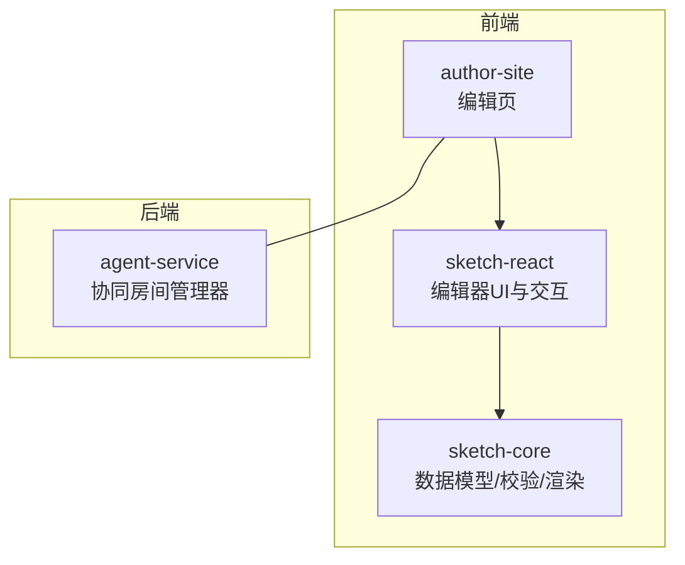
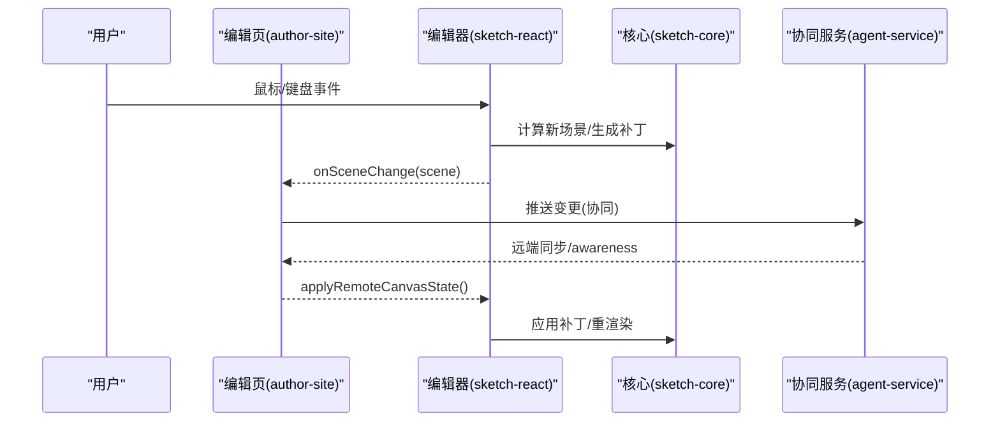
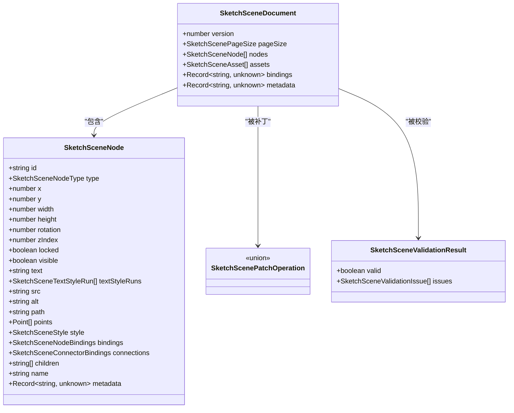
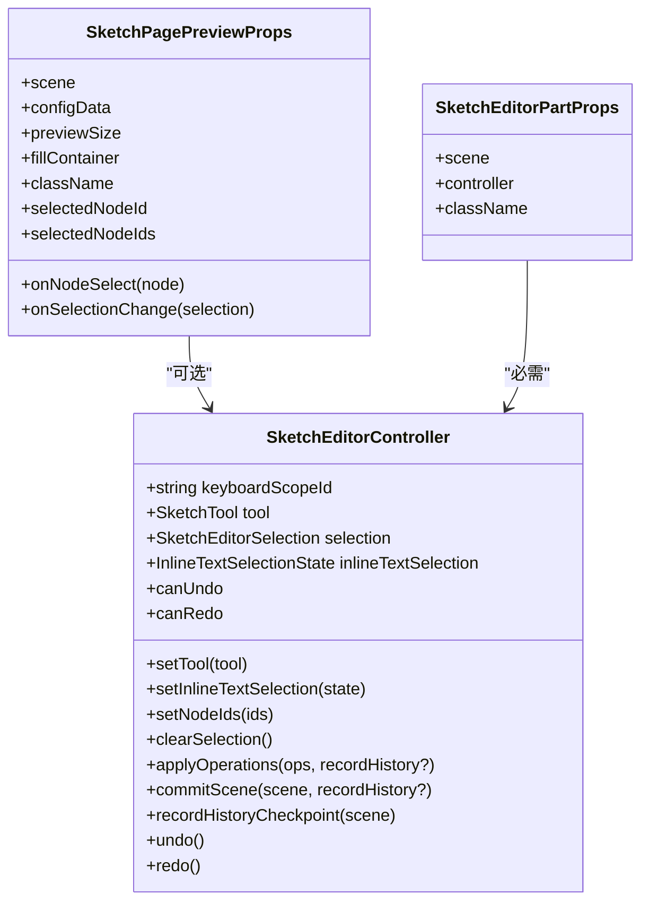
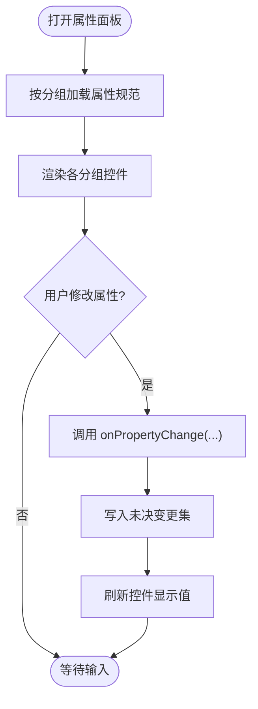
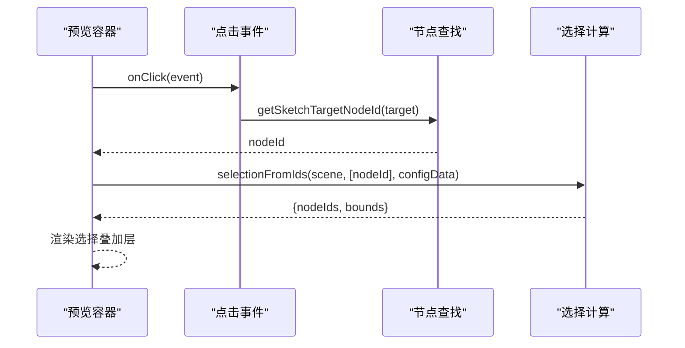
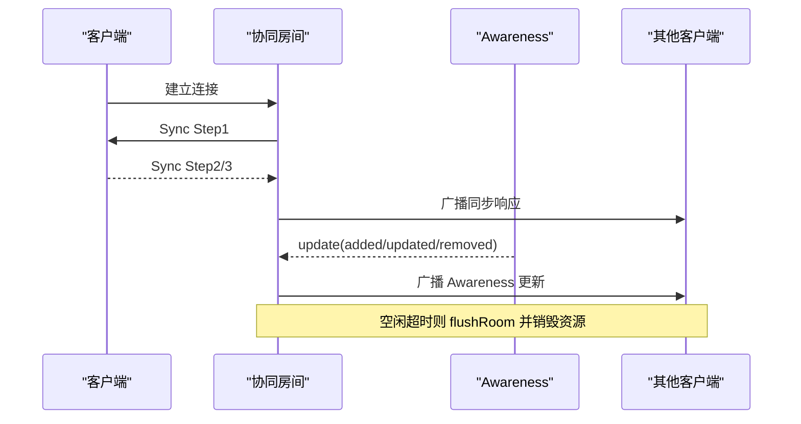
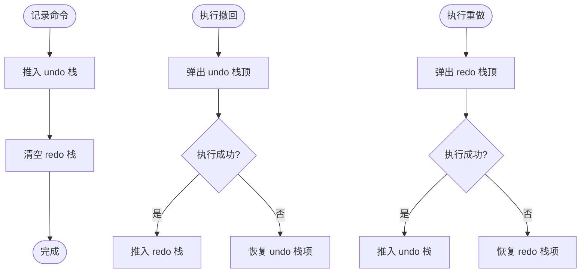
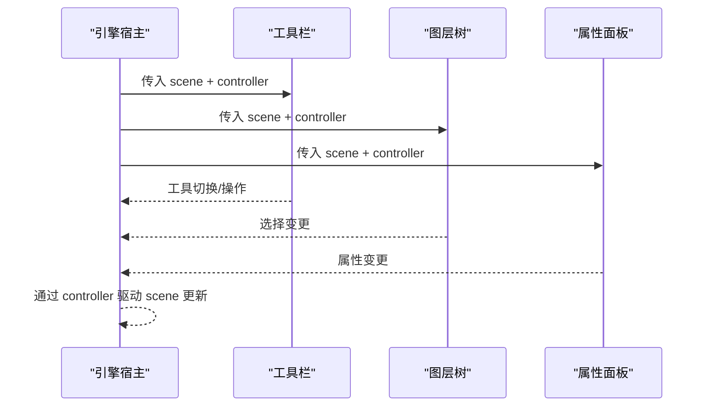

# Sketch 画布编辑器

<cite>
**本文引用的文件**   
- [packages/sketch-core/src/index.ts](file://packages/sketch-core/src/index.ts)
- [packages/sketch-react/src/index.tsx](file://packages/sketch-react/src/index.tsx)
- [packages/sketch-react/src/preview.tsx](file://packages/sketch-react/src/preview.tsx)
- [packages/author-site/src/app/demo/[id]/edit/components/SketchEditorEngineHost.tsx](file://packages/author-site/src/app/demo/[id]/edit/components/SketchEditorEngineHost.tsx)
- [packages/author-site/src/app/demo/[id]/edit/components/VisualPropertyPanel.tsx](file://packages/author-site/src/app/demo/[id]/edit/components/VisualPropertyPanel.tsx)
- [packages/agent-service/src/collab/collab-room-manager.ts](file://packages/agent-service/src/collab/collab-room-manager.ts)
- [docs/项目文档/创作端/03-项目管理/技术/11_实时保存与协同编辑.md](file://docs/项目文档/创作端/03-项目管理/技术/11_实时保存与协同编辑.md)
- [packages/author-site/src/app/demo/[id]/edit/page.tsx](file://packages/author-site/src/app/demo/[id]/edit/page.tsx)
- [packages/author-site/src/app/demo/[id]/edit/hooks/useCommandHistory.ts](file://packages/author-site/src/app/demo/[id]/edit/hooks/useCommandHistory.ts)
- [packages/sketch-react/tests/sketch-react.test.tsx](file://packages/sketch-react/tests/sketch-react.test.tsx)
</cite>

## 目录
1. [简介](#简介)
2. [项目结构](#项目结构)
3. [核心组件](#核心组件)
4. [架构总览](#架构总览)
5. [详细组件分析](#详细组件分析)
6. [依赖分析](#依赖分析)
7. [性能考虑](#性能考虑)
8. [故障排查指南](#故障排查指南)
9. [结论](#结论)
10. [附录](#附录)

## 简介
本文件面向 Sketch 画布编辑器的开发者与维护者，系统性解析可视化编辑器的核心架构与实现细节，覆盖：
- 画布渲染引擎与数据协议
- 元素选择系统与属性面板联动
- React 组件封装策略、自定义节点类型定义与事件处理
- 实时协作（WebSocket + Yjs）连接管理、操作同步与冲突解决
- 撤销重做系统原理与状态管理
- 性能优化策略（虚拟滚动、增量更新、内存管理）
- 编辑器扩展与自定义组件开发指南

## 项目结构
仓库采用多包 monorepo 组织，Sketch 相关能力主要分布在以下包中：
- sketch-core：场景数据模型、校验、补丁操作、几何计算与 SVG 渲染等纯逻辑
- sketch-react：基于 React 的编辑器 UI 与交互（工具栏、图层树、属性面板、画布）
- author-site：集成层，将 sketch-react 嵌入到“演示/编辑”页面，并串联命令历史、协同、持久化等
- agent-service：协同服务侧，使用 Yjs 与 awareness 协议进行房间级同步与广播



图表来源
- [packages/author-site/src/app/demo/[id]/edit/page.tsx](file://packages/author-site/src/app/demo/[id]/edit/page.tsx)
- [packages/sketch-react/src/index.tsx](file://packages/sketch-react/src/index.tsx)
- [packages/sketch-core/src/index.ts](file://packages/sketch-core/src/index.ts)
- [packages/agent-service/src/collab/collab-room-manager.ts](file://packages/agent-service/src/collab/collab-room-manager.ts)

章节来源
- [packages/sketch-core/src/index.ts](file://packages/sketch-core/src/index.ts)
- [packages/sketch-react/src/index.tsx](file://packages/sketch-react/src/index.tsx)
- [packages/author-site/src/app/demo/[id]/edit/page.tsx](file://packages/author-site/src/app/demo/[id]/edit/page.tsx)
- [packages/agent-service/src/collab/collab-room-manager.ts](file://packages/agent-service/src/collab/collab-room-manager.ts)

## 核心组件
- 场景数据模型与协议
  - 统一的数据结构 SketchSceneDocument，包含 pageSize、nodes、assets、bindings、metadata 等
  - 节点类型枚举 SketchSceneNodeType，支持矩形、菱形、椭圆、线条、箭头、路径、文本、图片、便签、按钮、输入、卡片、分组等
  - 样式、绑定、连接器锚点、文本样式片段等完整类型体系
- 校验与规范化
  - normalizeSketchSceneDocument：对版本、尺寸、节点数组等进行规范化与回退
  - validateSketchSceneDocument：严格校验节点 ID、几何、样式、绑定、连接器引用、循环依赖等
- 补丁操作与摘要
  - SketchScenePatchOperation：增删改、复制、排序、分组/解组、锁定/可见性、绑定/解绑
  - SketchScenePatchSummary：变更统计与影响范围
- 几何与渲染
  - 获取节点边界、选择边界、连接器锚点坐标
  - renderSketchSceneToSvgMarkup：将场景渲染为 SVG 标记
- React 编辑器
  - 提供预览与编辑两种模式，统一的控制器接口 SketchEditorController
  - 工具、拖拽、缩放平移、框选、吸附、橡皮擦、内联文本编辑等
  - 属性面板、图层树、工具栏等可组合部件
- 协同
  - 服务端房间管理器维护 Y.Doc 与 Awareness，处理消息分发与空闲清理
  - 客户端通过 useCollabDocument 管理断连抖动与离线待同步状态

章节来源
- [packages/sketch-core/src/index.ts](file://packages/sketch-core/src/index.ts)
- [packages/sketch-react/src/index.tsx](file://packages/sketch-react/src/index.tsx)
- [packages/agent-service/src/collab/collab-room-manager.ts](file://packages/agent-service/src/collab/collab-room-manager.ts)

## 架构总览
整体采用“数据驱动 + 组件拼装”的架构：
- 数据层（sketch-core）负责不可变数据、校验、补丁与渲染
- 表现层（sketch-react）负责交互与 UI 拼装，暴露控制器以驱动数据变更
- 集成层（author-site）编排命令历史、协同、持久化与页面路由
- 协同层（agent-service）基于 Yjs 提供 CRDT 同步与用户感知（awareness）



图表来源
- [packages/author-site/src/app/demo/[id]/edit/page.tsx](file://packages/author-site/src/app/demo/[id]/edit/page.tsx)
- [packages/sketch-react/src/index.tsx](file://packages/sketch-react/src/index.tsx)
- [packages/sketch-core/src/index.ts](file://packages/sketch-core/src/index.ts)
- [packages/agent-service/src/collab/collab-room-manager.ts](file://packages/agent-service/src/collab/collab-room-manager.ts)

## 详细组件分析

### 数据模型与渲染引擎（sketch-core）
- 数据结构
  - SketchSceneDocument：版本、页面尺寸、节点列表、资源、绑定、元信息
  - SketchSceneNode：通用节点字段（位置、尺寸、旋转、层级、锁定、可见性、文本、样式、绑定、连接器、子节点等）
  - 样式与文本样式：填充、描边、透明度、圆角、字体、对齐、虚线、箭头、图片适配等
- 校验与规范化
  - 版本检查、页面尺寸合法性、节点必填字段、几何约束、路径/图片源有效性、绑定键白名单、连接器锚点合法、父子关系无环
- 补丁与摘要
  - 支持多种原子操作；汇总新增/删除/更新节点集合与字段变化
- 几何与渲染
  - 节点边界、选择边界、连接器锚点计算
  - 将场景转换为 SVG 字符串用于预览或导出



图表来源
- [packages/sketch-core/src/index.ts](file://packages/sketch-core/src/index.ts)

章节来源
- [packages/sketch-core/src/index.ts](file://packages/sketch-core/src/index.ts)

### React 编辑器与组件封装（sketch-react）
- 控制器抽象
  - SketchEditorController：键盘作用域、工具切换、选择状态、内联文本编辑、批量操作、提交场景、历史记录检查点、撤销/重做
- 交互与工具
  - 选择、手型平移、绘制（矩形/菱形/椭圆/线条/箭头/画笔/文本/图片/便签）、橡皮擦
  - 拖拽移动、四向/对角/旋转手柄、吸附（网格/中心/边缘/间距）
  - 视图控制：缩放、平移、居中适配
- 部件化
  - 画布、工具栏、图层树、属性面板作为独立部件，通过 scene 与 controller 组合
- 预览模式
  - 轻量预览组件，仅渲染 SVG 与选择叠加层，支持配置绑定与图片加载失败占位



图表来源
- [packages/sketch-react/src/index.tsx](file://packages/sketch-react/src/index.tsx)
- [packages/sketch-react/src/preview.tsx](file://packages/sketch-react/src/preview.tsx)

章节来源
- [packages/sketch-react/src/index.tsx](file://packages/sketch-react/src/index.tsx)
- [packages/sketch-react/src/preview.tsx](file://packages/sketch-react/src/preview.tsx)

### 属性面板联动机制（VisualPropertyPanel）
- 属性分组：位置、布局、外观、背景、边框、阴影与模糊等
- 值来源：当前选中节点的属性值与未决变更集合并显示
- 变更派发：onPropertyChange(selectedNode, property, label, value, kind, currentValue)
- 控件类型：文本、数字、颜色、下拉、开关、图标选择器等



图表来源
- [packages/author-site/src/app/demo/[id]/edit/components/VisualPropertyPanel.tsx](file://packages/author-site/src/app/demo/[id]/edit/components/VisualPropertyPanel.tsx)

章节来源
- [packages/author-site/src/app/demo/[id]/edit/components/VisualPropertyPanel.tsx](file://packages/author-site/src/app/demo/[id]/edit/components/VisualPropertyPanel.tsx)

### 画布渲染与选择系统
- 渲染管线
  - 解析/校验场景 -> 生成 SVG 标记 -> 注入 DOM -> 根据缩放/偏移映射选择框
- 选择系统
  - 基于 data-sketch-node-id/data-sketch-node-label 定位目标节点
  - 计算可见选择边界（受 configData 绑定 visible 影响）
  - 预览模式下提供最小尺寸的选择叠加层



图表来源
- [packages/sketch-react/src/preview.tsx](file://packages/sketch-react/src/preview.tsx)

章节来源
- [packages/sketch-react/src/preview.tsx](file://packages/sketch-react/src/preview.tsx)

### 实时协作（WebSocket + Yjs）
- 房间管理
  - 维护 rooms 映射，记录连接、最后活跃时间、Awareness 与 Y.Doc
  - 处理 SYNC 与 AWARENESS 消息，转发给其他连接
  - 空闲房间清理：flushRoom、销毁 doc 与 awareness
- 同步流程
  - 新连接进入时发送 Sync Step1，随后双向同步
  - Awareness 更新编码后广播给除发起者外的所有连接
- 前端抖动约束
  - 短暂 disconnected 视为自动重连过程，不立即降级为“离线待同步”，避免多房间抖动



图表来源
- [packages/agent-service/src/collab/collab-room-manager.ts](file://packages/agent-service/src/collab/collab-room-manager.ts)

章节来源
- [packages/agent-service/src/collab/collab-room-manager.ts](file://packages/agent-service/src/collab/collab-room-manager.ts)
- [docs/项目文档/创作端/03-项目管理/技术/11_实时保存与协同编辑.md](file://docs/项目文档/创作端/03-项目管理/技术/11_实时保存与协同编辑.md)

### 撤销重做系统（命令历史）
- 命令栈
  - undoStack/redoStack 分别存储可执行命令对象
  - executeCommand 先执行 redo，成功后入栈并清空 redo 栈
  - undo/redo 在异常时回滚对应栈项并上报错误
- 全局快捷键
  - Z 撤回，Y 或 Shift+Z 重做，忽略特定输入域事件
- 画布变更聚合
  - 编辑页将多次画布变更合并为一次命令，防抖延迟提交，避免频繁压栈



图表来源
- [packages/author-site/src/app/demo/[id]/edit/hooks/useCommandHistory.ts](file://packages/author-site/src/app/demo/[id]/edit/hooks/useCommandHistory.ts)

章节来源
- [packages/author-site/src/app/demo/[id]/edit/hooks/useCommandHistory.ts](file://packages/author-site/src/app/demo/[id]/edit/hooks/useCommandHistory.ts)
- [packages/author-site/src/app/demo/[id]/edit/page.tsx](file://packages/author-site/src/app/demo/[id]/edit/page.tsx)
- [packages/sketch-react/tests/sketch-react.test.tsx](file://packages/sketch-react/tests/sketch-react.test.tsx)

### 引擎宿主与面板装配（SketchEditorEngineHost）
- 根据 host.engine 是否为 native 决定是否渲染原生工具栏
- 将 scene 与 nativeController 注入到图层树与属性面板，形成“同一控制器驱动多面板”的联动



图表来源
- [packages/author-site/src/app/demo/[id]/edit/components/SketchEditorEngineHost.tsx](file://packages/author-site/src/app/demo/[id]/edit/components/SketchEditorEngineHost.tsx)

章节来源
- [packages/author-site/src/app/demo/[id]/edit/components/SketchEditorEngineHost.tsx](file://packages/author-site/src/app/demo/[id]/edit/components/SketchEditorEngineHost.tsx)

## 依赖分析
- 包间依赖
  - sketch-react 依赖 sketch-core（数据模型、校验、渲染、几何）
  - author-site 依赖 sketch-react（编辑器 UI），并通过 hooks 与 page 编排协同与历史
  - agent-service 独立运行，通过 WebSocket 与前端协同
- 运行时耦合
  - 控制器与面板松耦合，通过 scene 与 controller 通信
  - 协同层与业务层通过命令历史与画布状态桥接

```mermaid
graph LR
Core["@workbench/sketch-core"] --> React["@workbench/sketch-react"]
React --> Author["author-site 编辑页"]
Agent["agent-service 协同"] < --> Author
```

图表来源
- [packages/sketch-core/src/index.ts](file://packages/sketch-core/src/index.ts)
- [packages/sketch-react/src/index.tsx](file://packages/sketch-react/src/index.tsx)
- [packages/author-site/src/app/demo/[id]/edit/page.tsx](file://packages/author-site/src/app/demo/[id]/edit/page.tsx)
- [packages/agent-service/src/collab/collab-room-manager.ts](file://packages/agent-service/src/collab/collab-room-manager.ts)

章节来源
- [packages/sketch-core/src/index.ts](file://packages/sketch-core/src/index.ts)
- [packages/sketch-react/src/index.tsx](file://packages/sketch-react/src/index.tsx)
- [packages/author-site/src/app/demo/[id]/edit/page.tsx](file://packages/author-site/src/app/demo/[id]/edit/page.tsx)
- [packages/agent-service/src/collab/collab-room-manager.ts](file://packages/agent-service/src/collab/collab-room-manager.ts)

## 性能考虑
- 渲染与更新
  - 使用 SVG 标记一次性注入，减少 DOM 操作次数
  - 选择与可见性计算基于 Map/Set 索引，降低重复遍历
  - 图像资源探测与失败占位，避免阻塞主渲染
- 交互与计算
  - 路径简化算法减少点数量，降低后续计算与渲染压力
  - 吸附与约束仅在必要时触发，阈值过滤微小抖动
- 协同与历史
  - 画布变更合并与防抖，减少命令栈膨胀
  - 协同断连抖动抑制，避免状态频繁切换导致的重渲染
- 内存管理
  - 协同房间空闲清理，销毁 Y.Doc 与 Awareness
  - 图片 Data URL 大小估算与超限提示，防止大资源导致内存峰值

[本节为通用指导，无需具体文件来源]

## 故障排查指南
- 协同问题
  - 现象：频繁“连接中/离线待同步”抖动
  - 排查：确认 useCollabDocument 的抖动约束是否生效；检查房间是否长时间空闲未被清理
  - 参考：[docs/项目文档/创作端/03-项目管理/技术/11_实时保存与协同编辑.md](file://docs/项目文档/创作端/03-项目管理/技术/11_实时保存与协同编辑.md)
- 撤销重做异常
  - 现象：重做失败但栈未回滚
  - 排查：确认 onError 回调是否正确上报；检查命令执行是否抛出异常
  - 参考：[packages/author-site/src/app/demo/[id]/edit/hooks/useCommandHistory.ts](file://packages/author-site/src/app/demo/[id]/edit/hooks/useCommandHistory.ts)
- 属性面板无效
  - 现象：配置隐藏节点仍可在属性面板编辑
  - 排查：确认属性面板是否读取了未决变更与可见性过滤
  - 参考：[packages/sketch-react/tests/sketch-react.test.tsx](file://packages/sketch-react/tests/sketch-react.test.tsx)

章节来源
- [docs/项目文档/创作端/03-项目管理/技术/11_实时保存与协同编辑.md](file://docs/项目文档/创作端/03-项目管理/技术/11_实时保存与协同编辑.md)
- [packages/author-site/src/app/demo/[id]/edit/hooks/useCommandHistory.ts](file://packages/author-site/src/app/demo/[id]/edit/hooks/useCommandHistory.ts)
- [packages/sketch-react/tests/sketch-react.test.tsx](file://packages/sketch-react/tests/sketch-react.test.tsx)

## 结论
Sketch 画布编辑器通过清晰的数据协议与严格的校验保障数据一致性；React 组件以控制器为中心实现高内聚低耦合的交互；协同层基于 Yjs 提供稳定可靠的分布式同步；命令历史与画布变更合并提升用户体验与性能。建议在新功能扩展时遵循现有协议与控制器契约，优先复用 core 能力，保持 UI 与数据层解耦。

[本节为总结，无需具体文件来源]

## 附录

### 扩展与自定义组件开发指南
- 自定义节点类型
  - 在 sketch-core 中扩展 SketchSceneNodeType 与相应校验规则，确保 geometry/style/bindings 合法
  - 在 sketch-react 中为新类型添加默认创建逻辑、绘制草稿与渲染分支
- 自定义属性控件
  - 在 VisualPropertyPanel 中注册新的属性规范（section/spec/input/options），并在 onPropertyChange 中派发变更
- 自定义工具
  - 在控制器中新增工具类型与交互状态机，实现拖拽/绘制/吸附/提交补丁流程
- 协同接入
  - 在 author-site 中将画布变更纳入命令历史，并通过协同通道推送；注意断连抖动与离线待同步状态
- 预览增强
  - 在 preview 组件中增加新的选择叠加层、标注或资源探测逻辑

[本节为概念性指导，无需具体文件来源]