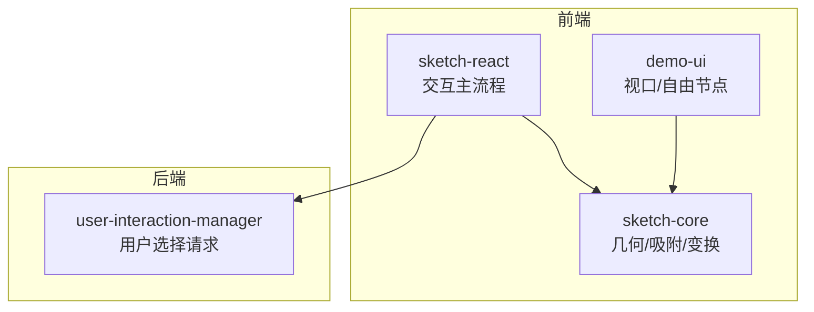
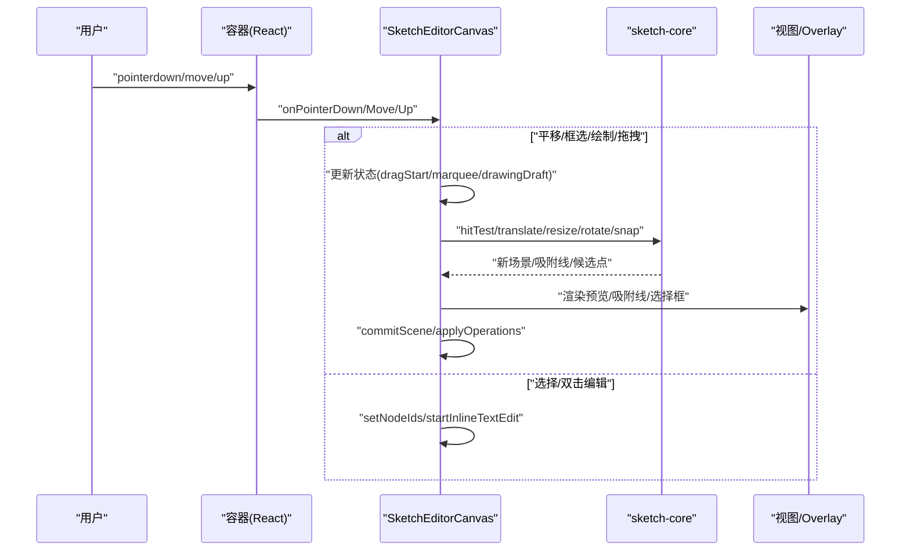
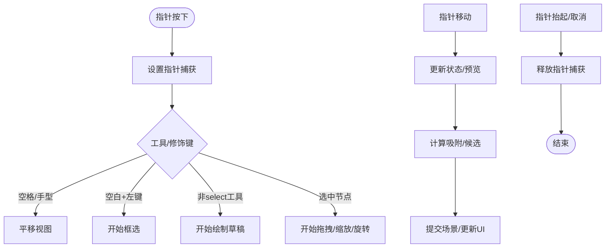
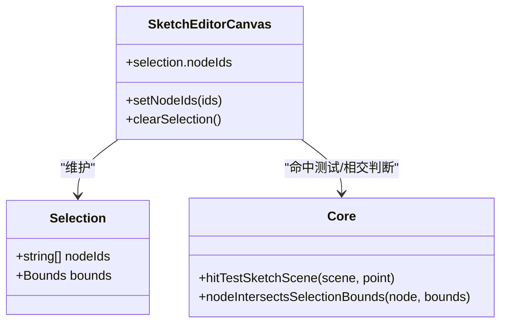
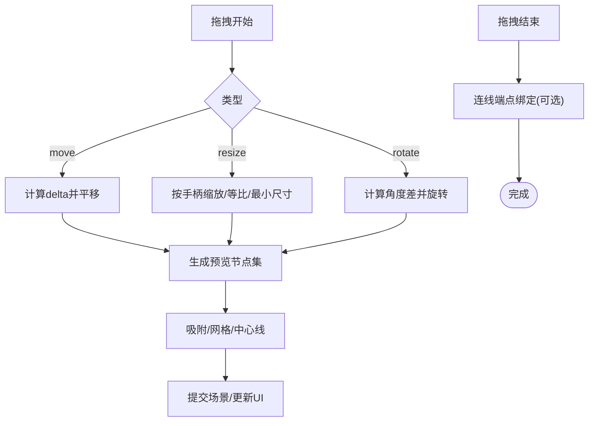
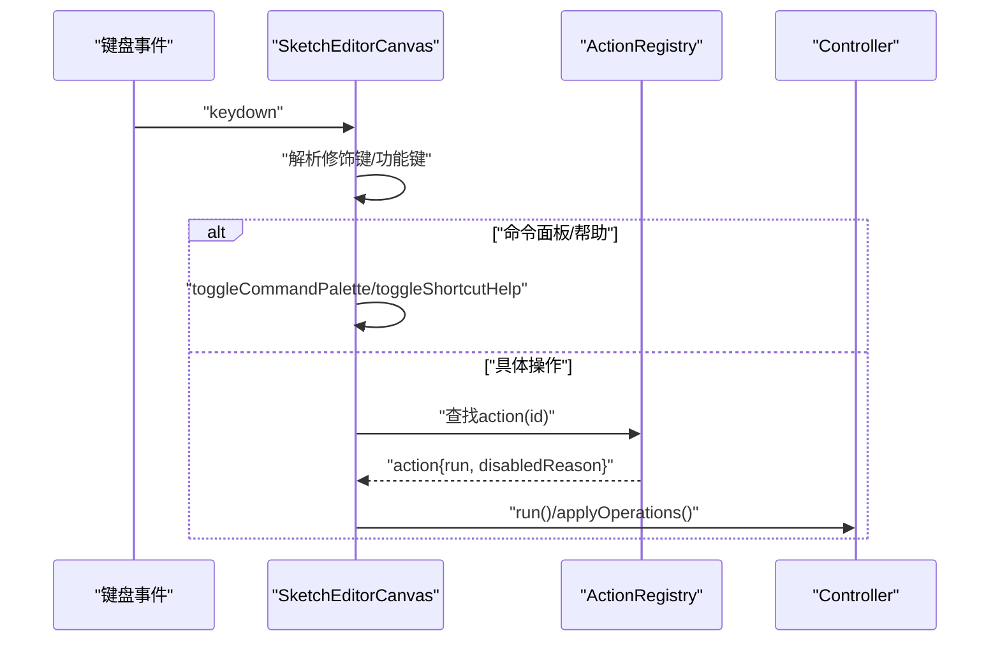
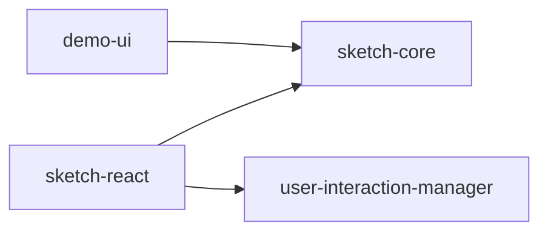

# 交互处理系统

<cite>
**本文引用的文件**   
- [packages/sketch-react/src/index.tsx](file://packages/sketch-react/src/index.tsx)
- [packages/sketch-core/src/index.ts](file://packages/sketch-core/src/index.ts)
- [packages/demo-ui/src/CanvasViewport.tsx](file://packages/demo-ui/src/CanvasViewport.tsx)
- [packages/demo-ui/src/CanvasFreeNodeItem.tsx](file://packages/demo-ui/src/CanvasFreeNodeItem.tsx)
- [packages/agent-service/src/backends/managers/user-interaction-manager.ts](file://packages/agent-service/src/backends/managers/user-interaction-manager.ts)
</cite>

## 目录
1. [简介](#简介)
2. [项目结构](#项目结构)
3. [核心组件](#核心组件)
4. [架构总览](#架构总览)
5. [详细组件分析](#详细组件分析)
6. [依赖关系分析](#依赖关系分析)
7. [性能考量](#性能考量)
8. [故障排查指南](#故障排查指南)
9. [结论](#结论)
10. [附录](#附录)

## 简介
本技术文档围绕“交互处理系统”展开，聚焦于用户交互事件（鼠标、键盘、触摸）的统一处理机制；元素选择系统（单选、多选、框选）的实现；拖拽操作（源与目标检测、位置计算、视觉反馈）；快捷键系统与命令模式；手势识别与移动端适配；以及自定义交互行为的扩展开发指南。文档以代码级分析为基础，结合可视化图示，帮助读者快速理解并扩展该系统的交互能力。

## 项目结构
交互处理系统主要分布在以下模块：
- sketch-react：编辑器画布与交互主逻辑（事件分发、选择、拖拽、绘制、吸附、连接点吸附等）
- sketch-core：几何与碰撞检测、吸附计算、节点变换等底层算法
- demo-ui：演示用视口与自由节点交互（缩放、平移、框选、拖拽）
- agent-service：后端用户交互请求管理（用于 Agent 场景的用户选择卡片）

图表来源
- [packages/sketch-react/src/index.tsx:5457-6799](file://packages/sketch-react/src/index.tsx#L5457-L6799)
- [packages/sketch-core/src/index.ts:1500-1802](file://packages/sketch-core/src/index.ts#L1500-L1802)
- [packages/demo-ui/src/CanvasViewport.tsx:300-600](file://packages/demo-ui/src/CanvasViewport.tsx#L300-L600)
- [packages/agent-service/src/backends/managers/user-interaction-manager.ts:1-181](file://packages/agent-service/src/backends/managers/user-interaction-manager.ts#L1-L181)

章节来源
- [packages/sketch-react/src/index.tsx:5457-6799](file://packages/sketch-react/src/index.tsx#L5457-L6799)
- [packages/sketch-core/src/index.ts:1500-1802](file://packages/sketch-core/src/index.ts#L1500-L1802)
- [packages/demo-ui/src/CanvasViewport.tsx:300-600](file://packages/demo-ui/src/CanvasViewport.tsx#L300-L600)
- [packages/agent-service/src/backends/managers/user-interaction-manager.ts:1-181](file://packages/agent-service/src/backends/managers/user-interaction-manager.ts#L1-L181)

## 核心组件
- 统一指针捕获与释放：通过 PointerEvent 的 setPointerCapture/releasePointerCapture 保证跨设备输入一致性，避免指针丢失导致的交互异常。
- 键盘事件与命令面板：集中监听全局键盘事件，支持空格平移、方向键微调、撤销重做、复制粘贴、分组/解锁/可见性切换、命令面板与快捷键帮助。
- 选择系统：点击单选/多选、Shift 累加/取消、Cmd/Ctrl 循环候选、空白区域框选、旋转线段的线段相交判定。
- 拖拽与变形：移动、旋转、缩放（含等比约束）、连线端点吸附、历史检查点与增量提交。
- 吸附与辅助线：网格、中心线、边缘对齐、最近候选合并。
- 视图控制：滚轮缩放（Ctrl/Cmd）、平移、缩放到页面/选区。
- 绘制与擦除：手绘/文本/图片占位、橡皮擦路径收集与批量删除。
- 命令模式：动作注册、禁用状态、快捷入口、命令面板检索执行。

章节来源
- [packages/sketch-react/src/index.tsx:6104-6128](file://packages/sketch-react/src/index.tsx#L6104-L6128)
- [packages/sketch-react/src/index.tsx:6130-6282](file://packages/sketch-react/src/index.tsx#L6130-L6282)
- [packages/sketch-react/src/index.tsx:6698-6799](file://packages/sketch-react/src/index.tsx#L6698-L6799)
- [packages/sketch-react/src/index.tsx:6348-6590](file://packages/sketch-react/src/index.tsx#L6348-L6590)
- [packages/sketch-react/src/index.tsx:5534-5548](file://packages/sketch-react/src/index.tsx#L5534-L5548)
- [packages/sketch-core/src/index.ts:1500-1611](file://packages/sketch-core/src/index.ts#L1500-L1611)
- [packages/sketch-core/src/index.ts:1670-1707](file://packages/sketch-core/src/index.ts#L1670-L1707)
- [packages/sketch-core/src/index.ts:1740-1801](file://packages/sketch-core/src/index.ts#L1740-L1801)
- [packages/demo-ui/src/CanvasViewport.tsx:458-501](file://packages/demo-ui/src/CanvasViewport.tsx#L458-L501)

## 架构总览
下图展示了从输入到渲染的关键调用链：指针事件进入后，根据工具模式与修饰键决定是平移、框选、绘制、拖拽还是选择；随后更新场景并通过控制器提交变更；同时计算吸附与连接候选，提供实时视觉反馈。

图表来源
- [packages/sketch-react/src/index.tsx:6313-6590](file://packages/sketch-react/src/index.tsx#L6313-L6590)
- [packages/sketch-core/src/index.ts:1670-1707](file://packages/sketch-core/src/index.ts#L1670-L1707)
- [packages/sketch-core/src/index.ts:1500-1611](file://packages/sketch-core/src/index.ts#L1500-L1611)

## 详细组件分析

### 统一事件处理与指针捕获
- 使用 setPointerCapture 在按下时捕获指针，确保 move/up 事件稳定到达目标元素；在 up/cancel 或退出交互时释放。
- 对 wheel 事件区分 Ctrl/Cmd 缩放与普通平移，避免浏览器默认行为干扰。
- 在 capture 阶段处理抓手平移，在 bubble 阶段处理框选与创建模式。

图表来源
- [packages/sketch-react/src/index.tsx:6104-6128](file://packages/sketch-react/src/index.tsx#L6104-L6128)
- [packages/sketch-react/src/index.tsx:6292-6312](file://packages/sketch-react/src/index.tsx#L6292-L6312)
- [packages/sketch-react/src/index.tsx:6348-6590](file://packages/sketch-react/src/index.tsx#L6348-L6590)
- [packages/demo-ui/src/CanvasViewport.tsx:300-365](file://packages/demo-ui/src/CanvasViewport.tsx#L300-L365)

章节来源
- [packages/sketch-react/src/index.tsx:6104-6128](file://packages/sketch-react/src/index.tsx#L6104-L6128)
- [packages/sketch-react/src/index.tsx:6292-6312](file://packages/sketch-react/src/index.tsx#L6292-L6312)
- [packages/sketch-react/src/index.tsx:6348-6590](file://packages/sketch-react/src/index.tsx#L6348-L6590)
- [packages/demo-ui/src/CanvasViewport.tsx:300-365](file://packages/demo-ui/src/CanvasViewport.tsx#L300-L365)

### 元素选择系统（单选/多选/框选）
- 点击选择：支持 Shift 累加/取消、Cmd/Ctrl 循环候选、锁定节点忽略。
- 框选：空白区域拖拽生成矩形，基于节点边界或旋转后的多边形/线段相交判定。
- 选择结果：包含 nodeIds 与可视边界，用于后续操作与 UI 展示。

图表来源
- [packages/sketch-react/src/index.tsx:6698-6799](file://packages/sketch-react/src/index.tsx#L6698-L6799)
- [packages/sketch-react/src/index.tsx:759-786](file://packages/sketch-react/src/index.tsx#L759-L786)
- [packages/sketch-react/src/index.tsx:968-989](file://packages/sketch-react/src/index.tsx#L968-L989)
- [packages/sketch-core/src/index.ts:1670-1707](file://packages/sketch-core/src/index.ts#L1670-L1707)

章节来源
- [packages/sketch-react/src/index.tsx:6698-6799](file://packages/sketch-react/src/index.tsx#L6698-L6799)
- [packages/sketch-react/src/index.tsx:759-786](file://packages/sketch-react/src/index.tsx#L759-L786)
- [packages/sketch-react/src/index.tsx:968-989](file://packages/sketch-react/src/index.tsx#L968-L989)
- [packages/sketch-core/src/index.ts:1670-1707](file://packages/sketch-core/src/index.ts#L1670-L1707)

### 拖拽操作（移动/缩放/旋转/连线端点）
- 移动：按 delta 平移节点集合，支持 Alt 拖动复制、Shift 约束比例。
- 缩放：八向手柄，支持等比缩放与最小尺寸限制；线类节点特殊处理。
- 旋转：以选择中心为轴，角度差驱动旋转，首次超过阈值记录历史检查点。
- 连线端点：拖拽线端点时计算最近连接候选点，释放时绑定连接。

图表来源
- [packages/sketch-react/src/index.tsx:6399-6590](file://packages/sketch-react/src/index.tsx#L6399-L6590)
- [packages/sketch-core/src/index.ts:1740-1801](file://packages/sketch-core/src/index.ts#L1740-L1801)
- [packages/sketch-core/src/index.ts:1500-1611](file://packages/sketch-core/src/index.ts#L1500-L1611)

章节来源
- [packages/sketch-react/src/index.tsx:6399-6590](file://packages/sketch-react/src/index.tsx#L6399-L6590)
- [packages/sketch-core/src/index.ts:1740-1801](file://packages/sketch-core/src/index.ts#L1740-L1801)
- [packages/sketch-core/src/index.ts:1500-1611](file://packages/sketch-core/src/index.ts#L1500-L1611)

### 快捷键系统与命令模式
- 快捷键：空格平移、Esc 取消/退出、Tab 相邻选择、方向键微调、Delete/Backspace 删除、Ctrl/Cmd+Z/Y 撤销重做、Ctrl/Cmd+C/V/G/L/H 等组合键。
- 命令面板：Cmd/Ctrl+K 打开，支持模糊搜索与执行；? 打开快捷键帮助。
- 动作注册：构建 actionEntries，包含 id、label、shortcuts、run、disabledReason 等字段，统一由 runAction 执行。

图表来源
- [packages/sketch-react/src/index.tsx:6130-6282](file://packages/sketch-react/src/index.tsx#L6130-L6282)
- [packages/sketch-react/src/index.tsx:3254-3322](file://packages/sketch-react/src/index.tsx#L3254-L3322)
- [packages/sketch-react/src/index.tsx:3324-3370](file://packages/sketch-react/src/index.tsx#L3324-L3370)

章节来源
- [packages/sketch-react/src/index.tsx:6130-6282](file://packages/sketch-react/src/index.tsx#L6130-L6282)
- [packages/sketch-react/src/index.tsx:3254-3322](file://packages/sketch-react/src/index.tsx#L3254-L3322)
- [packages/sketch-react/src/index.tsx:3324-3370](file://packages/sketch-react/src/index.tsx#L3324-L3370)

### 手势识别与移动端适配
- 统一 PointerEvent：兼容鼠标、触控笔、手指，无需分别处理 mouse/touch。
- 指针捕获：移动端长压拖拽更稳定，避免滚动冲突。
- 视口缩放：支持 Ctrl/Cmd+滚轮缩放；在手型模式下可直接滚轮缩放。
- 演示视口：提供 hand/select 模式下的平移与框选，便于移动端体验验证。

章节来源
- [packages/sketch-react/src/index.tsx:6292-6312](file://packages/sketch-react/src/index.tsx#L6292-L6312)
- [packages/demo-ui/src/CanvasViewport.tsx:458-501](file://packages/demo-ui/src/CanvasViewport.tsx#L458-L501)
- [packages/demo-ui/src/CanvasViewport.tsx:300-365](file://packages/demo-ui/src/CanvasViewport.tsx#L300-L365)

### 自定义交互行为的扩展开发指南
- 新增工具：在工具分支中增加对应 pointerdown/move/up 的处理分支，维护 draft 状态并在 up 时 commit。
- 新增快捷键：在 keydown 分支添加映射，或通过 actionEntries 注册动作，使命令面板可发现。
- 新增吸附规则：在 computeSketchSnapResult 附近扩展候选集合与阈值策略。
- 自定义命中测试：实现 hitTestSketchScene 的特定节点命中逻辑，或在 overlay 层进行命中拦截。
- 移动端优化：优先使用 PointerEvent 与 setPointerCapture，必要时在 touchstart/touchend 补充手势逻辑。

章节来源
- [packages/sketch-react/src/index.tsx:6348-6590](file://packages/sketch-react/src/index.tsx#L6348-L6590)
- [packages/sketch-react/src/index.tsx:6130-6282](file://packages/sketch-react/src/index.tsx#L6130-L6282)
- [packages/sketch-core/src/index.ts:1500-1611](file://packages/sketch-core/src/index.ts#L1500-L1611)
- [packages/sketch-core/src/index.ts:1670-1707](file://packages/sketch-core/src/index.ts#L1670-L1707)

## 依赖关系分析
- 前端交互层（sketch-react）依赖几何与吸附算法（sketch-core）。
- 演示层（demo-ui）复用 core 的几何能力，提供独立视口交互。
- 后端用户交互管理器（agent-service）通过事件回调与前端解耦，用于 Agent 场景的用户选择卡片。

图表来源
- [packages/sketch-react/src/index.tsx:5457-6799](file://packages/sketch-react/src/index.tsx#L5457-L6799)
- [packages/sketch-core/src/index.ts:1500-1802](file://packages/sketch-core/src/index.ts#L1500-L1802)
- [packages/demo-ui/src/CanvasViewport.tsx:300-600](file://packages/demo-ui/src/CanvasViewport.tsx#L300-L600)
- [packages/agent-service/src/backends/managers/user-interaction-manager.ts:1-181](file://packages/agent-service/src/backends/managers/user-interaction-manager.ts#L1-L181)

章节来源
- [packages/sketch-react/src/index.tsx:5457-6799](file://packages/sketch-react/src/index.tsx#L5457-L6799)
- [packages/sketch-core/src/index.ts:1500-1802](file://packages/sketch-core/src/index.ts#L1500-L1802)
- [packages/demo-ui/src/CanvasViewport.tsx:300-600](file://packages/demo-ui/src/CanvasViewport.tsx#L300-L600)
- [packages/agent-service/src/backends/managers/user-interaction-manager.ts:1-181](file://packages/agent-service/src/backends/managers/user-interaction-manager.ts#L1-L181)

## 性能考量
- 命中测试排序：按 zIndex 与插入顺序降序，减少不必要的遍历。
- 增量提交：拖拽过程中仅在变化时提交场景，避免重复渲染。
- 吸附计算阈值：合理设置 threshold，平衡精度与性能。
- 指针捕获：减少事件丢失与额外计算，提升移动端稳定性。
- 视图变换：使用 transform 与 willChange 提示浏览器优化合成层。

[本节为通用指导，不直接分析具体文件]

## 故障排查指南
- 指针丢失：确认是否在 down 时捕获、up/cancel 时释放；检查是否被其他元素抢占捕获。
- 框选无效：检查命中测试与相交判定逻辑，尤其是旋转节点与线类节点的相交。
- 吸附异常：调整阈值与网格大小，确认候选集合是否包含目标锚点。
- 快捷键冲突：确认输入焦点（input/textarea）是否拦截了全局快捷键。
- 移动端缩放：确认是否处于手型模式或按住 Ctrl/Cmd，避免浏览器默认缩放。

章节来源
- [packages/sketch-react/src/index.tsx:6104-6128](file://packages/sketch-react/src/index.tsx#L6104-L6128)
- [packages/sketch-react/src/index.tsx:6130-6282](file://packages/sketch-react/src/index.tsx#L6130-L6282)
- [packages/sketch-react/src/index.tsx:968-989](file://packages/sketch-react/src/index.tsx#L968-L989)
- [packages/sketch-core/src/index.ts:1500-1611](file://packages/sketch-core/src/index.ts#L1500-L1611)

## 结论
本交互处理系统通过统一的指针捕获、完善的快捷键与命令模式、精确的命中与吸附算法，实现了跨设备的流畅交互体验。选择、拖拽、绘制、擦除等功能模块化清晰，易于扩展。建议在新增交互时遵循现有模式：明确状态机、增量提交、完善命中与吸附、提供命令入口与快捷键，以提升一致性与可维护性。

[本节为总结，不直接分析具体文件]

## 附录
- 自由节点拖拽示例：演示在 CanvasFreeNodeItem 中通过 setPointerCapture 与 resize 检测实现拖拽与缩放。
- 视口缩放与平移：演示在 CanvasViewport 中统一处理 wheel 与 pointer 事件，实现缩放与平移。

章节来源
- [packages/demo-ui/src/CanvasFreeNodeItem.tsx:455-493](file://packages/demo-ui/src/CanvasFreeNodeItem.tsx#L455-L493)
- [packages/demo-ui/src/CanvasViewport.tsx:458-501](file://packages/demo-ui/src/CanvasViewport.tsx#L458-L501)