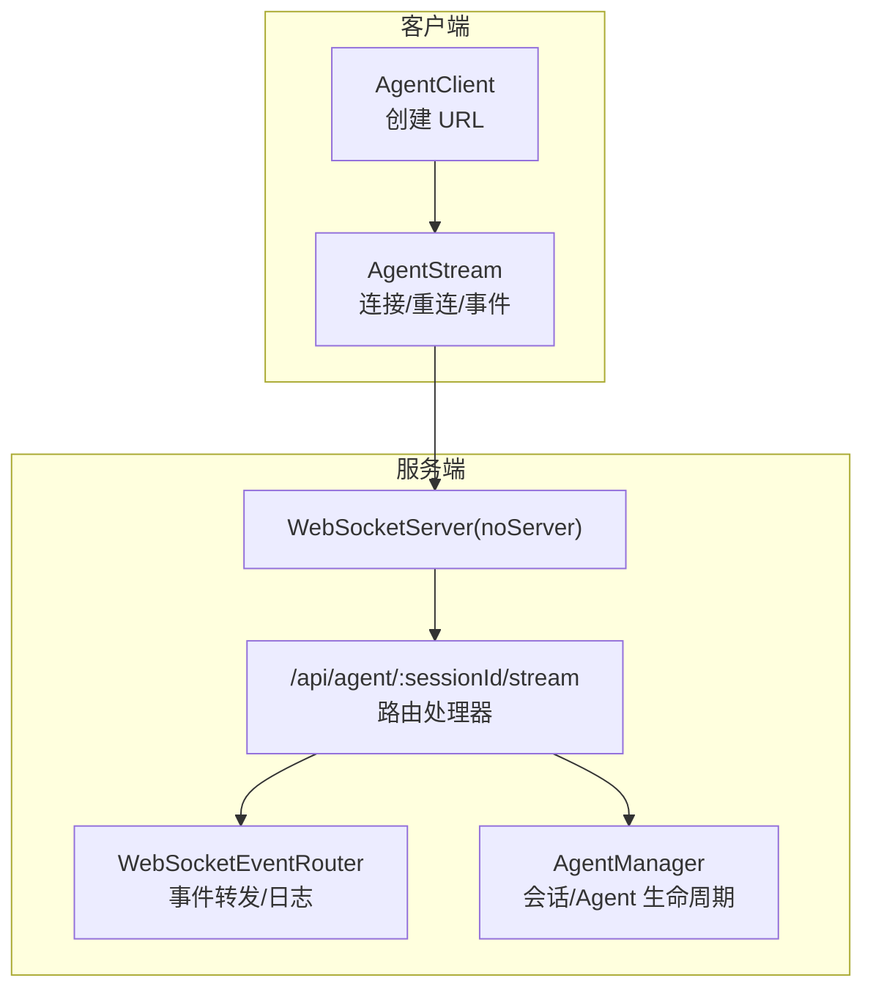
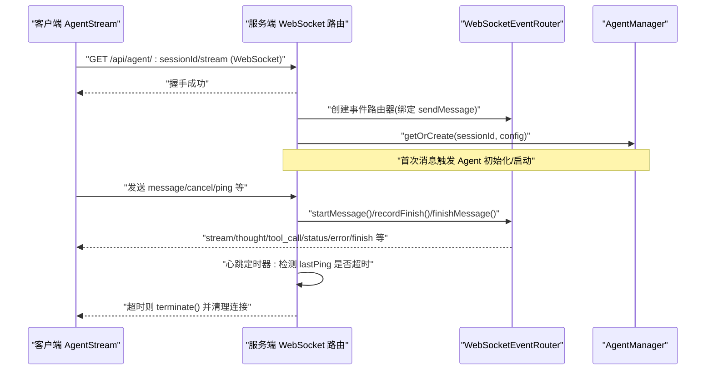
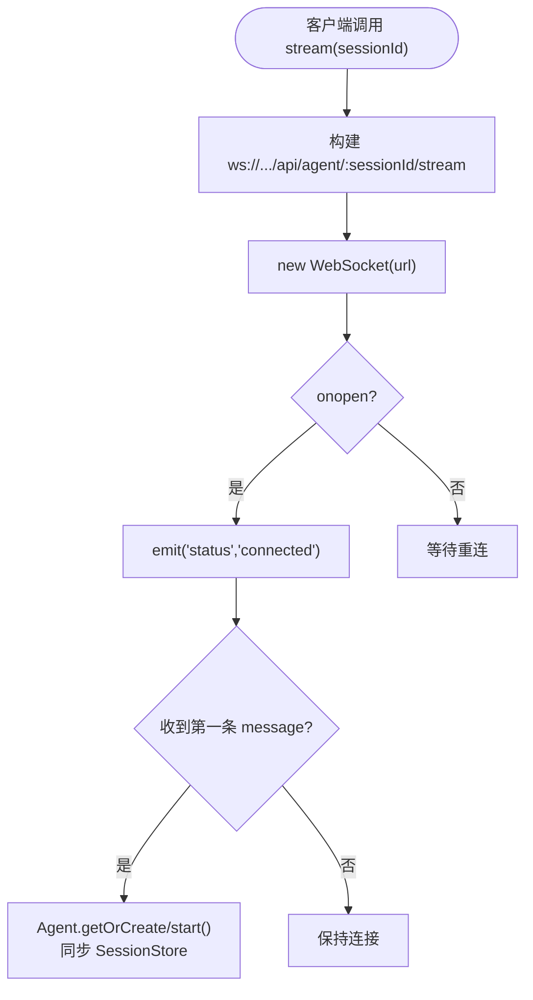
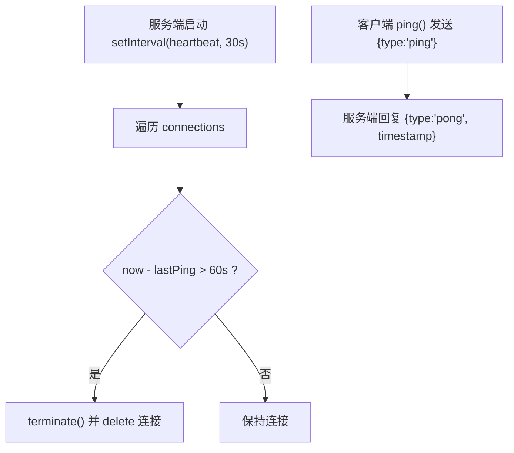
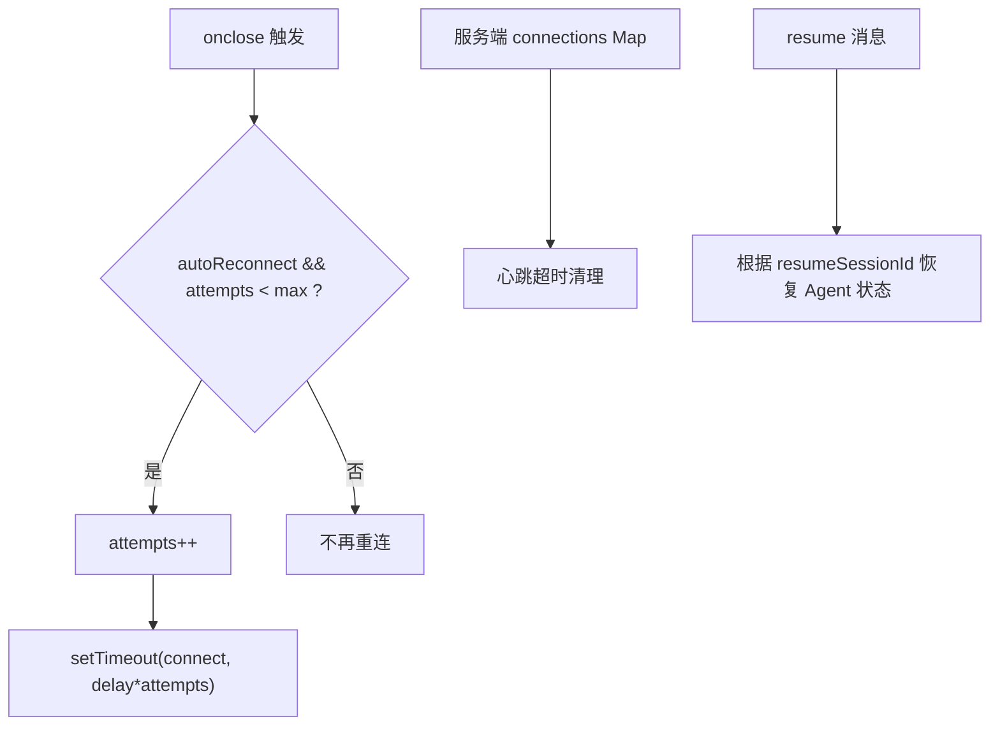
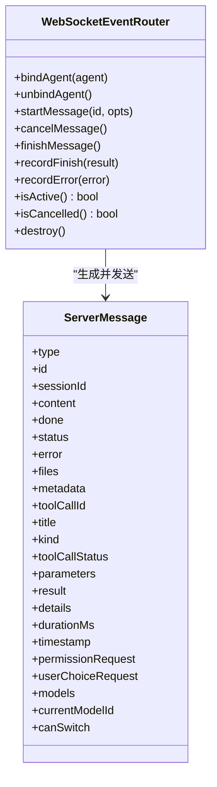
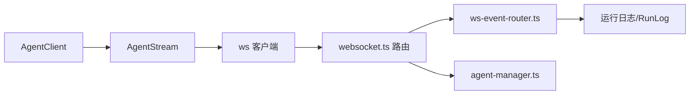

# WebSocket 连接管理

<cite>
**本文引用的文件**   
- [packages/agent-client/src/client.ts](file://packages/agent-client/src/client.ts)
- [packages/agent-client/src/types.ts](file://packages/agent-client/src/types.ts)
- [packages/agent-service/src/routes/websocket.ts](file://packages/agent-service/src/routes/websocket.ts)
- [packages/agent-service/src/routes/ws-event-router.ts](file://packages/agent-service/src/routes/ws-event-router.ts)
- [packages/agent-service/src/core/agent-manager.ts](file://packages/agent-service/src/core/agent-manager.ts)
- [packages/author-site/src/components/ai-elements/chat/services/stream-service.ts](file://packages/author-site/src/components/ai-elements/chat/services/stream-service.ts)
</cite>

## 目录
1. [简介](#简介)
2. [项目结构](#项目结构)
3. [核心组件](#核心组件)
4. [架构总览](#架构总览)
5. [详细组件分析](#详细组件分析)
6. [依赖关系分析](#依赖关系分析)
7. [性能与监控](#性能与监控)
8. [故障诊断与排错](#故障诊断与排错)
9. [最佳实践](#最佳实践)
10. [结论](#结论)

## 简介
本技术文档围绕 WebSocket 连接管理模块，系统性解析连接建立流程（握手、鉴权与会话初始化）、心跳检测机制（间隔、超时与自动重连）、断线重连算法（指数退避、连接池与状态恢复）、多连接管理与负载均衡、以及连接监控、性能指标收集与故障诊断方法。文档同时给出可操作的排错指南与最佳实践建议，帮助读者在生产环境中稳定运行实时流式通信。

## 项目结构
WebSocket 相关代码主要分布在以下位置：
- 客户端 SDK：AgentClient 与 AgentStream，负责发起连接、消息收发、事件分发与基础重连逻辑
- 服务端路由：Fastify + ws 注册 /api/agent/:sessionId/stream 的 WebSocket 端点，处理消息路由、会话生命周期、心跳与健康检查
- 事件路由器：将后端 Agent 事件转发到客户端，并记录运行日志
- 会话与 Agent 管理器：维护 Agent 实例、空闲清理、忙闲状态等
- 前端集成层：在 author-site 中封装连接等待与就绪判断

图表来源
- [packages/agent-client/src/client.ts:200-203](file://packages/agent-client/src/client.ts#L200-L203)
- [packages/agent-service/src/routes/websocket.ts:134-150](file://packages/agent-service/src/routes/websocket.ts#L134-L150)
- [packages/agent-service/src/routes/ws-event-router.ts:113-127](file://packages/agent-service/src/routes/ws-event-router.ts#L113-L127)
- [packages/agent-service/src/core/agent-manager.ts:44-52](file://packages/agent-service/src/core/agent-manager.ts#L44-L52)

章节来源
- [packages/agent-client/src/client.ts:200-203](file://packages/agent-client/src/client.ts#L200-L203)
- [packages/agent-service/src/routes/websocket.ts:134-150](file://packages/agent-service/src/routes/websocket.ts#L134-L150)
- [packages/agent-service/src/routes/ws-event-router.ts:113-127](file://packages/agent-service/src/routes/ws-event-router.ts#L113-L127)
- [packages/agent-service/src/core/agent-manager.ts:44-52](file://packages/agent-service/src/core/agent-manager.ts#L44-L52)

## 核心组件
- AgentStream（客户端）
  - 负责建立 WebSocket 连接、发送消息、接收事件、错误上报、关闭连接与自动重连
  - 提供 on/off 事件订阅接口，支持 ping 探测
- WebSocket 路由与服务端连接管理（服务端）
  - 使用 Fastify 的 noServer 模式挂载 ws 服务
  - 维护 connections Map，记录每个连接的 socket、sessionId、lastPing、事件路由器
  - 定时心跳检测，超时则终止连接并从连接池移除
- WebSocketEventRouter（服务端）
  - 绑定 Agent 事件，按类型转发为统一 ServerMessage 协议
  - 管理当前活跃消息的生命周期（开始、取消、结束），并写入运行日志
- AgentManager（服务端）
  - 管理 Agent 实例的创建、更新、销毁与空闲回收
  - 提供 getOrCreate、sendMessage、cleanupIdleAgents 等能力

章节来源
- [packages/agent-client/src/client.ts:279-408](file://packages/agent-client/src/client.ts#L279-L408)
- [packages/agent-service/src/routes/websocket.ts:69-82](file://packages/agent-service/src/routes/websocket.ts#L69-L82)
- [packages/agent-service/src/routes/ws-event-router.ts:113-195](file://packages/agent-service/src/routes/ws-event-router.ts#L113-L195)
- [packages/agent-service/src/core/agent-manager.ts:44-125](file://packages/agent-service/src/core/agent-manager.ts#L44-L125)

## 架构总览
下图展示了从客户端发起连接到服务端处理消息的全链路交互，包括握手、鉴权与会话初始化、消息处理与事件回推、心跳与超时控制。

图表来源
- [packages/agent-service/src/routes/websocket.ts:134-180](file://packages/agent-service/src/routes/websocket.ts#L134-L180)
- [packages/agent-service/src/routes/websocket.ts:122-132](file://packages/agent-service/src/routes/websocket.ts#L122-L132)
- [packages/agent-service/src/routes/ws-event-router.ts:149-177](file://packages/agent-service/src/routes/ws-event-router.ts#L149-L177)
- [packages/agent-service/src/core/agent-manager.ts:62-125](file://packages/agent-service/src/core/agent-manager.ts#L62-L125)

## 详细组件分析

### 连接建立流程（握手、鉴权与会话初始化）
- 客户端
  - AgentClient.stream 将 baseUrl 转换为 ws/wss 并构造 /api/agent/:sessionId/stream 地址
  - AgentStream 构造函数立即 connect()，内部 new WebSocket(url)，监听 open/message/close/error
  - onopen 时重置重连计数并广播 status=connected
- 服务端
  - registerWebSocketRoutes 注册 noServer 模式的 WebSocketServer，并启动心跳定时器
  - 当 GET /api/agent/:sessionId/stream 升级成功后，生成 connectionId，创建 ActiveConnection 并加入 connections Map
  - 首次收到 message 且 Agent 处于 initializing 时，调用 agent.start()，并同步 SessionStore 元数据（工作目录、快照信息等）
- 鉴权
  - 当前实现未在服务端对 WebSocket 路径做显式鉴权；鉴权通常由前置网关或 HTTP 层完成（例如通过 Cookie/Token 校验后允许升级）
  - 若需要增强，可在路由入口处增加鉴权中间件或在查询参数中校验令牌

图表来源
- [packages/agent-client/src/client.ts:200-203](file://packages/agent-client/src/client.ts#L200-L203)
- [packages/agent-client/src/client.ts:294-300](file://packages/agent-client/src/client.ts#L294-L300)
- [packages/agent-service/src/routes/websocket.ts:134-180](file://packages/agent-service/src/routes/websocket.ts#L134-L180)
- [packages/agent-service/src/routes/websocket.ts:247-283](file://packages/agent-service/src/routes/websocket.ts#L247-L283)

章节来源
- [packages/agent-client/src/client.ts:200-203](file://packages/agent-client/src/client.ts#L200-L203)
- [packages/agent-client/src/client.ts:294-300](file://packages/agent-client/src/client.ts#L294-L300)
- [packages/agent-service/src/routes/websocket.ts:134-180](file://packages/agent-service/src/routes/websocket.ts#L134-L180)
- [packages/agent-service/src/routes/websocket.ts:247-283](file://packages/agent-service/src/routes/websocket.ts#L247-L283)

### 心跳检测机制（间隔、超时与自动重连）
- 服务端心跳
  - 常量 HEARTBEAT_INTERVAL=30s，HEARTBEAT_TIMEOUT=60s
  - 每 30s 遍历 connections，若 now - lastPing > 60s，则 terminate 并删除连接
  - 每次收到消息都会更新 lastPing，从而维持活跃
- 客户端心跳
  - 暴露 ping() 方法，发送 type="ping" 的消息
  - 服务端收到 ping 后回复 type="pong"，可用于客户端侧 RTT 测量与存活判断
- 自动重连
  - 客户端在 onclose 时根据 autoReconnect 与最大重试次数决定是否重连
  - 采用线性递增策略：delay = reconnectDelay * reconnectAttempts（初始 delay=1000ms，最大尝试 5 次）

图表来源
- [packages/agent-service/src/routes/websocket.ts:78-82](file://packages/agent-service/src/routes/websocket.ts#L78-L82)
- [packages/agent-service/src/routes/websocket.ts:122-132](file://packages/agent-service/src/routes/websocket.ts#L122-L132)
- [packages/agent-service/src/routes/websocket.ts:182-183](file://packages/agent-service/src/routes/websocket.ts#L182-L183)
- [packages/agent-service/src/routes/websocket.ts:715-721](file://packages/agent-service/src/routes/websocket.ts#L715-L721)
- [packages/agent-client/src/client.ts:377-386](file://packages/agent-client/src/client.ts#L377-L386)
- [packages/agent-client/src/client.ts:314-327](file://packages/agent-client/src/client.ts#L314-L327)

章节来源
- [packages/agent-service/src/routes/websocket.ts:78-82](file://packages/agent-service/src/routes/websocket.ts#L78-L82)
- [packages/agent-service/src/routes/websocket.ts:122-132](file://packages/agent-service/src/routes/websocket.ts#L122-L132)
- [packages/agent-service/src/routes/websocket.ts:182-183](file://packages/agent-service/src/routes/websocket.ts#L182-L183)
- [packages/agent-service/src/routes/websocket.ts:715-721](file://packages/agent-service/src/routes/websocket.ts#L715-L721)
- [packages/agent-client/src/client.ts:377-386](file://packages/agent-client/src/client.ts#L377-L386)
- [packages/agent-client/src/client.ts:314-327](file://packages/agent-client/src/client.ts#L314-L327)

### 断线重连算法（指数退避、连接池与状态恢复）
- 重连策略
  - 客户端 onclose 触发重连，最多 5 次，延迟按 attempts 线性增长（非严格指数，但具备退避效果）
  - 可通过 close() 设置 autoReconnect=false 停止重连
- 连接池管理
  - 服务端 connections Map 以 connectionId 为键，存储 socket、sessionId、lastPing、eventRouter
  - 心跳超时会主动清理；连接关闭时也会从 Map 中移除
- 状态恢复
  - 服务端在首次 message 时根据 sessionId 获取或创建 Agent，必要时 start() 并同步 SessionStore
  - 支持 resume 消息，通过 options.resumeSessionId 恢复指定会话上下文

图表来源
- [packages/agent-client/src/client.ts:314-327](file://packages/agent-client/src/client.ts#L314-L327)
- [packages/agent-client/src/client.ts:399-403](file://packages/agent-client/src/client.ts#L399-L403)
- [packages/agent-service/src/routes/websocket.ts:122-132](file://packages/agent-service/src/routes/websocket.ts#L122-L132)
- [packages/agent-service/src/routes/websocket.ts:489-556](file://packages/agent-service/src/routes/websocket.ts#L489-L556)

章节来源
- [packages/agent-client/src/client.ts:314-327](file://packages/agent-client/src/client.ts#L314-L327)
- [packages/agent-client/src/client.ts:399-403](file://packages/agent-client/src/client.ts#L399-L403)
- [packages/agent-service/src/routes/websocket.ts:122-132](file://packages/agent-service/src/routes/websocket.ts#L122-L132)
- [packages/agent-service/src/routes/websocket.ts:489-556](file://packages/agent-service/src/routes/websocket.ts#L489-L556)

### 多连接管理与负载均衡机制
- 多连接
  - 服务端 connections Map 支持同一 sessionId 的多连接（connectionId 包含时间戳后缀）
  - broadcastToSession 可按 sessionId 向所有打开的连接广播消息
- 负载均衡
  - 当前实现未内置基于负载的连接选择策略；多连接主要用于容灾与并发场景
  - 如需水平扩展，可在网关层按 sessionId 哈希或一致性哈希分发到不同进程/节点，并在应用层共享会话状态（如持久化 SessionStore）

章节来源
- [packages/agent-service/src/routes/websocket.ts:156-180](file://packages/agent-service/src/routes/websocket.ts#L156-L180)
- [packages/agent-service/src/routes/websocket.ts:863-875](file://packages/agent-service/src/routes/websocket.ts#L863-L875)

### 事件路由与消息协议
- 事件路由器
  - WebSocketEventRouter 绑定 BaseAgent 的事件，将其映射为统一的 ServerMessage 协议，并通过 sendMessage 推送给客户端
  - 支持 stream、thought、tool_call、tool_call_update、plan、error、status、permission_request、user_choice_request、models 等类型
- 消息协议
  - 客户端发送 message/cancel/ping/resume/set_model/get_models/permission_response/user_choice_response/console_data 等
  - 服务端返回对应的 stream/thought/tool_call/tool_call_update/plan/error/finish/status/pong/models 等

图表来源
- [packages/agent-service/src/routes/ws-event-router.ts:113-195](file://packages/agent-service/src/routes/ws-event-router.ts#L113-L195)
- [packages/agent-service/src/routes/ws-event-router.ts:22-104](file://packages/agent-service/src/routes/ws-event-router.ts#L22-L104)

章节来源
- [packages/agent-service/src/routes/ws-event-router.ts:113-195](file://packages/agent-service/src/routes/ws-event-router.ts#L113-L195)
- [packages/agent-service/src/routes/ws-event-router.ts:22-104](file://packages/agent-service/src/routes/ws-event-router.ts#L22-L104)

### 前端集成与连接就绪等待
- author-site 中的 StreamService 封装了连接等待逻辑，通过监听 status 事件与检查底层 ws.readyState 确保连接真正可用后再继续业务逻辑
- 提供超时保护，避免长时间阻塞

章节来源
- [packages/author-site/src/components/ai-elements/chat/services/stream-service.ts:185-228](file://packages/author-site/src/components/ai-elements/chat/services/stream-service.ts#L185-L228)

## 依赖关系分析
- 客户端依赖
  - AgentClient 仅负责 REST 与 WebSocket 地址转换，AgentStream 独立管理连接与事件
- 服务端依赖
  - websocket.ts 依赖 ws、Fastify、AgentManager、WebSocketEventRouter、SessionStore、WorkspaceManager、SnapshotService 等
  - ws-event-router.ts 依赖 BaseAgent 事件与运行日志系统
  - agent-manager.ts 依赖 AgentFactory、BackendAgent、超时配置与日志

图表来源
- [packages/agent-client/src/client.ts:200-203](file://packages/agent-client/src/client.ts#L200-L203)
- [packages/agent-service/src/routes/websocket.ts:134-180](file://packages/agent-service/src/routes/websocket.ts#L134-L180)
- [packages/agent-service/src/routes/ws-event-router.ts:113-127](file://packages/agent-service/src/routes/ws-event-router.ts#L113-L127)
- [packages/agent-service/src/core/agent-manager.ts:44-52](file://packages/agent-service/src/core/agent-manager.ts#L44-L52)

章节来源
- [packages/agent-client/src/client.ts:200-203](file://packages/agent-client/src/client.ts#L200-L203)
- [packages/agent-service/src/routes/websocket.ts:134-180](file://packages/agent-service/src/routes/websocket.ts#L134-L180)
- [packages/agent-service/src/routes/ws-event-router.ts:113-127](file://packages/agent-service/src/routes/ws-event-router.ts#L113-L127)
- [packages/agent-service/src/core/agent-manager.ts:44-52](file://packages/agent-service/src/core/agent-manager.ts#L44-L52)

## 性能与监控
- 进度心跳
  - 服务端在处理长耗时任务时，周期性发送 status=processing 以保持前端感知
- 指标采集
  - 作者站点存在性能采样器，包含 reconnectConvergence 等指标，可用于评估重连收敛表现
- 健康检查
  - 客户端 health() 可拉取服务端健康信息（uptime、agents 数量等）

章节来源
- [packages/agent-service/src/routes/websocket.ts:359-371](file://packages/agent-service/src/routes/websocket.ts#L359-L371)
- [packages/author-site/src/lib/workspace-performance-sampling.ts:226-229](file://packages/author-site/src/lib/workspace-performance-sampling.ts#L226-L229)
- [packages/agent-client/src/client.ts:180-194](file://packages/agent-client/src/client.ts#L180-L194)

## 故障诊断与排错
- 常见问题
  - 连接频繁断开：检查服务端心跳超时阈值与网络质量；确认客户端是否在合理间隔内发送 ping
  - 重连风暴：客户端默认最大 5 次，建议在上层引入抖动与上限；必要时接入指数退避与随机抖动
  - 鉴权失败：当前 WebSocket 路由未内置鉴权，需在前置网关或 HTTP 层完成认证
  - 消息丢失：确保客户端在 onopen 后才发送业务消息；使用 id 字段进行请求-响应匹配
- 定位手段
  - 查看服务端日志：连接建立、消息处理、超时与错误均会记录
  - 观察连接池大小：connections Map 的大小可反映在线连接数
  - 使用 health 接口：获取 agents 数量与 uptime，辅助判断服务健康度

章节来源
- [packages/agent-service/src/routes/websocket.ts:158-161](file://packages/agent-service/src/routes/websocket.ts#L158-L161)
- [packages/agent-service/src/routes/websocket.ts:122-132](file://packages/agent-service/src/routes/websocket.ts#L122-L132)
- [packages/agent-client/src/client.ts:329-337](file://packages/agent-client/src/client.ts#L329-L337)
- [packages/agent-client/src/client.ts:180-194](file://packages/agent-client/src/client.ts#L180-L194)

## 最佳实践
- 连接管理
  - 在 onopen 后再发送业务消息；使用唯一 id 关联请求与响应
  - 定期发送 ping，结合 pong 计算 RTT，作为连接质量指标
- 重连策略
  - 引入随机抖动与上限，避免雪崩；在业务层记录重连次数与成功率
  - 对于关键会话，优先使用 resume 恢复上下文
- 鉴权与安全
  - 在网关层强制鉴权，禁止匿名升级 WebSocket
  - 限制单会话并发连接数，防止资源滥用
- 可扩展性
  - 在多进程部署下，使用外部存储（如 Redis）共享连接与状态，配合一致性哈希路由
  - 对长任务设置显式超时，避免占用过多资源

[本节为通用指导，不直接分析具体文件]

## 结论
该 WebSocket 连接管理模块实现了稳定的连接建立、心跳保活与基础重连机制，并通过事件路由器将后端 Agent 事件高效转发至客户端。服务端通过连接池与心跳超时保障资源可控，客户端通过简单而有效的重连策略提升可用性。生产环境建议在前置网关层补充鉴权与限流，并结合上层监控与告警完善整体可靠性。