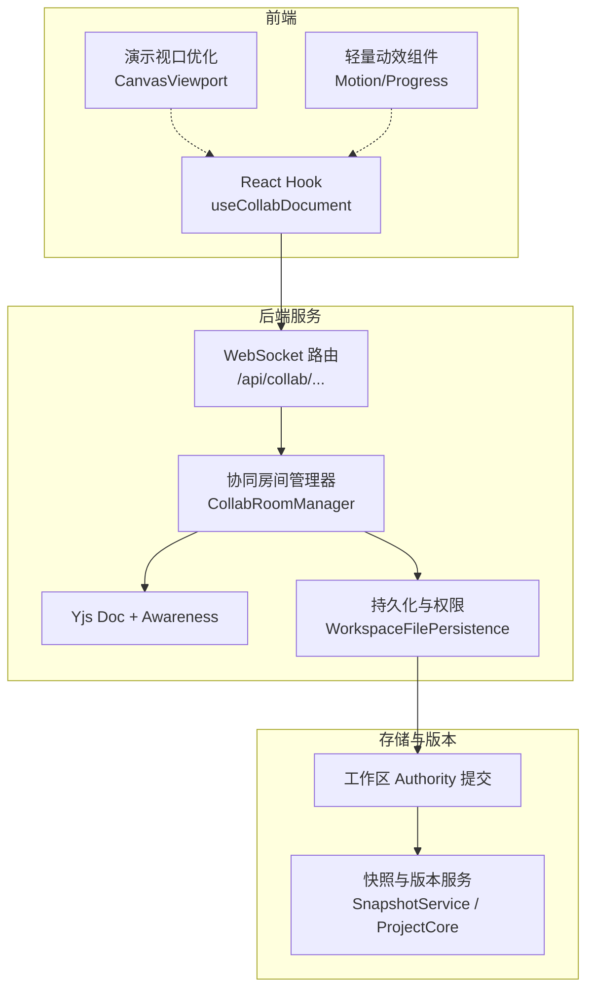
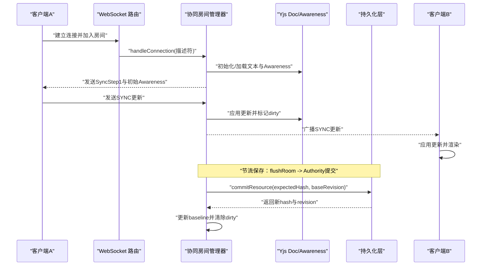
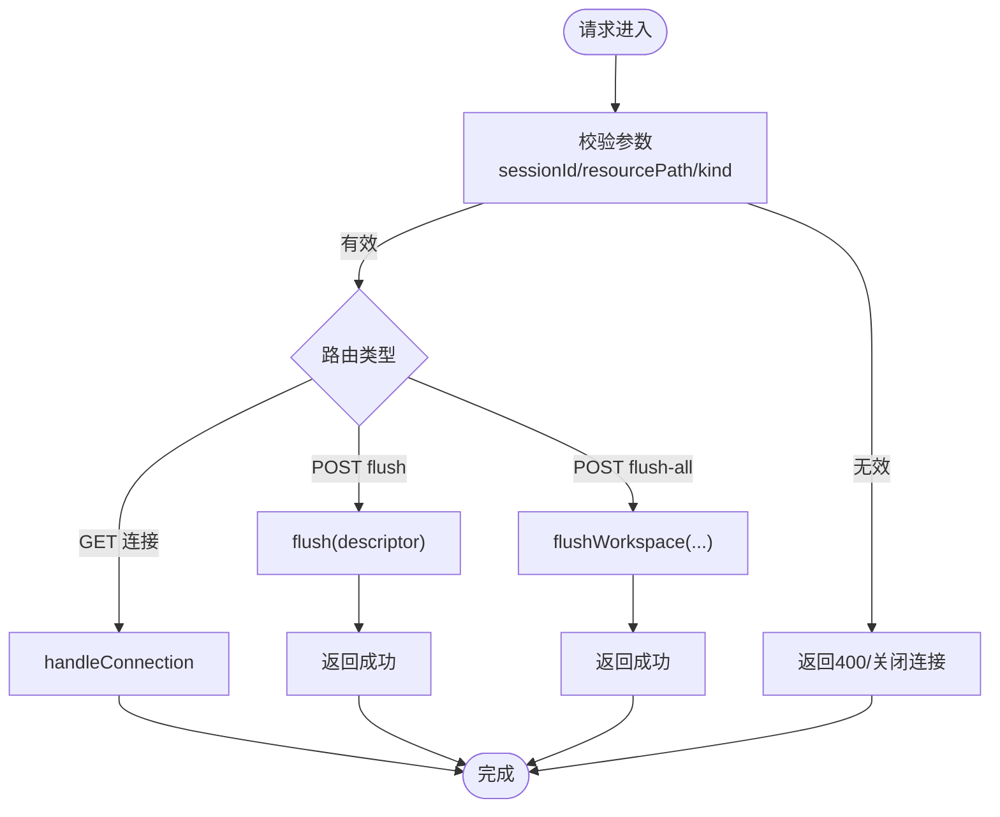
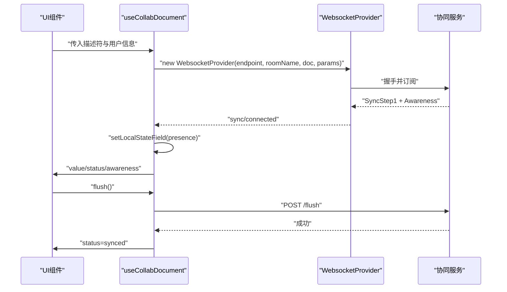
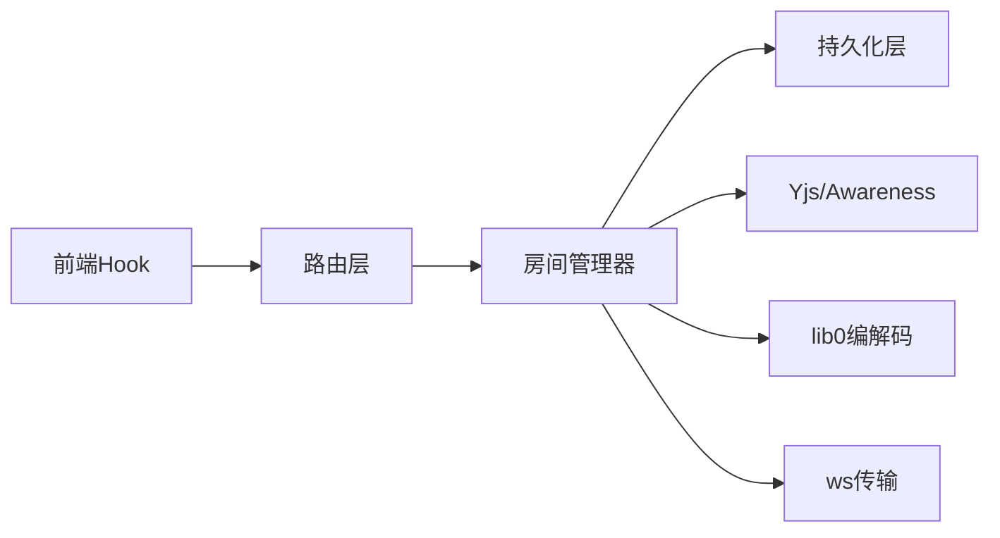

# 光标与状态同步

<cite>
**本文引用的文件**
- [collab-room-manager.ts](file://packages/agent-service/src/collab/collab-room-manager.ts)
- [collab.ts](file://packages/agent-service/src/routes/collab.ts)
- [workspace-file-persistence.ts](file://packages/agent-service/src/collab/workspace-file-persistence.ts)
- [useCollabDocument.ts](file://packages/author-site/src/hooks/useCollabDocument.ts)
- [collab-room-manager.test.ts](file://packages/agent-service/tests/unit/collab-room-manager.test.ts)
- [CanvasViewport.tsx](file://packages/demo-ui/src/CanvasViewport.tsx)
- [preview-dependency-policy.ts](file://packages/author-site/src/lib/preview-dependency-policy.ts)
- [snapshot-service.ts](file://packages/agent-service/src/session/snapshot-service.ts)
- [service.ts](file://packages/project-core/src/service.ts)
</cite>

## 目录
1. [简介](#简介)
2. [项目结构](#项目结构)
3. [核心组件](#核心组件)
4. [架构总览](#架构总览)
5. [详细组件分析](#详细组件分析)
6. [依赖关系分析](#依赖关系分析)
7. [性能考虑](#性能考虑)
8. [故障排查指南](#故障排查指南)
9. [结论](#结论)
10. [附录](#附录)

## 简介
本技术文档聚焦于“光标与状态同步”能力，覆盖多用户协同编辑中的以下关键主题：
- 多用户光标显示机制：位置计算、颜色分配、用户标识管理
- 实时状态同步：选择状态、编辑焦点、视图状态的广播机制
- 光标动画与过渡效果：平滑移动、延迟补偿、视觉反馈
- 用户权限控制：编辑权限、查看模式、协作规则
- 状态快照与回滚：工作区快照、版本化与恢复
- 用户体验优化与性能调优参数

该功能基于 Yjs/Y-Protocols 的 CRDT 文本同步与 Awareness 在线状态协议，结合服务端房间管理与持久化层（Authority），在前端通过 React Hook 封装连接、状态与持久化流程。

## 项目结构
围绕协同与光标状态的核心代码分布在服务端的房间管理器、路由与持久化层，以及前端的协同文档 Hook 中。下图展示了端到端的关键路径与模块职责。



图示来源
- [collab.ts:69-142](file://packages/agent-service/src/routes/collab.ts#L69-L142)
- [collab-room-manager.ts:55-118](file://packages/agent-service/src/collab/collab-room-manager.ts#L55-L118)
- [useCollabDocument.ts:93-186](file://packages/author-site/src/hooks/useCollabDocument.ts#L93-L186)
- [CanvasViewport.tsx:92-119](file://packages/demo-ui/src/CanvasViewport.tsx#L92-L119)
- [preview-dependency-policy.ts:360-378](file://packages/author-site/src/lib/preview-dependency-policy.ts#L360-L378)

章节来源
- [collab.ts:69-142](file://packages/agent-service/src/routes/collab.ts#L69-L142)
- [collab-room-manager.ts:55-118](file://packages/agent-service/src/collab/collab-room-manager.ts#L55-L118)
- [useCollabDocument.ts:93-186](file://packages/author-site/src/hooks/useCollabDocument.ts#L93-L186)

## 核心组件
- 协同房间管理器（CollabRoomManager）
  - 负责房间生命周期、Yjs 文档与 Awareness 广播、消息分发、保存节流与空闲清理、冲突检测与回滚刷新。
- WebSocket 路由（/api/collab）
  - 暴露连接、单资源 flush、全工作区 flush 接口；对权限与冲突进行错误码映射。
- 前端协同 Hook（useCollabDocument）
  - 建立 WebsocketProvider、维护本地 Y.Doc/Y.Text、设置 Awareness presence、监听状态变化、调用 flush。
- 持久化与权限（WorkspaceFilePersistence）
  - 提供 Authority 提交、快照读取、事件拉取、会话校验等能力。
- 演示与动效
  - CanvasViewport 使用 requestAnimationFrame 合并更新，减少重排；Motion/Progress 提供统一过渡与进度展示。

章节来源
- [collab-room-manager.ts:55-118](file://packages/agent-service/src/collab/collab-room-manager.ts#L55-L118)
- [collab.ts:69-142](file://packages/agent-service/src/routes/collab.ts#L69-L142)
- [useCollabDocument.ts:93-186](file://packages/author-site/src/hooks/useCollabDocument.ts#L93-L186)
- [workspace-file-persistence.ts:164-224](file://packages/agent-service/src/collab/workspace-file-persistence.ts#L164-L224)
- [CanvasViewport.tsx:92-119](file://packages/demo-ui/src/CanvasViewport.tsx#L92-L119)
- [preview-dependency-policy.ts:360-378](file://packages/author-site/src/lib/preview-dependency-policy.ts#L360-L378)

## 架构总览
下图给出一次完整的“客户端写入 → 服务器广播 → 其他客户端渲染”的时序。



图示来源
- [collab.ts:69-142](file://packages/agent-service/src/routes/collab.ts#L69-L142)
- [collab-room-manager.ts:237-318](file://packages/agent-service/src/collab/collab-room-manager.ts#L237-L318)
- [collab-room-manager.ts:369-422](file://packages/agent-service/src/collab/collab-room-manager.ts#L369-L422)
- [workspace-file-persistence.ts:164-194](file://packages/agent-service/src/collab/workspace-file-persistence.ts#L164-L194)

## 详细组件分析

### 协同房间管理器（CollabRoomManager）
- 房间创建与初始化
  - 根据描述符（project/workspace/session/resource/kind）定位或创建房间，加载当前资源内容到 Y.Text，并初始化 Awareness。
- 消息处理
  - 支持 SYNC、AWAWARENESS、QUERY_AWARENESS 三类消息；对 Awareness 变更记录受控 clientIds，避免重复移除。
- 广播机制
  - 对非 origin 的连接广播更新；连接断开时清理其控制的 awareness 状态。
- 保存与冲突处理
  - 基于 saveDebounceMs 节流保存；在 flushRoom 中对比 baselineHash 与期望 hash，若不一致抛出冲突错误并拒绝提交。
- 空闲清理
  - 定期清理无连接且超过 TTL 的房间，销毁 Y.Doc 与 Awareness。

```mermaid
classDiagram
class CollabRoomManager {
-rooms Map
-persistence WorkspaceFilePersistence
-saveDebounceMs number
-roomIdleTtlMs number
-maxConnectionsPerWorkspace number
+startCleanup() void
+handleConnection(socket, descriptor) Promise~void~
+flush(descriptor) Promise~{flushed : boolean}~
+flushWorkspace(projectId, workspaceId, sessionId) Promise~{flushedRooms : number,status : string,revision : number}~
-getOrCreateRoom(descriptor, workspacePath) Promise~CollabRoom~
-handleMessage(room, connection, message) void
-removeConnection(room, connection) void
-scheduleSave(room) void
-flushRoom(room) Promise~void~
-reloadRoomFromFileState(room, state, revision) void
-replaceRoomText(room, content) void
-cleanupIdleRooms() Promise~void~
-sendSyncStep1(socket, doc) void
-sendAwareness(socket, awareness, clients) void
-broadcast(room, message, origin) void
-send(socket, message) void
}
class CollabRoom {
+key string
+workspaceKey string
+workspacePath string
+descriptor RoomDescriptor
+doc Y.Doc
+text Y.Text
+awareness Awareness
+connections Set
+saveTimer Timeout?
+lastActiveAt number
+dirty boolean
+saving boolean
+baselineHash string
+baselineRevision number
}
CollabRoomManager --> CollabRoom : "管理多个"
```

图示来源
- [collab-room-manager.ts:55-118](file://packages/agent-service/src/collab/collab-room-manager.ts#L55-L118)
- [collab-room-manager.ts:237-318](file://packages/agent-service/src/collab/collab-room-manager.ts#L237-L318)
- [collab-room-manager.ts:369-422](file://packages/agent-service/src/collab/collab-room-manager.ts#L369-L422)
- [collab-room-manager.ts:452-493](file://packages/agent-service/src/collab/collab-room-manager.ts#L452-L493)

章节来源
- [collab-room-manager.ts:237-318](file://packages/agent-service/src/collab/collab-room-manager.ts#L237-L318)
- [collab-room-manager.ts:369-422](file://packages/agent-service/src/collab/collab-room-manager.ts#L369-L422)
- [collab-room-manager.ts:452-493](file://packages/agent-service/src/collab/collab-room-manager.ts#L452-L493)

### WebSocket 路由（/api/collab）
- 连接路由
  - GET /api/collab/projects/:projectId/workspaces/:workspaceId/:room，要求查询参数包含 sessionId、resourcePath、kind，并进行类型校验。
- Flush 接口
  - POST /flush：按资源维度落盘；POST /flush-all：按工作区维度批量落盘，返回已刷新的房间数与工作区 revision。
- 错误映射
  - 将 Authority 冲突错误映射为 409，权限错误映射为 403，其它错误返回通用失败响应。



图示来源
- [collab.ts:69-142](file://packages/agent-service/src/routes/collab.ts#L69-L142)

章节来源
- [collab.ts:69-142](file://packages/agent-service/src/routes/collab.ts#L69-L142)

### 前端协同 Hook（useCollabDocument）
- 连接与文档
  - 基于 WebsocketProvider 建立连接，构造 Y.Doc/Y.Text，并将文本内容绑定到本地状态。
- 用户标识与颜色
  - 使用 pickColor 从 userId 派生稳定颜色；presence 中包含 userId、username、color、activePageId、resourcePath、lastActiveAt。
- 状态与离线处理
  - 监听 provider.status/sync/connection-error，维护 offline/connecting/synced/error 状态；断连后延时降级为 offline。
- 感知列表去抖
  - 对 awareness 列表进行签名比较，避免不必要的重渲染。
- 手动落盘
  - flush 调用 HTTP flush 接口，成功后置为 synced。



图示来源
- [useCollabDocument.ts:93-186](file://packages/author-site/src/hooks/useCollabDocument.ts#L93-L186)
- [useCollabDocument.ts:282-303](file://packages/author-site/src/hooks/useCollabDocument.ts#L282-L303)

章节来源
- [useCollabDocument.ts:93-186](file://packages/author-site/src/hooks/useCollabDocument.ts#L93-L186)
- [useCollabDocument.ts:282-303](file://packages/author-site/src/hooks/useCollabDocument.ts#L282-L303)

### 持久化与权限（WorkspaceFilePersistence）
- 提交资源
  - commitResource 以 expectedHash/baseRevision 做乐观锁提交，返回新 hash 与 revision。
- 快照与事件
  - getAuthoritySnapshot/getAuthorityEvents 用于读取权威快照与增量事件。
- 会话校验
  - validateWorkspaceSession 确保仅允许合法会话访问。

章节来源
- [workspace-file-persistence.ts:164-224](file://packages/agent-service/src/collab/workspace-file-persistence.ts#L164-L224)

### 单元测试要点（Awareness 广播）
- 测试验证了客户端 A 的文本更新能正确广播给客户端 B，且真实 Awareness 消息能广播在线状态并在断连后移除。

章节来源
- [collab-room-manager.test.ts:134-215](file://packages/agent-service/tests/unit/collab-room-manager.test.ts#L134-L215)
- [collab-room-manager.test.ts:217-252](file://packages/agent-service/tests/unit/collab-room-manager.test.ts#L217-L252)

## 依赖关系分析
- 耦合关系
  - 路由层依赖房间管理器；房间管理器依赖持久化层；前端 Hook 依赖 WebsocketProvider 与服务端路由。
- 外部依赖
  - Yjs/Y-Protocols 提供 CRDT 与 Awareness 协议；lib0 编解码；ws 传输。
- 潜在循环
  - 当前实现未见循环依赖；房间管理器通过事件回调触发持久化，单向依赖清晰。



图示来源
- [collab.ts:69-142](file://packages/agent-service/src/routes/collab.ts#L69-L142)
- [collab-room-manager.ts:1-22](file://packages/agent-service/src/collab/collab-room-manager.ts#L1-L22)
- [useCollabDocument.ts:1-12](file://packages/author-site/src/hooks/useCollabDocument.ts#L1-L12)

章节来源
- [collab.ts:69-142](file://packages/agent-service/src/routes/collab.ts#L69-L142)
- [collab-room-manager.ts:1-22](file://packages/agent-service/src/collab/collab-room-manager.ts#L1-L22)
- [useCollabDocument.ts:1-12](file://packages/author-site/src/hooks/useCollabDocument.ts#L1-L12)

## 性能考虑
- 保存节流
  - 通过环境变量 COLLAB_SAVE_DEBOUNCE_MS 控制保存间隔，降低频繁落盘开销。
- 空闲清理
  - 通过 COLLAB_ROOM_IDLE_TTL_MS 控制房间闲置回收周期，避免内存泄漏。
- 并发限制
  - 通过 COLLAB_MAX_CONNECTIONS_PER_WORKSPACE 限制同一工作区的连接数，防止过载。
- 前端渲染优化
  - CanvasViewport 使用 requestAnimationFrame 合并更新，减少抖动与重绘。
- 动效与过渡
  - Motion/Progress 提供统一的 CSS transition 与 delay，提升交互流畅度。

章节来源
- [collab-room-manager.ts:64-73](file://packages/agent-service/src/collab/collab-room-manager.ts#L64-L73)
- [collab-room-manager.ts:106-113](file://packages/agent-service/src/collab/collab-room-manager.ts#L106-L113)
- [CanvasViewport.tsx:92-119](file://packages/demo-ui/src/CanvasViewport.tsx#L92-L119)
- [preview-dependency-policy.ts:360-378](file://packages/author-site/src/lib/preview-dependency-policy.ts#L360-L378)

## 故障排查指南
- 连接失败
  - 检查 NEXT_PUBLIC_AGENT_SERVICE_URL/NEXT_PUBLIC_COLLAB_WS_URL 配置是否正确；确认路由是否启用。
- 连接不稳定
  - 关注 OFFLINE_STATUS_DELAY_MS 超时逻辑；观察 status 在 connecting/offline 间切换的原因。
- 落盘冲突
  - 当 baselineHash 与期望不一致时，会抛出 WORKSPACE_RESOURCE_CONFLICT；需刷新房间或等待远端变更合并。
- 权限错误
  - 非法会话或缺少权限会返回 403；请校验 sessionId 与 workspace 访问策略。
- 房间未释放
  - 长时间无活动可能导致房间占用；检查 COLLAB_ROOM_IDLE_TTL_MS 与清理定时器是否正常启动。

章节来源
- [useCollabDocument.ts:228-270](file://packages/author-site/src/hooks/useCollabDocument.ts#L228-L270)
- [collab-room-manager.ts:369-422](file://packages/agent-service/src/collab/collab-room-manager.ts#L369-L422)
- [collab.ts:52-67](file://packages/agent-service/src/routes/collab.ts#L52-L67)

## 结论
本方案以 Yjs 为核心，结合 Awareness 实现多用户光标与在线状态同步；通过房间管理器集中处理消息、保存与冲突；前端 Hook 简化接入并提供稳定的状态与落盘能力。配合合理的节流、清理与限流参数，可在保证一致性的同时获得良好的性能与体验。

## 附录

### 多用户光标显示机制
- 光标位置计算
  - 基于 Y.Text 的偏移量与字符边界，结合编辑器行号/列号映射，可计算光标在可视区域的坐标。
- 颜色分配
  - 使用 pickColor(userId) 生成稳定颜色，确保同一用户在不同页面/会话中保持一致。
- 用户标识管理
  - presence 字段包含 userId、username、color、activePageId、resourcePath、lastActiveAt；服务端 Awareness 自动广播与清理。

章节来源
- [useCollabDocument.ts:140-147](file://packages/author-site/src/hooks/useCollabDocument.ts#L140-L147)
- [useCollabDocument.ts:192-224](file://packages/author-site/src/hooks/useCollabDocument.ts#L192-L224)
- [collab-room-manager.ts:297-314](file://packages/agent-service/src/collab/collab-room-manager.ts#L297-L314)

### 实时状态同步（选择、焦点、视图）
- 选择状态
  - 可通过 Awareness 的 presence.activePageId 与 resourcePath 反映当前编辑页与资源。
- 编辑焦点
  - 在 text.observe 中更新 lastActiveAt，体现最近活跃时间。
- 视图状态
  - 结合 CanvasViewport 的 willChangeTransform 与 requestAnimationFrame 合并更新，减少布局抖动。

章节来源
- [useCollabDocument.ts:213-224](file://packages/author-site/src/hooks/useCollabDocument.ts#L213-L224)
- [CanvasViewport.tsx:92-119](file://packages/demo-ui/src/CanvasViewport.tsx#L92-L119)

### 光标动画与过渡效果
- 平滑移动
  - 使用 CSS transition 与 transform 提升移动流畅性；CanvasViewport 使用 RAF 合并更新。
- 延迟补偿
  - 前端可根据网络状态调整动画时长；服务端保存节流间接影响可见更新频率。
- 视觉反馈
  - Progress/Motion 组件提供一致的过渡与延迟，增强用户感知。

章节来源
- [CanvasViewport.tsx:92-119](file://packages/demo-ui/src/CanvasViewport.tsx#L92-L119)
- [preview-dependency-policy.ts:360-378](file://packages/author-site/src/lib/preview-dependency-policy.ts#L360-L378)

### 用户权限控制
- 编辑权限
  - 通过 validateWorkspaceSession 校验会话；非法会话直接拒绝连接或 flush。
- 查看模式
  - 只读场景可仅订阅 Awareness 而不写入文本；或使用只读资源 kind。
- 协作规则
  - 基于 Authority 的乐观锁提交，避免覆盖远端修改；冲突时提示刷新或合并。

章节来源
- [workspace-file-persistence.ts:196-206](file://packages/agent-service/src/collab/workspace-file-persistence.ts#L196-L206)
- [collab-room-manager.ts:369-422](file://packages/agent-service/src/collab/collab-room-manager.ts#L369-L422)

### 状态快照与回滚
- 快照服务
  - SnapshotService 支持按工作区目录创建/丢弃/重置文件，便于实验性编辑的回滚。
- 版本化
  - ProjectCore 创建命名版本快照，记录 workspaceId/revision/rootHash，支持后续恢复。

章节来源
- [snapshot-service.ts:302-341](file://packages/agent-service/src/session/snapshot-service.ts#L302-L341)
- [service.ts:5673-5712](file://packages/project-core/src/service.ts#L5673-L5712)