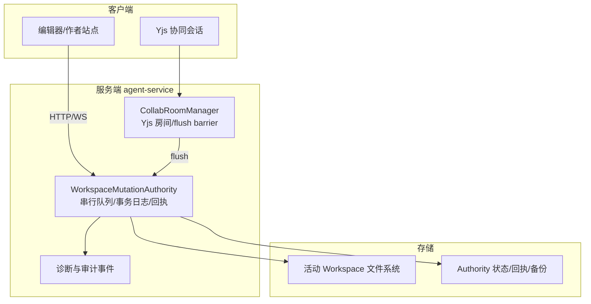
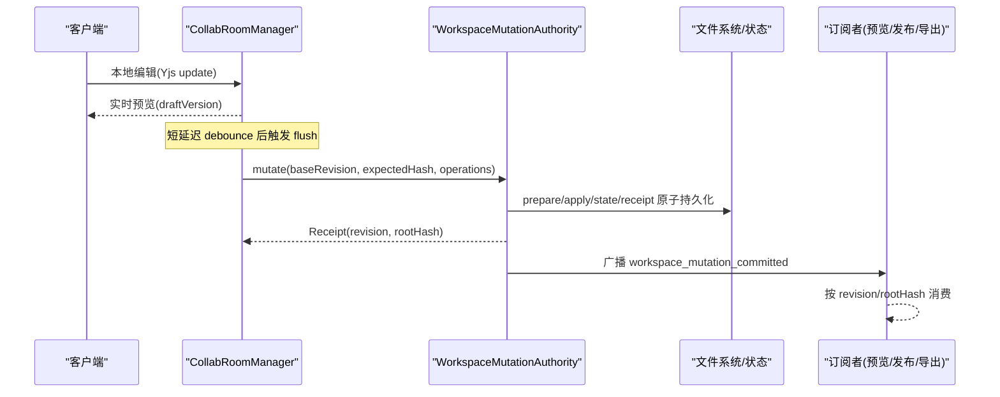
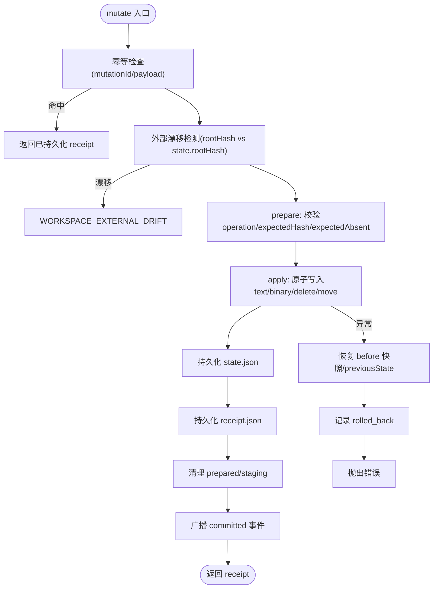
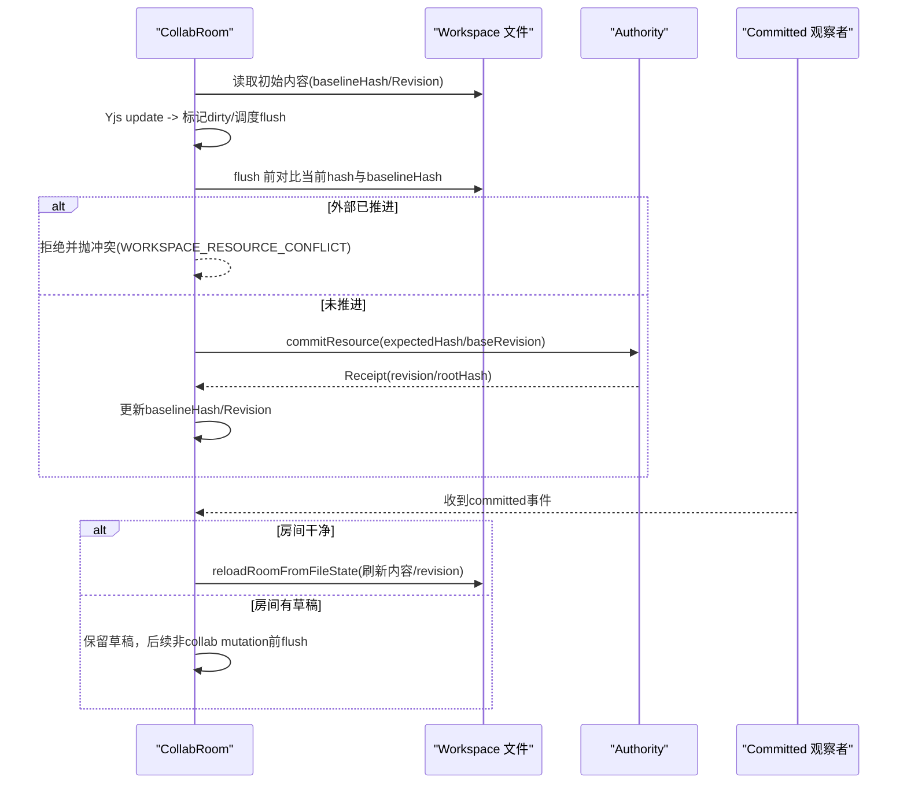
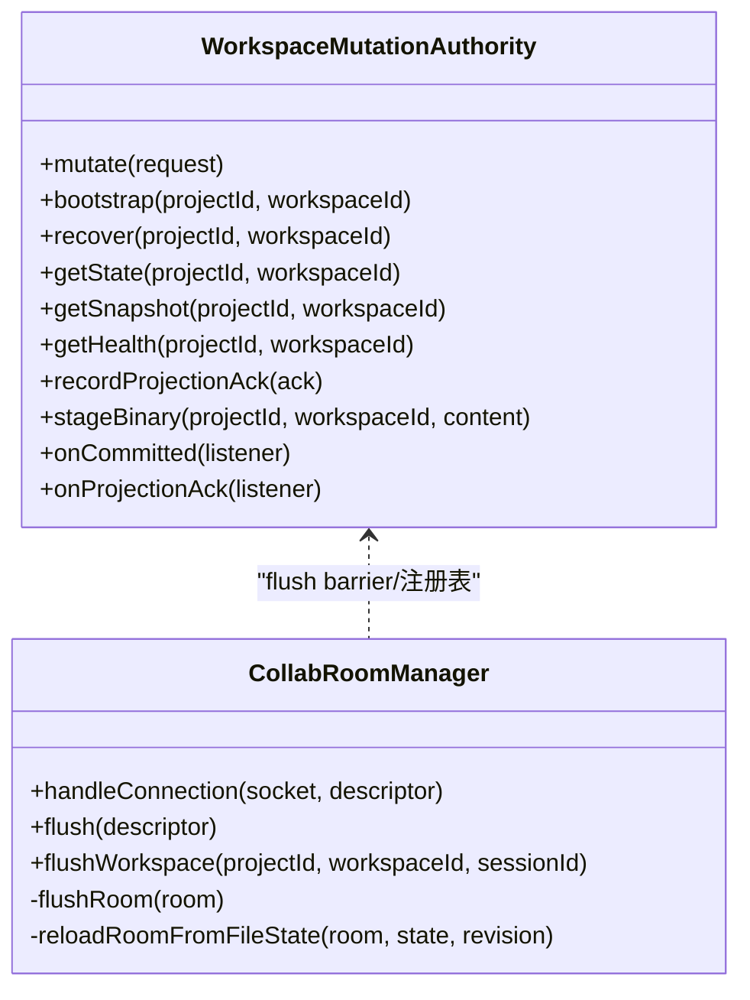

# 冲突解决机制

<cite>
**本文引用的文件**   
- [packages/agent-service/src/workspace/workspace-mutation-authority.ts](file://packages/agent-service/src/workspace/workspace-mutation-authority.ts)
- [packages/agent-service/src/collab/collab-room-manager.ts](file://packages/agent-service/src/collab/collab-room-manager.ts)
- [docs/plans/已完成/创作端Workspace写入一致性-单写者事务改造方案.md](file://docs/plans/已完成/创作端Workspace写入一致性-单写者事务改造方案.md)
- [docs/项目文档/创作端/03-项目管理/技术/11_实时保存与协同编辑.md](file://docs/项目文档/创作端/03-项目管理/技术/11_实时保存与协同编辑.md)
- [packages/agent-service/tests/unit/workspace-mutation-authority.test.ts](file://packages/agent-service/tests/unit/workspace-mutation-authority.test.ts)
- [scripts/check-workspace-authority-guards.mjs](file://scripts/check-workspace-authority-guards.mjs)
</cite>

## 目录
1. [引言](#引言)
2. [项目结构](#项目结构)
3. [核心组件](#核心组件)
4. [架构总览](#架构总览)
5. [详细组件分析](#详细组件分析)
6. [依赖关系分析](#依赖关系分析)
7. [性能考量](#性能考量)
8. [故障排查指南](#故障排查指南)
9. [结论](#结论)
10. [附录](#附录)

## 引言
本文件围绕“冲突解决机制”展开，聚焦于工作区（Workspace）的并发写入、冲突检测与合并策略。系统采用“单写者权威 + 资源级哈希校验”的设计，结合 Yjs 提供的 CRDT 能力用于在线协作草稿的即时同步；在落盘持久化阶段通过 WorkspaceMutationAuthority 进行串行提交、幂等回执与外部漂移防护，从而保证最终一致性与可审计性。本文同时给出操作合并策略、因果一致性边界、冲突检测算法、用户友好的差异展示与修复建议、预防策略与协作规则配置，以及测试方法与性能评估标准。

## 项目结构
- 单写者权威层：负责每活工作区的串行提交、状态与回执持久化、启动恢复、健康诊断与投影确认。
- 协同层：基于 Yjs 提供在线文本的 CRDT 协作，热路径不等待持久化，仅在 flush 时进入 Authority 提交。
- 业务层：author-site、CLI、Agent 工具等通过 Authority HTTP Client 或进程内客户端发起 mutation。
- 诊断与门禁：统一事件 spool、性能指标输出与静态门禁，保障实现与契约一致。

图表来源
- [packages/agent-service/src/workspace/workspace-mutation-authority.ts:112-180](file://packages/agent-service/src/workspace/workspace-mutation-authority.ts#L112-L180)
- [packages/agent-service/src/collab/collab-room-manager.ts:55-104](file://packages/agent-service/src/collab/collab-room-manager.ts#L55-L104)

章节来源
- [docs/plans/已完成/创作端Workspace写入一致性-单写者事务改造方案.md:11-55](file://docs/plans/已完成/创作端Workspace写入一致性-单写者事务改造方案.md#L11-L55)

## 核心组件
- WorkspaceMutationAuthority
  - 职责：单写者协调器、串行队列、prepare/apply/rollback、receipt 幂等、external drift 检测、reconcile adopt/restore、health/status、projection ack、二进制 staging。
  - 关键不变量：提交后才广播事件；旧 revision 对无关资源安全 rebase；外部漂移 fail-closed；幂等重复 mutationId 返回同一 receipt。
- CollabRoomManager
  - 职责：Yjs 房间管理、实时更新广播、短延迟 flush、与 Authority 的 baseline hash/revision 对齐、冲突拒绝与回读刷新。
- 诊断与门禁
  - 职责：统一生命周期事件、性能分位值统计、静态门禁检查确保 live 写入全部经 Authority。

章节来源
- [packages/agent-service/src/workspace/workspace-mutation-authority.ts:112-180](file://packages/agent-service/src/workspace/workspace-mutation-authority.ts#L112-L180)
- [packages/agent-service/src/collab/collab-room-manager.ts:55-104](file://packages/agent-service/src/collab/collab-room-manager.ts#L55-L104)
- [scripts/check-workspace-authority-guards.mjs:1030-1061](file://scripts/check-workspace-authority-guards.mjs#L1030-L1061)

## 架构总览
整体设计将“在线协作”和“持久化提交”解耦：
- 在线协作使用 Yjs CRDT，保证多客户端即时一致，无需等待磁盘写入。
- 持久化提交由 Authority 串行执行，以 baseRevision 与 expectedHash 做资源级冲突检测，避免覆盖他人变更。
- 提交成功后广播 committed 事件，下游消费方（协同基线、预览、发布、导出）按 revision/rootHash 消费，形成最终一致。

图表来源
- [packages/agent-service/src/collab/collab-room-manager.ts:369-422](file://packages/agent-service/src/collab/collab-room-manager.ts#L369-L422)
- [packages/agent-service/src/workspace/workspace-mutation-authority.ts:468-598](file://packages/agent-service/src/workspace/workspace-mutation-authority.ts#L468-L598)

## 详细组件分析

### 组件A：WorkspaceMutationAuthority（单写者权威）
- 数据结构
  - 状态：workspaceId、projectId、revision、rootHash、resourceHashes、mutationPayloads、updatedAt。
  - 快照：state + resources（文本内容快照，二进制通过 stagingId/hash 引用）。
  - 健康：ready、externalDrift、queueDepth、activeLease、preparedCount、conflictCount、eventSubscriberCount、stagingCount、backupCount、missingBackupCount、receiptCount、journalEntries、projectionAckEntries。
- 处理流程
  - 幂等：重复 mutationId 且 payload 相同直接返回已持久化的 receipt；payload 不同则拒绝。
  - 外部漂移：当前 rootHash 与 state.rootHash 不一致即拒绝并记录 external drift。
  - 准备阶段：读取 before 快照、校验 operation 类型与受管资源、expectedHash/expectedAbsent 约束。
  - 应用阶段：原子写入 text/binary/delete/move，计算新 resourceHashes 与 rootHash。
  - 持久化顺序：先 state，再 receipt，最后清理 prepared/staging，随后广播 committed 事件。
  - 异常回滚：apply 失败时恢复 before 快照、回写 previousState、记录 rolled_back。
  - 冲突计数：特定错误码（资源冲突、ID 重用、外部漂移）计入 journal 并暴露 health.conflictCount。
- 并发与串行
  - 全局 Map 维护每个 workspaceId 的 Promise 链，跨实例共享 DATA_DIR 时仍串行。
  - 旧 revision 仅当目标资源未变化时可安全 rebase。
- 恢复与 reconcile
  - 启动恢复：识别 prepared/reconcile-prepared，完成或回滚到 backup。
  - Adopt：接受外部漂移为新的权威 revision。
  - Restore：丢弃外部漂移，恢复到上次 committed rootHash。

图表来源
- [packages/agent-service/src/workspace/workspace-mutation-authority.ts:468-598](file://packages/agent-service/src/workspace/workspace-mutation-authority.ts#L468-L598)
- [packages/agent-service/src/workspace/workspace-mutation-authority.ts:710-744](file://packages/agent-service/src/workspace/workspace-mutation-authority.ts#L710-L744)
- [packages/agent-service/src/workspace/workspace-mutation-authority.ts:773-800](file://packages/agent-service/src/workspace/workspace-mutation-authority.ts#L773-L800)

章节来源
- [packages/agent-service/src/workspace/workspace-mutation-authority.ts:27-66](file://packages/agent-service/src/workspace/workspace-mutation-authority.ts#L27-L66)
- [packages/agent-service/src/workspace/workspace-mutation-authority.ts:112-180](file://packages/agent-service/src/workspace/workspace-mutation-authority.ts#L112-L180)
- [packages/agent-service/src/workspace/workspace-mutation-authority.ts:468-598](file://packages/agent-service/src/workspace/workspace-mutation-authority.ts#L468-L598)
- [packages/agent-service/src/workspace/workspace-mutation-authority.ts:675-688](file://packages/agent-service/src/workspace/workspace-mutation-authority.ts#L675-L688)
- [packages/agent-service/src/workspace/workspace-mutation-authority.ts:710-744](file://packages/agent-service/src/workspace/workspace-mutation-authority.ts#L710-L744)
- [packages/agent-service/src/workspace/workspace-mutation-authority.ts:773-800](file://packages/agent-service/src/workspace/workspace-mutation-authority.ts#L773-L800)

### 组件B：CollabRoomManager（Yjs 协同与 flush barrier）
- 数据流
  - 连接建立：从 Workspace 文件加载初始内容到 Yjs Text，记录 baselineHash 与 baselineRevision。
  - 实时更新：Yjs update 广播给房间内其他客户端，标记 dirty 并调度短延迟 flush。
  - Flush 流程：比较当前文件内容与 room.text，若不一致且 baselineHash 被外部推进，则拒绝并返回冲突；否则调用 Authority commitResource，更新 baselineHash/Revision。
  - 外部提交：收到 Authority committed 事件后，干净房间从磁盘重新灌入最新内容，脏房间保留本地草稿并在后续非 collab mutation 前触发 flush barrier。
- 冲突处理
  - 资源冲突：当 flush 发现 baselineHash 与当前文件不一致，抛出 WORKSPACE_RESOURCE_CONFLICT，阻止旧文本落盘。
  - 回读刷新：干净房间在外部提交后 reloadRoomFromFileState，重置 baselineHash/Revision。

图表来源
- [packages/agent-service/src/collab/collab-room-manager.ts:369-422](file://packages/agent-service/src/collab/collab-room-manager.ts#L369-L422)
- [packages/agent-service/src/collab/collab-room-manager.ts:74-104](file://packages/agent-service/src/collab/collab-room-manager.ts#L74-L104)

章节来源
- [packages/agent-service/src/collab/collab-room-manager.ts:55-104](file://packages/agent-service/src/collab/collab-room-manager.ts#L55-L104)
- [packages/agent-service/src/collab/collab-room-manager.ts:369-422](file://packages/agent-service/src/collab/collab-room-manager.ts#L369-L422)
- [docs/项目文档/创作端/03-项目管理/技术/11_实时保存与协同编辑.md:139-145](file://docs/项目文档/创作端/03-项目管理/技术/11_实时保存与协同编辑.md#L139-L145)

### 组件C：诊断与门禁（事件与性能指标）
- 事件
  - 生命周期：received/prepared/committed/conflicted/rolled_back/recovered。
  - 投影：applied/failed/gap。
  - 外部漂移：external_drift_detected。
- 性能指标
  - autosaveDebounceWait、queueWait、commitLatency、remoteUpdateLatency、draftPreviewLatency、projectionLatency、reconnectConvergence、canonicalLag。
- 门禁
  - 扫描 author-site、project-cli、OPS CLI、scripts 中的本地写 API，要求 live Workspace 必须经 Authority；禁止引入旧直写路径。

章节来源
- [scripts/check-workspace-authority-guards.mjs:1030-1061](file://scripts/check-workspace-authority-guards.mjs#L1030-L1061)
- [docs/plans/已完成/创作端Workspace写入一致性-单写者事务改造方案.md:181-192](file://docs/plans/已完成/创作端Workspace写入一致性-单写者事务改造方案.md#L181-L192)

## 依赖关系分析
- WorkspaceMutationAuthority 依赖 shared contracts（协议、错误码、actor、operation）、文件系统、诊断写入器。
- CollabRoomManager 依赖 Yjs、WebSocket、Authority 的注册表（flushDraftsForMutation）与 persistence（getAuthorityState、commitResource）。
- 诊断与门禁脚本依赖源码与测试文件，确保契约与实现一致。

图表来源
- [packages/agent-service/src/workspace/workspace-mutation-authority.ts:112-180](file://packages/agent-service/src/workspace/workspace-mutation-authority.ts#L112-L180)
- [packages/agent-service/src/collab/collab-room-manager.ts:55-104](file://packages/agent-service/src/collab/collab-room-manager.ts#L55-L104)

章节来源
- [packages/agent-service/src/workspace/workspace-mutation-authority.ts:112-180](file://packages/agent-service/src/workspace/workspace-mutation-authority.ts#L112-L180)
- [packages/agent-service/src/collab/collab-room-manager.ts:55-104](file://packages/agent-service/src/collab/collab-room-manager.ts#L55-L104)

## 性能考量
- 目标 SLO
  - 本地输入回显：不等待网络或文件提交。
  - 远端协作更新：p95 < 300ms。
  - HTML/CSS/Sketch 草稿预览：p95 < 150ms。
  - Authority commit latency：p95 < 500ms。
  - 停止输入到“已自动保存”：p95 < 1500ms。
  - WebSocket 重连收敛：p95 < 3000ms。
  - canonical 后台 lag：p95 < 5000ms。
  - 内容回退：0 次。
- 指标采集
  - 诊断 JSON 新增 performance.metrics，固定输出八项指标的 count/min/p50/p95/p99/max/average。
  - 空样本明确输出 count=0 与 null 分位，避免伪装耗时。

章节来源
- [docs/plans/已完成/创作端Workspace写入一致性-单写者事务改造方案.md:181-192](file://docs/plans/已完成/创作端Workspace写入一致性-单写者事务改造方案.md#L181-L192)
- [scripts/check-workspace-authority-guards.mjs:1030-1061](file://scripts/check-workspace-authority-guards.mjs#L1030-L1061)

## 故障排查指南
- 常见错误码
  - WORKSPACE_RESOURCE_CONFLICT：资源级冲突（expectedHash 不匹配或外部已推进）。
  - WORKSPACE_MUTATION_ID_REUSED：重复 mutationId 但 payload 不同。
  - WORKSPACE_EXTERNAL_DRIFT：磁盘 rootHash 与 state.rootHash 不一致。
  - WORKSPACE_AUTHORITY_NOT_READY：Authority 尚未 bootstrap。
  - WORKSPACE_INVALID_OPERATION：非法 operation 或 staging 参数不合法。
- 定位步骤
  - 查看 health：ready、externalDrift、queueDepth、activeLease、preparedCount、conflictCount、eventSubscriberCount、stagingCount、backupCount、missingBackupCount、receiptCount、journalEntries、projectionAckEntries。
  - 查询诊断事件：received/prepared/committed/conflicted/rolled_back/recovered、projection applied/failed/gap、external_drift_detected。
  - 核对 revision/rootHash：getSnapshot 与 getCommittedEventsSince 比对。
- 恢复手段
  - reconcile adopt：接受外部漂移为新权威 revision。
  - reconcile restore：丢弃外部漂移，恢复到上次 committed rootHash。
  - 启动恢复：服务重启时自动 recover prepared/reconcile-prepared，必要时回滚到 backup。

章节来源
- [packages/agent-service/src/workspace/workspace-mutation-authority.ts:240-284](file://packages/agent-service/src/workspace/workspace-mutation-authority.ts#L240-L284)
- [packages/agent-service/src/workspace/workspace-mutation-authority.ts:286-378](file://packages/agent-service/src/workspace/workspace-mutation-authority.ts#L286-L378)
- [packages/agent-service/src/workspace/workspace-mutation-authority.ts:675-688](file://packages/agent-service/src/workspace/workspace-mutation-authority.ts#L675-L688)

## 结论
本系统在“在线协作即时体验”与“持久化最终一致”之间做了清晰分层：Yjs 负责在线 CRDT 合并，Authority 负责串行提交与资源级冲突检测。通过 baseRevision 与 expectedHash 的强约束、幂等 receipt、外部漂移 fail-closed 与 reconcile 工具，实现了高可靠、可审计、可观测的冲突解决机制。配合诊断事件与性能指标、静态门禁，形成了完整的工程化保障体系。

## 附录

### 数学理论基础与设计选择
- CRDT（Yjs）
  - 优势：无锁、可交换、结合律、自反性，适合在线多人编辑；支持撤销/重做扩展。
  - 局限：CRDT 只保证内存态一致，落盘需与权威状态对齐。
- 单写者权威 + 资源级哈希
  - 优势：简化合并策略，避免复杂 OT/CRDT 落盘合并；通过 expectedHash 精确锁定资源版本，避免覆盖。
  - 局限：需要严格维护 baseRevision 与 expectedHash，客户端需正确获取最新 baseline。
- 一致性模型
  - 顺序一致性：单写者串行提交，所有消费者看到一致的 revision 序列。
  - 最终一致性：异步 canonical 物化与投影消费，允许短暂滞后但最终收敛。
  - 因果一致性：通过 baseRevision 与 expectedHash 约束，确保依赖资源的变更顺序不被破坏。

[本节为概念性说明，不直接分析具体文件]

### 冲突检测算法与版本比较机制
- 依赖关系分析
  - 每个 mutation 声明其操作的资源路径集合；prepare 阶段读取 before 快照，验证 expectedHash/expectedAbsent。
  - 旧 revision 仅当所有目标资源未变化时可安全 rebase。
- 版本比较机制
  - 根哈希：rootHash = hash(resourceHashes)，用于快速检测外部漂移。
  - 资源哈希：resourceHashes[path] = hash(content)，用于细粒度冲突检测。
  - 快照：getSnapshot 返回 state + resources（文本），便于 diff 与恢复。

章节来源
- [packages/agent-service/src/workspace/workspace-mutation-authority.ts:710-744](file://packages/agent-service/src/workspace/workspace-mutation-authority.ts#L710-L744)
- [packages/agent-service/src/workspace/workspace-mutation-authority.ts:220-238](file://packages/agent-service/src/workspace/workspace-mutation-authority.ts#L220-L238)

### 用户友好的冲突解决界面建议
- 差异展示
  - 使用 getSnapshot 生成 side-by-side diff，突出 beforeHash/afterHash 与 action（created/modified/deleted/moved）。
  - 标注冲突原因：WORKSPACE_RESOURCE_CONFLICT、WORKSPACE_EXTERNAL_DRIFT。
- 手动合并
  - 提供三方合并视图：本地草稿 vs 服务器 committed vs 外部修改。
  - 支持逐行/逐块选择保留策略，生成新的 mutation 请求（带正确的 expectedHash/baseRevision）。
- 自动修复选项
  - 对于纯追加/删除等可交换操作，尝试自动 rebase；对不可交换操作提示人工介入。
  - 一键 reconcile adopt/restore（需权限与确认）。
- 协作规则配置
  - 设置资源级访问控制与合并策略（如只允许 append、禁止 overwrite）。
  - 配置 flush 阈值与最大等待时间，平衡用户体验与一致性。

[本节为概念性建议，不直接分析具体文件]

### 冲突预防策略与协作规则配置
- 预防策略
  - 强制使用 Authority client 提交，禁止 live Workspace 直写。
  - 在 flush 前预检 baselineHash，提前发现潜在冲突。
  - 对 AI/工具提交增加 pre-mutation flush barrier，避免覆盖未落盘用户草稿。
- 协作规则
  - 限制 actor 类型与 reason 字段，便于审计与策略执行。
  - 对敏感资源启用更严格的 expectedHash 校验与审批流。

章节来源
- [packages/agent-service/src/collab/collab-room-manager.ts:210-235](file://packages/agent-service/src/collab/collab-room-manager.ts#L210-L235)
- [scripts/check-workspace-authority-guards.mjs:1030-1061](file://scripts/check-workspace-authority-guards.mjs#L1030-L1061)

### 测试方法与性能评估标准
- 单元测试
  - 幂等与冲突：重复 mutationId 与 stale hash 场景。
  - 并发串行：跨 Authority 实例并发提交仍按 revision 串行。
  - 恢复与回滚：apply 中途失败回滚、启动恢复 prepared/reconcile。
  - 诊断事件：生命周期事件完整、不含敏感内容。
- 回归与门禁
  - check:workspace-authority 静态门禁确保 live 写入经 Authority。
  - OPS CLI 命令覆盖 status/bootstrap/reconcile/preflight。
- 性能评估
  - 采集八项指标的分位值，空样本语义明确。
  - 端到端场景：autosave、collab、preview、canonical lag。

章节来源
- [packages/agent-service/tests/unit/workspace-mutation-authority.test.ts:31-114](file://packages/agent-service/tests/unit/workspace-mutation-authority.test.ts#L31-L114)
- [packages/agent-service/tests/unit/workspace-mutation-authority.test.ts:130-176](file://packages/agent-service/tests/unit/workspace-mutation-authority.test.ts#L130-L176)
- [scripts/check-workspace-authority-guards.mjs:1030-1061](file://scripts/check-workspace-authority-guards.mjs#L1030-L1061)