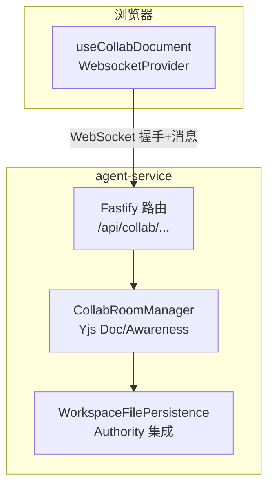
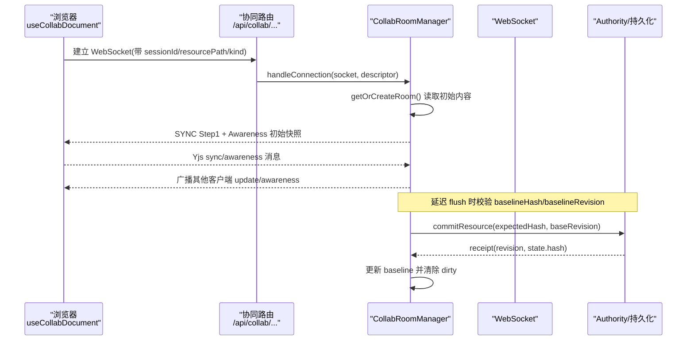
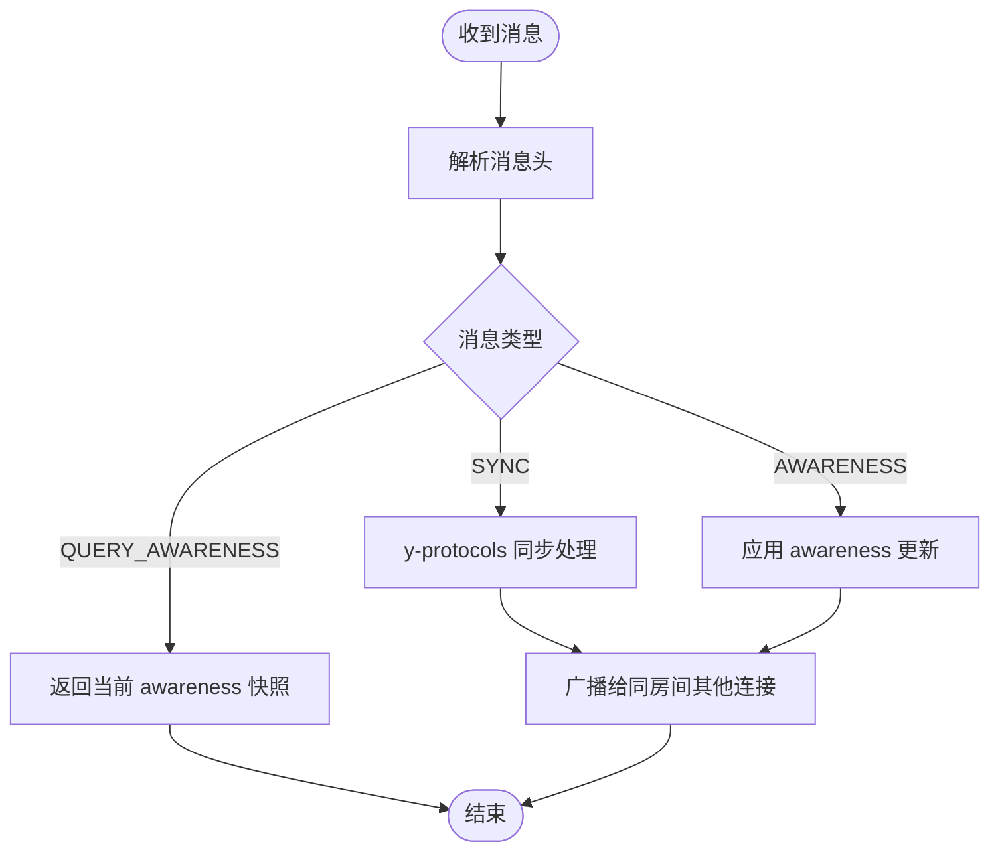
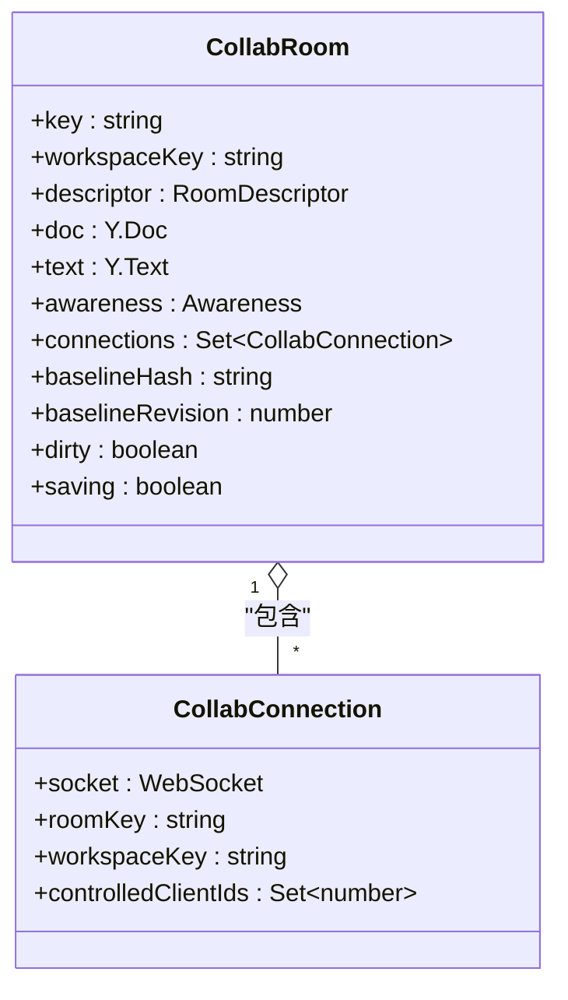
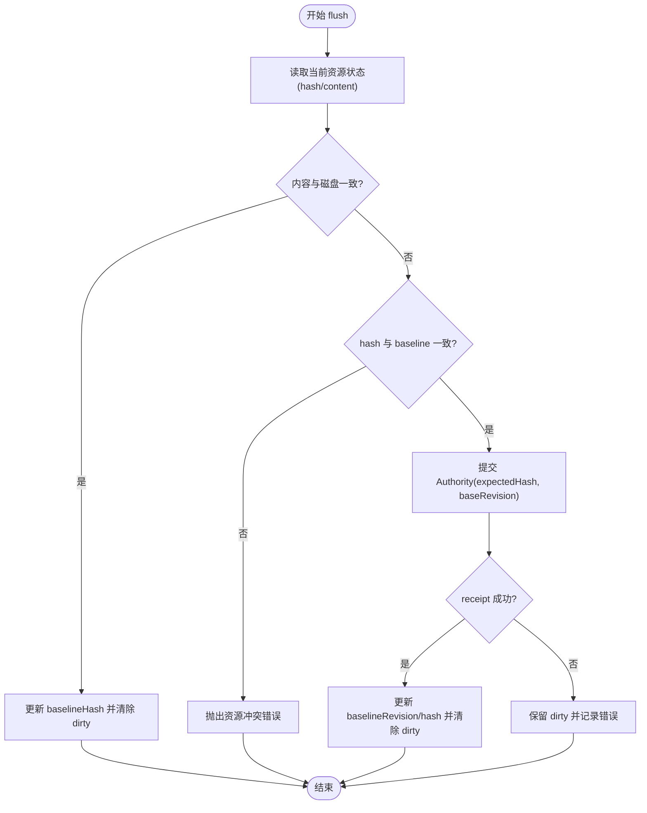
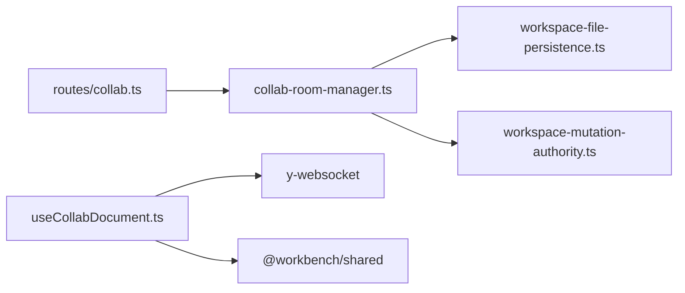

# 实时协作功能

<cite>
**本文引用的文件**
- [packages/agent-service/src/collab/collab-room-manager.ts](file://packages/agent-service/src/collab/collab-room-manager.ts)
- [packages/agent-service/src/routes/collab.ts](file://packages/agent-service/src/routes/collab.ts)
- [packages/author-site/src/hooks/useCollabDocument.ts](file://packages/author-site/src/hooks/useCollabDocument.ts)
- [docs/项目文档/创作端/03-项目管理/技术/11_实时保存与协同编辑.md](file://docs/项目文档/创作端/03-项目管理/技术/11_实时保存与协同编辑.md)
- [packages/agent-service/tests/unit/collab-room-manager.test.ts](file://packages/agent-service/tests/unit/collab-room-manager.test.ts)
- [packages/agent-service/src/routes/websocket.ts](file://packages/agent-service/src/routes/websocket.ts)
- [packages/author-site/src/components/ai-elements/chat/services/stream-service.ts](file://packages/author-site/src/components/ai-elements/chat/services/stream-service.ts)
</cite>

## 目录
1. [引言](#引言)
2. [项目结构](#项目结构)
3. [核心组件](#核心组件)
4. [架构总览](#架构总览)
5. [详细组件分析](#详细组件分析)
6. [依赖分析](#依赖分析)
7. [性能考虑](#性能考虑)
8. [故障排查指南](#故障排查指南)
9. [结论](#结论)
10. [附录](#附录)

## 引言
本文件面向“实时协作”能力，聚焦 WebSocket 连接管理、消息协议设计、操作同步算法、冲突解决策略、多用户光标与在线状态同步、会话生命周期与权限控制，以及测试方法与性能调优。系统采用 Yjs + y-websocket 的 CRDT 方案进行文本级协同，结合 Workspace Authority 的单写者事务模型保障持久化一致性与外部漂移防护。

## 项目结构
- 服务端（agent-service）
  - 协同房间管理器：负责房间生命周期、Yjs Doc/Awareness 维护、消息路由、延迟落盘与冲突检测
  - 协同路由：WebSocket 握手、参数校验、flush 接口
- 客户端（author-site）
  - useCollabDocument Hook：建立 WebsocketProvider、设置 presence、处理连接状态与离线抖动约束
- 文档与测试
  - 技术文档：定义边界、数据流、持久化策略、权限与安全、异常降级等
  - 单元测试：覆盖 Yjs 同步、awareness 广播、断连清理等

图表来源
- [packages/agent-service/src/routes/collab.ts:69-141](file://packages/agent-service/src/routes/collab.ts#L69-L141)
- [packages/agent-service/src/collab/collab-room-manager.ts:55-118](file://packages/agent-service/src/collab/collab-room-manager.ts#L55-L118)
- [packages/author-site/src/hooks/useCollabDocument.ts:173-185](file://packages/author-site/src/hooks/useCollabDocument.ts#L173-L185)

章节来源
- [packages/agent-service/src/routes/collab.ts:69-141](file://packages/agent-service/src/routes/collab.ts#L69-L141)
- [packages/agent-service/src/collab/collab-room-manager.ts:55-118](file://packages/agent-service/src/collab/collab-room-manager.ts#L55-L118)
- [packages/author-site/src/hooks/useCollabDocument.ts:173-185](file://packages/author-site/src/hooks/useCollabDocument.ts#L173-L185)

## 核心组件
- CollabRoomManager
  - 房间创建/复用、Yjs Doc/Awareness 初始化、消息分发、更新广播、延迟 flush、空闲清理
  - 与 Authority 集成：消费 committed receipt 刷新 baseline；非协同提交前触发草稿 flush barrier
- 协同路由
  - WebSocket 入口校验与会话绑定；单资源 flush 与 workspace flush-all
- useCollabDocument
  - 前端连接建立、presence 设置、状态机（connecting/synced/offline/error）、离线抖动约束、显式 flush

章节来源
- [packages/agent-service/src/collab/collab-room-manager.ts:55-118](file://packages/agent-service/src/collab/collab-room-manager.ts#L55-L118)
- [packages/agent-service/src/routes/collab.ts:69-141](file://packages/agent-service/src/routes/collab.ts#L69-L141)
- [packages/author-site/src/hooks/useCollabDocument.ts:93-211](file://packages/author-site/src/hooks/useCollabDocument.ts#L93-L211)

## 架构总览
整体流程：浏览器通过 WebsocketProvider 连接到 agent-service 的 /api/collab/... 路由，服务端根据房间描述创建或复用房间，完成 Yjs 初始同步并广播 awareness。后续编辑产生的 update 在房间内广播，同时标记 dirty 并调度延迟落盘。关键动作（命名版本、发布、自动检查点等）会先执行 flush，再进入 Authority 提交与 canonical 物化链路。

图表来源
- [packages/agent-service/src/routes/collab.ts:83-94](file://packages/agent-service/src/routes/collab.ts#L83-L94)
- [packages/agent-service/src/collab/collab-room-manager.ts:115-157](file://packages/agent-service/src/collab/collab-room-manager.ts#L115-L157)
- [packages/agent-service/src/collab/collab-room-manager.ts:369-422](file://packages/agent-service/src/collab/collab-room-manager.ts#L369-L422)

## 详细组件分析

### 连接管理与消息协议
- 连接建立
  - 路由层解析 projectId/workspaceId/sessionId/resourcePath/kind，校验通过后交由房间管理器处理
  - 房间管理器验证 Session 与 Workspace 归属，限制每 Workspace 最大连接数
  - 首次连接发送 SYNC Step1 与 Awareness 初始快照
- 消息类型
  - SYNC：Yjs 同步消息（Step1/Update），由 y-protocols 编解码
  - AWARENESS：在线状态/光标信息，Awareness 协议编码
  - QUERY_AWARENESS：主动查询当前在线列表
- 心跳与超时
  - Agent 流式通道提供 ping/pong 与连接超时清理；协同通道未内置应用层心跳，但通过 lastActiveAt 与空闲清理实现资源回收
- 断线重连
  - 客户端使用 y-websocket 自动重连；服务端按连接事件移除 connection 并清理 awareness 状态

图表来源
- [packages/agent-service/src/collab/collab-room-manager.ts:320-346](file://packages/agent-service/src/collab/collab-room-manager.ts#L320-L346)
- [packages/agent-service/src/collab/collab-room-manager.ts:463-487](file://packages/agent-service/src/collab/collab-room-manager.ts#L463-L487)
- [packages/agent-service/src/routes/websocket.ts:122-132](file://packages/agent-service/src/routes/websocket.ts#L122-L132)

章节来源
- [packages/agent-service/src/routes/collab.ts:83-94](file://packages/agent-service/src/routes/collab.ts#L83-L94)
- [packages/agent-service/src/collab/collab-room-manager.ts:115-157](file://packages/agent-service/src/collab/collab-room-manager.ts#L115-L157)
- [packages/agent-service/src/collab/collab-room-manager.ts:320-346](file://packages/agent-service/src/collab/collab-room-manager.ts#L320-L346)
- [packages/agent-service/src/routes/websocket.ts:122-132](file://packages/agent-service/src/routes/websocket.ts#L122-L132)

### 操作同步算法（序列化/反序列化、网络优化、离线支持）
- 序列化/反序列化
  - 基于 lib0 与 y-protocols 的 VarUint/VarUint8Array 编码，高效传输 Yjs update 与 awareness 增量
- 网络传输优化
  - 仅广播增量 update；避免重复内容写入；服务端对重复 JSON Schema 做归一化处理
- 离线支持
  - 客户端断开后，重连通过 SYNC Step1 重新对齐；服务端记录 lastActiveAt 并在空闲时清理房间
  - 前端存在“离线待同步”阈值，避免短暂断连导致状态抖动

图表来源
- [packages/agent-service/src/collab/collab-room-manager.ts:23-53](file://packages/agent-service/src/collab/collab-room-manager.ts#L23-L53)

章节来源
- [packages/agent-service/src/collab/collab-room-manager.ts:285-314](file://packages/agent-service/src/collab/collab-room-manager.ts#L285-L314)
- [docs/项目文档/创作端/03-项目管理/技术/11_实时保存与协同编辑.md:252-255](file://docs/项目文档/创作端/03-项目管理/技术/11_实时保存与协同编辑.md#L252-L255)

### 冲突解决与持久化（Authority 集成）
- 冲突检测
  - flush 前比对磁盘 hash 与 baselineHash；不一致则拒绝旧文本写回并以磁盘重置房间
  - 若目标资源被外部推进，flush 必须携带旧 baselineHash，否则返回 WORKSPACE_RESOURCE_CONFLICT
- 持久化流程
  - 延迟保存：默认约 1 秒后将 dirty 文本提交到 Authority；成功后更新 baselineRevision/hash
  - 关键动作强制 flush：命名版本、发布、自动检查点、保存/合并 Session、恢复前
- 外部漂移防护
  - 检测到旁路修改 fail-closed；显式 reconcile adopt/restore 才接纳或恢复

图表来源
- [packages/agent-service/src/collab/collab-room-manager.ts:369-422](file://packages/agent-service/src/collab/collab-room-manager.ts#L369-L422)

章节来源
- [packages/agent-service/src/collab/collab-room-manager.ts:369-422](file://packages/agent-service/src/collab/collab-room-manager.ts#L369-L422)
- [docs/项目文档/创作端/03-项目管理/技术/11_实时保存与协同编辑.md:163-191](file://docs/项目文档/创作端/03-项目管理/技术/11_实时保存与协同编辑.md#L163-L191)

### 多用户光标与在线状态同步
- 前端
  - 通过 WebsocketProvider.awareness 设置本地 presence（userId、username、color、activePageId、resourcePath、lastActiveAt）
  - 监听 awareness change 事件，去重比较后更新 UI
- 服务端
  - 接收 awareness 更新并广播；连接关闭时移除对应 clientIds 的状态
- 展示
  - 使用 workspace-tree.json 房间聚合全局在线用户，避免额外房间开销

章节来源
- [packages/author-site/src/hooks/useCollabDocument.ts:192-211](file://packages/author-site/src/hooks/useCollabDocument.ts#L192-L211)
- [packages/agent-service/src/collab/collab-room-manager.ts:297-314](file://packages/agent-service/src/collab/collab-room-manager.ts#L297-L314)
- [packages/agent-service/src/collab/collab-room-manager.ts:348-358](file://packages/agent-service/src/collab/collab-room-manager.ts#L348-L358)

### 协作会话生命周期与权限控制
- 会话生命周期
  - 连接建立需携带有效 sessionId；服务端校验 session 属于当前项目与 Workspace
  - 空闲房间定期清理；清理前先 flush，再销毁 doc 与 awareness
- 权限控制
  - 三层校验：Session 校验、Workspace 校验、Resource 路径与类型白名单
  - 资源类型限定为 page-code、page-prototype-html/css、page-schema、page-sketch-scene、project-schema、workspace-tree、canvas-layout、knowledge-document
- 限流与并发
  - 普通 HTTP 接口保留全局 rate limit；WebSocket 握手豁免请求级限流，但房间参数校验与持久化边界仍受控
  - 每 Workspace 最大连接数限制，防止滥用

章节来源
- [packages/agent-service/src/routes/collab.ts:20-50](file://packages/agent-service/src/routes/collab.ts#L20-L50)
- [packages/agent-service/src/collab/collab-room-manager.ts:106-113](file://packages/agent-service/src/collab/collab-room-manager.ts#L106-L113)
- [docs/项目文档/创作端/03-项目管理/技术/11_实时保存与协同编辑.md:201-214](file://docs/项目文档/创作端/03-项目管理/技术/11_实时保存与协同编辑.md#L201-L214)

## 依赖分析
- 模块耦合
  - 协同路由依赖房间管理器；房间管理器依赖持久化与 Authority 集成
  - 前端 Hook 依赖 y-websocket 与共享类型
- 外部依赖
  - Yjs/y-protocols/lib0 用于 CRDT 与高效编解码
  - ws/Fastify 提供 WebSocket 服务
- 潜在循环依赖
  - 当前未见循环导入；房间管理器通过注册表与 Authority 解耦

图表来源
- [packages/agent-service/src/routes/collab.ts:1-10](file://packages/agent-service/src/routes/collab.ts#L1-L10)
- [packages/agent-service/src/collab/collab-room-manager.ts:1-14](file://packages/agent-service/src/collab/collab-room-manager.ts#L1-L14)
- [packages/author-site/src/hooks/useCollabDocument.ts:1-12](file://packages/author-site/src/hooks/useCollabDocument.ts#L1-L12)

章节来源
- [packages/agent-service/src/routes/collab.ts:1-10](file://packages/agent-service/src/routes/collab.ts#L1-L10)
- [packages/agent-service/src/collab/collab-room-manager.ts:1-14](file://packages/agent-service/src/collab/collab-room-manager.ts#L1-L14)
- [packages/author-site/src/hooks/useCollabDocument.ts:1-12](file://packages/author-site/src/hooks/useCollabDocument.ts#L1-L12)

## 性能考虑
- 热路径优化
  - 仅广播增量 update；避免每次 flush 都读盘；重复内容保护减少无效落盘
- 延迟保存
  - 默认约 1 秒 debounce，平衡实时性与 I/O 压力
- 连接与房间管理
  - 空闲房间 TTL 清理；每 Workspace 连接上限；避免内存泄漏
- 前端状态抖动抑制
  - 短断连不立即降级为 offline，降低多房间场景下的状态抖动

[本节为通用指导，无需具体文件引用]

## 故障排查指南
- 常见问题
  - 连接失败：检查 sessionId/resourcePath/kind 是否合法；确认 Session 与 Workspace 归属
  - 落盘冲突：WORKSPACE_RESOURCE_CONFLICT 表示外部已推进资源，需刷新或合并
  - 离线待同步：超过前端阈值仍未恢复才会显示 offline；等待重连或检查网络
- 诊断要点
  - 查看房间 lastActiveAt 与 connections 数量；确认是否存在空闲房间未及时清理
  - 关注 Authority receipt 与 projection ack 事件，定位 committed 与预览应用差异
- 回归与测试
  - 使用单元与 E2E 脚本验证多用户同步、awareness 广播、断连清理与自动保存

章节来源
- [packages/agent-service/tests/unit/collab-room-manager.test.ts:196-225](file://packages/agent-service/tests/unit/collab-room-manager.test.ts#L196-L225)
- [docs/项目文档/创作端/03-项目管理/技术/11_实时保存与协同编辑.md:242-255](file://docs/项目文档/创作端/03-项目管理/技术/11_实时保存与协同编辑.md#L242-L255)

## 结论
本协作方案以 Yjs CRDT 为核心，结合 Authority 单写者事务与严格的权限/路径安全，实现了高可靠的多用户实时编辑。通过增量同步、延迟落盘、冲突检测与外部漂移防护，系统在性能与一致性之间取得良好平衡。前端状态机与离线抖动约束提升了用户体验。建议在生产环境持续监控连接与 flush 指标，并结合诊断事件完善可观测性。

[本节为总结，无需具体文件引用]

## 附录
- 相关 API 与行为
  - WebSocket 房间：/api/collab/projects/:projectId/workspaces/:workspaceId/:room
  - 单资源 flush：POST /api/collab/projects/:projectId/workspaces/:workspaceId/flush
  - Workspace flush-all：POST /api/collab/projects/:projectId/workspaces/:workspaceId/flush-all
- 前端 Hook
  - useCollabDocument：封装连接、presence、状态与 flush
  - useCollabPresence：基于 workspace-tree.json 房间聚合在线用户

章节来源
- [packages/agent-service/src/routes/collab.ts:69-141](file://packages/agent-service/src/routes/collab.ts#L69-L141)
- [packages/author-site/src/hooks/useCollabDocument.ts:317-346](file://packages/author-site/src/hooks/useCollabDocument.ts#L317-L346)