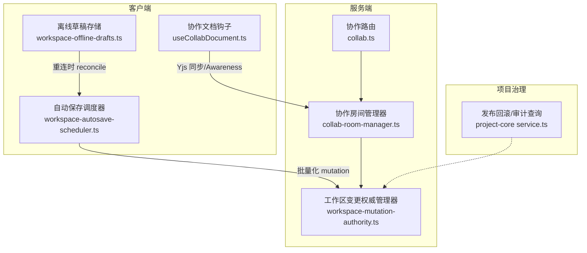
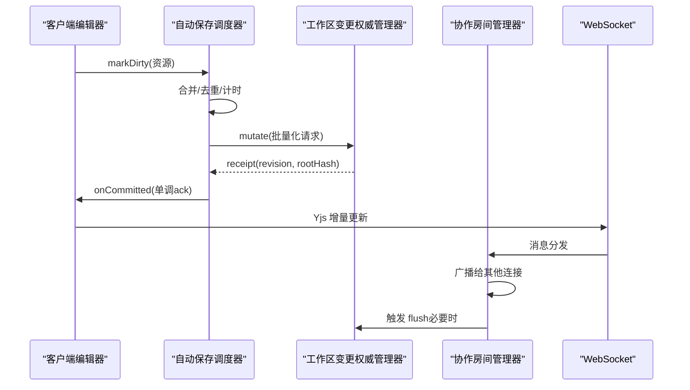
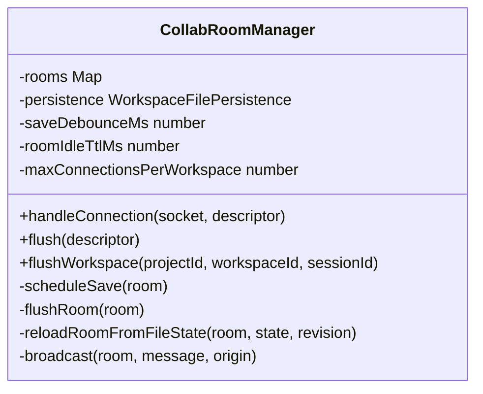
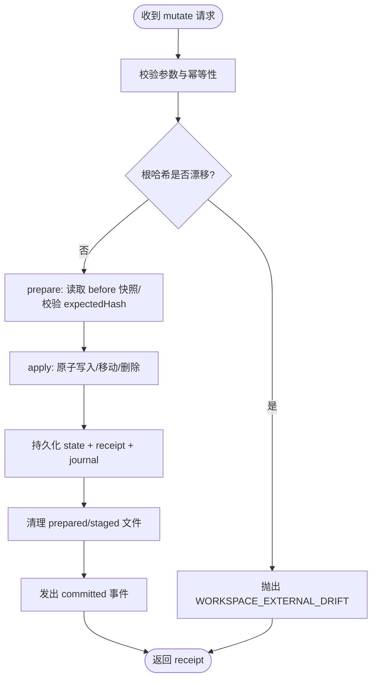
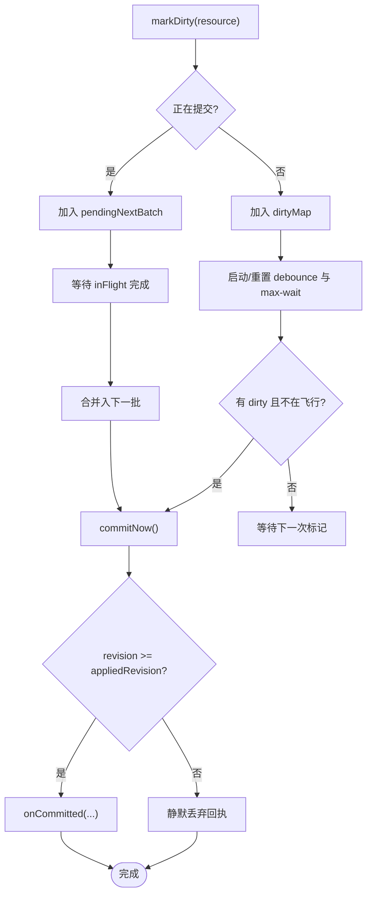
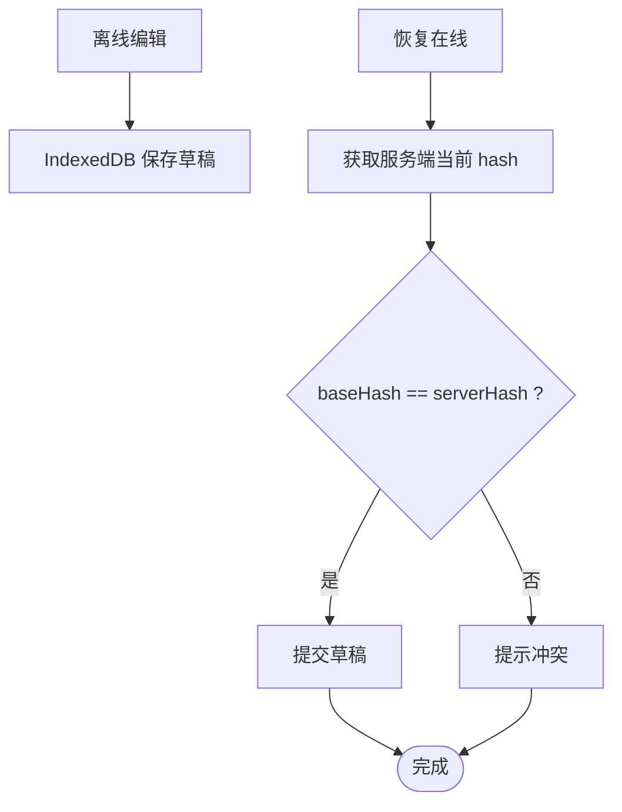
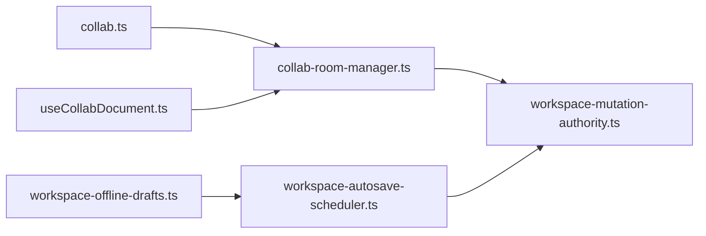

# 操作同步算法

<cite>
**本文引用的文件**   
- [collab-room-manager.ts](file://packages/agent-service/src/collab/collab-room-manager.ts)
- [collab.ts](file://packages/agent-service/src/routes/collab.ts)
- [workspace-mutation-authority.ts](file://packages/agent-service/src/workspace/workspace-mutation-authority.ts)
- [workspace-autosave-scheduler.ts](file://packages/author-site/src/lib/workspace-autosave-scheduler.ts)
- [workspace-offline-drafts.ts](file://packages/author-site/src/lib/workspace-offline-drafts.ts)
- [useCollabDocument.ts](file://packages/author-site/src/hooks/useCollabDocument.ts)
- [project-core service.ts](file://packages/project-core/src/service.ts)
</cite>

## 目录
1. [简介](#简介)
2. [项目结构](#项目结构)
3. [核心组件](#核心组件)
4. [架构总览](#架构总览)
5. [详细组件分析](#详细组件分析)
6. [依赖关系分析](#依赖关系分析)
7. [性能考虑](#性能考虑)
8. [故障排查指南](#故障排查指南)
9. [结论](#结论)
10. [附录](#附录)

## 简介
本技术文档围绕“操作同步算法”展开，聚焦以下目标：
- 操作序列化与反序列化机制（含操作类型、数据压缩与网络传输优化）
- 操作队列管理（优先级调度、批量处理、背压控制）
- 离线支持（本地草稿缓存、冲突检测、同步恢复）
- 版本控制与一致性保证（单调递增 revision、根哈希校验、幂等提交）
- 操作日志记录与审计追踪
- 同步性能调优与调试工具使用

该方案以 Yjs 协议进行实时协作，结合工作区变更权威管理器（WorkspaceMutationAuthority）实现强一致性与可恢复性；前端通过自动保存调度器与离线草稿存储保障用户体验与可靠性。

## 项目结构
从代码库中定位到与操作同步相关的核心模块：
- 服务端协作房间管理与消息路由
- 工作区变更权威管理器（唯一持久写入者）
- 前端自动保存调度器与离线草稿存储
- 协作存在感知（Awareness）与资源路径编码
- 发布回滚与审计事件查询

图表来源
- [collab.ts:69-94](file://packages/agent-service/src/routes/collab.ts#L69-L94)
- [collab-room-manager.ts:115-157](file://packages/agent-service/src/collab/collab-room-manager.ts#L115-L157)
- [workspace-mutation-authority.ts:468-637](file://packages/agent-service/src/workspace/workspace-mutation-authority.ts#L468-L637)
- [workspace-autosave-scheduler.ts:39-154](file://packages/author-site/src/lib/workspace-autosave-scheduler.ts#L39-L154)
- [workspace-offline-drafts.ts:96-188](file://packages/author-site/src/lib/workspace-offline-drafts.ts#L96-L188)
- [useCollabDocument.ts:54-91](file://packages/author-site/src/hooks/useCollabDocument.ts#L54-L91)
- [project-core service.ts:4542-4578](file://packages/project-core/src/service.ts#L4542-L4578)

章节来源
- [collab.ts:69-94](file://packages/agent-service/src/routes/collab.ts#L69-L94)
- [collab-room-manager.ts:115-157](file://packages/agent-service/src/collab/collab-room-manager.ts#L115-L157)
- [workspace-mutation-authority.ts:468-637](file://packages/agent-service/src/workspace/workspace-mutation-authority.ts#L468-L637)
- [workspace-autosave-scheduler.ts:39-154](file://packages/author-site/src/lib/workspace-autosave-scheduler.ts#L39-L154)
- [workspace-offline-drafts.ts:96-188](file://packages/author-site/src/lib/workspace-offline-drafts.ts#L96-L188)
- [useCollabDocument.ts:54-91](file://packages/author-site/src/hooks/useCollabDocument.ts#L54-L91)
- [project-core service.ts:4542-4578](file://packages/project-core/src/service.ts#L4542-L4578)

## 核心组件
- 协作房间管理器（CollabRoomManager）
  - 负责 Yjs 文档实例、Awareness 状态、WebSocket 消息编解码、增量更新广播、空闲清理与强制刷新。
- 工作区变更权威管理器（WorkspaceMutationAuthority）
  - 唯一持久写入者，维护 per-workspace 的串行化队列、幂等提交、准备/应用/回滚流程、备份与恢复、健康检查与审计。
- 自动保存调度器（WorkspaceAutosaveScheduler）
  - 前端侧单写者调度器，提供 debounce/max-wait、批量合并、in-flight 屏障与单调 ack。
- 离线草稿存储（OfflineDraftStore）
  - IndexedDB 持久化，用于 Authority 不可达时的编辑内容缓存与重连后冲突判定。
- 协作文档钩子（useCollabDocument）
  - 封装房间名编码、Presence 读取与比较，驱动 Yjs 同步与 Awareness 传播。
- 项目治理服务（Project Admin Service）
  - 提供发布回滚与审计事件查询能力，辅助一致性回溯与审计追踪。

章节来源
- [collab-room-manager.ts:55-104](file://packages/agent-service/src/collab/collab-room-manager.ts#L55-L104)
- [workspace-mutation-authority.ts:112-189](file://packages/agent-service/src/workspace/workspace-mutation-authority.ts#L112-L189)
- [workspace-autosave-scheduler.ts:39-154](file://packages/author-site/src/lib/workspace-autosave-scheduler.ts#L39-L154)
- [workspace-offline-drafts.ts:96-188](file://packages/author-site/src/lib/workspace-offline-drafts.ts#L96-L188)
- [useCollabDocument.ts:54-91](file://packages/author-site/src/hooks/useCollabDocument.ts#L54-L91)
- [project-core service.ts:4542-4578](file://packages/project-core/src/service.ts#L4542-L4578)

## 架构总览
系统采用“客户端协作 + 服务端权威写入”的分层架构：
- 客户端通过 Yjs 协议在 WebSocket 上交换增量更新与 Awareness 信息，由协作房间管理器统一转发与广播。
- 所有对磁盘的变更必须经由工作区变更权威管理器，确保幂等、可恢复与强一致。
- 前端自动保存调度器将高频修改聚合为批次提交，并基于单调 revision 做去抖与背压。
- 离线场景下，前端将修改落盘至 IndexedDB，重连后与服务端当前 hash 对比决定提交或进入冲突。

图表来源
- [workspace-autosave-scheduler.ts:196-250](file://packages/author-site/src/lib/workspace-autosave-scheduler.ts#L196-L250)
- [workspace-mutation-authority.ts:468-637](file://packages/agent-service/src/workspace/workspace-mutation-authority.ts#L468-L637)
- [collab-room-manager.ts:285-318](file://packages/agent-service/src/collab/collab-room-manager.ts#L285-L318)
- [collab.ts:69-94](file://packages/agent-service/src/routes/collab.ts#L69-L94)

## 详细组件分析

### 协作房间管理器（CollabRoomManager）
职责与关键点：
- 会话校验与房间生命周期管理，按 workspace 维度限制最大连接数。
- 使用 Yjs Text 作为文本资源的协作模型，监听 update 事件进行增量广播。
- Awareness 状态广播与客户端控制集跟踪，避免重复推送。
- 外部 commit 事件监听，当文件被权威管理器提交后，若房间未脏则从磁盘重载基线。
- 防抖保存与空闲清理，防止频繁落盘与内存泄漏。

图表来源
- [collab-room-manager.ts:55-104](file://packages/agent-service/src/collab/collab-room-manager.ts#L55-L104)
- [collab-room-manager.ts:115-157](file://packages/agent-service/src/collab/collab-room-manager.ts#L115-L157)
- [collab-room-manager.ts:369-422](file://packages/agent-service/src/collab/collab-room-manager.ts#L369-L422)
- [collab-room-manager.ts:452-461](file://packages/agent-service/src/collab/collab-room-manager.ts#L452-L461)

章节来源
- [collab-room-manager.ts:115-157](file://packages/agent-service/src/collab/collab-room-manager.ts#L115-L157)
- [collab-room-manager.ts:285-318](file://packages/agent-service/src/collab/collab-room-manager.ts#L285-L318)
- [collab-room-manager.ts:369-422](file://packages/agent-service/src/collab/collab-room-manager.ts#L369-L422)
- [collab-room-manager.ts:452-461](file://packages/agent-service/src/collab/collab-room-manager.ts#L452-L461)

### 工作区变更权威管理器（WorkspaceMutationAuthority）
职责与关键点：
- 全局单例式队列（per workspace），保证同一工作区的操作串行执行。
- 幂等提交：通过 mutationId + payloadHash 去重，避免重复提交。
- 三阶段事务：prepare（校验与快照）、apply（原子写入）、commit（持久化 receipt 与状态）。
- 失败回滚：异常时恢复 before 快照，保持文件系统与状态一致。
- 二进制暂存：大对象先 stage，再在 put_binary 操作中校验大小与哈希后落盘。
- 健康检查与恢复：支持 prepared/reconcile 恢复、外部漂移检测、提交回执与投影确认。
- 审计与诊断：记录 received/prepared/committed/rolled_back/conflicted 等事件。

图表来源
- [workspace-mutation-authority.ts:468-637](file://packages/agent-service/src/workspace/workspace-mutation-authority.ts#L468-L637)
- [workspace-mutation-authority.ts:710-744](file://packages/agent-service/src/workspace/workspace-mutation-authority.ts#L710-L744)
- [workspace-mutation-authority.ts:773-797](file://packages/agent-service/src/workspace/workspace-mutation-authority.ts#L773-L797)

章节来源
- [workspace-mutation-authority.ts:112-189](file://packages/agent-service/src/workspace/workspace-mutation-authority.ts#L112-L189)
- [workspace-mutation-authority.ts:468-637](file://packages/agent-service/src/workspace/workspace-mutation-authority.ts#L468-L637)
- [workspace-mutation-authority.ts:710-744](file://packages/agent-service/src/workspace/workspace-mutation-authority.ts#L710-L744)
- [workspace-mutation-authority.ts:773-797](file://packages/agent-service/src/workspace/workspace-mutation-authority.ts#L773-L797)

### 自动保存调度器（WorkspaceAutosaveScheduler）
职责与关键点：
- 单写者模式：inFlight 屏障保证同时仅一个提交在执行。
- 批量合并：同一路径只保留最新内容，减少无效提交。
- 双定时器：debounce（最后一次 dirty 后等待）与 max-wait（首次 dirty 起最长等待）。
- 单调 ack：仅接受 revision >= appliedRevision 的回执，丢弃旧回执。
- 背压策略：inFlight 期间新进的 dirty 转入下一批，避免堆积导致雪崩。

图表来源
- [workspace-autosave-scheduler.ts:75-154](file://packages/author-site/src/lib/workspace-autosave-scheduler.ts#L75-L154)
- [workspace-autosave-scheduler.ts:196-250](file://packages/author-site/src/lib/workspace-autosave-scheduler.ts#L196-L250)

章节来源
- [workspace-autosave-scheduler.ts:39-154](file://packages/author-site/src/lib/workspace-autosave-scheduler.ts#L39-L154)
- [workspace-autosave-scheduler.ts:196-250](file://packages/author-site/src/lib/workspace-autosave-scheduler.ts#L196-L250)

### 离线草稿存储与冲突解决（OfflineDraftStore）
职责与关键点：
- IndexedDB 持久化，键空间按 workspaceId:path 组织，隔离不同工作区。
- 离线时不直接调用文件 API，仅缓存到本地。
- 重连后通过 baseHash 与服务端当前 hash 对比：
  - match：可直接提交
  - conflict：提示用户处理冲突

图表来源
- [workspace-offline-drafts.ts:96-188](file://packages/author-site/src/lib/workspace-offline-drafts.ts#L96-L188)
- [workspace-offline-drafts.ts:196-204](file://packages/author-site/src/lib/workspace-offline-drafts.ts#L196-L204)

章节来源
- [workspace-offline-drafts.ts:96-188](file://packages/author-site/src/lib/workspace-offline-drafts.ts#L96-L188)
- [workspace-offline-drafts.ts:196-204](file://packages/author-site/src/lib/workspace-offline-drafts.ts#L196-L204)

### 协作文档钩子（useCollabDocument）
职责与关键点：
- 资源路径编码为安全的房间名，避免特殊字符影响路由。
- Presence 读取与签名比较，最小化 UI 更新。
- 与 Yjs Awareness 集成，展示在线用户与活跃页面。

章节来源
- [useCollabDocument.ts:54-91](file://packages/author-site/src/hooks/useCollabDocument.ts#L54-L91)

### 发布回滚与审计查询（Project Admin Service）
职责与关键点：
- 发布回滚：将 publishedVersion 指向上一版本，记录发布时间。
- 审计列表/详情：遍历审计目录，过滤并按时间倒序返回。

章节来源
- [project-core service.ts:4542-4578](file://packages/project-core/src/service.ts#L4542-L4578)

## 依赖关系分析
- 协作路由（collab.ts）依赖协作房间管理器（collab-room-manager.ts），负责建立 WebSocket 并委派消息处理。
- 协作房间管理器依赖工作区变更权威管理器（workspace-mutation-authority.ts），在外部提交后重载基线或在 flush 时触发权威提交。
- 前端自动保存调度器通过 commitFn 间接调用权威管理器，形成端到端的提交链路。
- 离线草稿存储独立于网络层，仅在重连时参与冲突判定。

图表来源
- [collab.ts:69-94](file://packages/agent-service/src/routes/collab.ts#L69-L94)
- [collab-room-manager.ts:115-157](file://packages/agent-service/src/collab/collab-room-manager.ts#L115-L157)
- [workspace-mutation-authority.ts:468-637](file://packages/agent-service/src/workspace/workspace-mutation-authority.ts#L468-L637)
- [workspace-autosave-scheduler.ts:196-250](file://packages/author-site/src/lib/workspace-autosave-scheduler.ts#L196-L250)
- [workspace-offline-drafts.ts:96-188](file://packages/author-site/src/lib/workspace-offline-drafts.ts#L96-L188)
- [useCollabDocument.ts:54-91](file://packages/author-site/src/hooks/useCollabDocument.ts#L54-L91)

章节来源
- [collab.ts:69-94](file://packages/agent-service/src/routes/collab.ts#L69-L94)
- [collab-room-manager.ts:115-157](file://packages/agent-service/src/collab/collab-room-manager.ts#L115-L157)
- [workspace-mutation-authority.ts:468-637](file://packages/agent-service/src/workspace/workspace-mutation-authority.ts#L468-L637)
- [workspace-autosave-scheduler.ts:196-250](file://packages/author-site/src/lib/workspace-autosave-scheduler.ts#L196-L250)
- [workspace-offline-drafts.ts:96-188](file://packages/author-site/src/lib/workspace-offline-drafts.ts#L96-L188)
- [useCollabDocument.ts:54-91](file://packages/author-site/src/hooks/useCollabDocument.ts#L54-L91)

## 性能考虑
- 批量合并与去抖
  - 前端通过自动保存调度器将多次修改合并为一次提交，显著降低网络与磁盘 I/O。
  - 建议根据业务负载调整 debounceMs 与 maxWaitMs，平衡延迟与吞吐。
- 单调 ack 与去重
  - 仅接受 revision >= appliedRevision 的回执，避免重复应用导致的抖动。
  - 服务端通过 mutationId + payloadHash 幂等去重，提升重试安全性。
- 二进制暂存
  - 大对象先 stage，再在 put_binary 中校验大小与哈希，避免中间态污染工作区。
- 连接限流与空闲清理
  - 按 workspace 限制最大连接数，空闲房间定期 flush 并销毁，降低内存占用。
- 增量同步
  - Yjs 增量更新与 Awareness 分离，减少不必要的全量同步。

[本节为通用指导，无需特定文件引用]

## 故障排查指南
常见问题与定位方法：
- 外部漂移（WORKSPACE_EXTERNAL_DRIFT）
  - 现象：提交前检测到根哈希不一致，拒绝提交。
  - 排查：检查工作区是否存在外部修改；使用 reconcileAdopt 或 reconcileRestore 决策。
- 资源冲突（WORKSPACE_RESOURCE_CONFLICT）
  - 现象：expectedHash 不匹配或 baseRevision 过旧。
  - 排查：查看冲突计数与健康指标；必要时重新拉取最新版本并重试。
- 幂等冲突（WORKSPACE_MUTATION_ID_REUSED）
  - 现象：相同 mutationId 但 payloadHash 不同。
  - 排查：检查客户端生成 mutationId 的策略，确保幂等语义正确。
- 离线草稿冲突
  - 现象：reconcileDraft 返回 conflict。
  - 排查：比对 baseHash 与服务端当前 hash，引导用户合并或覆盖。
- 协作房间异常
  - 现象：WebSocket 错误或连接断开。
  - 排查：检查房间清理与连接上限配置；关注错误日志中的 roomKey 与 reason。

章节来源
- [workspace-mutation-authority.ts:468-637](file://packages/agent-service/src/workspace/workspace-mutation-authority.ts#L468-L637)
- [workspace-mutation-authority.ts:240-284](file://packages/agent-service/src/workspace/workspace-mutation-authority.ts#L240-L284)
- [workspace-offline-drafts.ts:196-204](file://packages/author-site/src/lib/workspace-offline-drafts.ts#L196-L204)
- [collab-room-manager.ts:115-157](file://packages/agent-service/src/collab/collab-room-manager.ts#L115-L157)

## 结论
本方案通过“Yjs 增量协作 + 权威管理器串行提交 + 前端批量调度 + 离线草稿兜底”，实现了高可用、强一致与良好用户体验的操作同步体系。关键特性包括：
- 幂等提交与三阶段事务，保障崩溃恢复与一致性
- 单调 revision 与根哈希校验，防止乱序与覆盖
- 批量合并与背压，提升吞吐与稳定性
- 离线草稿与冲突判定，增强鲁棒性
- 完善的审计与诊断，便于问题定位与合规追溯

[本节为总结，无需特定文件引用]

## 附录

### 操作类型定义与序列化处理
- 操作类型
  - put_text：写入文本资源，需校验 expectedHash/expectedAbsent
  - put_binary：写入二进制资源，需校验 stagingId、size、hash
  - delete_path：删除资源，需校验 expectedHash
  - move_path：移动资源，需校验源与目标的期望状态
- 序列化与反序列化
  - 服务端使用 lib0 编码器/解码器与 y-protocols/sync 协议进行增量消息编解码
  - Awareness 更新通过 awarenessProtocol 编码/应用

章节来源
- [workspace-mutation-authority.ts:710-744](file://packages/agent-service/src/workspace/workspace-mutation-authority.ts#L710-L744)
- [collab-room-manager.ts:320-346](file://packages/agent-service/src/collab/collab-room-manager.ts#L320-L346)

### 数据压缩与网络传输优化
- 增量更新：Yjs 仅传输差异，避免全量同步
- Awareness 分离：仅广播变化客户端集合，减少带宽
- 二进制暂存：大对象分阶段处理，避免阻塞主线程与增大消息体

章节来源
- [collab-room-manager.ts:285-318](file://packages/agent-service/src/collab/collab-room-manager.ts#L285-L318)
- [workspace-mutation-authority.ts:453-466](file://packages/agent-service/src/workspace/workspace-mutation-authority.ts#L453-L466)

### 操作队列管理与背压控制
- 队列串行化：per-workspace Promise 链，避免并发竞争
- 批量合并：前端调度器按 path 去重，减少冗余提交
- 背压：inFlight 期间累积到下一批，避免雪崩

章节来源
- [workspace-mutation-authority.ts:112-189](file://packages/agent-service/src/workspace/workspace-mutation-authority.ts#L112-L189)
- [workspace-autosave-scheduler.ts:75-154](file://packages/author-site/src/lib/workspace-autosave-scheduler.ts#L75-L154)

### 离线支持与同步恢复
- 本地草稿：IndexedDB 持久化，键空间隔离
- 冲突检测：baseHash 与 serverHash 对比
- 恢复策略：match 直接提交；conflict 提示用户处理

章节来源
- [workspace-offline-drafts.ts:96-188](file://packages/author-site/src/lib/workspace-offline-drafts.ts#L96-L188)
- [workspace-offline-drafts.ts:196-204](file://packages/author-site/src/lib/workspace-offline-drafts.ts#L196-L204)

### 版本控制与一致性保证
- 单调 revision：每次成功提交递增
- 根哈希校验：提交前后计算 rootHash，检测外部漂移
- 幂等提交：mutationId + payloadHash 去重

章节来源
- [workspace-mutation-authority.ts:468-637](file://packages/agent-service/src/workspace/workspace-mutation-authority.ts#L468-L637)

### 操作日志记录与审计追踪
- 权威管理器诊断：记录 received/prepared/committed/rolled_back/conflicted 等事件
- 项目审计：审计目录遍历与排序，支持按项目过滤与详情查询

章节来源
- [workspace-mutation-authority.ts:645-688](file://packages/agent-service/src/workspace/workspace-mutation-authority.ts#L645-L688)
- [project-core service.ts:4562-4578](file://packages/project-core/src/service.ts#L4562-L4578)

### 同步性能调优指南
- 调整前端 debounceMs 与 maxWaitMs，平衡延迟与吞吐
- 合理设置 COLLAB_MAX_CONNECTIONS_PER_WORKSPACE 与 COLLAB_ROOM_IDLE_TTL_MS
- 监控健康指标：queueDepth、preparedCount、missingBackupCount、receiptCount、journalEntries
- 针对热点资源启用更激进的批量合并策略

章节来源
- [collab-room-manager.ts:64-73](file://packages/agent-service/src/collab/collab-room-manager.ts#L64-L73)
- [workspace-mutation-authority.ts:240-284](file://packages/agent-service/src/workspace/workspace-mutation-authority.ts#L240-L284)

### 调试工具使用方法
- 查看权威管理器健康状态：getHealth 返回 ready、externalDrift、queueDepth、preparedCount 等
- 获取已提交事件：getCommittedEventsSince 按 revision 范围拉取
- 获取投影确认：getProjectionAcks 按 revision 范围拉取
- 协作路由错误码：409 表示资源冲突，403 表示权限不足

章节来源
- [workspace-mutation-authority.ts:240-284](file://packages/agent-service/src/workspace/workspace-mutation-authority.ts#L240-L284)
- [workspace-mutation-authority.ts:141-179](file://packages/agent-service/src/workspace/workspace-mutation-authority.ts#L141-L179)
- [collab.ts:52-67](file://packages/agent-service/src/routes/collab.ts#L52-L67)