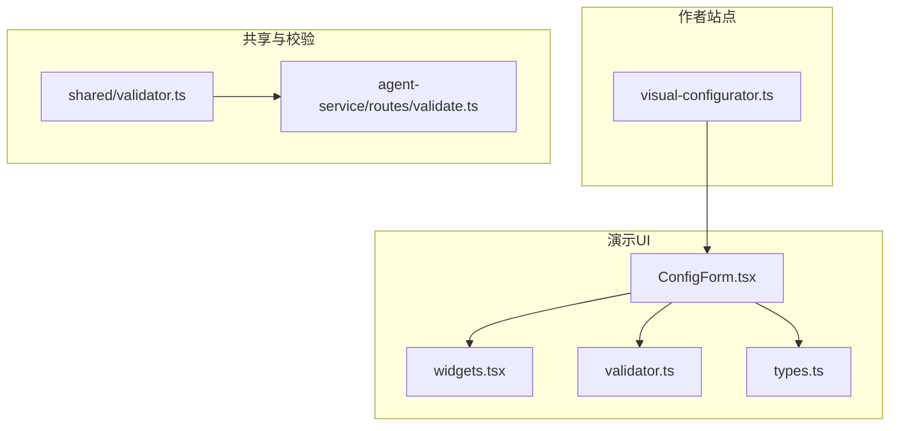
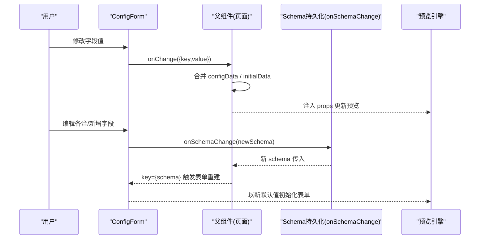
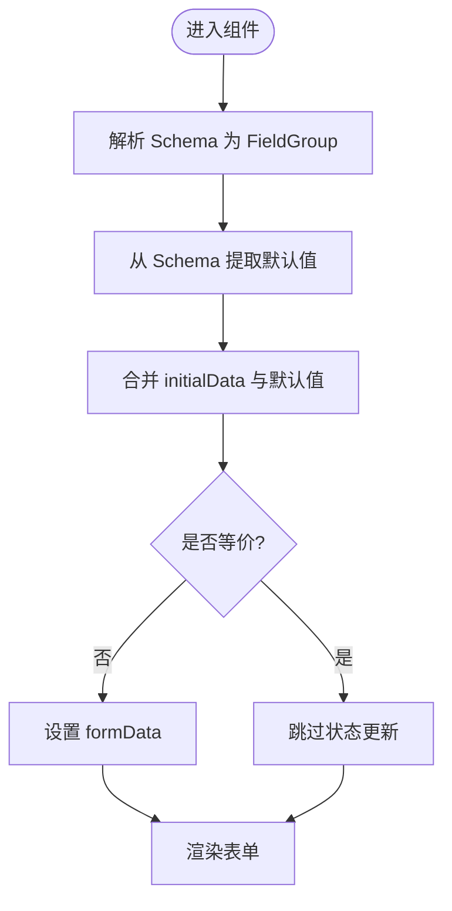
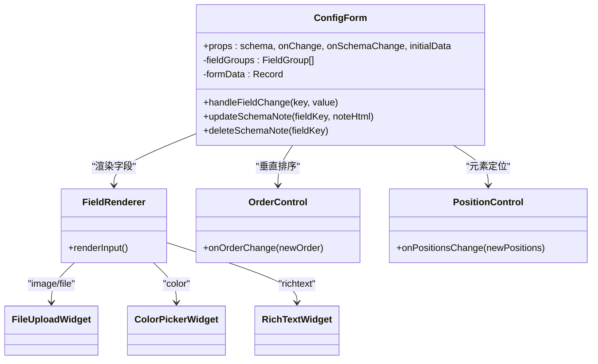
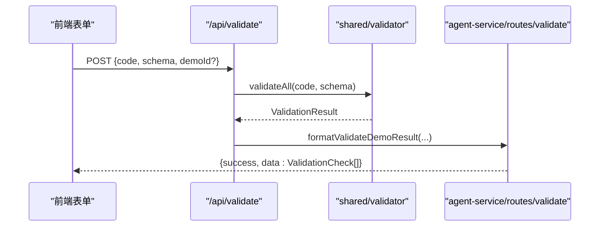
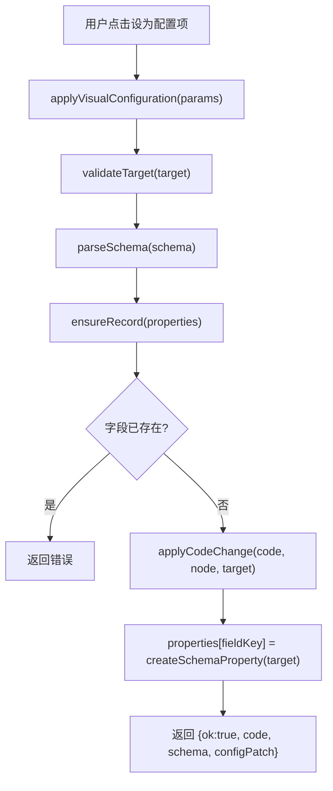
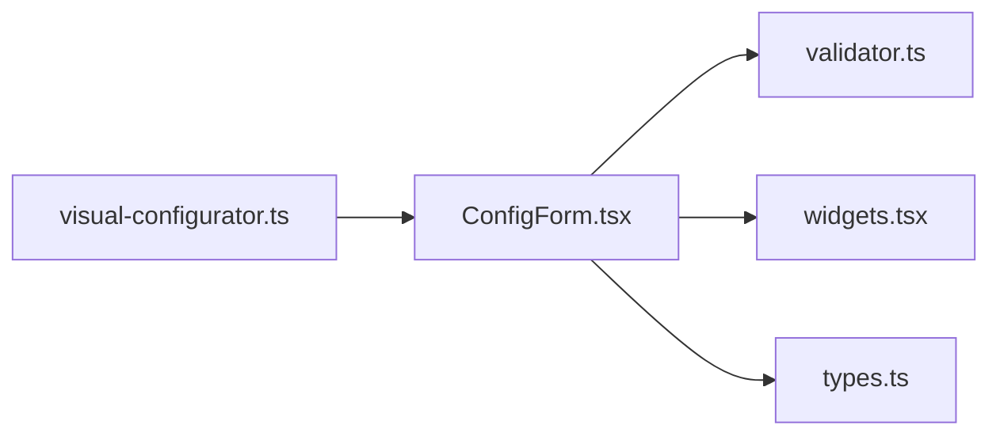

# 属性面板联动

<cite>
**本文引用的文件**
- [packages/demo-ui/src/ConfigForm.tsx](file://packages/demo-ui/src/ConfigForm.tsx)
- [packages/demo-ui/src/types.ts](file://packages/demo-ui/src/types.ts)
- [packages/demo-ui/src/widgets.tsx](file://packages/demo-ui/src/widgets.tsx)
- [packages/demo-ui/src/validator.ts](file://packages/demo-ui/src/validator.ts)
- [docs/项目文档/创作端/04-配置与预览/技术/03_表单生成器.md](file://docs/项目文档/创作端/04-配置与预览/技术/03_表单生成器.md)
- [packages/author-site/src/lib/visual-configurator.ts](file://packages/author-site/src/lib/visual-configurator.ts)
- [packages/shared/src/validator.ts](file://packages/shared/src/validator.ts)
- [packages/agent-service/src/routes/validate.ts](file://packages/agent-service/src/routes/validate.ts)
</cite>

## 目录
1. [简介](#简介)
2. [项目结构](#项目结构)
3. [核心组件](#核心组件)
4. [架构总览](#架构总览)
5. [详细组件分析](#详细组件分析)
6. [依赖关系分析](#依赖关系分析)
7. [性能考虑](#性能考虑)
8. [故障排查指南](#故障排查指南)
9. [结论](#结论)
10. [附录](#附录)

## 简介
本文件围绕“属性面板联动机制”展开，系统性解析属性数据绑定、双向数据绑定与状态同步、基于 Schema 的表单自动生成与验证、响应式更新与性能优化、复杂控件开发与集成、以及国际化与主题定制能力。同时提供扩展开发示例与最佳实践，帮助读者快速理解并落地属性面板联动方案。

## 项目结构
本项目采用多包（monorepo）组织，属性面板与表单生成相关代码集中在 demo-ui 包中，并通过 author-site 与 agent-service 等模块完成可视化配置、校验与服务端交互。

图表来源
- [packages/demo-ui/src/ConfigForm.tsx](file://packages/demo-ui/src/ConfigForm.tsx)
- [packages/demo-ui/src/widgets.tsx](file://packages/demo-ui/src/widgets.tsx)
- [packages/demo-ui/src/validator.ts](file://packages/demo-ui/src/validator.ts)
- [packages/demo-ui/src/types.ts](file://packages/demo-ui/src/types.ts)
- [packages/author-site/src/lib/visual-configurator.ts](file://packages/author-site/src/lib/visual-configurator.ts)
- [packages/shared/src/validator.ts](file://packages/shared/src/validator.ts)
- [packages/agent-service/src/routes/validate.ts](file://packages/agent-service/src/routes/validate.ts)

章节来源
- [docs/项目文档/创作端/04-配置与预览/技术/03_表单生成器.md](file://docs/项目文档/创作端/04-配置与预览/技术/03_表单生成器.md)

## 核心组件
- ConfigForm：基于 JSON Schema 的轻量表单渲染器，负责字段分组、可见性控制、默认值补齐、排序与定位控件、备注编辑与 Schema 写回。
- widgets：自定义控件集合，包括图片上传、颜色选择、富文本等。
- validator：Schema 元信息提取工具（排序、定位、预览尺寸等）。
- types：类型定义，包含 DemoMeta、PositionableConfig、ConfigFormProps 等。
- visual-configurator：可视化配置写入器，将用户操作转换为对 Schema 和源码的变更。
- shared/validator 与 agent-service/routes/validate：服务端校验入口与结果格式化。

章节来源
- [packages/demo-ui/src/ConfigForm.tsx](file://packages/demo-ui/src/ConfigForm.tsx)
- [packages/demo-ui/src/widgets.tsx](file://packages/demo-ui/src/widgets.tsx)
- [packages/demo-ui/src/validator.ts](file://packages/demo-ui/src/validator.ts)
- [packages/demo-ui/src/types.ts](file://packages/demo-ui/src/types.ts)
- [packages/author-site/src/lib/visual-configurator.ts](file://packages/author-site/src/lib/visual-configurator.ts)
- [packages/shared/src/validator.ts](file://packages/shared/src/validator.ts)
- [packages/agent-service/src/routes/validate.ts](file://packages/agent-service/src/routes/validate.ts)

## 架构总览
属性面板联动的整体流程如下：
- 输入：JSON Schema（含 $demo 元信息与 properties 字段定义）
- 解析：ConfigForm 解析 Schema，构建 FieldGroup，计算可见性与默认值
- 渲染：根据 ui:widget/format/type 三层映射渲染控件
- 交互：用户修改触发 onChange，父层合并数据并驱动预览区更新
- 写回：通过 onSchemaChange 回调持久化 Schema（如备注、新增字段）
- 校验：前端/后端联合校验 Schema 与代码一致性

图表来源
- [packages/demo-ui/src/ConfigForm.tsx](file://packages/demo-ui/src/ConfigForm.tsx)
- [docs/项目文档/创作端/04-配置与预览/技术/03_表单生成器.md](file://docs/项目文档/创作端/04-配置与预览/技术/03_表单生成器.md)

## 详细组件分析

### 数据绑定与状态同步
- 双向绑定：字段级 onChange 将变更以 {key, value} 形式上报父组件；父组件合并到 configData 后作为 initialData 回传，实现“面板—预览”双向同步。
- 等价判断：内部使用深度相等比较，避免无意义重渲染。
- Schema 变更重置：当 schema 变化时，通过 key={schema} 强制重建实例，并以新的 default 值补齐缺失字段，保证 UI 与规则一致。

图表来源
- [packages/demo-ui/src/ConfigForm.tsx](file://packages/demo-ui/src/ConfigForm.tsx)

章节来源
- [packages/demo-ui/src/ConfigForm.tsx](file://packages/demo-ui/src/ConfigForm.tsx)
- [docs/项目文档/创作端/04-配置与预览/技术/03_表单生成器.md](file://docs/项目文档/创作端/04-配置与预览/技术/03_表单生成器.md)

### 表单自动生成器（基于 Schema）
- 三层映射体系：ui:widget > format > type，优先显式覆盖，其次语义推断，最后类型回退。
- 分组与可见性：支持 visibleWhen 条件显示与分类筛选。
- 备注系统：字段级 $demo.note 读写，保存时通过 onSchemaChange 写回完整 Schema。
- 布局控件：$demo.orderable/orderableHorizontal/positionable 驱动排序与定位控件。

图表来源
- [packages/demo-ui/src/ConfigForm.tsx](file://packages/demo-ui/src/ConfigForm.tsx)
- [packages/demo-ui/src/widgets.tsx](file://packages/demo-ui/src/widgets.tsx)

章节来源
- [packages/demo-ui/src/ConfigForm.tsx](file://packages/demo-ui/src/ConfigForm.tsx)
- [packages/demo-ui/src/widgets.tsx](file://packages/demo-ui/src/widgets.tsx)
- [docs/项目文档/创作端/04-配置与预览/技术/03_表单生成器.md](file://docs/项目文档/创作端/04-配置与预览/技术/03_表单生成器.md)

### 验证机制
- 前端：基于 Schema 的必填、范围、长度、枚举等内置校验；自定义 customValidate 可扩展业务规则。
- 后端：/api/validate 与 validate_demo 路由统一调用 shared/validator.validateAll，返回结构化校验结果。

图表来源
- [packages/shared/src/validator.ts](file://packages/shared/src/validator.ts)
- [packages/agent-service/src/routes/validate.ts](file://packages/agent-service/src/routes/validate.ts)

章节来源
- [packages/shared/src/validator.ts](file://packages/shared/src/validator.ts)
- [packages/agent-service/src/routes/validate.ts](file://packages/agent-service/src/routes/validate.ts)
- [docs/项目文档/创作端/04-配置与预览/技术/03_表单生成器.md](file://docs/项目文档/创作端/04-配置与预览/技术/03_表单生成器.md)

### 可视化配置写入（属性面板→Schema/代码）
- applyVisualConfiguration：校验目标字段是否存在、解析 Schema、应用代码变更、追加 properties 与 required、返回 code/schema/configPatch。
- 标题与键名生成：titleFromText、toCamelKey、pinyinFallback 确保可读且稳定的字段命名。

图表来源
- [packages/author-site/src/lib/visual-configurator.ts](file://packages/author-site/src/lib/visual-configurator.ts)

章节来源
- [packages/author-site/src/lib/visual-configurator.ts](file://packages/author-site/src/lib/visual-configurator.ts)

### 复杂属性组件与自定义控件集成
- 控件注册：通过 ui:widget 或 format 指定控件类型，ConfigForm 内部按策略渲染对应组件。
- 图片上传：FileUploadWidget 支持大小与尺寸校验、本地/会话资源路径处理、替换与删除。
- 多图列表：ImageListWidget 支持对象数组与字符串数组兼容模式。
- 颜色与富文本：ColorPickerWidget、RichTextWidget 提供直观编辑体验。

章节来源
- [packages/demo-ui/src/widgets.tsx](file://packages/demo-ui/src/widgets.tsx)
- [packages/demo-ui/src/ConfigForm.tsx](file://packages/demo-ui/src/ConfigForm.tsx)
- [docs/项目文档/创作端/04-配置与预览/技术/03_表单生成器.md](file://docs/项目文档/创作端/04-配置与预览/技术/03_表单生成器.md)

### 国际化与主题定制
- 国际化：当前仓库未提供 i18n 框架集成；建议通过外部 i18n 库在字段 title/description 与提示文案处进行动态替换。
- 主题定制：组件基于 Tailwind 类名与 CSS 变量（如 text-foreground、bg-muted），可通过主题变量与样式覆盖实现深色/品牌色适配。

[本节为通用指导，不直接分析具体文件]

## 依赖关系分析
- ConfigForm 依赖 validator 提取 $demo 元信息（orderable/orderableHorizontal/positionable/previewSize）。
- ConfigForm 依赖 widgets 中的自定义控件进行渲染。
- types 提供全局类型契约，确保前后端与组件间数据结构一致。
- visual-configurator 与 ConfigForm 协同，前者负责“写回”，后者负责“读取与展示”。

图表来源
- [packages/demo-ui/src/ConfigForm.tsx](file://packages/demo-ui/src/ConfigForm.tsx)
- [packages/demo-ui/src/validator.ts](file://packages/demo-ui/src/validator.ts)
- [packages/demo-ui/src/widgets.tsx](file://packages/demo-ui/src/widgets.tsx)
- [packages/demo-ui/src/types.ts](file://packages/demo-ui/src/types.ts)
- [packages/author-site/src/lib/visual-configurator.ts](file://packages/author-site/src/lib/visual-configurator.ts)

章节来源
- [packages/demo-ui/src/ConfigForm.tsx](file://packages/demo-ui/src/ConfigForm.tsx)
- [packages/demo-ui/src/validator.ts](file://packages/demo-ui/src/validator.ts)
- [packages/demo-ui/src/widgets.tsx](file://packages/demo-ui/src/widgets.tsx)
- [packages/demo-ui/src/types.ts](file://packages/demo-ui/src/types.ts)
- [packages/author-site/src/lib/visual-configurator.ts](file://packages/author-site/src/lib/visual-configurator.ts)

## 性能考虑
- 等价比较：使用深度相等函数避免重复渲染。
- 缓存解析：useMemo 缓存 Schema 解析结果与可见字段组。
- 最小化更新：onChange 仅上报变更字段，父层增量合并。
- 可控重建：Schema 变化时使用 key 强制重建，避免内部状态不一致导致的多次无效更新。

章节来源
- [packages/demo-ui/src/ConfigForm.tsx](file://packages/demo-ui/src/ConfigForm.tsx)
- [docs/项目文档/创作端/04-配置与预览/技术/03_表单生成器.md](file://docs/项目文档/创作端/04-配置与预览/技术/03_表单生成器.md)

## 故障排查指南
- 表单不更新：检查父组件是否正确传入 new schema 并使用 key={schema} 强制重建；确认初始数据合并逻辑是否返回等价对象导致跳过更新。
- 图片上传失败：确认 sessionId 与上传接口可达；检查文件大小与尺寸限制；查看控制台错误与对话框提示。
- 校验报错：使用 /api/validate 获取结构化错误；对照 ValidationResult 中的 json_syntax 与 props 校验问题修复 Schema。
- 备注未生效：确认 onSchemaChange 回调是否被正确持久化；注意删除空 $demo 对象的清理逻辑。

章节来源
- [packages/demo-ui/src/ConfigForm.tsx](file://packages/demo-ui/src/ConfigForm.tsx)
- [packages/demo-ui/src/widgets.tsx](file://packages/demo-ui/src/widgets.tsx)
- [packages/shared/src/validator.ts](file://packages/shared/src/validator.ts)
- [packages/agent-service/src/routes/validate.ts](file://packages/agent-service/src/routes/validate.ts)

## 结论
属性面板联动以 JSON Schema 为核心契约，结合 ConfigForm 的轻量渲染与 widgets 的可插拔控件，实现了“声明即界面”的高效开发体验。通过 key 强制重建、等价比较与增量更新，保证了响应式与性能的平衡；配合可视化配置写入与统一校验链路，形成从“配置—渲染—预览—写回—校验”的闭环。

## 附录

### 扩展开发示例与最佳实践
- 新增自定义控件：
  - 在 widgets.tsx 中实现控件组件，遵循 value/onChange 约定。
  - 在 ConfigForm 的 FieldRenderer 中增加匹配分支或通过 ui:widget 注册。
- 新增布局能力：
  - 在 validator.ts 中扩展 $demo 元信息解析（如新增 orderableVertical）。
  - 在 ConfigForm 中新增对应控件并接入 onChange/onSchemaChange。
- 国际化：
  - 在字段 title/description 与控件提示处引入 i18n 函数，避免硬编码文案。
- 主题定制：
  - 通过 CSS 变量与 Tailwind 主题覆盖，统一色彩与间距。

章节来源
- [packages/demo-ui/src/widgets.tsx](file://packages/demo-ui/src/widgets.tsx)
- [packages/demo-ui/src/ConfigForm.tsx](file://packages/demo-ui/src/ConfigForm.tsx)
- [packages/demo-ui/src/validator.ts](file://packages/demo-ui/src/validator.ts)
- [docs/项目文档/创作端/04-配置与预览/技术/03_表单生成器.md](file://docs/项目文档/创作端/04-配置与预览/技术/03_表单生成器.md)