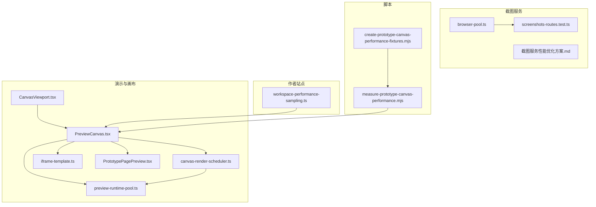
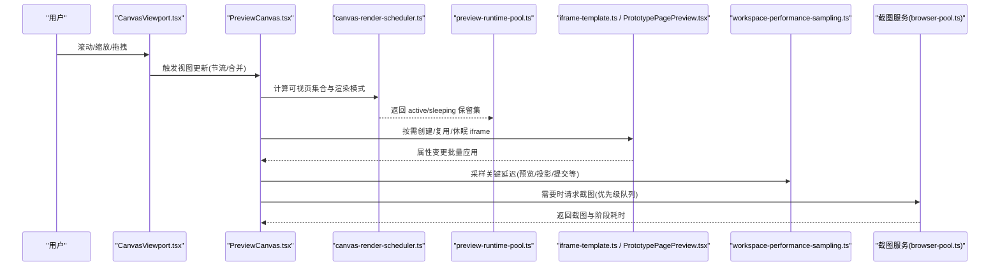
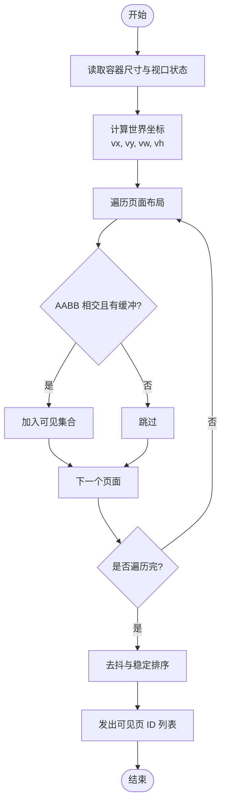
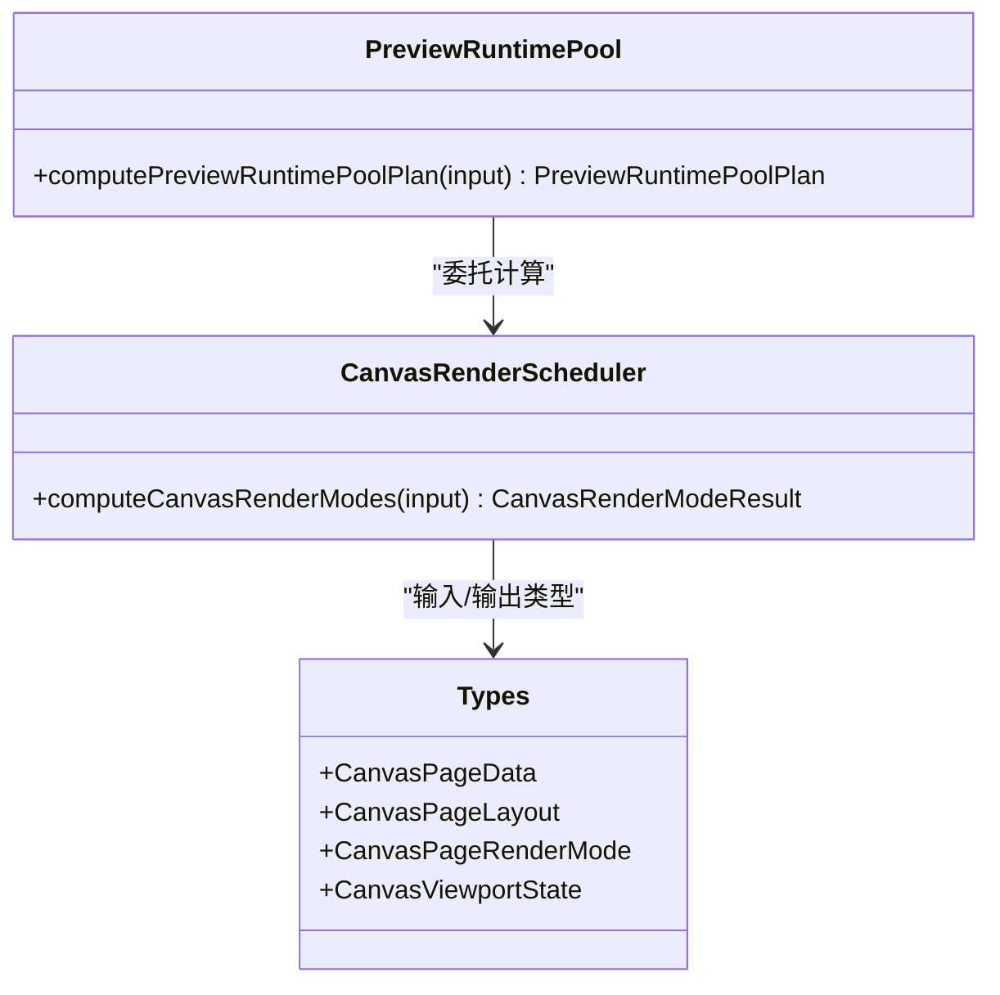
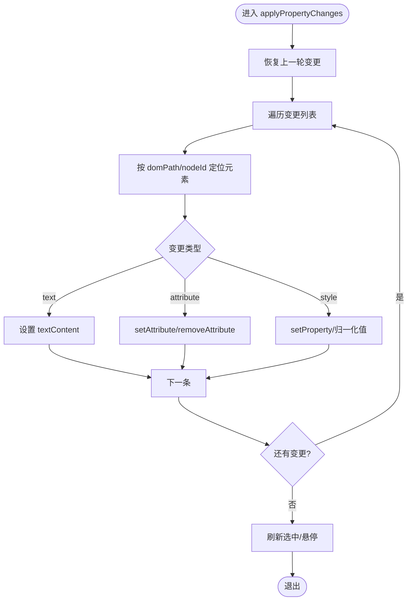
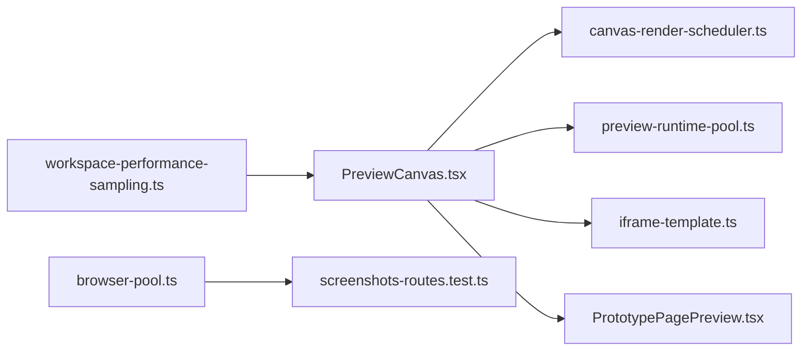

# 性能优化策略

<cite>
**本文引用的文件**   
- [canvas-render-scheduler.ts](file://packages/demo-ui/src/canvas-render-scheduler.ts)
- [preview-runtime-pool.ts](file://packages/demo-ui/src/preview-runtime-pool.ts)
- [PreviewCanvas.tsx](file://packages/demo-ui/src/PreviewCanvas.tsx)
- [CanvasViewport.tsx](file://packages/demo-ui/src/CanvasViewport.tsx)
- [iframe-template.ts](file://packages/demo-ui/src/iframe-template.ts)
- [PrototypePagePreview.tsx](file://packages/demo-ui/src/PrototypePagePreview.tsx)
- [workspace-performance-sampling.ts](file://packages/author-site/src/lib/workspace-performance-sampling.ts)
- [measure-prototype-canvas-performance.mjs](file://scripts/development/measure-prototype-canvas-performance.mjs)
- [create-prototype-canvas-performance-fixtures.mjs](file://scripts/development/create-prototype-canvas-performance-fixtures.mjs)
- [screenshots-routes.test.ts](file://packages/screenshot-service/tests/screenshots-routes.test.ts)
- [browser-pool.ts](file://packages/screenshot-service/src/utils/browser-pool.ts)
- [screenshot-service 截图服务性能优化方案.md](file://docs/项目文档/创作端/04-配置与预览/技术/09_截图服务性能优化方案.md)
</cite>

## 目录
1. [引言](#引言)
2. [项目结构](#项目结构)
3. [核心组件](#核心组件)
4. [架构总览](#架构总览)
5. [详细组件分析](#详细组件分析)
6. [依赖关系分析](#依赖关系分析)
7. [性能考量](#性能考量)
8. [故障排查指南](#故障排查指南)
9. [结论](#结论)
10. [附录](#附录)

## 引言
本文件围绕“性能优化策略”展开，聚焦以下主题：
- 虚拟滚动与可视区域计算、节点复用与滚动性能优化
- 增量更新算法：差异计算、最小化 DOM 操作、渲染批处理
- 内存管理：对象池、垃圾回收优化与大对象处理
- 性能监控与诊断：指标采集、SLO 报告、瓶颈分析与优化建议
- 移动端性能优化与浏览器兼容性
- 性能测试方法与基准测试框架使用

## 项目结构
本项目在多个包中实现了与性能相关的子系统：
- demo-ui：画布渲染调度、运行时池、可视区域计算、属性变更应用等
- author-site：工作区性能采样与 SLO 报告
- screenshot-service：截图服务的优先级队列、并发控制与阶段耗时统计
- scripts：性能测量脚本与基线数据生成

图表来源
- [PreviewCanvas.tsx:125-1854](file://packages/demo-ui/src/PreviewCanvas.tsx#L125-L1854)
- [CanvasViewport.tsx:92-119](file://packages/demo-ui/src/CanvasViewport.tsx#L92-L119)
- [canvas-render-scheduler.ts:1-163](file://packages/demo-ui/src/canvas-render-scheduler.ts#L1-L163)
- [preview-runtime-pool.ts:1-56](file://packages/demo-ui/src/preview-runtime-pool.ts#L1-L56)
- [iframe-template.ts:284-425](file://packages/demo-ui/src/iframe-template.ts#L284-L425)
- [PrototypePagePreview.tsx:220-244](file://packages/demo-ui/src/PrototypePagePreview.tsx#L220-L244)
- [workspace-performance-sampling.ts:1-280](file://packages/author-site/src/lib/workspace-performance-sampling.ts#L1-L280)
- [browser-pool.ts:263-313](file://packages/screenshot-service/src/utils/browser-pool.ts#L263-L313)
- [screenshots-routes.test.ts:251-532](file://packages/screenshot-service/tests/screenshots-routes.test.ts#L251-L532)
- [截图服务性能优化方案.md:162-186](file://docs/项目文档/创作端/04-配置与预览/技术/09_截图服务性能优化方案.md#L162-L186)
- [measure-prototype-canvas-performance.mjs:1-193](file://scripts/development/measure-prototype-canvas-performance.mjs#L1-L193)
- [create-prototype-canvas-performance-fixtures.mjs:192-231](file://scripts/development/create-prototype-canvas-performance-fixtures.mjs#L192-L231)

章节来源
- [PreviewCanvas.tsx:125-1854](file://packages/demo-ui/src/PreviewCanvas.tsx#L125-L1854)
- [canvas-render-scheduler.ts:1-163](file://packages/demo-ui/src/canvas-render-scheduler.ts#L1-L163)
- [preview-runtime-pool.ts:1-56](file://packages/demo-ui/src/preview-runtime-pool.ts#L1-L56)
- [workspace-performance-sampling.ts:1-280](file://packages/author-site/src/lib/workspace-performance-sampling.ts#L1-L280)
- [browser-pool.ts:263-313](file://packages/screenshot-service/src/utils/browser-pool.ts#L263-L313)
- [measure-prototype-canvas-performance.mjs:1-193](file://scripts/development/measure-prototype-canvas-performance.mjs#L1-L193)
- [create-prototype-canvas-performance-fixtures.mjs:192-231](file://scripts/development/create-prototype-canvas-performance-fixtures.mjs#L192-L231)

## 核心组件
- 可视区域计算与可见页集合：基于视口与页面布局的 AABB 相交检测，并支持缓冲区域以减少抖动。
- 渲染模式调度：根据可见性、编辑态、截图缓存与最近访问频率，将页面分配为 iframe、sleeping-iframe、screenshot、prototype、loading 等模式。
- 运行时池计划：统一返回 active 与 sleeping 保留集合，便于上层进行资源生命周期管理。
- 属性变更批量应用：按 kind 分类（文本、属性、样式）合并写入，避免频繁重排。
- 性能采样与 SLO：环形缓冲区存储延迟样本，计算 p50/p95/p99 并与目标对比。
- 截图服务优先级队列：按优先级排序并发执行，记录各阶段耗时与命中情况。

章节来源
- [PreviewCanvas.tsx:125-1854](file://packages/demo-ui/src/PreviewCanvas.tsx#L125-L1854)
- [canvas-render-scheduler.ts:1-163](file://packages/demo-ui/src/canvas-render-scheduler.ts#L1-L163)
- [preview-runtime-pool.ts:1-56](file://packages/demo-ui/src/preview-runtime-pool.ts#L1-L56)
- [iframe-template.ts:284-425](file://packages/demo-ui/src/iframe-template.ts#L284-L425)
- [PrototypePagePreview.tsx:220-244](file://packages/demo-ui/src/PrototypePagePreview.tsx#L220-L244)
- [workspace-performance-sampling.ts:1-280](file://packages/author-site/src/lib/workspace-performance-sampling.ts#L1-L280)
- [browser-pool.ts:263-313](file://packages/screenshot-service/src/utils/browser-pool.ts#L263-L313)

## 架构总览
下图展示了从用户交互到渲染调度的关键路径，以及截图服务与性能采样的协作关系。

图表来源
- [CanvasViewport.tsx:92-119](file://packages/demo-ui/src/CanvasViewport.tsx#L92-L119)
- [PreviewCanvas.tsx:125-1854](file://packages/demo-ui/src/PreviewCanvas.tsx#L125-L1854)
- [canvas-render-scheduler.ts:1-163](file://packages/demo-ui/src/canvas-render-scheduler.ts#L1-L163)
- [preview-runtime-pool.ts:1-56](file://packages/demo-ui/src/preview-runtime-pool.ts#L1-L56)
- [iframe-template.ts:284-425](file://packages/demo-ui/src/iframe-template.ts#L284-L425)
- [PrototypePagePreview.tsx:220-244](file://packages/demo-ui/src/PrototypePagePreview.tsx#L220-L244)
- [workspace-performance-sampling.ts:1-280](file://packages/author-site/src/lib/workspace-performance-sampling.ts#L1-L280)
- [browser-pool.ts:263-313](file://packages/screenshot-service/src/utils/browser-pool.ts#L263-L313)

## 详细组件分析

### 可视区域计算与虚拟滚动
- 可视区域判定：以视口中心与缩放因子换算世界坐标，结合页面布局矩形与缓冲距离判断是否可见。
- 可见集合去抖：通过比较前后列表一致性，避免不必要的回调与渲染。
- 与渲染模式联动：仅对可见页进入更高成本渲染模式（如 iframe），其余降级为 loading 或 screenshot。

图表来源
- [PreviewCanvas.tsx:125-1854](file://packages/demo-ui/src/PreviewCanvas.tsx#L125-L1854)

章节来源
- [PreviewCanvas.tsx:125-1854](file://packages/demo-ui/src/PreviewCanvas.tsx#L125-L1854)

### 渲染模式调度与节点复用
- 模式选择：
  - prototype/sketch-scene：小体量原型优先静态渲染或截图；编辑态强制 prototype。
  - high-fidelity/react：可见且非编辑态时，按距视口中心距离排序，分配有限数量的 iframe；未分配但近期访问过的进入 sleeping-iframe；其余为 loading。
- 运行时池：将 active 与 sleeping 页面合并为 retainedRuntimePageIds，供上层统一管理生命周期。
- 阈值控制：当页面数低于阈值时，直接启用全部 iframe，避免截图开销。

图表来源
- [canvas-render-scheduler.ts:1-163](file://packages/demo-ui/src/canvas-render-scheduler.ts#L1-L163)
- [preview-runtime-pool.ts:1-56](file://packages/demo-ui/src/preview-runtime-pool.ts#L1-L56)
- [types.ts:166-246](file://packages/demo-ui/src/types.ts#L166-L246)

章节来源
- [canvas-render-scheduler.ts:1-163](file://packages/demo-ui/src/canvas-render-scheduler.ts#L1-L163)
- [preview-runtime-pool.ts:1-56](file://packages/demo-ui/src/preview-runtime-pool.ts#L1-L56)
- [types.ts:166-246](file://packages/demo-ui/src/types.ts#L166-L246)

### 增量更新与最小化 DOM 操作
- 变更分类：文本(text)、属性(attribute)、样式(style)。
- 批量应用：先恢复上一轮变更，再集中应用本轮变更，减少多次重排。
- 元素定位：支持通过 domPath 或 nodeId 快速定位目标元素。
- 视觉反馈：应用后刷新选中与悬停高亮，保证交互一致性。

图表来源
- [iframe-template.ts:284-425](file://packages/demo-ui/src/iframe-template.ts#L284-L425)
- [PrototypePagePreview.tsx:220-244](file://packages/demo-ui/src/PrototypePagePreview.tsx#L220-L244)

章节来源
- [iframe-template.ts:284-425](file://packages/demo-ui/src/iframe-template.ts#L284-L425)
- [PrototypePagePreview.tsx:220-244](file://packages/demo-ui/src/PrototypePagePreview.tsx#L220-L244)

### 滚动与交互性能优化
- requestAnimationFrame 合并：将高频滚动事件导致的视图更新合并到下一帧，避免重复计算。
- will-change 提示：交互期间开启 will-change transform，提升合成层性能；交互结束后关闭。
- 防抖与节流：对容器尺寸测量与可见集合变化做去抖，降低 ResizeObserver 带来的抖动。

章节来源
- [CanvasViewport.tsx:92-119](file://packages/demo-ui/src/CanvasViewport.tsx#L92-L119)
- [PreviewCanvas.tsx:1809-1854](file://packages/demo-ui/src/PreviewCanvas.tsx#L1809-L1854)

### 内存管理与大对象处理
- 环形缓冲区：每个指标独立固定容量 Float64Array，避免无限增长导致泄漏。
- 只读采样：纯内存采样，不持久化，页面刷新即清空。
- 截图服务侧：
  - 优先级队列与并发上限控制，避免瞬时峰值占用过多内存。
  - 空截图检测与缓存命中逻辑，减少无效渲染与 IO。
  - 阶段耗时聚合，帮助识别内存热点（如 pageCreateMs）。

章节来源
- [workspace-performance-sampling.ts:1-280](file://packages/author-site/src/lib/workspace-performance-sampling.ts#L1-L280)
- [screenshots-routes.test.ts:251-532](file://packages/screenshot-service/tests/screenshots-routes.test.ts#L251-L532)
- [browser-pool.ts:263-313](file://packages/screenshot-service/src/utils/browser-pool.ts#L263-L313)

### 性能监控与诊断工具
- 工作区性能采样器：
  - 指标包括自动保存防抖、队列等待、提交延迟、远程更新延迟、草稿预览延迟、投影延迟、重连收敛、Canonical 物化延迟。
  - 提供 getSLOReport 汇总 p95 与目标对比，辅助回归与发布门禁。
- 截图服务指标：
  - 记录 queueWaitMs、renderMs 及各阶段耗时，用于定位瓶颈。
- 端到端测量脚本：
  - 采集首屏时间、画布可见时间、空闲与交互下的帧间隔分布、DOM 数量与内存信息，输出 JSON 报告用于对比。

章节来源
- [workspace-performance-sampling.ts:1-280](file://packages/author-site/src/lib/workspace-performance-sampling.ts#L1-L280)
- [screenshots-routes.test.ts:251-532](file://packages/screenshot-service/tests/screenshots-routes.test.ts#L251-L532)
- [measure-prototype-canvas-performance.mjs:1-193](file://scripts/development/measure-prototype-canvas-performance.mjs#L1-L193)

### 移动端性能优化与浏览器兼容性
- 移动端适配要点：
  - 合理设置最大活跃 iframe 与休眠 iframe 数量，避免低端设备 OOM。
  - 利用截图替代复杂 React 页面，降低主线程压力。
  - 谨慎使用 will-change，仅在必要交互窗口期开启。
- 兼容性考虑：
  - PointerEvent 与 requestAnimationFrame 在不同环境的行为差异需在测试中覆盖。
  - 对不支持 performance.memory 的环境需回退计数策略。

章节来源
- [preview-runtime-pool.ts:1-56](file://packages/demo-ui/src/preview-runtime-pool.ts#L1-L56)
- [canvas-render-scheduler.ts:1-163](file://packages/demo-ui/src/canvas-render-scheduler.ts#L1-L163)
- [measure-prototype-canvas-performance.mjs:1-193](file://scripts/development/measure-prototype-canvas-performance.mjs#L1-L193)

### 性能测试方法与基准测试框架
- 基线项目生成：
  - 自动生成包含多页 HTML/CSS 原型或高保真 React 页面的项目，用于稳定复现实验场景。
- 端到端测量：
  - 打开画布后等待页面加载完成，采集空闲与交互时的帧间隔分布、DOM 数量与内存，输出 JSON 报告。
- 截图服务压测：
  - 通过路由测试验证批量任务优先级排序与指标汇总，确保队列与并发策略有效。

章节来源
- [create-prototype-canvas-performance-fixtures.mjs:192-231](file://scripts/development/create-prototype-canvas-performance-fixtures.mjs#L192-L231)
- [measure-prototype-canvas-performance.mjs:1-193](file://scripts/development/measure-prototype-canvas-performance.mjs#L1-L193)
- [screenshots-routes.test.ts:251-532](file://packages/screenshot-service/tests/screenshots-routes.test.ts#L251-L532)

## 依赖关系分析
- PreviewCanvas 依赖 canvas-render-scheduler 计算渲染模式，并驱动 preview-runtime-pool 进行运行时生命周期管理。
- 属性变更应用由 iframe-template 与 PrototypePagePreview 实现，被上层调用以最小化 DOM 操作。
- 性能采样器独立于渲染链路，通过回调注入关键延迟点，形成闭环观测。
- 截图服务通过优先级队列与并发控制影响整体吞吐与延迟。

图表来源
- [PreviewCanvas.tsx:125-1854](file://packages/demo-ui/src/PreviewCanvas.tsx#L125-L1854)
- [canvas-render-scheduler.ts:1-163](file://packages/demo-ui/src/canvas-render-scheduler.ts#L1-L163)
- [preview-runtime-pool.ts:1-56](file://packages/demo-ui/src/preview-runtime-pool.ts#L1-L56)
- [iframe-template.ts:284-425](file://packages/demo-ui/src/iframe-template.ts#L284-L425)
- [PrototypePagePreview.tsx:220-244](file://packages/demo-ui/src/PrototypePagePreview.tsx#L220-L244)
- [workspace-performance-sampling.ts:1-280](file://packages/author-site/src/lib/workspace-performance-sampling.ts#L1-L280)
- [browser-pool.ts:263-313](file://packages/screenshot-service/src/utils/browser-pool.ts#L263-L313)
- [screenshots-routes.test.ts:251-532](file://packages/screenshot-service/tests/screenshots-routes.test.ts#L251-L532)

## 性能考量
- 渲染模式切换：
  - 低页数场景下禁用截图，直接启用 iframe，减少额外开销。
  - 高页数场景下严格限制活跃 iframe 数量，利用 sleeping-iframe 与截图兜底。
- 增量更新：
  - 批量应用变更，避免逐条写入引发的重排与重绘。
- 内存控制：
  - 环形缓冲区固定容量，避免采样数据膨胀。
  - 截图服务并发上限与空截图检测，防止内存尖峰。
- 可观测性：
  - 通过 SLO 报告与阶段耗时，持续追踪回归与瓶颈。

[本节为通用指导，无需具体文件引用]

## 故障排查指南
- 卡顿与掉帧：
  - 检查是否频繁触发可见集合变化，确认去抖与稳定排序生效。
  - 评估 will-change 的使用范围与时长。
- 内存持续增长：
  - 核查采样器是否被重置，截图服务是否存在未释放资源。
  - 关注 pageCreateMs 占比，必要时采用浏览器预热策略。
- 截图异常：
  - 校验空截图检测阈值与缓存命中逻辑。
  - 观察优先级队列是否被阻塞，调整并发上限。

章节来源
- [CanvasViewport.tsx:92-119](file://packages/demo-ui/src/CanvasViewport.tsx#L92-L119)
- [workspace-performance-sampling.ts:1-280](file://packages/author-site/src/lib/workspace-performance-sampling.ts#L1-L280)
- [screenshots-routes.test.ts:251-532](file://packages/screenshot-service/tests/screenshots-routes.test.ts#L251-L532)
- [截图服务性能优化方案.md:162-186](file://docs/项目文档/创作端/04-配置与预览/技术/09_截图服务性能优化方案.md#L162-L186)

## 结论
通过可视区域计算、渲染模式调度、运行时池与增量更新机制，项目在大规模页面场景下实现了稳定的交互体验与可控的资源占用。配合性能采样与截图服务指标，能够持续发现并修复性能回归。建议在移动端与低端设备上进一步收紧活跃 iframe 配额，并结合截图与原型渲染策略达成更优的平衡。

[本节为总结，无需具体文件引用]

## 附录
- 术语说明：
  - 可视区域：当前视口经缩放与平移后的世界坐标矩形。
  - 渲染模式：页面在当前上下文中的呈现方式（iframe、sleeping-iframe、screenshot、prototype、loading）。
  - 运行时池：对活跃与休眠运行时的统一保留集合，用于生命周期管理。
- 相关参考：
  - 截图服务优化方案中对浏览器预热与 page/context 复用的权衡与建议。

章节来源
- [截图服务性能优化方案.md:162-186](file://docs/项目文档/创作端/04-配置与预览/技术/09_截图服务性能优化方案.md#L162-L186)