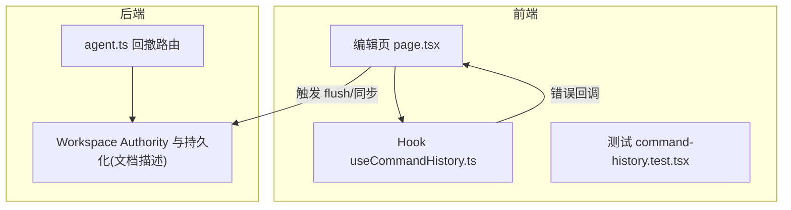
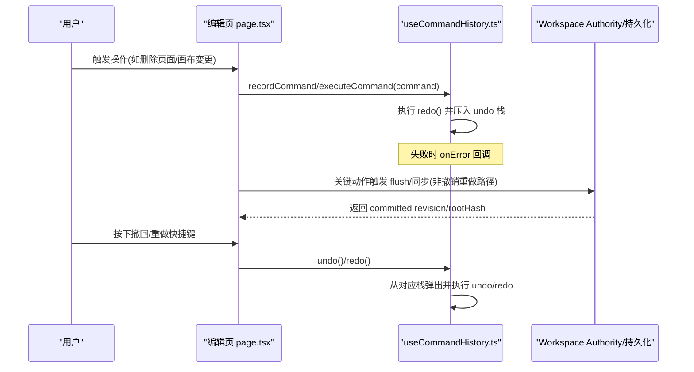
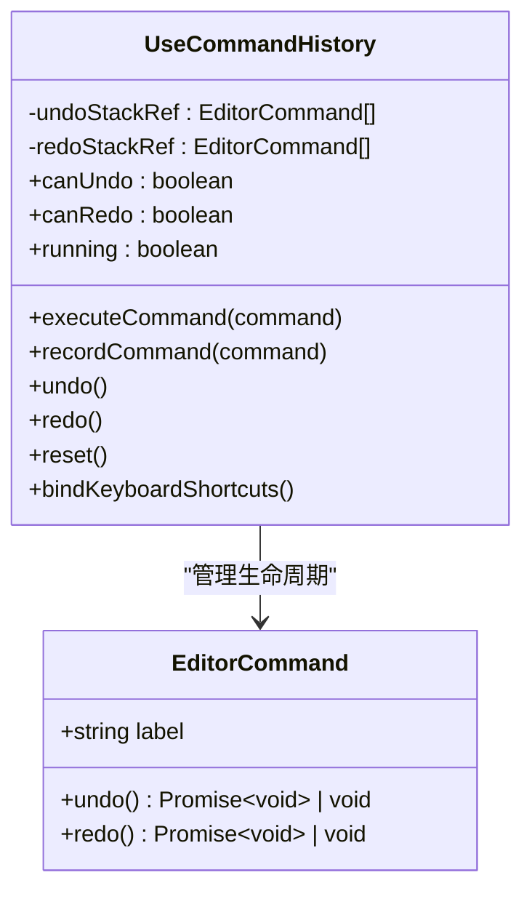
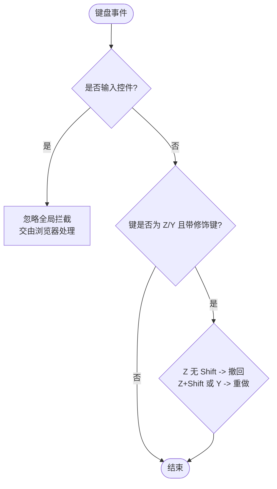
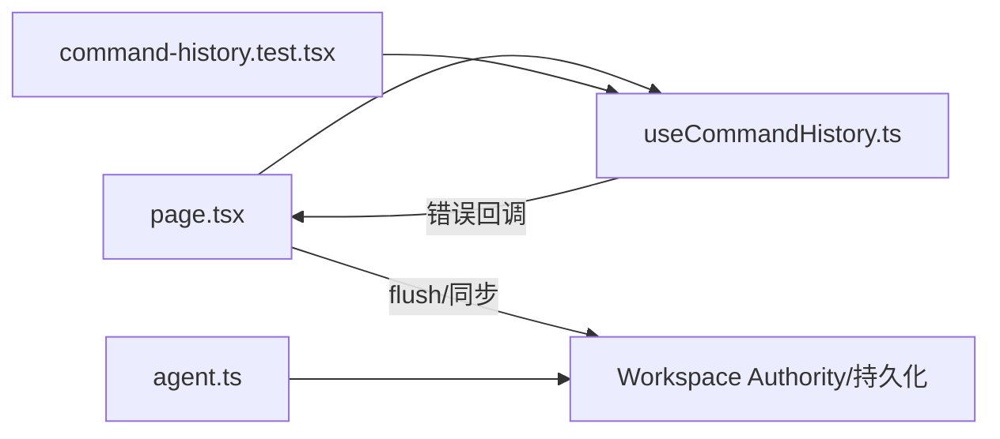

# 撤销重做系统

<cite>
**本文引用的文件**
- [useCommandHistory.ts](file://packages/author-site/src/app/demo/[id]/edit/hooks/useCommandHistory.ts)
- [command-history.test.tsx](file://packages/author-site/src/app/demo/[id]/edit/__tests__/command-history.test.tsx)
- [page.tsx](file://packages/author-site/src/app/demo/[id]/edit/page.tsx)
- [11_实时保存与协同编辑.md](file://docs/项目文档/创作端/03-项目管理/技术/11_实时保存与协同编辑.md)
- [workspace-performance-sampling.ts](file://packages/author-site/src/lib/workspace-performance-sampling.ts)
- [agent.ts](file://packages/agent-service/src/routes/agent.ts)
</cite>

## 目录
1. [简介](#简介)
2. [项目结构](#项目结构)
3. [核心组件](#核心组件)
4. [架构总览](#架构总览)
5. [详细组件分析](#详细组件分析)
6. [依赖关系分析](#依赖关系分析)
7. [性能考量](#性能考量)
8. [故障排查指南](#故障排查指南)
9. [结论](#结论)
10. [附录](#附录)

## 简介
本技术文档聚焦于撤销/重做系统的实现与扩展，围绕命令模式、执行器与历史记录管理、状态快照机制（深度克隆、增量快照与内存优化）、队列管理与时间旅行调试、批量操作与事务性更新、与实时协作的集成方案及冲突处理策略、自定义命令开发指南与性能监控方法展开。文档基于仓库中现有实现进行系统化梳理，并给出可落地的演进建议。

## 项目结构
撤销重做能力在前端以 React Hook 形式提供，封装了命令接口、栈式历史、键盘快捷键绑定与错误上报；在业务页面中注入该 Hook，统一拦截全局撤回/重做快捷键，并在输入控件内保留浏览器原生行为。后端通过 Workspace Authority 与持久化链路保障“提交即事实”，为撤销重做提供稳定的版本基线。

图示来源
- [page.tsx:650-672](file://packages/author-site/src/app/demo/[id]/edit/page.tsx#L650-L672)
- [useCommandHistory.ts:31-154](file://packages/author-site/src/app/demo/[id]/edit/hooks/useCommandHistory.ts#L31-L154)
- [agent.ts:396-430](file://packages/agent-service/src/routes/agent.ts#L396-L430)

章节来源
- [useCommandHistory.ts:1-155](file://packages/author-site/src/app/demo/[id]/edit/hooks/useCommandHistory.ts#L1-L155)
- [command-history.test.tsx:1-116](file://packages/author-site/src/app/demo/[id]/edit/__tests__/command-history.test.tsx#L1-L116)
- [page.tsx:650-849](file://packages/author-site/src/app/demo/[id]/edit/page.tsx#L650-L849)
- [11_实时保存与协同编辑.md:157-225](file://docs/项目文档/创作端/03-项目管理/技术/11_实时保存与协同编辑.md#L157-L225)

## 核心组件
- 命令接口 EditorCommand：包含 label、undo、redo，支持同步或异步执行。
- 历史记录管理器 useCommandHistory：维护 undo/redo 双栈，提供 executeCommand、recordCommand、undo、redo、reset、bindKeyboardShortcuts 等能力，并暴露 canUndo/canRedo/running 状态。
- 全局快捷键拦截：在非输入焦点下拦截 Cmd/Ctrl+Z、Cmd/Ctrl+Shift+Z、Cmd/Ctrl+Y，进入输入控件时交由浏览器原生处理。
- 错误上报 onError：在执行阶段捕获异常并回调上层 UI 提示。

章节来源
- [useCommandHistory.ts:5-13](file://packages/author-site/src/app/demo/[id]/edit/hooks/useCommandHistory.ts#L5-L13)
- [useCommandHistory.ts:31-154](file://packages/author-site/src/app/demo/[id]/edit/hooks/useCommandHistory.ts#L31-L154)
- [command-history.test.tsx:1-116](file://packages/author-site/src/app/demo/[id]/edit/__tests__/command-history.test.tsx#L1-L116)

## 架构总览
撤销重做系统由“前端命令层 + 后端权威提交”组成。前端负责用户交互、命令编排与本地历史；后端通过 Authority 保证写入原子性与一致性，从而让撤销重做的语义建立在稳定版本之上。

图示来源
- [page.tsx:650-672](file://packages/author-site/src/app/demo/[id]/edit/page.tsx#L650-L672)
- [useCommandHistory.ts:54-107](file://packages/author-site/src/app/demo/[id]/edit/hooks/useCommandHistory.ts#L54-L107)
- [11_实时保存与协同编辑.md:157-225](file://docs/项目文档/创作端/03-项目管理/技术/11_实时保存与协同编辑.md#L157-L225)

## 详细组件分析

### 命令接口与执行器
- 命令定义：EditorCommand 要求实现 undo/redo 两个幂等方法，label 用于诊断与提示。
- 执行器：
  - executeCommand：先执行 redo，成功后将命令压入 undo 栈并清空 redo 栈，失败则上报 onError。
  - recordCommand：直接记录命令到 undo 栈并清空 redo 栈，适用于已应用但需纳入历史的场景。
  - undo/redo：从对应栈弹出命令并执行，失败时将命令回推至原栈并上报 onError。
  - reset：清空双栈。
  - bindKeyboardShortcuts：注册全局快捷键监听，忽略输入框内的事件。

图示来源
- [useCommandHistory.ts:5-13](file://packages/author-site/src/app/demo/[id]/edit/hooks/useCommandHistory.ts#L5-L13)
- [useCommandHistory.ts:31-154](file://packages/author-site/src/app/demo/[id]/edit/hooks/useCommandHistory.ts#L31-L154)

章节来源
- [useCommandHistory.ts:31-154](file://packages/author-site/src/app/demo/[id]/edit/hooks/useCommandHistory.ts#L31-L154)
- [command-history.test.tsx:1-116](file://packages/author-site/src/app/demo/[id]/edit/__tests__/command-history.test.tsx#L1-L116)

### 全局快捷键与输入框兼容
- 快捷键规则：
  - 撤回：Ctrl/Cmd + Z
  - 重做：Ctrl/Cmd + Shift + Z 或 Ctrl/Cmd + Y
- 输入框兼容：当目标元素为 input/textarea/select/contenteditable 时，不拦截，保留浏览器原生行为。

图示来源
- [useCommandHistory.ts:15-29](file://packages/author-site/src/app/demo/[id]/edit/hooks/useCommandHistory.ts#L15-L29)
- [useCommandHistory.ts:115-128](file://packages/author-site/src/app/demo/[id]/edit/hooks/useCommandHistory.ts#L115-L128)

章节来源
- [useCommandHistory.ts:15-29](file://packages/author-site/src/app/demo/[id]/edit/hooks/useCommandHistory.ts#L15-L29)
- [useCommandHistory.ts:115-128](file://packages/author-site/src/app/demo/[id]/edit/hooks/useCommandHistory.ts#L115-L128)

### 状态快照机制与内存优化
- 当前实现：撤销重做仅维护命令闭包，不包含状态快照；适合轻量级、幂等操作的撤销重做。
- 深度克隆策略（建议）：对复杂对象使用结构化克隆或不可变数据流，避免共享引用导致副作用。
- 增量快照（建议）：按资源粒度记录差异（如 JSON Patch），减少内存占用与序列化开销。
- 内存优化（建议）：
  - 限制历史长度与过期清理策略
  - 大对象采用弱引用或延迟加载
  - 合并相邻同类操作以减少栈项数量

[本节为通用建议，不直接分析具体文件]

### 撤销重做与实时协作集成
- 会话内撤销重做：仅存在于当前浏览器会话，刷新后清空；长期追溯依赖自动检查点、命名版本、资源版本与发布快照。
- 权威提交：所有写操作经 Authority 提交，确保 committed 内容作为唯一事实源；撤销重做不应覆盖权威提交结果。
- 冲突处理：若外部漂移或并发修改导致不一致，Authority 会拒绝旧文本落盘并返回冲突码，前端应提示用户刷新或合并草稿。

章节来源
- [11_实时保存与协同编辑.md:157-225](file://docs/项目文档/创作端/03-项目管理/技术/11_实时保存与协同编辑.md#L157-L225)

### 批量操作与事务性更新
- 批量操作：建议将多个相关命令合并为一个复合命令，保持原子性与一致的用户体验。
- 事务性更新：结合 Authority 的多资源 mutation，确保同一批次变更要么全部成功，要么整体回滚。
- 失败恢复：在批量执行过程中任一子步骤失败，应回滚已执行部分并上报错误。

[本节为通用建议，不直接分析具体文件]

### 时间旅行调试
- 命令标签：利用 EditorCommand.label 标记操作类型，便于日志与回放。
- 错误上报：onError 回调携带错误、命令与阶段信息，辅助定位问题。
- 审计与指标：结合 Workspace Authority 的诊断事件与性能采样，构建时间旅行回放视图。

章节来源
- [useCommandHistory.ts:11-13](file://packages/author-site/src/app/demo/[id]/edit/hooks/useCommandHistory.ts#L11-L13)
- [workspace-performance-sampling.ts:201-248](file://packages/author-site/src/lib/workspace-performance-sampling.ts#L201-L248)

### 服务端回撤能力（参考）
- agent-service 提供按文件或全量回撤能力，内部通过 snapshotService.compare/discardFile 完成差异识别与丢弃。
- 该能力可作为撤销重做与资源版本恢复的补充手段，但不替代前端命令层的交互式撤销重做。

章节来源
- [agent.ts:396-430](file://packages/agent-service/src/routes/agent.ts#L396-L430)

## 依赖关系分析
- 前端依赖：
  - page.tsx 引入并使用 useCommandHistory，注册快捷键与错误回调。
  - 单元测试验证执行、撤回、重做、重置与输入框兼容行为。
- 后端依赖：
  - Workspace Authority 与持久化链路提供权威提交与版本基线。
  - agent-service 提供回撤工具能力。

图示来源
- [page.tsx:650-672](file://packages/author-site/src/app/demo/[id]/edit/page.tsx#L650-L672)
- [useCommandHistory.ts:31-154](file://packages/author-site/src/app/demo/[id]/edit/hooks/useCommandHistory.ts#L31-L154)
- [agent.ts:396-430](file://packages/agent-service/src/routes/agent.ts#L396-L430)

章节来源
- [page.tsx:650-849](file://packages/author-site/src/app/demo/[id]/edit/page.tsx#L650-L849)
- [command-history.test.tsx:1-116](file://packages/author-site/src/app/demo/[id]/edit/__tests__/command-history.test.tsx#L1-L116)
- [11_实时保存与协同编辑.md:157-225](file://docs/项目文档/创作端/03-项目管理/技术/11_实时保存与协同编辑.md#L157-L225)

## 性能考量
- 命令执行耗时：避免在 redo/undo 中进行阻塞型 I/O，必要时拆分命令或使用异步批处理。
- 历史栈大小：设置上限与淘汰策略，防止长时间运行导致内存增长。
- 快捷键响应：确保事件监听轻量，避免在 keydown 中执行重逻辑。
- 指标采集：结合性能采样模块记录 queue-wait、commit-latency、projection-latency 等指标，评估端到端体验。

章节来源
- [workspace-performance-sampling.ts:201-248](file://packages/author-site/src/lib/workspace-performance-sampling.ts#L201-L248)

## 故障排查指南
- 常见错误：
  - 重做失败：onError 回调会被调用，UI 应展示失败原因并保持 redo 栈不变。
  - 快捷键无效：确认未处于输入控件内，且修饰键组合正确。
  - 撤销重做与协同冲突：当 Authority 检测到外部漂移或冲突时，应提示刷新或合并。
- 定位方法：
  - 查看 onError 参数中的 command.label 与 phase。
  - 结合 Workspace Authority 的诊断事件与性能指标，定位卡顿与失败点。
  - 使用 agent-service 的回撤能力进行资源级恢复验证。

章节来源
- [useCommandHistory.ts:63-107](file://packages/author-site/src/app/demo/[id]/edit/hooks/useCommandHistory.ts#L63-L107)
- [11_实时保存与协同编辑.md:157-225](file://docs/项目文档/创作端/03-项目管理/技术/11_实时保存与协同编辑.md#L157-L225)
- [agent.ts:396-430](file://packages/agent-service/src/routes/agent.ts#L396-L430)

## 结论
当前撤销重做系统以命令模式为核心，提供简洁的前端交互能力，并通过 Workspace Authority 与持久化链路建立稳定的版本基线。建议在后续迭代中引入状态快照机制（深度克隆与增量快照）、批量操作与事务性更新、时间旅行调试与更完善的性能监控，以提升用户体验与可维护性。

## 附录
- 自定义命令开发指南：
  - 实现 EditorCommand 的 undo/redo，确保幂等与可逆。
  - 为命令添加清晰的 label，便于诊断与提示。
  - 在批量操作中合并相关命令，提升一致性与性能。
- 性能监控方法：
  - 使用性能采样模块记录关键指标，定期生成 SLO 报告。
  - 结合 Workspace Authority 的诊断事件，构建端到端追踪视图。

[本节为通用建议，不直接分析具体文件]