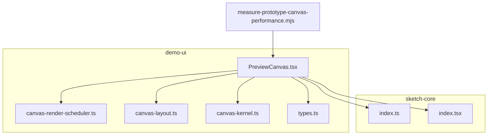
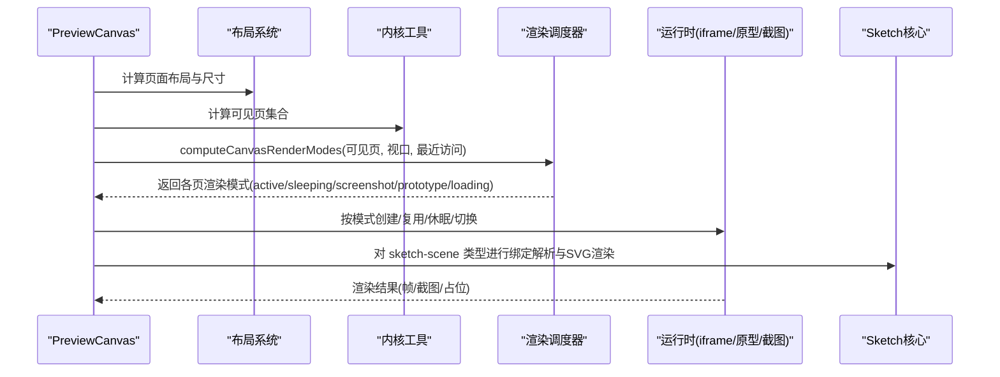
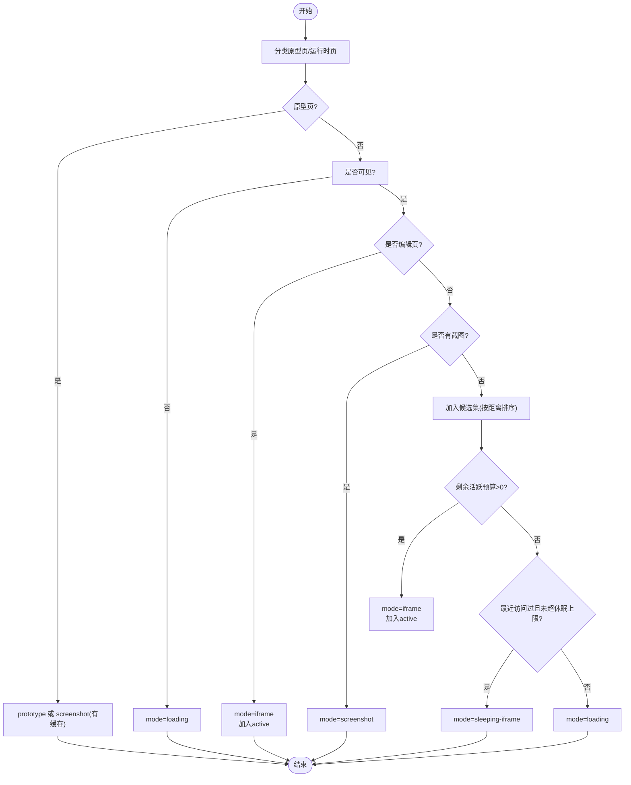
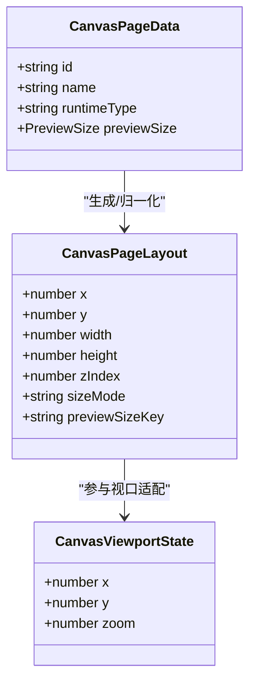
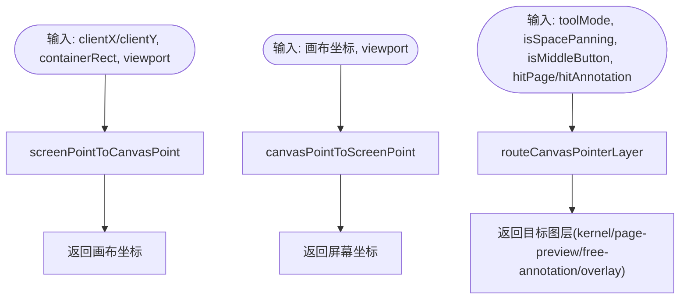
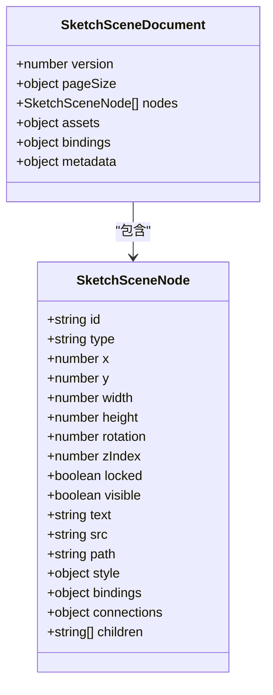
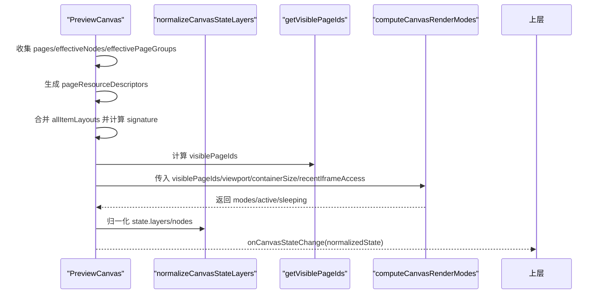
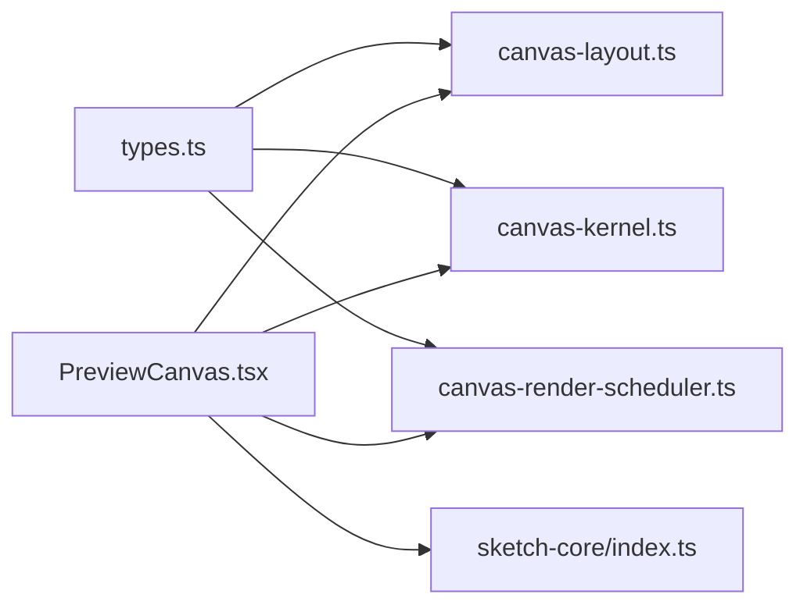

# 画布渲染引擎

<cite>
**本文引用的文件**   
- [canvas-render-scheduler.ts](file://packages/demo-ui/src/canvas-render-scheduler.ts)
- [canvas-kernel.ts](file://packages/demo-ui/src/canvas-kernel.ts)
- [canvas-layout.ts](file://packages/demo-ui/src/canvas-layout.ts)
- [types.ts](file://packages/demo-ui/src/types.ts)
- [PreviewCanvas.tsx](file://packages/demo-ui/src/PreviewCanvas.tsx)
- [index.ts](file://packages/sketch-core/src/index.ts)
- [index.tsx](file://packages/sketch-react/src/index.tsx)
- [measure-prototype-canvas-performance.mjs](file://scripts/development/measure-prototype-canvas-performance.mjs)
</cite>

## 目录
1. [简介](#简介)
2. [项目结构](#项目结构)
3. [核心组件](#核心组件)
4. [架构总览](#架构总览)
5. [详细组件分析](#详细组件分析)
6. [依赖关系分析](#依赖关系分析)
7. [性能考量](#性能考量)
8. [故障排查指南](#故障排查指南)
9. [结论](#结论)
10. [附录](#附录)

## 简介
本技术文档面向“画布渲染引擎”，聚焦以下目标：
- 解析节点树管理与渲染管线设计
- 说明自定义节点类型的定义机制与渲染生命周期管理
- 解释虚拟滚动实现原理与增量更新算法
- 描述渲染缓存机制与内存管理策略
- 提供渲染性能监控与调试工具使用方法
- 给出自定义渲染器的开发指南与最佳实践

该引擎支持多种页面运行时类型（HTML/CSS 原型、高保真 React、Sketch 场景），通过“活跃/休眠/截图/加载”等渲染模式组合，在大画布多页场景下实现高性能的可视预览与交互。

## 项目结构
仓库中与画布渲染相关的核心模块主要位于 demo-ui 与 sketch-core 两个包中：
- demo-ui：画布编排、布局计算、渲染调度、可见性判定、坐标变换、工具路由等
- sketch-core：Sketch 场景数据模型、变更操作应用、绑定值解析、SVG 渲染输出等
- scripts：性能测量脚本，用于端到端采集 RAF 指标与计数统计

图表来源
- [PreviewCanvas.tsx:1035-1075](file://packages/demo-ui/src/PreviewCanvas.tsx#L1035-L1075)
- [canvas-render-scheduler.ts:1-163](file://packages/demo-ui/src/canvas-render-scheduler.ts#L1-L163)
- [canvas-layout.ts:1-437](file://packages/demo-ui/src/canvas-layout.ts#L1-L437)
- [canvas-kernel.ts:1-201](file://packages/demo-ui/src/canvas-kernel.ts#L1-L201)
- [types.ts:1-420](file://packages/demo-ui/src/types.ts#L1-L420)
- [index.ts:1-200](file://packages/sketch-core/src/index.ts#L1-L200)
- [index.tsx:1898-1949](file://packages/sketch-react/src/index.tsx#L1898-L1949)
- [measure-prototype-canvas-performance.mjs:109-162](file://scripts/development/measure-prototype-canvas-performance.mjs#L109-L162)

章节来源
- [PreviewCanvas.tsx:1035-1075](file://packages/demo-ui/src/PreviewCanvas.tsx#L1035-L1075)
- [canvas-render-scheduler.ts:1-163](file://packages/demo-ui/src/canvas-render-scheduler.ts#L1-L163)
- [canvas-layout.ts:1-437](file://packages/demo-ui/src/canvas-layout.ts#L1-L437)
- [canvas-kernel.ts:1-201](file://packages/demo-ui/src/canvas-kernel.ts#L1-L201)
- [types.ts:1-420](file://packages/demo-ui/src/types.ts#L1-L420)
- [index.ts:1-200](file://packages/sketch-core/src/index.ts#L1-L200)
- [index.tsx:1898-1949](file://packages/sketch-react/src/index.tsx#L1898-L1949)
- [measure-prototype-canvas-performance.mjs:109-162](file://scripts/development/measure-prototype-canvas-performance.mjs#L109-L162)

## 核心组件
- 渲染调度器（computeCanvasRenderModes）：根据视口、页面可见性与最近访问记录，为每个页面分配渲染模式（iframe、sleeping-iframe、screenshot、prototype、loading），并维护 active/sleeping 集合预算。
- 布局系统（normalize/compute/auto layout）：负责页面尺寸归一化、初始布局、自动排版、内容高度自适应与视口适配。
- 内核工具（坐标转换、工具路由、文本摘要）：提供屏幕/画布坐标互转、指针事件路由、标注与文档层聚合、文本节点摘要等。
- Sketch 场景核心（数据模型、变更应用、绑定解析、SVG 渲染）：定义节点类型、样式、连接、绑定；应用 patch 操作；解析配置绑定；输出 SVG 标记。
- 预览容器（PreviewCanvas）：整合上述能力，计算可见页、资源描述、布局签名，驱动渲染模式与状态同步。

章节来源
- [canvas-render-scheduler.ts:1-163](file://packages/demo-ui/src/canvas-render-scheduler.ts#L1-L163)
- [canvas-layout.ts:1-437](file://packages/demo-ui/src/canvas-layout.ts#L1-L437)
- [canvas-kernel.ts:1-201](file://packages/demo-ui/src/canvas-kernel.ts#L1-L201)
- [index.ts:1-200](file://packages/sketch-core/src/index.ts#L1-L200)
- [PreviewCanvas.tsx:1035-1075](file://packages/demo-ui/src/PreviewCanvas.tsx#L1035-L1075)

## 架构总览
整体渲染流程从 PreviewCanvas 开始，结合布局与可见性计算，交由渲染调度器决定各页面的渲染模式，再由具体运行时（iframe、静态原型或截图占位）完成绘制。Sketch 场景作为一类特殊页面，其数据模型与渲染由 sketch-core 提供。

图表来源
- [PreviewCanvas.tsx:1035-1075](file://packages/demo-ui/src/PreviewCanvas.tsx#L1035-L1075)
- [canvas-render-scheduler.ts:1-163](file://packages/demo-ui/src/canvas-render-scheduler.ts#L1-L163)
- [canvas-layout.ts:1-437](file://packages/demo-ui/src/canvas-layout.ts#L1-L437)
- [canvas-kernel.ts:1-201](file://packages/demo-ui/src/canvas-kernel.ts#L1-L201)
- [index.ts:1000-1200](file://packages/sketch-core/src/index.ts#L1000-L1200)

## 详细组件分析

### 渲染调度器（虚拟滚动与增量更新）
- 输入：页面列表、布局映射、可见页集合、视口、容器尺寸、编辑页、截图URL、最近 iframe 访问时间、活跃/休眠上限
- 关键逻辑：
  - 原型页（prototype-html-css、sketch-scene）优先使用 prototype 或 screenshot（若存在缓存）
  - 运行时页（非原型）仅在可见时进入候选，编辑页强制激活
  - 基于距视口中心的距离排序选择活跃 iframe，超出预算则进入 sleeping-iframe（保留最近访问）
  - 不可见页标记为 loading，避免无谓实例化
- 输出：每页渲染模式、activePageIds、sleepingPageIds

图表来源
- [canvas-render-scheduler.ts:1-163](file://packages/demo-ui/src/canvas-render-scheduler.ts#L1-L163)

章节来源
- [canvas-render-scheduler.ts:1-163](file://packages/demo-ui/src/canvas-render-scheduler.ts#L1-L163)

### 布局系统（页面尺寸与自动排版）
- 尺寸归一化：根据 previewSize 生成 sizeKey，兼容 custom/preview 两种 sizeMode，确保历史布局与新尺寸对齐
- 初始布局：按列数与间距网格化排布
- 自动布局：按行聚类、Y 轴对齐、X 轴锚点对齐、网格吸附
- 内容高度自适应：当内容高度超过默认尺寸时按比例缩放并回写布局
- 视口适配：根据布局边界计算 fit-to-screen 的 zoom 与偏移

图表来源
- [types.ts:166-180](file://packages/demo-ui/src/types.ts#L166-L180)
- [canvas-layout.ts:1-437](file://packages/demo-ui/src/canvas-layout.ts#L1-L437)

章节来源
- [canvas-layout.ts:1-437](file://packages/demo-ui/src/canvas-layout.ts#L1-L437)
- [types.ts:166-180](file://packages/demo-ui/src/types.ts#L166-L180)

### 内核工具（坐标、工具路由、文本摘要）
- 坐标转换：screenPointToCanvasPoint / canvasPointToScreenPoint，考虑视口平移与缩放
- 工具路由：根据工具模式、空格拖拽、中键、覆盖层命中等决定指针事件落在 kernel/page-preview/free-annotation/overlay 哪一层
- 文本摘要：汇总标注层文本节点，截断长文本，关联相关页面ID

图表来源
- [canvas-kernel.ts:33-81](file://packages/demo-ui/src/canvas-kernel.ts#L33-L81)
- [canvas-kernel.ts:175-201](file://packages/demo-ui/src/canvas-kernel.ts#L175-L201)

章节来源
- [canvas-kernel.ts:33-81](file://packages/demo-ui/src/canvas-kernel.ts#L33-L81)
- [canvas-kernel.ts:175-201](file://packages/demo-ui/src/canvas-kernel.ts#L175-L201)

### Sketch 场景核心（数据模型、变更应用、绑定解析、SVG 渲染）
- 数据模型：节点类型、样式、文本样式运行、连接器锚点、资产、文档结构
- 变更应用：支持 group/ungroup、set-visible、set-locked、bind/unbind 等操作，并生成补丁摘要（新增/删除/更新节点及字段差异）
- 绑定解析：将节点 bindings 与外部 configData 映射，过滤不可见节点与空图
- SVG 渲染：处理旋转中心、tspan 多行文本、属性转义等

图表来源
- [index.ts:135-176](file://packages/sketch-core/src/index.ts#L135-L176)

章节来源
- [index.ts:1000-1200](file://packages/sketch-core/src/index.ts#L1000-L1200)
- [index.ts:1134-1169](file://packages/sketch-core/src/index.ts#L1134-L1169)
- [index.ts:1047-1083](file://packages/sketch-core/src/index.ts#L1047-L1083)

### 预览容器（状态归一化与可见性传播）
- 资源描述：为每个页面生成资源描述符（含 sessionId 等上下文）
- 布局签名：合并独立页面、分组与节点布局，生成稳定签名以触发最小重算
- 状态更新：统一 normalizeCanvasStateLayers，保证 layers 与 nodes 一致性，并在受控模式下向上同步

图表来源
- [PreviewCanvas.tsx:1035-1075](file://packages/demo-ui/src/PreviewCanvas.tsx#L1035-L1075)
- [PreviewCanvas.tsx:1809-1854](file://packages/demo-ui/src/PreviewCanvas.tsx#L1809-L1854)
- [canvas-render-scheduler.ts:1-163](file://packages/demo-ui/src/canvas-render-scheduler.ts#L1-L163)
- [canvas-kernel.ts:131-155](file://packages/demo-ui/src/canvas-kernel.ts#L131-L155)

章节来源
- [PreviewCanvas.tsx:1035-1075](file://packages/demo-ui/src/PreviewCanvas.tsx#L1035-L1075)
- [PreviewCanvas.tsx:1809-1854](file://packages/demo-ui/src/PreviewCanvas.tsx#L1809-L1854)
- [canvas-kernel.ts:131-155](file://packages/demo-ui/src/canvas-kernel.ts#L131-L155)

## 依赖关系分析
- PreviewCanvas 依赖：
  - 布局系统：normalizeCanvasPageLayouts、computeInitialCanvasLayout、computeAutoCanvasLayout、resolveCanvasContentHeightLayout、computeFitCanvasViewport
  - 内核工具：normalizeCanvasStateLayers、screenPointToCanvasPoint、routeCanvasPointerLayer、summarizeCanvasTextNodes
  - 渲染调度器：computeCanvasRenderModes
  - Sketch 核心：applySketchScenePatchOperationsWithResult、resolveSketchSceneBindingValue、isSketchNodeRenderable
- 类型契约：types.ts 定义了所有跨模块共享的数据结构与枚举

图表来源
- [types.ts:1-420](file://packages/demo-ui/src/types.ts#L1-L420)
- [canvas-layout.ts:1-437](file://packages/demo-ui/src/canvas-layout.ts#L1-L437)
- [canvas-kernel.ts:1-201](file://packages/demo-ui/src/canvas-kernel.ts#L1-L201)
- [canvas-render-scheduler.ts:1-163](file://packages/demo-ui/src/canvas-render-scheduler.ts#L1-L163)
- [PreviewCanvas.tsx:1035-1075](file://packages/demo-ui/src/PreviewCanvas.tsx#L1035-L1075)
- [index.ts:1-200](file://packages/sketch-core/src/index.ts#L1-L200)

章节来源
- [types.ts:1-420](file://packages/demo-ui/src/types.ts#L1-L420)
- [PreviewCanvas.tsx:1035-1075](file://packages/demo-ui/src/PreviewCanvas.tsx#L1035-L1075)

## 性能考量
- 渲染模式预算控制：限制活跃 iframe 数量，将非活跃但近期访问过的页面置入 sleeping-iframe，减少 DOM/JS 开销
- 截图占位：对原型页在可用时使用截图替代实时渲染，降低首屏与滚动成本
- 可见性裁剪：仅对可见页进行 iframe 初始化与更新，不可见页保持 loading 态
- 布局与签名：通过布局签名与 memoization 减少不必要的重渲染
- 端到端采样：使用性能脚本采集 DOMContentLoaded、首次可见、RAF 空闲/交互阶段耗时与元素计数变化，辅助回归基线

章节来源
- [canvas-render-scheduler.ts:1-163](file://packages/demo-ui/src/canvas-render-scheduler.ts#L1-L163)
- [PreviewCanvas.tsx:1035-1075](file://packages/demo-ui/src/PreviewCanvas.tsx#L1035-L1075)
- [measure-prototype-canvas-performance.mjs:109-162](file://scripts/development/measure-prototype-canvas-performance.mjs#L109-L162)

## 故障排查指南
- 画布不可见或长时间空白
  - 检查 data-canvas-root 是否出现，确认首次可见计时与期望页面数等待逻辑
  - 核对 computeCanvasRenderModes 返回的 modes 是否为 loading 过多
- 滚动卡顿或掉帧
  - 使用性能脚本采集 idleRaf 与 interactionRaf，对比不同 label 的报告
  - 关注 active/sleeping 预算是否过小导致频繁重建
- 截图不更新
  - 检查 screenshotUrls 是否存在，确认 screenshot 模式优先级高于 prototype
- Sketch 场景绑定无效
  - 校验 resolveSketchSceneBindingValue 的 configData 键是否存在
  - 确认 isSketchNodeRenderable 过滤条件（visible、src 为空）

章节来源
- [measure-prototype-canvas-performance.mjs:109-162](file://scripts/development/measure-prototype-canvas-performance.mjs#L109-L162)
- [canvas-render-scheduler.ts:1-163](file://packages/demo-ui/src/canvas-render-scheduler.ts#L1-L163)
- [index.ts:1134-1169](file://packages/sketch-core/src/index.ts#L1134-L1169)

## 结论
本渲染引擎通过“布局归一化 + 可见性裁剪 + 渲染模式预算 + 截图占位”的组合策略，在多页大画布场景下实现了良好的首屏与交互性能。Sketch 场景的核心能力（数据模型、变更应用、绑定解析、SVG 渲染）与通用画布能力解耦，便于扩展新的节点类型与渲染后端。配合端到端性能脚本，可建立稳定的性能基线与回归检测。

## 附录

### 自定义节点类型定义与渲染生命周期
- 定义节点类型：在 sketch-core 的类型声明中注册新类型，并在变更应用与绑定解析中补充相应分支
- 渲染生命周期：
  - 数据层：applySketchScenePatchOperationsWithResult 应用变更并产出补丁摘要
  - 绑定层：resolveSketchSceneBindingValue 解析外部配置到节点属性
  - 可见性：isSketchNodeRenderable 决定是否参与渲染
  - 输出层：SVG 渲染函数按节点类型生成标记
- 参考路径
  - 类型与常量定义：[index.ts:1-200](file://packages/sketch-core/src/index.ts#L1-L200)
  - 变更应用与补丁摘要：[index.ts:1000-1200](file://packages/sketch-core/src/index.ts#L1000-L1200)
  - 绑定解析与可见性判断：[index.ts:1134-1169](file://packages/sketch-core/src/index.ts#L1134-L1169)

章节来源
- [index.ts:1-200](file://packages/sketch-core/src/index.ts#L1-L200)
- [index.ts:1000-1200](file://packages/sketch-core/src/index.ts#L1000-L1200)
- [index.ts:1134-1169](file://packages/sketch-core/src/index.ts#L1134-L1169)

### 虚拟滚动与增量更新算法要点
- 虚拟滚动：基于 getVisiblePageIds 与 computeCanvasRenderModes 的协同，仅对可见页进行实例化与更新
- 增量更新：
  - 布局签名变化才触发重新计算
  - Sketch 场景使用补丁摘要（added/deleted/updated fields）指导局部更新
- 参考路径
  - 可见性计算与传播：[PreviewCanvas.tsx:1809-1854](file://packages/demo-ui/src/PreviewCanvas.tsx#L1809-L1854)
  - 渲染模式计算：[canvas-render-scheduler.ts:1-163](file://packages/demo-ui/src/canvas-render-scheduler.ts#L1-L163)
  - 补丁摘要构建：[index.ts:1047-1083](file://packages/sketch-core/src/index.ts#L1047-L1083)

章节来源
- [PreviewCanvas.tsx:1809-1854](file://packages/demo-ui/src/PreviewCanvas.tsx#L1809-L1854)
- [canvas-render-scheduler.ts:1-163](file://packages/demo-ui/src/canvas-render-scheduler.ts#L1-L163)
- [index.ts:1047-1083](file://packages/sketch-core/src/index.ts#L1047-L1083)

### 渲染缓存与内存管理策略
- 截图缓存：对原型页使用 screenshotUrls 占位，避免重复渲染
- 休眠 iframe：sleeping-iframe 保留最近访问的实例，减少重建开销
- 活跃预算：maxActiveIframes/maxSleepingIframes 控制内存占用峰值
- 参考路径
  - 渲染模式与预算：[canvas-render-scheduler.ts:1-163](file://packages/demo-ui/src/canvas-render-scheduler.ts#L1-L163)

章节来源
- [canvas-render-scheduler.ts:1-163](file://packages/demo-ui/src/canvas-render-scheduler.ts#L1-L163)

### 渲染性能监控与调试工具
- 端到端性能脚本：
  - 打开画布并等待可见
  - 等待一定数量的页面元素出现
  - 采集空闲与交互阶段的 RAF 样本
  - 输出报告至 tmp/prototype-canvas-performance
- 参考路径
  - 脚本入口与参数：[measure-prototype-canvas-performance.mjs:109-162](file://scripts/development/measure-prototype-canvas-performance.mjs#L109-L162)

章节来源
- [measure-prototype-canvas-performance.mjs:109-162](file://scripts/development/measure-prototype-canvas-performance.mjs#L109-L162)

### 自定义渲染器开发指南与最佳实践
- 建议步骤
  - 在 types.ts 中扩展页面运行时类型与渲染模式
  - 在 canvas-render-scheduler.ts 中为新类型添加模式决策分支
  - 在 PreviewCanvas 中接入资源描述与生命周期钩子
  - 针对 Sketch 场景，遵循 sketch-core 的变更应用与绑定解析约定
- 最佳实践
  - 尽量使用截图占位与休眠 iframe 降低内存压力
  - 利用布局签名与 memoization 减少重渲染
  - 通过性能脚本建立基线并纳入回归测试

章节来源
- [types.ts:1-420](file://packages/demo-ui/src/types.ts#L1-L420)
- [canvas-render-scheduler.ts:1-163](file://packages/demo-ui/src/canvas-render-scheduler.ts#L1-L163)
- [PreviewCanvas.tsx:1035-1075](file://packages/demo-ui/src/PreviewCanvas.tsx#L1035-L1075)
- [index.ts:1000-1200](file://packages/sketch-core/src/index.ts#L1000-L1200)