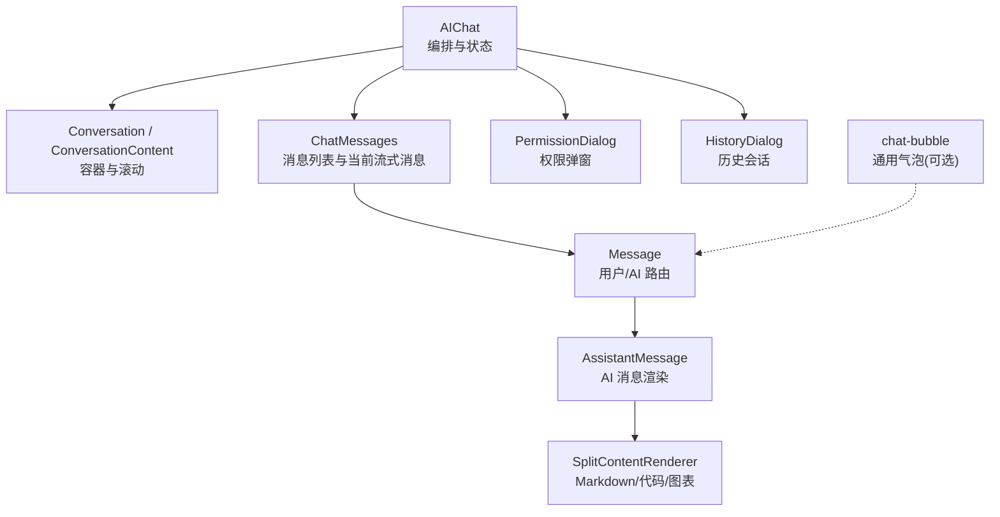
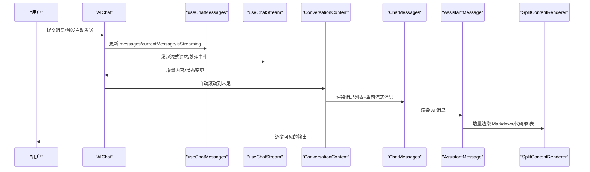
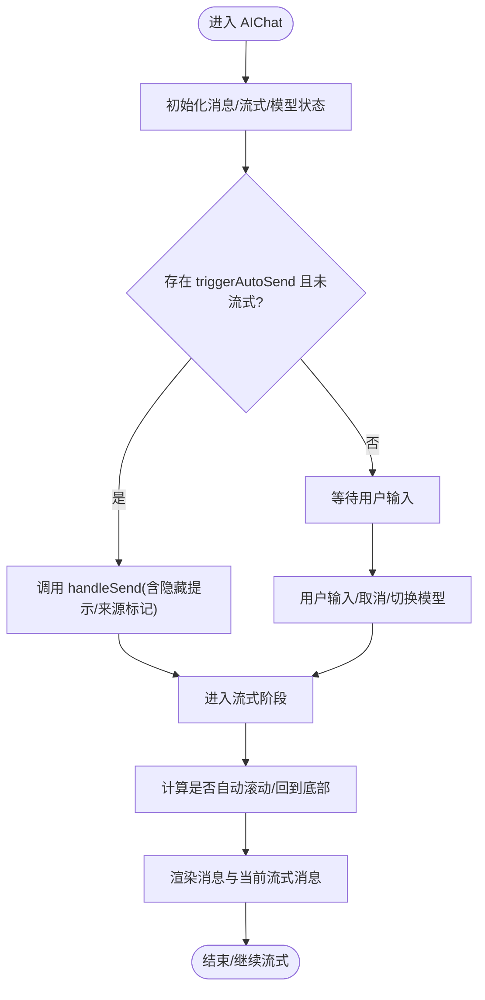
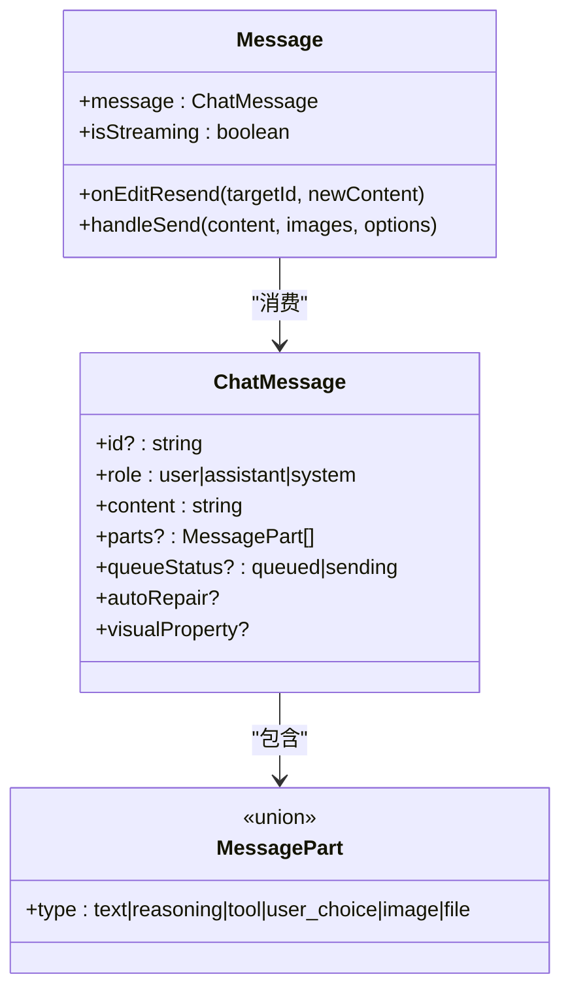
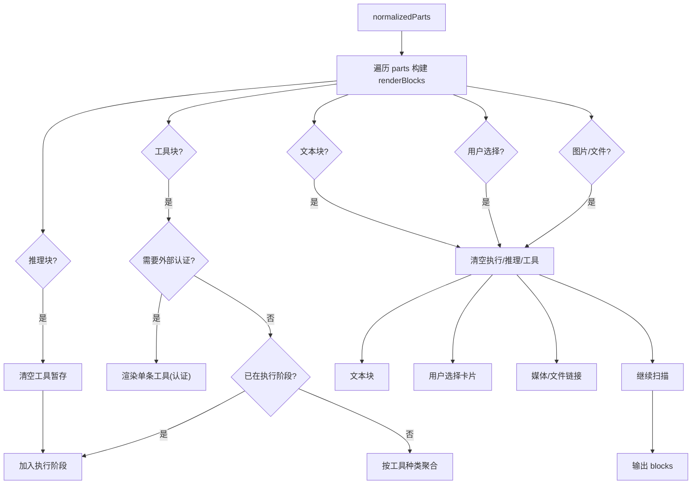
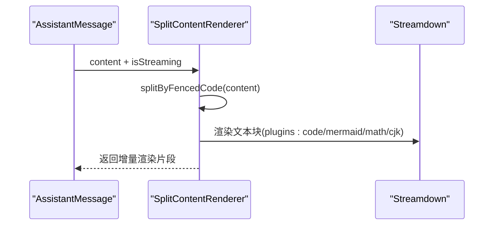
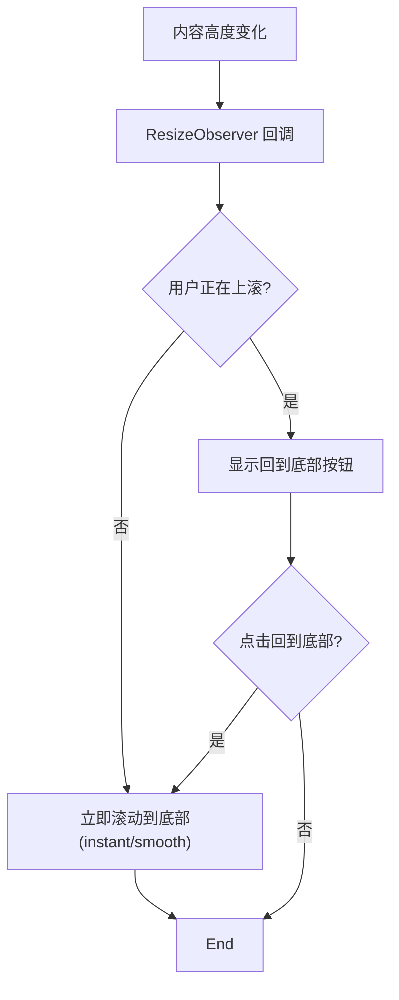
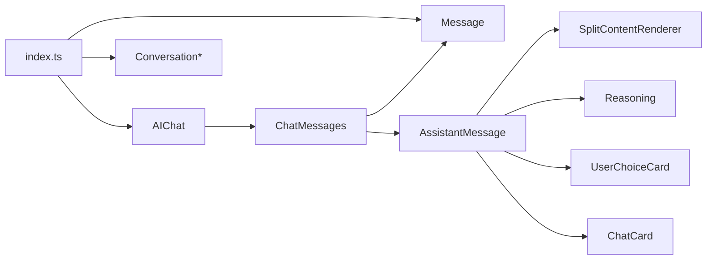

# AI 元素组件

<cite>
**本文引用的文件**
- [packages/author-site/src/components/ai-elements/index.ts](file://packages/author-site/src/components/ai-elements/index.ts)
- [packages/author-site/src/components/ai-elements/ai-chat.tsx](file://packages/author-site/src/components/ai-elements/ai-chat.tsx)
- [packages/author-site/src/components/ai-elements/conversation.tsx](file://packages/author-site/src/components/ai-elements/conversation.tsx)
- [packages/author-site/src/components/ai-elements/message.tsx](file://packages/author-site/src/components/ai-elements/message.tsx)
- [packages/author-site/src/components/ai-elements/assistant-message.tsx](file://packages/author-site/src/components/ai-elements/assistant-message.tsx)
- [packages/author-site/src/components/ai-elements/split-content-renderer.tsx](file://packages/author-site/src/components/ai-elements/split-content-renderer.tsx)
- [packages/author-site/src/components/ai-elements/chat/chat-messages.tsx](file://packages/author-site/src/components/ai-elements/chat/chat-messages.tsx)
- [packages/author-site/src/components/ui/chat-bubble.tsx](file://packages/author-site/src/components/ui/chat-bubble.tsx)
</cite>

## 目录
1. [简介](#简介)
2. [项目结构](#项目结构)
3. [核心组件](#核心组件)
4. [架构总览](#架构总览)
5. [详细组件分析](#详细组件分析)
6. [依赖关系分析](#依赖关系分析)
7. [性能与内存优化](#性能与内存优化)
8. [故障排查指南](#故障排查指南)
9. [结论](#结论)
10. [附录：数据模型与接口](#附录数据模型与接口)

## 简介
本文件面向 Workbench AI 的对话相关 UI 元素，聚焦以下能力：
- 聊天气泡、AI 头像、消息状态指示器
- 流式文本显示与增量渲染（含 Markdown、代码高亮、Mermaid、数学公式）
- 多轮对话界面、上下文管理与用户交互
- 实时数据流处理、自动滚动、错误恢复与用户体验优化策略

## 项目结构
AI 元素组件位于 author-site 的 ai-elements 目录，采用“组合式”分层组织：
- 顶层编排：AIChat 负责会话生命周期、流式状态、模型选择、历史切换、权限弹窗等
- 列表与滚动：Conversation + ConversationContent 提供容器与滚动行为
- 消息渲染：Message 区分用户/AI；AssistantMessage 负责复杂内容块渲染
- 流式渲染：SplitContentRenderer 基于 Streamdown 插件实现增量渲染
- 通用气泡：ui/chat-bubble 提供轻量聊天气泡（非主路径）

图示来源
- [packages/author-site/src/components/ai-elements/ai-chat.tsx:1-530](file://packages/author-site/src/components/ai-elements/ai-chat.tsx#L1-L530)
- [packages/author-site/src/components/ai-elements/conversation.tsx:1-70](file://packages/author-site/src/components/ai-elements/conversation.tsx#L1-L70)
- [packages/author-site/src/components/ai-elements/chat/chat-messages.tsx:1-191](file://packages/author-site/src/components/ai-elements/chat/chat-messages.tsx#L1-L191)
- [packages/author-site/src/components/ai-elements/message.tsx:1-614](file://packages/author-site/src/components/ai-elements/message.tsx#L1-L614)
- [packages/author-site/src/components/ai-elements/assistant-message.tsx:1-800](file://packages/author-site/src/components/ai-elements/assistant-message.tsx#L1-L800)
- [packages/author-site/src/components/ai-elements/split-content-renderer.tsx:1-199](file://packages/author-site/src/components/ai-elements/split-content-renderer.tsx#L1-L199)
- [packages/author-site/src/components/ui/chat-bubble.tsx:1-52](file://packages/author-site/src/components/ui/chat-bubble.tsx#L1-L52)

章节来源
- [packages/author-site/src/components/ai-elements/index.ts:1-83](file://packages/author-site/src/components/ai-elements/index.ts#L1-L83)
- [packages/author-site/src/components/ai-elements/ai-chat.tsx:1-530](file://packages/author-site/src/components/ai-elements/ai-chat.tsx#L1-L530)
- [packages/author-site/src/components/ai-elements/conversation.tsx:1-70](file://packages/author-site/src/components/ai-elements/conversation.tsx#L1-L70)
- [packages/author-site/src/components/ai-elements/chat/chat-messages.tsx:1-191](file://packages/author-site/src/components/ai-elements/chat/chat-messages.tsx#L1-L191)
- [packages/author-site/src/components/ai-elements/message.tsx:1-614](file://packages/author-site/src/components/ai-elements/message.tsx#L1-L614)
- [packages/author-site/src/components/ai-elements/assistant-message.tsx:1-800](file://packages/author-site/src/components/ai-elements/assistant-message.tsx#L1-L800)
- [packages/author-site/src/components/ai-elements/split-content-renderer.tsx:1-199](file://packages/author-site/src/components/ai-elements/split-content-renderer.tsx#L1-L199)
- [packages/author-site/src/components/ui/chat-bubble.tsx:1-52](file://packages/author-site/src/components/ui/chat-bubble.tsx#L1-L52)

## 核心组件
- AIChat：会话入口，管理消息、流式输出、模型选择、计划面板、排队消息、记忆更新提示、静默时长告警、历史对话框、权限弹窗等。
- Conversation / ConversationContent：对话容器与可滚动区域，提供滚动监听与“回到底部”按钮。
- ChatMessages：消息列表渲染，过滤排队消息，决定是否渲染当前流式消息，并在用户上滚时展示“回到底部”。
- Message：消息路由，用户消息支持编辑重发、图片/附件、可视化批注卡片；系统消息支持自动修复卡片；AI 消息委托 AssistantMessage。
- AssistantMessage：将 parts 归并为渲染块（文本、推理、工具组、子 Agent、用户选择、图片、文件），并驱动 SplitContentRenderer 进行增量渲染。
- SplitContentRenderer：按围栏代码分割内容，使用 Streamdown 插件（代码、Mermaid、数学、CJK）进行流式渲染。
- chat-bubble：轻量级通用聊天气泡（独立于主流程）。

章节来源
- [packages/author-site/src/components/ai-elements/ai-chat.tsx:1-530](file://packages/author-site/src/components/ai-elements/ai-chat.tsx#L1-L530)
- [packages/author-site/src/components/ai-elements/conversation.tsx:1-70](file://packages/author-site/src/components/ai-elements/conversation.tsx#L1-L70)
- [packages/author-site/src/components/ai-elements/chat/chat-messages.tsx:1-191](file://packages/author-site/src/components/ai-elements/chat/chat-messages.tsx#L1-L191)
- [packages/author-site/src/components/ai-elements/message.tsx:1-614](file://packages/author-site/src/components/ai-elements/message.tsx#L1-L614)
- [packages/author-site/src/components/ai-elements/assistant-message.tsx:1-800](file://packages/author-site/src/components/ai-elements/assistant-message.tsx#L1-L800)
- [packages/author-site/src/components/ai-elements/split-content-renderer.tsx:1-199](file://packages/author-site/src/components/ai-elements/split-content-renderer.tsx#L1-L199)
- [packages/author-site/src/components/ui/chat-bubble.tsx:1-52](file://packages/author-site/src/components/ui/chat-bubble.tsx#L1-L52)

## 架构总览
AIChat 作为编排层，聚合多个 hooks 与子组件，形成“输入—流式处理—渲染—反馈”的闭环。

图示来源
- [packages/author-site/src/components/ai-elements/ai-chat.tsx:170-340](file://packages/author-site/src/components/ai-elements/ai-chat.tsx#L170-L340)
- [packages/author-site/src/components/ai-elements/chat/chat-messages.tsx:70-191](file://packages/author-site/src/components/ai-elements/chat/chat-messages.tsx#L70-L191)
- [packages/author-site/src/components/ai-elements/assistant-message.tsx:351-739](file://packages/author-site/src/components/ai-elements/assistant-message.tsx#L351-L739)
- [packages/author-site/src/components/ai-elements/split-content-renderer.tsx:18-60](file://packages/author-site/src/components/ai-elements/split-content-renderer.tsx#L18-L60)

## 详细组件分析

### AIChat 编排与交互
- 职责
  - 维护消息、流式内容与当前消息引用
  - 模型选择与深度切换、模型持久化键生成
  - 自动发送触发（字符串或结构化触发器）
  - 滚动控制：用户滚动检测、自动滚动、ResizeObserver 跟随内容增长
  - 静默时长提示、记忆文件更新提示、排队消息托盘
  - 历史会话切换、权限弹窗内联展示
- 关键交互
  - 当 triggerAutoSend 变化且未处于流式状态时，自动调用发送逻辑
  - 流式期间禁止切换历史会话
  - 根据 isUserScrolling 与 isStreaming 决定滚动行为（即时 vs 平滑）

图示来源
- [packages/author-site/src/components/ai-elements/ai-chat.tsx:269-396](file://packages/author-site/src/components/ai-elements/ai-chat.tsx#L269-L396)
- [packages/author-site/src/components/ai-elements/ai-chat.tsx:398-530](file://packages/author-site/src/components/ai-elements/ai-chat.tsx#L398-L530)

章节来源
- [packages/author-site/src/components/ai-elements/ai-chat.tsx:1-530](file://packages/author-site/src/components/ai-elements/ai-chat.tsx#L1-L530)

### 消息路由与用户交互（Message）
- 用户消息
  - 支持编辑重发（快捷键 Enter/Ctrl+Enter）、队列状态显示与取消
  - 图片与附件预览、可视化批注摘要卡片
- 系统消息
  - 自动修复卡片：运行中/已完成/失败，支持重新修复
- AI 消息
  - 统一交由 AssistantMessage 渲染

图示来源
- [packages/author-site/src/components/ai-elements/message.tsx:100-177](file://packages/author-site/src/components/ai-elements/message.tsx#L100-L177)
- [packages/author-site/src/components/ai-elements/message.tsx:179-425](file://packages/author-site/src/components/ai-elements/message.tsx#L179-L425)

章节来源
- [packages/author-site/src/components/ai-elements/message.tsx:1-614](file://packages/author-site/src/components/ai-elements/message.tsx#L1-L614)

### AI 消息渲染（AssistantMessage）
- 归并策略
  - 将 reasonings/tools/text/user_choice/image/file 等 parts 归并为渲染块
  - 连续同类型工具合并为“工具组”，否则单条工具行
  - 推理块分组折叠，执行阶段（推理+工具）聚合
- 特殊分支
  - 外部认证需求：单独卡片引导连接
  - 子 Agent 委派：任务详情、状态、耗时、结果摘要
  - 用户选择：选项卡交互
- 操作栏
  - 复制全部文本、重新生成、回滚（当检测到文件变更）

图示来源
- [packages/author-site/src/components/ai-elements/assistant-message.tsx:368-516](file://packages/author-site/src/components/ai-elements/assistant-message.tsx#L368-L516)
- [packages/author-site/src/components/ai-elements/assistant-message.tsx:517-739](file://packages/author-site/src/components/ai-elements/assistant-message.tsx#L517-L739)

章节来源
- [packages/author-site/src/components/ai-elements/assistant-message.tsx:1-800](file://packages/author-site/src/components/ai-elements/assistant-message.tsx#L1-L800)

### 流式文本与增量渲染（SplitContentRenderer）
- 按围栏代码分割内容，分别渲染代码块与普通文本
- 使用 Streamdown 插件：代码高亮、Mermaid 图、数学公式、中日韩字符优化
- 流式模式：caret 光标动画、isAnimating 提升可读性
- 代码块默认折叠，非流式下可展开/复制

图示来源
- [packages/author-site/src/components/ai-elements/split-content-renderer.tsx:18-60](file://packages/author-site/src/components/ai-elements/split-content-renderer.tsx#L18-L60)
- [packages/author-site/src/components/ai-elements/assistant-message.tsx:598-607](file://packages/author-site/src/components/ai-elements/assistant-message.tsx#L598-L607)

章节来源
- [packages/author-site/src/components/ai-elements/split-content-renderer.tsx:1-199](file://packages/author-site/src/components/ai-elements/split-content-renderer.tsx#L1-L199)

### 对话容器与滚动体验（Conversation + ChatMessages）
- ConversationContent 提供滚动容器与 ResizeObserver，避免内容增长导致的滚动错位
- ChatMessages 在用户上滚时显示“回到底部”按钮，流式期间智能选择即时/平滑滚动
- 空态欢迎页与示例指令，降低冷启动门槛

图示来源
- [packages/author-site/src/components/ai-elements/conversation.tsx:18-30](file://packages/author-site/src/components/ai-elements/conversation.tsx#L18-L30)
- [packages/author-site/src/components/ai-elements/ai-chat.tsx:305-339](file://packages/author-site/src/components/ai-elements/ai-chat.tsx#L305-L339)
- [packages/author-site/src/components/ai-elements/chat/chat-messages.tsx:175-185](file://packages/author-site/src/components/ai-elements/chat/chat-messages.tsx#L175-L185)

章节来源
- [packages/author-site/src/components/ai-elements/conversation.tsx:1-70](file://packages/author-site/src/components/ai-elements/conversation.tsx#L1-L70)
- [packages/author-site/src/components/ai-elements/chat/chat-messages.tsx:1-191](file://packages/author-site/src/components/ai-elements/chat/chat-messages.tsx#L1-L191)
- [packages/author-site/src/components/ai-elements/ai-chat.tsx:279-351](file://packages/author-site/src/components/ai-elements/ai-chat.tsx#L279-L351)

### 通用聊天气泡（可选）
- 用于简单场景的用户/AI 气泡展示，带头像占位与基础样式
- 非主路径，可与 Message 并存但职责更轻

章节来源
- [packages/author-site/src/components/ui/chat-bubble.tsx:1-52](file://packages/author-site/src/components/ui/chat-bubble.tsx#L1-L52)

## 依赖关系分析
- 导出索引：index.ts 集中暴露 Conversation、Message、PromptInput、Reasoning、ChainOfThought、Tool、Timeline、AgentProcessGroup、PermissionDialog、UserChoiceCard 等
- 内部耦合
  - AIChat 依赖 useChatMessages/useChatStream/useChatModels（通过相对路径引入）
  - ChatMessages 依赖 Message/AssistantMessage
  - AssistantMessage 依赖 SplitContentRenderer、Reasoning、UserChoiceCard、ChatCard
  - SplitContentRenderer 依赖 Streamdown 及若干插件

图示来源
- [packages/author-site/src/components/ai-elements/index.ts:1-83](file://packages/author-site/src/components/ai-elements/index.ts#L1-L83)
- [packages/author-site/src/components/ai-elements/ai-chat.tsx:1-530](file://packages/author-site/src/components/ai-elements/ai-chat.tsx#L1-L530)
- [packages/author-site/src/components/ai-elements/chat/chat-messages.tsx:1-191](file://packages/author-site/src/components/ai-elements/chat/chat-messages.tsx#L1-L191)
- [packages/author-site/src/components/ai-elements/assistant-message.tsx:1-800](file://packages/author-site/src/components/ai-elements/assistant-message.tsx#L1-L800)
- [packages/author-site/src/components/ai-elements/split-content-renderer.tsx:1-199](file://packages/author-site/src/components/ai-elements/split-content-renderer.tsx#L1-L199)

章节来源
- [packages/author-site/src/components/ai-elements/index.ts:1-83](file://packages/author-site/src/components/ai-elements/index.ts#L1-L83)

## 性能与内存优化
- 增量渲染
  - 使用 Streamdown 的 isAnimating 与 caret 模式，减少整段重绘成本
  - 代码块折叠与按需展开，避免大文档一次性渲染
- 滚动优化
  - ResizeObserver 监听容器尺寸变化，避免频繁 scrollHeight 计算
  - 流式时使用 instant 滚动，非流式使用 smooth，兼顾流畅与体验
- 状态最小化
  - 仅对必要字段触发重渲染（如 currentMessage.parts/content）
  - 使用 ref 缓存最新函数与 DOM 引用，避免闭包竞态
- 内存管理
  - 清理 ResizeObserver 与定时器
  - 流结束后及时关闭光标动画与临时状态
- 错误恢复
  - 长时静默提示，允许用户主动取消并重试
  - 自动修复失败提供重试入口

[本节为通用指导，不直接分析具体文件]

## 故障排查指南
- 无法切换历史会话
  - 现象：流式期间点击历史无响应
  - 原因：防止中断流式输出
  - 解决：等待流结束或手动取消
- 自动发送未生效
  - 检查 triggerAutoSend 是否为 null/undefined，以及 isStreaming 状态
- 滚动错乱
  - 确认 ResizeObserver 已正确观察容器，且 isUserScrolling 标志正常切换
- 代码/图表未渲染
  - 确认 Streamdown 插件已注册，围栏代码语法正确
- 外部认证卡住
  - 查看工具块 details/result 中的 external_auth_required 字段，完成授权后刷新

章节来源
- [packages/author-site/src/components/ai-elements/ai-chat.tsx:357-396](file://packages/author-site/src/components/ai-elements/ai-chat.tsx#L357-L396)
- [packages/author-site/src/components/ai-elements/assistant-message.tsx:193-213](file://packages/author-site/src/components/ai-elements/assistant-message.tsx#L193-L213)
- [packages/author-site/src/components/ai-elements/split-content-renderer.tsx:47-55](file://packages/author-site/src/components/ai-elements/split-content-renderer.tsx#L47-L55)

## 结论
Workbench AI 元素组件以 AIChat 为核心编排点，结合 Message/AssistantMessage/SplitContentRenderer 实现了高可用的多模态对话界面。通过流式增量渲染、智能滚动与丰富的交互卡片，既保证了性能，也提升了用户体验。建议在生产环境持续监控长时静默与外部认证失败率，并结合用户反馈优化自动修复与子 Agent 任务的可视化。

## 附录：数据模型与接口
- ChatMessage
  - id、role、content、parts、queueStatus、autoRepair、visualProperty 等
- MessagePart
  - text/reasoning/tool/user_choice/image/file 五种类型
- 典型用法
  - 用户消息：支持图片/附件、可视化批注、队列状态
  - AI 消息：parts 归并渲染，支持推理、工具组、子 Agent、用户选择、媒体与文件

章节来源
- [packages/author-site/src/components/ai-elements/message.tsx:100-177](file://packages/author-site/src/components/ai-elements/message.tsx#L100-L177)
- [packages/author-site/src/components/ai-elements/message.tsx:41-98](file://packages/author-site/src/components/ai-elements/message.tsx#L41-L98)