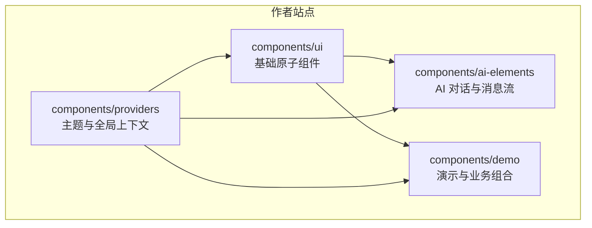
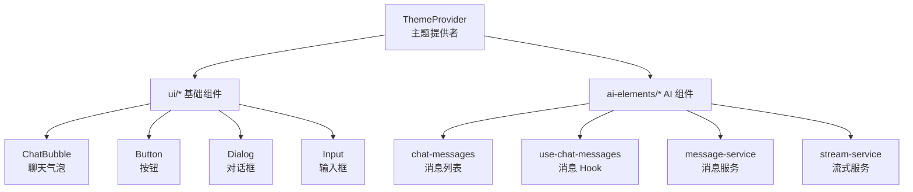
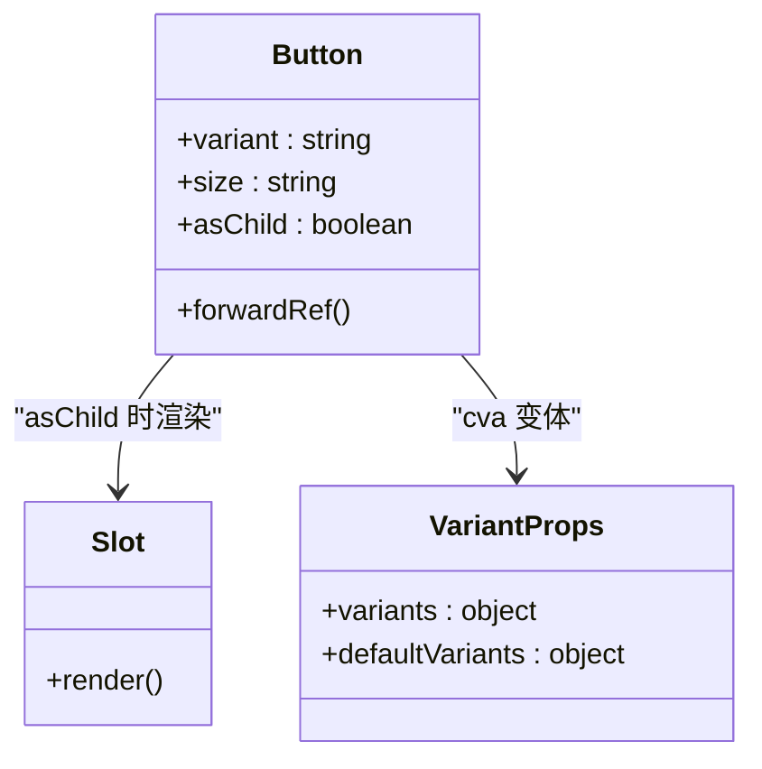
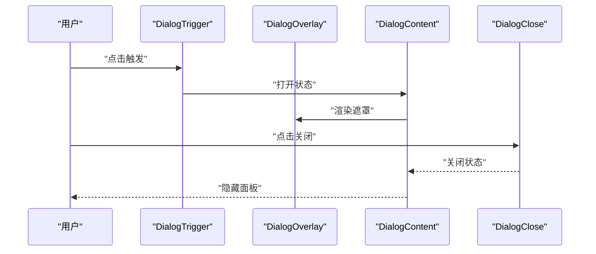
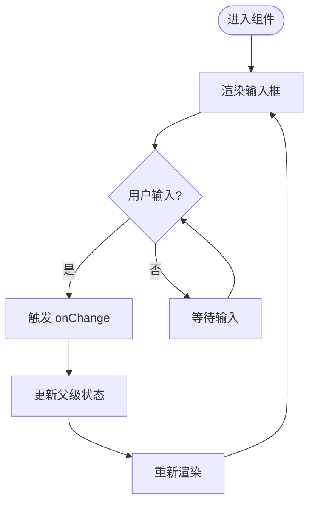
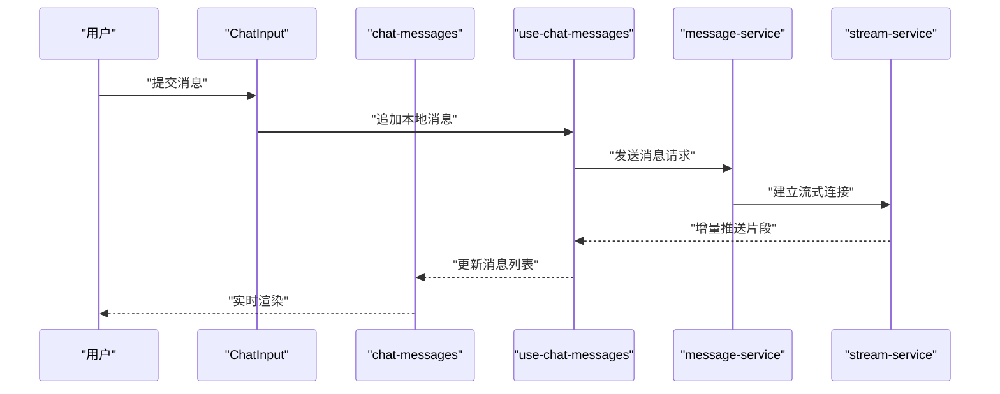
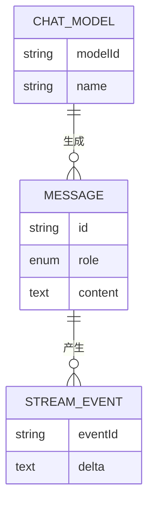
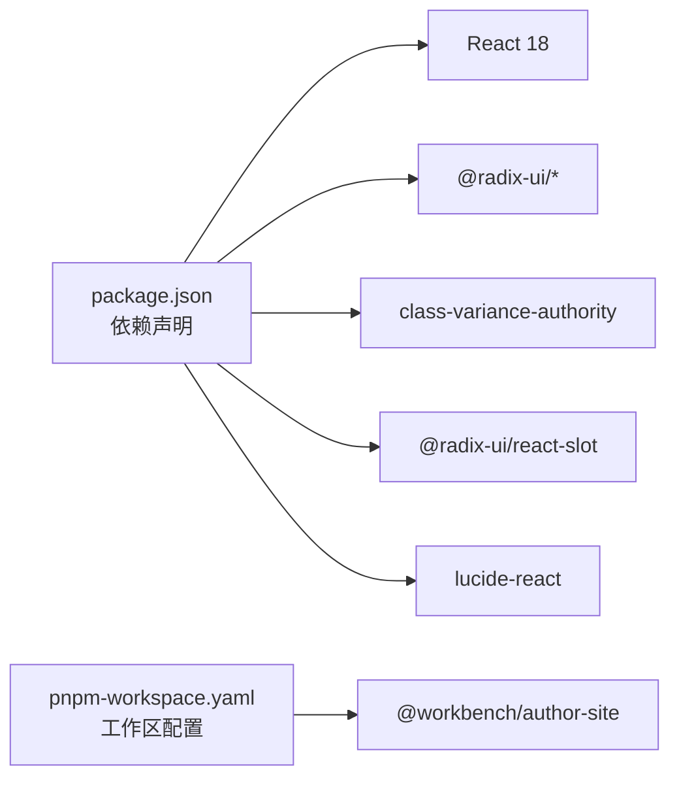

# UI 组件库

<cite>
**本文引用的文件**   
- [packages/author-site/src/components/ui/button.tsx](file://packages/author-site/src/components/ui/button.tsx)
- [packages/author-site/src/components/ui/card.tsx](file://packages/author-site/src/components/ui/card.tsx)
- [packages/author-site/src/components/ui/dialog.tsx](file://packages/author-site/src/components/ui/dialog.tsx)
- [packages/author-site/src/components/ui/input.tsx](file://packages/author-site/src/components/ui/input.tsx)
- [packages/author-site/src/components/ui/chat-bubble.tsx](file://packages/author-site/src/components/ui/chat-bubble.tsx)
- [packages/author-site/src/components/ui/avatar.tsx](file://packages/author-site/src/components/ui/avatar.tsx)
- [packages/author-site/src/components/ui/toast-provider.tsx](file://packages/author-site/src/components/ui/toast-provider.tsx)
- [packages/author-site/src/components/providers/theme-provider.tsx](file://packages/author-site/src/components/providers/theme-provider.tsx)
- [packages/author-site/src/components/ai-elements/index.ts](file://packages/author-site/src/components/ai-elements/index.ts)
- [packages/author-site/src/components/ai-elements/chat/chat-messages.tsx](file://packages/author-site/src/components/ai-elements/chat/chat-messages.tsx)
- [packages/author-site/src/components/ai-elements/chat/hooks/use-chat-messages.ts](file://packages/author-site/src/components/ai-elements/chat/hooks/use-chat-messages.ts)
- [packages/author-site/src/components/ai-elements/chat/services/message-service.ts](file://packages/author-site/src/components/ai-elements/chat/services/message-service.ts)
- [packages/author-site/src/components/ai-elements/chat/services/stream-service.ts](file://packages/author-site/src/components/ai-elements/chat/services/stream-service.ts)
- [packages/author-site/src/components/ai-elements/chat/types.ts](file://packages/author-site/src/components/ai-elements/chat/types.ts)
- [package.json](file://package.json)
- [pnpm-workspace.yaml](file://pnpm-workspace.yaml)
</cite>

## 目录
1. [简介](#简介)
2. [项目结构](#项目结构)
3. [核心组件](#核心组件)
4. [架构总览](#架构总览)
5. [详细组件分析](#详细组件分析)
6. [依赖分析](#依赖分析)
7. [性能考虑](#性能考虑)
8. [故障排查指南](#故障排查指南)
9. [结论](#结论)
10. [附录](#附录)

## 简介
本文件为 Workbench 创作端（author-site）的 UI 组件库开发文档，聚焦于基于 shadcn/ui 的组件体系与扩展实践。内容覆盖：
- 基础组件、业务组件与 AI 相关组件的分类与组织方式
- 组件 Props 接口设计、事件处理机制与插槽使用模式
- 主题定制方案与样式覆盖机制
- 响应式设计与可访问性支持
- 使用示例、最佳实践与性能优化建议
- 自定义组件开发指南与测试策略

## 项目结构
UI 组件位于 author-site 包内，采用“基础原子组件 + 领域组合组件”的分层组织：
- 基础组件：位于 components/ui，封装 shadcn/ui 风格的原语（按钮、卡片、对话框、输入等），统一样式与交互规范
- 业务组件：位于 components/demo、components/auth、components/layout 等，面向具体页面与流程的组合型组件
- AI 相关组件：位于 components/ai-elements，围绕对话、消息流、工具调用、权限提示等场景提供高阶能力

图表来源
- [packages/author-site/src/components/ui/button.tsx:1-57](file://packages/author-site/src/components/ui/button.tsx#L1-L57)
- [packages/author-site/src/components/ui/dialog.tsx:1-123](file://packages/author-site/src/components/ui/dialog.tsx#L1-L123)
- [packages/author-site/src/components/ai-elements/index.ts](file://packages/author-site/src/components/ai-elements/index.ts)
- [packages/author-site/src/components/providers/theme-provider.tsx](file://packages/author-site/src/components/providers/theme-provider.tsx)

章节来源
- [packages/author-site/src/components/ui/button.tsx:1-57](file://packages/author-site/src/components/ui/button.tsx#L1-L57)
- [packages/author-site/src/components/ui/dialog.tsx:1-123](file://packages/author-site/src/components/ui/dialog.tsx#L1-L123)
- [packages/author-site/src/components/ai-elements/index.ts](file://packages/author-site/src/components/ai-elements/index.ts)
- [packages/author-site/src/components/providers/theme-provider.tsx](file://packages/author-site/src/components/providers/theme-provider.tsx)

## 核心组件
本节梳理基础组件的设计要点与使用约定，重点说明 Props 接口、事件与插槽、样式与可访问性。

- 按钮 Button
  - 设计要点：通过变体与尺寸控制外观；支持 asChild 透传底层元素；使用 class-variance-authority 管理变体；使用 cn 合并类名
  - Props 接口：继承原生 button 属性，并扩展 variant、size、asChild
  - 事件处理：透传所有原生事件（onClick、onKeyDown 等）
  - 可访问性：保留原生语义与焦点样式；focus-visible 环样式确保键盘可达
  - 参考路径：[packages/author-site/src/components/ui/button.tsx:1-57](file://packages/author-site/src/components/ui/button.tsx#L1-L57)

- 输入 Input
  - 设计要点：统一的边框、圆角、占位符与禁用态；focus-visible 环样式
  - Props 接口：继承原生 input 属性
  - 事件处理：onChange、onFocus、onBlur 等透传
  - 可访问性：保持原生语义；配合 Label 使用时具备关联关系
  - 参考路径：[packages/author-site/src/components/ui/input.tsx:1-26](file://packages/author-site/src/components/ui/input.tsx#L1-L26)

- 卡片 Card 家族
  - 设计要点：Card/CardHeader/CardTitle/CardDescription/CardContent/CardFooter 组合，提供结构化布局
  - Props 接口：各子块均继承对应 HTML 元素属性
  - 事件处理：透传原生事件
  - 可访问性：标题使用语义化标签，描述文本使用 muted 色阶
  - 参考路径：[packages/author-site/src/components/ui/card.tsx:1-80](file://packages/author-site/src/components/ui/card.tsx#L1-L80)

- 对话框 Dialog
  - 设计要点：基于 Radix Dialog 封装，包含 Overlay、Portal、Close、Header/Footer、Title/Description
  - Props 接口：透传 Radix 组件属性；子块提供默认样式
  - 事件处理：打开/关闭状态由 Radix 管理；Close 按钮内置无障碍关闭
  - 可访问性：自动焦点陷阱、Esc 关闭、aria-* 属性由 Radix 提供
  - 参考路径：[packages/author-site/src/components/ui/dialog.tsx:1-123](file://packages/author-site/src/components/ui/dialog.tsx#L1-L123)

- 聊天气泡 ChatBubble
  - 设计要点：用户与助手消息区分展示；头像与角色图标；最大宽度与换行
  - Props 接口：接收 ChatMessage 对象（id、role、content）
  - 事件处理：如需交互可在外层包裹点击区域
  - 可访问性：角色信息可通过 aria-label 或屏幕阅读器友好文案补充
  - 参考路径：[packages/author-site/src/components/ui/chat-bubble.tsx:1-52](file://packages/author-site/src/components/ui/chat-bubble.tsx#L1-L52), [packages/author-site/src/components/ui/avatar.tsx](file://packages/author-site/src/components/ui/avatar.tsx)

章节来源
- [packages/author-site/src/components/ui/button.tsx:1-57](file://packages/author-site/src/components/ui/button.tsx#L1-L57)
- [packages/author-site/src/components/ui/input.tsx:1-26](file://packages/author-site/src/components/ui/input.tsx#L1-L26)
- [packages/author-site/src/components/ui/card.tsx:1-80](file://packages/author-site/src/components/ui/card.tsx#L1-L80)
- [packages/author-site/src/components/ui/dialog.tsx:1-123](file://packages/author-site/src/components/ui/dialog.tsx#L1-L123)
- [packages/author-site/src/components/ui/chat-bubble.tsx:1-52](file://packages/author-site/src/components/ui/chat-bubble.tsx#L1-L52)
- [packages/author-site/src/components/ui/avatar.tsx](file://packages/author-site/src/components/ui/avatar.tsx)

## 架构总览
下图展示了基础组件与 AI 对话模块之间的协作关系，以及主题提供者对整体样式的影响。

图表来源
- [packages/author-site/src/components/providers/theme-provider.tsx](file://packages/author-site/src/components/providers/theme-provider.tsx)
- [packages/author-site/src/components/ui/button.tsx:1-57](file://packages/author-site/src/components/ui/button.tsx#L1-L57)
- [packages/author-site/src/components/ui/dialog.tsx:1-123](file://packages/author-site/src/components/ui/dialog.tsx#L1-L123)
- [packages/author-site/src/components/ui/input.tsx:1-26](file://packages/author-site/src/components/ui/input.tsx#L1-L26)
- [packages/author-site/src/components/ui/chat-bubble.tsx:1-52](file://packages/author-site/src/components/ui/chat-bubble.tsx#L1-L52)
- [packages/author-site/src/components/ai-elements/chat/chat-messages.tsx](file://packages/author-site/src/components/ai-elements/chat/chat-messages.tsx)
- [packages/author-site/src/components/ai-elements/chat/hooks/use-chat-messages.ts](file://packages/author-site/src/components/ai-elements/chat/hooks/use-chat-messages.ts)
- [packages/author-site/src/components/ai-elements/chat/services/message-service.ts](file://packages/author-site/src/components/ai-elements/chat/services/message-service.ts)
- [packages/author-site/src/components/ai-elements/chat/services/stream-service.ts](file://packages/author-site/src/components/ai-elements/chat/services/stream-service.ts)

## 详细组件分析

### 基础组件：Button 类图

图表来源
- [packages/author-site/src/components/ui/button.tsx:1-57](file://packages/author-site/src/components/ui/button.tsx#L1-L57)

章节来源
- [packages/author-site/src/components/ui/button.tsx:1-57](file://packages/author-site/src/components/ui/button.tsx#L1-L57)

### 基础组件：Dialog 序列图（打开/关闭流程）

图表来源
- [packages/author-site/src/components/ui/dialog.tsx:1-123](file://packages/author-site/src/components/ui/dialog.tsx#L1-L123)

章节来源
- [packages/author-site/src/components/ui/dialog.tsx:1-123](file://packages/author-site/src/components/ui/dialog.tsx#L1-L123)

### 基础组件：Input 流程图（受控输入）

图表来源
- [packages/author-site/src/components/ui/input.tsx:1-26](file://packages/author-site/src/components/ui/input.tsx#L1-L26)

章节来源
- [packages/author-site/src/components/ui/input.tsx:1-26](file://packages/author-site/src/components/ui/input.tsx#L1-L26)

### AI 组件：消息发送与流式渲染时序

图表来源
- [packages/author-site/src/components/ai-elements/chat/chat-messages.tsx](file://packages/author-site/src/components/ai-elements/chat/chat-messages.tsx)
- [packages/author-site/src/components/ai-elements/chat/hooks/use-chat-messages.ts](file://packages/author-site/src/components/ai-elements/chat/hooks/use-chat-messages.ts)
- [packages/author-site/src/components/ai-elements/chat/services/message-service.ts](file://packages/author-site/src/components/ai-elements/chat/services/message-service.ts)
- [packages/author-site/src/components/ai-elements/chat/services/stream-service.ts](file://packages/author-site/src/components/ai-elements/chat/services/stream-service.ts)

章节来源
- [packages/author-site/src/components/ai-elements/chat/chat-messages.tsx](file://packages/author-site/src/components/ai-elements/chat/chat-messages.tsx)
- [packages/author-site/src/components/ai-elements/chat/hooks/use-chat-messages.ts](file://packages/author-site/src/components/ai-elements/chat/hooks/use-chat-messages.ts)
- [packages/author-site/src/components/ai-elements/chat/services/message-service.ts](file://packages/author-site/src/components/ai-elements/chat/services/message-service.ts)
- [packages/author-site/src/components/ai-elements/chat/services/stream-service.ts](file://packages/author-site/src/components/ai-elements/chat/services/stream-service.ts)

### AI 组件：消息类型与数据模型

图表来源
- [packages/author-site/src/components/ai-elements/chat/types.ts](file://packages/author-site/src/components/ai-elements/chat/types.ts)

章节来源
- [packages/author-site/src/components/ai-elements/chat/types.ts](file://packages/author-site/src/components/ai-elements/chat/types.ts)

## 依赖分析
- 外部依赖
  - React 18、Radix UI 原子组件、lucide-react 图标、class-variance-authority 变体管理、@radix-ui/react-slot 透传
  - pnpm workspace 统一管理 monorepo 包
- 内部依赖
  - ui 基础组件被 ai-elements 与 demo 等业务组件复用
  - providers/theme-provider 提供全局主题上下文，影响所有组件样式变量

图表来源
- [package.json:1-101](file://package.json#L1-L101)
- [pnpm-workspace.yaml:1-15](file://pnpm-workspace.yaml#L1-L15)

章节来源
- [package.json:1-101](file://package.json#L1-L101)
- [pnpm-workspace.yaml:1-15](file://pnpm-workspace.yaml#L1-L15)

## 性能考虑
- 避免不必要的重渲染
  - 将频繁变化的状态提升到最近公共祖先，减少子树重绘
  - 对长列表（如消息列表）使用虚拟滚动或分页加载
- 事件节流与防抖
  - 输入框与搜索场景使用防抖；滚动与拖拽使用节流
- 懒加载与代码分割
  - 非首屏组件按需导入；大体积第三方库延迟加载
- 样式与主题
  - 使用 CSS 变量与 Tailwind 类名，避免大量内联样式
  - 主题切换时尽量只变更变量，不重建 DOM
- 网络与流式渲染
  - 流式消息增量更新，避免整段替换；合理合并小片段
- 可访问性与交互
  - 保留原生语义与焦点顺序，减少额外包装层级

## 故障排查指南
- 对话框无法关闭
  - 检查是否误用多个 Portal 或 z-index 冲突；确认 Close 按钮绑定正确
  - 参考路径：[packages/author-site/src/components/ui/dialog.tsx:1-123](file://packages/author-site/src/components/ui/dialog.tsx#L1-L123)
- 输入框不可编辑
  - 检查 disabled 状态与受控值是否正确传递；确认 focus-visible 样式未被覆盖
  - 参考路径：[packages/author-site/src/components/ui/input.tsx:1-26](file://packages/author-site/src/components/ui/input.tsx#L1-L26)
- 按钮样式异常
  - 确认 variant/size 取值是否在 cva 定义中；检查 asChild 透传目标是否支持 className
  - 参考路径：[packages/author-site/src/components/ui/button.tsx:1-57](file://packages/author-site/src/components/ui/button.tsx#L1-L57)
- 聊天消息未更新
  - 检查 use-chat-messages 的状态更新逻辑与 message-service/stream-service 的回调链路
  - 参考路径：
    - [packages/author-site/src/components/ai-elements/chat/hooks/use-chat-messages.ts](file://packages/author-site/src/components/ai-elements/chat/hooks/use-chat-messages.ts)
    - [packages/author-site/src/components/ai-elements/chat/services/message-service.ts](file://packages/author-site/src/components/ai-elements/chat/services/message-service.ts)
    - [packages/author-site/src/components/ai-elements/chat/services/stream-service.ts](file://packages/author-site/src/components/ai-elements/chat/services/stream-service.ts)

章节来源
- [packages/author-site/src/components/ui/dialog.tsx:1-123](file://packages/author-site/src/components/ui/dialog.tsx#L1-L123)
- [packages/author-site/src/components/ui/input.tsx:1-26](file://packages/author-site/src/components/ui/input.tsx#L1-L26)
- [packages/author-site/src/components/ui/button.tsx:1-57](file://packages/author-site/src/components/ui/button.tsx#L1-L57)
- [packages/author-site/src/components/ai-elements/chat/hooks/use-chat-messages.ts](file://packages/author-site/src/components/ai-elements/chat/hooks/use-chat-messages.ts)
- [packages/author-site/src/components/ai-elements/chat/services/message-service.ts](file://packages/author-site/src/components/ai-elements/chat/services/message-service.ts)
- [packages/author-site/src/components/ai-elements/chat/services/stream-service.ts](file://packages/author-site/src/components/ai-elements/chat/services/stream-service.ts)

## 结论
Workbench UI 组件库以 shadcn/ui 为基础，结合 Radix 原子能力与 Tailwind/CVA 构建出高内聚、低耦合的基础组件层；在此基础上，AI 对话与业务组合组件形成清晰的分层与职责边界。通过统一的主题提供者、一致的 Props 与事件约定、完善的可访问性与响应式策略，组件库具备良好的可扩展性与可维护性。建议在新增组件时遵循现有模式，完善类型定义、测试用例与文档注释，持续优化性能与体验。

## 附录

### 主题定制与样式覆盖
- 主题入口：在应用根节点引入 ThemeProvider，集中管理颜色、字体、阴影等变量
- 样式覆盖：优先通过 Tailwind 类名与 CSS 变量覆盖；必要时使用 !important 谨慎局部覆盖
- 暗色模式：通过 data-theme 或 class 切换，确保所有组件使用语义化变量而非硬编码色值
- 参考路径：[packages/author-site/src/components/providers/theme-provider.tsx](file://packages/author-site/src/components/providers/theme-provider.tsx)

章节来源
- [packages/author-site/src/components/providers/theme-provider.tsx](file://packages/author-site/src/components/providers/theme-provider.tsx)

### 响应式设计实现
- 断点策略：沿用 Tailwind 默认断点，在小屏下调整间距、字号与布局方向
- 弹性布局：优先使用 flex/grid 与 min/max 约束，避免固定宽高
- 可触摸适配：增大点击区域与触控反馈，提升移动端可用性
- 参考路径：
  - [packages/author-site/src/components/ui/dialog.tsx:1-123](file://packages/author-site/src/components/ui/dialog.tsx#L1-L123)
  - [packages/author-site/src/components/ui/card.tsx:1-80](file://packages/author-site/src/components/ui/card.tsx#L1-L80)

章节来源
- [packages/author-site/src/components/ui/dialog.tsx:1-123](file://packages/author-site/src/components/ui/dialog.tsx#L1-L123)
- [packages/author-site/src/components/ui/card.tsx:1-80](file://packages/author-site/src/components/ui/card.tsx#L1-L80)

### 可访问性支持
- 语义化标签：标题、段落、按钮、链接等使用原生语义
- 焦点管理：对话框、菜单等复合组件需保证焦点陷阱与返回
- 键盘导航：支持 Tab/Shift+Tab、Enter/Space、Esc 等常用键
- 屏幕阅读器：为图标与装饰元素添加 sr-only 或 aria-hidden；为关键交互提供 aria-label
- 参考路径：
  - [packages/author-site/src/components/ui/dialog.tsx:1-123](file://packages/author-site/src/components/ui/dialog.tsx#L1-L123)
  - [packages/author-site/src/components/ui/button.tsx:1-57](file://packages/author-site/src/components/ui/button.tsx#L1-L57)
  - [packages/author-site/src/components/ui/input.tsx:1-26](file://packages/author-site/src/components/ui/input.tsx#L1-L26)

章节来源
- [packages/author-site/src/components/ui/dialog.tsx:1-123](file://packages/author-site/src/components/ui/dialog.tsx#L1-L123)
- [packages/author-site/src/components/ui/button.tsx:1-57](file://packages/author-site/src/components/ui/button.tsx#L1-L57)
- [packages/author-site/src/components/ui/input.tsx:1-26](file://packages/author-site/src/components/ui/input.tsx#L1-L26)

### 组件使用示例与最佳实践
- 按钮
  - 使用 variant/size 表达意图与密度；asChild 用于与 Link 等组合
  - 参考路径：[packages/author-site/src/components/ui/button.tsx:1-57](file://packages/author-site/src/components/ui/button.tsx#L1-L57)
- 输入
  - 与 Label 搭配，使用 htmlFor/id 建立关联；受控模式下统一 onChange 处理
  - 参考路径：[packages/author-site/src/components/ui/input.tsx:1-26](file://packages/author-site/src/components/ui/input.tsx#L1-L26)
- 对话框
  - 使用 Trigger/Content/Close 组合；复杂表单置于 Content 中
  - 参考路径：[packages/author-site/src/components/ui/dialog.tsx:1-123](file://packages/author-site/src/components/ui/dialog.tsx#L1-L123)
- 聊天气泡
  - 根据 role 决定对齐与配色；长文本注意换行与最大宽度
  - 参考路径：[packages/author-site/src/components/ui/chat-bubble.tsx:1-52](file://packages/author-site/src/components/ui/chat-bubble.tsx#L1-L52)

章节来源
- [packages/author-site/src/components/ui/button.tsx:1-57](file://packages/author-site/src/components/ui/button.tsx#L1-L57)
- [packages/author-site/src/components/ui/input.tsx:1-26](file://packages/author-site/src/components/ui/input.tsx#L1-L26)
- [packages/author-site/src/components/ui/dialog.tsx:1-123](file://packages/author-site/src/components/ui/dialog.tsx#L1-L123)
- [packages/author-site/src/components/ui/chat-bubble.tsx:1-52](file://packages/author-site/src/components/ui/chat-bubble.tsx#L1-L52)

### 自定义组件开发指南
- 命名与导出
  - 组件文件与导出名一致；对外暴露稳定接口与 displayName
- Props 设计
  - 明确必填/可选；使用联合类型与默认值；避免过度泛化
- 样式策略
  - 使用 cn 合并类名；通过 cva 管理变体；避免内联样式
- 可访问性
  - 优先使用原生语义；必要时补充 aria-* 与键盘行为
- 测试
  - 单元测试覆盖关键分支与边界条件；E2E 覆盖主流程
- 参考路径：
  - [packages/author-site/src/components/ui/button.tsx:1-57](file://packages/author-site/src/components/ui/button.tsx#L1-L57)
  - [packages/author-site/src/components/ui/dialog.tsx:1-123](file://packages/author-site/src/components/ui/dialog.tsx#L1-L123)
  - [packages/author-site/src/components/ui/toast-provider.tsx](file://packages/author-site/src/components/ui/toast-provider.tsx)

章节来源
- [packages/author-site/src/components/ui/button.tsx:1-57](file://packages/author-site/src/components/ui/button.tsx#L1-L57)
- [packages/author-site/src/components/ui/dialog.tsx:1-123](file://packages/author-site/src/components/ui/dialog.tsx#L1-L123)
- [packages/author-site/src/components/ui/toast-provider.tsx](file://packages/author-site/src/components/ui/toast-provider.tsx)

### 组件测试策略
- 单元与集成测试
  - 使用 React Testing Library 进行行为断言；模拟事件与异步更新
- 快照测试
  - 对静态结构稳定的组件使用快照辅助回归
- E2E 测试
  - 使用 Playwright 验证跨页面流程与真实浏览器环境
- 参考路径
  - [packages/author-site/src/components/ui/toast-provider.test.tsx](file://packages/author-site/src/components/ui/toast-provider.test.tsx)
  - [packages/author-site/src/components/ai-elements/__tests__/chat-messages.test.tsx](file://packages/author-site/src/components/ai-elements/__tests__/chat-messages.test.tsx)
  - [packages/author-site/src/components/ai-elements/__tests__/message.test.tsx](file://packages/author-site/src/components/ai-elements/__tests__/message.test.tsx)

章节来源
- [packages/author-site/src/components/ui/toast-provider.test.tsx](file://packages/author-site/src/components/ui/toast-provider.test.tsx)
- [packages/author-site/src/components/ai-elements/__tests__/chat-messages.test.tsx](file://packages/author-site/src/components/ai-elements/__tests__/chat-messages.test.tsx)
- [packages/author-site/src/components/ai-elements/__tests__/message.test.tsx](file://packages/author-site/src/components/ai-elements/__tests__/message.test.tsx)