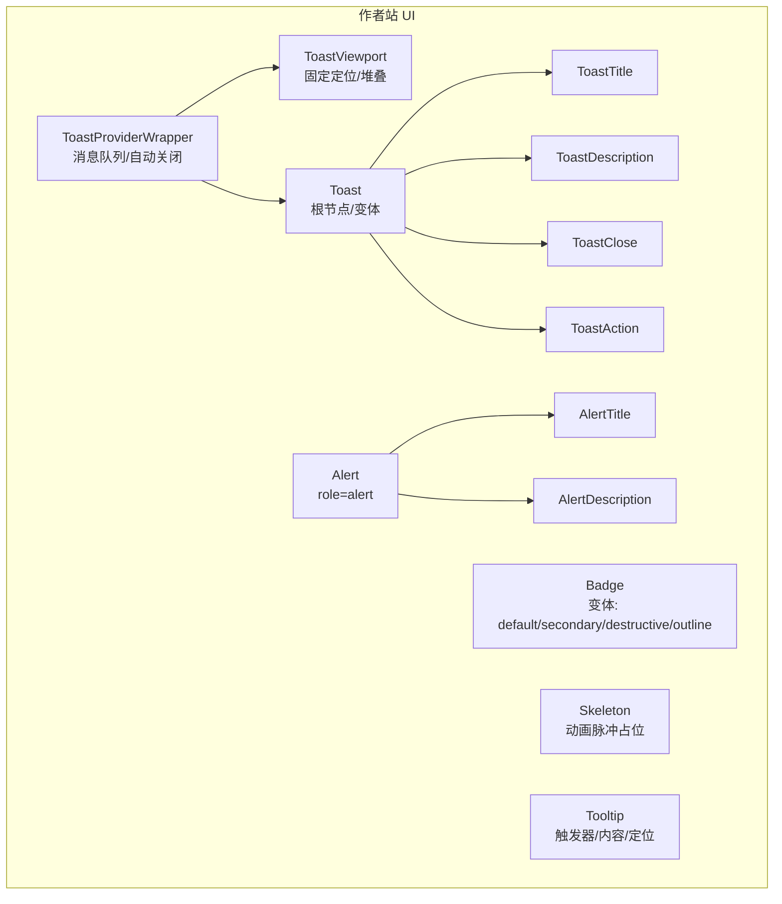
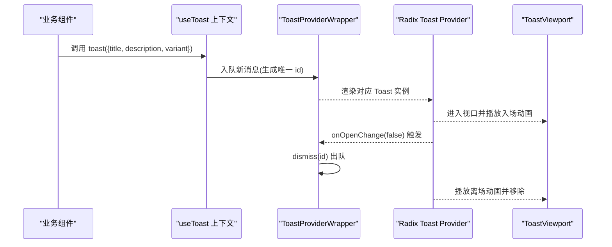
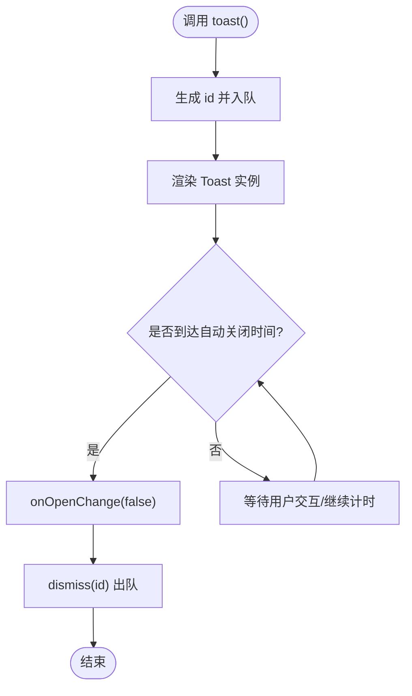
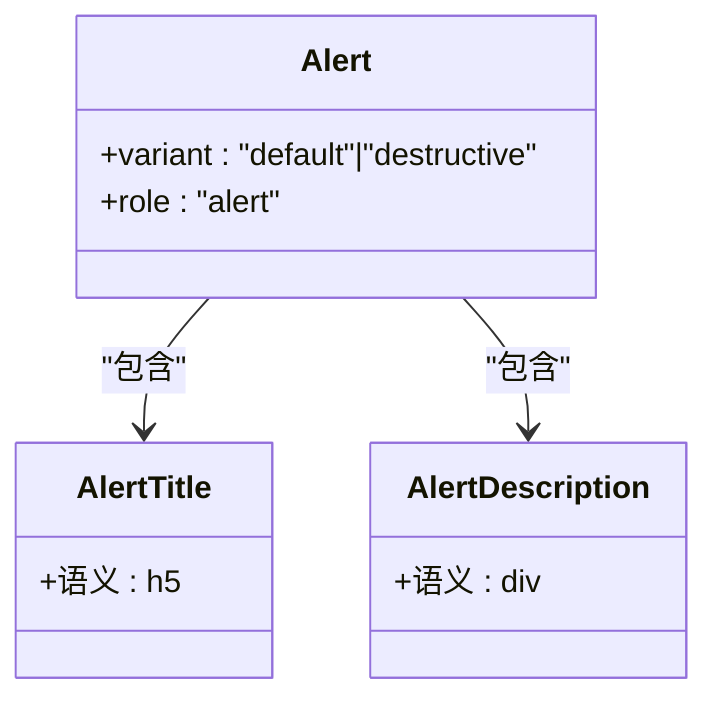
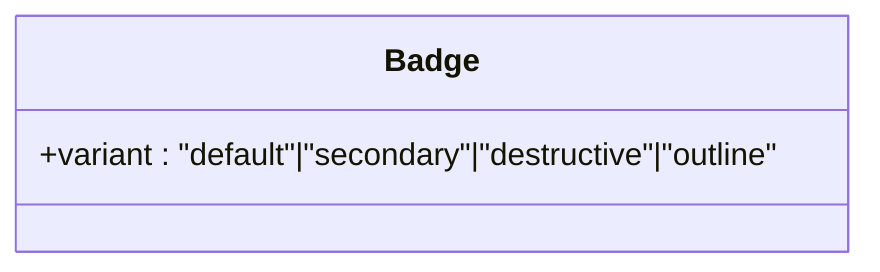
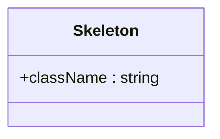
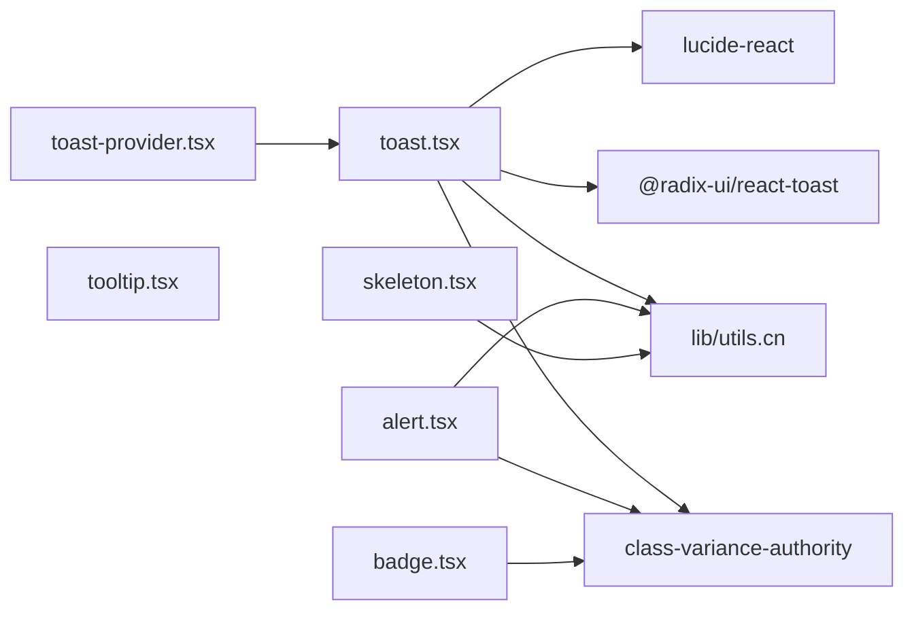

# 反馈与交互组件

<cite>
**本文引用的文件**   
- [toast-provider.tsx](file://packages/author-site/src/components/ui/toast-provider.tsx)
- [toast.tsx](file://packages/author-site/src/components/ui/toast.tsx)
- [alert.tsx](file://packages/author-site/src/components/ui/alert.tsx)
- [badge.tsx](file://packages/author-site/src/components/ui/badge.tsx)
- [skeleton.tsx](file://packages/author-site/src/components/ui/skeleton.tsx)
- [tooltip.tsx](file://packages/author-site/src/components/ui/tooltip.tsx)
</cite>

## 目录
1. [简介](#简介)
2. [项目结构](#项目结构)
3. [核心组件](#核心组件)
4. [架构总览](#架构总览)
5. [详细组件分析](#详细组件分析)
6. [依赖关系分析](#依赖关系分析)
7. [性能考量](#性能考量)
8. [故障排查指南](#故障排查指南)
9. [结论](#结论)
10. [附录](#附录)

## 简介
本章节面向 Workbench 的“反馈与交互”类 UI 组件，覆盖警告提示（Alert）、Toast 通知、徽章（Badge）、骨架屏（Skeleton）、工具提示（Tooltip）等。文档重点说明：
- 消息队列管理与多实例处理
- 自动关闭机制与生命周期管理
- 状态同步与可访问性实现
- 自定义样式配置与主题适配
- 典型场景示例：错误提示、成功反馈、加载占位

## 项目结构
以下组件位于 author-site 包的 UI 层，采用“基础原子组件 + 组合式 Provider”的组织方式：
- toast-provider.tsx：封装 Toast 上下文、消息队列、自动关闭与视口定位
- toast.tsx：基于 Radix Toast 的基础组件集合（Root、Viewport、Title、Description、Close、Action）
- alert.tsx：静态警告/错误提示容器及标题、描述子元素
- badge.tsx：标签/徽章，支持多种变体
- skeleton.tsx：骨架屏占位，用于加载态
- tooltip.tsx：工具提示（见后文依赖分析）

图表来源
- [toast-provider.tsx:31-72](file://packages/author-site/src/components/ui/toast-provider.tsx#L31-L72)
- [toast.tsx:10-25](file://packages/author-site/src/components/ui/toast.tsx#L10-L25)
- [toast.tsx:43-56](file://packages/author-site/src/components/ui/toast.tsx#L43-L56)
- [toast.tsx:91-113](file://packages/author-site/src/components/ui/toast.tsx#L91-L113)
- [alert.tsx:21-31](file://packages/author-site/src/components/ui/alert.tsx#L21-L31)
- [badge.tsx:6-24](file://packages/author-site/src/components/ui/badge.tsx#L6-L24)
- [skeleton.tsx:3-13](file://packages/author-site/src/components/ui/skeleton.tsx#L3-L13)
- [tooltip.tsx](file://packages/author-site/src/components/ui/tooltip.tsx)

章节来源
- [toast-provider.tsx:1-81](file://packages/author-site/src/components/ui/toast-provider.tsx#L1-L81)
- [toast.tsx:1-130](file://packages/author-site/src/components/ui/toast.tsx#L1-L130)
- [alert.tsx:1-59](file://packages/author-site/src/components/ui/alert.tsx#L1-L59)
- [badge.tsx:1-37](file://packages/author-site/src/components/ui/badge.tsx#L1-L37)
- [skeleton.tsx:1-16](file://packages/author-site/src/components/ui/skeleton.tsx#L1-L16)
- [tooltip.tsx](file://packages/author-site/src/components/ui/tooltip.tsx)

## 核心组件
- Alert：用于页面内静态或动态的错误/警告信息展示，具备无障碍角色 role="alert"，适合屏幕阅读器播报。
- Toast：轻量级非阻塞通知，支持默认与破坏性两种变体，提供标题、描述、操作按钮与关闭按钮；通过 Provider 集中管理消息队列与自动关闭。
- Badge：用于状态标记、计数或分类标签，支持多种视觉变体。
- Skeleton：在数据未就绪时显示骨架占位，配合动画提升感知性能。
- Tooltip：为交互元素提供辅助说明，通常由触发器与浮层内容组成。

章节来源
- [alert.tsx:21-31](file://packages/author-site/src/components/ui/alert.tsx#L21-L31)
- [toast-provider.tsx:31-72](file://packages/author-site/src/components/ui/toast-provider.tsx#L31-L72)
- [toast.tsx:27-41](file://packages/author-site/src/components/ui/toast.tsx#L27-L41)
- [badge.tsx:6-24](file://packages/author-site/src/components/ui/badge.tsx#L6-L24)
- [skeleton.tsx:3-13](file://packages/author-site/src/components/ui/skeleton.tsx#L3-L13)
- [tooltip.tsx](file://packages/author-site/src/components/ui/tooltip.tsx)

## 架构总览
Toast 采用“上下文 + 列表渲染 + 视口容器”的架构：
- 应用根处包裹 ToastProviderWrapper，维护 toasts 数组作为消息队列
- useToast 暴露 toast/dismiss API，供任意子组件调用
- 每个 Toast 实例由 Radix 管理打开/关闭状态与动画，关闭时回调 dismiss 从队列移除
- ToastViewport 负责全局固定定位与堆叠布局

图表来源
- [toast-provider.tsx:38-72](file://packages/author-site/src/components/ui/toast-provider.tsx#L38-L72)
- [toast.tsx:10-25](file://packages/author-site/src/components/ui/toast.tsx#L10-L25)
- [toast.tsx:43-56](file://packages/author-site/src/components/ui/toast.tsx#L43-L56)

## 详细组件分析

### Toast 通知
- 消息模型
  - id：唯一标识，用于去重与删除
  - title/description：标题与描述文本
  - variant：default | destructive
- 队列与生命周期
  - 入队：useToast.toast(message) 追加到 toasts 数组
  - 渲染：遍历 toasts 渲染多个 Toast 实例
  - 关闭：onOpenChange(false) 触发 dismiss(id)，从队列移除
  - 自动关闭：Provider 设置 duration，由底层 Radix 控制计时与动画
- 多实例与堆叠
  - ToastViewport 使用 flex-col 堆叠，限制最大宽度与高度，避免遮挡
- 可访问性
  - 使用 Radix Toast 语义化元素与键盘交互
  - 关闭按钮具备焦点可见性与 hover/focus 状态
- 自定义样式
  - 通过 class-variance-authority 定义变体，结合 cn 合并 className
  - 支持传入额外 className 覆盖默认样式

图表来源
- [toast-provider.tsx:38-72](file://packages/author-site/src/components/ui/toast-provider.tsx#L38-L72)
- [toast.tsx:27-41](file://packages/author-site/src/components/ui/toast.tsx#L27-L41)

章节来源
- [toast-provider.tsx:14-27](file://packages/author-site/src/components/ui/toast-provider.tsx#L14-L27)
- [toast-provider.tsx:31-72](file://packages/author-site/src/components/ui/toast-provider.tsx#L31-L72)
- [toast.tsx:10-25](file://packages/author-site/src/components/ui/toast.tsx#L10-L25)
- [toast.tsx:27-41](file://packages/author-site/src/components/ui/toast.tsx#L27-L41)
- [toast.tsx:73-89](file://packages/author-site/src/components/ui/toast.tsx#L73-L89)

### 警告提示 Alert
- 结构与用途
  - Alert 作为容器，内部包含 AlertTitle 与 AlertDescription
  - 适用于表单校验失败、系统告警等静态信息
- 可访问性
  - 根节点设置 role="alert"，便于屏幕阅读器及时播报
- 变体
  - default：通用背景与前景色
  - destructive：强调错误/危险语义

图表来源
- [alert.tsx:21-31](file://packages/author-site/src/components/ui/alert.tsx#L21-L31)
- [alert.tsx:34-56](file://packages/author-site/src/components/ui/alert.tsx#L34-L56)

章节来源
- [alert.tsx:5-19](file://packages/author-site/src/components/ui/alert.tsx#L5-L19)
- [alert.tsx:21-31](file://packages/author-site/src/components/ui/alert.tsx#L21-L31)
- [alert.tsx:34-56](file://packages/author-site/src/components/ui/alert.tsx#L34-L56)

### 徽章 Badge
- 用途
  - 状态标记、数量角标、分类标签
- 变体
  - default / secondary / destructive / outline
- 可访问性
  - 纯装饰时建议 aria-hidden 或由父级承担语义
  - 承载重要信息时可配合 aria-label

图表来源
- [badge.tsx:6-24](file://packages/author-site/src/components/ui/badge.tsx#L6-L24)

章节来源
- [badge.tsx:6-24](file://packages/author-site/src/components/ui/badge.tsx#L6-L24)
- [badge.tsx:26-34](file://packages/author-site/src/components/ui/badge.tsx#L26-L34)

### 骨架屏 Skeleton
- 用途
  - 数据加载期间显示占位，减少首屏空白带来的不适感
- 样式
  - 使用动画脉冲与圆角矩形模拟内容块
- 最佳实践
  - 根据真实内容尺寸设置宽高，避免布局抖动

图表来源
- [skeleton.tsx:3-13](file://packages/author-site/src/components/ui/skeleton.tsx#L3-L13)

章节来源
- [skeleton.tsx:3-13](file://packages/author-site/src/components/ui/skeleton.tsx#L3-L13)

### 工具提示 Tooltip
- 职责
  - 为按钮、图标等小控件提供简短说明
- 交互
  - 鼠标悬停/聚焦显示，离开隐藏
  - 支持受控/非受控模式（具体以组件实现为准）
- 可访问性
  - 使用合适的 aria-* 属性与焦点管理（由底层库保障）

章节来源
- [tooltip.tsx](file://packages/author-site/src/components/ui/tooltip.tsx)

## 依赖关系分析
- 外部依赖
  - @radix-ui/react-toast：提供 Toast 的无障碍与交互能力
  - class-variance-authority：声明式变体与样式组合
  - lucide-react：关闭图标
  - 内部 utils：cn 工具函数用于条件拼接 className
- 组件耦合
  - toast-provider.tsx 依赖 toast.tsx 导出的基础组件
  - alert.tsx、badge.tsx、skeleton.tsx 为独立原子组件，无相互依赖
  - tooltip.tsx 独立存在，可在需要处按需引入

图表来源
- [toast-provider.tsx:1-12](file://packages/author-site/src/components/ui/toast-provider.tsx#L1-L12)
- [toast.tsx:1-8](file://packages/author-site/src/components/ui/toast.tsx#L1-L8)
- [alert.tsx:1-4](file://packages/author-site/src/components/ui/alert.tsx#L1-L4)
- [badge.tsx:1-4](file://packages/author-site/src/components/ui/badge.tsx#L1-L4)
- [skeleton.tsx:1](file://packages/author-site/src/components/ui/skeleton.tsx#L1)

章节来源
- [toast-provider.tsx:1-12](file://packages/author-site/src/components/ui/toast-provider.tsx#L1-L12)
- [toast.tsx:1-8](file://packages/author-site/src/components/ui/toast.tsx#L1-L8)
- [alert.tsx:1-4](file://packages/author-site/src/components/ui/alert.tsx#L1-L4)
- [badge.tsx:1-4](file://packages/author-site/src/components/ui/badge.tsx#L1-L4)
- [skeleton.tsx:1](file://packages/author-site/src/components/ui/skeleton.tsx#L1)

## 性能考量
- 批量更新
  - 频繁调用 toast() 会多次入队，建议在高频场景下合并消息或使用节流策略
- 动画与重排
  - Toast 入场/出场动画由 Radix 驱动，避免在同一帧大量创建/销毁实例
- 视口与滚动
  - ToastViewport 固定定位且限制最大高度，长列表需考虑滚动体验
- 样式计算
  - cva 与 cn 在运行时进行样式组合，尽量复用 className 以减少重复计算

[本节为通用指导，不直接分析具体文件]

## 故障排查指南
- 报错：必须在 ToastProviderWrapper 内使用 useToast
  - 现象：抛出“必须在使用 ToastProviderWrapper 的上下文中使用 useToast”
  - 解决：在应用根节点包裹 ToastProviderWrapper
  - 参考路径
    - [toast-provider.tsx:74-80](file://packages/author-site/src/components/ui/toast-provider.tsx#L74-L80)
- Toast 无法自动关闭
  - 检查 Provider 的 duration 配置是否正确
  - 确认未手动阻止 onOpenChange(false) 的触发
  - 参考路径
    - [toast-provider.tsx:49](file://packages/author-site/src/components/ui/toast-provider.tsx#L49)
    - [toast-provider.tsx:55-57](file://packages/author-site/src/components/ui/toast-provider.tsx#L55-L57)
- 多实例重叠或遮挡
  - 调整 ToastViewport 的间距与最大宽度
  - 参考路径
    - [toast.tsx:15-24](file://packages/author-site/src/components/ui/toast.tsx#L15-L24)
- Alert 未被读屏器播报
  - 确保根节点保留 role="alert"
  - 参考路径
    - [alert.tsx:21-31](file://packages/author-site/src/components/ui/alert.tsx#L21-L31)

章节来源
- [toast-provider.tsx:74-80](file://packages/author-site/src/components/ui/toast-provider.tsx#L74-L80)
- [toast-provider.tsx:49-57](file://packages/author-site/src/components/ui/toast-provider.tsx#L49-L57)
- [toast.tsx:15-24](file://packages/author-site/src/components/ui/toast.tsx#L15-L24)
- [alert.tsx:21-31](file://packages/author-site/src/components/ui/alert.tsx#L21-L31)

## 结论
Workbench 的反馈与交互组件围绕“低耦合、高可用、易扩展”的原则构建：
- Alert/Badge/Skeleton/Tooltip 提供稳定的原子能力
- Toast 通过 Provider 统一管理消息队列、生命周期与自动关闭
- 借助 Radix 与 cva/cn 的组合，兼顾可访问性与主题定制
- 在多实例与复杂交互场景中，遵循最小变更与可观测原则，可获得更佳的稳定性与性能

[本节为总结性内容，不直接分析具体文件]

## 附录

### 典型场景与用法要点
- 错误提示（Toast）
  - 使用 destructive 变体，附带明确的操作按钮（如重试）
  - 参考路径
    - [toast.tsx:33-35](file://packages/author-site/src/components/ui/toast.tsx#L33-L35)
    - [toast.tsx:58-71](file://packages/author-site/src/components/ui/toast.tsx#L58-L71)
- 成功反馈（Toast）
  - 使用 default 变体，简洁标题+描述
  - 参考路径
    - [toast.tsx:31-32](file://packages/author-site/src/components/ui/toast.tsx#L31-L32)
- 加载状态（Skeleton）
  - 在数据请求前渲染骨架屏，完成后替换为真实内容
  - 参考路径
    - [skeleton.tsx:3-13](file://packages/author-site/src/components/ui/skeleton.tsx#L3-L13)
- 静态告警（Alert）
  - 表单提交失败或系统异常时使用，保持 role="alert"
  - 参考路径
    - [alert.tsx:21-31](file://packages/author-site/src/components/ui/alert.tsx#L21-L31)
- 辅助说明（Tooltip）
  - 为复杂控件添加简短解释，注意焦点与键盘可达性
  - 参考路径
    - [tooltip.tsx](file://packages/author-site/src/components/ui/tooltip.tsx)

### 可访问性清单
- Alert 根节点 role="alert"
- Toast 使用 Radix 提供的无障碍语义与键盘导航
- 关闭按钮具备清晰的焦点样式与可点击区域
- 徽章若仅具装饰性，应避免干扰读屏器

章节来源
- [alert.tsx:21-31](file://packages/author-site/src/components/ui/alert.tsx#L21-L31)
- [toast.tsx:73-89](file://packages/author-site/src/components/ui/toast.tsx#L73-L89)
- [badge.tsx:6-24](file://packages/author-site/src/components/ui/badge.tsx#L6-L24)
- [tooltip.tsx](file://packages/author-site/src/components/ui/tooltip.tsx)