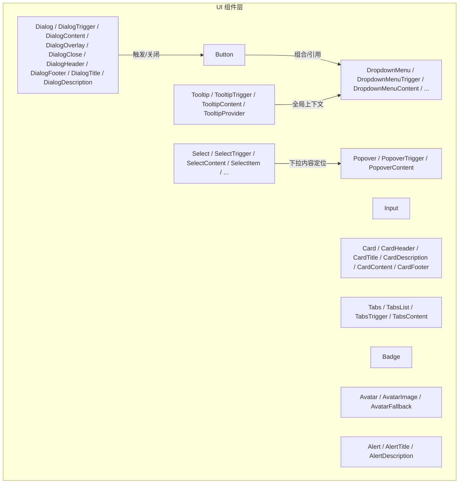
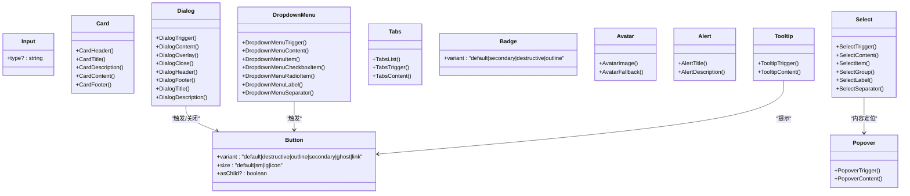
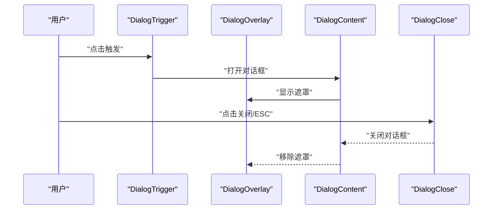
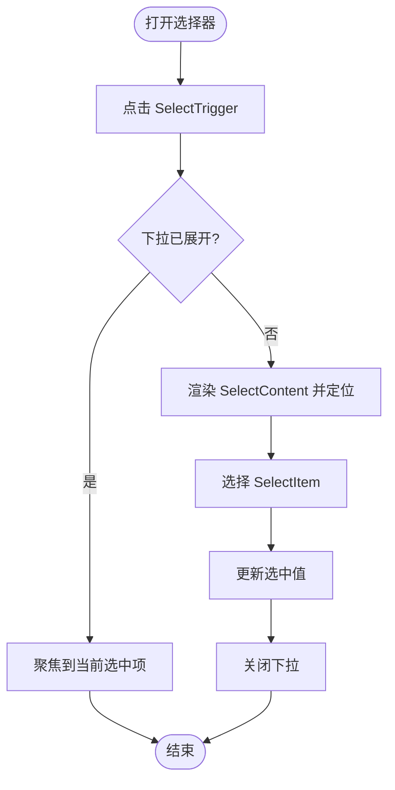
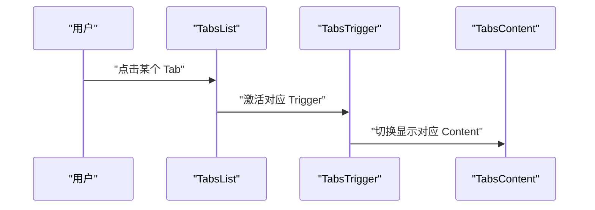
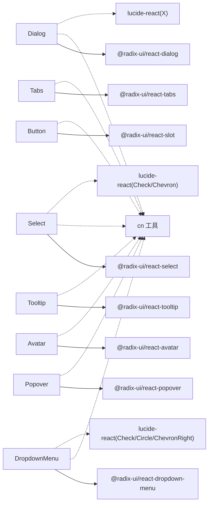

# 基础 UI 组件

<cite>
**本文引用的文件**   
- [button.tsx](file://packages/author-site/src/components/ui/button.tsx)
- [input.tsx](file://packages/author-site/src/components/ui/input.tsx)
- [card.tsx](file://packages/author-site/src/components/ui/card.tsx)
- [dialog.tsx](file://packages/author-site/src/components/ui/dialog.tsx)
- [select.tsx](file://packages/author-site/src/components/ui/select.tsx)
- [tabs.tsx](file://packages/author-site/src/components/ui/tabs.tsx)
- [badge.tsx](file://packages/author-site/src/components/ui/badge.tsx)
- [avatar.tsx](file://packages/author-site/src/components/ui/avatar.tsx)
- [alert.tsx](file://packages/author-site/src/components/ui/alert.tsx)
- [tooltip.tsx](file://packages/author-site/src/components/ui/tooltip.tsx)
- [popover.tsx](file://packages/author-site/src/components/ui/popover.tsx)
- [dropdown-menu.tsx](file://packages/author-site/src/components/ui/dropdown-menu.tsx)
</cite>

## 目录
1. [简介](#简介)
2. [项目结构](#项目结构)
3. [核心组件](#核心组件)
4. [架构总览](#架构总览)
5. [详细组件分析](#详细组件分析)
6. [依赖关系分析](#依赖关系分析)
7. [性能考量](#性能考量)
8. [故障排查指南](#故障排查指南)
9. [结论](#结论)
10. [附录](#附录)

## 简介
本章节面向 Workbench 基础 UI 组件，基于 shadcn/ui 设计系统（Radix UI + Tailwind CSS）对按钮、输入框、卡片、对话框、选择器、标签页等核心组件进行系统化文档化。内容覆盖：
- Props 接口定义与默认值
- 事件处理机制与可访问性支持
- 样式定制选项与主题适配方案
- 响应式设计与组合使用模式
- 常见使用场景与最佳实践
- 性能优化策略

## 项目结构
基础 UI 组件位于 author-site 的 components/ui 目录中，采用“原子化”拆分：每个组件一个文件，通过 Radix Primitive 提供无障碍能力，通过 Tailwind 和 class-variance-authority 实现变体与样式组合。

图表来源
- [button.tsx:1-57](file://packages/author-site/src/components/ui/button.tsx#L1-L57)
- [dialog.tsx:1-123](file://packages/author-site/src/components/ui/dialog.tsx#L1-L123)
- [select.tsx:1-160](file://packages/author-site/src/components/ui/select.tsx#L1-L160)
- [tabs.tsx:1-56](file://packages/author-site/src/components/ui/tabs.tsx#L1-L56)
- [badge.tsx:1-37](file://packages/author-site/src/components/ui/badge.tsx#L1-L37)
- [avatar.tsx:1-51](file://packages/author-site/src/components/ui/avatar.tsx#L1-L51)
- [alert.tsx:1-59](file://packages/author-site/src/components/ui/alert.tsx#L1-L59)
- [tooltip.tsx:1-31](file://packages/author-site/src/components/ui/tooltip.tsx#L1-L31)
- [popover.tsx:1-36](file://packages/author-site/src/components/ui/popover.tsx#L1-L36)
- [dropdown-menu.tsx:1-201](file://packages/author-site/src/components/ui/dropdown-menu.tsx#L1-L201)

章节来源
- [button.tsx:1-57](file://packages/author-site/src/components/ui/button.tsx#L1-L57)
- [input.tsx:1-26](file://packages/author-site/src/components/ui/input.tsx#L1-L26)
- [card.tsx:1-80](file://packages/author-site/src/components/ui/card.tsx#L1-L80)
- [dialog.tsx:1-123](file://packages/author-site/src/components/ui/dialog.tsx#L1-L123)
- [select.tsx:1-160](file://packages/author-site/src/components/ui/select.tsx#L1-L160)
- [tabs.tsx:1-56](file://packages/author-site/src/components/ui/tabs.tsx#L1-L56)
- [badge.tsx:1-37](file://packages/author-site/src/components/ui/badge.tsx#L1-L37)
- [avatar.tsx:1-51](file://packages/author-site/src/components/ui/avatar.tsx#L1-L51)
- [alert.tsx:1-59](file://packages/author-site/src/components/ui/alert.tsx#L1-L59)
- [tooltip.tsx:1-31](file://packages/author-site/src/components/ui/tooltip.tsx#L1-L31)
- [popover.tsx:1-36](file://packages/author-site/src/components/ui/popover.tsx#L1-L36)
- [dropdown-menu.tsx:1-201](file://packages/author-site/src/components/ui/dropdown-menu.tsx#L1-L201)

## 核心组件
本节聚焦以下组件：Button、Input、Card、Dialog、Select、Tabs，并补充 Badge、Avatar、Alert、Tooltip、Popover、DropdownMenu 作为常用辅助组件。

- 通用特性
  - 基于 Radix Primitive，具备键盘导航、焦点管理、ARIA 属性等可访问性保障
  - 使用 Tailwind 语义化类名与 CSS 变量（如 bg-primary、text-card-foreground），天然支持深色模式
  - 通过 class-variance-authority 提供 variant/size 等变体，统一风格且易于扩展
  - 通过 cn 工具函数合并 className，便于外部覆盖

章节来源
- [button.tsx:1-57](file://packages/author-site/src/components/ui/button.tsx#L1-L57)
- [input.tsx:1-26](file://packages/author-site/src/components/ui/input.tsx#L1-L26)
- [card.tsx:1-80](file://packages/author-site/src/components/ui/card.tsx#L1-L80)
- [dialog.tsx:1-123](file://packages/author-site/src/components/ui/dialog.tsx#L1-L123)
- [select.tsx:1-160](file://packages/author-site/src/components/ui/select.tsx#L1-L160)
- [tabs.tsx:1-56](file://packages/author-site/src/components/ui/tabs.tsx#L1-L56)
- [badge.tsx:1-37](file://packages/author-site/src/components/ui/badge.tsx#L1-L37)
- [avatar.tsx:1-51](file://packages/author-site/src/components/ui/avatar.tsx#L1-L51)
- [alert.tsx:1-59](file://packages/author-site/src/components/ui/alert.tsx#L1-L59)
- [tooltip.tsx:1-31](file://packages/author-site/src/components/ui/tooltip.tsx#L1-L31)
- [popover.tsx:1-36](file://packages/author-site/src/components/ui/popover.tsx#L1-L36)
- [dropdown-menu.tsx:1-201](file://packages/author-site/src/components/ui/dropdown-menu.tsx#L1-L201)

## 架构总览
所有基础组件均遵循同一架构范式：
- 以 React.forwardRef 暴露 ref
- 使用 Radix Primitive 封装交互与可访问性
- 使用 Tailwind 与 cva 管理样式变体
- 通过 Portal 渲染浮层（Dialog/Select/Dropdown/Popover/Tooltip）

图表来源
- [button.tsx:1-57](file://packages/author-site/src/components/ui/button.tsx#L1-L57)
- [input.tsx:1-26](file://packages/author-site/src/components/ui/input.tsx#L1-L26)
- [card.tsx:1-80](file://packages/author-site/src/components/ui/card.tsx#L1-L80)
- [dialog.tsx:1-123](file://packages/author-site/src/components/ui/dialog.tsx#L1-L123)
- [select.tsx:1-160](file://packages/author-site/src/components/ui/select.tsx#L1-L160)
- [tabs.tsx:1-56](file://packages/author-site/src/components/ui/tabs.tsx#L1-L56)
- [badge.tsx:1-37](file://packages/author-site/src/components/ui/badge.tsx#L1-L37)
- [avatar.tsx:1-51](file://packages/author-site/src/components/ui/avatar.tsx#L1-L51)
- [alert.tsx:1-59](file://packages/author-site/src/components/ui/alert.tsx#L1-L59)
- [tooltip.tsx:1-31](file://packages/author-site/src/components/ui/tooltip.tsx#L1-L31)
- [popover.tsx:1-36](file://packages/author-site/src/components/ui/popover.tsx#L1-L36)
- [dropdown-menu.tsx:1-201](file://packages/author-site/src/components/ui/dropdown-menu.tsx#L1-L201)

## 详细组件分析

### 按钮 Button
- 职责与用途
  - 触发操作、提交表单、切换状态等
- Props 接口要点
  - variant：default、destructive、outline、secondary、ghost、link
  - size：default、sm、lg、icon
  - asChild：是否将 button 替换为子元素（如 a、Link）
  - 其余透传原生 button 属性（onClick、disabled、aria-* 等）
- 事件处理
  - 标准 onClick；禁用态自动阻止交互
- 可访问性
  - 聚焦环、禁用态、键盘可用
- 样式与主题
  - 通过 cva 管理变体；颜色使用语义化 token（bg-primary、text-primary-foreground 等）
- 响应式
  - 尺寸与间距由 Tailwind 控制，适合多端一致体验
- 组合示例路径
  - 在对话框中使用作为确认/取消按钮
  - 在菜单项中作为操作入口
- 最佳实践
  - 使用 asChild 与路由/链接组件集成
  - 明确区分主操作与次要操作（variant 选择）

章节来源
- [button.tsx:1-57](file://packages/author-site/src/components/ui/button.tsx#L1-L57)

### 输入框 Input
- 职责与用途
  - 文本输入、搜索、过滤、表单字段
- Props 接口要点
  - type：text/password/email/url 等
  - 透传原生 input 属性（value、onChange、placeholder、disabled、required 等）
- 事件处理
  - onChange/onBlur/onFocus 等原生事件
- 可访问性
  - 原生 input 自带无障碍语义；可与 Label 配合
- 样式与主题
  - 边框、圆角、占位符、禁用态、聚焦环统一风格
- 响应式
  - 宽度自适应，适合移动端输入
- 组合示例路径
  - 与 Label 组成表单控件
  - 与 Button 组成搜索栏
- 最佳实践
  - 始终提供 placeholder 或关联 Label
  - 对敏感类型使用 password

章节来源
- [input.tsx:1-26](file://packages/author-site/src/components/ui/input.tsx#L1-L26)

### 卡片 Card
- 职责与用途
  - 信息分组、展示结构化内容块
- 子组件
  - CardHeader/CardTitle/CardDescription/CardContent/CardFooter
- Props 接口要点
  - 各子组件透传 HTMLAttributes
- 样式与主题
  - 背景、边框、阴影、内边距统一；标题强调层级
- 组合示例路径
  - 列表项卡片、设置面板卡片
- 最佳实践
  - 合理使用 Header/Content/Footer 分区，保持视觉层次清晰

章节来源
- [card.tsx:1-80](file://packages/author-site/src/components/ui/card.tsx#L1-L80)

### 对话框 Dialog
- 职责与用途
  - 模态确认、表单录入、详情查看
- 子组件
  - Dialog/DialogTrigger/DialogPortal/DialogClose/DialogOverlay/DialogContent/DialogHeader/DialogFooter/DialogTitle/DialogDescription
- 交互流程

- 可访问性
  - 焦点陷阱、ARIA 角色、关闭按钮 sr-only 说明
- 样式与主题
  - 居中定位、动画过渡、响应式圆角
- 组合示例路径
  - 与 Button 组合用于确认删除
  - 与表单控件组合用于新增编辑
- 最佳实践
  - 避免嵌套过多弹窗；必要时使用 Popover/Tooltip 替代轻量提示

章节来源
- [dialog.tsx:1-123](file://packages/author-site/src/components/ui/dialog.tsx#L1-L123)

### 选择器 Select
- 职责与用途
  - 单选下拉、分组选择、带图标指示
- 子组件
  - Select/SelectTrigger/SelectContent/SelectItem/SelectGroup/SelectLabel/SelectSeparator/ScrollUp/ScrollDown
- 交互流程

- 可访问性
  - 键盘上下导航、Enter/Space 选择、Escape 关闭
- 样式与主题
  - 滚动区域、选中指示、分隔线
- 组合示例路径
  - 与 Form 结合做筛选条件
- 最佳实践
  - 长列表考虑虚拟滚动（上层封装）

章节来源
- [select.tsx:1-160](file://packages/author-site/src/components/ui/select.tsx#L1-L160)

### 标签页 Tabs
- 职责与用途
  - 同屏分块组织内容，快速切换
- 子组件
  - Tabs/TabsList/TabsTrigger/TabsContent
- 交互流程

- 可访问性
  - 键盘左右切换、活动态高亮
- 样式与主题
  - 激活态背景与文字对比度
- 组合示例路径
  - 设置页签、数据视图切换
- 最佳实践
  - 内容较重时按需懒加载

章节来源
- [tabs.tsx:1-56](file://packages/author-site/src/components/ui/tabs.tsx#L1-L56)

### 辅助组件概览
- Badge
  - 状态标记、计数、分类标签
  - variant：default、secondary、destructive、outline
- Avatar
  - 头像容器、图片、降级占位
- Alert
  - 全局提示、错误告警（role="alert"）
- Tooltip
  - 悬浮提示，轻量解释
- Popover
  - 浮动面板，承载复杂内容
- DropdownMenu
  - 下拉菜单，支持复选/单选/分隔/快捷键

章节来源
- [badge.tsx:1-37](file://packages/author-site/src/components/ui/badge.tsx#L1-L37)
- [avatar.tsx:1-51](file://packages/author-site/src/components/ui/avatar.tsx#L1-L51)
- [alert.tsx:1-59](file://packages/author-site/src/components/ui/alert.tsx#L1-L59)
- [tooltip.tsx:1-31](file://packages/author-site/src/components/ui/tooltip.tsx#L1-L31)
- [popover.tsx:1-36](file://packages/author-site/src/components/ui/popover.tsx#L1-L36)
- [dropdown-menu.tsx:1-201](file://packages/author-site/src/components/ui/dropdown-menu.tsx#L1-L201)

## 依赖关系分析
- 内部依赖
  - 全部组件依赖 @radix-ui/* 提供可访问性与交互
  - 使用 cn 工具函数合并 className
  - 使用 class-variance-authority 管理变体
- 外部依赖
  - lucide-react 提供图标（如 Dialog 关闭、Select 箭头、Dropdown 指示）
- 耦合与内聚
  - 组件间低耦合，通过组合而非继承复用
  - 浮层组件通过 Portal 解耦 DOM 层级

图表来源
- [button.tsx:1-57](file://packages/author-site/src/components/ui/button.tsx#L1-L57)
- [dialog.tsx:1-123](file://packages/author-site/src/components/ui/dialog.tsx#L1-L123)
- [select.tsx:1-160](file://packages/author-site/src/components/ui/select.tsx#L1-L160)
- [tabs.tsx:1-56](file://packages/author-site/src/components/ui/tabs.tsx#L1-L56)
- [dropdown-menu.tsx:1-201](file://packages/author-site/src/components/ui/dropdown-menu.tsx#L1-L201)
- [tooltip.tsx:1-31](file://packages/author-site/src/components/ui/tooltip.tsx#L1-L31)
- [popover.tsx:1-36](file://packages/author-site/src/components/ui/popover.tsx#L1-L36)
- [avatar.tsx:1-51](file://packages/author-site/src/components/ui/avatar.tsx#L1-L51)

章节来源
- [button.tsx:1-57](file://packages/author-site/src/components/ui/button.tsx#L1-L57)
- [dialog.tsx:1-123](file://packages/author-site/src/components/ui/dialog.tsx#L1-L123)
- [select.tsx:1-160](file://packages/author-site/src/components/ui/select.tsx#L1-L160)
- [tabs.tsx:1-56](file://packages/author-site/src/components/ui/tabs.tsx#L1-L56)
- [dropdown-menu.tsx:1-201](file://packages/author-site/src/components/ui/dropdown-menu.tsx#L1-L201)
- [tooltip.tsx:1-31](file://packages/author-site/src/components/ui/tooltip.tsx#L1-L31)
- [popover.tsx:1-36](file://packages/author-site/src/components/ui/popover.tsx#L1-L36)
- [avatar.tsx:1-51](file://packages/author-site/src/components/ui/avatar.tsx#L1-L51)

## 性能考量
- 渲染与重排
  - 浮层组件使用 Portal 渲染，减少布局抖动
  - 避免在高频回调中创建新对象（如 options、style）
- 事件与计算
  - 列表型组件（Select/Dropdown）在大数据量时建议在上层实现虚拟化
- 样式与主题
  - 使用语义化 Token 与 Tailwind 原子类，利于 Tree-shaking 与缓存
- 可访问性
  - 正确设置 aria-* 与 role，提升屏幕阅读器体验

[本节为通用指导，不直接分析具体文件]

## 故障排查指南
- 浮层被遮挡
  - 检查 z-index 与父级 overflow 设置；确保 Portal 挂载点未被裁剪
- 键盘不可用
  - 确认使用了 Radix 提供的 Trigger/Content 组合，未自定义破坏焦点流
- 样式不生效
  - 检查 Tailwind 配置是否包含语义化 Token；确认 cn 合并顺序
- 主题不一致
  - 确认根节点设置了 data-theme 或 dark 类，CSS 变量已注入

[本节为通用指导，不直接分析具体文件]

## 结论
Workbench 基础 UI 组件以 shadcn/ui 为基石，借助 Radix 的可访问性与 Tailwind 的灵活性，提供了稳定、可组合、易定制的核心控件。通过统一的变体系统与语义化 Token，组件在不同主题与设备下保持一致体验。建议在业务中优先组合现有组件，并在需要时通过外层封装扩展行为与性能。

[本节为总结性内容，不直接分析具体文件]

## 附录
- 常见组合模式
  - 表单：Input + Label + Button
  - 确认操作：Dialog + Button（确认/取消）
  - 筛选面板：Select + Badge（已选标签）+ Button（重置）
  - 信息展示：Card + Avatar + Badge
  - 导航切换：Tabs + 内容区
  - 快捷操作：DropdownMenu + Button
- 可访问性清单
  - 为所有交互元素提供键盘可达
  - 为图标与图片提供 alt/sr-only 描述
  - 为动态内容添加 aria-live 或 role="alert"
- 主题适配清单
  - 使用 bg-*、text-*、border-* 语义化 Token
  - 验证 dark 模式下对比度与可读性

[本节为概念性内容，不直接分析具体文件]