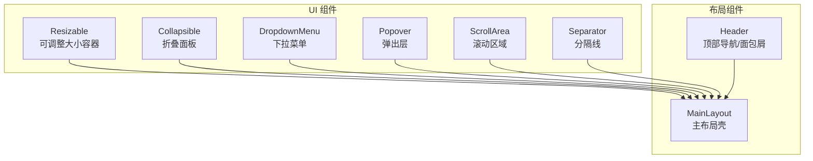
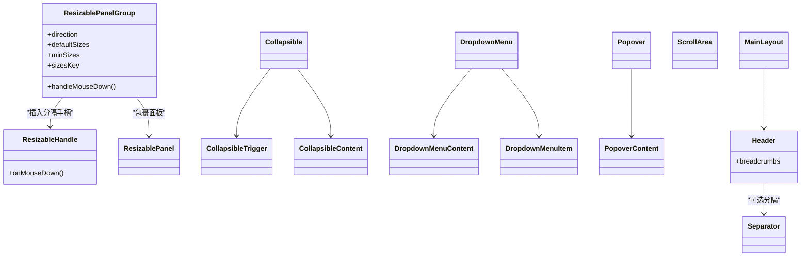
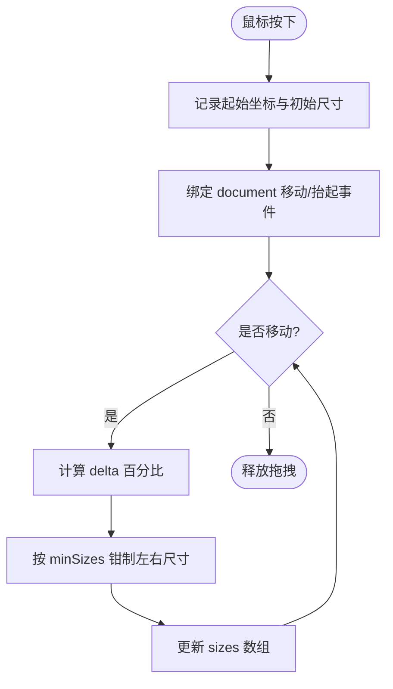
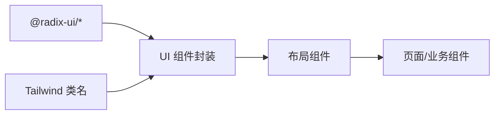
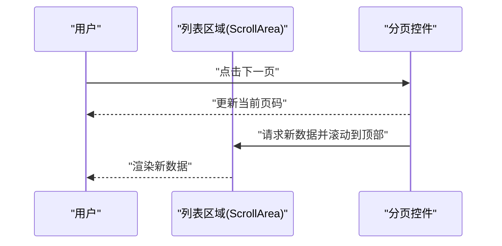

# 布局与导航组件

<cite>
**本文引用的文件**
- [resizable.tsx](file://packages/author-site/src/components/ui/resizable.tsx)
- [collapsible.tsx](file://packages/author-site/src/components/ui/collapsible.tsx)
- [dropdown-menu.tsx](file://packages/author-site/src/components/ui/dropdown-menu.tsx)
- [popover.tsx](file://packages/author-site/src/components/ui/popover.tsx)
- [scroll-area.tsx](file://packages/author-site/src/components/ui/scroll-area.tsx)
- [separator.tsx](file://packages/author-site/src/components/ui/separator.tsx)
- [header.tsx](file://packages/author-site/src/components/layout/header.tsx)
- [main-layout.tsx](file://packages/author-site/src/components/layout/main-layout.tsx)
</cite>

## 目录
1. [简介](#简介)
2. [项目结构](#项目结构)
3. [核心组件](#核心组件)
4. [架构总览](#架构总览)
5. [详细组件分析](#详细组件分析)
6. [依赖关系分析](#依赖关系分析)
7. [性能考虑](#性能考虑)
8. [故障排查指南](#故障排查指南)
9. [结论](#结论)
10. [附录](#附录)

## 简介
本文件聚焦 Workbench 创作端的“布局与导航”能力，系统性梳理以下基础 UI 组件的实现与使用：折叠面板、下拉菜单、弹出层、可调整大小容器、滚动区域、分隔线；并给出常见导航模式（侧边栏、面包屑、分页）的组合方案。文档同时覆盖层级管理、事件冒泡处理、键盘导航支持、响应式适配与移动端触摸支持，以及复杂布局场景下的组合策略与性能优化建议。

## 项目结构
这些组件位于 author-site 的 UI 与 layout 目录中，采用“基于 Radix Primitive 的轻量封装 + Tailwind 样式”的模式组织，便于复用与主题化。

图表来源
- [resizable.tsx:1-181](file://packages/author-site/src/components/ui/resizable.tsx#L1-L181)
- [collapsible.tsx:1-12](file://packages/author-site/src/components/ui/collapsible.tsx#L1-L12)
- [dropdown-menu.tsx:1-201](file://packages/author-site/src/components/ui/dropdown-menu.tsx#L1-L201)
- [popover.tsx:1-36](file://packages/author-site/src/components/ui/popover.tsx#L1-L36)
- [scroll-area.tsx:1-49](file://packages/author-site/src/components/ui/scroll-area.tsx#L1-L49)
- [separator.tsx:1-32](file://packages/author-site/src/components/ui/separator.tsx#L1-L32)
- [header.tsx:1-72](file://packages/author-site/src/components/layout/header.tsx#L1-L72)
- [main-layout.tsx:1-16](file://packages/author-site/src/components/layout/main-layout.tsx#L1-L16)

章节来源
- [resizable.tsx:1-181](file://packages/author-site/src/components/ui/resizable.tsx#L1-L181)
- [collapsible.tsx:1-12](file://packages/author-site/src/components/ui/collapsible.tsx#L1-L12)
- [dropdown-menu.tsx:1-201](file://packages/author-site/src/components/ui/dropdown-menu.tsx#L1-L201)
- [popover.tsx:1-36](file://packages/author-site/src/components/ui/popover.tsx#L1-L36)
- [scroll-area.tsx:1-49](file://packages/author-site/src/components/ui/scroll-area.tsx#L1-L49)
- [separator.tsx:1-32](file://packages/author-site/src/components/ui/separator.tsx#L1-L32)
- [header.tsx:1-72](file://packages/author-site/src/components/layout/header.tsx#L1-L72)
- [main-layout.tsx:1-16](file://packages/author-site/src/components/layout/main-layout.tsx#L1-L16)

## 核心组件
- 可调整大小容器 ResizablePanelGroup / ResizableHandle / ResizablePanel
  - 功能：水平或垂直方向的可拖拽分割面板，支持最小尺寸限制与 sizesKey 重置。
  - 交互：鼠标按下开始拖拽，document 级监听移动与抬起；拖拽时禁用文本选择。
  - 状态：sizes、isDragging、dragIndex、起始位置与初始尺寸引用。
  - 复杂度：每次 move 计算 delta 百分比并更新两个相邻面板尺寸，O(1)。
  - 参考路径：[resizable.tsx:35-172](file://packages/author-site/src/components/ui/resizable.tsx#L35-L172)

- 折叠面板 Collapsible / CollapsibleTrigger / CollapsibleContent
  - 功能：基于 Radix 的无障碍折叠区域，提供受控/非受控展开状态。
  - 参考路径：[collapsible.tsx:1-12](file://packages/author-site/src/components/ui/collapsible.tsx#L1-L12)

- 下拉菜单 DropdownMenu 系列
  - 功能：分组、单选、多选、子菜单、标签、分隔符、快捷键提示等。
  - 层级：通过 Portal 渲染到 body，避免父级 overflow/transform 影响定位。
  - 键盘：原生支持 Tab/Enter/Space/方向键/Escape 等。
  - 参考路径：[dropdown-menu.tsx:1-201](file://packages/author-site/src/components/ui/dropdown-menu.tsx#L1-L201)

- 弹出层 Popover
  - 功能：触发器 + 内容弹窗，Portal 渲染，自动对齐与偏移。
  - 参考路径：[popover.tsx:1-36](file://packages/author-site/src/components/ui/popover.tsx#L1-L36)

- 滚动区域 ScrollArea
  - 功能：跨平台一致滚动体验，自定义滚动条，touch-none 避免与父容器滚动冲突。
  - 参考路径：[scroll-area.tsx:1-49](file://packages/author-site/src/components/ui/scroll-area.tsx#L1-L49)

- 分隔线 Separator
  - 功能：水平/垂直分隔，装饰性元素，不参与焦点流。
  - 参考路径：[separator.tsx:1-32](file://packages/author-site/src/components/ui/separator.tsx#L1-L32)

- 顶部导航 Header（含面包屑）
  - 功能：站点 Logo、面包屑导航、设置入口；当前页高亮。
  - 参考路径：[header.tsx:1-72](file://packages/author-site/src/components/layout/header.tsx#L1-L72)

- 主布局 MainLayout
  - 功能：页面外壳，承载 Header 与主内容区。
  - 参考路径：[main-layout.tsx:1-16](file://packages/author-site/src/components/layout/main-layout.tsx#L1-L16)

章节来源
- [resizable.tsx:1-181](file://packages/author-site/src/components/ui/resizable.tsx#L1-L181)
- [collapsible.tsx:1-12](file://packages/author-site/src/components/ui/collapsible.tsx#L1-L12)
- [dropdown-menu.tsx:1-201](file://packages/author-site/src/components/ui/dropdown-menu.tsx#L1-L201)
- [popover.tsx:1-36](file://packages/author-site/src/components/ui/popover.tsx#L1-L36)
- [scroll-area.tsx:1-49](file://packages/author-site/src/components/ui/scroll-area.tsx#L1-L49)
- [separator.tsx:1-32](file://packages/author-site/src/components/ui/separator.tsx#L1-L32)
- [header.tsx:1-72](file://packages/author-site/src/components/layout/header.tsx#L1-L72)
- [main-layout.tsx:1-16](file://packages/author-site/src/components/layout/main-layout.tsx#L1-L16)

## 架构总览
整体采用“Radix Primitive + 业务封装”的分层设计：Primitive 负责状态机、可访问性与事件模型，封装层负责样式、默认行为与组合。布局组件将上述原子能力组合为常用模式（如侧边栏+主内容、带面包屑的顶栏）。

图表来源
- [resizable.tsx:1-181](file://packages/author-site/src/components/ui/resizable.tsx#L1-L181)
- [collapsible.tsx:1-12](file://packages/author-site/src/components/ui/collapsible.tsx#L1-L12)
- [dropdown-menu.tsx:1-201](file://packages/author-site/src/components/ui/dropdown-menu.tsx#L1-L201)
- [popover.tsx:1-36](file://packages/author-site/src/components/ui/popover.tsx#L1-L36)
- [scroll-area.tsx:1-49](file://packages/author-site/src/components/ui/scroll-area.tsx#L1-L49)
- [separator.tsx:1-32](file://packages/author-site/src/components/ui/separator.tsx#L1-L32)
- [header.tsx:1-72](file://packages/author-site/src/components/layout/header.tsx#L1-L72)
- [main-layout.tsx:1-16](file://packages/author-site/src/components/layout/main-layout.tsx#L1-L16)

## 详细组件分析

### 可调整大小容器（Resizable）
- 实现要点
  - 通过 useRef 记录拖拽起点与初始尺寸，避免闭包陈旧值问题。
  - document 级 mousemove/mouseup 监听，确保拖出组件边界仍有效。
  - 根据容器宽度计算百分比增量，对左右相邻面板进行双向补偿，并应用 minSizes 约束。
  - sizesKey 变化时重置 sizes，用于面板数量变化时的安全重建。
- 事件与键盘
  - 仅鼠标交互；如需键盘调整，可在 Trigger 上增加方向键逻辑。
- 层级与溢出
  - 面板使用 flex 布局与固定宽高百分比，配合 overflow-hidden 防止内容溢出。
- 性能
  - 拖拽过程中频繁 setSizes，建议在大型面板内使用虚拟列表或懒加载内容。
- 参考路径
  - [resizable.tsx:35-172](file://packages/author-site/src/components/ui/resizable.tsx#L35-L172)

图表来源
- [resizable.tsx:55-120](file://packages/author-site/src/components/ui/resizable.tsx#L55-L120)

章节来源
- [resizable.tsx:1-181](file://packages/author-site/src/components/ui/resizable.tsx#L1-L181)

### 折叠面板（Collapsible）
- 实现要点
  - 基于 Radix 的 CollapsibleRoot/CollapsibleTrigger/CollapsibleContent，提供 aria-expanded 与键盘 Enter/Space 切换。
- 组合建议
  - 在侧边栏中使用以折叠二级菜单；在配置面板中折叠高级选项。
- 参考路径
  - [collapsible.tsx:1-12](file://packages/author-site/src/components/ui/collapsible.tsx#L1-L12)

章节来源
- [collapsible.tsx:1-12](file://packages/author-site/src/components/ui/collapsible.tsx#L1-L12)

### 下拉菜单（DropdownMenu）
- 实现要点
  - 使用 Portal 渲染，避免被父级 transform/overflow 裁剪。
  - 提供 Group、RadioGroup、CheckboxItem、Sub 等丰富形态。
- 键盘导航
  - 打开后支持方向键上下移动焦点、Enter/Space 选择、Esc 关闭、Tab 移出。
- 层级管理
  - 通过 Portal 挂载到根节点，z-index 由样式控制，注意与 Tooltip/Popover 的层级协调。
- 参考路径
  - [dropdown-menu.tsx:1-201](file://packages/author-site/src/components/ui/dropdown-menu.tsx#L1-L201)

章节来源
- [dropdown-menu.tsx:1-201](file://packages/author-site/src/components/ui/dropdown-menu.tsx#L1-L201)

### 弹出层（Popover）
- 实现要点
  - 触发器与内容分离，Portal 渲染，自动对齐与偏移。
- 事件冒泡
  - 点击外部区域关闭；内部点击不会冒泡至外层导致意外关闭。
- 参考路径
  - [popover.tsx:1-36](file://packages/author-site/src/components/ui/popover.tsx#L1-L36)

章节来源
- [popover.tsx:1-36](file://packages/author-site/src/components/ui/popover.tsx#L1-L36)

### 滚动区域（ScrollArea）
- 实现要点
  - 统一滚动条外观与行为，touch-none 避免与父容器滚动冲突。
- 性能
  - 长列表需结合虚拟化；避免在滚动区域内做高频重排。
- 参考路径
  - [scroll-area.tsx:1-49](file://packages/author-site/src/components/ui/scroll-area.tsx#L1-L49)

章节来源
- [scroll-area.tsx:1-49](file://packages/author-site/src/components/ui/scroll-area.tsx#L1-L49)

### 分隔线（Separator）
- 实现要点
  - 装饰性元素，orientation 控制横竖，不参与焦点流。
- 参考路径
  - [separator.tsx:1-32](file://packages/author-site/src/components/ui/separator.tsx#L1-L32)

章节来源
- [separator.tsx:1-32](file://packages/author-site/src/components/ui/separator.tsx#L1-L32)

### 顶部导航与面包屑（Header）
- 实现要点
  - 接收 breadcrumbs 数组，动态渲染链接与当前页高亮；右侧集成设置按钮。
- 键盘与可访问性
  - 使用语义化 nav 与 Link，支持 Tab 顺序与键盘跳转。
- 参考路径
  - [header.tsx:1-72](file://packages/author-site/src/components/layout/header.tsx#L1-L72)

章节来源
- [header.tsx:1-72](file://packages/author-site/src/components/layout/header.tsx#L1-L72)

### 主布局（MainLayout）
- 实现要点
  - 提供全局背景与容器，注入 Header 与 main 内容区。
- 参考路径
  - [main-layout.tsx:1-16](file://packages/author-site/src/components/layout/main-layout.tsx#L1-L16)

章节来源
- [main-layout.tsx:1-16](file://packages/author-site/src/components/layout/main-layout.tsx#L1-L16)

## 依赖关系分析
- 外部依赖
  - Radix UI 提供底层状态机、Portal、可访问性与键盘行为。
  - Tailwind 类名负责视觉与响应式。
- 内部耦合
  - Layout 组件依赖 Header；UI 组件彼此解耦，通过组合形成复杂界面。
- 潜在循环
  - 无直接循环依赖；注意在组合使用时避免在 effect 中互相触发状态更新。

图表来源
- [resizable.tsx:1-181](file://packages/author-site/src/components/ui/resizable.tsx#L1-L181)
- [collapsible.tsx:1-12](file://packages/author-site/src/components/ui/collapsible.tsx#L1-L12)
- [dropdown-menu.tsx:1-201](file://packages/author-site/src/components/ui/dropdown-menu.tsx#L1-L201)
- [popover.tsx:1-36](file://packages/author-site/src/components/ui/popover.tsx#L1-L36)
- [scroll-area.tsx:1-49](file://packages/author-site/src/components/ui/scroll-area.tsx#L1-L49)
- [separator.tsx:1-32](file://packages/author-site/src/components/ui/separator.tsx#L1-L32)
- [header.tsx:1-72](file://packages/author-site/src/components/layout/header.tsx#L1-L72)
- [main-layout.tsx:1-16](file://packages/author-site/src/components/layout/main-layout.tsx#L1-L16)

章节来源
- [resizable.tsx:1-181](file://packages/author-site/src/components/ui/resizable.tsx#L1-L181)
- [header.tsx:1-72](file://packages/author-site/src/components/layout/header.tsx#L1-L72)

## 性能考虑
- 拖拽性能
  - 拖拽期间避免在面板内执行昂贵计算；必要时使用 requestAnimationFrame 节流。
- 滚动性能
  - 长列表使用虚拟滚动；减少 ScrollArea 内的重绘。
- 渲染层级
  - 多个 Portal 组件叠加时，合理设置 z-index，避免不必要的重排。
- 状态粒度
  - 将频繁变化的状态下沉到最小必要范围，避免整树重渲染。

## 故障排查指南
- 拖拽不生效或越界失效
  - 检查是否在拖拽前阻止了默认行为；确认 document 级事件已正确绑定与清理。
  - 参考路径：[resizable.tsx:55-120](file://packages/author-site/src/components/ui/resizable.tsx#L55-L120)
- 菜单/弹窗被裁剪或无法点击
  - 确认父级未使用 transform/overflow 裁剪；检查 Portal 挂载点是否被遮挡。
  - 参考路径：[dropdown-menu.tsx:59-75](file://packages/author-site/src/components/ui/dropdown-menu.tsx#L59-L75), [popover.tsx:12-28](file://packages/author-site/src/components/ui/popover.tsx#L12-L28)
- 滚动冲突或滚动条不可见
  - 检查 ScrollArea 的 touch-none 与父容器滚动是否冲突；确认 Viewport 高度设置。
  - 参考路径：[scroll-area.tsx:11-23](file://packages/author-site/src/components/ui/scroll-area.tsx#L11-L23)
- 面包屑导航未高亮或链接无效
  - 核对传入的 breadcrumbs 数据与 usePathname 匹配逻辑。
  - 参考路径：[header.tsx:18-65](file://packages/author-site/src/components/layout/header.tsx#L18-L65)

章节来源
- [resizable.tsx:55-120](file://packages/author-site/src/components/ui/resizable.tsx#L55-L120)
- [dropdown-menu.tsx:59-75](file://packages/author-site/src/components/ui/dropdown-menu.tsx#L59-L75)
- [popover.tsx:12-28](file://packages/author-site/src/components/ui/popover.tsx#L12-L28)
- [scroll-area.tsx:11-23](file://packages/author-site/src/components/ui/scroll-area.tsx#L11-L23)
- [header.tsx:18-65](file://packages/author-site/src/components/layout/header.tsx#L18-L65)

## 结论
Workbench 的布局与导航组件以 Radix 为基础，提供了稳定、可访问且易扩展的原子能力。通过合理的组合与分层，可以高效构建侧边栏、面包屑、分页等常见导航模式，并在复杂布局下保持良好性能与用户体验。

## 附录

### 常见导航模式组合示例

- 侧边栏 + 主内容
  - 使用 ResizablePanelGroup 将左侧导航与右侧内容分区，利用 Collapsible 折叠二级菜单，ScrollArea 承载长列表。
  - 参考路径：[resizable.tsx:35-172](file://packages/author-site/src/components/ui/resizable.tsx#L35-L172), [collapsible.tsx:1-12](file://packages/author-site/src/components/ui/collapsible.tsx#L1-L12), [scroll-area.tsx:1-49](file://packages/author-site/src/components/ui/scroll-area.tsx#L1-L49)

- 顶部导航 + 面包屑
  - 使用 Header 渲染面包屑，结合 Separator 分隔区块，主布局用 MainLayout 包裹。
  - 参考路径：[header.tsx:1-72](file://packages/author-site/src/components/layout/header.tsx#L1-L72), [separator.tsx:1-32](file://packages/author-site/src/components/ui/separator.tsx#L1-L32), [main-layout.tsx:1-16](file://packages/author-site/src/components/layout/main-layout.tsx#L1-L16)

- 操作菜单 + 弹出层
  - 使用 DropdownMenu 提供行内操作，Popover 展示详情或表单片段，二者均通过 Portal 渲染避免层级问题。
  - 参考路径：[dropdown-menu.tsx:1-201](file://packages/author-site/src/components/ui/dropdown-menu.tsx#L1-L201), [popover.tsx:1-36](file://packages/author-site/src/components/ui/popover.tsx#L1-L36)

- 分页（概念示意）
  - 在列表底部放置分页控件，结合 ScrollArea 保证列表滚动不受分页影响。
  - 说明：以下为概念流程，不对应具体源码文件。

### 层级管理与事件冒泡
- 层级管理
  - 所有需要浮层的组件（DropdownMenu、Popover）均使用 Portal 渲染，避免被父级样式裁剪。
  - 参考路径：[dropdown-menu.tsx:59-75](file://packages/author-site/src/components/ui/dropdown-menu.tsx#L59-L75), [popover.tsx:12-28](file://packages/author-site/src/components/ui/popover.tsx#L12-L28)
- 事件冒泡
  - 拖拽在 document 级别监听，避免子元素捕获导致中断；菜单/弹窗点击外部关闭由 Radix 内部控制。

### 键盘导航支持
- 折叠面板：Enter/Space 切换。
- 下拉菜单：方向键、Enter/Space、Esc、Tab。
- 弹出层：Esc 关闭，Tab 在触发器与内容间切换。
- 参考路径：[collapsible.tsx:1-12](file://packages/author-site/src/components/ui/collapsible.tsx#L1-L12), [dropdown-menu.tsx:1-201](file://packages/author-site/src/components/ui/dropdown-menu.tsx#L1-L201), [popover.tsx:1-36](file://packages/author-site/src/components/ui/popover.tsx#L1-L36)

### 响应式适配与移动端触摸支持
- 响应式
  - 使用 Tailwind 断点类控制布局在不同屏幕下的表现（如侧边栏在小屏隐藏或全屏覆盖）。
- 触摸
  - ScrollArea 使用 touch-none 避免与父容器滚动冲突；Resizable 目前为鼠标交互，若需移动端拖拽，可补充 pointer/touch 事件。
- 参考路径：[scroll-area.tsx:26-45](file://packages/author-site/src/components/ui/scroll-area.tsx#L26-L45), [resizable.tsx:55-120](file://packages/author-site/src/components/ui/resizable.tsx#L55-L120)