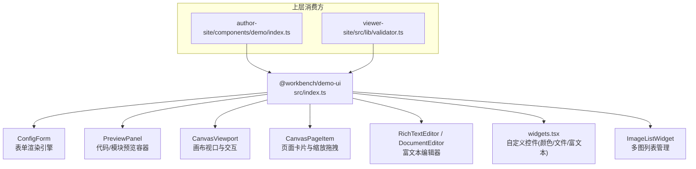
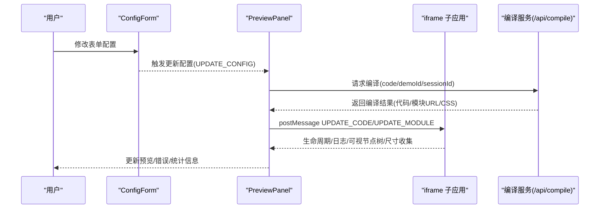
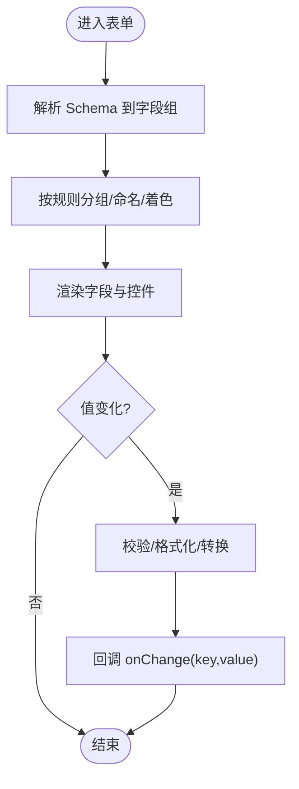
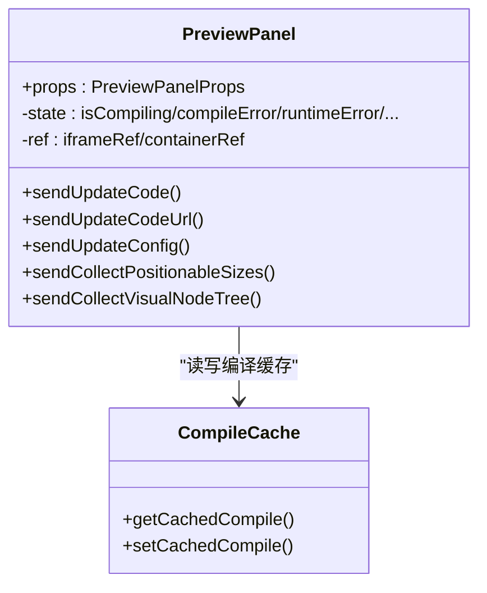
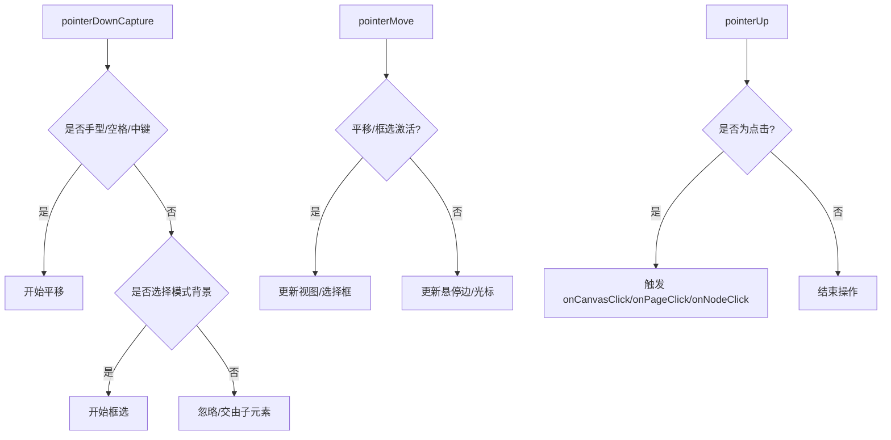
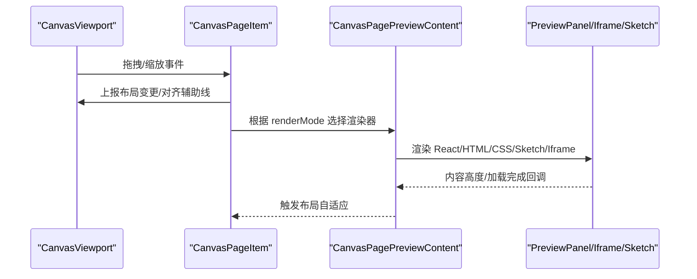
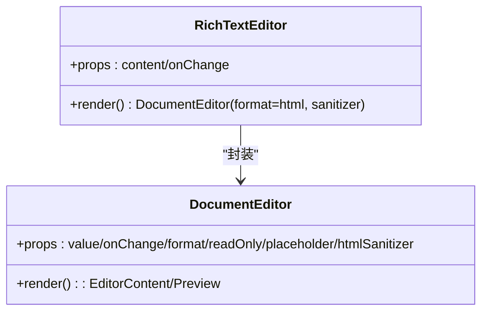
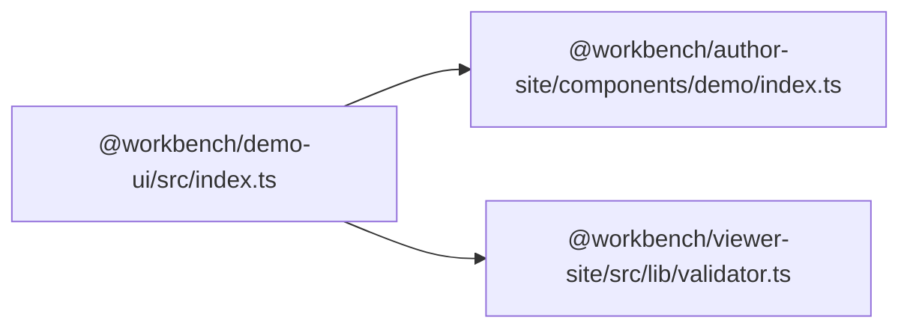

# 演示组件库

<cite>
**本文引用的文件**
- [packages/demo-ui/src/index.ts](file://packages/demo-ui/src/index.ts)
- [packages/demo-ui/package.json](file://packages/demo-ui/package.json)
- [packages/demo-ui/src/ConfigForm.tsx](file://packages/demo-ui/src/ConfigForm.tsx)
- [packages/demo-ui/src/widgets.tsx](file://packages/demo-ui/src/widgets.tsx)
- [packages/demo-ui/src/ImageListWidget.tsx](file://packages/demo-ui/src/ImageListWidget.tsx)
- [packages/demo-ui/src/RichTextEditor.tsx](file://packages/demo-ui/src/RichTextEditor.tsx)
- [packages/demo-ui/src/PreviewPanel.tsx](file://packages/demo-ui/src/PreviewPanel.tsx)
- [packages/demo-ui/src/CanvasViewport.tsx](file://packages/demo-ui/src/CanvasViewport.tsx)
- [packages/demo-ui/src/CanvasPageItem.tsx](file://packages/demo-ui/src/CanvasPageItem.tsx)
- [packages/demo-ui/src/DocumentEditor.tsx](file://packages/demo-ui/src/DocumentEditor.tsx)
- [packages/author-site/components/demo/index.ts](file://packages/author-site/components/demo/index.ts)
- [packages/viewer-site/src/lib/validator.ts](file://packages/viewer-site/src/lib/validator.ts)
</cite>

## 目录
1. [简介](#简介)
2. [项目结构](#项目结构)
3. [核心组件](#核心组件)
4. [架构总览](#架构总览)
5. [详细组件分析](#详细组件分析)
6. [依赖关系分析](#依赖关系分析)
7. [性能与可维护性](#性能与可维护性)
8. [故障排查指南](#故障排查指南)
9. [结论](#结论)
10. [附录：配置与使用示例](#附录配置与使用示例)

## 简介
本仓库中的 @workbench/demo-ui 是 Workbench 的“演示组件库”，面向项目演示、展示与快速原型验证，提供数据表格、图表可视化、表单演示、媒体展示等能力。该库通过声明式 Schema 驱动表单渲染、基于 iframe 的沙箱预览、画布级页面编排与交互，以及富文本编辑与图片上传等通用能力，帮助团队在演示环境中高效组合与定制 UI。

## 项目结构
@workbench/demo-ui 以 React 组件为核心，结合 TypeScript 类型定义与工具函数，形成“配置驱动 + 运行时预览”的演示体系。顶层 index.ts 统一导出所有对外 API，便于上层应用（如 author-site、viewer-site）按需引入。

图示来源
- [packages/demo-ui/src/index.ts:1-43](file://packages/demo-ui/src/index.ts#L1-L43)
- [packages/author-site/components/demo/index.ts:1-2](file://packages/author-site/components/demo/index.ts#L1-L2)
- [packages/viewer-site/src/lib/validator.ts:1-9](file://packages/viewer-site/src/lib/validator.ts#L1-L9)

章节来源
- [packages/demo-ui/src/index.ts:1-43](file://packages/demo-ui/src/index.ts#L1-L43)
- [packages/demo-ui/package.json:1-51](file://packages/demo-ui/package.json#L1-L51)

## 核心组件
- ConfigForm：根据 JSON Schema 动态生成表单，支持分组、可见性条件、排序、拖拽、数值滑块、枚举选择、图片/富文本等复杂字段。
- PreviewPanel：负责将用户代码或编译产物在沙箱 iframe 中运行，处理编译缓存、尺寸适配、消息通信、视觉编辑状态同步等。
- CanvasViewport：提供平移、缩放、框选、快捷键、对齐辅助线等画布交互能力。
- CanvasPageItem：承载单个页面的预览内容，支持拖拽、缩放、截图占位、多运行时渲染（React/HTML/CSS/Sketch）。
- RichTextEditor / DocumentEditor：基于 TipTap 的富文本编辑器，支持 Markdown/HTML 双格式、工具栏、预览模式与 HTML 清洗。
- widgets.tsx：自定义 RJSF 风格控件（颜色选择器、文件上传、富文本），封装上传校验与错误提示。
- ImageListWidget：多图上传、预览、删除、尺寸校验与批量操作。

章节来源
- [packages/demo-ui/src/ConfigForm.tsx:183-231](file://packages/demo-ui/src/ConfigForm.tsx#L183-L231)
- [packages/demo-ui/src/PreviewPanel.tsx:230-340](file://packages/demo-ui/src/PreviewPanel.tsx#L230-L340)
- [packages/demo-ui/src/CanvasViewport.tsx:54-120](file://packages/demo-ui/src/CanvasViewport.tsx#L54-L120)
- [packages/demo-ui/src/CanvasPageItem.tsx:216-330](file://packages/demo-ui/src/CanvasPageItem.tsx#L216-L330)
- [packages/demo-ui/src/RichTextEditor.tsx:1-66](file://packages/demo-ui/src/RichTextEditor.tsx#L1-L66)
- [packages/demo-ui/src/DocumentEditor.tsx:250-360](file://packages/demo-ui/src/DocumentEditor.tsx#L250-L360)
- [packages/demo-ui/src/widgets.tsx:70-97](file://packages/demo-ui/src/widgets.tsx#L70-L97)
- [packages/demo-ui/src/ImageListWidget.tsx:91-120](file://packages/demo-ui/src/ImageListWidget.tsx#L91-L120)

## 架构总览
演示组件库围绕“配置驱动 + 沙箱预览 + 画布编排”三大主线组织：
- 配置驱动：Schema 描述字段、分组、校验、默认值、可见性条件等，由 ConfigForm 解析并渲染为表单。
- 沙箱预览：PreviewPanel 负责编译/加载代码，注入配置与路由参数，通过 postMessage 与 iframe 双向通信，支持视觉编辑与静态快照采集。
- 画布编排：CanvasViewport 提供全局交互，CanvasPageItem 承载具体页面预览，支持多种运行时渲染路径与截图回退。

图示来源
- [packages/demo-ui/src/PreviewPanel.tsx:415-510](file://packages/demo-ui/src/PreviewPanel.tsx#L415-L510)
- [packages/demo-ui/src/PreviewPanel.tsx:712-800](file://packages/demo-ui/src/PreviewPanel.tsx#L712-L800)

## 详细组件分析

### ConfigForm 表单引擎
- 功能要点
  - 从 JSON Schema 解析字段、分组、必填、默认值、枚举、范围、长度、格式化、UI 选项、分类、可见性条件等。
  - 自动检测字段分组（颜色、尺寸、文本、图片、显示选项、动画、布局等）。
  - 支持字段排序（垂直/水平）、拖拽移动、按类别过滤与排序。
  - 内置复杂字段：文件/图片上传、图片列表、富文本、颜色选择、数字滑块、布尔开关、长文本等。
  - 支持 visibleWhen 条件显示，结合表单数据实时计算。
- 数据绑定
  - 表单值与父组件 state 双向绑定，变更时回调 onChange(key, value)。
  - 复杂字段（数组/对象）支持 JSON 输入与校验。
- 交互行为
  - 折叠面板分组、拖拽排序、键盘导航、只读模式、备注查看与编辑。
- 复杂度与优化
  - 解析与渲染采用 O(n) 遍历；排序与可见性计算局部化，避免全量重渲染。
  - 对大文本/JSON 使用受控输入与最小化更新策略。

图示来源
- [packages/demo-ui/src/ConfigForm.tsx:183-231](file://packages/demo-ui/src/ConfigForm.tsx#L183-L231)
- [packages/demo-ui/src/ConfigForm.tsx:126-147](file://packages/demo-ui/src/ConfigForm.tsx#L126-L147)

章节来源
- [packages/demo-ui/src/ConfigForm.tsx:183-231](file://packages/demo-ui/src/ConfigForm.tsx#L183-L231)
- [packages/demo-ui/src/ConfigForm.tsx:126-147](file://packages/demo-ui/src/ConfigForm.tsx#L126-L147)

### PreviewPanel 预览容器
- 功能要点
  - 支持直接传入已编译 JS URL 或源码，调用 /api/compile 获取编译结果。
  - 维护编译缓存（按 sessionId+demoId+code），命中则跳过网络请求。
  - 通过 postMessage 向 iframe 发送 UPDATE_CODE/UPDATE_MODULE/UPDATE_CONFIG 等指令。
  - 收集控制台日志、可视节点树、位置尺寸、静态快照等。
  - 计算设计宽高比与缩放，适配不同容器尺寸。
- 数据流
  - 父组件 props → 本地 ref/state → 构建消息体 → postMessage → iframe 执行。
  - iframe 回传日志、事件、节点树、尺寸测量结果。
- 错误处理
  - 编译失败时构造诊断信息，向上抛出带 previewDiagnostic 的错误对象。
  - 非 JSON 响应、跨域样式读取异常均有兜底处理。
- 性能
  - 请求去重与 requestId 机制，避免竞态导致的状态错乱。
  - 懒加载与休眠模式（sleeping）减少资源占用。

图示来源
- [packages/demo-ui/src/PreviewPanel.tsx:230-340](file://packages/demo-ui/src/PreviewPanel.tsx#L230-L340)
- [packages/demo-ui/src/PreviewPanel.tsx:712-800](file://packages/demo-ui/src/PreviewPanel.tsx#L712-L800)

章节来源
- [packages/demo-ui/src/PreviewPanel.tsx:230-340](file://packages/demo-ui/src/PreviewPanel.tsx#L230-L340)
- [packages/demo-ui/src/PreviewPanel.tsx:712-800](file://packages/demo-ui/src/PreviewPanel.tsx#L712-L800)

### CanvasViewport 画布视口
- 功能要点
  - 支持平移（手型/空格+左键/中键）、缩放（滚轮/快捷键）、框选、点击空白取消选中。
  - 键盘快捷键：H/V 切换工具，Ctrl/Cmd+0 适应屏幕，+/- 缩放，Esc 取消选中。
  - 提供对齐辅助线、选择框、创建模式（文本/图像）等扩展点。
- 交互细节
  - capture/bubble 阶段分流，确保手型模式下优先平移。
  - 指针捕获与释放，保证拖拽/缩放过程稳定。
  - 坐标换算：屏幕坐标 ↔ 画布坐标（考虑 zoom/offset）。
- 性能
  - requestAnimationFrame 合并视图更新，will-change 优化 transform。

图示来源
- [packages/demo-ui/src/CanvasViewport.tsx:284-365](file://packages/demo-ui/src/CanvasViewport.tsx#L284-L365)
- [packages/demo-ui/src/CanvasViewport.tsx:367-456](file://packages/demo-ui/src/CanvasViewport.tsx#L367-L456)

章节来源
- [packages/demo-ui/src/CanvasViewport.tsx:54-120](file://packages/demo-ui/src/CanvasViewport.tsx#L54-L120)
- [packages/demo-ui/src/CanvasViewport.tsx:284-365](file://packages/demo-ui/src/CanvasViewport.tsx#L284-L365)
- [packages/demo-ui/src/CanvasViewport.tsx:367-456](file://packages/demo-ui/src/CanvasViewport.tsx#L367-L456)

### CanvasPageItem 页面卡片
- 功能要点
  - 承载单页预览内容，支持多运行时渲染：React 代码、HTML/CSS 原型、Sketch 场景、Iframe 预渲染、截图占位。
  - 支持拖拽移动、八方向缩放（保持纵横比）、右键菜单、标签显示。
  - 根据内容高度自适应布局，支持截图渲染盒回退。
- 渲染优先级
  - 若存在截图且处于截图/休眠模式，优先显示截图；否则渲染对应运行时内容。
- 交互
  - 拖拽/缩放过程中与 CanvasViewport 协同，传递对齐辅助线与布局变更。

图示来源
- [packages/demo-ui/src/CanvasPageItem.tsx:216-330](file://packages/demo-ui/src/CanvasPageItem.tsx#L216-L330)
- [packages/demo-ui/src/CanvasPageItem.tsx:443-520](file://packages/demo-ui/src/CanvasPageItem.tsx#L443-L520)

章节来源
- [packages/demo-ui/src/CanvasPageItem.tsx:216-330](file://packages/demo-ui/src/CanvasPageItem.tsx#L216-L330)
- [packages/demo-ui/src/CanvasPageItem.tsx:443-520](file://packages/demo-ui/src/CanvasPageItem.tsx#L443-L520)

### RichTextEditor / DocumentEditor 富文本编辑器
- 功能要点
  - 基于 TipTap 的文档编辑器，支持 Markdown/HTML 双格式互转。
  - 工具栏：加粗/斜体/下划线、标题、列表、任务列表、代码块、引用、链接、分隔线、清除格式。
  - 预览模式：Markdown 渲染或 HTML 渲染（可选 sanitizer）。
  - 粘贴智能识别 Markdown 并转换为内部模型。
- 安全
  - HTML 输出可通过 sanitizer 白名单过滤，防止 XSS。
- 复杂度
  - 自定义 Markdown 序列化（表格、任务项等），O(n) 遍历 DOM 树。

图示来源
- [packages/demo-ui/src/DocumentEditor.tsx:250-360](file://packages/demo-ui/src/DocumentEditor.tsx#L250-L360)
- [packages/demo-ui/src/RichTextEditor.tsx:1-66](file://packages/demo-ui/src/RichTextEditor.tsx#L1-L66)

章节来源
- [packages/demo-ui/src/DocumentEditor.tsx:250-360](file://packages/demo-ui/src/DocumentEditor.tsx#L250-L360)
- [packages/demo-ui/src/RichTextEditor.tsx:1-66](file://packages/demo-ui/src/RichTextEditor.tsx#L1-L66)

### widgets.tsx 自定义控件
- 功能要点
  - ColorPickerWidget：颜色选择器（十六进制输入与色板）。
  - FileUploadWidget：文件上传（支持服务端上传与本地 base64 回退），大小限制、尺寸校验、错误提示、覆盖/清空。
  - RichTextWidget：简易富文本输入（textarea）。
- 数据绑定
  - 遵循 WidgetProps 接口，value/onChange 受控模式。
- 交互
  - 拖放上传、预览图、替换/删除、尺寸不符弹窗确认继续上传。

章节来源
- [packages/demo-ui/src/widgets.tsx:70-97](file://packages/demo-ui/src/widgets.tsx#L70-L97)
- [packages/demo-ui/src/widgets.tsx:121-218](file://packages/demo-ui/src/widgets.tsx#L121-L218)

### ImageListWidget 图片列表
- 功能要点
  - 多图上传、预览、删除、数量上限控制、尺寸校验、错误提示。
  - 支持服务端上传（/api/sessions/{sessionId}/assets/upload）与删除。
- 数据绑定
  - value: ImageItem[]，onChange(newItems)，支持字符串数组与对象数组两种存储形式。
- 交互
  - 拖放上传、批量选择、放大预览、进度指示。

章节来源
- [packages/demo-ui/src/ImageListWidget.tsx:91-120](file://packages/demo-ui/src/ImageListWidget.tsx#L91-L120)
- [packages/demo-ui/src/ImageListWidget.tsx:134-193](file://packages/demo-ui/src/ImageListWidget.tsx#L134-L193)

## 依赖关系分析
- 包内导出
  - index.ts 集中导出类型、工具函数与组件，供上层应用统一引入。
- 上层消费
  - author-site/components/demo/index.ts 重新导出 demo-ui 的组件与类型，作为作者站点的演示入口。
  - viewer-site/src/lib/validator.ts 仅导入 demo-ui 的校验工具与类型，用于预览尺寸与校验逻辑复用。

图示来源
- [packages/demo-ui/src/index.ts:1-43](file://packages/demo-ui/src/index.ts#L1-L43)
- [packages/author-site/components/demo/index.ts:1-2](file://packages/author-site/components/demo/index.ts#L1-L2)
- [packages/viewer-site/src/lib/validator.ts:1-9](file://packages/viewer-site/src/lib/validator.ts#L1-L9)

章节来源
- [packages/demo-ui/src/index.ts:1-43](file://packages/demo-ui/src/index.ts#L1-L43)
- [packages/author-site/components/demo/index.ts:1-2](file://packages/author-site/components/demo/index.ts#L1-L2)
- [packages/viewer-site/src/lib/validator.ts:1-9](file://packages/viewer-site/src/lib/validator.ts#L1-L9)

## 性能与可维护性
- 编译缓存：按 sessionId+demoId+code 维度缓存编译结果，显著降低重复编译开销。
- 请求去重：previewRequestId 机制避免并发更新导致的时序问题。
- 渲染优化：CanvasViewport 使用 requestAnimationFrame 合并更新，will-change 提升 transform 性能。
- 资源控制：休眠模式（sleeping）与截图占位，减少不必要的 iframe 实例与渲染。
- 可维护性：index.ts 统一导出，类型集中管理；组件职责清晰，便于拆分与测试。

[本节不直接分析具体文件]

## 故障排查指南
- 编译失败
  - 现象：预览面板显示编译错误，onError 回调收到包含 previewDiagnostic 的错误对象。
  - 排查：检查 code 合法性、demoId/sessionId 是否正确、/api/compile 返回是否为 JSON。
  - 参考实现：编译响应读取与错误诊断构造。
- 非 JSON 响应
  - 现象：编译服务返回非 JSON 文本。
  - 处理：包装错误信息并抛出，便于上层捕获与展示。
- 跨域样式读取
  - 现象：无法读取外部样式表。
  - 处理：静态快照提取时忽略跨域样式，由后续校验决定是否可用。
- 图片上传失败
  - 现象：FileUploadWidget/ImageListWidget 报错或无响应。
  - 排查：检查 sessionId 是否存在、文件大小与尺寸限制、服务端接口可用性。
- 富文本 XSS 风险
  - 建议：始终启用 htmlSanitizer，限制允许的标签与属性。

章节来源
- [packages/demo-ui/src/PreviewPanel.tsx:97-109](file://packages/demo-ui/src/PreviewPanel.tsx#L97-L109)
- [packages/demo-ui/src/PreviewPanel.tsx:129-168](file://packages/demo-ui/src/PreviewPanel.tsx#L129-L168)
- [packages/demo-ui/src/widgets.tsx:156-218](file://packages/demo-ui/src/widgets.tsx#L156-L218)
- [packages/demo-ui/src/ImageListWidget.tsx:134-193](file://packages/demo-ui/src/ImageListWidget.tsx#L134-L193)
- [packages/demo-ui/src/RichTextEditor.tsx:44-52](file://packages/demo-ui/src/RichTextEditor.tsx#L44-L52)

## 结论
@workbench/demo-ui 提供了完整的演示与原型开发基础设施：Schema 驱动的表单、沙箱化的代码预览、画布级的页面编排与丰富的媒体与文本编辑能力。其模块化设计与清晰的导出边界，使得上层应用可以快速集成与扩展。建议在真实业务迁移时，逐步替换演示组件为生产级组件，保留配置与数据流契约，确保平滑过渡。

[本节不直接分析具体文件]

## 附录：配置与使用示例
- 表单配置（Schema）
  - 关键字段：properties、required、default、enum、minimum/maximum、maxLength、format、ui:options（group/category/visibleWhen/ui:widget/uiOptions）、$demo.note。
  - 分组与可见性：通过 ui:options.group 显式分组或通过 key 前缀/后缀自动分组；visibleWhen 支持 field+equals 条件。
  - 参考路径：[packages/demo-ui/src/ConfigForm.tsx:183-231](file://packages/demo-ui/src/ConfigForm.tsx#L183-L231)
- 预览使用
  - 传入 code 或 compiledJsUrl，设置 sessionId/demoId 以启用缓存与资源解析。
  - 监听 onConsoleEntry/onError/onContentLoaded 等回调进行调试与状态同步。
  - 参考路径：[packages/demo-ui/src/PreviewPanel.tsx:230-340](file://packages/demo-ui/src/PreviewPanel.tsx#L230-L340)
- 画布使用
  - 在 CanvasViewport 中放置多个 CanvasPageItem，统一管理 toolMode、alignmentGuides、selection 等。
  - 参考路径：[packages/demo-ui/src/CanvasViewport.tsx:54-120](file://packages/demo-ui/src/CanvasViewport.tsx#L54-L120)
- 富文本使用
  - RichTextEditor 适用于 HTML 输出场景，DocumentEditor 支持 Markdown/HTML 双格式。
  - 参考路径：[packages/demo-ui/src/RichTextEditor.tsx:1-66](file://packages/demo-ui/src/RichTextEditor.tsx#L1-L66)
- 图片上传
  - 使用 FileUploadWidget 或 ImageListWidget，配置 maxSize/minWidth/maxHeight 等选项。
  - 参考路径：[packages/demo-ui/src/widgets.tsx:121-218](file://packages/demo-ui/src/widgets.tsx#L121-L218)、[packages/demo-ui/src/ImageListWidget.tsx:91-120](file://packages/demo-ui/src/ImageListWidget.tsx#L91-L120)

章节来源
- [packages/demo-ui/src/ConfigForm.tsx:183-231](file://packages/demo-ui/src/ConfigForm.tsx#L183-L231)
- [packages/demo-ui/src/PreviewPanel.tsx:230-340](file://packages/demo-ui/src/PreviewPanel.tsx#L230-L340)
- [packages/demo-ui/src/CanvasViewport.tsx:54-120](file://packages/demo-ui/src/CanvasViewport.tsx#L54-L120)
- [packages/demo-ui/src/RichTextEditor.tsx:1-66](file://packages/demo-ui/src/RichTextEditor.tsx#L1-L66)
- [packages/demo-ui/src/widgets.tsx:121-218](file://packages/demo-ui/src/widgets.tsx#L121-L218)
- [packages/demo-ui/src/ImageListWidget.tsx:91-120](file://packages/demo-ui/src/ImageListWidget.tsx#L91-L120)