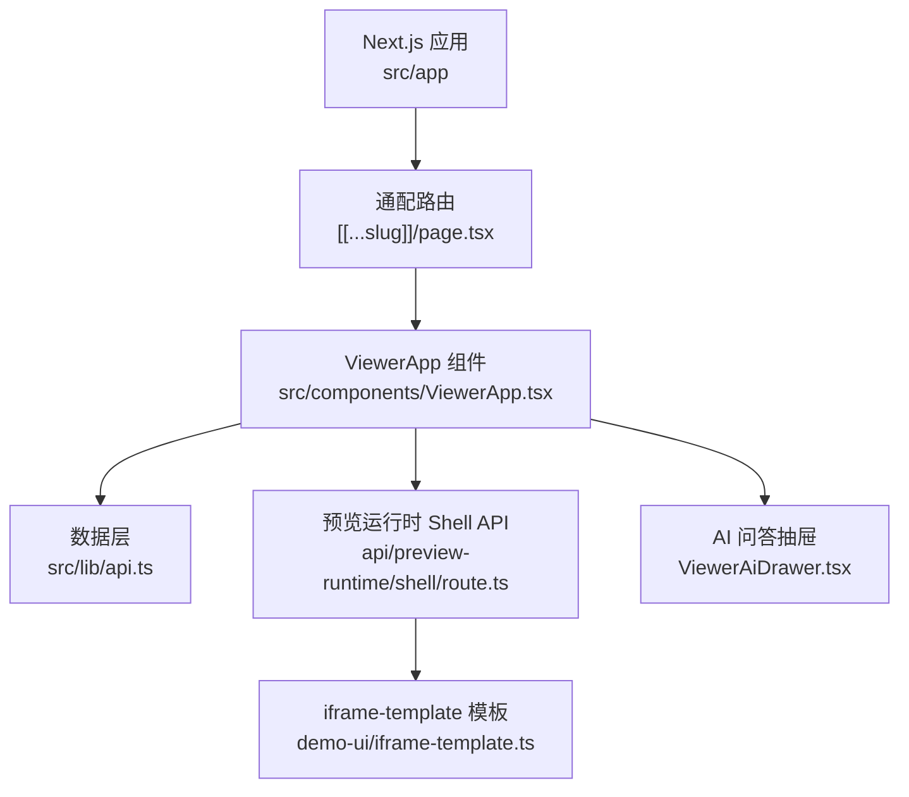
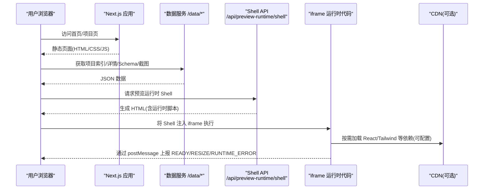
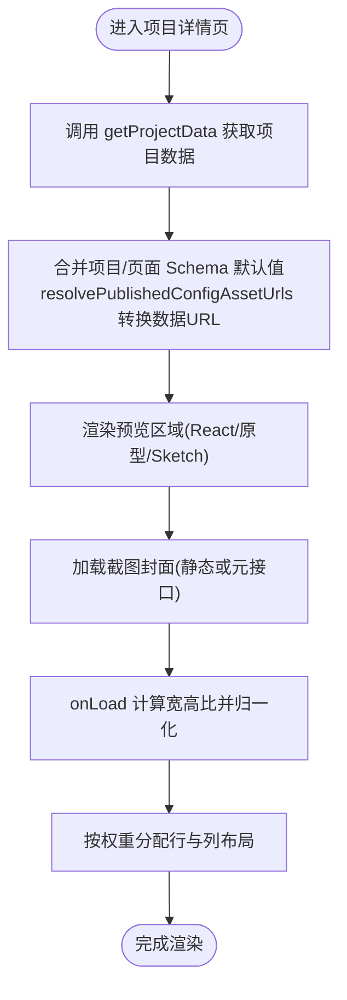
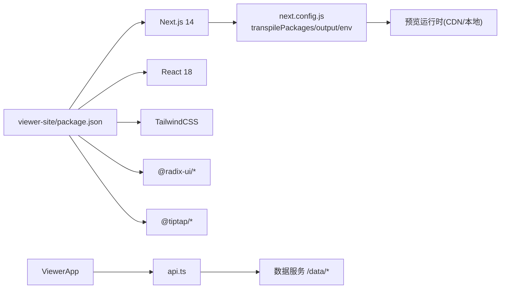
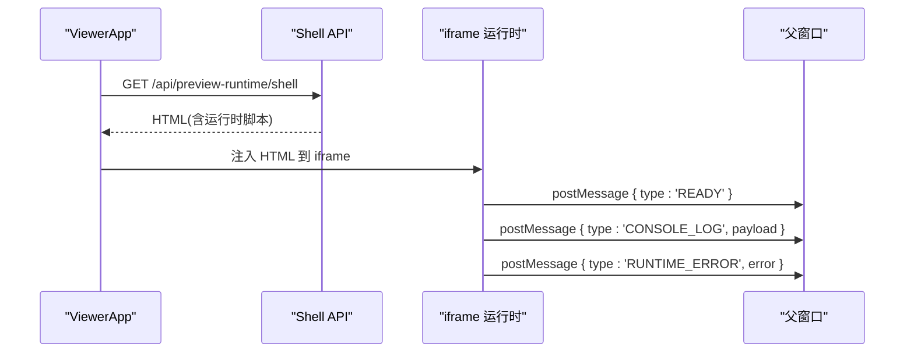
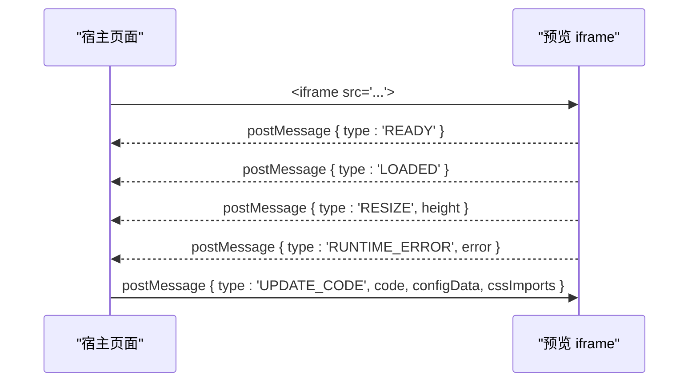

# 使用端应用 (Viewer Site)

<cite>
**本文引用的文件**   
- [packages/viewer-site/package.json](file://packages/viewer-site/package.json)
- [packages/viewer-site/next.config.js](file://packages/viewer-site/next.config.js)
- [packages/viewer-site/src/app/layout.tsx](file://packages/viewer-site/src/app/layout.tsx)
- [packages/viewer-site/src/app/[[...slug]]/page.tsx](file://packages/viewer-site/src/app/[[...slug]]/page.tsx)
- [packages/viewer-site/src/components/ViewerApp.tsx](file://packages/viewer-site/src/components/ViewerApp.tsx)
- [packages/viewer-site/src/lib/api.ts](file://packages/viewer-site/src/lib/api.ts)
- [packages/viewer-site/src/app/api/preview-runtime/shell/route.ts](file://packages/viewer-site/src/app/api/preview-runtime/shell/route.ts)
- [packages/demo-ui/src/iframe-template.ts](file://packages/demo-ui/src/iframe-template.ts)
- [packages/shared/src/demo/iframe-template.ts](file://packages/shared/src/demo/iframe-template.ts)
- [packages/demo-ui/src/PreviewPanel.tsx](file://packages/demo-ui/src/PreviewPanel.tsx)
- [docs/项目文档/创作端/07-嵌入API/嵌入API_需求文档.md](file://docs/项目文档/创作端/07-嵌入API/嵌入API_需求文档.md)
</cite>

## 目录
1. [简介](#简介)
2. [项目结构](#项目结构)
3. [核心组件](#核心组件)
4. [架构总览](#架构总览)
5. [详细组件分析](#详细组件分析)
6. [依赖关系分析](#依赖关系分析)
7. [性能与缓存](#性能与缓存)
8. [安全策略](#安全策略)
9. [预览运行时加载机制](#预览运行时加载机制)
10. [响应式设计与主题定制](#响应式设计与主题定制)
11. [嵌入集成方案与 postMessage 协议](#嵌入集成方案与-postmessage-协议)
12. [嵌入代码生成与使用示例](#嵌入代码生成与使用示例)
13. [故障排查指南](#故障排查指南)
14. [结论](#结论)

## 简介
本技术文档面向 Workbench 使用端应用（Viewer Site），基于 Next.js 静态站点生成（SSG）构建，负责展示已发布的项目、页面预览、配置面板与 AI 问答侧边栏。其核心能力包括：
- 静态站点生成与路由映射
- 项目列表与详情页的数据获取与渲染
- 预览运行时 Shell 的按需生成与加载
- 通过 iframe 承载运行时代码，实现安全的组件预览
- 响应式布局与主题变量体系
- 安全策略与性能优化（缓存、资源压缩、CDN 等）
- 嵌入集成方案与 postMessage 通信协议

## 项目结构
Viewer Site 采用 Next.js App Router 组织代码，关键目录与职责如下：
- src/app: 页面与 API 路由
  - [[...slug]]/page.tsx: 通配路由入口，挂载 ViewerApp
  - api/preview-runtime/shell/route.ts: 动态生成预览运行时 Shell HTML
- src/components: 业务组件
  - ViewerApp.tsx: 主应用容器，包含项目列表、项目详情、预览画布、AI 抽屉等
  - ViewerAiDrawer.tsx: AI 问答侧边栏
- src/lib: 工具与数据访问
  - api.ts: 统一的数据请求封装与类型定义
- public/preview-runtime: 本地预览运行时产物（可选）
- next.config.js: Next.js 构建与运行时环境变量配置

图表来源
- [packages/viewer-site/src/app/[[...slug]]/page.tsx](file://packages/viewer-site/src/app/[[...slug]]/page.tsx#L1-L10)
- [packages/viewer-site/src/components/ViewerApp.tsx:1-120](file://packages/viewer-site/src/components/ViewerApp.tsx#L1-L120)
- [packages/viewer-site/src/lib/api.ts:1-120](file://packages/viewer-site/src/lib/api.ts#L1-L120)
- [packages/viewer-site/src/app/api/preview-runtime/shell/route.ts:1-28](file://packages/viewer-site/src/app/api/preview-runtime/shell/route.ts#L1-L28)
- [packages/demo-ui/src/iframe-template.ts:1300-1630](file://packages/demo-ui/src/iframe-template.ts#L1300-L1630)

章节来源
- [packages/viewer-site/package.json:1-62](file://packages/viewer-site/package.json#L1-L62)
- [packages/viewer-site/next.config.js:1-26](file://packages/viewer-site/next.config.js#L1-L26)
- [packages/viewer-site/src/app/layout.tsx:1-20](file://packages/viewer-site/src/app/layout.tsx#L1-L20)
- [packages/viewer-site/src/app/[[...slug]]/page.tsx](file://packages/viewer-site/src/app/[[...slug]]/page.tsx#L1-L10)

## 核心组件
- 根布局与元信息
  - layout.tsx 提供全局语言、基础样式与站点标题描述
- 通配路由页
  - page.tsx 通过 generateStaticParams 返回空 slug，作为首页入口并渲染 ViewerApp
- ViewerApp 主应用
  - 管理项目列表、项目详情、预览模式切换、配置合并、截图封面计算、AI 对话状态等
  - 通过 api.ts 拉取项目索引、项目详情、Schema、截图元信息等
- AI 问答抽屉
  - 维护会话历史、模型选择、图片附件、错误重试等

章节来源
- [packages/viewer-site/src/app/layout.tsx:1-20](file://packages/viewer-site/src/app/layout.tsx#L1-L20)
- [packages/viewer-site/src/app/[[...slug]]/page.tsx](file://packages/viewer-site/src/app/[[...slug]]/page.tsx#L1-L10)
- [packages/viewer-site/src/components/ViewerApp.tsx:1-200](file://packages/viewer-site/src/components/ViewerApp.tsx#L1-L200)
- [packages/viewer-site/src/components/ViewerAiDrawer.tsx:1-120](file://packages/viewer-site/src/components/ViewerAiDrawer.tsx#L1-L120)

## 架构总览
Viewer Site 整体为静态站点，生产构建输出静态文件；开发环境以 Next dev 启动。数据通过客户端在浏览器中向数据服务发起请求，预览运行时 Shell 由 Next API 动态生成，最终在 iframe 中执行用户组件。

图表来源
- [packages/viewer-site/src/lib/api.ts:68-151](file://packages/viewer-site/src/lib/api.ts#L68-L151)
- [packages/viewer-site/src/app/api/preview-runtime/shell/route.ts:1-28](file://packages/viewer-site/src/app/api/preview-runtime/shell/route.ts#L1-L28)
- [packages/demo-ui/src/iframe-template.ts:1300-1630](file://packages/demo-ui/src/iframe-template.ts#L1300-L1630)

## 详细组件分析

### ViewerApp 主应用
- 功能要点
  - 解析路径决定“列表视图”或“项目视图”
  - 合并项目级与页面级 Schema 默认值，并将相对数据路径转换为绝对 URL
  - 根据项目截图与尺寸自适应封面布局
  - 管理预览尺寸、模式、画布状态、配置面板展开项等
- 数据流
  - 列表页：getProjects -> 过滤/排序 -> 渲染卡片
  - 详情页：getProjectData -> 初始化配置与 Schema -> 渲染预览与配置面板
- 截图封面
  - 优先使用静态截图路径，否则通过截图元接口获取真实地址
  - 监听图片 onLoad 计算宽高比，用于自适应网格布局

图表来源
- [packages/viewer-site/src/components/ViewerApp.tsx:729-800](file://packages/viewer-site/src/components/ViewerApp.tsx#L729-L800)
- [packages/viewer-site/src/components/ViewerApp.tsx:84-122](file://packages/viewer-site/src/components/ViewerApp.tsx#L84-L122)
- [packages/viewer-site/src/components/ViewerApp.tsx:174-280](file://packages/viewer-site/src/components/ViewerApp.tsx#L174-L280)

章节来源
- [packages/viewer-site/src/components/ViewerApp.tsx:1-200](file://packages/viewer-site/src/components/ViewerApp.tsx#L1-L200)
- [packages/viewer-site/src/components/ViewerApp.tsx:478-661](file://packages/viewer-site/src/components/ViewerApp.tsx#L478-L661)
- [packages/viewer-site/src/components/ViewerApp.tsx:663-727](file://packages/viewer-site/src/components/ViewerApp.tsx#L663-L727)
- [packages/viewer-site/src/components/ViewerApp.tsx:729-800](file://packages/viewer-site/src/components/ViewerApp.tsx#L729-L800)

### 数据访问层 api.ts
- 统一 fetchJson 封装，校验 Content-Type 并抛出友好错误
- 提供 getProjects、getProjectData、getDemoSchema 等数据方法
- 提供 getDataUrl、getThumbnailUrl、getScreenshotFileMetaUrl、getScreenshotFileUrl、getCompiledJsUrl、getPublishedFileUrl 等 URL 构造器
- 提供 askViewerAi、getViewerAiModels 等 AI 相关接口

章节来源
- [packages/viewer-site/src/lib/api.ts:1-120](file://packages/viewer-site/src/lib/api.ts#L1-L120)
- [packages/viewer-site/src/lib/api.ts:120-242](file://packages/viewer-site/src/lib/api.ts#L120-L242)

### 预览运行时 Shell API
- GET /api/preview-runtime/shell
- 根据环境变量决定是否从 CDN 加载运行时
- 调用 demo-ui 的 generateIframeHtml 生成完整 Shell HTML
- 设置安全响应头与 no-store 缓存策略

章节来源
- [packages/viewer-site/src/app/api/preview-runtime/shell/route.ts:1-28](file://packages/viewer-site/src/app/api/preview-runtime/shell/route.ts#L1-L28)
- [packages/demo-ui/src/iframe-template.ts:1300-1630](file://packages/demo-ui/src/iframe-template.ts#L1300-L1630)

### AI 问答抽屉 ViewerAiDrawer
- 维护多会话、消息历史、模型选择、图片附件
- 支持本地持久化（localStorage）与迁移兼容
- 发送消息时携带当前项目、页面与配置上下文

章节来源
- [packages/viewer-site/src/components/ViewerAiDrawer.tsx:1-120](file://packages/viewer-site/src/components/ViewerAiDrawer.tsx#L1-L120)
- [packages/viewer-site/src/components/ViewerAiDrawer.tsx:117-230](file://packages/viewer-site/src/components/ViewerAiDrawer.tsx#L117-L230)
- [packages/viewer-site/src/components/ViewerAiDrawer.tsx:360-415](file://packages/viewer-site/src/components/ViewerAiDrawer.tsx#L360-L415)

## 依赖关系分析
- 构建与运行
  - Next.js 14 + React 18 + TailwindCSS + Radix UI + TipTap 等
  - 通过 transpilePackages 编译 monorepo 内部包
  - 生产构建启用 output: export 生成静态站点
- 运行时依赖
  - 预览运行时可从本地或 CDN 加载（esm.sh 等）
  - 截图与数据通过 NEXT_PUBLIC_DATA_BASE 指向的数据服务获取

图表来源
- [packages/viewer-site/package.json:1-62](file://packages/viewer-site/package.json#L1-L62)
- [packages/viewer-site/next.config.js:1-26](file://packages/viewer-site/next.config.js#L1-L26)

章节来源
- [packages/viewer-site/package.json:1-62](file://packages/viewer-site/package.json#L1-L62)
- [packages/viewer-site/next.config.js:1-26](file://packages/viewer-site/next.config.js#L1-L26)

## 性能与缓存
- 静态站点导出
  - 生产环境 output: export，便于部署到任意静态托管平台
- 资源与缓存
  - 数据请求统一 cache: "no-store"，避免陈旧数据
  - Shell API 返回 Cache-Control: no-store，确保运行时更新即时生效
  - 截图封面懒加载与尺寸自适应，减少首屏压力
- 预览运行时
  - 支持从 CDN 加载 React/Tailwind 等公共依赖，提升缓存命中率
  - 运行时错误与性能指标通过 postMessage 上报，便于监控

章节来源
- [packages/viewer-site/next.config.js:1-26](file://packages/viewer-site/next.config.js#L1-L26)
- [packages/viewer-site/src/app/api/preview-runtime/shell/route.ts:19-27](file://packages/viewer-site/src/app/api/preview-runtime/shell/route.ts#L19-L27)
- [packages/viewer-site/src/components/ViewerApp.tsx:174-280](file://packages/viewer-site/src/components/ViewerApp.tsx#L174-L280)
- [packages/demo-ui/src/iframe-template.ts:1300-1630](file://packages/demo-ui/src/iframe-template.ts#L1300-L1630)

## 安全策略
- 预览运行时 Shell
  - 设置 X-Content-Type-Options: nosniff，防止 MIME 嗅探
  - 运行时错误上报至父窗口，便于集中处理
- 静态原型内容清洗
  - 移除危险标签与 on* 事件处理器，过滤 javascript: 协议链接
- 跨域与来源校验
  - 旧版 iframe 通信要求 event.source !== window.parent 校验（新架构下 viewer 内部处理）

章节来源
- [packages/viewer-site/src/app/api/preview-runtime/shell/route.ts:19-27](file://packages/viewer-site/src/app/api/preview-runtime/shell/route.ts#L19-L27)
- [packages/demo-ui/src/PreviewPanel.tsx:129-168](file://packages/demo-ui/src/PreviewPanel.tsx#L129-L168)
- [docs/项目文档/创作端/07-嵌入API/嵌入API_需求文档.md:110-120](file://docs/项目文档/创作端/07-嵌入API/嵌入API_需求文档.md#L110-L120)

## 预览运行时加载机制
- Shell 生成
  - 通过 Next API 动态生成 iframe Shell HTML，支持 URL 模式与 CDN 模式
- 运行时依赖
  - 默认使用 esm.sh 作为 CDN 基址，可通过环境变量切换
- 生命周期
  - 记录 shell_start 时间戳，上报 CONSOLE_LOG 与 RUNTIME_ERROR 等事件
  - 渲染完成后触发视觉编辑属性同步（如启用）

图表来源
- [packages/viewer-site/src/app/api/preview-runtime/shell/route.ts:1-28](file://packages/viewer-site/src/app/api/preview-runtime/shell/route.ts#L1-L28)
- [packages/demo-ui/src/iframe-template.ts:1300-1630](file://packages/demo-ui/src/iframe-template.ts#L1300-L1630)
- [packages/shared/src/demo/iframe-template.ts:999-1050](file://packages/shared/src/demo/iframe-template.ts#L999-L1050)

章节来源
- [packages/viewer-site/src/app/api/preview-runtime/shell/route.ts:1-28](file://packages/viewer-site/src/app/api/preview-runtime/shell/route.ts#L1-L28)
- [packages/demo-ui/src/iframe-template.ts:1300-1630](file://packages/demo-ui/src/iframe-template.ts#L1300-L1630)
- [packages/shared/src/demo/iframe-template.ts:999-1050](file://packages/shared/src/demo/iframe-template.ts#L999-L1050)

## 响应式设计与主题定制
- 全局布局
  - html/body 设置 h-full，配合 Tailwind 类实现全屏布局
- 主题变量
  - 使用 CSS 变量（如 --foreground、--background、--muted 等）驱动组件配色
- 响应式网格
  - 项目列表采用 grid-cols-* 断点适配，截图封面按宽高比自适应排列

章节来源
- [packages/viewer-site/src/app/layout.tsx:1-20](file://packages/viewer-site/src/app/layout.tsx#L1-L20)
- [packages/viewer-site/src/components/ViewerApp.tsx:135-172](file://packages/viewer-site/src/components/ViewerApp.tsx#L135-L172)
- [packages/viewer-site/src/components/ViewerApp.tsx:315-429](file://packages/viewer-site/src/components/ViewerApp.tsx#L315-L429)

## 嵌入集成方案与 postMessage 协议
- 目标
  - 提供稳定的 iframe 嵌入能力，支持自动高度调整、错误边界、CDN 依赖加载
- 通信协议
  - 子帧向上报告：READY、LOADED、RESIZE、RUNTIME_ERROR、CONSOLE_LOG
  - 父帧向下控制：UPDATE_CODE（动态更新组件代码）、其他扩展指令
- 安全约束
  - sandbox 允许 scripts 与 same-origin
  - 校验 event.source 与 targetOrigin（旧版规范参考）

图表来源
- [docs/项目文档/创作端/07-嵌入API/嵌入API_需求文档.md:80-170](file://docs/项目文档/创作端/07-嵌入API/嵌入API_需求文档.md#L80-L170)
- [packages/demo-ui/src/iframe-template.ts:1300-1630](file://packages/demo-ui/src/iframe-template.ts#L1300-L1630)

章节来源
- [docs/项目文档/创作端/07-嵌入API/嵌入API_需求文档.md:80-170](file://docs/项目文档/创作端/07-嵌入API/嵌入API_需求文档.md#L80-L170)
- [packages/demo-ui/src/iframe-template.ts:1300-1630](file://packages/demo-ui/src/iframe-template.ts#L1300-L1630)

## 嵌入代码生成与使用示例
- 生成方式
  - 访问 /embed/{demoId} 获取嵌入代码片段
  - 将 iframe 代码复制到目标页面，按需监听 postMessage 事件
- 基本用法
  - 监听 READY/LOADED/RESIZE/RUNTIME_ERROR 事件
  - 通过 UPDATE_CODE 动态更新组件代码与样式导入
- 注意事项
  - 合理设置 sandbox 属性
  - 对 RESIZE 事件更新 iframe 高度
  - 捕获 RUNTIME_ERROR 进行错误上报与降级

章节来源
- [docs/项目文档/创作端/07-嵌入API/嵌入API_需求文档.md:124-170](file://docs/项目文档/创作端/07-嵌入API/嵌入API_需求文档.md#L124-L170)

## 故障排查指南
- 数据加载失败
  - 检查 NEXT_PUBLIC_DATA_BASE 是否配置正确
  - 确认 /data/projects.json 与 /data/{projectId}/project.json 可访问且返回 JSON
- 预览运行时异常
  - 查看控制台 CONSOLE_LOG 与 RUNTIME_ERROR 消息
  - 确认 CDN 可达与资源加载成功
- 截图封面不显示
  - 检查静态截图路径是否存在
  - 若使用元接口，确认同源与网络可达

章节来源
- [packages/viewer-site/src/lib/api.ts:68-120](file://packages/viewer-site/src/lib/api.ts#L68-L120)
- [packages/viewer-site/src/components/ViewerApp.tsx:174-280](file://packages/viewer-site/src/components/ViewerApp.tsx#L174-L280)
- [packages/demo-ui/src/iframe-template.ts:1300-1630](file://packages/demo-ui/src/iframe-template.ts#L1300-L1630)

## 结论
Viewer Site 以 Next.js 静态站点为核心，结合动态 Shell 生成与 iframe 运行时代码，实现了安全、可扩展、高性能的项目预览与嵌入能力。通过完善的 postMessage 协议、响应式布局与主题变量体系，以及严格的错误与性能监控，为使用者提供了稳定可靠的展示与交互体验。在生产环境中，建议开启 CDN 加速、合理配置缓存策略，并结合错误上报完善运维监控。