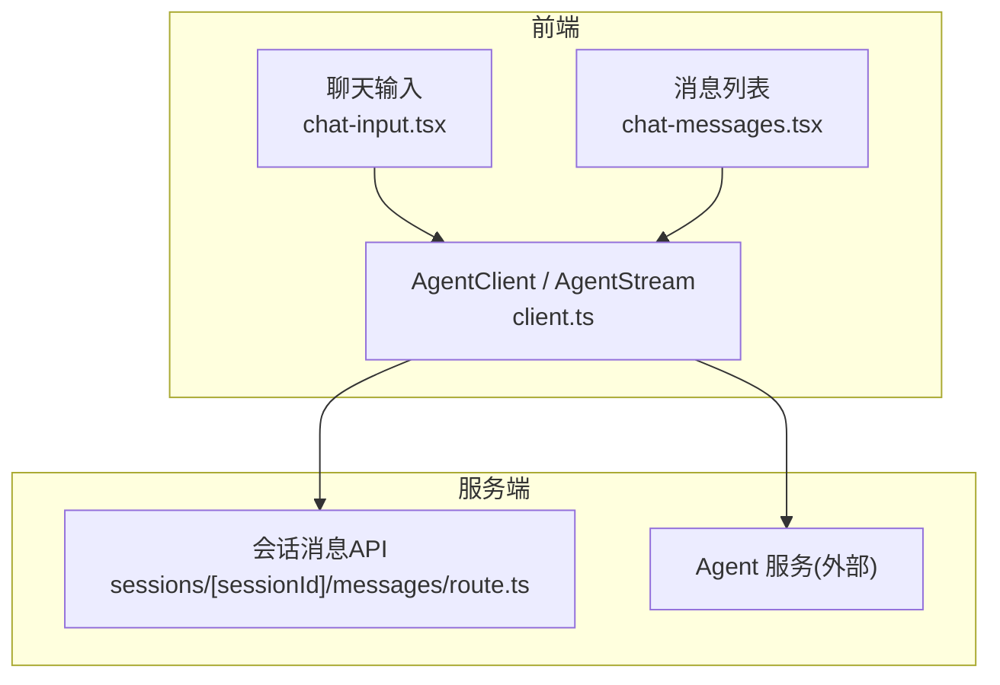
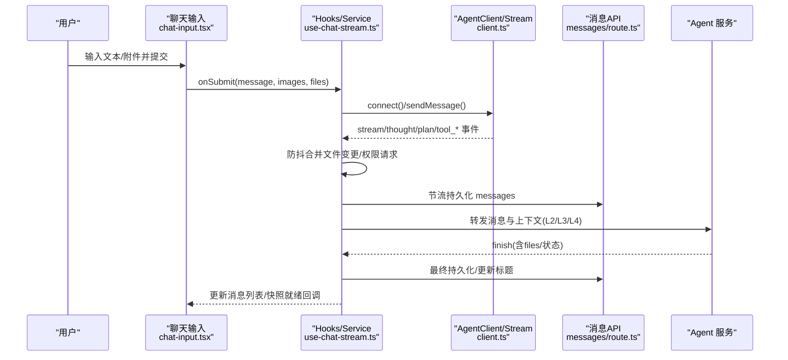
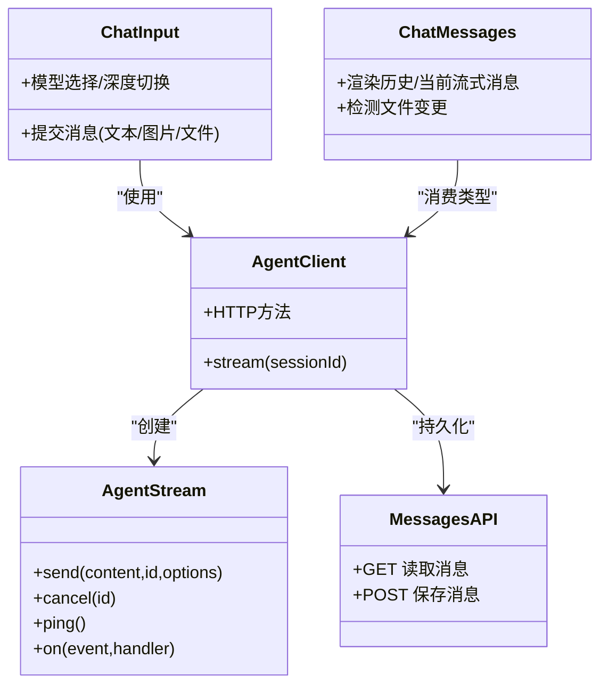
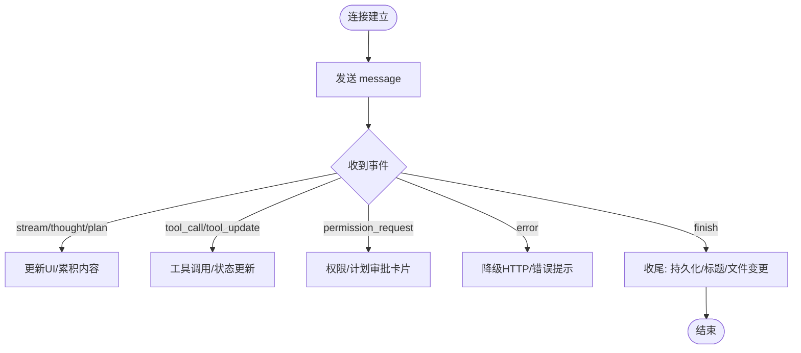

# AI对话界面

<cite>
**本文引用的文件**   
- [packages/agent-client/src/client.ts](file://packages/agent-client/src/client.ts)
- [packages/agent-client/src/types.ts](file://packages/agent-client/src/types.ts)
- [packages/author-site/src/components/ai-elements/chat/chat-input.tsx](file://packages/author-site/src/components/ai-elements/chat/chat-input.tsx)
- [packages/author-site/src/components/ai-elements/chat/chat-messages.tsx](file://packages/author-site/src/components/ai-elements/chat/chat-messages.tsx)
- [packages/author-site/src/app/api/sessions/[sessionId]/messages/route.ts](file://packages/author-site/src/app/api/sessions/[sessionId]/messages/route.ts)
- [docs/项目文档/创作端/05-AI对话/技术/01_对话组件设计.md](file://docs/项目文档/创作端/05-AI对话/技术/01_对话组件设计.md)
- [docs/项目文档/创作端/05-AI对话/技术/02_AIChat分层架构.md](file://docs/项目文档/创作端/05-AI对话/技术/02_AIChat分层架构.md)
- [docs/项目文档/创作端/05-AI对话/技术/03_AI行为约束机制.md](file://docs/项目文档/创作端/05-AI对话/技术/03_AI行为约束机制.md)
- [docs/项目文档/创作端/05-AI对话/技术/05_图片内容预描述.md](file://docs/项目文档/创作端/05-AI对话/技术/05_图片内容预描述.md)
- [OPS/CLI/src/commands/websocket-stream.ts](file://OPS/CLI/src/commands/websocket-stream.ts)
</cite>

## 目录
1. [简介](#简介)
2. [项目结构](#项目结构)
3. [核心组件](#核心组件)
4. [架构总览](#架构总览)
5. [详细组件分析](#详细组件分析)
6. [依赖关系分析](#依赖关系分析)
7. [性能与可靠性](#性能与可靠性)
8. [故障排查指南](#故障排查指南)
9. [结论](#结论)
10. [附录：WebSocket 通信协议与前端集成](#附录websocket-通信协议与前端集成)

## 简介
本技术文档围绕“AI 对话界面”的完整实现，覆盖自然语言指令处理、对话历史管理、流式响应、多模态交互（图片上传与本地文件附件）、对话质量优化（提示词工程、结果过滤、错误重试），以及 WebSocket 通信协议与前端组件集成要点。文档以代码级事实为依据，结合分层架构与数据流说明，帮助读者快速理解并正确集成该能力。

## 项目结构
AI 对话能力由前端 UI 层、客户端 SDK、服务端 API 与 Agent 服务共同组成：
- 前端 UI：消息输入、展示、模型选择、权限确认等
- 客户端 SDK：封装 HTTP 与 WebSocket 通信、事件类型定义
- 服务端 API：会话消息持久化、附件上传等
- Agent 服务：执行意图识别、工具调用、文件变更、计划审批等

图表来源
- [packages/author-site/src/components/ai-elements/chat/chat-input.tsx:1-309](file://packages/author-site/src/components/ai-elements/chat/chat-input.tsx#L1-L309)
- [packages/author-site/src/components/ai-elements/chat/chat-messages.tsx:1-191](file://packages/author-site/src/components/ai-elements/chat/chat-messages.tsx#L1-L191)
- [packages/agent-client/src/client.ts:1-409](file://packages/agent-client/src/client.ts#L1-L409)
- [packages/author-site/src/app/api/sessions/[sessionId]/messages/route.ts:1-107](file://packages/author-site/src/app/api/sessions/[sessionId]/messages/route.ts#L1-L107)

章节来源
- [docs/项目文档/创作端/05-AI对话/技术/01_对话组件设计.md:1-253](file://docs/项目文档/创作端/05-AI对话/技术/01_对话组件设计.md#L1-L253)
- [docs/项目文档/创作端/05-AI对话/技术/02_AIChat分层架构.md:1-241](file://docs/项目文档/创作端/05-AI对话/技术/02_AIChat分层架构.md#L1-L241)

## 核心组件
- 聊天输入组件：负责用户文本与附件（图片/文件）收集、校验与提交，支持模型选择与思考深度切换
- 消息列表组件：渲染历史消息、当前流式回复、滚动定位与操作入口
- 客户端 SDK：提供 HTTP 接口与 WebSocket 流式通道，统一事件类型与错误码
- 会话消息 API：基于文件系统持久化消息历史，提供读取与保存接口

章节来源
- [packages/author-site/src/components/ai-elements/chat/chat-input.tsx:187-248](file://packages/author-site/src/components/ai-elements/chat/chat-input.tsx#L187-L248)
- [packages/author-site/src/components/ai-elements/chat/chat-messages.tsx:1-191](file://packages/author-site/src/components/ai-elements/chat/chat-messages.tsx#L1-L191)
- [packages/agent-client/src/client.ts:200-409](file://packages/agent-client/src/client.ts#L200-L409)
- [packages/author-site/src/app/api/sessions/[sessionId]/messages/route.ts:14-107](file://packages/author-site/src/app/api/sessions/[sessionId]/messages/route.ts#L14-L107)

## 架构总览
AI 对话采用分层架构：UI 子组件 → Hooks 层 → Service 层 → 客户端 SDK → Agent 服务。发送消息时，前端通过 WebSocket 建立长连接，实时接收 stream/thought/plan/tool_call/tool_update/permission/file_op/finish 等事件；失败或异常时降级到 HTTP 非流式模式。消息持久化在流式过程中节流进行，并在 finish 后最终落盘。

图表来源
- [docs/项目文档/创作端/05-AI对话/技术/02_AIChat分层架构.md:162-198](file://docs/项目文档/创作端/05-AI对话/技术/02_AIChat分层架构.md#L162-L198)
- [packages/agent-client/src/client.ts:340-386](file://packages/agent-client/src/client.ts#L340-L386)
- [packages/author-site/src/app/api/sessions/[sessionId]/messages/route.ts:59-107](file://packages/author-site/src/app/api/sessions/[sessionId]/messages/route.ts#L59-L107)

## 详细组件分析

### 聊天输入组件（chat-input.tsx）
- 功能要点
  - 附件分流：图片转为 Base64 图片附件；非图片文件先上传为只读附件元数据，再随消息进入 Agent
  - 大小与数量限制：单次最多 N 个附件，总大小不超过阈值
  - 提交逻辑：当无文本但有附件时生成默认提示语，确保语义完整
  - 模型选择与深度切换：透传给上层 Hook，用于后续消息携带完整模型 ID
- 关键路径
  - 提交处理：[chat-input.tsx:187-248](file://packages/author-site/src/components/ai-elements/chat/chat-input.tsx#L187-L248)
  - 文件上传接口：[chat-input.tsx:86-106](file://packages/author-site/src/components/ai-elements/chat/chat-input.tsx#L86-L106)

章节来源
- [packages/author-site/src/components/ai-elements/chat/chat-input.tsx:187-248](file://packages/author-site/src/components/ai-elements/chat/chat-input.tsx#L187-L248)
- [packages/author-site/src/components/ai-elements/chat/chat-input.tsx:86-106](file://packages/author-site/src/components/ai-elements/chat/chat-input.tsx#L86-L106)

### 消息列表组件（chat-messages.tsx）
- 功能要点
  - 区分用户消息与助手消息，支持流式当前消息渲染
  - 检测是否包含文件变更（工具调用相关），便于后续操作入口
  - 滚动到底部提示按钮，提升长对话体验
- 关键路径
  - 渲染与判断：[chat-messages.tsx:1-191](file://packages/author-site/src/components/ai-elements/chat/chat-messages.tsx#L1-L191)

章节来源
- [packages/author-site/src/components/ai-elements/chat/chat-messages.tsx:1-191](file://packages/author-site/src/components/ai-elements/chat/chat-messages.tsx#L1-L191)

### 客户端 SDK（AgentClient / AgentStream）
- 功能要点
  - HTTP 方法：发送消息、获取会话、文件列表、工作区信息、回滚等
  - WebSocket 流：connect/send/cancel/ping/on/off/close，事件类型包括 stream/thought/plan/tool_call/tool_call_update/error/finish/status/permission_request/user_choice_request/models
  - 自动重连与心跳：onclose 指数退避重连，ping 保活
- 关键路径
  - 类与方法：[client.ts:20-204](file://packages/agent-client/src/client.ts#L20-L204)
  - 流式事件与发送：[client.ts:279-409](file://packages/agent-client/src/client.ts#L279-L409)
  - 事件类型定义：[types.ts:206-272](file://packages/agent-client/src/types.ts#L206-L272)

章节来源
- [packages/agent-client/src/client.ts:20-204](file://packages/agent-client/src/client.ts#L20-L204)
- [packages/agent-client/src/client.ts:279-409](file://packages/agent-client/src/client.ts#L279-L409)
- [packages/agent-client/src/types.ts:206-272](file://packages/agent-client/src/types.ts#L206-L272)

### 会话消息持久化 API（messages/route.ts）
- 功能要点
  - GET：按 sessionId 读取 .messages.json，不存在返回空数组
  - POST：写入 .messages.json，校验 messages 为数组
  - 鉴权：Cookie JWT 校验，未登录/过期返回 401
- 关键路径
  - 读取与保存：[route.ts:14-107](file://packages/author-site/src/app/api/sessions/[sessionId]/messages/route.ts#L14-L107)

章节来源
- [packages/author-site/src/app/api/sessions/[sessionId]/messages/route.ts:14-107](file://packages/author-site/src/app/api/sessions/[sessionId]/messages/route.ts#L14-L107)

### 图片内容预描述（多模态）
- 流程概述
  - 若主模型不支持图片输入，则走“翻译员模式”：识图模型将图片转换为文字描述，拼接至用户问题前，再由主模型回答
  - 未配置识图模型时，明确错误提示，避免静默失败
- 关键路径
  - 整体协作与数据流：[05_图片内容预描述.md:35-68](file://docs/项目文档/创作端/05-AI对话/技术/05_图片内容预描述.md#L35-L68)

章节来源
- [docs/项目文档/创作端/05-AI对话/技术/05_图片内容预描述.md:35-68](file://docs/项目文档/创作端/05-AI对话/技术/05_图片内容预描述.md#L35-L68)

### 本地文件附件读取
- 流程概述
  - 非图片文件在服务端提取文本，保存为会话级临时附件；Agent 可在后续轮次通过附件 ID 读取
  - 上传阶段仅提取可读文字，扫描版 PDF 等不可读情况保留元数据但读取工具会返回不可读说明
- 关键路径
  - 组件设计与流转：[01_对话组件设计.md:189-208](file://docs/项目文档/创作端/05-AI对话/技术/01_对话组件设计.md#L189-L208)

章节来源
- [docs/项目文档/创作端/05-AI对话/技术/01_对话组件设计.md:189-208](file://docs/项目文档/创作端/05-AI对话/技术/01_对话组件设计.md#L189-L208)

### 对话质量优化（提示词工程、结果过滤、错误重试）
- 提示词工程
  - L2 静态 System Prompt：任务手册、边界规则、页面运行时策略、计划审批策略等
  - L3 动态上下文：工作空间扫描、知识库索引注入
  - L4 记忆层：首条消息注入 memory.md，跨会话长期记忆
- 结果过滤与预览校验
  - 文件写入后触发 preview validation，失败作为继续修复信号
- 错误重试与降级
  - WebSocket 失败降级到 HTTP 非流式模式；自动重连与心跳保活
- 关键路径
  - 分层架构与数据流：[02_AIChat分层架构.md:162-198](file://docs/项目文档/创作端/05-AI对话/技术/02_AIChat分层架构.md#L162-L198)
  - 行为约束与提示词：[03_AI行为约束机制.md:241-395](file://docs/项目文档/创作端/05-AI对话/技术/03_AI行为约束机制.md#L241-L395)

章节来源
- [docs/项目文档/创作端/05-AI对话/技术/02_AIChat分层架构.md:162-198](file://docs/项目文档/创作端/05-AI对话/技术/02_AIChat分层架构.md#L162-L198)
- [docs/项目文档/创作端/05-AI对话/技术/03_AI行为约束机制.md:241-395](file://docs/项目文档/创作端/05-AI对话/技术/03_AI行为约束机制.md#L241-L395)

## 依赖关系分析
- 组件耦合
  - chat-input.tsx 依赖 agent-client 的类型与上传接口
  - chat-messages.tsx 依赖 agent-client 的图片附件类型
  - hooks/service 层依赖 AgentClient/AgentStream 进行网络通信
- 外部依赖
  - Agent 服务：执行意图识别、工具调用、文件变更、计划审批
  - 文件系统：消息持久化使用 .messages.json

图表来源
- [packages/author-site/src/components/ai-elements/chat/chat-input.tsx:1-309](file://packages/author-site/src/components/ai-elements/chat/chat-input.tsx#L1-L309)
- [packages/author-site/src/components/ai-elements/chat/chat-messages.tsx:1-191](file://packages/author-site/src/components/ai-elements/chat/chat-messages.tsx#L1-L191)
- [packages/agent-client/src/client.ts:1-409](file://packages/agent-client/src/client.ts#L1-L409)
- [packages/author-site/src/app/api/sessions/[sessionId]/messages/route.ts:1-107](file://packages/author-site/src/app/api/sessions/[sessionId]/messages/route.ts#L1-L107)

章节来源
- [packages/agent-client/src/client.ts:1-409](file://packages/agent-client/src/client.ts#L1-L409)
- [packages/author-site/src/app/api/sessions/[sessionId]/messages/route.ts:1-107](file://packages/author-site/src/app/api/sessions/[sessionId]/messages/route.ts#L1-L107)

## 性能与可靠性
- 流式响应
  - 高频事件下使用 ref 同步追踪最新值，避免状态跳闪
  - 文件操作 300ms 防抖批量通知，减少 UI 抖动
- 持久化策略
  - 发送消息后立即持久化（fire-and-forget）
  - 流式期间每 5 秒节流一次
  - 页面 visibilitychange 到 hidden 兜底持久化
- 连接可靠性
  - WebSocket 自动重连（指数退避）
  - ping/pong 保活，空闲连接不被清理
- 降级策略
  - WebSocket 失败降级到 HTTP 非流式模式，保证可用性

章节来源
- [docs/项目文档/创作端/05-AI对话/技术/02_AIChat分层架构.md:162-198](file://docs/项目文档/创作端/05-AI对话/技术/02_AIChat分层架构.md#L162-L198)
- [packages/agent-client/src/client.ts:314-338](file://packages/agent-client/src/client.ts#L314-L338)

## 故障排查指南
- 常见问题
  - WebSocket 连接失败：检查 Agent 服务是否启动、路由配置、会话 ID 有效性
  - 附件上传失败：确认文件大小与数量限制、会话初始化完成
  - 消息未持久化：检查网络请求与文件系统权限
- 诊断建议
  - 使用 CLI 工具测试 WebSocket 连通性与输出
  - 查看浏览器控制台与服务端日志，关注错误码与堆栈

章节来源
- [OPS/CLI/src/commands/websocket-stream.ts:219-262](file://OPS/CLI/src/commands/websocket-stream.ts#L219-L262)
- [packages/author-site/src/app/api/sessions/[sessionId]/messages/route.ts:50-56](file://packages/author-site/src/app/api/sessions/[sessionId]/messages/route.ts#L50-L56)

## 结论
AI 对话界面通过清晰的分层架构与稳健的通信机制，实现了从自然语言指令到代码修改的端到端闭环。配合提示词工程、预览校验与错误降级策略，系统在可用性与安全性之间取得良好平衡。前端组件易于集成，WebSocket 协议稳定可靠，适合在生产环境广泛使用。

## 附录：WebSocket 通信协议与前端集成

### 协议概览
- 连接建立
  - 客户端通过 AgentClient.stream(sessionId) 构造 wsUrl 并连接 /api/agent/{sessionId}/stream
- 消息发送
  - type=message，携带 id/content/workingDir/projectId/demoId/model/images/files/systemPrompt/options
- 事件类型
  - stream/thought/plan/tool_call/tool_call_update/error/finish/status/permission_request/user_choice_request/models
- 控制命令
  - cancel：取消指定消息
  - ping：保活心跳

图表来源
- [packages/agent-client/src/client.ts:340-386](file://packages/agent-client/src/client.ts#L340-L386)
- [packages/agent-client/src/types.ts:206-272](file://packages/agent-client/src/types.ts#L206-L272)

### 前端集成要点
- 初始化
  - 在编辑页中维护 sessionId/workspaceId/agentSessionId，新建/切换对话不重置代码与 Schema
- 发送消息
  - 通过 useChatStream.handleSend 提交，携带当前完整模型 ID
- 事件处理
  - 监听 stream/thought/plan/tool_* 事件，更新 currentMessage 与 parts
  - 处理 permission_request 与 user_choice_request，展示相应卡片
- 持久化
  - 使用 MessageService.persistMessages 在发送、节流、隐藏页面时持久化
- 文件变更
  - 使用 processFileChanges 合并变更，优先 result.files，兜底 fetchSessionFiles

章节来源
- [docs/项目文档/创作端/05-AI对话/技术/01_对话组件设计.md:121-188](file://docs/项目文档/创作端/05-AI对话/技术/01_对话组件设计.md#L121-L188)
- [docs/项目文档/创作端/05-AI对话/技术/02_AIChat分层架构.md:162-198](file://docs/项目文档/创作端/05-AI对话/技术/02_AIChat分层架构.md#L162-L198)