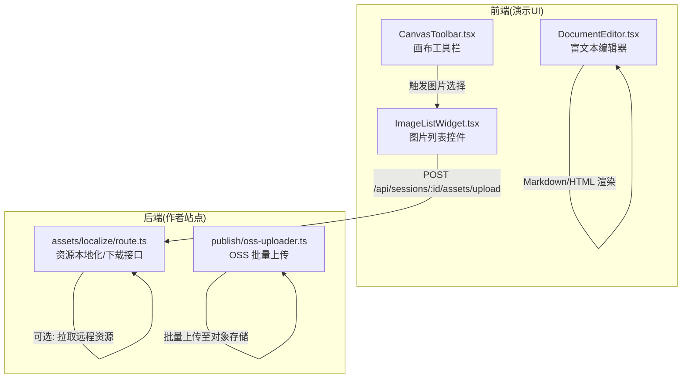
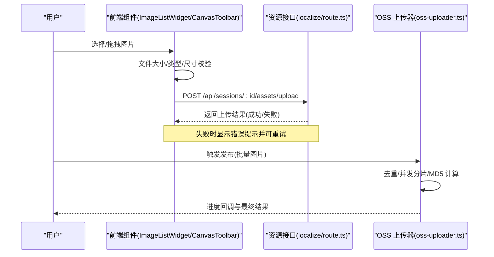
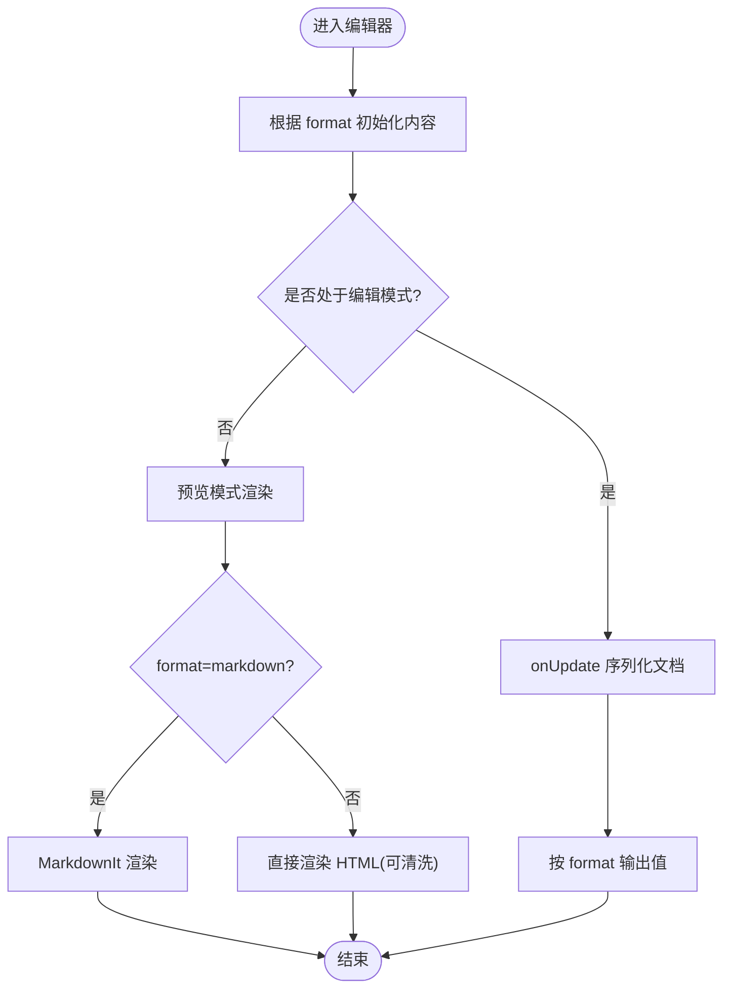
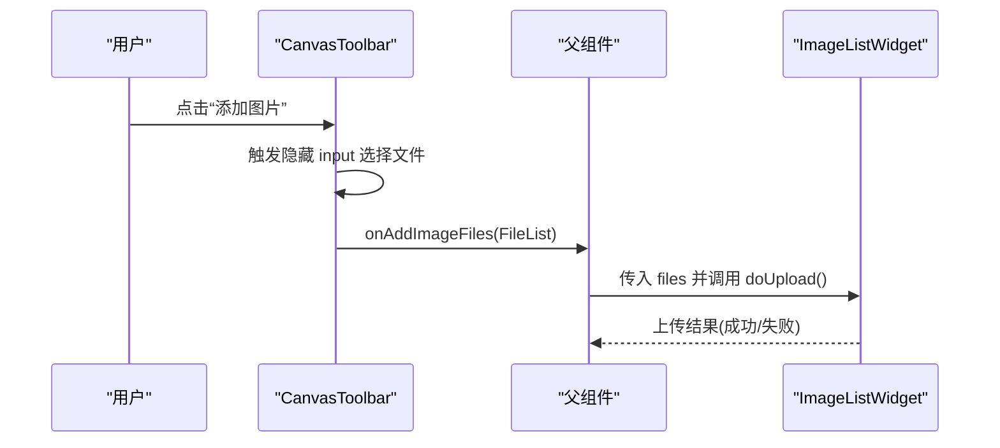
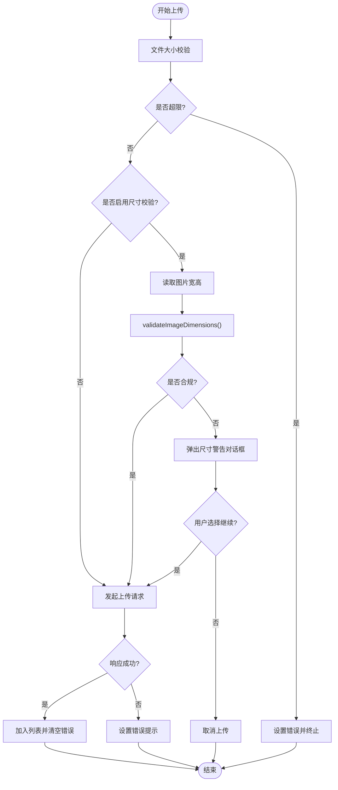
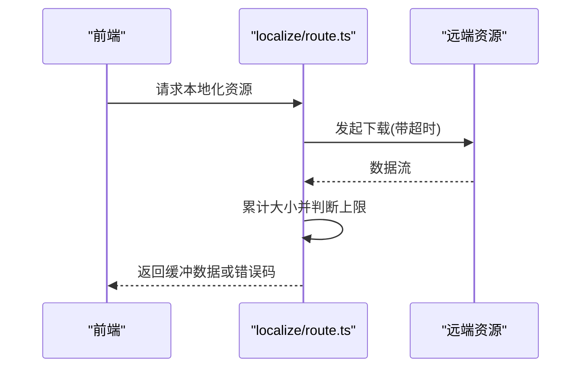
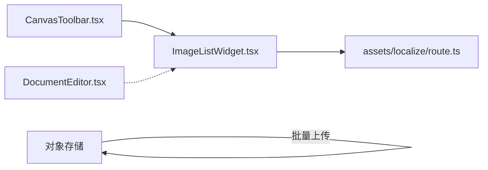

# 多模态交互

<cite>
**本文引用的文件**   
- [packages/demo-ui/src/DocumentEditor.tsx](file://packages/demo-ui/src/DocumentEditor.tsx)
- [packages/demo-ui/src/CanvasToolbar.tsx](file://packages/demo-ui/src/CanvasToolbar.tsx)
- [packages/demo-ui/src/ImageListWidget.tsx](file://packages/demo-ui/src/ImageListWidget.tsx)
- [packages/author-site/src/lib/publish/oss-uploader.ts](file://packages/author-site/src/lib/publish/oss-uploader.ts)
- [packages/author-site/src/app/api/sessions/[sessionId]/assets/localize/route.ts](file://packages/author-site/src/app/api/sessions/[sessionId]/assets/localize/route.ts)
- [docs/项目文档/创作端/04-配置与预览/配置系统_需求文档.md](file://docs/项目文档/创作端/04-配置与预览/配置系统_需求文档.md)
- [docs/项目文档/创作端/04-配置与预览/技术/03_表单生成器.md](file://docs/项目文档/创作端/04-配置与预览/技术/03_表单生成器.md)
- [docs/项目文档/figma插件/技术/资源处理与上传.md](file://docs/项目文档/figma插件/技术/资源处理与上传.md)
</cite>

## 目录
1. [引言](#引言)
2. [项目结构](#项目结构)
3. [核心组件](#核心组件)
4. [架构总览](#架构总览)
5. [详细组件分析](#详细组件分析)
6. [依赖分析](#依赖分析)
7. [性能考虑](#性能考虑)
8. [故障排查指南](#故障排查指南)
9. [结论](#结论)
10. [附录](#附录)

## 引言
本技术文档围绕“多模态交互”能力，系统性梳理图片上传与处理、富文本编辑器集成、文件处理能力（含并发控制）、多媒体内容展示以及安全验证机制，并给出用户体验优化建议。文档以仓库中实际实现为依据，提供可追溯的源码定位与流程图示，帮助读者快速理解从前端到后端的完整链路。

## 项目结构
多模态相关能力主要分布在以下模块：
- 演示 UI 层：包含富文本编辑器、画布工具栏、图片列表控件等前端组件
- 作者站点服务层：包含本地化资源处理接口与发布阶段的 OSS 批量上传
- 文档与规范：包含图片上传校验规则、尺寸校验流程与安全策略说明



图示来源
- [packages/demo-ui/src/DocumentEditor.tsx:1-552](file://packages/demo-ui/src/DocumentEditor.tsx#L1-L552)
- [packages/demo-ui/src/CanvasToolbar.tsx:1-317](file://packages/demo-ui/src/CanvasToolbar.tsx#L1-L317)
- [packages/demo-ui/src/ImageListWidget.tsx:1-360](file://packages/demo-ui/src/ImageListWidget.tsx#L1-L360)
- [packages/author-site/src/app/api/sessions/[sessionId]/assets/localize/route.ts](file://packages/author-site/src/app/api/sessions/[sessionId]/assets/localize/route.ts#L228-L274)
- [packages/author-site/src/lib/publish/oss-uploader.ts:1-169](file://packages/author-site/src/lib/publish/oss-uploader.ts#L1-L169)

章节来源
- [packages/demo-ui/src/DocumentEditor.tsx:1-552](file://packages/demo-ui/src/DocumentEditor.tsx#L1-L552)
- [packages/demo-ui/src/CanvasToolbar.tsx:1-317](file://packages/demo-ui/src/CanvasToolbar.tsx#L1-L317)
- [packages/demo-ui/src/ImageListWidget.tsx:1-360](file://packages/demo-ui/src/ImageListWidget.tsx#L1-L360)
- [packages/author-site/src/app/api/sessions/[sessionId]/assets/localize/route.ts](file://packages/author-site/src/app/api/sessions/[sessionId]/assets/localize/route.ts#L228-L274)
- [packages/author-site/src/lib/publish/oss-uploader.ts:1-169](file://packages/author-site/src/lib/publish/oss-uploader.ts#L1-L169)

## 核心组件
- 富文本编辑器（DocumentEditor）
  - 支持 Markdown 与 HTML 双格式编辑与预览
  - 内置常用排版工具栏（加粗、斜体、标题、列表、任务列表、代码块、引用、链接、分隔线、清除格式）
  - 粘贴 Markdown 自动解析为内部模型
  - 字符计数与只读/预览模式切换
- 画布工具栏（CanvasToolbar）
  - 提供添加文档、文字、图片入口
  - 缩放控制与视图工具切换
- 图片列表控件（ImageListWidget）
  - 支持拖拽/选择上传、多图管理、删除、放大预览
  - 文件大小限制、可选的图片尺寸校验与二次确认
  - 错误提示与上传状态反馈

章节来源
- [packages/demo-ui/src/DocumentEditor.tsx:1-552](file://packages/demo-ui/src/DocumentEditor.tsx#L1-L552)
- [packages/demo-ui/src/CanvasToolbar.tsx:1-317](file://packages/demo-ui/src/CanvasToolbar.tsx#L1-L317)
- [packages/demo-ui/src/ImageListWidget.tsx:1-360](file://packages/demo-ui/src/ImageListWidget.tsx#L1-L360)

## 架构总览
下图展示了从用户操作到资源落盘的关键路径：用户在画布或编辑器中选择图片，前端进行基础校验与尺寸检查，随后通过会话级上传接口提交；服务端在接收时进行大小限制与鉴权；发布阶段由 OSS 上传器完成去重、并发上传与进度回调。



图示来源
- [packages/demo-ui/src/ImageListWidget.tsx:134-193](file://packages/demo-ui/src/ImageListWidget.tsx#L134-L193)
- [packages/author-site/src/app/api/sessions/[sessionId]/assets/localize/route.ts](file://packages/author-site/src/app/api/sessions/[sessionId]/assets/localize/route.ts#L228-L274)
- [packages/author-site/src/lib/publish/oss-uploader.ts:31-131](file://packages/author-site/src/lib/publish/oss-uploader.ts#L31-L131)

## 详细组件分析

### 富文本编辑器（DocumentEditor）
- 功能要点
  - 双格式支持：Markdown 与 HTML，实时转换与预览
  - 自定义 Markdown 序列化：支持表格、任务列表、链接、下划线等扩展
  - 粘贴增强：当检测到 Markdown 文本时，自动解析为编辑器节点
  - 预览模式：Markdown 使用 MarkdownIt 渲染，HTML 可接入清洗函数
- 关键流程
  - 初始化：根据 format 将 value 转为编辑器 HTML 或 Markdown
  - 更新：onUpdate 时将内部文档序列化为当前 format 输出
  - 预览：根据 format 决定渲染源（Markdown 或 HTML），并统计字符数



图示来源
- [packages/demo-ui/src/DocumentEditor.tsx:250-343](file://packages/demo-ui/src/DocumentEditor.tsx#L250-L343)
- [packages/demo-ui/src/DocumentEditor.tsx:381-384](file://packages/demo-ui/src/DocumentEditor.tsx#L381-L384)

章节来源
- [packages/demo-ui/src/DocumentEditor.tsx:1-552](file://packages/demo-ui/src/DocumentEditor.tsx#L1-L552)

### 画布工具栏（CanvasToolbar）
- 功能要点
  - 提供“添加文档/文字/图片”快捷入口
  - 图片入口通过隐藏 input[type=file] 触发，支持多选
  - 工具模式切换（手型/选择/文本/图片）
- 与图片上传联动
  - 点击“添加图片”按钮触发 onAddImageFiles(files)
  - 上层组件可将 FileList 传递给 ImageListWidget 执行上传



图示来源
- [packages/demo-ui/src/CanvasToolbar.tsx:189-219](file://packages/demo-ui/src/CanvasToolbar.tsx#L189-L219)
- [packages/demo-ui/src/ImageListWidget.tsx:134-193](file://packages/demo-ui/src/ImageListWidget.tsx#L134-L193)

章节来源
- [packages/demo-ui/src/CanvasToolbar.tsx:1-317](file://packages/demo-ui/src/CanvasToolbar.tsx#L1-L317)

### 图片列表控件（ImageListWidget）
- 功能要点
  - 上传前校验：文件大小、可选尺寸范围（min/max width/height）
  - 尺寸不合规时弹出二次确认对话框，允许“继续上传”
  - 上传过程显示加载动画与错误信息
  - 支持删除已上传图片（若为会话内资源则调用删除接口）
  - 大图预览弹窗
- 上传流程
  - 构造 FormData 并通过 /api/sessions/:id/assets/upload 提交
  - 成功后追加到列表，失败时显示错误并可重试



图示来源
- [packages/demo-ui/src/ImageListWidget.tsx:16-56](file://packages/demo-ui/src/ImageListWidget.tsx#L16-L56)
- [packages/demo-ui/src/ImageListWidget.tsx:134-193](file://packages/demo-ui/src/ImageListWidget.tsx#L134-L193)
- [packages/demo-ui/src/ImageListWidget.tsx:308-336](file://packages/demo-ui/src/ImageListWidget.tsx#L308-L336)

章节来源
- [packages/demo-ui/src/ImageListWidget.tsx:1-360](file://packages/demo-ui/src/ImageListWidget.tsx#L1-L360)

### 资源本地化接口（localize/route.ts）
- 功能要点
  - 鉴权：校验登录态与令牌有效性
  - 下载外部资源：流式读取并限制最大体积，超时保护
  - 错误分类：网络错误、超时、超过大小限制等
- 与上传的关系
  - 作为资源获取与本地化的辅助接口，配合上传流程完成素材落地



图示来源
- [packages/author-site/src/app/api/sessions/[sessionId]/assets/localize/route.ts](file://packages/author-site/src/app/api/sessions/[sessionId]/assets/localize/route.ts#L228-L274)

章节来源
- [packages/author-site/src/app/api/sessions/[sessionId]/assets/localize/route.ts](file://packages/author-site/src/app/api/sessions/[sessionId]/assets/localize/route.ts#L228-L274)

### 发布阶段 OSS 批量上传（oss-uploader.ts）
- 功能要点
  - 并发控制：按批次并发上传，支持进度回调
  - 去重：基于绝对路径去重，避免重复上传
  - 安全校验：仅允许指定扩展名、单文件大小上限
  - 幂等性：基于 MD5 计算对象键，先 head 检查是否存在再上传
- 典型流程
  - 遍历图片集合，分批并发上传
  - 单个文件：类型/存在性/大小校验 → 计算 MD5 → 生成 OSS Key → 检查存在 → 上传 → 返回结果

```mermaid
classDiagram
class OSSUploader {
+uploadBatch(images, options) UploadResult[]
-uploadSingle(image) UploadResult
-computeFileMD5(filePath) string
-generateOSSKey(contentHash, filePath) string
-checkIfExists(ossKey) {url}|null
-dedupe(images) ImageReference[]
}
```

图示来源
- [packages/author-site/src/lib/publish/oss-uploader.ts:14-163](file://packages/author-site/src/lib/publish/oss-uploader.ts#L14-L163)

章节来源
- [packages/author-site/src/lib/publish/oss-uploader.ts:1-169](file://packages/author-site/src/lib/publish/oss-uploader.ts#L1-L169)

## 依赖分析
- 前端组件耦合关系
  - CanvasToolbar 负责触发图片选择，将 FileList 交给上层，再由 ImageListWidget 执行上传
  - DocumentEditor 独立于上传流程，专注内容编辑与预览
- 前后端接口契约
  - 上传接口：/api/sessions/:sessionId/assets/upload（POST，FormData）
  - 资源本地化：/api/sessions/:sessionId/assets/localize（POST，用于拉取并缓存远端资源）
- 发布阶段依赖
  - oss-uploader 依赖阿里云 OSS SDK，结合项目 ID 与路径前缀组织对象键



图示来源
- [packages/demo-ui/src/CanvasToolbar.tsx:189-219](file://packages/demo-ui/src/CanvasToolbar.tsx#L189-L219)
- [packages/demo-ui/src/ImageListWidget.tsx:134-193](file://packages/demo-ui/src/ImageListWidget.tsx#L134-L193)
- [packages/author-site/src/app/api/sessions/[sessionId]/assets/localize/route.ts](file://packages/author-site/src/app/api/sessions/[sessionId]/assets/localize/route.ts#L228-L274)
- [packages/author-site/src/lib/publish/oss-uploader.ts:31-131](file://packages/author-site/src/lib/publish/oss-uploader.ts#L31-L131)

章节来源
- [packages/demo-ui/src/CanvasToolbar.tsx:1-317](file://packages/demo-ui/src/CanvasToolbar.tsx#L1-L317)
- [packages/demo-ui/src/ImageListWidget.tsx:1-360](file://packages/demo-ui/src/ImageListWidget.tsx#L1-L360)
- [packages/author-site/src/app/api/sessions/[sessionId]/assets/localize/route.ts](file://packages/author-site/src/app/api/sessions/[sessionId]/assets/localize/route.ts#L228-L274)
- [packages/author-site/src/lib/publish/oss-uploader.ts:1-169](file://packages/author-site/src/lib/publish/oss-uploader.ts#L1-L169)

## 性能考虑
- 前端
  - 图片尺寸读取采用内存对象 URL，注意及时释放以避免内存泄漏
  - 上传失败时保留错误提示，便于用户快速重试
- 后端
  - 资源下载采用流式累积并设置大小上限与超时，防止大文件占用内存
  - 发布阶段上传采用并发批次与去重策略，减少冗余 IO 与网络开销
- 对象存储
  - 基于 MD5 的对象键设计天然具备幂等性，避免重复上传

[本节为通用指导，无需源码引用]

## 故障排查指南
- 上传失败
  - 检查文件大小是否超过限制（前端 maxSize 与服务端 MAX_IMAGE_SIZE）
  - 查看错误码与消息，区分网络错误、超时、类型非法、超出大小等
- 尺寸校验告警
  - 若未满足 min/max 宽高要求，会弹出确认对话框；可选择“取消上传”或“继续上传”
- 鉴权问题
  - 确保登录态有效，token 过期会导致 401 错误
- 资源本地化异常
  - 关注下载超时与网络错误，必要时调整超时阈值或重试策略

章节来源
- [packages/demo-ui/src/ImageListWidget.tsx:134-193](file://packages/demo-ui/src/ImageListWidget.tsx#L134-L193)
- [packages/author-site/src/app/api/sessions/[sessionId]/assets/localize/route.ts](file://packages/author-site/src/app/api/sessions/[sessionId]/assets/localize/route.ts#L228-L274)

## 结论
本项目在多模态交互方面形成了较为完整的闭环：前端提供富文本与图片管理能力，后端提供鉴权、限流与资源本地化，发布阶段通过对象存储实现高效可靠的批量上传。整体方案兼顾安全性与用户体验，具备良好的可扩展性与维护性。

[本节为总结性内容，无需源码引用]

## 附录

### 图片上传与校验规则（参考）
- 文件大小：默认 50MB，可通过 ui:options.maxSize 配置
- 图片尺寸：支持 minWidth/minHeight/maxWidth/maxHeight，未声明时不触发
- 交互策略：尺寸不合规时弹出确认对话框，非阻断性
- 适用范围：单图与多图控件均支持逐张校验

章节来源
- [docs/项目文档/创作端/04-配置与预览/配置系统_需求文档.md:329-377](file://docs/项目文档/创作端/04-配置与预览/配置系统_需求文档.md#L329-L377)
- [docs/项目文档/创作端/04-配置与预览/技术/03_表单生成器.md:896-950](file://docs/项目文档/创作端/04-配置与预览/技术/03_表单生成器.md#L896-L950)

### 安全策略（参考）
- 密钥管理：密钥仅存于环境变量，插件端不持有
- 上传校验：Worker 侧校验上传头，防止未授权上传
- 文件类型限制：仅接受 png/svg 等白名单格式
- 大小限制：可配置单文件大小上限

章节来源
- [docs/项目文档/figma插件/技术/资源处理与上传.md:290-296](file://docs/项目文档/figma插件/技术/资源处理与上传.md#L290-L296)