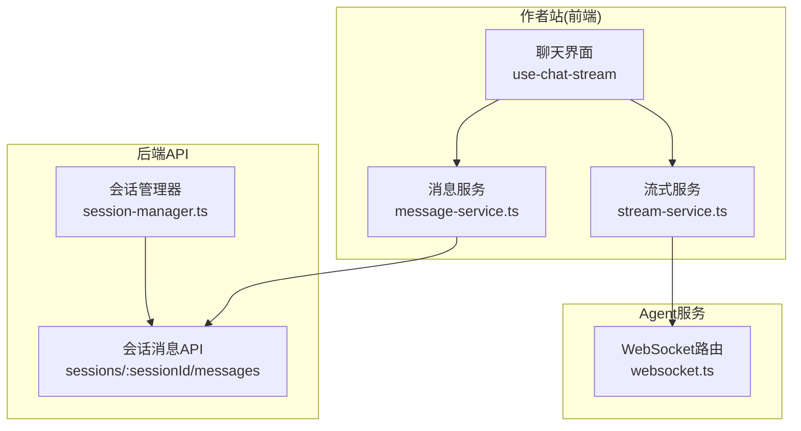
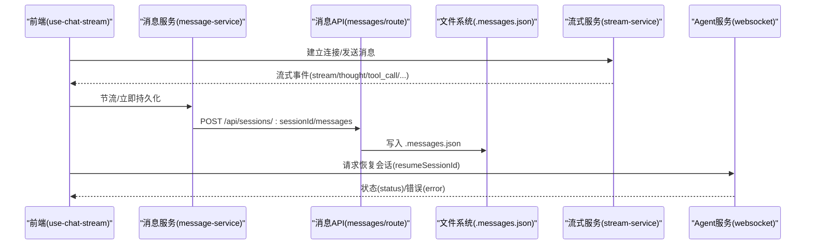
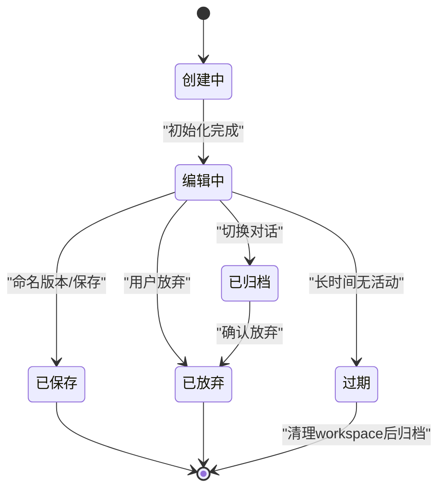
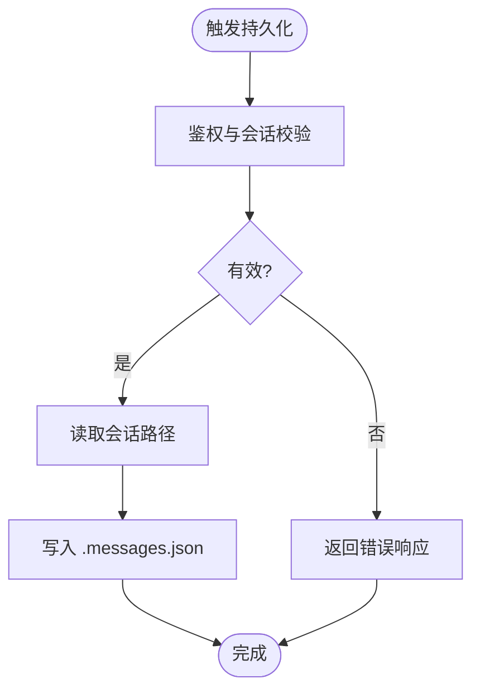
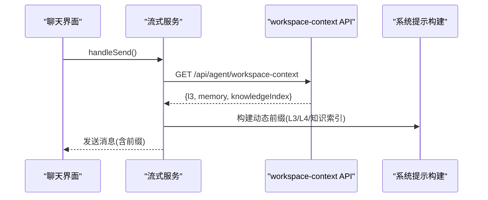
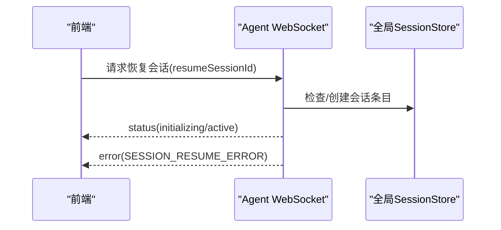
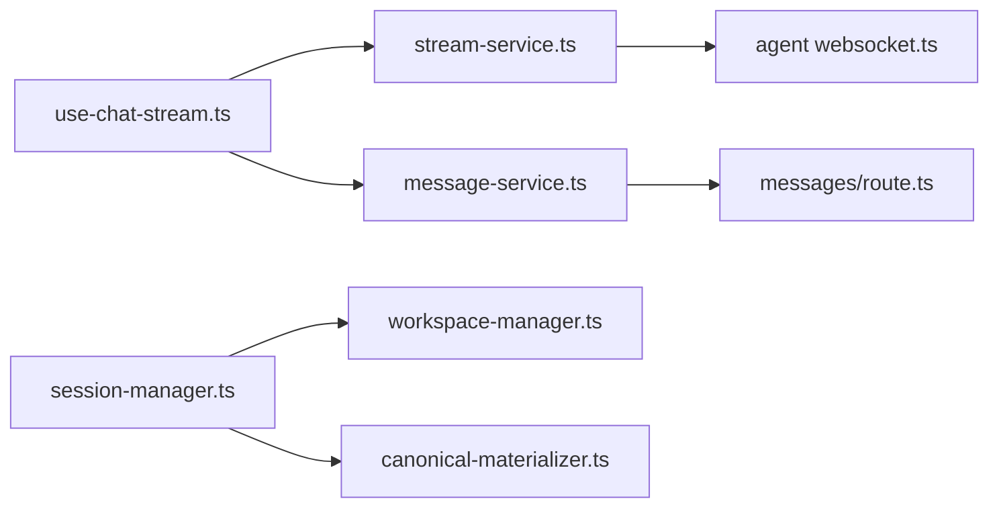

# 对话管理

<cite>
**本文引用的文件**
- [packages/author-site/src/lib/session-manager.ts](file://packages/author-site/src/lib/session-manager.ts)
- [packages/author-site/src/app/api/sessions/[sessionId]/messages/route.ts](file://packages/author-site/src/app/api/sessions/[sessionId]/messages/route.ts)
- [packages/author-site/src/components/ai-elements/chat/services/message-service.ts](file://packages/author-site/src/components/ai-elements/chat/services/message-service.ts)
- [packages/author-site/src/components/ai-elements/chat/hooks/use-chat-stream.ts](file://packages/author-site/src/components/ai-elements/chat/hooks/use-chat-stream.ts)
- [packages/author-site/src/components/ai-elements/chat/services/stream-service.ts](file://packages/author-site/src/components/ai-elements/chat/services/stream-service.ts)
- [packages/agent-service/src/routes/websocket.ts](file://packages/agent-service/src/routes/websocket.ts)
- [docs/项目文档/创作端/03-项目管理/技术/02_生命周期设计_v2.md](file://docs/项目文档/创作端/03-项目管理/技术/02_生命周期设计_v2.md)
- [docs/项目文档/创作端/05-AI对话/技术/02_AIChat分层架构.md](file://docs/项目文档/创作端/05-AI对话/技术/02_AIChat分层架构.md)
- [docs/项目文档/创作端/03-项目管理/技术/11_实时保存与协同编辑.md](file://docs/项目文档/创作端/03-项目管理/技术/11_实时保存与协同编辑.md)
</cite>

## 目录
1. [引言](#引言)
2. [项目结构](#项目结构)
3. [核心组件](#核心组件)
4. [架构总览](#架构总览)
5. [详细组件分析](#详细组件分析)
6. [依赖关系分析](#依赖关系分析)
7. [性能考虑](#性能考虑)
8. [故障排查指南](#故障排查指南)
9. [结论](#结论)
10. [附录](#附录)

## 引言
本技术文档聚焦“对话管理模块”，围绕会话生命周期、消息持久化、上下文管理、会话恢复、状态机设计与错误处理，以及性能优化策略进行系统化说明。内容基于代码实现与配套设计文档，旨在为开发者与维护者提供可落地的参考。

## 项目结构
对话管理涉及前端（作者站）与会话/消息 API、AI 流式服务、Agent 服务等多个层次：
- 会话管理与版本：author-site 的 session-manager 负责会话创建、归档、过期清理、工作区绑定等
- 消息持久化：Next.js Route 提供会话消息文件的读写；MessageService 在前端侧触发持久化
- AI 对话流：use-chat-stream 协调发送、事件回调、节流持久化与降级；stream-service 负责 L3/L4 上下文注入与连接管理
- Agent 服务：websocket 路由支持会话恢复流程

图表来源
- [packages/author-site/src/components/ai-elements/chat/hooks/use-chat-stream.ts](file://packages/author-site/src/components/ai-elements/chat/hooks/use-chat-stream.ts)
- [packages/author-site/src/components/ai-elements/chat/services/message-service.ts](file://packages/author-site/src/components/ai-elements/chat/services/message-service.ts)
- [packages/author-site/src/components/ai-elements/chat/services/stream-service.ts](file://packages/author-site/src/components/ai-elements/chat/services/stream-service.ts)
- [packages/author-site/src/app/api/sessions/[sessionId]/messages/route.ts](file://packages/author-site/src/app/api/sessions/[sessionId]/messages/route.ts)
- [packages/author-site/src/lib/session-manager.ts](file://packages/author-site/src/lib/session-manager.ts)
- [packages/agent-service/src/routes/websocket.ts](file://packages/agent-service/src/routes/websocket.ts)

章节来源
- [docs/项目文档/创作端/03-项目管理/技术/02_生命周期设计_v2.md](file://docs/项目文档/创作端/03-项目管理/技术/02_生命周期设计_v2.md)
- [docs/项目文档/创作端/05-AI对话/技术/02_AIChat分层架构.md](file://docs/项目文档/创作端/05-AI对话/技术/02_AIChat分层架构.md)

## 核心组件
- 会话管理器（session-manager.ts）
  - 职责：会话创建、查找活跃会话、归档/丢弃、过期清理、工作区绑定与迁移、命名版本保存时的同步与快照生成
  - 关键能力：
    - 创建编辑会话并写入 .session.json
    - 按用户/项目维度限制会话数量
    - 发现过期会话并仅清理 workspace 临时文件，保留元数据与消息历史
    - 将旧会话重新绑定到项目级 live Workspace
    - 保存时推进 canonical 物化与版本快照
- 消息持久化 API（messages/route.ts）
  - 职责：读取/写入会话消息文件 .messages.json
  - 安全：鉴权校验、会话存在性校验、异常统一返回
- 消息服务（message-service.ts）
  - 职责：封装消息持久化调用，供前端在多种时机触发
- 聊天流钩子（use-chat-stream.ts）
  - 职责：发送消息、处理流式事件、节流持久化、页面可见性变化兜底、切换会话时持久化旧会话
- 流式服务（stream-service.ts）
  - 职责：建立 WebSocket、等待连接、发送消息、注入 L3/L4 上下文、失败重试与降级
- Agent 服务 WebSocket（websocket.ts）
  - 职责：会话恢复流程、状态广播、错误上报

章节来源
- [packages/author-site/src/lib/session-manager.ts](file://packages/author-site/src/lib/session-manager.ts)
- [packages/author-site/src/app/api/sessions/[sessionId]/messages/route.ts](file://packages/author-site/src/app/api/sessions/[sessionId]/messages/route.ts)
- [packages/author-site/src/components/ai-elements/chat/services/message-service.ts](file://packages/author-site/src/components/ai-elements/chat/services/message-service.ts)
- [packages/author-site/src/components/ai-elements/chat/hooks/use-chat-stream.ts](file://packages/author-site/src/components/ai-elements/chat/hooks/use-chat-stream.ts)
- [packages/author-site/src/components/ai-elements/chat/services/stream-service.ts](file://packages/author-site/src/components/ai-elements/chat/services/stream-service.ts)
- [packages/agent-service/src/routes/websocket.ts](file://packages/agent-service/src/routes/websocket.ts)

## 架构总览
对话管理的关键交互包括：
- 会话创建与保持：session-manager 负责元数据与工作区绑定，配合过期检测与清理
- 消息持久化：前端在多个时机触发 MessageService.persistMessages，最终通过 Next.js Route 写入 .messages.json
- 上下文注入：stream-service 在服务端获取 L3 工作空间上下文与 L4 记忆，拼接到用户消息前缀
- 会话恢复：Agent 服务支持 resumeSessionId，恢复后同步元数据到全局 SessionStore

图表来源
- [packages/author-site/src/components/ai-elements/chat/hooks/use-chat-stream.ts](file://packages/author-site/src/components/ai-elements/chat/hooks/use-chat-stream.ts)
- [packages/author-site/src/components/ai-elements/chat/services/message-service.ts](file://packages/author-site/src/components/ai-elements/chat/services/message-service.ts)
- [packages/author-site/src/app/api/sessions/[sessionId]/messages/route.ts](file://packages/author-site/src/app/api/sessions/[sessionId]/messages/route.ts)
- [packages/author-site/src/components/ai-elements/chat/services/stream-service.ts](file://packages/author-site/src/components/ai-elements/chat/services/stream-service.ts)
- [packages/agent-service/src/routes/websocket.ts](file://packages/agent-service/src/routes/websocket.ts)

## 详细组件分析

### 会话生命周期与状态机
- 状态定义
  - 创建中、编辑中(editing)、已归档(archived)、已保存(saved)、已放弃(discarded)、过期(expired)
- 状态流转
  - 用户活动维持 editing
  - 命名版本不结束会话，继续编辑
  - 切换对话或放弃进入 archived/discarded
  - 长时间无活动进入 expired，后台清理 workspace 临时文件，保留元数据与消息
- 实现要点
  - findActiveSession 对过期会话进行归档并清理非 live workspace
  - cleanupExpiredSessions/cleanupAllExpiredSessions 定期扫描并更新状态
  - archiveActiveSession 用于切换对话时归档当前会话
  - enforceSessionLimit 控制每个项目下活跃会话数量

图表来源
- [docs/项目文档/创作端/03-项目管理/技术/02_生命周期设计_v2.md](file://docs/项目文档/创作端/03-项目管理/技术/02_生命周期设计_v2.md)
- [packages/author-site/src/lib/session-manager.ts](file://packages/author-site/src/lib/session-manager.ts)

章节来源
- [docs/项目文档/创作端/03-项目管理/技术/02_生命周期设计_v2.md](file://docs/项目文档/创作端/03-项目管理/技术/02_生命周期设计_v2.md)
- [packages/author-site/src/lib/session-manager.ts](file://packages/author-site/src/lib/session-manager.ts)

### 消息持久化策略
- 本地存储
  - 每个会话目录包含 .messages.json，保存完整消息历史
- 服务器同步
  - 前端通过 MessageService.persistMessages 调用 Next.js Route 写入
  - 多时机触发：发送消息时、流式过程中节流、页面隐藏时、切换会话时
- 一致性保证
  - API 层做鉴权与会话存在性校验
  - 写入失败统一返回错误码，前端记录警告但不阻断主流程
  - 协同保存采用“内存合并、延迟落盘、关键动作强制落盘”的策略，避免半截写入

图表来源
- [packages/author-site/src/app/api/sessions/[sessionId]/messages/route.ts](file://packages/author-site/src/app/api/sessions/[sessionId]/messages/route.ts)
- [packages/author-site/src/components/ai-elements/chat/services/message-service.ts](file://packages/author-site/src/components/ai-elements/chat/services/message-service.ts)

章节来源
- [packages/author-site/src/app/api/sessions/[sessionId]/messages/route.ts](file://packages/author-site/src/app/api/sessions/[sessionId]/messages/route.ts)
- [docs/项目文档/创作端/03-项目管理/技术/11_实时保存与协同编辑.md](file://docs/项目文档/创作端/03-项目管理/技术/11_实时保存与协同编辑.md)

### 上下文管理机制
- 历史消息缓存
  - 前端维护 messages 数组，切换会话时先持久化旧会话消息
- 上下文窗口控制
  - stream-service 在服务端拉取 L3 工作空间上下文与 L4 记忆，拼接为 user message 前缀
  - 知识库索引每条消息注入，L4 记忆仅在首条消息注入
- 内存优化
  - 使用防抖/节流减少频繁 I/O
  - 页面 visibilitychange 触发兜底持久化，降低丢失风险

图表来源
- [packages/author-site/src/components/ai-elements/chat/services/stream-service.ts](file://packages/author-site/src/components/ai-elements/chat/services/stream-service.ts)
- [docs/项目文档/创作端/05-AI对话/技术/02_AIChat分层架构.md](file://docs/项目文档/创作端/05-AI对话/技术/02_AIChat分层架构.md)

章节来源
- [packages/author-site/src/components/ai-elements/chat/hooks/use-chat-stream.ts](file://packages/author-site/src/components/ai-elements/chat/hooks/use-chat-stream.ts)
- [packages/author-site/src/components/ai-elements/chat/services/stream-service.ts](file://packages/author-site/src/components/ai-elements/chat/services/stream-service.ts)
- [docs/项目文档/创作端/05-AI对话/技术/02_AIChat分层架构.md](file://docs/项目文档/创作端/05-AI对话/技术/02_AIChat分层架构.md)

### 会话恢复功能
- 断线重连
  - use-chat-stream 监听 sessionId 变化，关闭旧流并清理定时器
  - stream-service 在连接失败时重试一次，避免开发环境首次编译导致的失败
- 状态恢复
  - Agent 服务支持 resumeSessionId，恢复后向客户端广播 status，必要时创建全局 SessionStore 条目
- 数据完整性验证
  - 恢复失败返回 SESSION_RESUME_ERROR，前端可据此降级或提示

图表来源
- [packages/agent-service/src/routes/websocket.ts](file://packages/agent-service/src/routes/websocket.ts)
- [packages/author-site/src/components/ai-elements/chat/hooks/use-chat-stream.ts](file://packages/author-site/src/components/ai-elements/chat/hooks/use-chat-stream.ts)

章节来源
- [packages/agent-service/src/routes/websocket.ts](file://packages/agent-service/src/routes/websocket.ts)
- [packages/author-site/src/components/ai-elements/chat/hooks/use-chat-stream.ts](file://packages/author-site/src/components/ai-elements/chat/hooks/use-chat-stream.ts)

### 错误处理策略
- 鉴权与会话校验失败：返回未登录/会话不存在
- 文件读写异常：统一返回错误码与友好提示
- 流式错误：降级为非 HTTP 模式，确保对话可用
- 恢复错误：返回明确错误码，便于前端处理

章节来源
- [packages/author-site/src/app/api/sessions/[sessionId]/messages/route.ts](file://packages/author-site/src/app/api/sessions/[sessionId]/messages/route.ts)
- [packages/agent-service/src/routes/websocket.ts](file://packages/agent-service/src/routes/websocket.ts)
- [docs/项目文档/创作端/05-AI对话/技术/02_AIChat分层架构.md](file://docs/项目文档/创作端/05-AI对话/技术/02_AIChat分层架构.md)

## 依赖关系分析
- 前端组件依赖
  - use-chat-stream 依赖 stream-service 与 message-service
  - message-service 依赖 Next.js Route 提供的消息持久化接口
- 后端依赖
  - messages/route 依赖 fs-utils 与 JWT 鉴权
  - session-manager 依赖 workspace-manager 与 canonical-materializer（版本与同步）
- 外部集成
  - Agent 服务 WebSocket 提供会话恢复与状态广播

图表来源
- [packages/author-site/src/components/ai-elements/chat/hooks/use-chat-stream.ts](file://packages/author-site/src/components/ai-elements/chat/hooks/use-chat-stream.ts)
- [packages/author-site/src/components/ai-elements/chat/services/stream-service.ts](file://packages/author-site/src/components/ai-elements/chat/services/stream-service.ts)
- [packages/author-site/src/components/ai-elements/chat/services/message-service.ts](file://packages/author-site/src/components/ai-elements/chat/services/message-service.ts)
- [packages/author-site/src/app/api/sessions/[sessionId]/messages/route.ts](file://packages/author-site/src/app/api/sessions/[sessionId]/messages/route.ts)
- [packages/author-site/src/lib/session-manager.ts](file://packages/author-site/src/lib/session-manager.ts)
- [packages/agent-service/src/routes/websocket.ts](file://packages/agent-service/src/routes/websocket.ts)

章节来源
- [packages/author-site/src/lib/session-manager.ts](file://packages/author-site/src/lib/session-manager.ts)
- [packages/author-site/src/app/api/sessions/[sessionId]/messages/route.ts](file://packages/author-site/src/app/api/sessions/[sessionId]/messages/route.ts)

## 性能考虑
- 消息分页加载
  - 建议：在消息列表渲染时采用虚拟滚动与分页加载，避免一次性渲染大量 DOM
- 增量更新
  - 利用流式事件的局部更新（setCurrentMessage/setPlan），减少全量重绘
- 内存泄漏防护
  - 切换会话时清理旧流与定时器，防止残留引用
  - 节流/防抖控制高频 I/O 与状态更新
- 并发与抖动约束
  - 协同房间短暂断开视为自动重连，避免状态抖动
  - 显式 flush 在关键动作（命名版本、发布、保存/合并 Session）前执行，确保基准一致

章节来源
- [docs/项目文档/创作端/03-项目管理/技术/11_实时保存与协同编辑.md](file://docs/项目文档/创作端/03-项目管理/技术/11_实时保存与协同编辑.md)
- [packages/author-site/src/components/ai-elements/chat/hooks/use-chat-stream.ts](file://packages/author-site/src/components/ai-elements/chat/hooks/use-chat-stream.ts)

## 故障排查指南
- 无法读取/保存消息
  - 检查鉴权 Cookie 与 token 有效性
  - 确认会话目录与 .messages.json 存在
  - 查看服务端日志中的 FILE_READ_ERROR/FILE_WRITE_ERROR
- 会话恢复失败
  - 关注 SESSION_RESUME_ERROR 的错误信息
  - 确认 Agent 服务是否成功创建/恢复全局 SessionStore 条目
- 上下文注入失败
  - 检查 workspace-context API 响应是否 OK
  - 观察是否有两次重试仍失败的告警
- 会话过期与清理
  - 确认过期时间戳与 expiresAt 字段
  - 检查 cleanupExpiredSessions 是否仅清理 workspace 而保留元数据与消息

章节来源
- [packages/author-site/src/app/api/sessions/[sessionId]/messages/route.ts](file://packages/author-site/src/app/api/sessions/[sessionId]/messages/route.ts)
- [packages/agent-service/src/routes/websocket.ts](file://packages/agent-service/src/routes/websocket.ts)
- [packages/author-site/src/components/ai-elements/chat/services/stream-service.ts](file://packages/author-site/src/components/ai-elements/chat/services/stream-service.ts)
- [packages/author-site/src/lib/session-manager.ts](file://packages/author-site/src/lib/session-manager.ts)

## 结论
对话管理模块以“会话元数据 + 消息文件 + 流式上下文注入”为核心，结合严格的鉴权与错误处理，实现了高可用的对话体验。通过会话生命周期管理、消息持久化策略、上下文窗口控制与恢复机制，系统在稳定性与用户体验之间取得平衡。建议在后续迭代中持续优化分页加载、增量更新与内存管理，进一步提升大规模对话场景下的性能与可靠性。

## 附录
- 术语
  - Live Workspace：项目级共享工作区
  - Branch/Legacy Workspace：分支或遗留工作区
  - Canonical 物化：将工作区变更推进到项目基准工作区并生成证明
- 相关文档
  - 会话与版本管理生命周期设计
  - AI Chat 分层架构
  - 实时保存与协同编辑