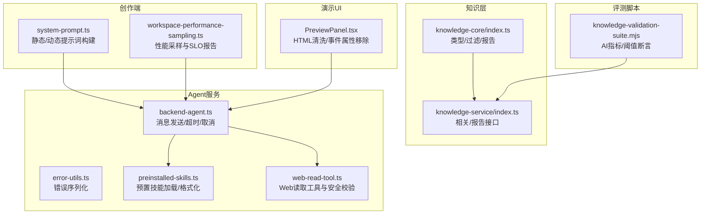
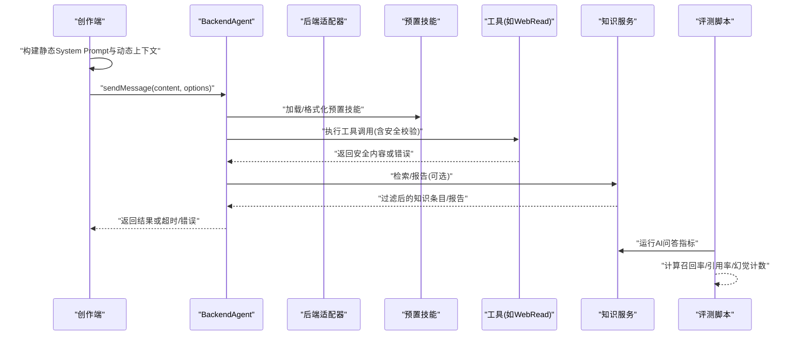
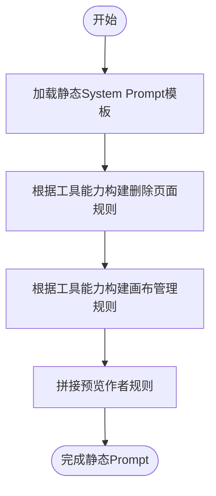
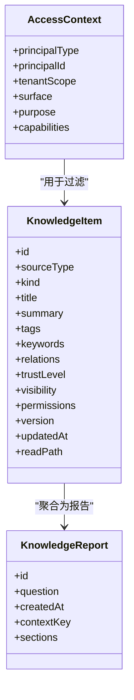
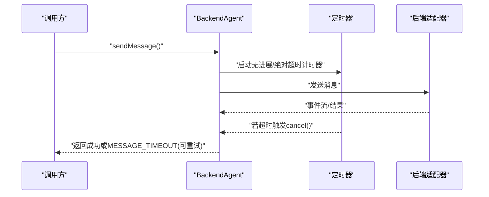
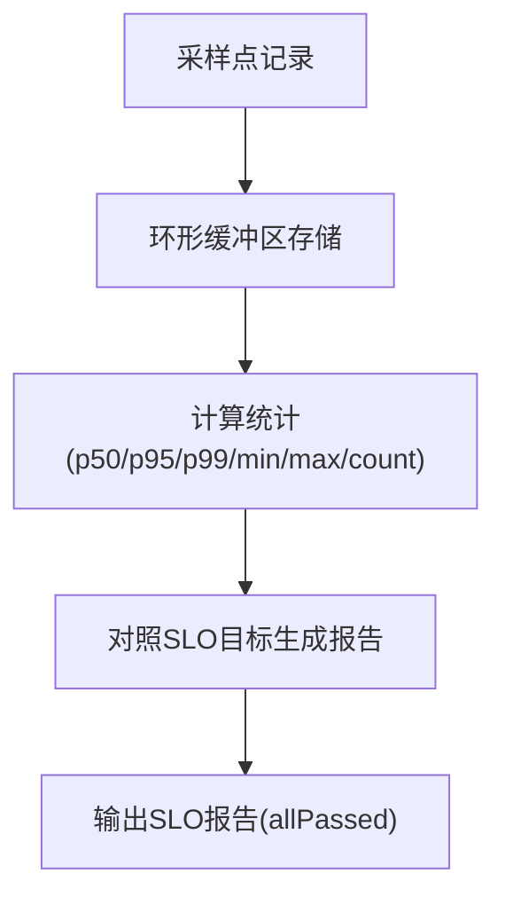
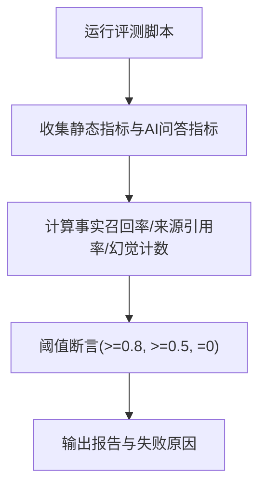
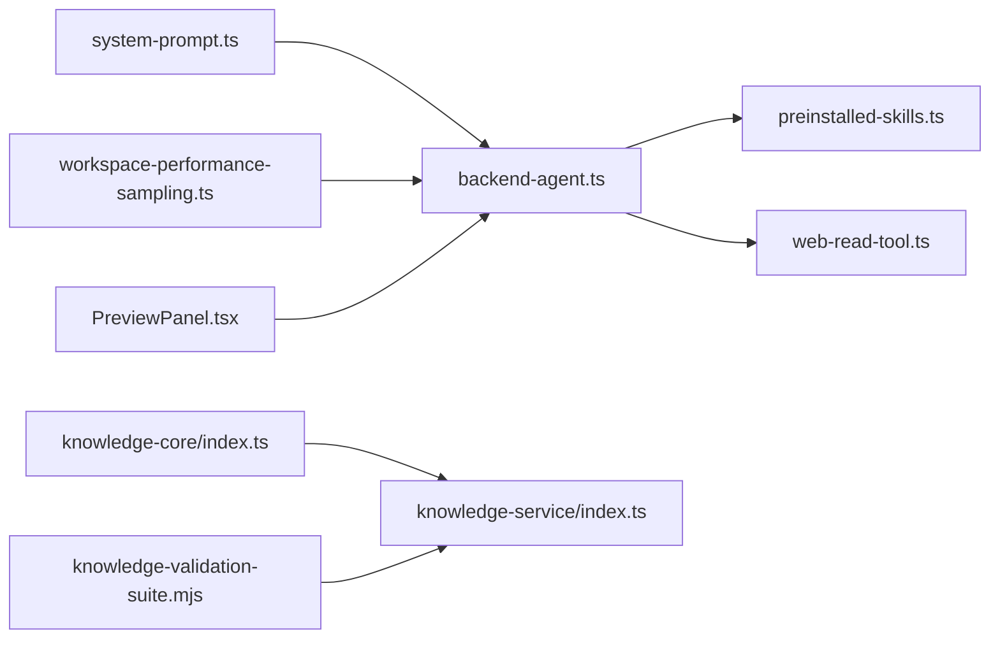

# 对话质量优化

<cite>
**本文引用的文件**   
- [packages/author-site/src/lib/agent/system-prompt.ts](file://packages/author-site/src/lib/agent/system-prompt.ts)
- [packages/knowledge-core/src/index.ts](file://packages/knowledge-core/src/index.ts)
- [packages/knowledge-service/src/index.ts](file://packages/knowledge-service/src/index.ts)
- [packages/agent-service/src/core/backend-agent.ts](file://packages/agent-service/src/core/backend-agent.ts)
- [packages/agent-service/src/utils/error-utils.ts](file://packages/agent-service/src/utils/error-utils.ts)
- [packages/agent-service/src/backends/preinstalled-skills.ts](file://packages/agent-service/src/backends/preinstalled-skills.ts)
- [packages/agent-service/src/backends/pi-tools/web-read-tool.ts](file://packages/agent-service/src/backends/pi-tools/web-read-tool.ts)
- [packages/demo-ui/src/PreviewPanel.tsx](file://packages/demo-ui/src/PreviewPanel.tsx)
- [packages/author-site/src/lib/workspace-performance-sampling.ts](file://packages/author-site/src/lib/workspace-performance-sampling.ts)
- [scripts/development/knowledge-validation-suite.mjs](file://scripts/development/knowledge-validation-suite.mjs)
</cite>

## 目录
1. [简介](#简介)
2. [项目结构](#项目结构)
3. [核心组件](#核心组件)
4. [架构总览](#架构总览)
5. [详细组件分析](#详细组件分析)
6. [依赖分析](#依赖分析)
7. [性能考虑](#性能考虑)
8. [故障排查指南](#故障排查指南)
9. [结论](#结论)
10. [附录](#附录)

## 简介
本技术文档围绕“对话质量优化系统”展开，聚焦以下能力：
- 提示词工程框架：模板管理、变量替换与动态生成
- 结果过滤机制：内容安全检查、敏感信息过滤与质量评分
- 错误重试策略：无进展超时保护、可重试标记与降级处理
- 智能补全：上下文感知、预测输入与历史推荐（概念性说明）
- 性能监控与分析：响应时间统计、成功率追踪与用户满意度评估（结合现有指标与可扩展建议）
- A/B 测试框架：不同优化策略的效果对比与持续改进（基于现有评测脚本与指标体系）

## 项目结构
仓库采用多包工作区组织，关键模块包括：
- 创作端（author-site）：负责构建 system prompt、动态上下文注入、工作区性能采样
- 知识核心与服务（knowledge-core、knowledge-service）：提供知识条目模型、访问控制、报告生成与检索接口
- Agent 服务（agent-service）：封装后端适配器、消息发送、超时与取消、预置技能加载、工具安全校验
- Demo UI（demo-ui）：预览面板的安全清理逻辑
- 开发脚本（scripts/development）：知识库验证套件与 AI 问答指标采集

图表来源
- [packages/author-site/src/lib/agent/system-prompt.ts:1-178](file://packages/author-site/src/lib/agent/system-prompt.ts#L1-L178)
- [packages/author-site/src/lib/workspace-performance-sampling.ts:201-279](file://packages/author-site/src/lib/workspace-performance-sampling.ts#L201-L279)
- [packages/knowledge-core/src/index.ts:1-200](file://packages/knowledge-core/src/index.ts#L1-L200)
- [packages/knowledge-service/src/index.ts:167-200](file://packages/knowledge-service/src/index.ts#L167-L200)
- [packages/agent-service/src/core/backend-agent.ts:1-376](file://packages/agent-service/src/core/backend-agent.ts#L1-L376)
- [packages/agent-service/src/utils/error-utils.ts:1-134](file://packages/agent-service/src/utils/error-utils.ts#L1-L134)
- [packages/agent-service/src/backends/preinstalled-skills.ts:56-104](file://packages/agent-service/src/backends/preinstalled-skills.ts#L56-L104)
- [packages/agent-service/src/backends/pi-tools/web-read-tool.ts:53-89](file://packages/agent-service/src/backends/pi-tools/web-read-tool.ts#L53-L89)
- [packages/demo-ui/src/PreviewPanel.tsx:129-168](file://packages/demo-ui/src/PreviewPanel.tsx#L129-L168)
- [scripts/development/knowledge-validation-suite.mjs:418-540](file://scripts/development/knowledge-validation-suite.mjs#L418-L540)

章节来源
- [packages/author-site/src/lib/agent/system-prompt.ts:1-178](file://packages/author-site/src/lib/agent/system-prompt.ts#L1-L178)
- [packages/knowledge-core/src/index.ts:1-200](file://packages/knowledge-core/src/index.ts#L1-L200)
- [packages/knowledge-service/src/index.ts:167-200](file://packages/knowledge-service/src/index.ts#L167-L200)
- [packages/agent-service/src/core/backend-agent.ts:1-376](file://packages/agent-service/src/core/backend-agent.ts#L1-L376)
- [packages/agent-service/src/utils/error-utils.ts:1-134](file://packages/agent-service/src/utils/error-utils.ts#L1-L134)
- [packages/agent-service/src/backends/preinstalled-skills.ts:56-104](file://packages/agent-service/src/backends/preinstalled-skills.ts#L56-L104)
- [packages/agent-service/src/backends/pi-tools/web-read-tool.ts:53-89](file://packages/agent-service/src/backends/pi-tools/web-read-tool.ts#L53-L89)
- [packages/demo-ui/src/PreviewPanel.tsx:129-168](file://packages/demo-ui/src/PreviewPanel.tsx#L129-L168)
- [scripts/development/knowledge-validation-suite.mjs:418-540](file://scripts/development/knowledge-validation-suite.mjs#L418-L540)

## 核心组件
- 提示词工程框架
  - 静态 System Prompt 构建：根据可用工具能力动态插入删除页面规则与画布管理规则，并拼接预览作者规则。
  - 动态 L3 上下文前缀：每次发送消息前渲染工作区状态模板，注入项目名称、配置状态、页面清单、画布文本摘要等。
  - 记忆与索引前缀：将 memory.md 与知识库索引格式化为前缀，增强跨会话与检索上下文。
- 结果过滤机制
  - 知识条目访问控制：按主体类型、可见性、能力集进行过滤与排序。
  - 报告生成：汇总可用材料、信任等级、来源路径、缺失项与风险项。
  - 前端输出清洗：移除危险元素与事件属性，阻断 javascript: 协议链接。
- 错误重试策略
  - 无进展超时与绝对超时：在长时间无事件时自动取消并返回可重试错误码。
  - 错误序列化：仅保留安全字段并截断过长字符串，避免泄露敏感信息。
- 预置技能与工具安全
  - 预置技能加载与元数据解析：从文件头提取名称、描述等信息，按需格式化到提示词。
  - Web 读取工具：限制内网地址、非文本内容与大小，设置超时与重定向校验。
- 性能监控与分析
  - 工作区性能采样器：记录队列等待、提交延迟、远程更新延迟、草稿预览延迟、投影确认延迟、重连收敛时间与规范滞后等指标，并生成 SLO 报告。
- 评测与A/B基础
  - 知识库验证套件：收集静态指标与AI问答指标，计算事实召回率、来源引用率与幻觉标记数量，并提供阈值断言。

章节来源
- [packages/author-site/src/lib/agent/system-prompt.ts:1-178](file://packages/author-site/src/lib/agent/system-prompt.ts#L1-L178)
- [packages/knowledge-core/src/index.ts:326-393](file://packages/knowledge-core/src/index.ts#L326-L393)
- [packages/demo-ui/src/PreviewPanel.tsx:129-168](file://packages/demo-ui/src/PreviewPanel.tsx#L129-L168)
- [packages/agent-service/src/core/backend-agent.ts:71-229](file://packages/agent-service/src/core/backend-agent.ts#L71-L229)
- [packages/agent-service/src/utils/error-utils.ts:1-134](file://packages/agent-service/src/utils/error-utils.ts#L1-L134)
- [packages/agent-service/src/backends/preinstalled-skills.ts:56-104](file://packages/agent-service/src/backends/preinstalled-skills.ts#L56-L104)
- [packages/agent-service/src/backends/pi-tools/web-read-tool.ts:53-89](file://packages/agent-service/src/backends/pi-tools/web-read-tool.ts#L53-L89)
- [packages/author-site/src/lib/workspace-performance-sampling.ts:201-279](file://packages/author-site/src/lib/workspace-performance-sampling.ts#L201-L279)
- [scripts/development/knowledge-validation-suite.mjs:418-540](file://scripts/development/knowledge-validation-suite.mjs#L418-L540)

## 架构总览
下图展示从创作端到 Agent 服务、知识服务与评测脚本的整体交互关系。

图表来源
- [packages/author-site/src/lib/agent/system-prompt.ts:1-178](file://packages/author-site/src/lib/agent/system-prompt.ts#L1-L178)
- [packages/agent-service/src/core/backend-agent.ts:71-229](file://packages/agent-service/src/core/backend-agent.ts#L71-L229)
- [packages/agent-service/src/backends/preinstalled-skills.ts:56-104](file://packages/agent-service/src/backends/preinstalled-skills.ts#L56-L104)
- [packages/agent-service/src/backends/pi-tools/web-read-tool.ts:53-89](file://packages/agent-service/src/backends/pi-tools/web-read-tool.ts#L53-L89)
- [packages/knowledge-service/src/index.ts:167-200](file://packages/knowledge-service/src/index.ts#L167-L200)
- [scripts/development/knowledge-validation-suite.mjs:418-540](file://scripts/development/knowledge-validation-suite.mjs#L418-L540)

## 详细组件分析

### 提示词工程框架
- 静态 System Prompt 构建
  - 根据工具能力分支生成“删除页面”和“画布管理”规则，确保不要求调用不存在工具。
  - 拼接预览作者规则，统一创作端行为约束。
- 动态上下文前缀
  - 使用模板渲染工作区状态，包含项目名称、配置状态、页面清单与画布文本摘要。
  - 支持记忆与索引前缀注入，提升跨会话与检索效果。
- 复杂度与扩展性
  - 模板渲染为线性替换，时间复杂度 O(n)，n 为变量数；易于扩展新变量与新规则块。

图表来源
- [packages/author-site/src/lib/agent/system-prompt.ts:133-142](file://packages/author-site/src/lib/agent/system-prompt.ts#L133-L142)

章节来源
- [packages/author-site/src/lib/agent/system-prompt.ts:1-178](file://packages/author-site/src/lib/agent/system-prompt.ts#L1-L178)

### 结果过滤机制
- 知识条目过滤
  - 依据访问上下文（主体类型、租户范围、表面、目的、能力集）与可见性进行过滤，并按权威度排序。
- 报告生成
  - 汇总摘要、材料列表、来源、信任等级、作用域、原始阅读路径、缺失项与风险项。
- 前端输出清洗
  - 移除 script/iframe/embed/object 等危险元素，清除事件属性与 javascript: 协议链接。

图表来源
- [packages/knowledge-core/src/index.ts:80-124](file://packages/knowledge-core/src/index.ts#L80-L124)
- [packages/knowledge-core/src/index.ts:326-393](file://packages/knowledge-core/src/index.ts#L326-L393)

章节来源
- [packages/knowledge-core/src/index.ts:326-393](file://packages/knowledge-core/src/index.ts#L326-L393)
- [packages/knowledge-service/src/index.ts:167-200](file://packages/knowledge-service/src/index.ts#L167-L200)
- [packages/demo-ui/src/PreviewPanel.tsx:129-168](file://packages/demo-ui/src/PreviewPanel.tsx#L129-L168)

### 错误重试策略
- 无进展超时与绝对超时
  - 监听 stream/tool_call/tool_call_update 活动事件重置无进展计时器；超过绝对时限则取消并返回 MESSAGE_TIMEOUT。
  - 超时后 busy 恢复为 false，状态回到 ready，保证后续请求可用。
- 错误序列化
  - 仅复制安全字段（name/message/code/status/type/errno/syscall/path/url/method），截断超长字符串，避免泄露敏感信息。
- 降级处理
  - 当工具不可用或后端不支持某功能时，返回明确错误码与可重试标记，上层可进行降级或提示。

图表来源
- [packages/agent-service/src/core/backend-agent.ts:71-229](file://packages/agent-service/src/core/backend-agent.ts#L71-L229)
- [packages/agent-service/src/utils/error-utils.ts:1-134](file://packages/agent-service/src/utils/error-utils.ts#L1-L134)

章节来源
- [packages/agent-service/src/core/backend-agent.ts:71-229](file://packages/agent-service/src/core/backend-agent.ts#L71-L229)
- [packages/agent-service/src/utils/error-utils.ts:1-134](file://packages/agent-service/src/utils/error-utils.ts#L1-L134)

### 智能补全（概念性说明）
- 上下文感知：利用动态上下文前缀与工作区状态，为补全提供当前项目、页面清单与画布摘要。
- 预测输入：基于历史对话与工具调用模式，推测下一步操作（如删除页面、整理画布）。
- 历史推荐：结合知识库索引与记忆前缀，推荐相关文档与最佳实践。
- 注意：本节为概念性设计，未直接映射具体源码实现。

[本节为概念性说明，无需图表来源]

### 性能监控与分析
- 指标采集
  - 队列等待、提交延迟、远程更新延迟、草稿预览延迟、投影确认延迟、重连收敛时间、规范滞后等。
- SLO 报告
  - 对每个指标计算 p50/p95/p99/min/max/count，并与目标阈值比较，生成通过/失败状态。
- 可扩展建议
  - 增加响应时间直方图、成功率追踪、用户满意度评分（如点赞/踩、任务完成率）。

图表来源
- [packages/author-site/src/lib/workspace-performance-sampling.ts:201-279](file://packages/author-site/src/lib/workspace-performance-sampling.ts#L201-L279)

章节来源
- [packages/author-site/src/lib/workspace-performance-sampling.ts:201-279](file://packages/author-site/src/lib/workspace-performance-sampling.ts#L201-L279)

### A/B 测试框架（基于现有评测脚本）
- 指标维度
  - 静态覆盖：页面数、圆形页面存在性与预览形状、知识文档数量、画布文档节点数量。
  - AI 使用效果：显式检索题的事实召回率与来源引用率；客服口径题的场景事实召回率；幻觉标记计数。
- 阈值断言
  - 平均事实召回率不低于 0.8；显式来源引用率不低于 0.5；幻觉标记数量为 0。
- 扩展建议
  - 引入分组（对照组/实验组）、分流策略、显著性检验与长期趋势分析。

图表来源
- [scripts/development/knowledge-validation-suite.mjs:418-540](file://scripts/development/knowledge-validation-suite.mjs#L418-L540)

章节来源
- [scripts/development/knowledge-validation-suite.mjs:418-540](file://scripts/development/knowledge-validation-suite.mjs#L418-L540)

## 依赖分析
- 组件耦合
  - 创作端依赖提示词构建与性能采样；Agent 服务依赖预置技能与工具安全；知识服务依赖核心类型与过滤逻辑。
- 外部依赖
  - Web 读取工具依赖网络访问与环境变量控制；Demo UI 依赖 DOM 操作进行安全清洗。
- 潜在循环依赖
  - 当前未见明显循环依赖；各模块职责清晰，边界明确。

图表来源
- [packages/author-site/src/lib/agent/system-prompt.ts:1-178](file://packages/author-site/src/lib/agent/system-prompt.ts#L1-L178)
- [packages/author-site/src/lib/workspace-performance-sampling.ts:201-279](file://packages/author-site/src/lib/workspace-performance-sampling.ts#L201-L279)
- [packages/knowledge-core/src/index.ts:1-200](file://packages/knowledge-core/src/index.ts#L1-L200)
- [packages/knowledge-service/src/index.ts:167-200](file://packages/knowledge-service/src/index.ts#L167-L200)
- [packages/agent-service/src/core/backend-agent.ts:1-376](file://packages/agent-service/src/core/backend-agent.ts#L1-L376)
- [packages/agent-service/src/backends/preinstalled-skills.ts:56-104](file://packages/agent-service/src/backends/preinstalled-skills.ts#L56-L104)
- [packages/agent-service/src/backends/pi-tools/web-read-tool.ts:53-89](file://packages/agent-service/src/backends/pi-tools/web-read-tool.ts#L53-L89)
- [packages/demo-ui/src/PreviewPanel.tsx:129-168](file://packages/demo-ui/src/PreviewPanel.tsx#L129-L168)
- [scripts/development/knowledge-validation-suite.mjs:418-540](file://scripts/development/knowledge-validation-suite.mjs#L418-L540)

章节来源
- [packages/author-site/src/lib/agent/system-prompt.ts:1-178](file://packages/author-site/src/lib/agent/system-prompt.ts#L1-L178)
- [packages/author-site/src/lib/workspace-performance-sampling.ts:201-279](file://packages/author-site/src/lib/workspace-performance-sampling.ts#L201-L279)
- [packages/knowledge-core/src/index.ts:1-200](file://packages/knowledge-core/src/index.ts#L1-L200)
- [packages/knowledge-service/src/index.ts:167-200](file://packages/knowledge-service/src/index.ts#L167-L200)
- [packages/agent-service/src/core/backend-agent.ts:1-376](file://packages/agent-service/src/core/backend-agent.ts#L1-L376)
- [packages/agent-service/src/backends/preinstalled-skills.ts:56-104](file://packages/agent-service/src/backends/preinstalled-skills.ts#L56-L104)
- [packages/agent-service/src/backends/pi-tools/web-read-tool.ts:53-89](file://packages/agent-service/src/backends/pi-tools/web-read-tool.ts#L53-L89)
- [packages/demo-ui/src/PreviewPanel.tsx:129-168](file://packages/demo-ui/src/PreviewPanel.tsx#L129-L168)
- [scripts/development/knowledge-validation-suite.mjs:418-540](file://scripts/development/knowledge-validation-suite.mjs#L418-L540)

## 性能考虑
- 提示词构建
  - 模板渲染为线性替换，开销较低；建议在高频场景缓存已渲染的静态部分。
- 知识过滤
  - 过滤与排序为线性扫描，适合中等规模条目；大规模时可引入索引与分页。
- Agent 超时
  - 无进展与绝对超时保障资源释放；建议在上层实现指数退避与熔断器以应对瞬时抖动。
- 性能采样
  - 环形缓冲区降低内存占用；SLO 报告便于快速定位瓶颈。

[本节提供一般性指导，无需特定文件分析]

## 故障排查指南
- 常见错误码
  - MESSAGE_TIMEOUT：AI 处理超时，已自动取消，可重试或切换模型。
  - MESSAGE_SEND_ERROR：发送失败，携带错误信息与调试元数据。
- 排查步骤
  - 检查 Agent 健康状态与日志；确认后端适配器是否支持所需功能。
  - 查看错误序列化输出，关注 message/code/status 等安全字段。
  - 对于 Web 读取工具，确认 URL 合法性、内容类型与大小限制。
- 已知问题与缓解
  - 空响应调试：返回 emptyResponseDebug 元数据辅助定位。
  - 前端输出安全：确保预览面板已执行 HTML 清洗与事件属性移除。

章节来源
- [packages/agent-service/src/core/backend-agent.ts:182-229](file://packages/agent-service/src/core/backend-agent.ts#L182-L229)
- [packages/agent-service/src/utils/error-utils.ts:62-134](file://packages/agent-service/src/utils/error-utils.ts#L62-L134)
- [packages/agent-service/src/backends/pi-tools/web-read-tool.ts:53-89](file://packages/agent-service/src/backends/pi-tools/web-read-tool.ts#L53-L89)
- [packages/demo-ui/src/PreviewPanel.tsx:129-168](file://packages/demo-ui/src/PreviewPanel.tsx#L129-L168)

## 结论
该对话质量优化系统在提示词工程、结果过滤、错误处理、性能监控与评测方面具备扎实的实现基础。通过动态上下文注入、严格的访问控制与工具安全校验，有效提升了对话质量与安全性。建议在未来引入更完善的 A/B 测试框架与用户满意度指标，以支撑持续优化与规模化演进。

[本节为总结性内容，无需特定文件分析]

## 附录
- 术语表
  - System Prompt：发送给模型的静态指令，定义角色与行为规范。
  - 动态上下文：每次请求前注入的工作区状态与相关信息。
  - 访问控制：基于主体、可见性与能力的权限判定。
  - SLO：服务等级目标，用于衡量性能达标情况。
- 参考路径
  - 提示词构建：[packages/author-site/src/lib/agent/system-prompt.ts](file://packages/author-site/src/lib/agent/system-prompt.ts)
  - 知识过滤与报告：[packages/knowledge-core/src/index.ts](file://packages/knowledge-core/src/index.ts), [packages/knowledge-service/src/index.ts](file://packages/knowledge-service/src/index.ts)
  - Agent 超时与错误：[packages/agent-service/src/core/backend-agent.ts](file://packages/agent-service/src/core/backend-agent.ts), [packages/agent-service/src/utils/error-utils.ts](file://packages/agent-service/src/utils/error-utils.ts)
  - 预置技能与工具安全：[packages/agent-service/src/backends/preinstalled-skills.ts](file://packages/agent-service/src/backends/preinstalled-skills.ts), [packages/agent-service/src/backends/pi-tools/web-read-tool.ts](file://packages/agent-service/src/backends/pi-tools/web-read-tool.ts)
  - 性能采样与SLO：[packages/author-site/src/lib/workspace-performance-sampling.ts](file://packages/author-site/src/lib/workspace-performance-sampling.ts)
  - 评测脚本与指标：[scripts/development/knowledge-validation-suite.mjs](file://scripts/development/knowledge-validation-suite.mjs)