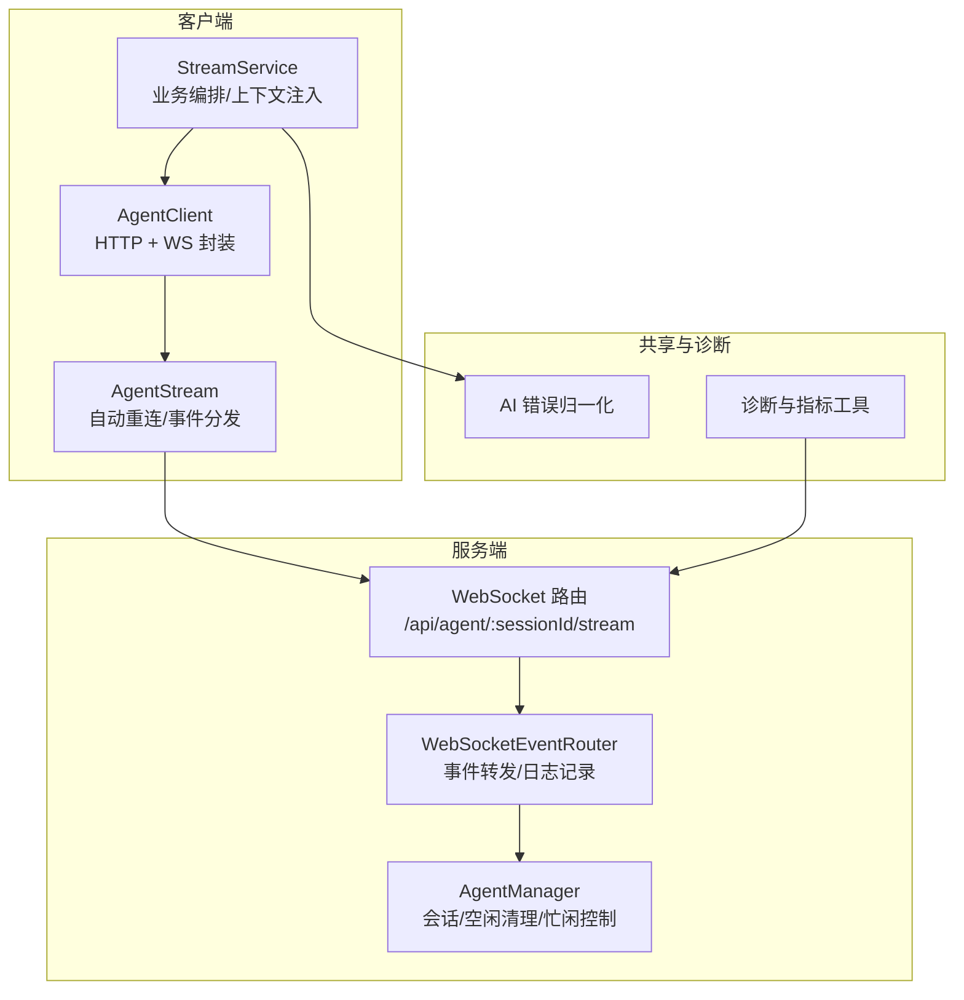
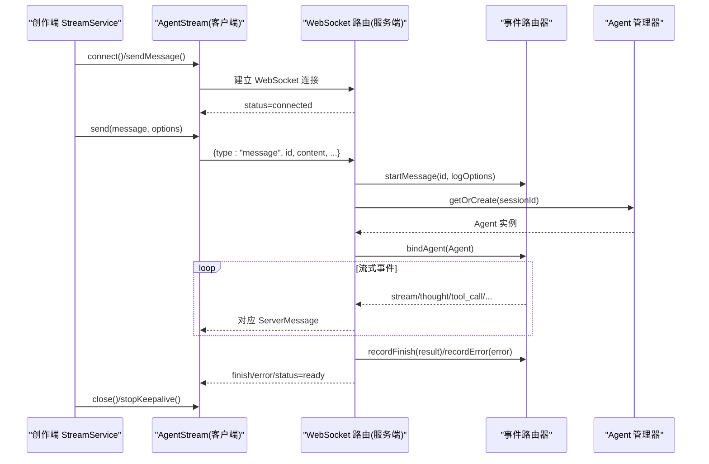
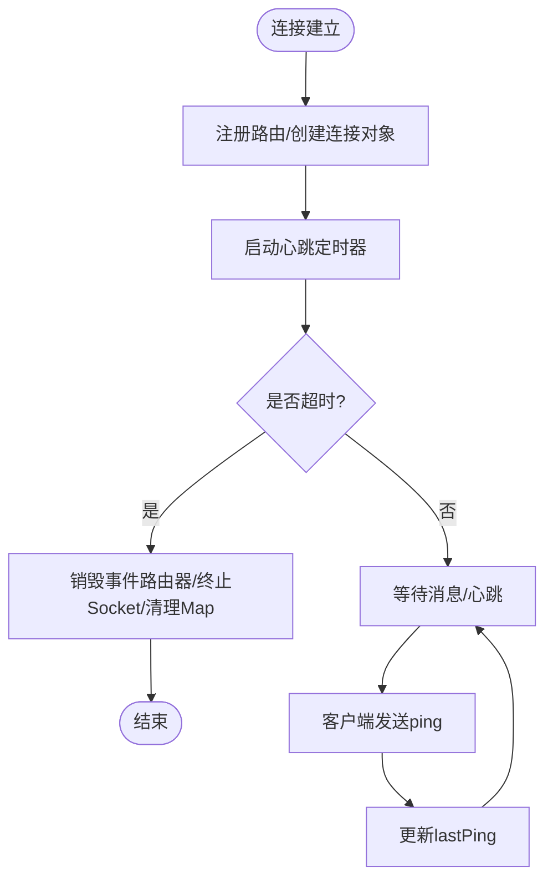
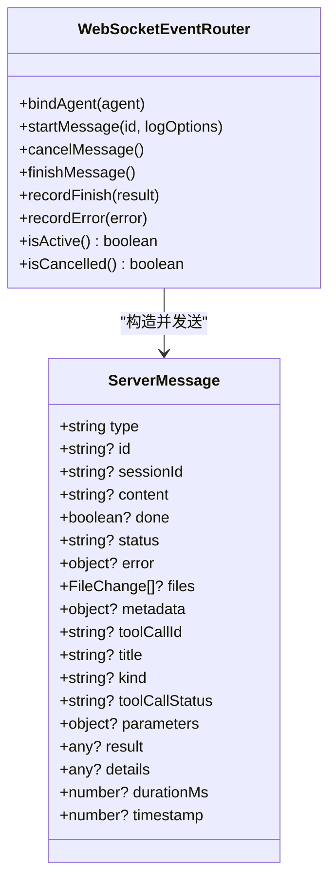
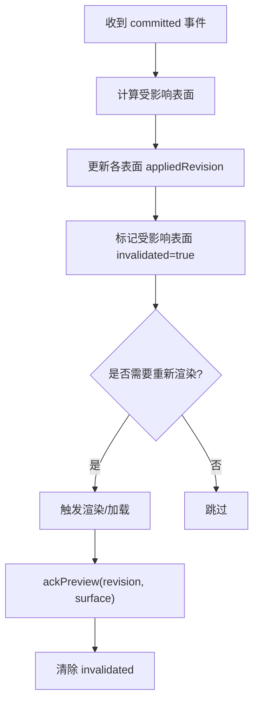
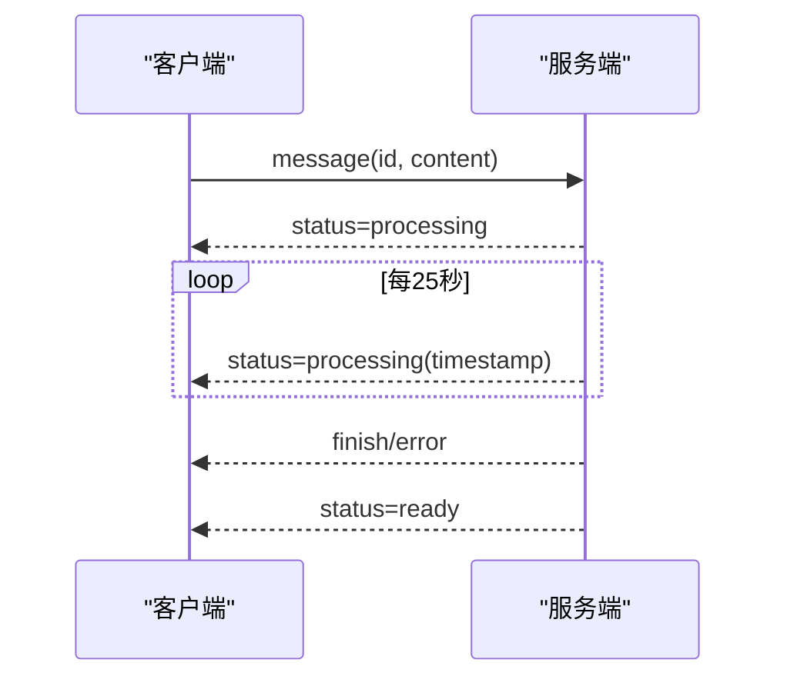
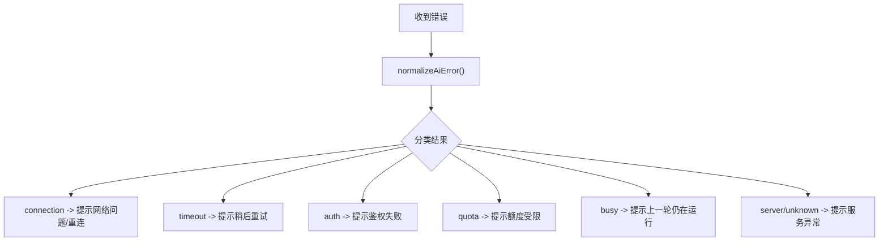
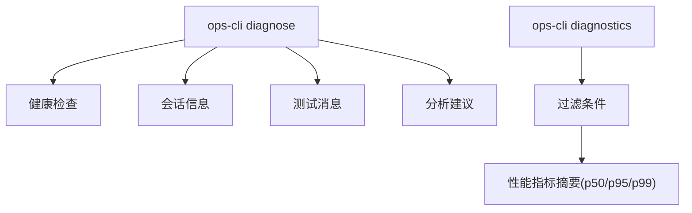
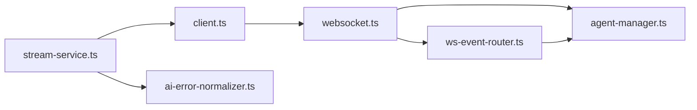

# 流式响应处理

<cite>
**本文引用的文件**   
- [packages/agent-service/src/routes/websocket.ts](file://packages/agent-service/src/routes/websocket.ts)
- [packages/agent-service/src/routes/ws-event-router.ts](file://packages/agent-service/src/routes/ws-event-router.ts)
- [packages/agent-service/src/core/agent-manager.ts](file://packages/agent-service/src/core/agent-manager.ts)
- [packages/agent-client/src/client.ts](file://packages/agent-client/src/client.ts)
- [packages/author-site/src/components/ai-elements/chat/services/stream-service.ts](file://packages/author-site/src/components/ai-elements/chat/services/stream-service.ts)
- [packages/author-site/src/lib/preview-projection-tracker.ts](file://packages/author-site/src/lib/preview-projection-tracker.ts)
- [packages/shared/src/ai-error-normalizer.ts](file://packages/shared/src/ai-error-normalizer.ts)
- [OPS/CLI/src/commands/diagnose.ts](file://OPS/CLI/src/commands/diagnose.ts)
- [OPS/CLI/src/commands/diagnostics.ts](file://OPS/CLI/src/commands/diagnostics.ts)
- [scripts/check-workspace-authority-guards.mjs](file://scripts/check-workspace-authority-guards.mjs)
</cite>

## 目录
1. [简介](#简介)
2. [项目结构](#项目结构)
3. [核心组件](#核心组件)
4. [架构总览](#架构总览)
5. [详细组件分析](#详细组件分析)
6. [依赖关系分析](#依赖关系分析)
7. [性能考量](#性能考量)
8. [故障排查指南](#故障排查指南)
9. [结论](#结论)
10. [附录](#附录)

## 简介
本技术文档围绕“流式响应处理系统”展开，覆盖以下关键主题：
- WebSocket 连接建立与维护：包括连接池管理、心跳检测与自动重连策略。
- 流式数据传输协议：消息分片、序列号管理与乱序处理机制。
- 实时渲染引擎：增量更新、虚拟滚动与性能优化。
- 进度反馈系统：处理状态显示、时间预估与用户交互响应。
- 错误处理与异常恢复：网络中断、数据损坏与服务降级。
- 调试工具与监控指标：帮助开发者诊断流式通信问题。

## 项目结构
本项目采用多包（monorepo）组织方式，流式响应相关代码主要分布在以下位置：
- 服务端（Agent Service）：WebSocket 路由、事件路由器、会话与 Agent 生命周期管理。
- 客户端（Agent Client）：浏览器端 WebSocket 封装、自动重连与事件分发。
- 创作端（Author Site）：StreamService 对上层业务进行编排，结合预览投影追踪器实现增量渲染。
- 共享库（Shared）：错误归一化、诊断指标等通用能力。
- CLI 诊断工具：提供健康检查、诊断报告与指标查询。

图表来源
- [packages/agent-service/src/routes/websocket.ts:134-183](file://packages/agent-service/src/routes/websocket.ts#L134-L183)
- [packages/agent-service/src/routes/ws-event-router.ts:113-127](file://packages/agent-service/src/routes/ws-event-router.ts#L113-L127)
- [packages/agent-service/src/core/agent-manager.ts:44-52](file://packages/agent-service/src/core/agent-manager.ts#L44-L52)
- [packages/agent-client/src/client.ts:279-338](file://packages/agent-client/src/client.ts#L279-L338)
- [packages/author-site/src/components/ai-elements/chat/services/stream-service.ts:164-202](file://packages/author-site/src/components/ai-elements/chat/services/stream-service.ts#L164-L202)
- [packages/shared/src/ai-error-normalizer.ts:140-156](file://packages/shared/src/ai-error-normalizer.ts#L140-L156)
- [OPS/CLI/src/commands/diagnostics.ts:768-788](file://OPS/CLI/src/commands/diagnostics.ts#L768-L788)

章节来源
- [packages/agent-service/src/routes/websocket.ts:134-183](file://packages/agent-service/src/routes/websocket.ts#L134-L183)
- [packages/agent-client/src/client.ts:279-338](file://packages/agent-client/src/client.ts#L279-L338)
- [packages/author-site/src/components/ai-elements/chat/services/stream-service.ts:164-202](file://packages/author-site/src/components/ai-elements/chat/services/stream-service.ts#L164-L202)

## 核心组件
- WebSocket 路由与连接管理
  - 注册 /api/agent/:sessionId/stream 路由，维护 connections Map，周期性心跳检测并关闭超时连接。
  - 支持 ping/pong、消息发送、取消、模型切换、权限与用户选择响应等。
- 事件路由器
  - 将后端 Agent 事件统一转换为前端可消费的 ServerMessage，支持开始/结束/取消/错误记录与运行日志。
- Agent 管理器
  - 负责 Agent 实例的创建、复用、配置变更重建、忙闲控制与空闲清理；对长时间处于 processing 状态的 Agent 强制回收。
- 客户端流式封装
  - 提供自动重连、事件分发、ping 保活、发送消息与取消等能力。
- 创作端 StreamService
  - 在发送前注入 L2/L3/L4/L5 上下文与静态 system prompt，管理 keepalive、finish 兜底与错误分类。
- 预览投影追踪器
  - 跟踪各预览表面的已应用 revision 与失效状态，支持从快照重置与 ack 上报。
- 错误归一化与诊断
  - 将底层错误归类为 connection/timeout/auth/quota/busy/cancelled/server/unknown，并提供用户友好提示。
  - CLI 诊断与健康检查，聚合指标与过滤查询。

章节来源
- [packages/agent-service/src/routes/websocket.ts:122-132](file://packages/agent-service/src/routes/websocket.ts#L122-L132)
- [packages/agent-service/src/routes/ws-event-router.ts:113-127](file://packages/agent-service/src/routes/ws-event-router.ts#L113-L127)
- [packages/agent-service/src/core/agent-manager.ts:204-237](file://packages/agent-service/src/core/agent-manager.ts#L204-L237)
- [packages/agent-client/src/client.ts:279-338](file://packages/agent-client/src/client.ts#L279-L338)
- [packages/author-site/src/components/ai-elements/chat/services/stream-service.ts:362-376](file://packages/author-site/src/components/ai-elements/chat/services/stream-service.ts#L362-L376)
- [packages/author-site/src/lib/preview-projection-tracker.ts:92-104](file://packages/author-site/src/lib/preview-projection-tracker.ts#L92-L104)
- [packages/shared/src/ai-error-normalizer.ts:140-156](file://packages/shared/src/ai-error-normalizer.ts#L140-L156)
- [OPS/CLI/src/commands/diagnostics.ts:768-788](file://OPS/CLI/src/commands/diagnostics.ts#L768-L788)

## 架构总览
下图展示了从客户端到服务端的完整流式调用链路与关键状态流转。

图表来源
- [packages/author-site/src/components/ai-elements/chat/services/stream-service.ts:235-298](file://packages/author-site/src/components/ai-elements/chat/services/stream-service.ts#L235-L298)
- [packages/agent-client/src/client.ts:340-364](file://packages/agent-client/src/client.ts#L340-L364)
- [packages/agent-service/src/routes/websocket.ts:208-354](file://packages/agent-service/src/routes/websocket.ts#L208-L354)
- [packages/agent-service/src/routes/ws-event-router.ts:149-161](file://packages/agent-service/src/routes/ws-event-router.ts#L149-L161)
- [packages/agent-service/src/core/agent-manager.ts:62-125](file://packages/agent-service/src/core/agent-manager.ts#L62-L125)

## 详细组件分析

### WebSocket 连接建立与维护
- 连接建立
  - 通过 Fastify 注册 WebSocket 路由，解析 sessionId，生成唯一 connectionId，初始化事件路由器与活动连接对象，加入全局 connections Map。
- 心跳检测
  - 定时任务遍历 connections，若 lastPing 超过阈值则销毁事件路由器并终止 socket，同时从 Map 中移除。
- 保活与超时
  - 客户端定期发送 ping，服务端收到后更新 lastPing；服务端也周期性发送 status=processing 作为进度心跳。
- 自动重连
  - 客户端在 onclose 时按指数退避尝试重连，最多固定次数；也可由上层主动停止重连。

图表来源
- [packages/agent-service/src/routes/websocket.ts:134-183](file://packages/agent-service/src/routes/websocket.ts#L134-L183)
- [packages/agent-service/src/routes/websocket.ts:122-132](file://packages/agent-service/src/routes/websocket.ts#L122-L132)
- [packages/agent-client/src/client.ts:314-338](file://packages/agent-client/src/client.ts#L314-L338)

章节来源
- [packages/agent-service/src/routes/websocket.ts:134-183](file://packages/agent-service/src/routes/websocket.ts#L134-L183)
- [packages/agent-service/src/routes/websocket.ts:122-132](file://packages/agent-service/src/routes/websocket.ts#L122-L132)
- [packages/agent-client/src/client.ts:314-338](file://packages/agent-client/src/client.ts#L314-L338)

### 流式数据传输协议
- 消息类型
  - 客户端：message、cancel、ping、resume、set_model、get_models、permission_response、user_choice_response、console_data。
  - 服务端：stream、thought、plan、tool_call、tool_call_update、error、finish、status、pong、permission_request、user_choice_request、models。
- 消息分片与序列号
  - 每条消息携带 id（客户端生成或服务端生成），用于关联请求与响应；服务端使用 startMessage/finishMessage 包裹一次完整的消息生命周期。
- 乱序处理
  - 当前实现以顺序事件为主，未显式引入序列号排序；建议在上层根据 id 与 timestamp 做幂等与去重处理，必要时扩展为带序号的分片协议。
- 进度心跳
  - 服务端周期性发送 status=processing 并附带时间戳，客户端据此展示“正在处理”。

图表来源
- [packages/agent-service/src/routes/ws-event-router.ts:22-104](file://packages/agent-service/src/routes/ws-event-router.ts#L22-L104)
- [packages/agent-service/src/routes/ws-event-router.ts:113-127](file://packages/agent-service/src/routes/ws-event-router.ts#L113-L127)

章节来源
- [packages/agent-service/src/routes/websocket.ts:208-354](file://packages/agent-service/src/routes/websocket.ts#L208-L354)
- [packages/agent-service/src/routes/ws-event-router.ts:149-161](file://packages/agent-service/src/routes/ws-event-router.ts#L149-L161)

### 实时渲染引擎（增量更新与虚拟滚动）
- 增量更新
  - 基于 PreviewProjectionTracker 维护每个预览表面（active-preview、canvas-preview、screenshot）的 appliedRevision 与 invalidated 标志；当 committed 事件到达时，依据路径策略标记受影响表面为失效。
- 失效策略
  - 默认策略：任何资源变更使 active-preview 失效；包含 canvas/sketch 的路径变更使 canvas-preview 失效；screenshot 不自动失效。
- 确认与重试
  - 表面完成渲染后调用 ackPreview 更新 appliedRevision 并清除失效标志；失败时 failPreview 保持失效以便外部重试。
- 虚拟滚动与渲染调度
  - 通过计算可见页面与最近访问的 iframe，动态分配 active/sleeping 模式，限制活跃与休眠的 iframe 数量，降低内存与渲染开销。

图表来源
- [packages/author-site/src/lib/preview-projection-tracker.ts:126-143](file://packages/author-site/src/lib/preview-projection-tracker.ts#L126-L143)
- [packages/author-site/src/lib/preview-projection-tracker.ts:153-167](file://packages/author-site/src/lib/preview-projection-tracker.ts#L153-L167)
- [packages/author-site/src/lib/preview-projection-tracker.ts:173-178](file://packages/author-site/src/lib/preview-projection-tracker.ts#L173-L178)

章节来源
- [packages/author-site/src/lib/preview-projection-tracker.ts:92-104](file://packages/author-site/src/lib/preview-projection-tracker.ts#L92-L104)
- [packages/author-site/src/lib/preview-projection-tracker.ts:126-143](file://packages/author-site/src/lib/preview-projection-tracker.ts#L126-L143)
- [packages/author-site/src/lib/preview-projection-tracker.ts:153-167](file://packages/author-site/src/lib/preview-projection-tracker.ts#L153-L167)

### 进度反馈系统
- 处理状态显示
  - 服务端在消息开始时发送 status=processing，并在处理过程中周期性发送带时间戳的 status=processing；完成后发送 finish 或 error，最后返回 status=ready。
- 时间预估
  - 可通过统计历史消息的 durationMs 与 token 数估算剩余时间；当前协议已暴露 durationMs 字段，便于上层计算。
- 用户交互响应
  - 支持 cancel 取消当前消息；支持 permission_response 与 user_choice_response 进行交互式决策。

图表来源
- [packages/agent-service/src/routes/websocket.ts:333-354](file://packages/agent-service/src/routes/websocket.ts#L333-L354)
- [packages/agent-service/src/routes/websocket.ts:425-456](file://packages/agent-service/src/routes/websocket.ts#L425-L456)

章节来源
- [packages/agent-service/src/routes/websocket.ts:333-354](file://packages/agent-service/src/routes/websocket.ts#L333-L354)
- [packages/agent-service/src/routes/websocket.ts:425-456](file://packages/agent-service/src/routes/websocket.ts#L425-L456)

### 错误处理与异常恢复
- 错误分类
  - 使用 AI 错误归一化工具将错误分为 connection/timeout/auth/quota/busy/cancelled/server/unknown，并给出用户可读提示。
- 网络中断
  - 客户端自动重连（指数退避），上层可监听 onConnectionError 并提示用户；服务端心跳与超时保护避免僵尸连接。
- 数据损坏
  - 客户端在 onmessage 中捕获 JSON 解析错误并上报 PARSE_ERROR；服务端校验消息格式并返回 INVALID_PARAMS。
- 服务降级
  - 当 Agent busy 时返回 AGENT_BUSY 错误码，提示用户等待或取消；当消息处理超时时返回 MESSAGE_TIMEOUT 并自动取消。

图表来源
- [packages/shared/src/ai-error-normalizer.ts:46-114](file://packages/shared/src/ai-error-normalizer.ts#L46-L114)
- [packages/shared/src/ai-error-normalizer.ts:140-156](file://packages/shared/src/ai-error-normalizer.ts#L140-L156)

章节来源
- [packages/shared/src/ai-error-normalizer.ts:46-114](file://packages/shared/src/ai-error-normalizer.ts#L46-L114)
- [packages/shared/src/ai-error-normalizer.ts:140-156](file://packages/shared/src/ai-error-normalizer.ts#L140-L156)
- [packages/agent-service/src/routes/websocket.ts:286-313](file://packages/agent-service/src/routes/websocket.ts#L286-L313)
- [packages/agent-service/src/routes/websocket.ts:402-423](file://packages/agent-service/src/routes/websocket.ts#L402-L423)

### 调试工具与监控指标
- CLI 诊断
  - 提供 diagnose 命令，输出健康检查、会话信息、测试消息结果与分析建议。
- 指标查询
  - diagnostics 支持按项目/会话/工作区/操作/事件类型/时间范围过滤，并导出汇总指标（如 autosaveDebounceWait、queueWait、commitLatency、remoteUpdateLatency、draftPreviewLatency、projectionLatency、reconnectConvergence、canonicalLag）。
- 指标一致性校验
  - 脚本确保诊断模块包含必要的性能指标字段，保障稳定性。

图表来源
- [OPS/CLI/src/commands/diagnose.ts:1-58](file://OPS/CLI/src/commands/diagnose.ts#L1-L58)
- [OPS/CLI/src/commands/diagnostics.ts:768-788](file://OPS/CLI/src/commands/diagnostics.ts#L768-L788)
- [scripts/check-workspace-authority-guards.mjs:1030-1061](file://scripts/check-workspace-authority-guards.mjs#L1030-L1061)

章节来源
- [OPS/CLI/src/commands/diagnose.ts:1-58](file://OPS/CLI/src/commands/diagnose.ts#L1-L58)
- [OPS/CLI/src/commands/diagnostics.ts:768-788](file://OPS/CLI/src/commands/diagnostics.ts#L768-L788)
- [scripts/check-workspace-authority-guards.mjs:1030-1061](file://scripts/check-workspace-authority-guards.mjs#L1030-L1061)

## 依赖关系分析
- 组件耦合
  - WebSocket 路由依赖事件路由器与 Agent 管理器；事件路由器依赖 Agent 事件与运行日志；客户端封装依赖浏览器 WebSocket API；创作端 StreamService 依赖客户端封装与共享错误归一化。
- 直接依赖
  - websocket.ts → ws-event-router.ts、agent-manager.ts
  - ws-event-router.ts → agent-manager.ts（间接通过绑定 Agent）
  - client.ts → 浏览器 WebSocket
  - stream-service.ts → client.ts、shared 错误归一化
- 潜在循环
  - 当前未发现循环依赖；事件路由器仅单向转发事件至客户端。
- 外部依赖
  - Fastify、ws、浏览器 WebSocket API、Node.js 计时器。

图表来源
- [packages/agent-service/src/routes/websocket.ts:134-183](file://packages/agent-service/src/routes/websocket.ts#L134-L183)
- [packages/agent-service/src/routes/ws-event-router.ts:113-127](file://packages/agent-service/src/routes/ws-event-router.ts#L113-L127)
- [packages/agent-service/src/core/agent-manager.ts:44-52](file://packages/agent-service/src/core/agent-manager.ts#L44-L52)
- [packages/agent-client/src/client.ts:279-338](file://packages/agent-client/src/client.ts#L279-L338)
- [packages/author-site/src/components/ai-elements/chat/services/stream-service.ts:164-202](file://packages/author-site/src/components/ai-elements/chat/services/stream-service.ts#L164-L202)
- [packages/shared/src/ai-error-normalizer.ts:140-156](file://packages/shared/src/ai-error-normalizer.ts#L140-L156)

章节来源
- [packages/agent-service/src/routes/websocket.ts:134-183](file://packages/agent-service/src/routes/websocket.ts#L134-L183)
- [packages/agent-service/src/routes/ws-event-router.ts:113-127](file://packages/agent-service/src/routes/ws-event-router.ts#L113-L127)
- [packages/agent-service/src/core/agent-manager.ts:44-52](file://packages/agent-service/src/core/agent-manager.ts#L44-L52)
- [packages/agent-client/src/client.ts:279-338](file://packages/agent-client/src/client.ts#L279-L338)
- [packages/author-site/src/components/ai-elements/chat/services/stream-service.ts:164-202](file://packages/author-site/src/components/ai-elements/chat/services/stream-service.ts#L164-L202)
- [packages/shared/src/ai-error-normalizer.ts:140-156](file://packages/shared/src/ai-error-normalizer.ts#L140-L156)

## 性能考量
- 连接与心跳
  - 合理设置心跳间隔与超时阈值，避免频繁重连与僵尸连接占用资源。
- 消息处理
  - 显式消息超时上限与进度心跳结合，防止长耗时任务阻塞；对 busy 状态快速返回，减少无效排队。
- 渲染与内存
  - 使用 PreviewProjectionTracker 精准失效与 ack 机制，避免重复渲染；结合虚拟滚动与 iframe 休眠策略，控制活跃页面数量。
- 指标与观测
  - 采集并暴露关键延迟指标（autosave、queue、commit、remoteUpdate、draftPreview、projection、reconnect、canonicalLag），用于定位瓶颈。

[本节为通用指导，无需特定文件引用]

## 故障排查指南
- 常见问题
  - 连接失败：检查代理/防火墙、服务端口与证书；查看客户端 onerror 与 onclose 事件。
  - 消息超时：确认服务端显式超时配置与 Agent 处理能力；关注 MESSAGE_TIMEOUT 错误码。
  - 鉴权失败：检查 API Key 与模型配置；关注 auth 分类错误。
  - 额度受限：观察 quota 分类错误，适当降频或扩容。
- 诊断步骤
  - 使用 ops-cli diagnose 获取健康检查、会话信息与测试消息结果。
  - 使用 ops-cli diagnostics 过滤项目/会话/操作维度，查看性能指标摘要。
- 恢复策略
  - 客户端自动重连与指数退避；服务端心跳与空闲清理；上层错误分类与用户提示。

章节来源
- [OPS/CLI/src/commands/diagnose.ts:1-58](file://OPS/CLI/src/commands/diagnose.ts#L1-L58)
- [OPS/CLI/src/commands/diagnostics.ts:768-788](file://OPS/CLI/src/commands/diagnostics.ts#L768-L788)
- [packages/shared/src/ai-error-normalizer.ts:46-114](file://packages/shared/src/ai-error-normalizer.ts#L46-L114)

## 结论
本系统通过 WebSocket 实现高吞吐、低延迟的流式通信，配合事件路由器与 Agent 管理器形成稳定的服务端处理链路；客户端具备自动重连与事件分发能力；创作端在消息发送前注入上下文，提升 AI 理解力；预览投影追踪器实现精准的增量渲染与失效控制；错误归一化与诊断工具为排障与优化提供了有力支撑。建议在后续迭代中完善消息分片与序列号机制，增强乱序处理能力，并持续完善指标采集与可视化。

[本节为总结性内容，无需特定文件引用]

## 附录
- 协议字段参考
  - 客户端消息类型：message、cancel、ping、resume、set_model、get_models、permission_response、user_choice_response、console_data。
  - 服务端消息类型：stream、thought、plan、tool_call、tool_call_update、error、finish、status、pong、permission_request、user_choice_request、models。
- 关键常量
  - 心跳间隔与超时、消息超时上下限、进度心跳间隔等可在服务端路由中调整。
- 指标清单
  - autosaveDebounceWait、queueWait、commitLatency、remoteUpdateLatency、draftPreviewLatency、projectionLatency、reconnectConvergence、canonicalLag。

[本节为补充说明，无需特定文件引用]