# 创作端应用 (Author Site)

<cite>
**本文引用的文件**   
- [packages/author-site/package.json](file://packages/author-site/package.json)
- [packages/author-site/src/middleware.ts](file://packages/author-site/src/middleware.ts)
- [packages/author-site/src/app/layout.tsx](file://packages/author-site/src/app/layout.tsx)
- [packages/author-site/src/app/page.tsx](file://packages/author-site/src/app/page.tsx)
- [packages/author-site/src/app/(auth)/layout.tsx](file://packages/author-site/src/app/(auth)/layout.tsx)
- [packages/author-site/src/app/(auth)/login/page.tsx](file://packages/author-site/src/app/(auth)/login/page.tsx)
- [packages/author-site/src/app/(auth)/register/page.tsx](file://packages/author-site/src/app/(auth)/register/page.tsx)
- [packages/author-site/src/app/(auth)/forgot-password/page.tsx](file://packages/author-site/src/app/(auth)/forgot-password/page.tsx)
- [packages/author-site/src/lib/auth/jwt.ts](file://packages/author-site/src/lib/auth/jwt.ts)
- [packages/author-site/src/lib/auth/password.ts](file://packages/author-site/src/lib/auth/password.ts)
- [packages/author-site/src/lib/admin-auth.ts](file://packages/author-site/src/lib/admin-auth.ts)
- [packages/author-site/src/lib/workspace-authority-client.ts](file://packages/author-site/src/lib/workspace-authority-client.ts)
- [packages/author-site/src/lib/workspace-autosave-scheduler.ts](file://packages/author-site/src/lib/workspace-autosave-scheduler.ts)
- [packages/author-site/src/lib/workspace-save-state-machine.ts](file://packages/author-site/src/lib/workspace-save-state-machine.ts)
- [packages/author-site/src/lib/canonical-materializer.ts](file://packages/author-site/src/lib/canonical-materializer.ts)
- [packages/author-site/src/lib/workspace-offline-drafts.ts](file://packages/author-site/src/lib/workspace-offline-drafts.ts)
</cite>

## 更新摘要
**变更内容**   
- 新增 Workspace 权限客户端实现，支持工作区变更提交、快照获取和二进制暂存
- 引入智能自动保存调度器，具备防抖策略和最大等待时间控制
- 实现完整的保存状态机，分离 autosave 状态与 canonical 同步状态
- 添加规范化材料化器，支持后台批量处理和请求合并
- 实现离线草稿持久化，使用 IndexedDB 存储本地编辑内容

## 目录
1. [简介](#简介)
2. [项目结构](#项目结构)
3. [核心组件](#核心组件)
4. [架构总览](#架构总览)
5. [详细组件分析](#详细组件分析)
6. [依赖分析](#依赖分析)
7. [性能考虑](#性能考虑)
8. [故障排查指南](#故障排查指南)
9. [结论](#结论)
10. [附录](#附录)

## 简介
本技术文档面向 Workbench 创作端应用（Author Site），基于 Next.js 14 App Router 构建，覆盖路由组织、中间件机制与页面布局设计；深入说明用户认证系统（登录、注册、密码重置）的完整流程；描述管理后台权限控制与功能模块；解释 API 路由的设计模式（项目管理、文件操作等）；并给出前端状态管理策略、错误处理机制与性能优化方案。同时提供实际组件使用示例与开发最佳实践，帮助开发者快速理解与扩展该应用。

**最新更新**：新增了 Workspace 写入一致性保障机制，包括权限客户端、智能自动保存调度器、保存状态机、规范化材料化器和离线草稿持久化等功能。

## 项目结构
创作端应用位于 packages/author-site 包内，采用 Next.js 14 App Router 的目录约定：
- src/app: 应用路由与页面布局
  - (auth): 认证相关页面分组（登录、注册、找回密码）
  - admin: 管理后台页面与子路由
  - api: API 路由（按功能域划分，如 auth、projects、sessions、demos、templates、knowledge 等）
  - demo、viewer、embed 等：演示与预览相关页面
- src/components: 可复用 UI 与业务组件
- src/hooks: 自定义 Hook（如协作文档 Hook）
- src/lib: 领域逻辑与工具库（鉴权、数据库、发布、工作区、预览等）
- public: 静态资源（预览运行时产物、缩略图等）
- scripts: 初始化与迁移脚本

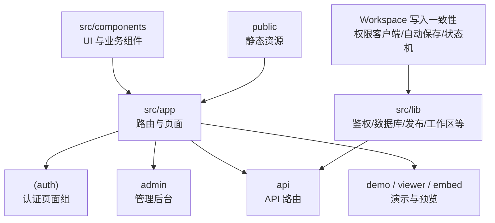

图表来源
- [packages/author-site/src/app/layout.tsx:1-29](file://packages/author-site/src/app/layout.tsx#L1-L29)
- [packages/author-site/src/app/page.tsx:1-11](file://packages/author-site/src/app/page.tsx#L1-L11)
- [packages/author-site/src/lib/workspace-authority-client.ts:1-306](file://packages/author-site/src/lib/workspace-authority-client.ts#L1-306)

章节来源
- [packages/author-site/package.json:1-127](file://packages/author-site/package.json#L1-L127)
- [packages/author-site/src/app/layout.tsx:1-29](file://packages/author-site/src/app/layout.tsx#L1-L29)
- [packages/author-site/src/app/page.tsx:1-11](file://packages/author-site/src/app/page.tsx#L1-L11)

## 核心组件
- 根布局 RootLayout
  - 设置全局元信息、主题、提示框与 Tooltip 上下文，确保全应用一致的体验。
- 首页 Page
  - 通过服务端调用项目管理服务获取初始数据，并以 props 形式注入到客户端组件渲染。
- 认证布局 AuthLayout
  - 为登录/注册/找回密码等页面提供统一的居中布局样式。
- Workspace 权限客户端
  - 提供工作区变更提交、快照获取、事件监听等核心能力。
- 自动保存调度器
  - 实现智能防抖和最大等待时间控制，确保高效的数据持久化。
- 保存状态机
  - 管理编辑器保存状态的显式状态转换，分离 autosave 与 canonical 同步状态。
- 规范化材料化器
  - 后台批量处理规范化任务，支持请求合并和背压控制。
- 离线草稿持久化
  - 使用 IndexedDB 存储离线时的编辑内容，支持重连后的冲突检测。

章节来源
- [packages/author-site/src/app/layout.tsx:1-29](file://packages/author-site/src/app/layout.tsx#L1-L29)
- [packages/author-site/src/app/page.tsx:1-11](file://packages/author-site/src/app/page.tsx#L1-L11)
- [packages/author-site/src/app/(auth)/layout.tsx](file://packages/author-site/src/app/(auth)/layout.tsx#L1-L12)
- [packages/author-site/src/lib/workspace-authority-client.ts:1-306](file://packages/author-site/src/lib/workspace-authority-client.ts#L1-306)
- [packages/author-site/src/lib/workspace-autosave-scheduler.ts:1-251](file://packages/author-site/src/lib/workspace-autosave-scheduler.ts#L1-251)
- [packages/author-site/src/lib/workspace-save-state-machine.ts:1-147](file://packages/author-site/src/lib/workspace-save-state-machine.ts#L1-147)
- [packages/author-site/src/lib/canonical-materializer.ts:1-178](file://packages/author-site/src/lib/canonical-materializer.ts#L1-178)
- [packages/author-site/src/lib/workspace-offline-drafts.ts:1-216](file://packages/author-site/src/lib/workspace-offline-drafts.ts#L1-216)

## 架构总览
整体架构围绕 Next.js 14 App Router 展开，新增了 Workspace 写入一致性保障机制：
- 中间件统一处理跨域、认证与管理后台鉴权
- 页面层负责展示与交互，通过 API 路由访问后端能力
- 认证体系基于 JWT Cookie 与企业账号（钉钉）集成
- 管理后台通过 Admin Secret 进行访问控制
- **新增** Workspace 权限客户端统一管理工作区变更
- **新增** 智能自动保存调度器优化保存性能
- **新增** 保存状态机提供清晰的状态管理
- **新增** 规范化材料化器支持后台批量处理
- **新增** 离线草稿持久化保障数据不丢失

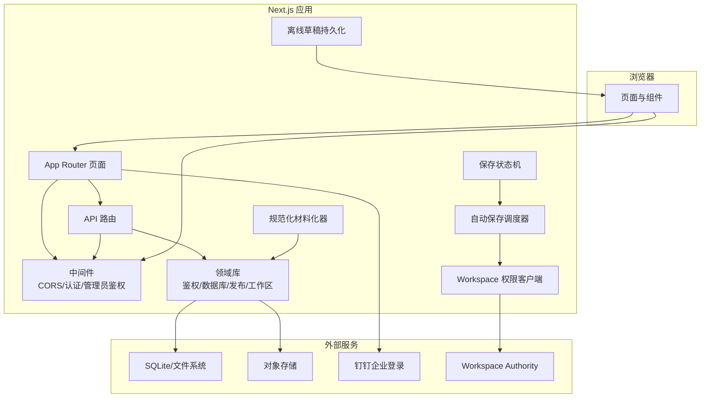

图表来源
- [packages/author-site/src/middleware.ts:1-153](file://packages/author-site/src/middleware.ts#L1-L153)
- [packages/author-site/src/app/layout.tsx:1-29](file://packages/author-site/src/app/layout.tsx#L1-L29)
- [packages/author-site/src/app/page.tsx:1-11](file://packages/author-site/src/app/page.tsx#L1-L11)
- [packages/author-site/src/lib/workspace-authority-client.ts:1-306](file://packages/author-site/src/lib/workspace-authority-client.ts#L1-306)
- [packages/author-site/src/lib/workspace-autosave-scheduler.ts:1-251](file://packages/author-site/src/lib/workspace-autosave-scheduler.ts#L1-251)
- [packages/author-site/src/lib/workspace-save-state-machine.ts:1-147](file://packages/author-site/src/lib/workspace-save-state-machine.ts#L1-147)
- [packages/author-site/src/lib/canonical-materializer.ts:1-178](file://packages/author-site/src/lib/canonical-materializer.ts#L1-178)
- [packages/author-site/src/lib/workspace-offline-drafts.ts:1-216](file://packages/author-site/src/lib/workspace-offline-drafts.ts#L1-216)

## 详细组件分析

### 路由组织与中间件机制
- 路由组织
  - 使用 App Router 的分组路由 (auth) 将认证页面聚合，便于统一布局与守卫。
  - admin 目录承载管理后台页面，配合中间件进行访问控制。
  - api 目录按功能域拆分，如 auth、projects、sessions、demos、templates、knowledge 等，职责清晰。
- 中间件职责
  - CORS 预检与响应头设置，支持受控域名白名单与公共模块开放策略。
  - 用户认证：解析 auth_token Cookie，校验 JWT，对受保护页面/API 进行拦截。
  - 管理后台鉴权：验证 Admin Secret（URL 参数或 Cookie），必要时设置 admin_token Cookie。
  - 重定向与错误响应：未登录时重定向至登录页或返回 401 JSON。

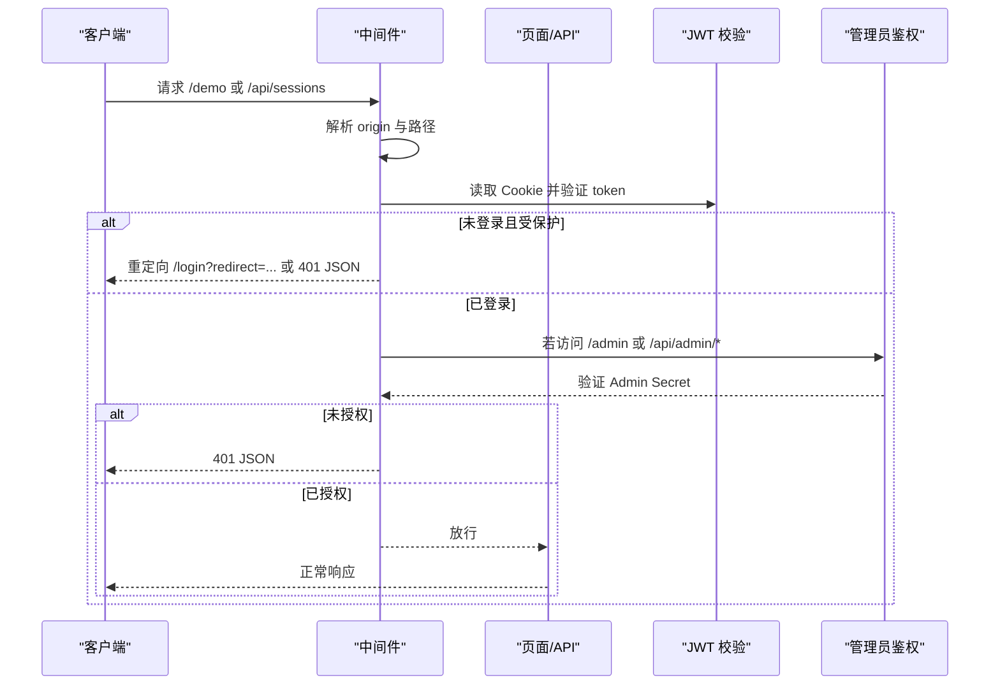

图表来源
- [packages/author-site/src/middleware.ts:1-153](file://packages/author-site/src/middleware.ts#L1-L153)
- [packages/author-site/src/lib/auth/jwt.ts:1-71](file://packages/author-site/src/lib/auth/jwt.ts#L1-L71)
- [packages/author-site/src/lib/admin-auth.ts:1-135](file://packages/author-site/src/lib/admin-auth.ts#L1-L135)

章节来源
- [packages/author-site/src/middleware.ts:1-153](file://packages/author-site/src/middleware.ts#L1-L153)

### 用户认证系统（登录、注册、密码重置）
- 登录流程
  - 客户端提交用户名与密码至 /api/auth/login，成功后设置 auth_token Cookie，跳转回目标页面。
  - 支持钉钉企业账号登录：在钉钉环境内获取免登码后回调 /api/auth/dingtalk/login，完成登录后同样设置 Cookie 并重定向。
- 注册流程
  - 客户端提交用户名与密码至 /api/auth/register，成功后自动登录并跳转首页。
- 密码重置
  - 当前版本不支持自助找回密码，页面引导联系管理员重置。
- 安全与校验
  - 密码强度与用户名格式在服务端校验。
  - 密码使用 bcrypt 加盐哈希存储。
  - JWT 有效期 7 天，Cookie 配置 httpOnly、sameSite=lax，生产环境默认 secure。

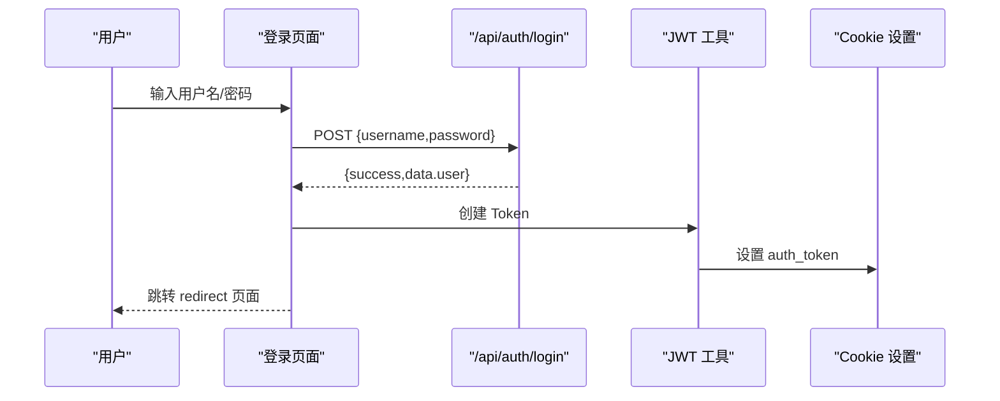

图表来源
- [packages/author-site/src/app/(auth)/login/page.tsx](file://packages/author-site/src/app/(auth)/login/page.tsx#L1-L213)
- [packages/author-site/src/lib/auth/jwt.ts:1-71](file://packages/author-site/src/lib/auth/jwt.ts#L1-L71)

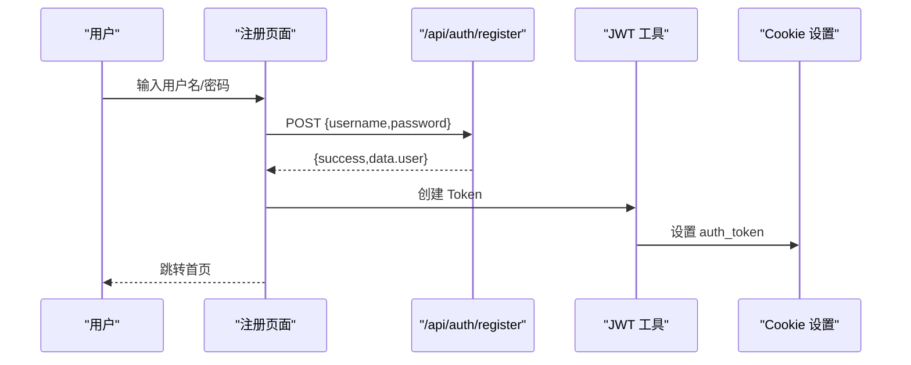

图表来源
- [packages/author-site/src/app/(auth)/register/page.tsx](file://packages/author-site/src/app/(auth)/register/page.tsx#L1-L52)
- [packages/author-site/src/lib/auth/jwt.ts:1-71](file://packages/author-site/src/lib/auth/jwt.ts#L1-L71)

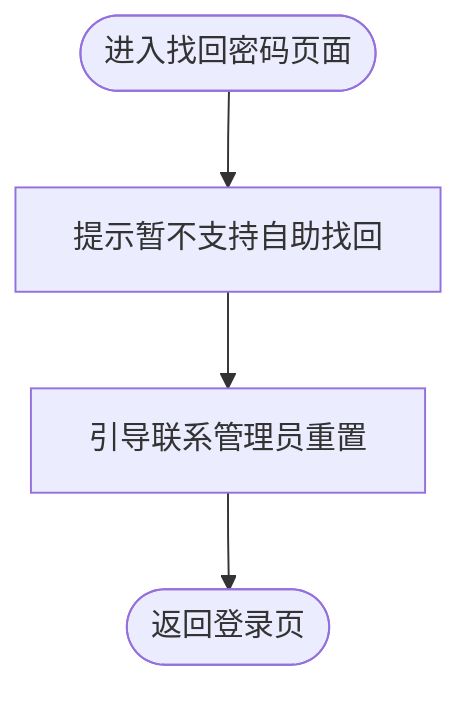

图表来源
- [packages/author-site/src/app/(auth)/forgot-password/page.tsx](file://packages/author-site/src/app/(auth)/forgot-password/page.tsx#L1-L44)

章节来源
- [packages/author-site/src/app/(auth)/login/page.tsx](file://packages/author-site/src/app/(auth)/login/page.tsx#L1-L213)
- [packages/author-site/src/app/(auth)/register/page.tsx](file://packages/author-site/src/app/(auth)/register/page.tsx#L1-L52)
- [packages/author-site/src/app/(auth)/forgot-password/page.tsx](file://packages/author-site/src/app/(auth)/forgot-password/page.tsx#L1-L44)
- [packages/author-site/src/lib/auth/jwt.ts:1-71](file://packages/author-site/src/lib/auth/jwt.ts#L1-L71)
- [packages/author-site/src/lib/auth/password.ts:1-35](file://packages/author-site/src/lib/auth/password.ts#L1-L35)

### 管理后台权限控制与功能模块
- 权限控制
  - 中间件对 /admin 与 /api/admin/* 进行鉴权，支持 URL 参数 secret 或 admin_token Cookie。
  - 首次通过 URL 参数访问时，中间件会设置 admin_token Cookie，后续无需重复传参。
- 功能模块
  - 模型配置、后端提供者同步、知识库管理等页面位于 admin 目录下，具体实现由各路由页面与对应 API 组成。
- 安全建议
  - 生产环境务必设置强随机 ADMIN_SECRET，并确保 HTTPS 部署以启用 secure Cookie。

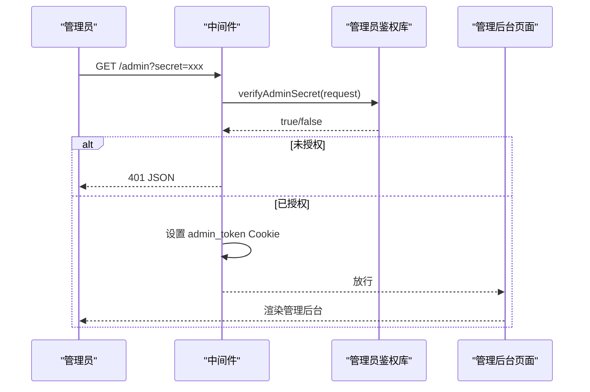

图表来源
- [packages/author-site/src/middleware.ts:100-135](file://packages/author-site/src/middleware.ts#L100-L135)
- [packages/author-site/src/lib/admin-auth.ts:1-135](file://packages/author-site/src/lib/admin-auth.ts#L1-L135)

章节来源
- [packages/author-site/src/middleware.ts:100-135](file://packages/author-site/src/middleware.ts#L100-L135)
- [packages/author-site/src/lib/admin-auth.ts:1-135](file://packages/author-site/src/lib/admin-auth.ts#L1-L135)

### API 路由设计模式（项目管理与文件操作）
- 设计模式
  - 按功能域组织路由：auth、projects、sessions、demos、templates、knowledge、workspace-authority 等，便于维护与权限控制。
  - 典型接口包括：
    - 项目管理：/api/projects/[projectId]/config、/api/projects/[projectId]/demos、/api/projects/[projectId]/publish 等
    - 文件操作：/api/sessions/[sessionId]/files、/api/workspace-authority/[projectId]/[workspaceId]/[...segments] 等
    - 模板与知识：/api/templates、/api/knowledge
- 权限与安全
  - 受保护的 API（如 /api/sessions）由中间件统一校验用户身份，未登录返回 401 JSON。
  - 管理后台相关 API（/api/admin/*）需通过 Admin Secret 鉴权。

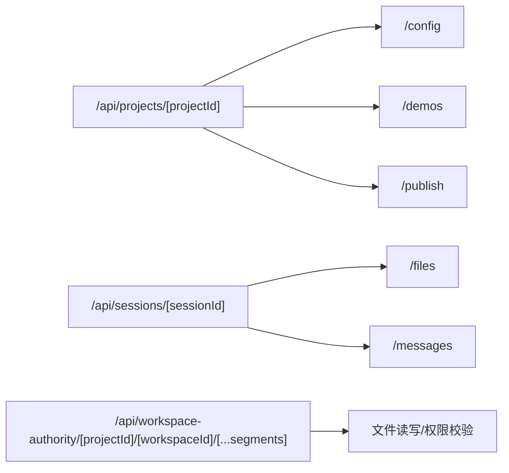

图表来源
- [packages/author-site/src/app/api](file://packages/author-site/src/app/api)

章节来源
- [packages/author-site/src/middleware.ts:89-98](file://packages/author-site/src/middleware.ts#L89-L98)

### Workspace 写入一致性保障机制

#### Workspace 权限客户端
- 核心功能
  - 工作区变更提交：通过 `commitWorkspaceMutation` 提交文本和二进制变更
  - 快照获取：获取工作区当前状态和资源列表
  - 事件监听：监听工作区变更事件和投影确认
  - 健康检查：检查工作区服务可用性和队列深度
  - 二进制暂存：大文件先上传到暂存区，再通过引用提交
- 错误处理
  - 统一的 `WorkspaceAuthorityClientError` 异常类型
  - 详细的错误代码映射和服务端错误消息传递
  - 网络不可用时的降级处理

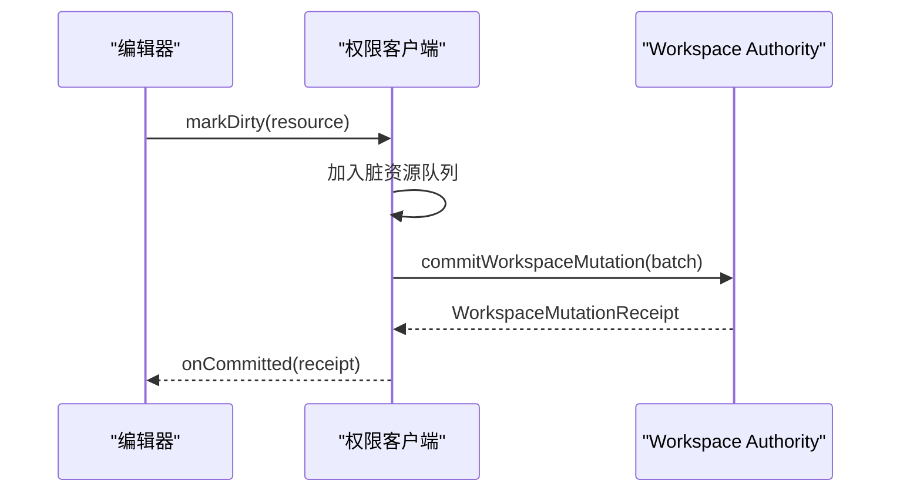

图表来源
- [packages/author-site/src/lib/workspace-authority-client.ts:190-217](file://packages/author-site/src/lib/workspace-authority-client.ts#L190-L217)

章节来源
- [packages/author-site/src/lib/workspace-authority-client.ts:1-306](file://packages/author-site/src/lib/workspace-authority-client.ts#L1-306)

#### 智能自动保存调度器
- 调度策略
  - 防抖机制：默认 800ms 静默等待，避免频繁保存
  - 最大等待：持续编辑时最长 3000ms 强制保存
  - 单写者保证：同一时刻只允许一个 mutation 在执行
  - 资源去重：同一路径多次变更只保留最新内容
- 状态管理
  - in-flight 屏障：防止并发提交导致的数据竞争
  - 批次合并：in-flight 期间的新变更进入下一批
  - 单调回执：只接受 revision >= 已应用 revision 的回执
- 生命周期管理
  - dispose 方法清理所有计时器和待处理操作
  - flush 方法立即提交所有脏资源
  - hasDirty 和 isInFlight 查询当前状态

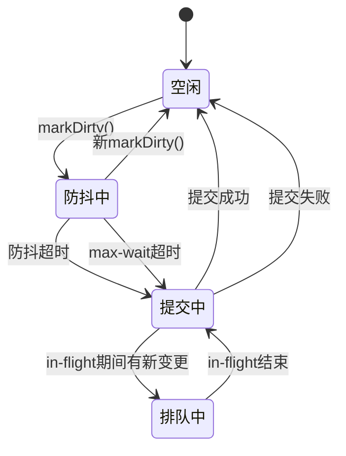

图表来源
- [packages/author-site/src/lib/workspace-autosave-scheduler.ts:39-251](file://packages/author-site/src/lib/workspace-autosave-scheduler.ts#L39-L251)

章节来源
- [packages/author-site/src/lib/workspace-autosave-scheduler.ts:1-251](file://packages/author-site/src/lib/workspace-autosave-scheduler.ts#L1-251)

#### 保存状态机
- 状态定义
  - editing：用户正在编辑，无待保存变更
  - saving：autosave mutation 正在飞行中
  - autosaved：最近一次 autosave 已提交成功
  - offline：Authority 不可达，本地草稿已保留
  - conflict：资源 hash 冲突，需要用户操作
  - canonical-stale：已保存但 canonical 同步异常
- 状态转移
  - 显式的状态转移表，定义所有合法的状态转换
  - 优先级控制：conflict > offline > saving > canonical-stale > autosaved > editing
  - 幂等性：非法转移保持当前状态不变
- 上下文计算
  - 提供从上下文直接计算展示状态的便捷方法
  - 适用于不需要事件历史的场景

```mermaid
stateDiagram-v2
[*] --> editing
editing --> saving : SAVE_STARTED
editing --> offline : DISCONNECT
editing --> conflict : CONFLICT_DETECTED
saving --> autosaved : SAVE_COMMITTED
saving --> editing : SAVE_FAILED
saving --> offline : DISCONNECT
autosaved --> editing : START_EDIT
autosaved --> saving : SAVE_STARTED
autosaved --> canonical-stale : CANONICAL_STALE
offline --> editing : RECONNECT
conflict --> editing : CONFLICT_RESOLVED
canonical-stale --> autosaved : CANONICAL_SYNCED
```

图表来源
- [packages/author-site/src/lib/workspace-save-state-machine.ts:76-116](file://packages/author-site/src/lib/workspace-save-state-machine.ts#L76-L116)

章节来源
- [packages/author-site/src/lib/workspace-save-state-machine.ts:1-147](file://packages/author-site/src/lib/workspace-save-state-machine.ts#L1-147)

#### 规范化材料化器
- 后台处理
  - 请求合并：多个并发请求只物化到最新的 revision
  - 背压控制：在途期间的请求进入下一批处理
  - 单一执行：同一时刻只运行一个 materialization
- 接口设计
  - 同步接口：`materializeCanonicalWorkspace` 直接调用底层同步
  - 异步接口：`ensureCanonicalRevisionMaterializer` 支持请求合并
  - 全局实例：通过 `getGlobalMaterializer` 获取全局材料化器
- 错误处理
  - 统一的错误结果结构，包含 success、code、error 字段
  - 部分成功的处理：达到目标 revision 的请求成功，其他重新入队

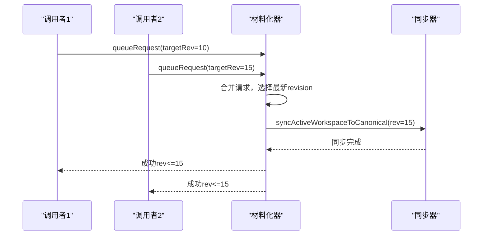

图表来源
- [packages/author-site/src/lib/canonical-materializer.ts:41-122](file://packages/author-site/src/lib/canonical-materializer.ts#L41-L122)

章节来源
- [packages/author-site/src/lib/canonical-materializer.ts:1-178](file://packages/author-site/src/lib/canonical-materializer.ts#L1-178)

#### 离线草稿持久化
- 存储机制
  - 使用 IndexedDB 作为离线存储后端
  - 数据结构包含 workspaceId、path、content、baseHash 等关键字段
  - 每个文件的 key 格式为 `${workspaceId}:${path}`
- 重连处理
  - 对比本地草稿 baseHash 与服务端当前 hash
  - 匹配时直接提交，冲突时进入冲突处理流程
  - 固定文案："离线，修改尚未保存到服务器"
- 生命周期管理
  - 每次操作都会打开/复用 IndexedDB 连接
  - 支持 SSR 环境下的安全降级
  - 提供批量删除和存在性检查方法

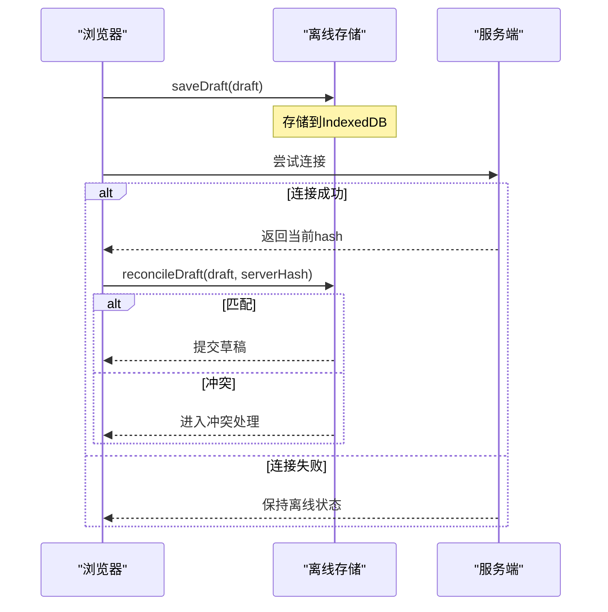

图表来源
- [packages/author-site/src/lib/workspace-offline-drafts.ts:196-204](file://packages/author-site/src/lib/workspace-offline-drafts.ts#L196-L204)

章节来源
- [packages/author-site/src/lib/workspace-offline-drafts.ts:1-216](file://packages/author-site/src/lib/workspace-offline-drafts.ts#L1-216)

### 前端状态管理与错误处理
- 状态管理策略
  - 页面级初始数据通过服务端渲染注入（如首页从项目管理服务拉取）。
  - 客户端交互状态使用 React useState/useEffect 管理，结合 Toast 反馈用户操作结果。
  - 可选引入 SWR 进行数据缓存与增量更新（已在依赖中声明）。
  - **新增** Workspace 保存状态通过状态机管理，提供清晰的视觉反馈。
- 错误处理机制
  - 登录/注册失败时统一捕获错误并通过 Toast 展示。
  - 中间件对未登录与未授权场景返回标准 JSON 错误结构，便于前端统一处理。
  - **新增** Workspace 权限客户端提供统一的错误类型和错误码映射。
  - **新增** 离线草稿持久化确保网络异常时的数据安全性。

章节来源
- [packages/author-site/src/app/page.tsx:1-11](file://packages/author-site/src/app/page.tsx#L1-L11)
- [packages/author-site/src/app/(auth)/login/page.tsx](file://packages/author-site/src/app/(auth)/login/page.tsx#L85-L113)
- [packages/author-site/src/app/(auth)/register/page.tsx](file://packages/author-site/src/app/(auth)/register/page.tsx#L14-L38)
- [packages/author-site/src/middleware.ts:89-98](file://packages/author-site/src/middleware.ts#L89-L98)
- [packages/author-site/src/lib/workspace-authority-client.ts:39-48](file://packages/author-site/src/lib/workspace-authority-client.ts#L39-L48)
- [packages/author-site/src/lib/workspace-offline-drafts.ts:207-216](file://packages/author-site/src/lib/workspace-offline-drafts.ts#L207-L216)

### 组件使用示例与开发最佳实践
- 组件使用示例
  - 登录表单复用：登录与注册页面共用 LoginForm 组件，减少重复代码。
  - 主题与提示：通过 ThemeProvider 与 ToastProviderWrapper 在全局提供主题与消息提示能力。
  - **新增** Workspace 保存状态：通过状态机管理编辑器保存状态，提供一致的用户体验。
- 最佳实践
  - 路由分组：将认证相关页面放入 (auth) 分组，便于统一布局与守卫。
  - 中间件前置校验：所有敏感页面与 API 均通过中间件进行统一鉴权，避免在各页面重复实现。
  - 环境变量安全：严格管理 JWT_SECRET、ADMIN_SECRET、CORS_ORIGINS 等敏感配置。
  - 错误反馈：统一使用 Toast 向用户反馈成功与失败信息，提升用户体验。
  - **新增** 自动保存优化：合理使用防抖和最大等待时间，平衡用户体验和数据安全性。
  - **新增** 离线优先：在网络不可用时优先保证本地数据持久化，重连后自动同步。

章节来源
- [packages/author-site/src/app/(auth)/login/page.tsx](file://packages/author-site/src/app/(auth)/login/page.tsx#L1-L213)
- [packages/author-site/src/app/(auth)/register/page.tsx](file://packages/author-site/src/app/(auth)/register/page.tsx#L1-L52)
- [packages/author-site/src/app/layout.tsx:1-29](file://packages/author-site/src/app/layout.tsx#L1-L29)
- [packages/author-site/src/lib/workspace-autosave-scheduler.ts:24-35](file://packages/author-site/src/lib/workspace-autosave-scheduler.ts#L24-L35)
- [packages/author-site/src/lib/workspace-offline-drafts.ts:6-10](file://packages/author-site/src/lib/workspace-offline-drafts.ts#L6-L10)

## 依赖分析
- 关键依赖
  - next: 14.1.0（App Router）
  - jose: JWT 签名与验证
  - bcrypt: 密码哈希
  - better-sqlite3: 本地数据库
  - swr: 客户端数据缓存与增量更新
  - @radix-ui/*: 基础 UI 组件
  - tailwindcss: 样式框架
- 内部包依赖
  - @workbench/project-core、@workbench/shared、@workbench/sketch-core 等，用于项目、共享与画布能力。
- **新增依赖**
  - IndexedDB API：用于离线草稿持久化
  - WebSocket API：用于实时协作通信

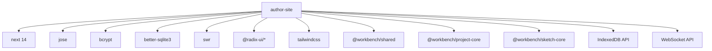

图表来源
- [packages/author-site/package.json:1-127](file://packages/author-site/package.json#L1-L127)

章节来源
- [packages/author-site/package.json:1-127](file://packages/author-site/package.json#L1-L127)

## 性能考虑
- 服务端渲染与动态数据
  - 首页使用 force-dynamic 强制动态渲染，确保每次请求获取最新项目列表。
- 中间件开销
  - 中间件仅执行必要的鉴权与 CORS 处理，避免不必要的计算。
- 静态资源与 CDN
  - 预览运行时产物与缩略图放置于 public，可通过 CDN 加速。
- 客户端缓存
  - 可使用 SWR 对频繁读取的数据进行缓存与增量更新，降低网络请求压力。
- **新增性能优化**
  - 自动保存防抖：800ms 防抖避免频繁的网络请求
  - 最大等待时间：3000ms 确保长时间编辑的数据不会丢失
  - 请求合并：规范化材料化器合并多个并发请求
  - 二进制分片：大文件通过暂存区上传，避免阻塞主线程
  - 离线优先：网络不可用时优先本地存储，减少用户等待

章节来源
- [packages/author-site/src/app/page.tsx:1-11](file://packages/author-site/src/app/page.tsx#L1-L11)
- [packages/author-site/src/middleware.ts:1-153](file://packages/author-site/src/middleware.ts#L1-L153)
- [packages/author-site/src/lib/workspace-autosave-scheduler.ts:24-35](file://packages/author-site/src/lib/workspace-autosave-scheduler.ts#L24-L35)
- [packages/author-site/src/lib/canonical-materializer.ts:30-40](file://packages/author-site/src/lib/canonical-materializer.ts#L30-L40)
- [packages/author-site/src/lib/workspace-authority-client.ts:246-277](file://packages/author-site/src/lib/workspace-authority-client.ts#L246-L277)

## 故障排查指南
- 登录失败
  - 检查用户名与密码是否符合校验规则（长度、字符集）。
  - 确认 /api/auth/login 返回的 success 字段与 error.message。
- 未登录被重定向
  - 检查 auth_token Cookie 是否存在且有效，确认中间件是否放行。
- 管理后台无法访问
  - 确认 ADMIN_SECRET 是否正确，首次访问需携带 ?secret=xxx，或通过 Cookie 访问。
- 跨域问题
  - 检查 CORS_ORIGINS 配置，确保请求 origin 在白名单内。
- **新增故障排查**
  - Workspace 权限客户端错误：检查 WorkspaceAuthorityClientError 的错误码和状态码
  - 自动保存失败：查看调度器的 onError 回调和日志输出
  - 离线草稿冲突：检查 reconcileDraft 返回的冲突信息和解决方案
  - 规范化材料化器阻塞：监控 globalMaterializer 的 pending 队列长度

章节来源
- [packages/author-site/src/lib/auth/password.ts:16-34](file://packages/author-site/src/lib/auth/password.ts#L16-L34)
- [packages/author-site/src/middleware.ts:18-37](file://packages/author-site/src/middleware.ts#L18-L37)
- [packages/author-site/src/lib/admin-auth.ts:19-56](file://packages/author-site/src/lib/admin-auth.ts#L19-L56)
- [packages/author-site/src/lib/workspace-authority-client.ts:39-48](file://packages/author-site/src/lib/workspace-authority-client.ts#L39-L48)
- [packages/author-site/src/lib/workspace-autosave-scheduler.ts:33-34](file://packages/author-site/src/lib/workspace-autosave-scheduler.ts#L33-L34)
- [packages/author-site/src/lib/workspace-offline-drafts.ts:196-204](file://packages/author-site/src/lib/workspace-offline-drafts.ts#L196-L204)
- [packages/author-site/src/lib/canonical-materializer.ts:119-121](file://packages/author-site/src/lib/canonical-materializer.ts#L119-L121)

## 结论
创作端应用基于 Next.js 14 App Router 构建了清晰的路由与中间件体系，实现了完善的用户认证与管理后台权限控制。API 路由按功能域组织，职责明确，便于扩展与维护。通过服务端渲染与客户端缓存相结合的策略，兼顾了首屏性能与交互体验。

**最新更新**：新增的 Workspace 写入一致性保障机制显著提升了应用的可靠性和用户体验。智能自动保存调度器通过防抖和最大等待时间优化了保存性能，保存状态机提供了清晰的状态管理，规范化材料化器支持高效的后台批量处理，离线草稿持久化确保了数据的安全性。这些改进共同构建了一个更加健壮和友好的创作体验。

建议在后续迭代中持续完善错误处理与监控告警，进一步提升系统的稳定性与可观测性。

## 附录
- 环境变量建议
  - JWT_SECRET：JWT 密钥，生产环境必须强随机。
  - ADMIN_SECRET：管理后台访问密钥，生产环境必须强随机。
  - CORS_ORIGINS：允许的跨域源，逗号分隔。
  - USE_SECURE_COOKIE：生产环境默认启用 secure Cookie，可在 HTTP 内网部署时禁用。
- **新增配置项**
  - AUTOSAVE_DEBOUNCE_MS：自动保存防抖时间，默认 800ms
  - AUTOSAVE_MAX_WAIT_MS：自动保存最大等待时间，默认 3000ms
  - WORKSPACE_AUTHORITY_URL：Workspace Authority 服务地址
  - OFFLINE_DRAFT_ENABLED：是否启用离线草稿功能，默认 true