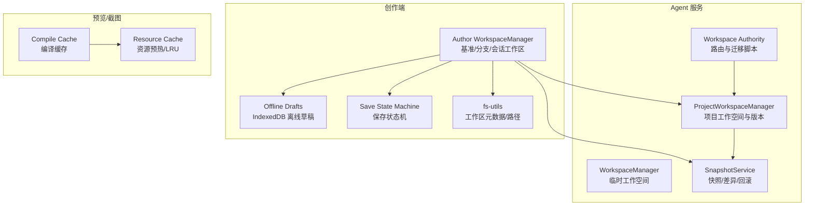
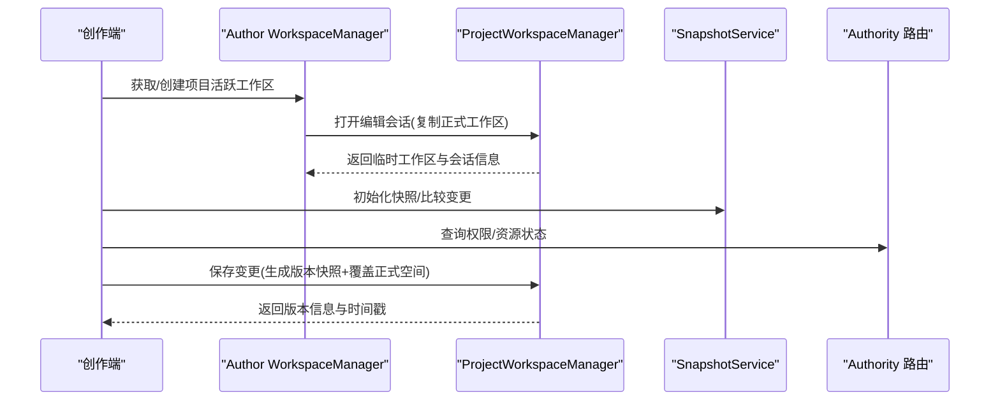
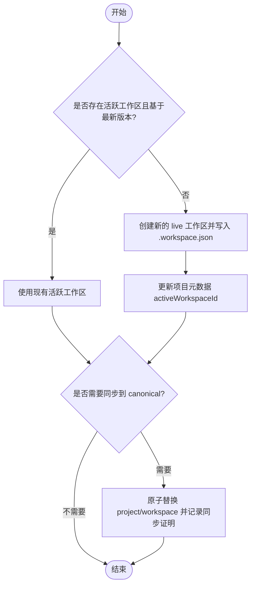
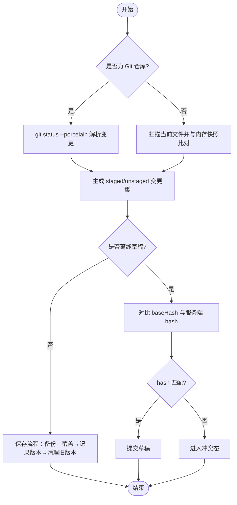
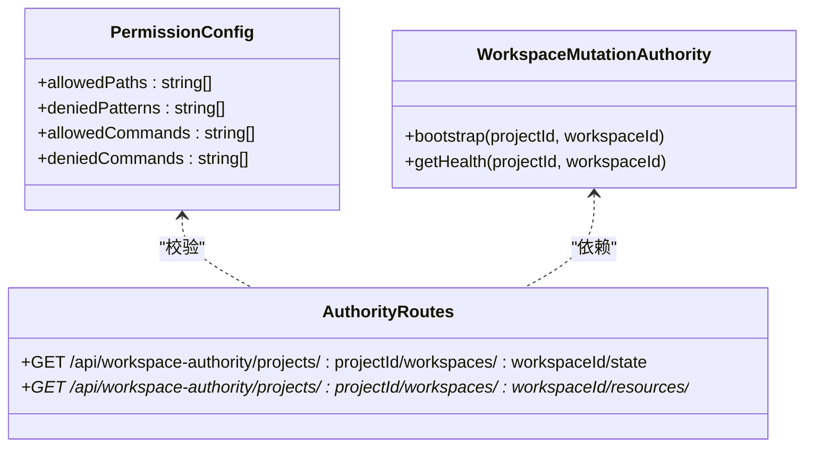
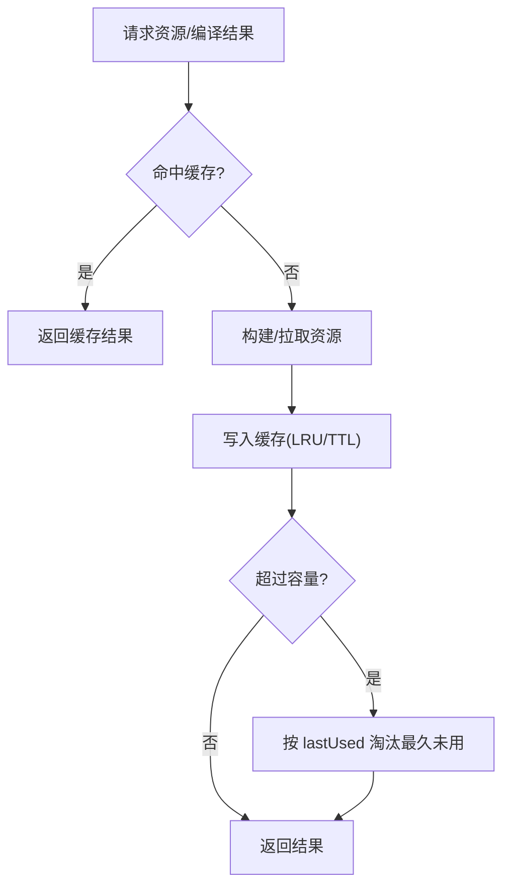
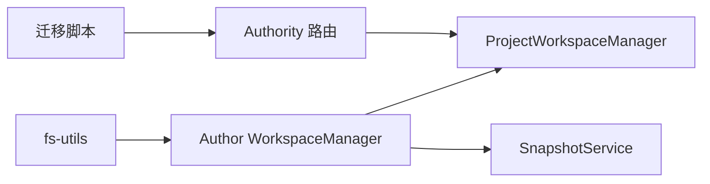

# 工作区管理

<cite>
**本文引用的文件**
- [packages/agent-service/src/workspace/workspace-manager.ts](file://packages/agent-service/src/workspace/workspace-manager.ts)
- [packages/agent-service/src/workspace/project-workspace-manager.ts](file://packages/agent-service/src/workspace/project-workspace-manager.ts)
- [packages/author-site/src/lib/workspace-manager.ts](file://packages/author-site/src/lib/workspace-manager.ts)
- [packages/author-site/src/lib/fs-utils.ts](file://packages/author-site/src/lib/fs-utils.ts)
- [packages/agent-service/src/session/snapshot-service.ts](file://packages/agent-service/src/session/snapshot-service.ts)
- [packages/author-site/src/lib/workspace-offline-drafts.ts](file://packages/author-site/src/lib/workspace-offline-drafts.ts)
- [packages/author-site/src/lib/workspace-save-state-machine.ts](file://packages/author-site/src/lib/workspace-save-state-machine.ts)
- [packages/agent-service/src/routes/workspace-authority.ts](file://packages/agent-service/src/routes/workspace-authority.ts)
- [packages/agent-service/src/workspace/workspace-authority-migration.ts](file://packages/agent-service/src/workspace/workspace-authority-migration.ts)
- [packages/agent-service/src/scripts/workspace-authority-migrate.ts](file://packages/agent-service/src/scripts/workspace-authority-migrate.ts)
- [packages/demo-ui/src/compile-cache.ts](file://packages/demo-ui/src/compile-cache.ts)
- [packages/demo-ui/src/preview-resource-cache.ts](file://packages/demo-ui/src/preview-resource-cache.ts)
- [packages/screenshot-service/src/utils/compile-cache.ts](file://packages/screenshot-service/src/utils/compile-cache.ts)
- [docs/项目文档/独立Agent服务层/03-核心模块设计.md](file://docs/项目文档/独立Agent服务层/03-核心模块设计.md)
- [docs/项目文档/创作端/05-AI对话/技术/03_AI行为约束机制.md](file://docs/项目文档/创作端/05-AI对话/技术/03_AI行为约束机制.md)
</cite>

## 目录
1. [简介](#简介)
2. [项目结构](#项目结构)
3. [核心组件](#核心组件)
4. [架构总览](#架构总览)
5. [详细组件分析](#详细组件分析)
6. [依赖关系分析](#依赖关系分析)
7. [性能考虑](#性能考虑)
8. [故障排查指南](#故障排查指南)
9. [结论](#结论)
10. [附录：工作区 API 参考与最佳实践](#附录工作区-api-参考与最佳实践)

## 简介
本技术文档围绕“工作区管理系统”展开，覆盖三类工作区的概念与生命周期（基准工作区、分支工作区、Session 工作区），文件同步机制（增量同步、冲突检测、合并策略），自动保存（定时保存、变更监听、离线草稿），权限控制（读写权限、操作审计、安全隔离），以及性能优化（懒加载、缓存、内存管理）。文末提供完整的工作区 API 参考与最佳实践。

## 项目结构
系统采用多包协作的 monorepo 结构，关键与工作区相关的代码分布在以下位置：
- Agent 服务层：负责临时工作空间、项目工作空间、快照与权限迁移等
- 创作端（Author Site）：负责项目级工作区创建、基准同步、会话解耦、离线草稿与保存状态机
- 预览与截图服务：提供编译与资源缓存，提升整体性能



图表来源
- [packages/agent-service/src/workspace/workspace-manager.ts:1-144](file://packages/agent-service/src/workspace/workspace-manager.ts#L1-L144)
- [packages/agent-service/src/workspace/project-workspace-manager.ts:1-472](file://packages/agent-service/src/workspace/project-workspace-manager.ts#L1-L472)
- [packages/agent-service/src/session/snapshot-service.ts:1-342](file://packages/agent-service/src/session/snapshot-service.ts#L1-L342)
- [packages/author-site/src/lib/workspace-manager.ts:1-755](file://packages/author-site/src/lib/workspace-manager.ts#L1-L755)
- [packages/author-site/src/lib/fs-utils.ts:1713-1762](file://packages/author-site/src/lib/fs-utils.ts#L1713-L1762)
- [packages/author-site/src/lib/workspace-offline-drafts.ts:1-215](file://packages/author-site/src/lib/workspace-offline-drafts.ts#L1-L215)
- [packages/author-site/src/lib/workspace-save-state-machine.ts:1-147](file://packages/author-site/src/lib/workspace-save-state-machine.ts#L1-L147)
- [packages/agent-service/src/routes/workspace-authority.ts:67-90](file://packages/agent-service/src/routes/workspace-authority.ts#L67-L90)
- [packages/agent-service/src/workspace/workspace-authority-migration.ts:1-140](file://packages/agent-service/src/workspace/workspace-authority-migration.ts#L1-L140)
- [packages/demo-ui/src/compile-cache.ts:1-86](file://packages/demo-ui/src/compile-cache.ts#L1-L86)
- [packages/demo-ui/src/preview-resource-cache.ts:198-245](file://packages/demo-ui/src/preview-resource-cache.ts#L198-L245)

章节来源
- [docs/项目文档/独立Agent服务层/03-核心模块设计.md:215-238](file://docs/项目文档/独立Agent服务层/03-核心模块设计.md#L215-L238)

## 核心组件
- 临时工作空间（Agent 侧）
  - 职责：为普通 Agent 会话创建临时工作空间或复用用户指定路径；支持清理与显示名规范化
  - 关键点：区分临时与用户工作空间，避免误删；不主动创建空目录以避免扫描为空
- 项目工作空间（Agent 侧）
  - 职责：项目 CRUD、打开编辑会话（复制正式工作区到临时空间）、保存变更（生成版本快照并覆盖正式空间）、放弃编辑、版本历史与恢复
  - 关键点：版本保留上限、会话状态机（editing/saved/discarded）、快照目录组织
- 快照与差异（Agent 侧）
  - 职责：初始化快照（Git 仓库模式或非 Git 目录快照模式）、比较变更（staged/unstaged）、暂存/取消暂存、丢弃/重置文件、获取基线内容
  - 关键点：Git 命令集成与内存快照双通道；忽略 node_modules 与敏感文件
- 创作端工作区管理
  - 职责：创建/获取项目活跃工作区（live）、分支工作区、会话工作区；将活跃工作区同步至项目基准（canonical）；清理孤儿工作区；会话与项目工作区解耦
  - 关键点：基于最新版本的 baseVersion 校验；原子替换 project workspace；诊断事件记录
- 离线草稿与保存状态机（创作端）
  - 职责：离线时持久化草稿到 IndexedDB；重连后与服务端 hash 对比决定提交或冲突；显式状态机驱动 UI 展示（editing/saving/autosaved/offline/conflict/canonical-stale）
- 权限与迁移（Agent 侧）
  - 职责：Workspace Authority 健康检查、资源权限查询；批量发现 live 工作区并进行 bootstrap/修复备份；CLI 脚本驱动迁移

章节来源
- [packages/agent-service/src/workspace/workspace-manager.ts:1-144](file://packages/agent-service/src/workspace/workspace-manager.ts#L1-L144)
- [packages/agent-service/src/workspace/project-workspace-manager.ts:1-472](file://packages/agent-service/src/workspace/project-workspace-manager.ts#L1-L472)
- [packages/agent-service/src/session/snapshot-service.ts:1-342](file://packages/agent-service/src/session/snapshot-service.ts#L1-L342)
- [packages/author-site/src/lib/workspace-manager.ts:1-755](file://packages/author-site/src/lib/workspace-manager.ts#L1-L755)
- [packages/author-site/src/lib/fs-utils.ts:1713-1762](file://packages/author-site/src/lib/fs-utils.ts#L1713-L1762)
- [packages/author-site/src/lib/workspace-offline-drafts.ts:1-215](file://packages/author-site/src/lib/workspace-offline-drafts.ts#L1-L215)
- [packages/author-site/src/lib/workspace-save-state-machine.ts:1-147](file://packages/author-site/src/lib/workspace-save-state-machine.ts#L1-L147)
- [packages/agent-service/src/routes/workspace-authority.ts:67-90](file://packages/agent-service/src/routes/workspace-authority.ts#L67-L90)
- [packages/agent-service/src/workspace/workspace-authority-migration.ts:1-140](file://packages/agent-service/src/workspace/workspace-authority-migration.ts#L1-L140)

## 架构总览
工作区体系由“创作端 + Agent 服务 + 快照/权限 + 预览/截图缓存”组成。创作端负责业务编排（创建/同步/离线草稿/状态机），Agent 服务提供底层能力（临时/项目工作空间、快照、权限迁移），预览/截图服务通过缓存降低 IO 与编译开销。



图表来源
- [packages/author-site/src/lib/workspace-manager.ts:240-334](file://packages/author-site/src/lib/workspace-manager.ts#L240-L334)
- [packages/agent-service/src/workspace/project-workspace-manager.ts:305-420](file://packages/agent-service/src/workspace/project-workspace-manager.ts#L305-L420)
- [packages/agent-service/src/session/snapshot-service.ts:108-162](file://packages/agent-service/src/session/snapshot-service.ts#L108-L162)
- [packages/agent-service/src/routes/workspace-authority.ts:67-90](file://packages/agent-service/src/routes/workspace-authority.ts#L67-L90)

## 详细组件分析

### 组件一：工作区类型与生命周期
- 基准工作区（Canonical）
  - 定义：项目的最终稳定版本所在目录（project/workspace），由活跃工作区同步而来
  - 同步流程：校验活跃工作区基于最新版本 → 原子替换 → 更新 canonical 同步证明（revision/rootHash）
- 分支工作区（Branch）
  - 定义：从项目工作区复制出的独立副本，scope=branch，用于并行开发
  - 生命周期：创建 → 编辑 → 删除或归档；不受 canonical 直接覆盖
- Session 工作区（Legacy/Temp）
  - 定义：编辑会话对应的临时工作区，scope=legacy，会话结束后可清理
  - 生命周期：openProjectForEdit → 保存/放弃 → 清理



图表来源
- [packages/author-site/src/lib/workspace-manager.ts:240-334](file://packages/author-site/src/lib/workspace-manager.ts#L240-L334)
- [packages/author-site/src/lib/workspace-manager.ts:336-492](file://packages/author-site/src/lib/workspace-manager.ts#L336-L492)

章节来源
- [packages/author-site/src/lib/workspace-manager.ts:190-334](file://packages/author-site/src/lib/workspace-manager.ts#L190-L334)
- [packages/author-site/src/lib/workspace-manager.ts:336-492](file://packages/author-site/src/lib/workspace-manager.ts#L336-L492)
- [packages/author-site/src/lib/fs-utils.ts:1713-1762](file://packages/author-site/src/lib/fs-utils.ts#L1713-L1762)

### 组件二：文件同步机制（增量、冲突、合并）
- 增量同步
  - 非 Git 目录：以内存快照为基线，遍历当前文件集合，比对内容与 mtime，产出 unstaged 变更集
  - Git 仓库：调用 git status --porcelain，解析 staged/unstaged 列表
- 冲突检测
  - 离线草稿重连：对比本地草稿 baseHash 与服务端当前 hash，匹配则提交，否则进入冲突态
  - Canonical 同步异常：保存成功但 canonical 同步失败，状态机标记 canonical-stale
- 合并策略
  - 保存变更：先备份正式工作区为快照，再将临时工作区覆盖正式工作区，随后清理旧版本（保留最近 N 个）
  - 丢弃/重置：Git 模式用 checkout HEAD，非 Git 模式按基线内容恢复或删除新增文件



图表来源
- [packages/agent-service/src/session/snapshot-service.ts:108-229](file://packages/agent-service/src/session/snapshot-service.ts#L108-L229)
- [packages/author-site/src/lib/workspace-offline-drafts.ts:196-204](file://packages/author-site/src/lib/workspace-offline-drafts.ts#L196-L204)
- [packages/agent-service/src/workspace/project-workspace-manager.ts:346-420](file://packages/agent-service/src/workspace/project-workspace-manager.ts#L346-L420)

章节来源
- [packages/agent-service/src/session/snapshot-service.ts:108-229](file://packages/agent-service/src/session/snapshot-service.ts#L108-L229)
- [packages/author-site/src/lib/workspace-offline-drafts.ts:196-204](file://packages/author-site/src/lib/workspace-offline-drafts.ts#L196-L204)
- [packages/agent-service/src/workspace/project-workspace-manager.ts:346-420](file://packages/agent-service/src/workspace/project-workspace-manager.ts#L346-L420)

### 组件三：自动保存（定时、监听、离线草稿）
- 定时保存
  - 前端触发 SAVE_STARTED → 后端 commit → 状态机推进至 autosaved
- 变更监听
  - 通过快照服务 compare 输出变更集，驱动 UI 提示与增量保存
- 离线草稿
  - 断开连接时切换 offline 状态，仅落盘 IndexedDB；重连后 reconcileDraft 判定 match/conflict
  - 明确文案：离线时不报告“已自动保存”，仅提示“离线，修改尚未保存到服务器”

```mermaid
stateDiagram-v2
[*] --> editing
editing --> saving : "SAVE_STARTED"
saving --> autosaved : "SAVE_COMMITTED"
saving --> editing : "SAVE_FAILED"
editing --> offline : "DISCONNECT"
offline --> editing : "RECONNECT"
autosaved --> conflict : "CONFLICT_DETECTED"
autosaved --> "canonical-stale" : "CANONICAL_STALE"
"canonical-stale" --> autosaved : "CANONICAL_SYNCED"
conflict --> editing : "CONFLICT_RESOLVED"
```

图表来源
- [packages/author-site/src/lib/workspace-save-state-machine.ts:76-116](file://packages/author-site/src/lib/workspace-save-state-machine.ts#L76-L116)
- [packages/author-site/src/lib/workspace-offline-drafts.ts:196-215](file://packages/author-site/src/lib/workspace-offline-drafts.ts#L196-L215)

章节来源
- [packages/author-site/src/lib/workspace-save-state-machine.ts:1-147](file://packages/author-site/src/lib/workspace-save-state-machine.ts#L1-L147)
- [packages/author-site/src/lib/workspace-offline-drafts.ts:1-215](file://packages/author-site/src/lib/workspace-offline-drafts.ts#L1-L215)

### 组件四：权限控制（读写、审计、安全隔离）
- 权限模型
  - 工具层执行权限检查，白名单/黑名单路径与命令组合限制
  - Live 工作区默认只读，危险命令与子 Agent 委派受限
- 审计与安全隔离
  - 会话与权限绑定，资源访问需携带 sessionId
  - 迁移脚本保障 live 工作区 bootstrap 与备份一致性



图表来源
- [docs/项目文档/创作端/05-AI对话/技术/03_AI行为约束机制.md:109-118](file://docs/项目文档/创作端/05-AI对话/技术/03_AI行为约束机制.md#L109-L118)
- [packages/agent-service/src/routes/workspace-authority.ts:67-90](file://packages/agent-service/src/routes/workspace-authority.ts#L67-L90)
- [packages/agent-service/src/workspace/workspace-authority-migration.ts:69-125](file://packages/agent-service/src/workspace/workspace-authority-migration.ts#L69-L125)

章节来源
- [docs/项目文档/创作端/05-AI对话/技术/03_AI行为约束机制.md:872-900](file://docs/项目文档/创作端/05-AI对话/技术/03_AI行为约束机制.md#L872-L900)
- [packages/agent-service/src/routes/workspace-authority.ts:67-90](file://packages/agent-service/src/routes/workspace-authority.ts#L67-L90)
- [packages/agent-service/src/workspace/workspace-authority-migration.ts:1-140](file://packages/agent-service/src/workspace/workspace-authority-migration.ts#L1-L140)

### 组件五：性能优化（懒加载、缓存、内存管理）
- 懒加载
  - 预览资源按需加载，预取队列并发控制，避免阻塞主线程
- 缓存机制
  - 编译缓存：基于代码指纹与 TTL 的 LRU 淘汰
  - 资源缓存：URL 去重、最后使用时间排序、最大容量剪枝
- 内存管理
  - 快照服务在内存中维护 Map<workingDir, files>，定期清理或按需 discard/reset
  - 预览资源缓存按 lastUsed 降序回收，防止无限增长



图表来源
- [packages/demo-ui/src/compile-cache.ts:1-86](file://packages/demo-ui/src/compile-cache.ts#L1-L86)
- [packages/demo-ui/src/preview-resource-cache.ts:198-245](file://packages/demo-ui/src/preview-resource-cache.ts#L198-L245)
- [packages/screenshot-service/src/utils/compile-cache.ts:1-69](file://packages/screenshot-service/src/utils/compile-cache.ts#L1-L69)

章节来源
- [packages/demo-ui/src/compile-cache.ts:1-86](file://packages/demo-ui/src/compile-cache.ts#L1-L86)
- [packages/demo-ui/src/preview-resource-cache.ts:198-245](file://packages/demo-ui/src/preview-resource-cache.ts#L198-L245)
- [packages/screenshot-service/src/utils/compile-cache.ts:1-69](file://packages/screenshot-service/src/utils/compile-cache.ts#L1-L69)

## 依赖关系分析
- 创作端依赖 fs-utils 进行工作区路径与元数据操作
- Author WorkspaceManager 依赖 ProjectWorkspaceManager 完成编辑会话与版本管理
- SnapshotService 被创作端与 Agent 侧共同使用，提供统一的差异与回滚能力
- Authority 路由与迁移脚本依赖 WorkspaceMutationAuthority 进行健康检查与 bootstrap



图表来源
- [packages/author-site/src/lib/workspace-manager.ts:1-755](file://packages/author-site/src/lib/workspace-manager.ts#L1-L755)
- [packages/author-site/src/lib/fs-utils.ts:1713-1762](file://packages/author-site/src/lib/fs-utils.ts#L1713-L1762)
- [packages/agent-service/src/workspace/project-workspace-manager.ts:1-472](file://packages/agent-service/src/workspace/project-workspace-manager.ts#L1-L472)
- [packages/agent-service/src/session/snapshot-service.ts:1-342](file://packages/agent-service/src/session/snapshot-service.ts#L1-L342)
- [packages/agent-service/src/routes/workspace-authority.ts:67-90](file://packages/agent-service/src/routes/workspace-authority.ts#L67-L90)
- [packages/agent-service/src/workspace/workspace-authority-migration.ts:1-140](file://packages/agent-service/src/workspace/workspace-authority-migration.ts#L1-L140)

章节来源
- [packages/author-site/src/lib/workspace-manager.ts:1-755](file://packages/author-site/src/lib/workspace-manager.ts#L1-L755)
- [packages/agent-service/src/workspace/project-workspace-manager.ts:1-472](file://packages/agent-service/src/workspace/project-workspace-manager.ts#L1-L472)
- [packages/agent-service/src/session/snapshot-service.ts:1-342](file://packages/agent-service/src/session/snapshot-service.ts#L1-L342)
- [packages/agent-service/src/routes/workspace-authority.ts:67-90](file://packages/agent-service/src/routes/workspace-authority.ts#L67-L90)
- [packages/agent-service/src/workspace/workspace-authority-migration.ts:1-140](file://packages/agent-service/src/workspace/workspace-authority-migration.ts#L1-L140)

## 性能考虑
- 减少全量扫描：优先使用 Git 模式差异，避免递归读取大目录
- 合理设置缓存大小与 TTL：编译缓存与资源缓存均具备容量上限与淘汰策略
- 异步与并发控制：预览资源预热队列限制并发，避免浏览器卡顿
- 内存快照清理：及时 clearSnapshot 或 discard/reset，防止 Map 膨胀

[本节为通用指导，无需源码引用]

## 故障排查指南
- 工作区过期（WORKSPACE_STALE）
  - 现象：同步 canonical 时报错“当前工作区已过期，请刷新项目后重试”
  - 排查：确认 activeWorkspaceId 与 effectiveWorkspaceId 一致，baseVersion 是否为最新版本
- 离线草稿冲突
  - 现象：reconcileDraft 返回 conflict，提示“离线草稿与服务端版本冲突”
  - 处理：合并冲突后重新提交
- Authority 健康检查失败
  - 现象：存在活动租约、待恢复事务或外部漂移
  - 处理：运行迁移脚本进行 bootstrap 或修复备份
- 快照比较失败
  - 现象：compareWithSnapshot 或 compareWithGit 抛出错误日志
  - 处理：检查目标目录权限、Git 环境、node_modules 过滤规则

章节来源
- [packages/author-site/src/lib/workspace-manager.ts:336-492](file://packages/author-site/src/lib/workspace-manager.ts#L336-L492)
- [packages/author-site/src/lib/workspace-offline-drafts.ts:196-215](file://packages/author-site/src/lib/workspace-offline-drafts.ts#L196-L215)
- [packages/agent-service/src/workspace/workspace-authority-migration.ts:69-125](file://packages/agent-service/src/workspace/workspace-authority-migration.ts#L69-L125)
- [packages/agent-service/src/session/snapshot-service.ts:108-162](file://packages/agent-service/src/session/snapshot-service.ts#L108-L162)

## 结论
工作区管理体系通过“基准/分支/会话”三类工作区清晰划分了数据边界与生命周期；借助快照服务实现高效的增量同步与冲突处理；结合离线草稿与保存状态机，确保用户体验与数据一致性；权限与迁移机制保障了安全与可运维性；配合预览/截图服务的缓存策略，整体性能得到显著提升。

[本节为总结，无需源码引用]

## 附录：工作区 API 参考与最佳实践

### API 参考（节选）
- 工作区权限
  - GET /api/workspace-authority/projects/:projectId/workspaces/:workspaceId/state
    - 参数：sessionId（query）
    - 返回：权限状态对象
  - GET /api/workspace-authority/projects/:projectId/workspaces/:workspaceId/resources/*
    - 参数：sessionId（query）、resourcePath（path 通配）
    - 返回：资源权限详情
- 项目工作空间
  - 打开编辑会话：返回 sessionId、workspaceId、workspaceScope、workspacePath、basedOnVersion
  - 保存变更：返回 version、savedAt
  - 放弃编辑：无返回体
  - 版本历史：返回 versions 列表与 totalVersions
- 快照服务
  - init：返回 mode（git-repo/snapshot）与 branch
  - compare：返回 staged/unstaged 变更集
  - stageFile/unstageFile/discardFile/resetFile：对单个文件执行操作
  - getBaselineContent：返回基线内容（Git 或内存快照）

章节来源
- [packages/agent-service/src/routes/workspace-authority.ts:67-90](file://packages/agent-service/src/routes/workspace-authority.ts#L67-L90)
- [packages/agent-service/src/workspace/project-workspace-manager.ts:305-472](file://packages/agent-service/src/workspace/project-workspace-manager.ts#L305-L472)
- [packages/agent-service/src/session/snapshot-service.ts:17-342](file://packages/agent-service/src/session/snapshot-service.ts#L17-L342)

### 最佳实践
- 工作区选择
  - 基准工作区用于发布与共享；分支工作区用于并行开发；会话工作区用于一次性编辑任务
- 同步策略
  - 优先使用 Git 模式差异；非 Git 目录注意忽略 node_modules 与大文件
- 离线处理
  - 明确离线文案，避免误导用户；重连后尽快 reconcileDraft 并提示冲突
- 权限与安全
  - 遵循白名单/黑名单策略；禁止在 live 工作区执行危险命令或委派子 Agent
- 性能优化
  - 启用编译与资源缓存；控制并发与容量；及时清理快照与临时工作区

[本节为通用指导，无需源码引用]