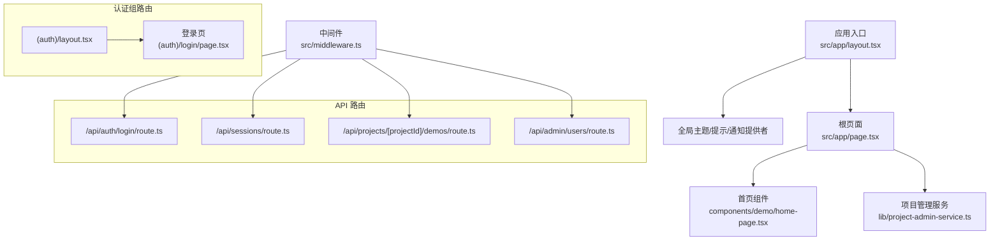
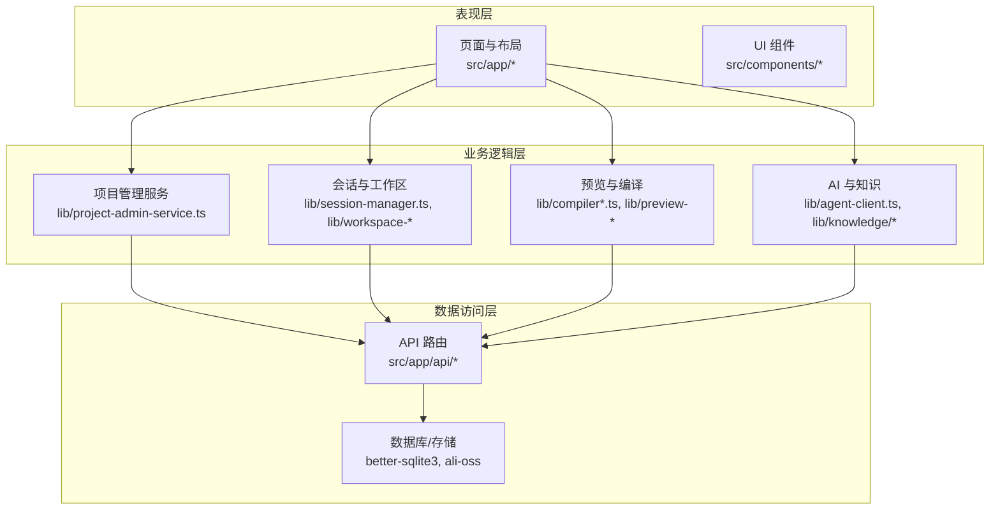
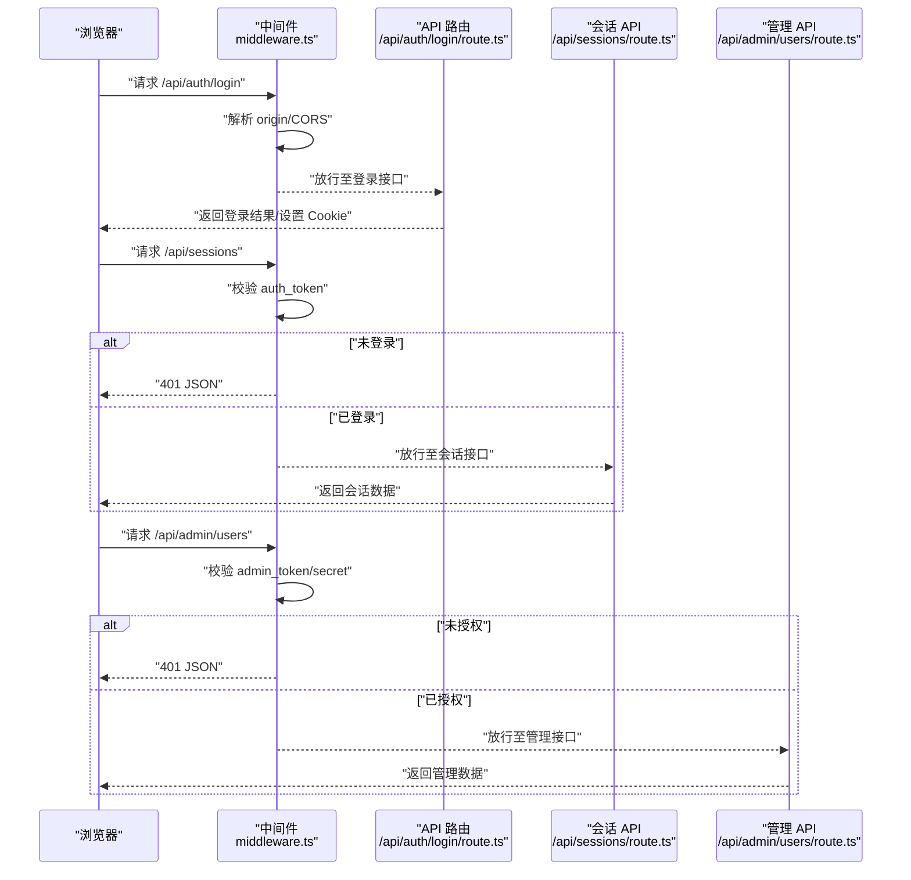
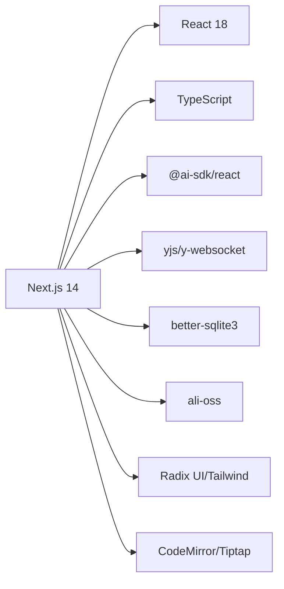

# 应用架构设计

<cite>
**本文引用的文件**   
- [packages/author-site/package.json](file://packages/author-site/package.json)
- [package.json](file://package.json)
- [packages/author-site/src/middleware.ts](file://packages/author-site/src/middleware.ts)
- [packages/author-site/src/app/layout.tsx](file://packages/author-site/src/app/layout.tsx)
- [packages/author-site/src/app/page.tsx](file://packages/author-site/src/app/page.tsx)
- [packages/author-site/src/lib/project-admin-service.ts](file://packages/author-site/src/lib/project-admin-service.ts)
- [packages/author-site/src/components/demo/home-page.tsx](file://packages/author-site/src/components/demo/home-page.tsx)
- [packages/author-site/src/app/(auth)/layout.tsx](file://packages/author-site/src/app/(auth)/layout.tsx)
- [packages/author-site/src/app/(auth)/login/page.tsx](file://packages/author-site/src/app/(auth)/login/page.tsx)
- [packages/author-site/src/app/api/auth/login/route.ts](file://packages/author-site/src/app/api/auth/login/route.ts)
- [packages/author-site/src/app/api/sessions/route.ts](file://packages/author-site/src/app/api/sessions/route.ts)
- [packages/author-site/src/app/api/projects/[projectId]/demos/route.ts](file://packages/author-site/src/app/api/projects/[projectId]/demos/route.ts)
- [packages/author-site/src/app/api/admin/users/route.ts](file://packages/author-site/src/app/api/admin/users/route.ts)
- [packages/author-site/src/lib/auth/jwt.ts](file://packages/author-site/src/lib/auth/jwt.ts)
- [packages/author-site/src/lib/admin-auth.ts](file://packages/author-site/src/lib/admin-auth.ts)
</cite>

## 目录
1. [简介](#简介)
2. [项目结构](#项目结构)
3. [核心组件](#核心组件)
4. [架构总览](#架构总览)
5. [详细组件分析](#详细组件分析)
6. [依赖分析](#依赖分析)
7. [性能考虑](#性能考虑)
8. [故障排查指南](#故障排查指南)
9. [结论](#结论)
10. [附录](#附录)

## 简介
本技术文档面向创作端应用的架构设计与实现，聚焦于基于 Next.js 14 App Router 的整体架构。内容涵盖路由组织策略、中间件机制与页面布局模式；分层架构（表现层、业务逻辑层、数据访问层）的职责划分；组件化设计与模块边界；状态管理策略（客户端与服务端同步）；错误处理、性能优化与安全考量。文档通过架构图表与实际代码路径指引，帮助开发者快速理解整体设计思路并落地实践。

## 项目结构
创作端应用位于 packages/author-site 下，采用 Next.js 14 App Router 的约定式路由：
- src/app 为路由根目录，包含全局布局、分组路由（如 (auth)）、API 路由（api/*）以及功能页面。
- src/components 按领域与职责组织 UI 组件（demo、ai-elements、ui、layout 等）。
- src/lib 提供跨层共享能力（鉴权、数据库、预览运行时、工作区、发布、AI 集成等）。
- public 存放静态资源与构建产物（如 preview-runtime）。

图表来源
- [packages/author-site/src/app/layout.tsx:1-29](file://packages/author-site/src/app/layout.tsx#L1-L29)
- [packages/author-site/src/app/page.tsx:1-11](file://packages/author-site/src/app/page.tsx#L1-L11)
- [packages/author-site/src/components/demo/home-page.tsx](file://packages/author-site/src/components/demo/home-page.tsx)
- [packages/author-site/src/lib/project-admin-service.ts](file://packages/author-site/src/lib/project-admin-service.ts)
- [packages/author-site/src/app/(auth)/layout.tsx](file://packages/author-site/src/app/(auth)/layout.tsx)
- [packages/author-site/src/app/(auth)/login/page.tsx](file://packages/author-site/src/app/(auth)/login/page.tsx)
- [packages/author-site/src/app/api/auth/login/route.ts](file://packages/author-site/src/app/api/auth/login/route.ts)
- [packages/author-site/src/app/api/sessions/route.ts](file://packages/author-site/src/app/api/sessions/route.ts)
- [packages/author-site/src/app/api/projects/[projectId]/demos/route.ts](file://packages/author-site/src/app/api/projects/[projectId]/demos/route.ts)
- [packages/author-site/src/app/api/admin/users/route.ts](file://packages/author-site/src/app/api/admin/users/route.ts)
- [packages/author-site/src/middleware.ts:1-153](file://packages/author-site/src/middleware.ts#L1-L153)

章节来源
- [packages/author-site/package.json:1-127](file://packages/author-site/package.json#L1-L127)
- [package.json:1-101](file://package.json#L1-L101)

## 核心组件
- 根布局与全局上下文
  - 根布局负责注入主题、提示、通知等全局上下文，确保全应用一致的体验与行为。
  - 参考路径：[packages/author-site/src/app/layout.tsx:1-29](file://packages/author-site/src/app/layout.tsx#L1-L29)
- 首页与数据预取
  - 根页面在服务端调用项目管理服务获取初始演示列表，并以 props 形式传递给客户端组件渲染。
  - 参考路径：
    - [packages/author-site/src/app/page.tsx:1-11](file://packages/author-site/src/app/page.tsx#L1-L11)
    - [packages/author-site/src/lib/project-admin-service.ts](file://packages/author-site/src/lib/project-admin-service.ts)
    - [packages/author-site/src/components/demo/home-page.tsx](file://packages/author-site/src/components/demo/home-page.tsx)
- 认证组路由
  - 使用 (auth) 路由组对登录、注册等页面进行统一布局与权限控制。
  - 参考路径：
    - [packages/author-site/src/app/(auth)/layout.tsx](file://packages/author-site/src/app/(auth)/layout.tsx)
    - [packages/author-site/src/app/(auth)/login/page.tsx](file://packages/author-site/src/app/(auth)/login/page.tsx)

章节来源
- [packages/author-site/src/app/layout.tsx:1-29](file://packages/author-site/src/app/layout.tsx#L1-L29)
- [packages/author-site/src/app/page.tsx:1-11](file://packages/author-site/src/app/page.tsx#L1-L11)
- [packages/author-site/src/lib/project-admin-service.ts](file://packages/author-site/src/lib/project-admin-service.ts)
- [packages/author-site/src/components/demo/home-page.tsx](file://packages/author-site/src/components/demo/home-page.tsx)
- [packages/author-site/src/app/(auth)/layout.tsx](file://packages/author-site/src/app/(auth)/layout.tsx)
- [packages/author-site/src/app/(auth)/login/page.tsx](file://packages/author-site/src/app/(auth)/login/page.tsx)

## 架构总览
创作端采用“服务端优先 + 客户端交互”的分层架构：
- 表现层：Next.js 页面与 React 组件，负责 UI 渲染与用户交互。
- 业务逻辑层：lib 下的领域服务（项目管理、会话、预览、发布、AI 等），封装复杂流程与规则。
- 数据访问层：API 路由作为后端接口，对接数据库、对象存储、外部服务等。

图表来源
- [packages/author-site/src/app/page.tsx:1-11](file://packages/author-site/src/app/page.tsx#L1-L11)
- [packages/author-site/src/lib/project-admin-service.ts](file://packages/author-site/src/lib/project-admin-service.ts)
- [packages/author-site/src/app/api/sessions/route.ts](file://packages/author-site/src/app/api/sessions/route.ts)
- [packages/author-site/src/app/api/projects/[projectId]/demos/route.ts](file://packages/author-site/src/app/api/projects/[projectId]/demos/route.ts)
- [packages/author-site/package.json:1-127](file://packages/author-site/package.json#L1-L127)

## 详细组件分析

### 路由组织与中间件机制
- 路由组织
  - 使用 App Router 的分组路由（如 (auth)）对认证相关页面进行归类，便于统一布局与守卫。
  - API 路由以 RESTful 风格组织在 src/app/api 下，按领域拆分（sessions、projects、admin、knowledge 等）。
- 中间件职责
  - 统一 CORS 处理：区分公开模块与受控 API 的跨域策略。
  - 鉴权拦截：校验 auth_token，未登录时对受保护页面重定向到登录页，对受保护 API 返回 401。
  - 管理员鉴权：验证 admin_token 或 URL secret，通过后设置安全 Cookie。
  - 匹配范围：排除静态资源与 favicon，仅对业务路径生效。

图表来源
- [packages/author-site/src/middleware.ts:1-153](file://packages/author-site/src/middleware.ts#L1-L153)
- [packages/author-site/src/app/api/auth/login/route.ts](file://packages/author-site/src/app/api/auth/login/route.ts)
- [packages/author-site/src/app/api/sessions/route.ts](file://packages/author-site/src/app/api/sessions/route.ts)
- [packages/author-site/src/app/api/admin/users/route.ts](file://packages/author-site/src/app/api/admin/users/route.ts)

章节来源
- [packages/author-site/src/middleware.ts:1-153](file://packages/author-site/src/middleware.ts#L1-L153)
- [packages/author-site/src/app/(auth)/layout.tsx](file://packages/author-site/src/app/(auth)/layout.tsx)
- [packages/author-site/src/app/(auth)/login/page.tsx](file://packages/author-site/src/app/(auth)/login/page.tsx)
- [packages/author-site/src/app/api/auth/login/route.ts](file://packages/author-site/src/app/api/auth/login/route.ts)
- [packages/author-site/src/app/api/sessions/route.ts](file://packages/author-site/src/app/api/sessions/route.ts)
- [packages/author-site/src/app/api/admin/users/route.ts](file://packages/author-site/src/app/api/admin/users/route.ts)

### 页面布局设计模式
- 根布局
  - 注入全局主题、提示、通知等上下文，保证一致的用户体验。
  - 参考路径：[packages/author-site/src/app/layout.tsx:1-29](file://packages/author-site/src/app/layout.tsx#L1-L29)
- 认证组布局
  - 将登录、注册等页面纳入统一布局，便于复用导航与样式。
  - 参考路径：[packages/author-site/src/app/(auth)/layout.tsx](file://packages/author-site/src/app/(auth)/layout.tsx)

章节来源
- [packages/author-site/src/app/layout.tsx:1-29](file://packages/author-site/src/app/layout.tsx#L1-L29)
- [packages/author-site/src/app/(auth)/layout.tsx](file://packages/author-site/src/app/(auth)/layout.tsx)

### 组件化设计与模块边界
- 组件组织
  - 按领域划分：demo（原型编辑与预览）、ai-elements（AI 对话与工具）、ui（基础控件）、layout（页面骨架）等。
  - 每个组件保持单一职责，并通过 props 暴露配置项，避免隐式耦合。
- 模块边界
  - lib 层作为业务与数据访问的边界，对外暴露稳定接口；页面与组件只依赖 lib 的导出，不直接操作底层存储或网络细节。
  - 参考路径：
    - [packages/author-site/src/components/demo/home-page.tsx](file://packages/author-site/src/components/demo/home-page.tsx)
    - [packages/author-site/src/lib/project-admin-service.ts](file://packages/author-site/src/lib/project-admin-service.ts)

章节来源
- [packages/author-site/src/components/demo/home-page.tsx](file://packages/author-site/src/components/demo/home-page.tsx)
- [packages/author-site/src/lib/project-admin-service.ts](file://packages/author-site/src/lib/project-admin-service.ts)

### 状态管理策略（客户端与服务端同步）
- 服务端状态
  - 页面在服务端拉取必要数据（如首页演示列表），以减少首屏加载时间并提升 SEO。
  - 参考路径：[packages/author-site/src/app/page.tsx:1-11](file://packages/author-site/src/app/page.tsx#L1-L11)
- 客户端状态
  - 使用 SWR 等库进行缓存与增量更新，结合 Yjs/y-websocket 实现实时协作（适用于画布/文档场景）。
  - 参考路径：[packages/author-site/package.json:1-127](file://packages/author-site/package.json#L1-L127)
- 同步机制
  - 服务端变更通过 API 触发客户端刷新；客户端本地状态变化通过 WebSocket 推送至服务端，再由服务端持久化并广播给其他客户端。

章节来源
- [packages/author-site/src/app/page.tsx:1-11](file://packages/author-site/src/app/page.tsx#L1-L11)
- [packages/author-site/package.json:1-127](file://packages/author-site/package.json#L1-L127)

### 错误处理机制
- 中间件级错误
  - 未登录访问受保护页面/API 时，分别执行重定向或返回 401 JSON，避免前端出现空白页。
  - 参考路径：[packages/author-site/src/middleware.ts:1-153](file://packages/author-site/src/middleware.ts#L1-L153)
- 业务层错误
  - 服务层返回结构化结果（ok/data/error），页面根据结果展示友好提示。
  - 参考路径：[packages/author-site/src/app/page.tsx:1-11](file://packages/author-site/src/app/page.tsx#L1-L11)

章节来源
- [packages/author-site/src/middleware.ts:1-153](file://packages/author-site/src/middleware.ts#L1-L153)
- [packages/author-site/src/app/page.tsx:1-11](file://packages/author-site/src/app/page.tsx#L1-L11)

### 安全性考虑
- 认证与授权
  - 使用 JWT 校验用户身份，中间件集中校验并设置安全 Cookie（httpOnly、secure、sameSite）。
  - 管理员访问通过 secret 参数或 admin_token 双重保障。
  - 参考路径：
    - [packages/author-site/src/middleware.ts:1-153](file://packages/author-site/src/middleware.ts#L1-L153)
    - [packages/author-site/src/lib/auth/jwt.ts](file://packages/author-site/src/lib/auth/jwt.ts)
    - [packages/author-site/src/lib/admin-auth.ts](file://packages/author-site/src/lib/admin-auth.ts)
- 跨域安全
  - 白名单允许的 origin，严格限制 OPTIONS 响应头，防止任意站点跨域调用。
  - 参考路径：[packages/author-site/src/middleware.ts:1-153](file://packages/author-site/src/middleware.ts#L1-L153)

章节来源
- [packages/author-site/src/middleware.ts:1-153](file://packages/author-site/src/middleware.ts#L1-L153)
- [packages/author-site/src/lib/auth/jwt.ts](file://packages/author-site/src/lib/auth/jwt.ts)
- [packages/author-site/src/lib/admin-auth.ts](file://packages/author-site/src/lib/admin-auth.ts)

## 依赖分析
- 关键依赖
  - 框架与运行时：next 14、react 18、typescript。
  - 协作与实时：yjs、y-websocket、y-codemirror.next。
  - 数据与存储：better-sqlite3、ali-oss。
  - AI 与编辑器：@ai-sdk/react、ai、tiptap、codemirror。
  - UI 与动画：radix-ui、framer-motion、tailwindcss。
- 依赖关系图

图表来源
- [packages/author-site/package.json:1-127](file://packages/author-site/package.json#L1-L127)

章节来源
- [packages/author-site/package.json:1-127](file://packages/author-site/package.json#L1-L127)

## 性能考虑
- 服务端渲染与数据预取
  - 在页面级别启用动态渲染策略，减少不必要的缓存，同时利用服务端数据预取降低首屏延迟。
  - 参考路径：[packages/author-site/src/app/page.tsx:1-11](file://packages/author-site/src/app/page.tsx#L1-L11)
- 缓存与增量更新
  - 使用 SWR 缓存 API 响应，结合 WebSockets 实现实时增量更新，避免全量刷新。
  - 参考路径：[packages/author-site/package.json:1-127](file://packages/author-site/package.json#L1-L127)
- 资源优化
  - 静态资源与预览运行时代码分离，按需加载；图片与缩略图通过专用 API 与 CDN 加速。
  - 参考路径：[packages/author-site/package.json:1-127](file://packages/author-site/package.json#L1-L127)

章节来源
- [packages/author-site/src/app/page.tsx:1-11](file://packages/author-site/src/app/page.tsx#L1-L11)
- [packages/author-site/package.json:1-127](file://packages/author-site/package.json#L1-L127)

## 故障排查指南
- 常见鉴权问题
  - 现象：访问受保护页面/API 被重定向或返回 401。
  - 排查：检查 auth_token 是否设置且有效；确认中间件匹配路径与 CORS 配置。
  - 参考路径：[packages/author-site/src/middleware.ts:1-153](file://packages/author-site/src/middleware.ts#L1-L153)
- 管理员后台无法访问
  - 现象：/admin 或 /api/admin/* 返回未授权。
  - 排查：确认 admin_token 或 URL secret 是否正确；检查 secure 与 sameSite 设置。
  - 参考路径：[packages/author-site/src/middleware.ts:1-153](file://packages/author-site/src/middleware.ts#L1-L153)
- 首页无数据
  - 现象：首页演示列表为空。
  - 排查：检查项目管理服务返回值结构与错误分支；查看 API 日志与数据库连接。
  - 参考路径：[packages/author-site/src/app/page.tsx:1-11](file://packages/author-site/src/app/page.tsx#L1-L11)

章节来源
- [packages/author-site/src/middleware.ts:1-153](file://packages/author-site/src/middleware.ts#L1-L153)
- [packages/author-site/src/app/page.tsx:1-11](file://packages/author-site/src/app/page.tsx#L1-L11)

## 结论
本架构以 Next.js 14 App Router 为核心，结合中间件统一治理鉴权与跨域，采用清晰的分层与组件化设计，兼顾可维护性与扩展性。通过服务端数据预取与客户端缓存/实时同步，实现了良好的用户体验与性能表现。安全方面通过 JWT、安全 Cookie 与严格的 CORS 策略保障系统稳健。建议后续持续完善错误监控、性能度量与自动化测试，进一步提升质量与交付效率。

## 附录
- 开发脚本与环境
  - 使用 pnpm workspace 管理多包，提供 dev/build/test 等脚本，支持并行启动 author、agent、viewer、screenshot 等服务。
  - 参考路径：
    - [package.json:1-101](file://package.json#L1-L101)
    - [packages/author-site/package.json:1-127](file://packages/author-site/package.json#L1-L127)

章节来源
- [package.json:1-101](file://package.json#L1-L101)
- [packages/author-site/package.json:1-127](file://packages/author-site/package.json#L1-L127)