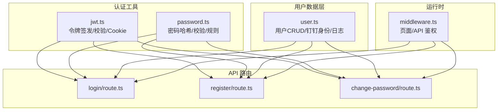
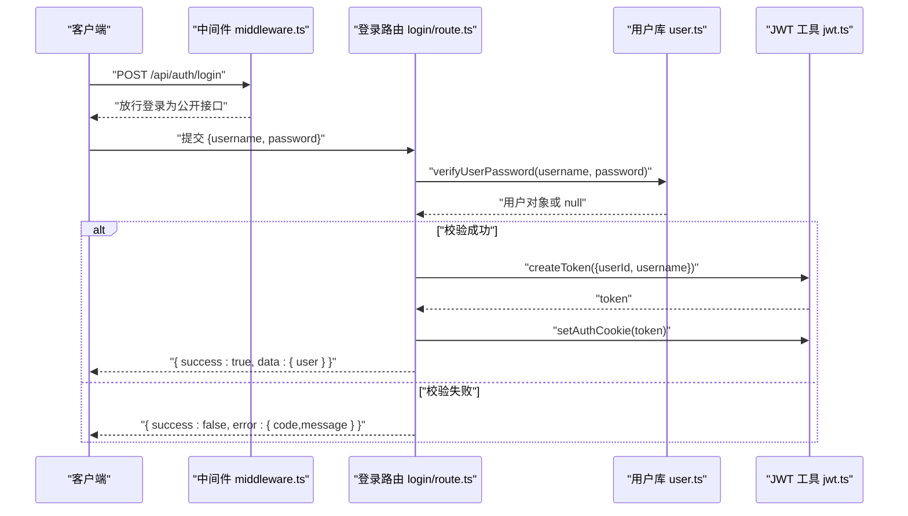
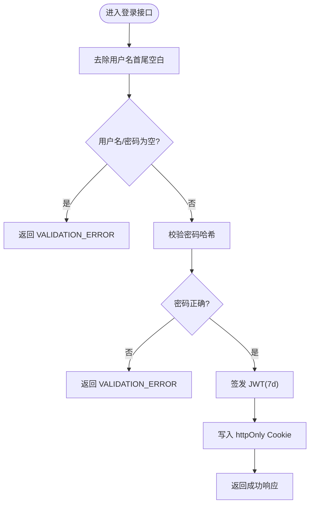
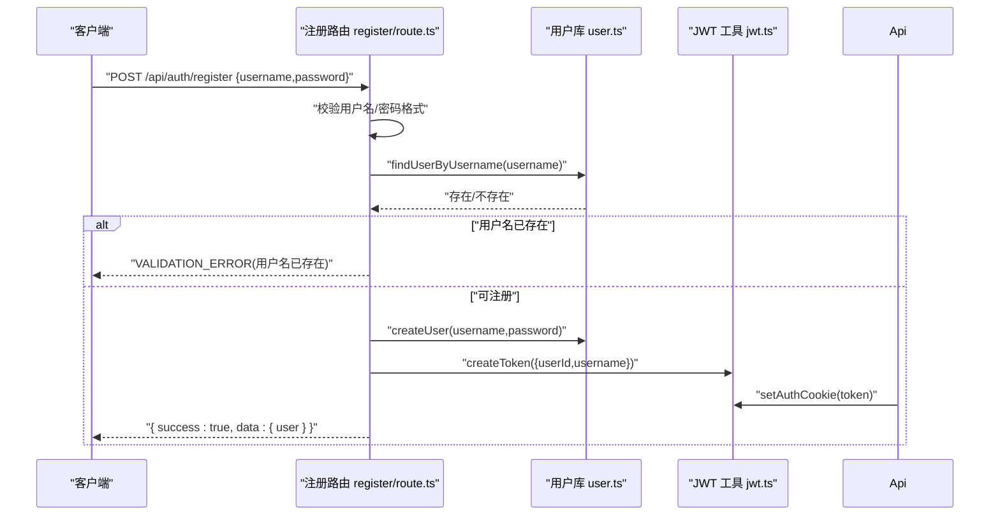
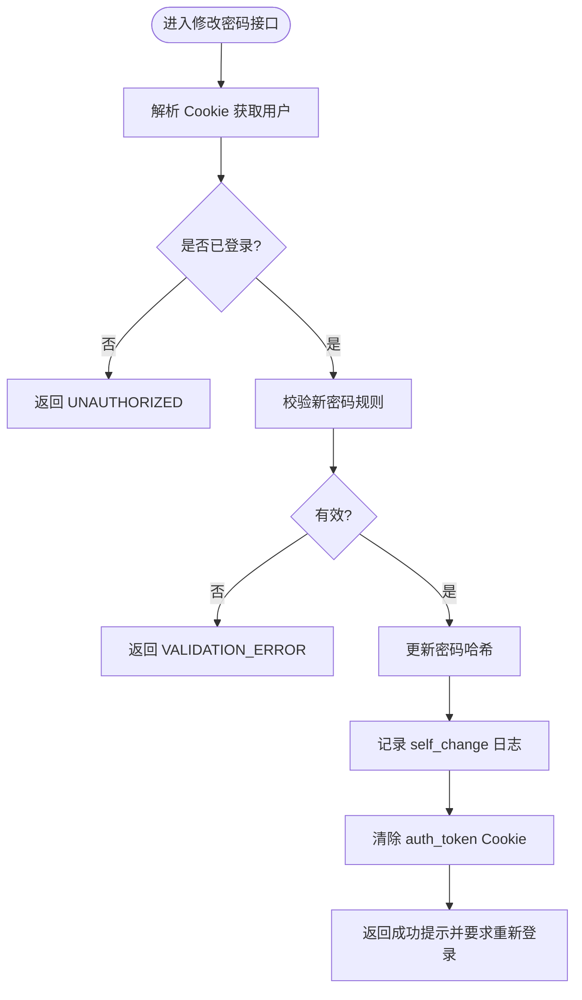
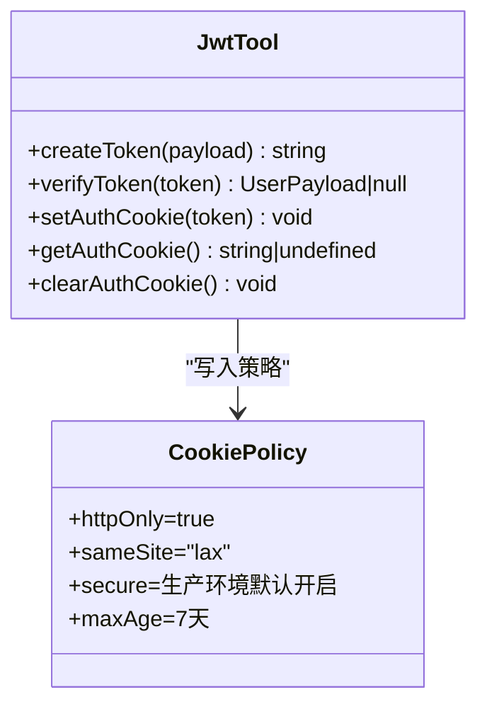
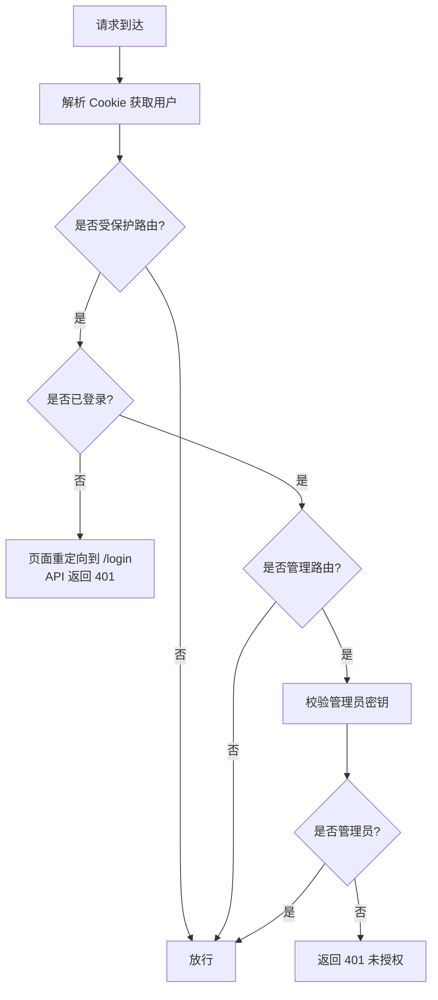
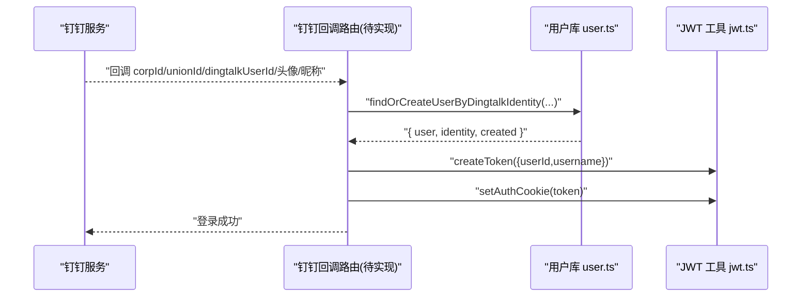
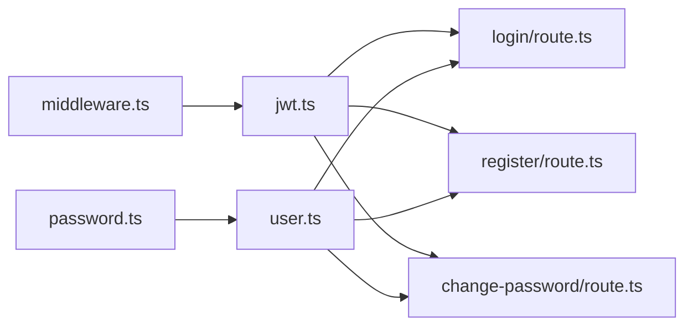

# 用户认证系统

<cite>
**本文引用的文件**   
- [packages/author-site/src/lib/auth/jwt.ts](file://packages/author-site/src/lib/auth/jwt.ts)
- [packages/author-site/src/lib/auth/password.ts](file://packages/author-site/src/lib/auth/password.ts)
- [packages/author-site/src/lib/user.ts](file://packages/author-site/src/lib/user.ts)
- [packages/author-site/src/app/api/auth/login/route.ts](file://packages/author-site/src/app/api/auth/login/route.ts)
- [packages/author-site/src/app/api/auth/register/route.ts](file://packages/author-site/src/app/api/auth/register/route.ts)
- [packages/author-site/src/app/api/auth/change-password/route.ts](file://packages/author-site/src/app/api/auth/change-password/route.ts)
- [packages/author-site/src/middleware.ts](file://packages/author-site/src/middleware.ts)
- [docs/项目文档/创作端/01-用户鉴权/技术/04_路由守卫与访问控制.md](file://docs/项目文档/创作端/01-用户鉴权/技术/04_路由守卫与访问控制.md)
</cite>

## 目录
1. [简介](#简介)
2. [项目结构](#项目结构)
3. [核心组件](#核心组件)
4. [架构总览](#架构总览)
5. [详细组件分析](#详细组件分析)
6. [依赖关系分析](#依赖关系分析)
7. [性能与安全考量](#性能与安全考量)
8. [故障排查指南](#故障排查指南)
9. [结论](#结论)
10. [附录：API 调用示例与前端使用指南](#附录api-调用示例与前端使用指南)

## 简介
本文件面向创作端的用户认证子系统，系统性梳理基于 JWT 的认证流程、会话管理、权限控制与外部认证集成（钉钉），并给出安全最佳实践、API 调用示例与前端组件使用指引。目标是帮助开发者快速理解并正确扩展认证能力。

## 项目结构
认证相关代码主要位于 author-site 包内，采用 Next.js App Router 的路由组织方式：
- 认证工具库：JWT 生成/校验、Cookie 设置；密码哈希与校验；用户名/密码规则校验
- 用户数据层：用户注册、登录校验、密码更新、钉钉身份关联与自动创建用户
- API 路由：登录、注册、修改密码等接口
- 中间件：页面与 API 的访问控制、未登录重定向与 401 响应
- 文档：路由守卫与访问控制说明、用户菜单与登出交互

图表来源
- [packages/author-site/src/lib/auth/jwt.ts:1-71](file://packages/author-site/src/lib/auth/jwt.ts#L1-L71)
- [packages/author-site/src/lib/auth/password.ts:1-35](file://packages/author-site/src/lib/auth/password.ts#L1-L35)
- [packages/author-site/src/lib/user.ts:1-339](file://packages/author-site/src/lib/user.ts#L1-L339)
- [packages/author-site/src/app/api/auth/login/route.ts](file://packages/author-site/src/app/api/auth/login/route.ts)
- [packages/author-site/src/app/api/auth/register/route.ts:1-55](file://packages/author-site/src/app/api/auth/register/route.ts#L1-L55)
- [packages/author-site/src/app/api/auth/change-password/route.ts:1-43](file://packages/author-site/src/app/api/auth/change-password/route.ts#L1-L43)
- [packages/author-site/src/middleware.ts:75-116](file://packages/author-site/src/middleware.ts#L75-L116)

章节来源
- [docs/项目文档/创作端/01-用户鉴权/技术/04_路由守卫与访问控制.md:237-307](file://docs/项目文档/创作端/01-用户鉴权/技术/04_路由守卫与访问控制.md#L237-L307)
- [docs/项目文档/创作端/01-用户鉴权/技术/04_路由守卫与访问控制.md:309-402](file://docs/项目文档/创作端/01-用户鉴权/技术/04_路由守卫与访问控制.md#L309-L402)

## 核心组件
- JWT 工具（令牌生命周期）
  - 签发：HS256，有效期 7 天，包含 userId 与 username
  - 校验：验证签名与过期时间
  - Cookie：httpOnly、sameSite=lax、生产环境默认 secure，maxAge=7 天
- 密码工具
  - bcrypt 哈希与比对，盐轮数固定
  - 用户名/密码输入校验规则
- 用户数据层
  - 本地 SQLite 存储（通过 getDb 获取连接）
  - 用户注册、按用户名/ID 查询、密码校验、密码更新、删除用户
  - 钉钉身份表维护与“按身份查找或创建用户”
  - 密码重置日志记录
- API 路由
  - 登录：校验用户名/密码、签发 Token、写入 Cookie
  - 注册：参数校验、唯一性检查、创建用户、签发 Token、写入 Cookie
  - 修改密码：校验新密码、更新、记录日志、清除当前 Cookie 强制重新登录
- 中间件
  - 页面路由：未登录重定向到 /login，携带 redirect 参数
  - API 路由：未登录返回 401 JSON
  - 管理员路由：额外校验管理员密钥

章节来源
- [packages/author-site/src/lib/auth/jwt.ts:1-71](file://packages/author-site/src/lib/auth/jwt.ts#L1-L71)
- [packages/author-site/src/lib/auth/password.ts:1-35](file://packages/author-site/src/lib/auth/password.ts#L1-L35)
- [packages/author-site/src/lib/user.ts:1-339](file://packages/author-site/src/lib/user.ts#L1-L339)
- [packages/author-site/src/app/api/auth/register/route.ts:1-55](file://packages/author-site/src/app/api/auth/register/route.ts#L1-L55)
- [packages/author-site/src/app/api/auth/change-password/route.ts:1-43](file://packages/author-site/src/app/api/auth/change-password/route.ts#L1-L43)
- [packages/author-site/src/middleware.ts:75-116](file://packages/author-site/src/middleware.ts#L75-L116)

## 架构总览
下图展示一次典型登录请求在系统中的流转过程，包括中间件校验、API 处理、数据库操作与 Cookie 写入。

图表来源
- [packages/author-site/src/middleware.ts:75-116](file://packages/author-site/src/middleware.ts#L75-L116)
- [packages/author-site/src/app/api/auth/login/route.ts](file://packages/author-site/src/app/api/auth/login/route.ts)
- [packages/author-site/src/lib/user.ts:264-281](file://packages/author-site/src/lib/user.ts#L264-L281)
- [packages/author-site/src/lib/auth/jwt.ts:16-34](file://packages/author-site/src/lib/auth/jwt.ts#L16-L34)
- [packages/author-site/src/lib/auth/jwt.ts:44-56](file://packages/author-site/src/lib/auth/jwt.ts#L44-L56)

## 详细组件分析

### 登录流程
- 输入校验：忽略首尾空白，空值时返回 VALIDATION_ERROR
- 密码校验：从数据库读取用户并比对哈希
- 签发令牌：HS256，7 天过期
- 写入 Cookie：httpOnly、sameSite=lax、生产环境 secure
- 响应体：统一包装 { success, data }

图表来源
- [packages/author-site/src/app/api/auth/login/route.ts](file://packages/author-site/src/app/api/auth/login/route.ts)
- [packages/author-site/src/lib/user.ts:264-281](file://packages/author-site/src/lib/user.ts#L264-L281)
- [packages/author-site/src/lib/auth/jwt.ts:16-34](file://packages/author-site/src/lib/auth/jwt.ts#L16-L34)
- [packages/author-site/src/lib/auth/jwt.ts:44-56](file://packages/author-site/src/lib/auth/jwt.ts#L44-L56)

章节来源
- [packages/author-site/src/app/api/auth/login/route.ts](file://packages/author-site/src/app/api/auth/login/route.ts)
- [packages/author-site/src/lib/user.ts:264-281](file://packages/author-site/src/lib/user.ts#L264-L281)
- [packages/author-site/src/lib/auth/jwt.ts:16-34](file://packages/author-site/src/lib/auth/jwt.ts#L16-L34)
- [packages/author-site/src/lib/auth/jwt.ts:44-56](file://packages/author-site/src/lib/auth/jwt.ts#L44-L56)

### 注册流程
- 参数校验：用户名长度与字符集、密码最小长度
- 唯一性检查：用户名已存在则拒绝
- 创建用户：密码以 bcrypt 哈希存储
- 签发令牌并写入 Cookie，实现“注册即登录”

图表来源
- [packages/author-site/src/app/api/auth/register/route.ts:1-55](file://packages/author-site/src/app/api/auth/register/route.ts#L1-L55)
- [packages/author-site/src/lib/user.ts:32-46](file://packages/author-site/src/lib/user.ts#L32-L46)
- [packages/author-site/src/lib/auth/jwt.ts:16-34](file://packages/author-site/src/lib/auth/jwt.ts#L16-L34)
- [packages/author-site/src/lib/auth/jwt.ts:44-56](file://packages/author-site/src/lib/auth/jwt.ts#L44-L56)

章节来源
- [packages/author-site/src/app/api/auth/register/route.ts:1-55](file://packages/author-site/src/app/api/auth/register/route.ts#L1-L55)
- [packages/author-site/src/lib/user.ts:32-46](file://packages/author-site/src/lib/user.ts#L32-L46)
- [packages/author-site/src/lib/auth/password.ts:16-34](file://packages/author-site/src/lib/auth/password.ts#L16-L34)
- [packages/author-site/src/lib/auth/jwt.ts:16-34](file://packages/author-site/src/lib/auth/jwt.ts#L16-L34)

### 密码修改与重置
- 修改密码（self_change）
  - 需已登录（从 Cookie 解析用户）
  - 校验新密码强度
  - 更新密码哈希，记录审计日志
  - 主动清除当前 Cookie，要求重新登录
- 重置密码（admin_reset）
  - 通过日志表记录 reset_by 与 reset_method
  - 可在管理侧触发后通知用户自行修改

图表来源
- [packages/author-site/src/app/api/auth/change-password/route.ts:1-43](file://packages/author-site/src/app/api/auth/change-password/route.ts#L1-L43)
- [packages/author-site/src/lib/user.ts:298-308](file://packages/author-site/src/lib/user.ts#L298-L308)
- [packages/author-site/src/lib/user.ts:325-338](file://packages/author-site/src/lib/user.ts#L325-L338)
- [packages/author-site/src/lib/auth/jwt.ts:68-70](file://packages/author-site/src/lib/auth/jwt.ts#L68-L70)

章节来源
- [packages/author-site/src/app/api/auth/change-password/route.ts:1-43](file://packages/author-site/src/app/api/auth/change-password/route.ts#L1-L43)
- [packages/author-site/src/lib/user.ts:298-308](file://packages/author-site/src/lib/user.ts#L298-L308)
- [packages/author-site/src/lib/user.ts:325-338](file://packages/author-site/src/lib/user.ts#L325-L338)

### 会话管理与令牌策略
- 令牌存储
  - 服务端写入 httpOnly Cookie，避免 XSS 直接读取
  - sameSite=lax，跨站请求受限
  - 生产环境默认启用 secure，仅 HTTPS 传输
- 过期与刷新
  - 令牌有效期 7 天
  - 当前未实现无感刷新机制；过期后需重新登录
- 登出
  - 客户端可直接清除 Cookie 完成登出
  - 服务端无法主动使令牌失效（无黑名单/撤销机制）

图表来源
- [packages/author-site/src/lib/auth/jwt.ts:16-34](file://packages/author-site/src/lib/auth/jwt.ts#L16-L34)
- [packages/author-site/src/lib/auth/jwt.ts:44-56](file://packages/author-site/src/lib/auth/jwt.ts#L44-L56)
- [packages/author-site/src/lib/auth/jwt.ts:68-70](file://packages/author-site/src/lib/auth/jwt.ts#L68-L70)

章节来源
- [packages/author-site/src/lib/auth/jwt.ts:1-71](file://packages/author-site/src/lib/auth/jwt.ts#L1-L71)
- [docs/项目文档/创作端/01-用户鉴权/技术/04_路由守卫与访问控制.md:309-374](file://docs/项目文档/创作端/01-用户鉴权/技术/04_路由守卫与访问控制.md#L309-L374)

### 权限控制体系
- 页面路由保护
  - 未登录访问受保护页面将重定向至 /login，并附带 redirect 参数
- API 路由保护
  - 未登录访问受保护 API 返回 401 JSON
- 管理员路由
  - 额外校验管理员密钥，未授权返回 401

图表来源
- [packages/author-site/src/middleware.ts:75-116](file://packages/author-site/src/middleware.ts#L75-L116)

章节来源
- [packages/author-site/src/middleware.ts:75-116](file://packages/author-site/src/middleware.ts#L75-L116)
- [docs/项目文档/创作端/01-用户鉴权/技术/04_路由守卫与访问控制.md:375-402](file://docs/项目文档/创作端/01-用户鉴权/技术/04_路由守卫与访问控制.md#L375-L402)

### 外部认证集成（钉钉）
- 身份映射
  - 根据 corpId 与 unionId/dingtalkUserId 查找已有身份
  - 若不存在，自动生成内部用户名并创建“无密码用户”，建立身份绑定
- 登录流程
  - 第三方回调中调用“按身份查找或创建用户”，成功后签发 JWT 并写入 Cookie
- 信息同步
  - 每次登录更新 name/avatar/raw 信息与 last_login_at

图表来源
- [packages/author-site/src/lib/user.ts:167-259](file://packages/author-site/src/lib/user.ts#L167-L259)
- [packages/author-site/src/lib/auth/jwt.ts:16-34](file://packages/author-site/src/lib/auth/jwt.ts#L16-L34)
- [packages/author-site/src/lib/auth/jwt.ts:44-56](file://packages/author-site/src/lib/auth/jwt.ts#L44-L56)

章节来源
- [packages/author-site/src/lib/user.ts:167-259](file://packages/author-site/src/lib/user.ts#L167-L259)

## 依赖关系分析
- 模块耦合
  - API 路由依赖 user.ts 与 jwt.ts、password.ts
  - 中间件依赖 jwt.ts 进行用户解析
  - user.ts 依赖数据库连接与密码工具
- 潜在风险
  - 当前未实现令牌刷新与撤销，存在长期活跃会话的安全面
  - 管理员鉴权依赖环境变量/密钥配置，需严格管控

图表来源
- [packages/author-site/src/lib/auth/password.ts:1-35](file://packages/author-site/src/lib/auth/password.ts#L1-L35)
- [packages/author-site/src/lib/user.ts:1-339](file://packages/author-site/src/lib/user.ts#L1-L339)
- [packages/author-site/src/lib/auth/jwt.ts:1-71](file://packages/author-site/src/lib/auth/jwt.ts#L1-L71)
- [packages/author-site/src/app/api/auth/login/route.ts](file://packages/author-site/src/app/api/auth/login/route.ts)
- [packages/author-site/src/app/api/auth/register/route.ts:1-55](file://packages/author-site/src/app/api/auth/register/route.ts#L1-L55)
- [packages/author-site/src/app/api/auth/change-password/route.ts:1-43](file://packages/author-site/src/app/api/auth/change-password/route.ts#L1-L43)
- [packages/author-site/src/middleware.ts:75-116](file://packages/author-site/src/middleware.ts#L75-L116)

## 性能与安全考量
- 性能
  - 登录/注册路径涉及一次数据库查询与一次 bcrypt 计算，建议对热点路径做缓存或限流
  - 7 天令牌可减少频繁鉴权开销，但需配合严格的网络与存储安全
- 安全
  - 密码：bcrypt 哈希，盐轮数固定，避免明文存储
  - 令牌：HS256，短期有效；httpOnly/sameSite/secure 组合降低泄露风险
  - 输入校验：用户名/密码规则在服务端强制执行
  - CSRF：sameSite=lax 提供基础防护；如需强防护，建议在敏感写操作引入双重提交或 SameSite=strict 策略
  - 审计：密码重置行为记录日志，便于追踪
  - 登出：当前为客户端清 Cookie，无法全局失效；如需更强控制，可引入令牌黑名单或短 TTL+刷新令牌

[本节为通用指导，不直接分析具体文件]

## 故障排查指南
- 常见问题
  - 登录失败：检查用户名/密码是否为空、是否存在首尾空白导致匹配失败
  - 注册失败：检查用户名唯一性与格式、密码长度
  - 修改密码失败：确认已登录、新密码是否符合规则
  - 401 未登录：检查 Cookie 是否被浏览器拦截（如跨域/非 HTTPS）、是否被清理
- 定位方法
  - 查看 API 错误码与消息（UNAUTHORIZED、VALIDATION_ERROR、INTERNAL_ERROR）
  - 核对中间件对页面与 API 的不同处理逻辑
  - 检查数据库表 users、user_dingtalk_identities、password_reset_logs 的数据一致性

章节来源
- [packages/author-site/src/app/api/auth/change-password/route.ts:1-43](file://packages/author-site/src/app/api/auth/change-password/route.ts#L1-L43)
- [packages/author-site/src/middleware.ts:75-116](file://packages/author-site/src/middleware.ts#L75-L116)

## 结论
本认证系统以 JWT + httpOnly Cookie 为核心，结合中间件实现页面与 API 的访问控制，并通过 user.ts 统一管理用户与钉钉身份。整体实现简洁清晰，适合创作端快速落地。后续可考虑引入刷新令牌、令牌黑名单与更细粒度的 RBAC 模型以提升安全性与可扩展性。

[本节为总结性内容，不直接分析具体文件]

## 附录：API 调用示例与前端使用指南

- 登录
  - 请求：POST /api/auth/login
  - 请求体：{ username, password }
  - 成功响应：{ success:true, data:{ user:{ id, username } } }
  - 失败响应：{ success:false, error:{ code, message } }
  - 注意：用户名会去除首尾空白；失败可能返回 VALIDATION_ERROR

- 注册
  - 请求：POST /api/auth/register
  - 请求体：{ username, password }
  - 成功响应：{ success:true, data:{ user:{ id, username } } }
  - 失败响应：可能返回 VALIDATION_ERROR（用户名已存在/格式不符）

- 修改密码
  - 请求：POST /api/auth/change-password
  - 请求体：{ newPassword }
  - 成功响应：{ success:true, data:{ message:"密码修改成功，请重新登录" } }
  - 失败响应：可能返回 VALIDATION_ERROR 或 UNAUTHORIZED
  - 行为：成功后清除当前 Cookie，需重新登录

- 前端组件使用
  - 登录页：表单提交调用登录 API，成功后跳转目标页
  - 注册页：表单提交调用注册 API，成功后自动登录并跳转首页
  - 用户菜单：点击登出清除 Cookie 并跳转到登录页
  - 受保护页面：未登录将被重定向到 /login?redirect=原路径
  - 受保护 API：未登录将收到 401 JSON

章节来源
- [packages/author-site/src/app/api/auth/login/route.ts](file://packages/author-site/src/app/api/auth/login/route.ts)
- [packages/author-site/src/app/api/auth/register/route.ts:1-55](file://packages/author-site/src/app/api/auth/register/route.ts#L1-L55)
- [packages/author-site/src/app/api/auth/change-password/route.ts:1-43](file://packages/author-site/src/app/api/auth/change-password/route.ts#L1-L43)
- [docs/项目文档/创作端/01-用户鉴权/技术/04_路由守卫与访问控制.md:237-307](file://docs/项目文档/创作端/01-用户鉴权/技术/04_路由守卫与访问控制.md#L237-L307)
- [docs/项目文档/创作端/01-用户鉴权/技术/04_路由守卫与访问控制.md:309-402](file://docs/项目文档/创作端/01-用户鉴权/技术/04_路由守卫与访问控制.md#L309-L402)