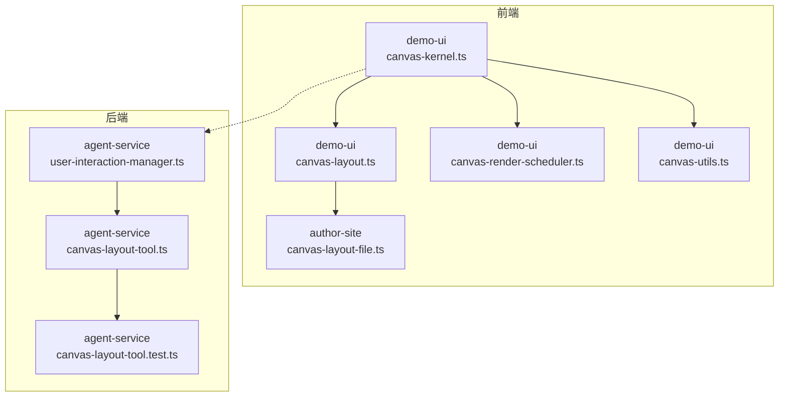
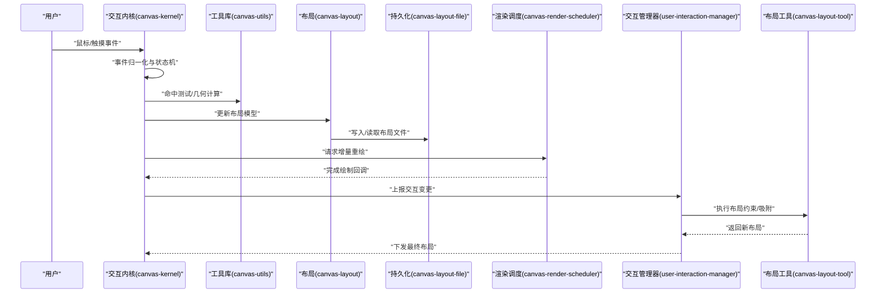
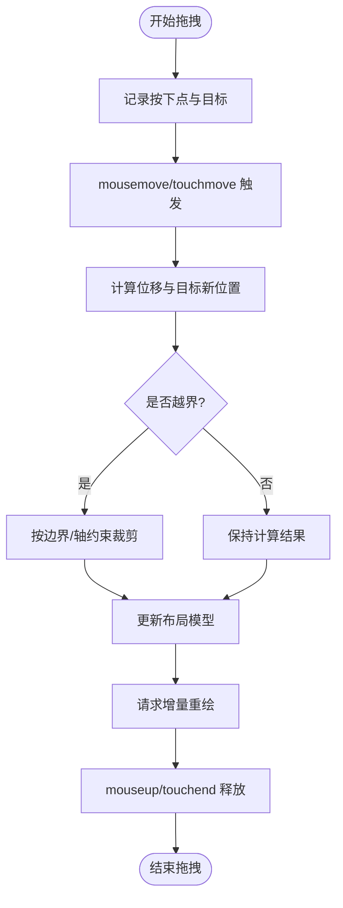
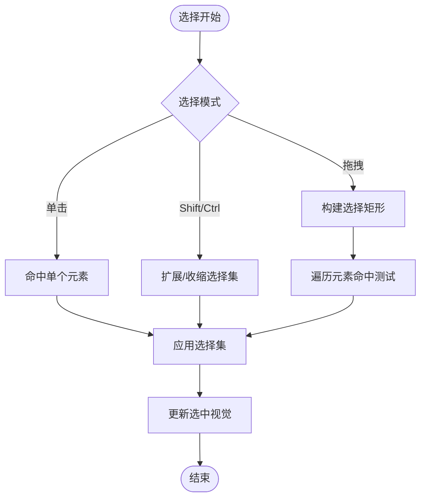
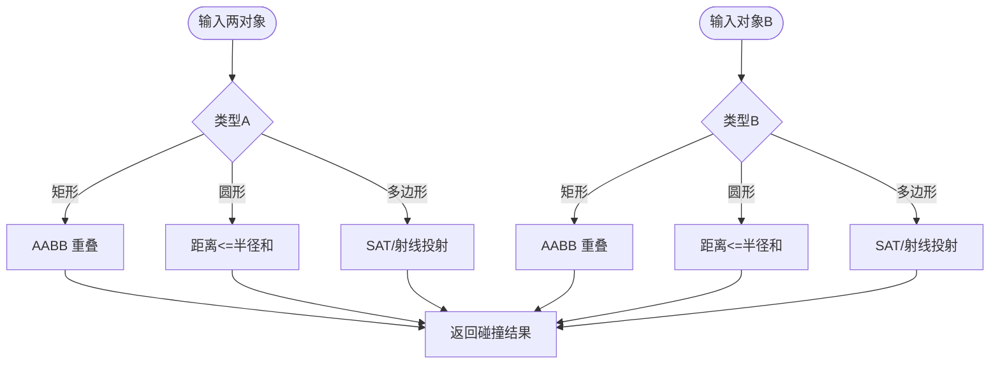
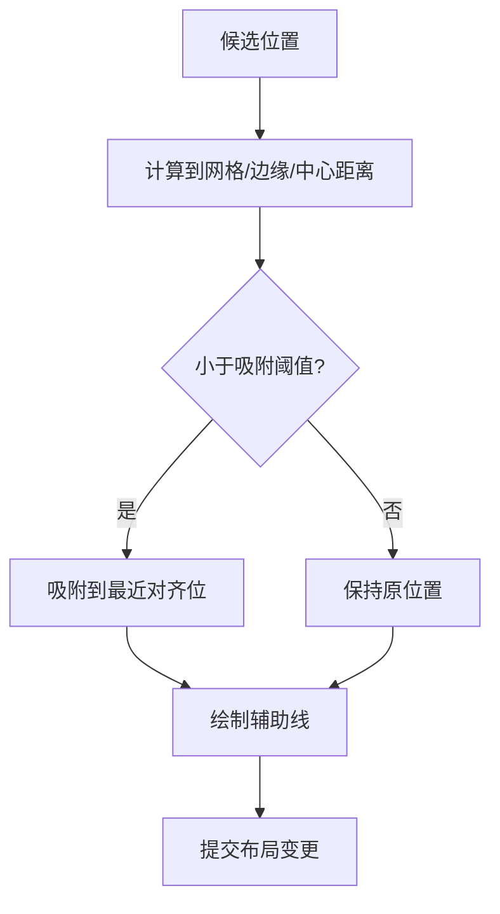
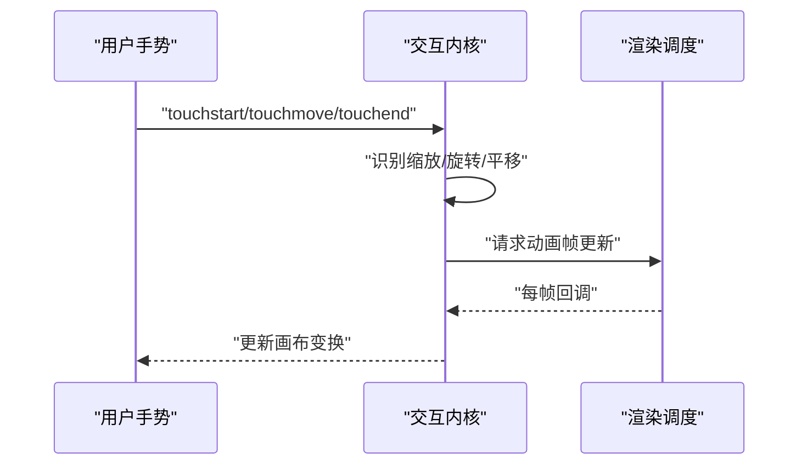
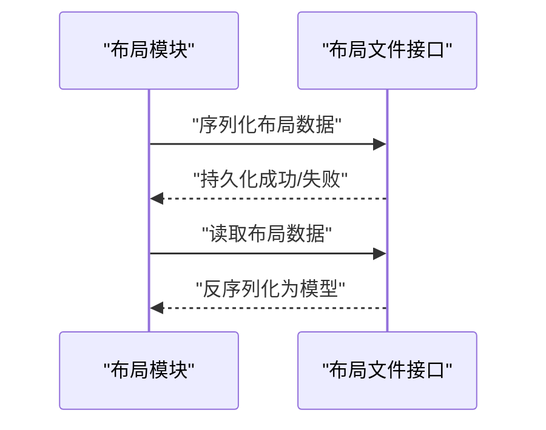
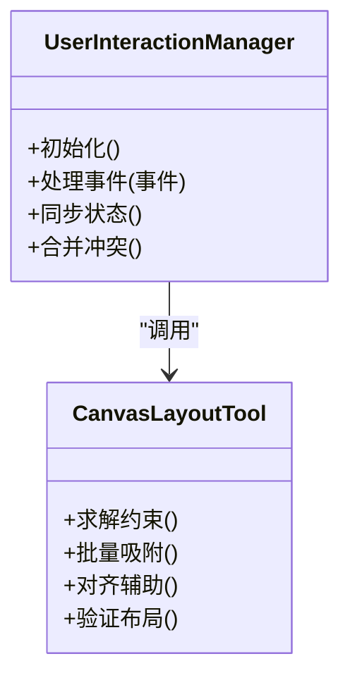
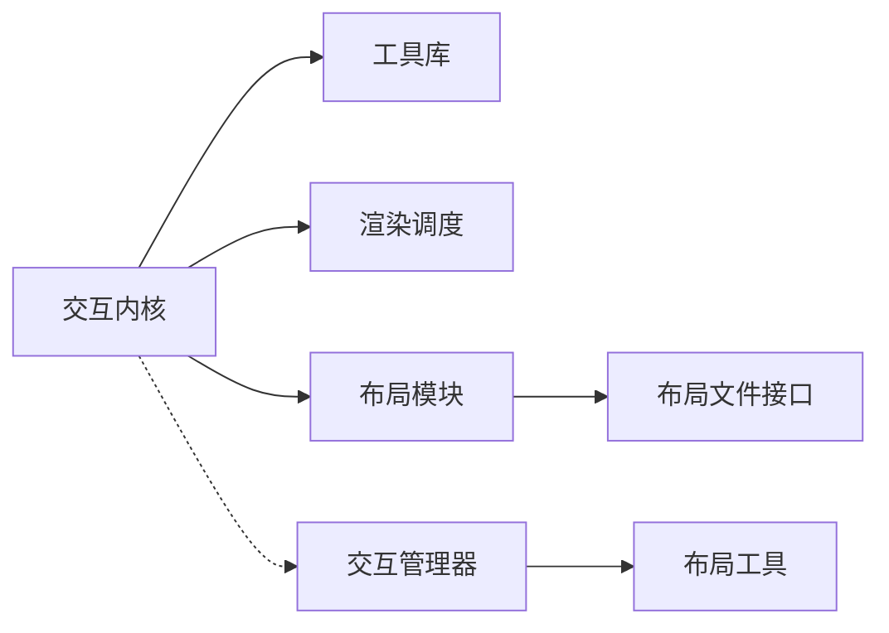

# 交互系统

<cite>
**本文引用的文件**   
- [packages/demo-ui/src/canvas-kernel.ts](file://packages/demo-ui/src/canvas-kernel.ts)
- [packages/demo-ui/src/canvas-layout.ts](file://packages/demo-ui/src/canvas-layout.ts)
- [packages/demo-ui/src/canvas-render-scheduler.ts](file://packages/demo-ui/src/canvas-render-scheduler.ts)
- [packages/demo-ui/src/canvas-utils.ts](file://packages/demo-ui/src/canvas-utils.ts)
- [packages/author-site/src/lib/canvas-layout-file.ts](file://packages/author-site/src/lib/canvas-layout-file.ts)
- [packages/agent-service/src/backends/managers/user-interaction-manager.ts](file://packages/agent-service/src/backends/managers/user-interaction-manager.ts)
- [packages/agent-service/src/backends/pi-tools/canvas-layout-tool.ts](file://packages/agent-service/src/backends/pi-tools/canvas-layout-tool.ts)
- [packages/agent-service/tests/unit/canvas-layout-tool.test.ts](file://packages/agent-service/tests/unit/canvas-layout-tool.test.ts)
</cite>

## 目录
1. [简介](#简介)
2. [项目结构](#项目结构)
3. [核心组件](#核心组件)
4. [架构总览](#架构总览)
5. [详细组件分析](#详细组件分析)
6. [依赖分析](#依赖分析)
7. [性能考虑](#性能考虑)
8. [故障排查指南](#故障排查指南)
9. [结论](#结论)
10. [附录：交互 API 参考与自定义开发指南](#附录交互-api-参考与自定义开发指南)

## 简介
本技术文档围绕画布交互系统，系统性阐述拖拽、选择、碰撞检测、吸附对齐、手势支持等关键能力，并提供完整的交互 API 参考与自定义交互开发指南。文档以仓库中 demo-ui、author-site 与 agent-service 的交互相关实现为依据，结合架构图与时序图帮助读者快速理解数据流与控制流。

## 项目结构
本项目采用多包（monorepo）组织方式，与画布交互相关的核心代码主要分布在以下位置：
- packages/demo-ui：演示与原型交互内核、布局与渲染调度、工具函数
- packages/author-site：创作端布局持久化与加载逻辑
- packages/agent-service：后端交互管理、布局工具与测试

图表来源
- [packages/demo-ui/src/canvas-kernel.ts](file://packages/demo-ui/src/canvas-kernel.ts)
- [packages/demo-ui/src/canvas-layout.ts](file://packages/demo-ui/src/canvas-layout.ts)
- [packages/demo-ui/src/canvas-render-scheduler.ts](file://packages/demo-ui/src/canvas-render-scheduler.ts)
- [packages/demo-ui/src/canvas-utils.ts](file://packages/demo-ui/src/canvas-utils.ts)
- [packages/author-site/src/lib/canvas-layout-file.ts](file://packages/author-site/src/lib/canvas-layout-file.ts)
- [packages/agent-service/src/backends/managers/user-interaction-manager.ts](file://packages/agent-service/src/backends/managers/user-interaction-manager.ts)
- [packages/agent-service/src/backends/pi-tools/canvas-layout-tool.ts](file://packages/agent-service/src/backends/pi-tools/canvas-layout-tool.ts)
- [packages/agent-service/tests/unit/canvas-layout-tool.test.ts](file://packages/agent-service/tests/unit/canvas-layout-tool.test.ts)

章节来源
- [packages/demo-ui/src/canvas-kernel.ts](file://packages/demo-ui/src/canvas-kernel.ts)
- [packages/demo-ui/src/canvas-layout.ts](file://packages/demo-ui/src/canvas-layout.ts)
- [packages/demo-ui/src/canvas-render-scheduler.ts](file://packages/demo-ui/src/canvas-render-scheduler.ts)
- [packages/demo-ui/src/canvas-utils.ts](file://packages/demo-ui/src/canvas-utils.ts)
- [packages/author-site/src/lib/canvas-layout-file.ts](file://packages/author-site/src/lib/canvas-layout-file.ts)
- [packages/agent-service/src/backends/managers/user-interaction-manager.ts](file://packages/agent-service/src/backends/managers/user-interaction-manager.ts)
- [packages/agent-service/src/backends/pi-tools/canvas-layout-tool.ts](file://packages/agent-service/src/backends/pi-tools/canvas-layout-tool.ts)
- [packages/agent-service/tests/unit/canvas-layout-tool.test.ts](file://packages/agent-service/tests/unit/canvas-layout-tool.test.ts)

## 核心组件
- 交互内核（Canvas Kernel）
  - 职责：统一事件分发、状态机驱动、选择与拖拽生命周期管理、与渲染调度器协作更新视图。
  - 关键点：鼠标/触摸事件归一化、拖拽状态机（idle/pressing/dragging/resizing/rotating）、选择集合维护、边界与吸附计算。
- 布局与持久化（Layout & Persistence）
  - 职责：解析/生成布局数据、与 author-site 的布局文件读写对接、提供布局校验与转换。
- 渲染调度（Render Scheduler）
  - 职责：批处理重绘、增量更新、动画帧节流、避免抖动与重复绘制。
- 工具库（Utils）
  - 职责：几何计算、命中测试、坐标变换、吸附阈值、网格对齐、碰撞检测辅助。
- 后端交互管理（User Interaction Manager）
  - 职责：跨会话交互状态同步、操作合并与冲突解决、与布局工具协同。
- 布局工具（Canvas Layout Tool）
  - 职责：布局约束求解、对齐与吸附策略、批量布局调整、单元测试覆盖。

章节来源
- [packages/demo-ui/src/canvas-kernel.ts](file://packages/demo-ui/src/canvas-kernel.ts)
- [packages/demo-ui/src/canvas-layout.ts](file://packages/demo-ui/src/canvas-layout.ts)
- [packages/demo-ui/src/canvas-render-scheduler.ts](file://packages/demo-ui/src/canvas-render-scheduler.ts)
- [packages/demo-ui/src/canvas-utils.ts](file://packages/demo-ui/src/canvas-utils.ts)
- [packages/author-site/src/lib/canvas-layout-file.ts](file://packages/author-site/src/lib/canvas-layout-file.ts)
- [packages/agent-service/src/backends/managers/user-interaction-manager.ts](file://packages/agent-service/src/backends/managers/user-interaction-manager.ts)
- [packages/agent-service/src/backends/pi-tools/canvas-layout-tool.ts](file://packages/agent-service/src/backends/pi-tools/canvas-layout-tool.ts)

## 架构总览
交互系统遵循“事件→状态→布局→渲染”的单向数据流，前后端通过交互管理器进行状态同步。

图表来源
- [packages/demo-ui/src/canvas-kernel.ts](file://packages/demo-ui/src/canvas-kernel.ts)
- [packages/demo-ui/src/canvas-utils.ts](file://packages/demo-ui/src/canvas-utils.ts)
- [packages/demo-ui/src/canvas-layout.ts](file://packages/demo-ui/src/canvas-layout.ts)
- [packages/author-site/src/lib/canvas-layout-file.ts](file://packages/author-site/src/lib/canvas-layout-file.ts)
- [packages/demo-ui/src/canvas-render-scheduler.ts](file://packages/demo-ui/src/canvas-render-scheduler.ts)
- [packages/agent-service/src/backends/managers/user-interaction-manager.ts](file://packages/agent-service/src/backends/managers/user-interaction-manager.ts)
- [packages/agent-service/src/backends/pi-tools/canvas-layout-tool.ts](file://packages/agent-service/src/backends/pi-tools/canvas-layout-tool.ts)

## 详细组件分析

### 拖拽子系统
- 事件监听与归一化
  - 捕获 mousedown/mousemove/mouseup 与 touchstart/touchmove/touchend，统一为指针事件语义。
  - 记录初始位置、偏移量、目标元素与变换中心点。
- 拖拽状态管理
  - 状态机：空闲→按下→拖拽→释放；支持多选拖拽与组合变换。
  - 防抖与节流：在 move 阶段对高频事件进行节流，降低渲染压力。
- 边界检测
  - 基于视口与画布边界限制移动范围，支持锁定轴与最小尺寸约束。
- 与渲染联动
  - 拖拽过程中仅更新脏区域，交由渲染调度器批量提交。

图表来源
- [packages/demo-ui/src/canvas-kernel.ts](file://packages/demo-ui/src/canvas-kernel.ts)
- [packages/demo-ui/src/canvas-utils.ts](file://packages/demo-ui/src/canvas-utils.ts)
- [packages/demo-ui/src/canvas-render-scheduler.ts](file://packages/demo-ui/src/canvas-render-scheduler.ts)

章节来源
- [packages/demo-ui/src/canvas-kernel.ts](file://packages/demo-ui/src/canvas-kernel.ts)
- [packages/demo-ui/src/canvas-utils.ts](file://packages/demo-ui/src/canvas-utils.ts)
- [packages/demo-ui/src/canvas-render-scheduler.ts](file://packages/demo-ui/src/canvas-render-scheduler.ts)

### 选择系统
- 单选
  - 点击命中测试，清空其他选中项并高亮当前目标。
- 多选
  - Shift/Ctrl 配合点击扩展或收缩选择集；支持框选矩形区域。
- 框选
  - 从按下点到当前点构建选择矩形，遍历元素进行包含性判断。
- 视觉反馈
  - 选中边框、锚点、组合框与计数提示。

图表来源
- [packages/demo-ui/src/canvas-kernel.ts](file://packages/demo-ui/src/canvas-kernel.ts)
- [packages/demo-ui/src/canvas-utils.ts](file://packages/demo-ui/src/canvas-utils.ts)

章节来源
- [packages/demo-ui/src/canvas-kernel.ts](file://packages/demo-ui/src/canvas-kernel.ts)
- [packages/demo-ui/src/canvas-utils.ts](file://packages/demo-ui/src/canvas-utils.ts)

### 碰撞检测算法
- 矩形碰撞
  - AABB 重叠判定，用于选择框、吸附辅助线与拖拽预览。
- 圆形碰撞
  - 距离比较，适用于圆形手柄或图标热点。
- 复杂形状
  - 基于路径/多边形的分离轴定理（SAT）或像素级命中（按需启用）。
- 性能优化
  - 空间索引（四叉树/网格）减少 O(n^2) 遍历；分层剔除不可见对象。

图表来源
- [packages/demo-ui/src/canvas-utils.ts](file://packages/demo-ui/src/canvas-utils.ts)

章节来源
- [packages/demo-ui/src/canvas-utils.ts](file://packages/demo-ui/src/canvas-utils.ts)

### 吸附对齐功能
- 网格对齐
  - 将目标位置对齐到网格线，支持动态网格大小与吸附阈值。
- 智能吸附
  - 基于最近边/角/中心的距离阈值自动吸附，支持水平/垂直/对角方向。
- 对齐辅助线
  - 当接近对齐条件时绘制临时辅助线，提升定位精度与一致性。
- 布局工具协同
  - 后端布局工具负责批量吸附与约束求解，确保多对象一致性与稳定性。

图表来源
- [packages/demo-ui/src/canvas-utils.ts](file://packages/demo-ui/src/canvas-utils.ts)
- [packages/agent-service/src/backends/pi-tools/canvas-layout-tool.ts](file://packages/agent-service/src/backends/pi-tools/canvas-layout-tool.ts)

章节来源
- [packages/demo-ui/src/canvas-utils.ts](file://packages/demo-ui/src/canvas-utils.ts)
- [packages/agent-service/src/backends/pi-tools/canvas-layout-tool.ts](file://packages/agent-service/src/backends/pi-tools/canvas-layout-tool.ts)

### 手势支持（缩放、旋转、平移）
- 缩放
  - 双指捏合或滚轮缩放，以焦点为中心进行变换，支持最小/最大缩放比。
- 旋转
  - 双指旋转或拖拽旋转手柄，角度增量平滑过渡。
- 平移
  - 单指/单键+拖拽平移画布，结合惯性滚动与边界回弹。
- 动画效果
  - 使用渲染调度器进行插值动画，保证 60fps 流畅体验。

图表来源
- [packages/demo-ui/src/canvas-kernel.ts](file://packages/demo-ui/src/canvas-kernel.ts)
- [packages/demo-ui/src/canvas-render-scheduler.ts](file://packages/demo-ui/src/canvas-render-scheduler.ts)

章节来源
- [packages/demo-ui/src/canvas-kernel.ts](file://packages/demo-ui/src/canvas-kernel.ts)
- [packages/demo-ui/src/canvas-render-scheduler.ts](file://packages/demo-ui/src/canvas-render-scheduler.ts)

### 布局与持久化
- 布局文件读写
  - 作者站点通过布局文件接口加载/保存布局，确保跨会话一致性。
- 布局校验与转换
  - 版本兼容、字段缺失回填、冗余清理。
- 与交互联动
  - 拖拽/吸附完成后落盘，支持撤销/重做与并发合并。

图表来源
- [packages/author-site/src/lib/canvas-layout-file.ts](file://packages/author-site/src/lib/canvas-layout-file.ts)
- [packages/demo-ui/src/canvas-layout.ts](file://packages/demo-ui/src/canvas-layout.ts)

章节来源
- [packages/author-site/src/lib/canvas-layout-file.ts](file://packages/author-site/src/lib/canvas-layout-file.ts)
- [packages/demo-ui/src/canvas-layout.ts](file://packages/demo-ui/src/canvas-layout.ts)

### 后端交互管理与布局工具
- 交互管理器
  - 聚合用户交互事件，维护会话级选择与拖拽状态，协调多端同步。
- 布局工具
  - 提供布局约束求解、批量吸附、对齐与间距均衡，具备单元测试保障。

图表来源
- [packages/agent-service/src/backends/managers/user-interaction-manager.ts](file://packages/agent-service/src/backends/managers/user-interaction-manager.ts)
- [packages/agent-service/src/backends/pi-tools/canvas-layout-tool.ts](file://packages/agent-service/src/backends/pi-tools/canvas-layout-tool.ts)
- [packages/agent-service/tests/unit/canvas-layout-tool.test.ts](file://packages/agent-service/tests/unit/canvas-layout-tool.test.ts)

章节来源
- [packages/agent-service/src/backends/managers/user-interaction-manager.ts](file://packages/agent-service/src/backends/managers/user-interaction-manager.ts)
- [packages/agent-service/src/backends/pi-tools/canvas-layout-tool.ts](file://packages/agent-service/src/backends/pi-tools/canvas-layout-tool.ts)
- [packages/agent-service/tests/unit/canvas-layout-tool.test.ts](file://packages/agent-service/tests/unit/canvas-layout-tool.test.ts)

## 依赖分析
- 耦合关系
  - 交互内核强依赖工具库与渲染调度器；布局模块与持久化接口解耦。
  - 后端交互管理器与布局工具形成“控制-求解”关系，便于扩展新的布局策略。
- 外部依赖
  - 浏览器事件模型、Canvas/WebGL 渲染管线（由上层框架封装）。
- 潜在循环依赖
  - 通过工具库抽象几何与命中测试，避免内核与布局直接互相引用。

图表来源
- [packages/demo-ui/src/canvas-kernel.ts](file://packages/demo-ui/src/canvas-kernel.ts)
- [packages/demo-ui/src/canvas-utils.ts](file://packages/demo-ui/src/canvas-utils.ts)
- [packages/demo-ui/src/canvas-render-scheduler.ts](file://packages/demo-ui/src/canvas-render-scheduler.ts)
- [packages/demo-ui/src/canvas-layout.ts](file://packages/demo-ui/src/canvas-layout.ts)
- [packages/author-site/src/lib/canvas-layout-file.ts](file://packages/author-site/src/lib/canvas-layout-file.ts)
- [packages/agent-service/src/backends/managers/user-interaction-manager.ts](file://packages/agent-service/src/backends/managers/user-interaction-manager.ts)
- [packages/agent-service/src/backends/pi-tools/canvas-layout-tool.ts](file://packages/agent-service/src/backends/pi-tools/canvas-layout-tool.ts)

章节来源
- [packages/demo-ui/src/canvas-kernel.ts](file://packages/demo-ui/src/canvas-kernel.ts)
- [packages/demo-ui/src/canvas-utils.ts](file://packages/demo-ui/src/canvas-utils.ts)
- [packages/demo-ui/src/canvas-render-scheduler.ts](file://packages/demo-ui/src/canvas-render-scheduler.ts)
- [packages/demo-ui/src/canvas-layout.ts](file://packages/demo-ui/src/canvas-layout.ts)
- [packages/author-site/src/lib/canvas-layout-file.ts](file://packages/author-site/src/lib/canvas-layout-file.ts)
- [packages/agent-service/src/backends/managers/user-interaction-manager.ts](file://packages/agent-service/src/backends/managers/user-interaction-manager.ts)
- [packages/agent-service/src/backends/pi-tools/canvas-layout-tool.ts](file://packages/agent-service/src/backends/pi-tools/canvas-layout-tool.ts)

## 性能考虑
- 事件节流与去抖：在拖拽/缩放等高频率事件中降低处理开销。
- 增量渲染：仅重绘受影响的区域，避免整屏刷新。
- 空间索引：大规模对象时使用四叉树/网格加速命中测试与碰撞检测。
- 动画帧合并：利用渲染调度器合并多次状态变更，减少不必要的绘制。
- 内存与对象复用：重用几何对象与中间变量，减少 GC 压力。

[本节为通用指导，不直接分析具体文件]

## 故障排查指南
- 拖拽卡顿或掉帧
  - 检查是否在 move 回调中进行昂贵计算；确认渲染调度器是否开启增量更新。
- 选择异常或漏选
  - 验证命中测试与选择矩形构建逻辑；检查层级与可见性过滤。
- 吸附不准确
  - 调整吸附阈值与网格步长；确认坐标变换与屏幕坐标转换是否正确。
- 布局不同步
  - 核对持久化接口返回值与错误码；检查后端布局工具的约束求解是否抛出异常。
- 手势冲突
  - 区分单指/双指事件；确保缩放/旋转/平移的优先级与拦截策略合理。

章节来源
- [packages/demo-ui/src/canvas-kernel.ts](file://packages/demo-ui/src/canvas-kernel.ts)
- [packages/demo-ui/src/canvas-utils.ts](file://packages/demo-ui/src/canvas-utils.ts)
- [packages/demo-ui/src/canvas-render-scheduler.ts](file://packages/demo-ui/src/canvas-render-scheduler.ts)
- [packages/author-site/src/lib/canvas-layout-file.ts](file://packages/author-site/src/lib/canvas-layout-file.ts)
- [packages/agent-service/src/backends/managers/user-interaction-manager.ts](file://packages/agent-service/src/backends/managers/user-interaction-manager.ts)
- [packages/agent-service/src/backends/pi-tools/canvas-layout-tool.ts](file://packages/agent-service/src/backends/pi-tools/canvas-layout-tool.ts)

## 结论
本交互系统以“事件→状态→布局→渲染”的清晰链路为核心，结合工具库与后端布局工具，实现了稳定高效的拖拽、选择、碰撞检测、吸附对齐与手势支持。通过渲染调度与空间索引等优化手段，系统在大规模场景下仍保持良好性能。建议在此基础上继续完善可观测性与自动化测试，进一步提升可维护性与可扩展性。

[本节为总结，不直接分析具体文件]

## 附录：交互 API 参考与自定义开发指南

### 交互 API 参考（概念性）
- 事件注册与销毁
  - 注册全局/局部事件监听器，支持指针事件与触摸事件。
  - 提供销毁方法以避免内存泄漏。
- 选择 API
  - 设置/获取选择集合；支持单选、多选与框选模式切换。
- 拖拽 API
  - 启动/停止拖拽；设置拖拽目标、约束与回调。
- 吸附与对齐 API
  - 配置网格大小、吸附阈值与辅助线显示开关。
- 手势 API
  - 启用/禁用缩放、旋转、平移；设置缩放范围与旋转中心。
- 渲染调度 API
  - 请求重绘、批量提交、帧回调订阅。

[本节为概念性说明，不直接分析具体文件]

### 自定义交互开发指南
- 步骤概览
  - 定义交互上下文与状态；实现事件处理器；接入布局更新；订阅渲染回调。
- 最佳实践
  - 将几何与命中测试下沉至工具库；避免在事件回调中直接操作 DOM。
  - 使用状态机管理复杂交互流程；对副作用进行幂等设计。
  - 为关键路径编写单元测试与端到端用例。
- 示例路径
  - 参考现有内核与布局工具的实现思路，扩展新的交互行为（如自由手绘、连线拖拽等）。

章节来源
- [packages/demo-ui/src/canvas-kernel.ts](file://packages/demo-ui/src/canvas-kernel.ts)
- [packages/demo-ui/src/canvas-layout.ts](file://packages/demo-ui/src/canvas-layout.ts)
- [packages/demo-ui/src/canvas-render-scheduler.ts](file://packages/demo-ui/src/canvas-render-scheduler.ts)
- [packages/demo-ui/src/canvas-utils.ts](file://packages/demo-ui/src/canvas-utils.ts)
- [packages/agent-service/src/backends/pi-tools/canvas-layout-tool.ts](file://packages/agent-service/src/backends/pi-tools/canvas-layout-tool.ts)