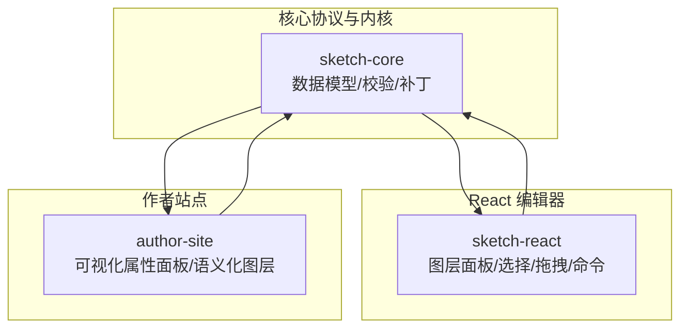
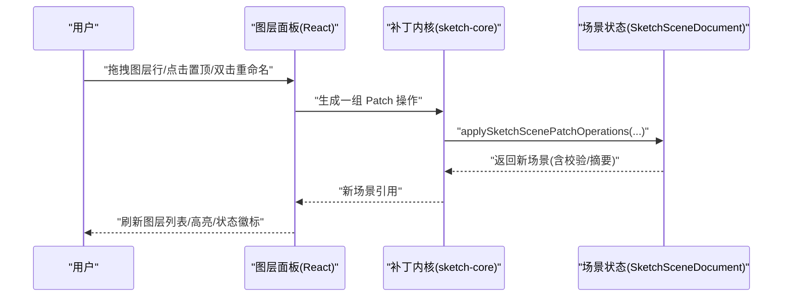
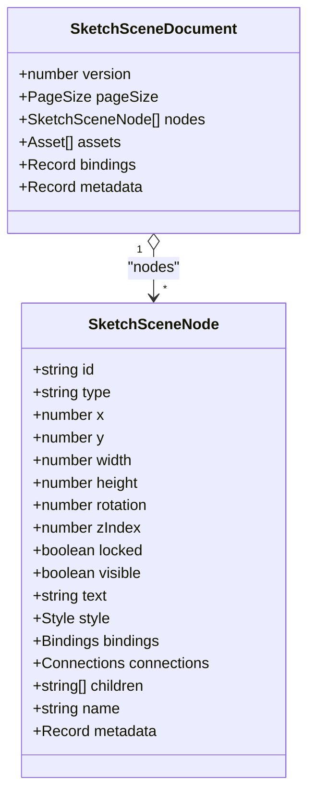
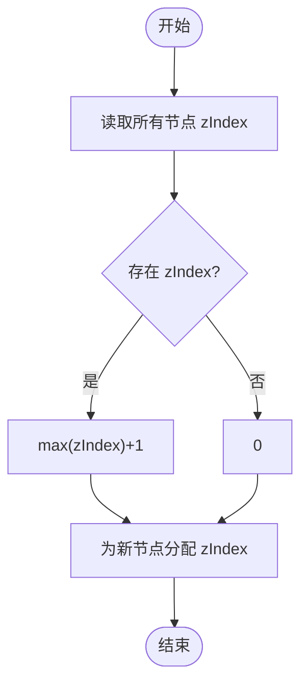
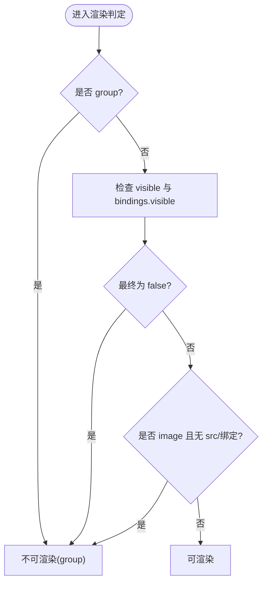
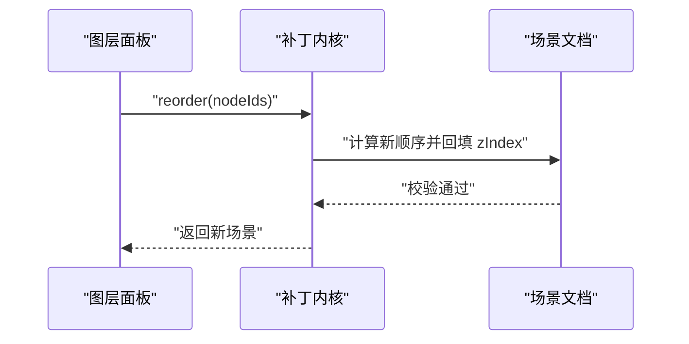
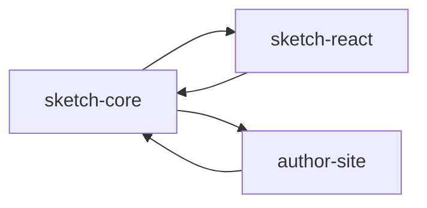

# 图层管理系统

<cite>
**本文引用的文件**   
- [packages/sketch-core/src/index.ts](file://packages/sketch-core/src/index.ts)
- [packages/sketch-react/src/index.tsx](file://packages/sketch-react/src/index.tsx)
- [packages/author-site/src/app/demo/[id]/edit/components/VisualPropertyPanel.tsx](file://packages/author-site/src/app/demo/[id]/edit/components/VisualPropertyPanel.tsx)
- [packages/sketch-react/tests/sketch-react.test.tsx](file://packages/sketch-react/tests/sketch-react.test.tsx)
</cite>

## 目录
1. [简介](#简介)
2. [项目结构](#项目结构)
3. [核心组件](#核心组件)
4. [架构总览](#架构总览)
5. [详细组件分析](#详细组件分析)
6. [依赖关系分析](#依赖关系分析)
7. [性能考量](#性能考量)
8. [故障排查指南](#故障排查指南)
9. [结论](#结论)
10. [附录](#附录)

## 简介
本技术文档围绕“图层管理系统”展开，聚焦以下目标：
- 深入解释图层数据模型设计（属性、层级与依赖）
- 详细说明渲染顺序控制（z-index、遮挡与优先级）
- 描述可见性控制机制（显示/隐藏、透明度、条件渲染）
- 解释选择状态管理（选中同步、批量操作、持久化）
- 提供图层操作 API（增删改查、移动排序、分组管理）
- 给出性能优化策略与扩展开发指南

该系统基于 Sketch Scene 协议，通过不可变补丁（patch）驱动场景更新，并在 React 层提供图层面板、搜索筛选、拖拽排序等交互能力。

## 项目结构
与图层管理直接相关的代码主要分布在三个包中：
- sketch-core：定义场景协议、节点类型、样式、绑定、连接、校验与补丁应用等核心逻辑
- sketch-react：在 React 中实现编辑器 UI 与交互（包括图层面板、选择、拖拽、右键菜单等）
- author-site：在可视化属性面板中对“视觉图层”进行语义化展示与过滤

图表来源
- [packages/sketch-core/src/index.ts:1-200](file://packages/sketch-core/src/index.ts#L1-L200)
- [packages/sketch-react/src/index.tsx:3458-3576](file://packages/sketch-react/src/index.tsx#L3458-L3576)
- [packages/author-site/src/app/demo/[id]/edit/components/VisualPropertyPanel.tsx](file://packages/author-site/src/app/demo/[id]/edit/components/VisualPropertyPanel.tsx#L390-L478)

章节来源
- [packages/sketch-core/src/index.ts:1-200](file://packages/sketch-core/src/index.ts#L1-L200)
- [packages/sketch-react/src/index.tsx:3458-3576](file://packages/sketch-react/src/index.tsx#L3458-L3576)
- [packages/author-site/src/app/demo/[id]/edit/components/VisualPropertyPanel.tsx](file://packages/author-site/src/app/demo/[id]/edit/components/VisualPropertyPanel.tsx#L390-L478)

## 核心组件
- 数据模型与协议
  - 节点类型、样式、文本样式片段、绑定、连接器锚点、组结构、页面尺寸等
  - 文档级字段包含 nodes、assets、bindings、metadata
- 补丁系统
  - 统一的增量变更操作集合（add/update/delete/duplicate/reorder/group/ungroup/set-locked/set-visible/bind/unbind）
  - 应用补丁后自动校验并生成摘要
- 图层面板（React）
  - 按视觉层级排序、搜索与类型筛选
  - 支持拖拽重排、右键菜单、锁定/显隐切换、成组/解组
- 可视化属性面板（Author Site）
  - 对“视觉图层”进行语义化命名与目的标注，辅助编辑者理解布局意图

章节来源
- [packages/sketch-core/src/index.ts:135-220](file://packages/sketch-core/src/index.ts#L135-L220)
- [packages/sketch-core/src/index.ts:850-1034](file://packages/sketch-core/src/index.ts#L850-L1034)
- [packages/sketch-react/src/index.tsx:3458-3576](file://packages/sketch-react/src/index.tsx#L3458-L3576)
- [packages/author-site/src/app/demo/[id]/edit/components/VisualPropertyPanel.tsx](file://packages/author-site/src/app/demo/[id]/edit/components/VisualPropertyPanel.tsx#L390-L478)

## 架构总览
下图展示了从用户交互到数据模型再到渲染的关键路径：

图表来源
- [packages/sketch-react/src/index.tsx:3458-3576](file://packages/sketch-react/src/index.tsx#L3458-L3576)
- [packages/sketch-core/src/index.ts:850-1034](file://packages/sketch-core/src/index.ts#L850-L1034)

## 详细组件分析

### 数据模型与层级关系
- 节点基础属性
  - id、type、x/y/width/height、rotation、zIndex、locked、visible、text、style、bindings、connections、children、name、metadata
- 层级与依赖
  - children 用于 group 表达父子关系；connections 用于 line/arrow 的端点绑定
  - 校验器确保无环子引用、连接目标合法、ID 唯一、几何有效、样式与绑定合法
- 运行时可见性与资源解析
  - bindings.visible 可动态控制可见性；image 节点需 src 或绑定 src 才可渲染

图表来源
- [packages/sketch-core/src/index.ts:135-176](file://packages/sketch-core/src/index.ts#L135-L176)

章节来源
- [packages/sketch-core/src/index.ts:135-176](file://packages/sketch-core/src/index.ts#L135-L176)
- [packages/sketch-core/src/index.ts:581-848](file://packages/sketch-core/src/index.ts#L581-L848)

### 渲染顺序与 z-index 管理
- 视觉层级由节点的 zIndex 决定；未设置时默认 0
- 新增节点自动分配最大 zIndex+1；reorder 会重新计算连续 zIndex
- 图层面板按视觉层级排序，置顶/置底/上移一层/下移一层均通过 reorder 更新 zIndex
- 测试用例验证了面板行顺序与 zIndex 一致，以及“置顶”后其他节点稳定性

图表来源
- [packages/sketch-core/src/index.ts:862-910](file://packages/sketch-core/src/index.ts#L862-L910)
- [packages/sketch-react/tests/sketch-react.test.tsx:1509-1532](file://packages/sketch-react/tests/sketch-react.test.tsx#L1509-L1532)
- [packages/sketch-react/tests/sketch-react.test.tsx:1534-1559](file://packages/sketch-react/tests/sketch-react.test.tsx#L1534-L1559)

章节来源
- [packages/sketch-core/src/index.ts:862-910](file://packages/sketch-core/src/index.ts#L862-L910)
- [packages/sketch-react/tests/sketch-react.test.tsx:1509-1532](file://packages/sketch-react/tests/sketch-react.test.tsx#L1509-L1532)
- [packages/sketch-react/tests/sketch-react.test.tsx:1534-1559](file://packages/sketch-react/tests/sketch-react.test.tsx#L1534-L1559)

### 可见性控制与条件渲染
- 静态可见性：node.visible
- 运行时可见性：bindings.visible 映射至 configData 中的布尔值
- 图片资源可见性：当类型为 image 且 src 为空或未解析绑定时，视为不可渲染
- 图层面板根据 node.visible 与运行时配置综合判断隐藏状态，并显示相应徽标

图表来源
- [packages/sketch-core/src/index.ts:1143-1151](file://packages/sketch-core/src/index.ts#L1143-L1151)
- [packages/sketch-react/src/index.tsx:3573-3576](file://packages/sketch-react/src/index.tsx#L3573-L3576)

章节来源
- [packages/sketch-core/src/index.ts:1143-1151](file://packages/sketch-core/src/index.ts#L1143-L1151)
- [packages/sketch-react/src/index.tsx:3573-3576](file://packages/sketch-react/src/index.tsx#L3573-L3576)

### 选择状态管理与批量操作
- 选择集由 controller.selection.nodeIds 维护，图层面板据此高亮当前选中项
- 支持多选、Shift 多选、框选、Tab 循环选择等交互
- 批量操作：批量锁定/解锁、批量显隐、批量对齐/分布、批量成组/解组
- 选择边界 bounds 基于可见节点计算，避免被运行时隐藏的对象影响

章节来源
- [packages/sketch-react/src/index.tsx:3458-3576](file://packages/sketch-react/src/index.tsx#L3458-L3576)

### 图层操作 API（补丁操作）
- add：添加节点，自动分配 zIndex
- update：局部更新节点字段
- delete：删除节点，清理 group.children 与 connections 引用
- duplicate：复制节点，偏移位置并重置可见/锁定状态
- reorder：按传入顺序重排节点，并回填连续 zIndex
- group/ungroup：创建/解散组，组节点强制 hidden 且不可锁
- set-locked/set-visible：批量修改锁定/可见性
- bind/unbind：将节点字段绑定到 configData 字段名

图表来源
- [packages/sketch-core/src/index.ts:941-955](file://packages/sketch-core/src/index.ts#L941-L955)

章节来源
- [packages/sketch-core/src/index.ts:200-220](file://packages/sketch-core/src/index.ts#L200-L220)
- [packages/sketch-core/src/index.ts:850-1034](file://packages/sketch-core/src/index.ts#L850-L1034)

### 可视化属性面板的语义化图层
- 根据节点 editCapabilities、computedStyle、attrs 推断“图层种类”和“用途”，如“图片区/文字区/可调布局/可调样式”
- 对容器类节点进行去重与上下文命名，突出关键区域，便于快速定位
- 仅展示与当前选中对象相关或具有视觉意义的图层项

章节来源
- [packages/author-site/src/app/demo/[id]/edit/components/VisualPropertyPanel.tsx](file://packages/author-site/src/app/demo/[id]/edit/components/VisualPropertyPanel.tsx#L390-L478)

## 依赖关系分析
- 耦合与内聚
  - sketch-core 作为纯函数库，职责单一、内聚度高，对外暴露稳定的补丁接口与校验能力
  - sketch-react 依赖 core 完成数据变更与渲染，自身负责交互与状态管理
  - author-site 复用 core 的类型与工具，构建更贴近业务语义的可视化属性面板
- 外部依赖
  - React 生态（hooks、事件、DOM）
  - Tailwind 样式合并工具
- 潜在循环依赖
  - 当前分层清晰，未见循环导入风险

图表来源
- [packages/sketch-core/src/index.ts:1-200](file://packages/sketch-core/src/index.ts#L1-L200)
- [packages/sketch-react/src/index.tsx:3458-3576](file://packages/sketch-react/src/index.tsx#L3458-L3576)
- [packages/author-site/src/app/demo/[id]/edit/components/VisualPropertyPanel.tsx](file://packages/author-site/src/app/demo/[id]/edit/components/VisualPropertyPanel.tsx#L390-L478)

章节来源
- [packages/sketch-core/src/index.ts:1-200](file://packages/sketch-core/src/index.ts#L1-L200)
- [packages/sketch-react/src/index.tsx:3458-3576](file://packages/sketch-react/src/index.tsx#L3458-L3576)
- [packages/author-site/src/app/demo/[id]/edit/components/VisualPropertyPanel.tsx](file://packages/author-site/src/app/demo/[id]/edit/components/VisualPropertyPanel.tsx#L390-L478)

## 性能考量
- 不可变更新与最小化重绘
  - 使用补丁操作与校验后返回新场景引用，避免原地修改导致的大范围重渲染
- 批量操作
  - 将多次变更合并为一组 patch，减少中间态与校验开销
- 可见性预过滤
  - 在计算选择边界与图层面板渲染前，先过滤掉运行时隐藏节点，降低无效计算
- 资源大小提示
  - 对图片 data URL 估算大小并给出超阈值提示，避免过大资源影响加载与渲染

[本节为通用指导，不直接分析具体文件]

## 故障排查指南
- 常见校验错误
  - 重复 ID、缺失 ID、非法几何、非法样式/绑定、连接目标不合法、group 子引用环等
- 调试建议
  - 查看 applySketchScenePatchOperationsWithResult 返回的 validation 与 summary，快速定位问题节点与变更字段
  - 确认 bindings.visible 与 image.src 是否正确解析，避免误判为隐藏
- 行为回归
  - 参考测试用例：图层面板按 zIndex 排序、置顶后其他节点稳定

章节来源
- [packages/sketch-core/src/index.ts:581-848](file://packages/sketch-core/src/index.ts#L581-L848)
- [packages/sketch-core/src/index.ts:1085-1095](file://packages/sketch-core/src/index.ts#L1085-L1095)
- [packages/sketch-react/tests/sketch-react.test.tsx:1509-1532](file://packages/sketch-react/tests/sketch-react.test.tsx#L1509-L1532)
- [packages/sketch-react/tests/sketch-react.test.tsx:1534-1559](file://packages/sketch-react/tests/sketch-react.test.tsx#L1534-L1559)

## 结论
该图层管理系统以严格的协议与补丁机制为核心，结合 React 层的交互能力，实现了稳健的层级管理、可见性控制与批量操作。通过可视化的语义图层与完善的校验/摘要输出，既保证了数据一致性，也提升了编辑体验与可维护性。

[本节为总结，不直接分析具体文件]

## 附录

### 图层操作 API 速查
- 新增节点：op=add
- 更新字段：op=update
- 删除节点：op=delete
- 复制节点：op=duplicate
- 调整顺序：op=reorder
- 成组/解组：op=group / op=ungroup
- 批量锁定/解锁：op=set-locked
- 批量显示/隐藏：op=set-visible
- 绑定/解绑：op=bind / op=unbind

章节来源
- [packages/sketch-core/src/index.ts:200-220](file://packages/sketch-core/src/index.ts#L200-L220)
- [packages/sketch-core/src/index.ts:850-1034](file://packages/sketch-core/src/index.ts#L850-L1034)