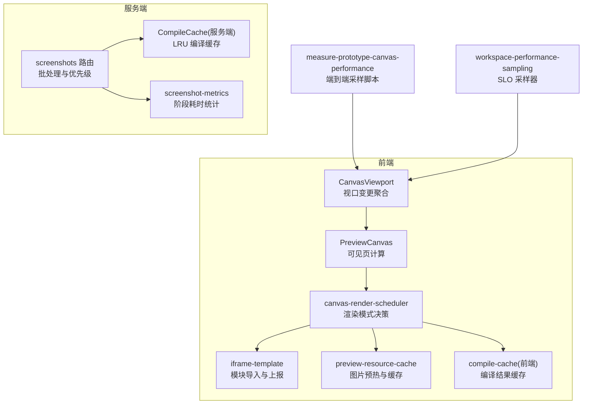
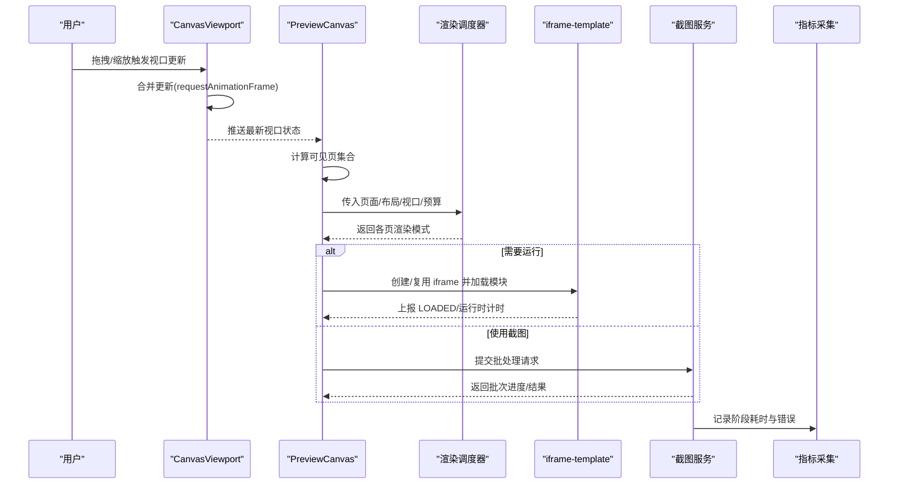
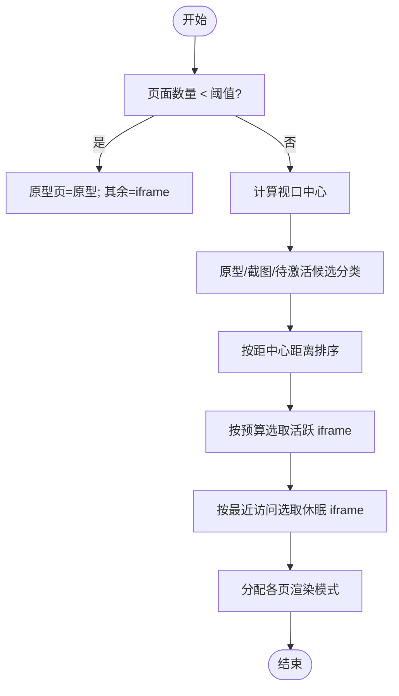
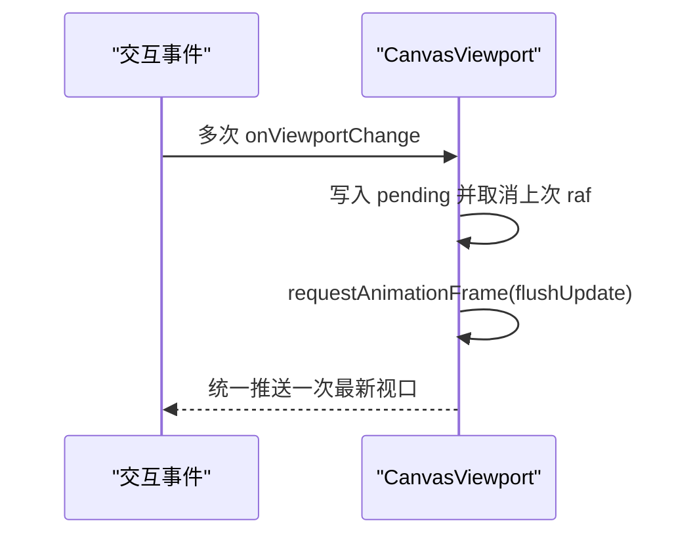
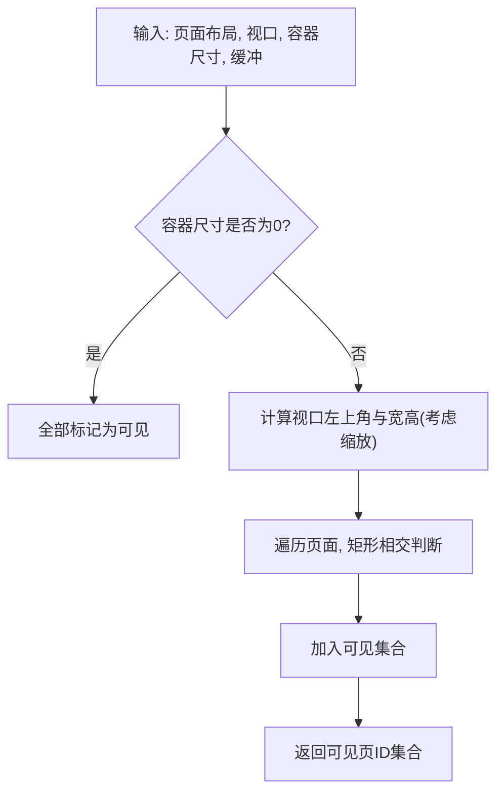
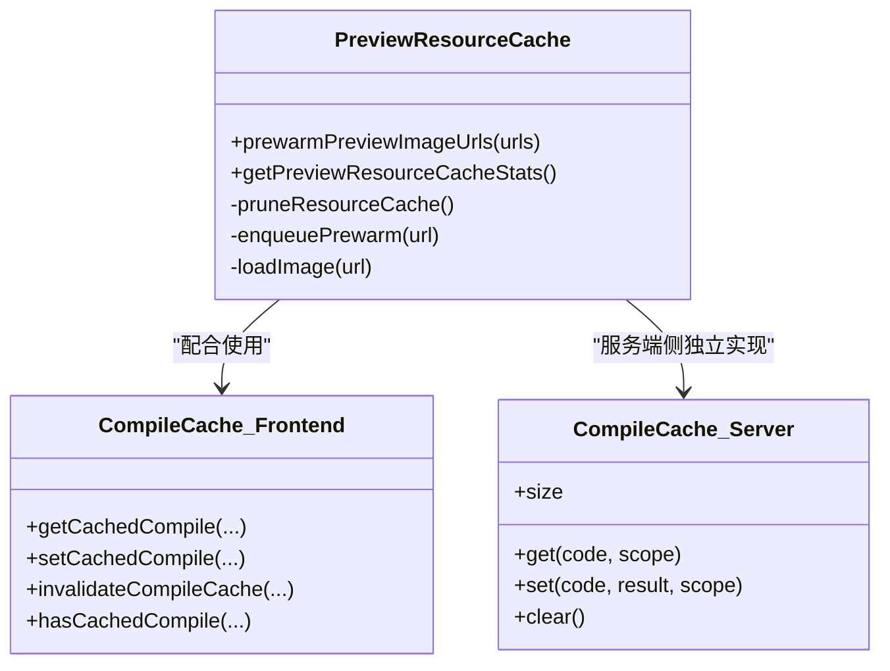
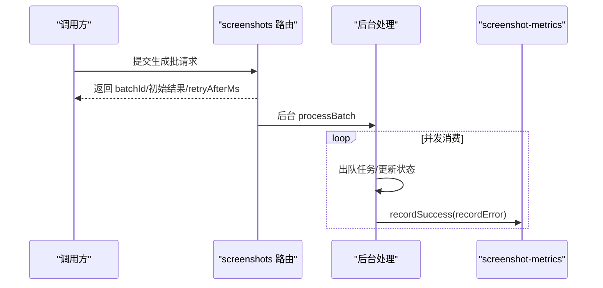
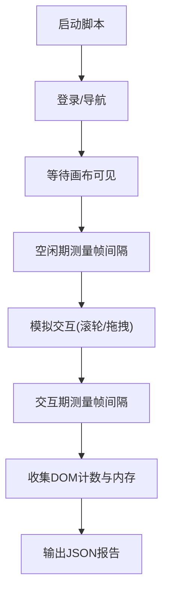
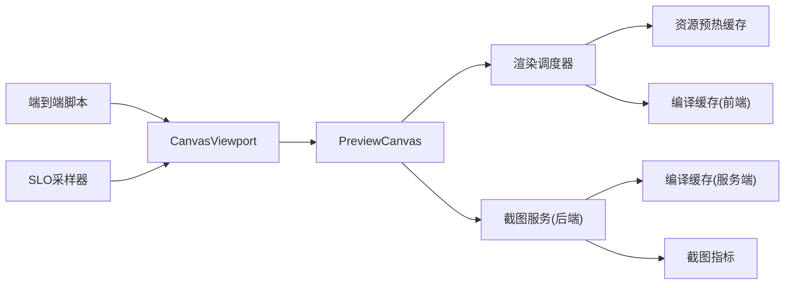

# 性能优化

<cite>
**本文引用的文件**
- [packages/demo-ui/src/canvas-render-scheduler.ts](file://packages/demo-ui/src/canvas-render-scheduler.ts)
- [packages/demo-ui/src/CanvasViewport.tsx](file://packages/demo-ui/src/CanvasViewport.tsx)
- [packages/demo-ui/src/PreviewCanvas.tsx](file://packages/demo-ui/src/PreviewCanvas.tsx)
- [packages/demo-ui/src/compile-cache.ts](file://packages/demo-ui/src/compile-cache.ts)
- [packages/screenshot-service/src/utils/compile-cache.ts](file://packages/screenshot-service/src/utils/compile-cache.ts)
- [packages/screenshot-service/src/utils/screenshot-metrics.ts](file://packages/screenshot-service/src/utils/screenshot-metrics.ts)
- [packages/screenshot-service/src/routes/screenshots.ts](file://packages/screenshot-service/src/routes/screenshots.ts)
- [packages/author-site/src/lib/workspace-performance-sampling.ts](file://packages/author-site/src/lib/workspace-performance-sampling.ts)
- [scripts/development/measure-prototype-canvas-performance.mjs](file://scripts/development/measure-prototype-canvas-performance.mjs)
- [packages/demo-ui/src/preview-resource-cache.ts](file://packages/demo-ui/src/preview-resource-cache.ts)
- [packages/author-site/src/components/demo/useScreenshotGeneration.test.tsx](file://packages/author-site/src/components/demo/useScreenshotGeneration.test.tsx)
- [docs/项目文档/创作端/04-配置与预览/技术/09_截图服务性能优化方案.md](file://docs/项目文档/创作端/04-配置与预览/技术/09_截图服务性能优化方案.md)
</cite>

## 目录
1. [简介](#简介)
2. [项目结构](#项目结构)
3. [核心组件](#核心组件)
4. [架构总览](#架构总览)
5. [详细组件分析](#详细组件分析)
6. [依赖关系分析](#依赖关系分析)
7. [性能考量](#性能考量)
8. [故障排查指南](#故障排查指南)
9. [结论](#结论)
10. [附录](#附录)

## 简介
本文件面向画布编辑器的性能优化，聚焦以下方面：
- 渲染优化策略：虚拟滚动、增量更新、渲染批处理
- 内存管理：对象池、垃圾回收优化、大对象缓存
- 性能监控：帧率监控、内存使用分析、渲染耗时统计
- 大数据量处理：分块加载、懒加载、异步渲染
- 性能调优：浏览器优化、硬件加速、移动端适配
- 测试方法与基准工具：端到端采样脚本与服务端指标采集

## 项目结构
围绕“前端画布渲染调度 + 服务端截图流水线 + 性能采样与监控”的三层协作展开。前端负责视口变化聚合、可见性判定与渲染模式选择；服务端负责批量截图、并发控制与阶段耗时统计；开发脚本用于端到端帧率与资源计数采样。

图表来源
- [packages/demo-ui/src/CanvasViewport.tsx:92-119](file://packages/demo-ui/src/CanvasViewport.tsx#L92-L119)
- [packages/demo-ui/src/PreviewCanvas.tsx:125-177](file://packages/demo-ui/src/PreviewCanvas.tsx#L125-L177)
- [packages/demo-ui/src/canvas-render-scheduler.ts:45-163](file://packages/demo-ui/src/canvas-render-scheduler.ts#L45-L163)
- [packages/demo-ui/src/preview-resource-cache.ts:198-245](file://packages/demo-ui/src/preview-resource-cache.ts#L198-L245)
- [packages/demo-ui/src/compile-cache.ts:47-86](file://packages/demo-ui/src/compile-cache.ts#L47-L86)
- [packages/screenshot-service/src/routes/screenshots.ts:1006-1050](file://packages/screenshot-service/src/routes/screenshots.ts#L1006-L1050)
- [packages/screenshot-service/src/utils/compile-cache.ts:10-69](file://packages/screenshot-service/src/utils/compile-cache.ts#L10-L69)
- [packages/screenshot-service/src/utils/screenshot-metrics.ts:84-158](file://packages/screenshot-service/src/utils/screenshot-metrics.ts#L84-L158)
- [scripts/development/measure-prototype-canvas-performance.mjs:67-107](file://scripts/development/measure-prototype-canvas-performance.mjs#L67-L107)
- [packages/author-site/src/lib/workspace-performance-sampling.ts:176-279](file://packages/author-site/src/lib/workspace-performance-sampling.ts#L176-L279)

章节来源
- [packages/demo-ui/src/CanvasViewport.tsx:92-119](file://packages/demo-ui/src/CanvasViewport.tsx#L92-L119)
- [packages/demo-ui/src/PreviewCanvas.tsx:125-177](file://packages/demo-ui/src/PreviewCanvas.tsx#L125-L177)
- [packages/demo-ui/src/canvas-render-scheduler.ts:45-163](file://packages/demo-ui/src/canvas-render-scheduler.ts#L45-L163)
- [packages/screenshot-service/src/routes/screenshots.ts:1006-1050](file://packages/screenshot-service/src/routes/screenshots.ts#L1006-L1050)
- [packages/screenshot-service/src/utils/screenshot-metrics.ts:84-158](file://packages/screenshot-service/src/utils/screenshot-metrics.ts#L84-L158)
- [scripts/development/measure-prototype-canvas-performance.mjs:67-107](file://scripts/development/measure-prototype-canvas-performance.mjs#L67-L107)
- [packages/author-site/src/lib/workspace-performance-sampling.ts:176-279](file://packages/author-site/src/lib/workspace-performance-sampling.ts#L176-L279)

## 核心组件
- 视口变更聚合与硬件加速提示：通过 requestAnimationFrame 合并多次视口更新，并在交互期间设置 will-change-transform 以启用合成层优化。
- 可见区域计算：基于视口与页面布局进行矩形相交判断，并引入缓冲距离减少抖动。
- 渲染模式调度：根据页面类型、是否编辑中、截图可用性、最近访问与预算限制，将页面标记为原型、截图、活跃 iframe、休眠 iframe 或加载中。
- 资源预热与缓存：解析代码与配置中的图片 URL，按并发上限预取，结合 LRU 清理避免内存增长。
- 编译缓存（前后端）：前端基于指纹与 TTL 的 Map 缓存；服务端基于 SHA256 前缀键与 LRU 淘汰。
- 服务端截图批处理：优先级队列、并发窗口、阶段耗时记录与错误分类统计。
- 端到端性能采样：在真实浏览器中测量空闲与交互时的帧间隔分布，并收集 DOM 节点与内存信息。
- SLO 采样器：环形缓冲区存储延迟样本，输出 p50/p95/p99 并与目标对比。

章节来源
- [packages/demo-ui/src/CanvasViewport.tsx:92-119](file://packages/demo-ui/src/CanvasViewport.tsx#L92-L119)
- [packages/demo-ui/src/PreviewCanvas.tsx:125-177](file://packages/demo-ui/src/PreviewCanvas.tsx#L125-L177)
- [packages/demo-ui/src/canvas-render-scheduler.ts:45-163](file://packages/demo-ui/src/canvas-render-scheduler.ts#L45-L163)
- [packages/demo-ui/src/preview-resource-cache.ts:198-245](file://packages/demo-ui/src/preview-resource-cache.ts#L198-L245)
- [packages/demo-ui/src/compile-cache.ts:47-86](file://packages/demo-ui/src/compile-cache.ts#L47-L86)
- [packages/screenshot-service/src/utils/compile-cache.ts:10-69](file://packages/screenshot-service/src/utils/compile-cache.ts#L10-L69)
- [packages/screenshot-service/src/routes/screenshots.ts:1006-1050](file://packages/screenshot-service/src/routes/screenshots.ts#L1006-L1050)
- [packages/screenshot-service/src/utils/screenshot-metrics.ts:84-158](file://packages/screenshot-service/src/utils/screenshot-metrics.ts#L84-L158)
- [scripts/development/measure-prototype-canvas-performance.mjs:67-107](file://scripts/development/measure-prototype-canvas-performance.mjs#L67-L107)
- [packages/author-site/src/lib/workspace-performance-sampling.ts:176-279](file://packages/author-site/src/lib/workspace-performance-sampling.ts#L176-L279)

## 架构总览
下图展示从用户交互到最终渲染的关键路径，以及服务端截图流水线与指标采集。

图表来源
- [packages/demo-ui/src/CanvasViewport.tsx:92-119](file://packages/demo-ui/src/CanvasViewport.tsx#L92-L119)
- [packages/demo-ui/src/PreviewCanvas.tsx:125-177](file://packages/demo-ui/src/PreviewCanvas.tsx#L125-L177)
- [packages/demo-ui/src/canvas-render-scheduler.ts:45-163](file://packages/demo-ui/src/canvas-render-scheduler.ts#L45-L163)
- [packages/screenshot-service/src/routes/screenshots.ts:1006-1050](file://packages/screenshot-service/src/routes/screenshots.ts#L1006-L1050)
- [packages/screenshot-service/src/utils/screenshot-metrics.ts:84-158](file://packages/screenshot-service/src/utils/screenshot-metrics.ts#L84-L158)

## 详细组件分析

### 渲染调度器（虚拟滚动与模式选择）
- 输入：页面列表、布局、可见页集合、视口、容器尺寸、是否编辑中、截图 URL、最近访问映射、活跃/休眠预算。
- 算法要点：
  - 小体量时直接激活所有非原型页为 iframe。
  - 大体量时计算视口中心，对候选 iframe 按距离排序，优先激活靠近中心的页面。
  - 已存在截图的页面优先使用截图模式。
  - 未进入可视区的页面置为 loading；部分历史访问过的页面可放入 sleeping-iframe 以便快速恢复。
- 复杂度：排序 O(n log n)，整体 O(n log n)。

图表来源
- [packages/demo-ui/src/canvas-render-scheduler.ts:45-163](file://packages/demo-ui/src/canvas-render-scheduler.ts#L45-L163)

章节来源
- [packages/demo-ui/src/canvas-render-scheduler.ts:45-163](file://packages/demo-ui/src/canvas-render-scheduler.ts#L45-L163)

### 视口聚合与硬件加速
- 使用 requestAnimationFrame 合并高频视口更新，降低重排/重绘压力。
- 交互期间设置 will-change-transform，促使浏览器提前提升为合成层，减少拖动卡顿。

图表来源
- [packages/demo-ui/src/CanvasViewport.tsx:92-119](file://packages/demo-ui/src/CanvasViewport.tsx#L92-L119)

章节来源
- [packages/demo-ui/src/CanvasViewport.tsx:92-119](file://packages/demo-ui/src/CanvasViewport.tsx#L92-L119)

### 可见区域计算（增量更新基础）
- 基于视口与页面布局做矩形相交检测，支持缓冲距离以减少频繁切换。
- 当容器尺寸为 0 时回退为全量可见，保证异常场景下的稳定性。

图表来源
- [packages/demo-ui/src/PreviewCanvas.tsx:125-177](file://packages/demo-ui/src/PreviewCanvas.tsx#L125-L177)

章节来源
- [packages/demo-ui/src/PreviewCanvas.tsx:125-177](file://packages/demo-ui/src/PreviewCanvas.tsx#L125-L177)

### 资源预热与缓存（图片与编译产物）
- 图片预热：
  - 从代码与配置中提取图片 URL，去重后按并发上限预取。
  - 使用 Image.decode 加速解码，失败不阻断流程。
  - LRU 清理，仅保留最近使用的条目，防止内存膨胀。
- 编译缓存：
  - 前端：Map + TTL + 简单指纹，容量上限自动淘汰最旧项。
  - 服务端：SHA256 前缀键 + LRU 淘汰，提供 get/set/clear/size。

图表来源
- [packages/demo-ui/src/preview-resource-cache.ts:198-245](file://packages/demo-ui/src/preview-resource-cache.ts#L198-L245)
- [packages/demo-ui/src/compile-cache.ts:47-86](file://packages/demo-ui/src/compile-cache.ts#L47-L86)
- [packages/screenshot-service/src/utils/compile-cache.ts:10-69](file://packages/screenshot-service/src/utils/compile-cache.ts#L10-L69)

章节来源
- [packages/demo-ui/src/preview-resource-cache.ts:198-245](file://packages/demo-ui/src/preview-resource-cache.ts#L198-L245)
- [packages/demo-ui/src/compile-cache.ts:47-86](file://packages/demo-ui/src/compile-cache.ts#L47-L86)
- [packages/screenshot-service/src/utils/compile-cache.ts:10-69](file://packages/screenshot-service/src/utils/compile-cache.ts#L10-L69)

### 服务端截图批处理与阶段统计
- 批处理：
  - 接收请求后后台处理，返回初始结果与重试间隔。
  - 多 worker 并发消费队列，按优先级推进。
- 指标：
  - 记录总耗时、编译/渲染/写入/排队等待时间。
  - 细分渲染阶段耗时（浏览器、新建页面、设置视口、注入内容、等待网络空闲、动画帧、运行时错误检查、测量、视口调整、截图）。
  - 错误码分类计数。

图表来源
- [packages/screenshot-service/src/routes/screenshots.ts:1006-1050](file://packages/screenshot-service/src/routes/screenshots.ts#L1006-L1050)
- [packages/screenshot-service/src/utils/screenshot-metrics.ts:84-158](file://packages/screenshot-service/src/utils/screenshot-metrics.ts#L84-L158)

章节来源
- [packages/screenshot-service/src/routes/screenshots.ts:1006-1050](file://packages/screenshot-service/src/routes/screenshots.ts#L1006-L1050)
- [packages/screenshot-service/src/utils/screenshot-metrics.ts:84-158](file://packages/screenshot-service/src/utils/screenshot-metrics.ts#L84-L158)

### 端到端性能采样与 SLO 报告
- 端到端脚本：
  - 打开目标页面，等待画布可见，统计首屏与交互阶段的帧间隔分布，估算 FPS。
  - 收集 canvas 页面数、iframe 数、图片数与内存指标。
- SLO 采样器：
  - 环形缓冲区固定容量，避免泄漏。
  - 针对多个关键路径（自动保存、队列等待、提交延迟、远程更新、草稿预览、投影延迟、重连收敛、物化延迟）分别统计 p50/p95/p99 并与目标比较。

图表来源
- [scripts/development/measure-prototype-canvas-performance.mjs:67-107](file://scripts/development/measure-prototype-canvas-performance.mjs#L67-L107)
- [packages/author-site/src/lib/workspace-performance-sampling.ts:176-279](file://packages/author-site/src/lib/workspace-performance-sampling.ts#L176-L279)

章节来源
- [scripts/development/measure-prototype-canvas-performance.mjs:67-107](file://scripts/development/measure-prototype-canvas-performance.mjs#L67-L107)
- [packages/author-site/src/lib/workspace-performance-sampling.ts:176-279](file://packages/author-site/src/lib/workspace-performance-sampling.ts#L176-L279)

## 依赖关系分析
- 前端内部耦合：
  - CanvasViewport 向 PreviewCanvas 推送视口；PreviewCanvas 驱动渲染调度器；调度器决定 iframe/截图/原型等模式。
  - 资源预热与编译缓存作为横切能力被多处复用。
- 前后端交互：
  - 前端按需发起截图批处理请求；服务端维护并发与阶段指标。
- 外部依赖：
  - Playwright 驱动的端到端脚本在真实浏览器中采集帧率与资源计数。

图表来源
- [packages/demo-ui/src/CanvasViewport.tsx:92-119](file://packages/demo-ui/src/CanvasViewport.tsx#L92-L119)
- [packages/demo-ui/src/PreviewCanvas.tsx:125-177](file://packages/demo-ui/src/PreviewCanvas.tsx#L125-L177)
- [packages/demo-ui/src/canvas-render-scheduler.ts:45-163](file://packages/demo-ui/src/canvas-render-scheduler.ts#L45-L163)
- [packages/demo-ui/src/preview-resource-cache.ts:198-245](file://packages/demo-ui/src/preview-resource-cache.ts#L198-L245)
- [packages/demo-ui/src/compile-cache.ts:47-86](file://packages/demo-ui/src/compile-cache.ts#L47-L86)
- [packages/screenshot-service/src/routes/screenshots.ts:1006-1050](file://packages/screenshot-service/src/routes/screenshots.ts#L1006-L1050)
- [packages/screenshot-service/src/utils/compile-cache.ts:10-69](file://packages/screenshot-service/src/utils/compile-cache.ts#L10-L69)
- [packages/screenshot-service/src/utils/screenshot-metrics.ts:84-158](file://packages/screenshot-service/src/utils/screenshot-metrics.ts#L84-L158)
- [scripts/development/measure-prototype-canvas-performance.mjs:67-107](file://scripts/development/measure-prototype-canvas-performance.mjs#L67-L107)
- [packages/author-site/src/lib/workspace-performance-sampling.ts:176-279](file://packages/author-site/src/lib/workspace-performance-sampling.ts#L176-L279)

章节来源
- [packages/demo-ui/src/CanvasViewport.tsx:92-119](file://packages/demo-ui/src/CanvasViewport.tsx#L92-L119)
- [packages/demo-ui/src/PreviewCanvas.tsx:125-177](file://packages/demo-ui/src/PreviewCanvas.tsx#L125-L177)
- [packages/demo-ui/src/canvas-render-scheduler.ts:45-163](file://packages/demo-ui/src/canvas-render-scheduler.ts#L45-L163)
- [packages/screenshot-service/src/routes/screenshots.ts:1006-1050](file://packages/screenshot-service/src/routes/screenshots.ts#L1006-L1050)
- [packages/screenshot-service/src/utils/screenshot-metrics.ts:84-158](file://packages/screenshot-service/src/utils/screenshot-metrics.ts#L84-L158)
- [scripts/development/measure-prototype-canvas-performance.mjs:67-107](file://scripts/development/measure-prototype-canvas-performance.mjs#L67-L107)
- [packages/author-site/src/lib/workspace-performance-sampling.ts:176-279](file://packages/author-site/src/lib/workspace-performance-sampling.ts#L176-L279)

## 性能考量
- 渲染优化
  - 虚拟滚动：通过可见区域计算与渲染模式选择，显著减少同时活跃的 iframe 数量。
  - 增量更新：基于视口变化与可见集合差异，仅更新受影响页面。
  - 渲染批处理：requestAnimationFrame 合并更新，避免每帧多次布局。
- 内存管理
  - 对象池：当前未见显式对象池实现；可通过复用 DOM/纹理等资源进一步降低 GC 压力。
  - 垃圾回收优化：及时释放 Blob URL、移除监听、清理缓存（TTL/LRU）。
  - 大对象缓存：编译结果与图片预热均具备容量上限与淘汰策略。
- 监控与度量
  - 帧率监控：端到端脚本统计平均帧间隔与 p95，估算 FPS。
  - 内存使用：收集 JS Heap 使用/总量/上限。
  - 渲染耗时：服务端截图指标细化至浏览器、页面创建、视口设置、内容注入、网络空闲、动画帧、运行时错误检查、测量、视口调整、截图等阶段。
- 大数据量处理
  - 分块加载：服务端批处理并发窗口控制。
  - 懒加载：不可见页标记为 loading，进入可视区再激活。
  - 异步渲染：iframe 内模块动态 import 与异步解码图片。
- 调优建议
  - 浏览器优化：开启 will-change-transform、减少强制同步布局、避免大量回流。
  - 硬件加速：合理提升合成层，注意过度提升带来的内存开销。
  - 移动端适配：降低并发预热、减小截图分辨率、缩短采样时长。

[本节为通用指导，无需特定文件引用]

## 故障排查指南
- 常见问题定位
  - 帧率下降：检查交互期帧间隔 p95 是否超过阈值；确认是否过多活跃 iframe。
  - 内存持续增长：核查资源预热缓存是否按 LRU 清理；确认 Blob URL 是否释放。
  - 截图慢：查看服务端 renderStages 中 pageCreateMs、setContentMs、waitForNetworkIdleMs 占比。
- 相关实现参考
  - 批处理与重试节奏：客户端会依据服务端 retryAfterMs 调整轮询频率。
  - 指标快照：服务端 snapshot 聚合各阶段耗时与错误分布。

章节来源
- [packages/author-site/src/components/demo/useScreenshotGeneration.test.tsx:712-756](file://packages/author-site/src/components/demo/useScreenshotGeneration.test.tsx#L712-L756)
- [packages/screenshot-service/src/utils/screenshot-metrics.ts:84-158](file://packages/screenshot-service/src/utils/screenshot-metrics.ts#L84-L158)

## 结论
本项目在前端与后端均实现了系统化的性能优化与监控能力：前端通过视口聚合、可见性判定与渲染模式调度降低渲染成本；服务端通过批处理、并发控制与细粒度阶段指标保障吞吐与可观测性；配套端到端脚本与 SLO 采样器形成闭环的性能治理体系。后续可在对象池、页面/上下文复用等方面继续探索，并以指标驱动决策。

[本节为总结，无需特定文件引用]

## 附录
- 截图服务优化方向（来自设计文档）
  - 短期：浏览器预热，验证冷启动收益。
  - 长期：评估 context/page 复用，需严格隔离与监控。

章节来源
- [docs/项目文档/创作端/04-配置与预览/技术/09_截图服务性能优化方案.md:162-186](file://docs/项目文档/创作端/04-配置与预览/技术/09_截图服务性能优化方案.md#L162-L186)