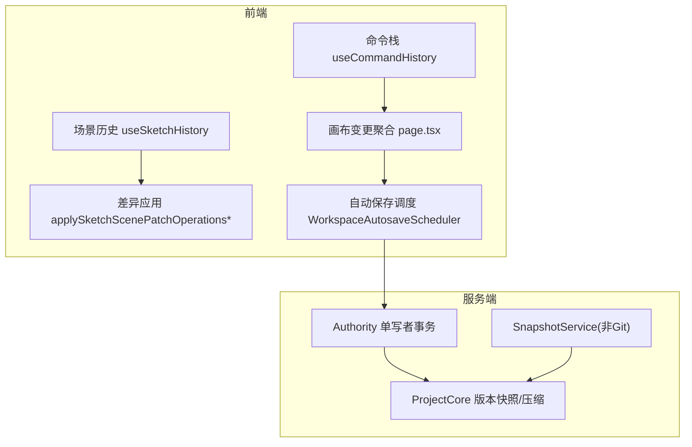
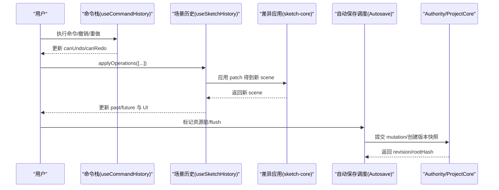
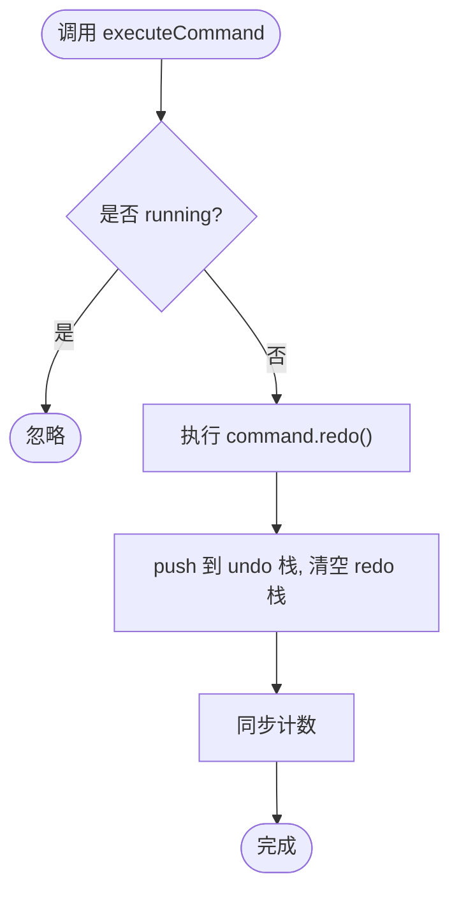
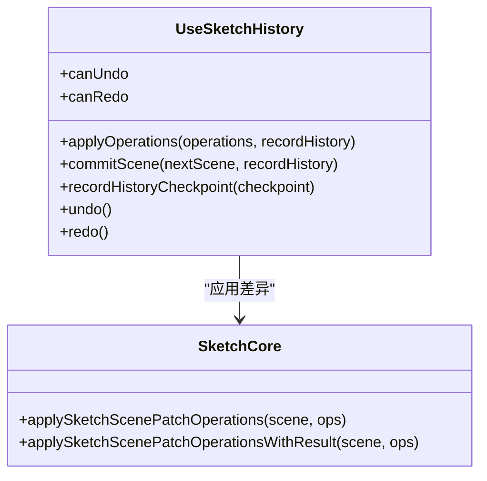
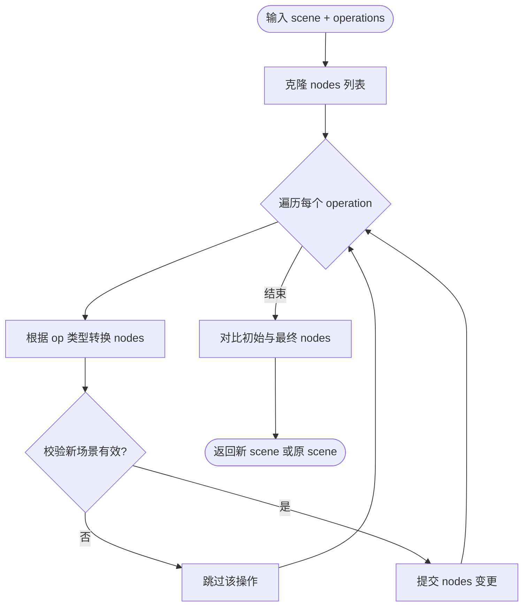
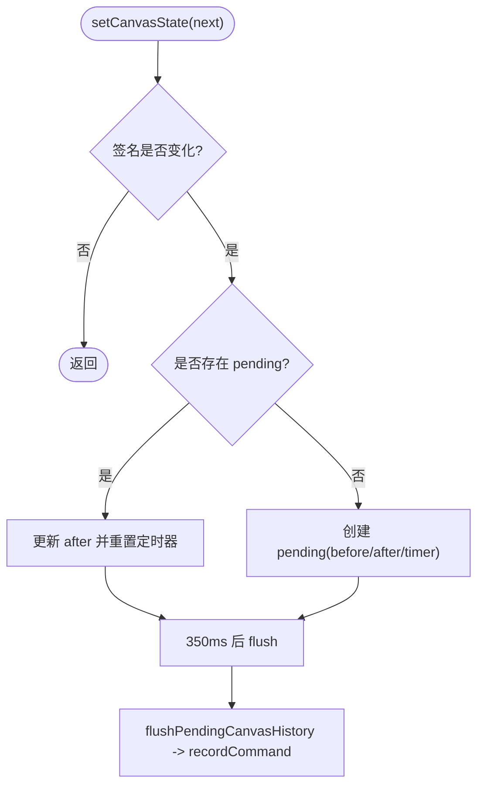
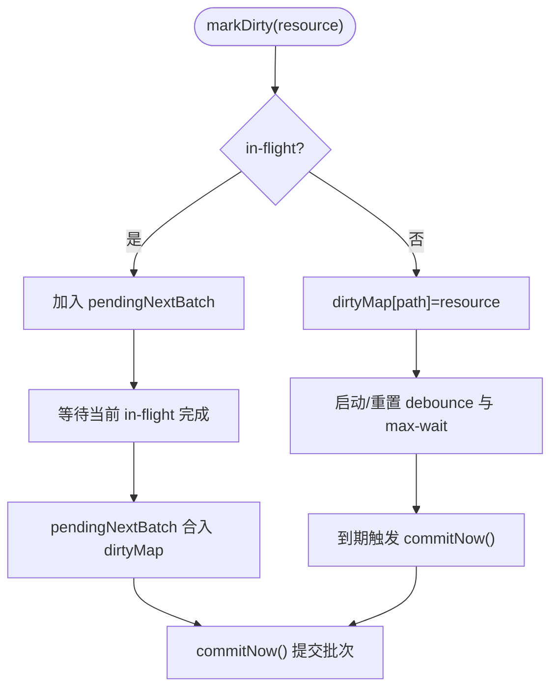
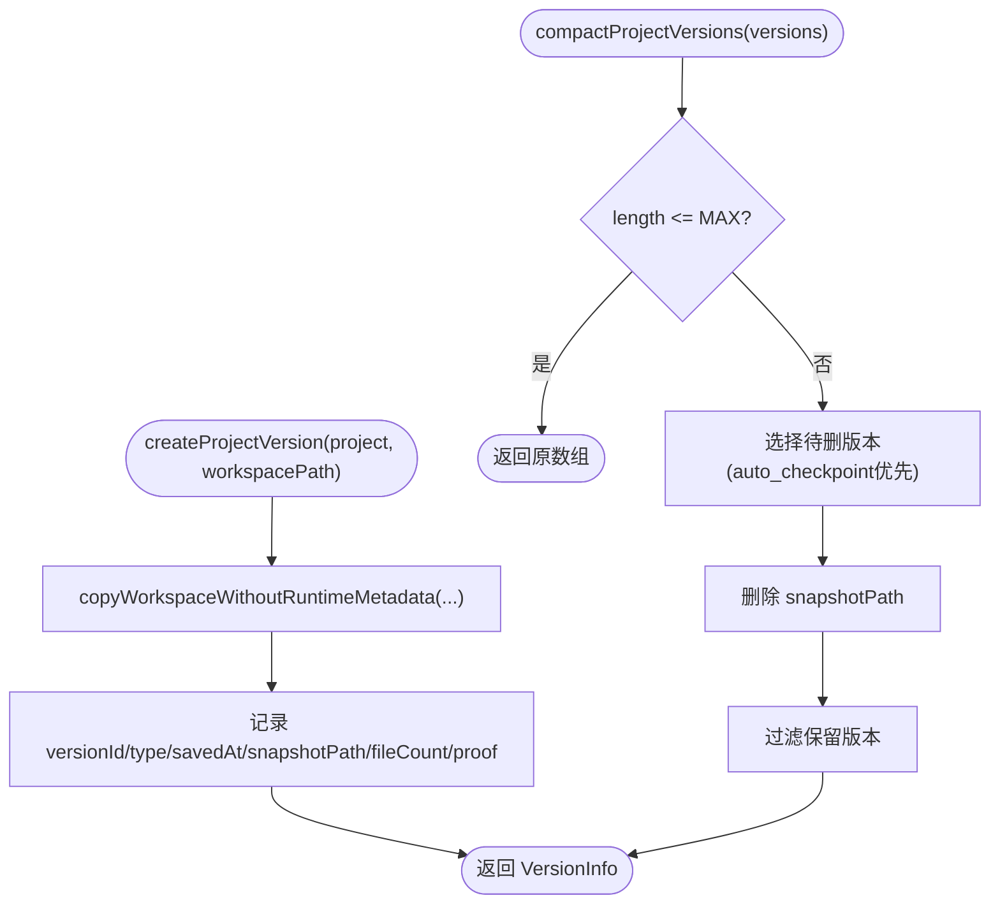
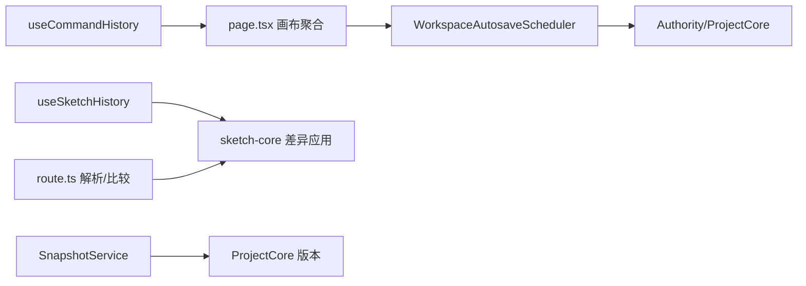

# 撤销重做系统

<cite>
**本文引用的文件**   
- [packages/author-site/src/app/demo/[id]/edit/hooks/useCommandHistory.ts](file://packages/author-site/src/app/demo/[id]/edit/hooks/useCommandHistory.ts)
- [packages/author-site/src/app/demo/[id]/edit/__tests__/command-history.test.tsx](file://packages/author-site/src/app/demo/[id]/edit/__tests__/command-history.test.tsx)
- [packages/sketch-react/src/index.tsx](file://packages/sketch-react/src/index.tsx)
- [packages/sketch-core/src/index.ts](file://packages/sketch-core/src/index.ts)
- [packages/author-site/src/app/api/sessions/[sessionId]/files/[demoId]/route.ts](file://packages/author-site/src/app/api/sessions/[sessionId]/files/[demoId]/route.ts)
- [packages/project-core/src/service.ts](file://packages/project-core/src/service.ts)
- [packages/agent-service/src/session/snapshot-service.ts](file://packages/agent-service/src/session/snapshot-service.ts)
- [packages/author-site/src/lib/workspace-autosave-scheduler.ts](file://packages/author-site/src/lib/workspace-autosave-scheduler.ts)
- [packages/author-site/src/lib/__tests__/workspace-autosave-scheduler.test.ts](file://packages/author-site/src/lib/__tests__/workspace-autosave-scheduler.test.ts)
- [packages/author-site/src/lib/canonical-materializer.ts](file://packages/author-site/src/lib/canonical-materializer.ts)
- [docs/项目文档/创作端/03-项目管理/技术/11_实时保存与协同编辑.md](file://docs/项目文档/创作端/03-项目管理/技术/11_实时保存与协同编辑.md)
</cite>

## 目录
1. [引言](#引言)
2. [项目结构](#项目结构)
3. [核心组件](#核心组件)
4. [架构总览](#架构总览)
5. [详细组件分析](#详细组件分析)
6. [依赖关系分析](#依赖关系分析)
7. [性能考虑](#性能考虑)
8. [故障排查指南](#故障排查指南)
9. [结论](#结论)
10. [附录](#附录)

## 引言
本文件面向撤销/重做系统的实现与维护，覆盖操作历史存储机制（快照策略、差异计算、版本管理）、撤销重做原理（命令模式、状态回滚、时间旅行调试）、内存管理（压缩、过期清理、内存限制）、并发协作（冲突解决、操作合并）、历史操作 API（手动控制、批量、条件撤销），以及性能优化与故障恢复。

## 项目结构
撤销重做能力由前端命令栈、场景图操作应用器、画布变更聚合、工作区自动保存调度器、项目级版本快照与清理等模块共同构成：
- 命令式撤销重做：useCommandHistory 提供通用命令栈与快捷键绑定
- 场景图撤销重做：useSketchHistory 维护 past/future 栈并支持操作序列应用
- 差异计算与幂等应用：sketch-core 的 applySketchScenePatchOperations 系列函数
- 画布变更聚合与去抖：page.tsx 中的 pendingCanvasHistory 与 flushPendingCanvasHistory
- 自动保存与批处理：WorkspaceAutosaveScheduler 的 debounce/max-wait/in-flight barrier
- 项目版本快照与压缩：project-core 的版本创建与 compactProjectVersions
- 非 Git 环境快照服务：agent-service SnapshotService
- 协同写入一致性：Authority 事务、receipt、projection ack 与冲突策略

图表来源
- [packages/author-site/src/app/demo/[id]/edit/hooks/useCommandHistory.ts:1-155](file://packages/author-site/src/app/demo/[id]/edit/hooks/useCommandHistory.ts#L1-L155)
- [packages/sketch-react/src/index.tsx:1092-1173](file://packages/sketch-react/src/index.tsx#L1092-L1173)
- [packages/sketch-core/src/index.ts:850-1049](file://packages/sketch-core/src/index.ts#L850-L1049)
- [packages/author-site/src/app/demo/[id]/edit/page.tsx:878-L916](file://packages/author-site/src/app/demo/[id]/edit/page.tsx#L878-L916)
- [packages/author-site/src/lib/workspace-autosave-scheduler.ts:71-121](file://packages/author-site/src/lib/workspace-autosave-scheduler.ts#L71-L121)
- [packages/project-core/src/service.ts:5673-5732](file://packages/project-core/src/service.ts#L5673-L5732)
- [packages/agent-service/src/session/snapshot-service.ts:1-341](file://packages/agent-service/src/session/snapshot-service.ts#L1-L341)

章节来源
- [packages/author-site/src/app/demo/[id]/edit/hooks/useCommandHistory.ts:1-L155](file://packages/author-site/src/app/demo/[id]/edit/hooks/useCommandHistory.ts#L1-L155)
- [packages/sketch-react/src/index.tsx:1092-1173](file://packages/sketch-react/src/index.tsx#L1092-L1173)
- [packages/sketch-core/src/index.ts:850-1049](file://packages/sketch-core/src/index.ts#L850-L1049)
- [packages/author-site/src/app/demo/[id]/edit/page.tsx:878-L916](file://packages/author-site/src/app/demo/[id]/edit/page.tsx#L878-L916)
- [packages/author-site/src/lib/workspace-autosave-scheduler.ts:71-121](file://packages/author-site/src/lib/workspace-autosave-scheduler.ts#L71-L121)
- [packages/project-core/src/service.ts:5673-5732](file://packages/project-core/src/service.ts#L5673-L5732)
- [packages/agent-service/src/session/snapshot-service.ts:1-341](file://packages/agent-service/src/session/snapshot-service.ts#L1-L341)

## 核心组件
- 命令式撤销重做 Hook：提供 executeCommand/recordCommand/undo/redo/reset 与键盘快捷键绑定，错误回调 onError 上报失败阶段
- 场景图撤销重做 Hook：维护 past/future 全量快照栈，支持 applyOperations 与 recordHistoryCheckpoint
- 差异应用引擎：基于 patch operations 的幂等应用与校验，返回摘要统计
- 画布变更聚合：对高频 setCanvasState 进行签名比较与延时合并，减少历史条目
- 自动保存调度器：debounce + max-wait + in-flight barrier，保证提交顺序与幂等
- 项目版本快照与压缩：按命名/自动检查点类型创建快照，并按阈值压缩清理
- 非 Git 快照服务：在本地目录建立文件快照，支持丢弃/重置文件

章节来源
- [packages/author-site/src/app/demo/[id]/edit/hooks/useCommandHistory.ts:1-L155](file://packages/author-site/src/app/demo/[id]/edit/hooks/useCommandHistory.ts#L1-L155)
- [packages/sketch-react/src/index.tsx:1092-1173](file://packages/sketch-react/src/index.tsx#L1092-L1173)
- [packages/sketch-core/src/index.ts:850-1049](file://packages/sketch-core/src/index.ts#L850-L1049)
- [packages/author-site/src/app/demo/[id]/edit/page.tsx:878-L916](file://packages/author-site/src/app/demo/[id]/edit/page.tsx#L878-L916)
- [packages/author-site/src/lib/workspace-autosave-scheduler.ts:71-121](file://packages/author-site/src/lib/workspace-autosave-scheduler.ts#L71-L121)
- [packages/project-core/src/service.ts:5673-5732](file://packages/project-core/src/service.ts#L5673-L5732)
- [packages/agent-service/src/session/snapshot-service.ts:1-341](file://packages/agent-service/src/session/snapshot-service.ts#L1-L341)

## 架构总览
撤销重做贯穿“用户交互 → 命令/操作 → 状态回滚/重放 → 持久化/版本”的全链路。关键路径如下：
- 命令式路径：executeCommand(record redo) → undo/redo 移动命令栈项
- 场景图路径：applyOperations 生成新 scene → commitScene 记录 past/future
- 画布路径：setCanvasState 去抖合并 → flushPendingCanvasHistory 记录一次命令
- 持久化路径：WorkspaceAutosaveScheduler 批量提交 → Authority 事务 → ProjectCore 版本快照
- 快照路径：非 Git 下使用 SnapshotService 维护基线；Git 仓库直接利用 git 语义

图表来源
- [packages/author-site/src/app/demo/[id]/edit/hooks/useCommandHistory.ts:1-L155](file://packages/author-site/src/app/demo/[id]/edit/hooks/useCommandHistory.ts#L1-L155)
- [packages/sketch-react/src/index.tsx:1092-1173](file://packages/sketch-react/src/index.tsx#L1092-L1173)
- [packages/sketch-core/src/index.ts:850-1049](file://packages/sketch-core/src/index.ts#L850-L1049)
- [packages/author-site/src/lib/workspace-autosave-scheduler.ts:71-121](file://packages/author-site/src/lib/workspace-autosave-scheduler.ts#L71-L121)
- [docs/项目文档/创作端/03-项目管理/技术/11_实时保存与协同编辑.md:90-111](file://docs/项目文档/创作端/03-项目管理/技术/11_实时保存与协同编辑.md#L90-L111)

## 详细组件分析

### 命令式撤销重做（useCommandHistory）
- 设计要点
  - 双栈模型：undoStack/redoStack，executeCommand 先执行 redo 再入栈，避免重复
  - 运行态保护：running 标志防止并发执行
  - 错误隔离：undo/redo 异常时不改变栈，仅回调 onError
  - 快捷键：忽略可编辑目标，统一 Z/Y 组合键
- 复杂度
  - 入栈/出栈 O(1)，reset O(n)
- 优化建议
  - 可按需裁剪 undo 栈长度或引入分段压缩
  - 对大对象命令采用增量 diff 而非全量快照

图表来源
- [packages/author-site/src/app/demo/[id]/edit/hooks/useCommandHistory.ts:54-L71](file://packages/author-site/src/app/demo/[id]/edit/hooks/useCommandHistory.ts#L54-L71)

章节来源
- [packages/author-site/src/app/demo/[id]/edit/hooks/useCommandHistory.ts:1-L155](file://packages/author-site/src/app/demo/[id]/edit/hooks/useCommandHistory.ts#L1-L155)
- [packages/author-site/src/app/demo/[id]/edit/__tests__/command-history.test.tsx:1-L116](file://packages/author-site/src/app/demo/[id]/edit/__tests__/command-history.test.tsx#L1-L116)

### 场景图撤销重做（useSketchHistory）
- 设计要点
  - 全量快照栈：past/future 各保留最近 N 个（默认约 50）
  - 原子提交：commitScene 在记录历史后触发 onSceneChange
  - 操作应用：applyOperations 通过 sketch-core 的幂等应用器
- 复杂度
  - 入栈/出栈 O(1)，复制场景 O(N)
- 优化建议
  - 对超大场景可采用增量快照或分块压缩
  - 结合内容签名跳过无变化提交

图表来源
- [packages/sketch-react/src/index.tsx:1092-1173](file://packages/sketch-react/src/index.tsx#L1092-L1173)
- [packages/sketch-core/src/index.ts:850-1049](file://packages/sketch-core/src/index.ts#L850-L1049)

章节来源
- [packages/sketch-react/src/index.tsx:1092-1173](file://packages/sketch-react/src/index.tsx#L1092-L1173)
- [packages/sketch-core/src/index.ts:850-1049](file://packages/sketch-core/src/index.ts#L850-L1049)

### 差异计算与幂等应用（sketch-core）
- 设计要点
  - 支持 add/update/delete/duplicate/reorder/group/ungroup/set-visible/set-locked/bind/unbind 等操作
  - 每步应用后校验，非法操作被拒绝且保持原场景不变
  - 提供 WithResult 接口返回摘要（新增/删除/更新节点、字段变更明细）
- 复杂度
  - 单次操作近似 O(V+E)，V 为节点数，E 为连接/引用
- 优化建议
  - 批量操作尽量合并以减少多次校验开销
  - 对只读路径优先使用 WithResult 判断 changed 后再提交历史

图表来源
- [packages/sketch-core/src/index.ts:850-1049](file://packages/sketch-core/src/index.ts#L850-L1049)

章节来源
- [packages/sketch-core/src/index.ts:850-1049](file://packages/sketch-core/src/index.ts#L850-L1049)

### 画布变更聚合与去抖（page.tsx）
- 设计要点
  - 签名比较：getCanvasContentHistorySignature 过滤无意义变更
  - 延迟合并：pendingCanvasHistory 累积 after，350ms 内合并
  - 防循环：suppressCanvasHistoryRef 避免 undo/redo 再次触发历史
- 复杂度
  - 合并 O(1)，flush O(1)
- 优化建议
  - 可根据业务调整合并窗口
  - 对大型 canvas 可进一步采用结构化 diff

图表来源
- [packages/author-site/src/app/demo/[id]/edit/page.tsx:878-L916](file://packages/author-site/src/app/demo/[id]/edit/page.tsx#L878-L916)

章节来源
- [packages/author-site/src/app/demo/[id]/edit/page.tsx:878-L916](file://packages/author-site/src/app/demo/[id]/edit/page.tsx#L878-L916)

### 自动保存与批处理（WorkspaceAutosaveScheduler）
- 设计要点
  - markDirty 去抖与 max-wait 计时
  - in-flight barrier：提交期间新 dirty 进入下一批
  - flush 立即提交所有脏资源
- 复杂度
  - 标记 O(1)，提交 O(k) k 为批次大小
- 优化建议
  - 合理设置 debounce 与 max-wait 平衡响应与吞吐
  - 对热点资源可单独节流

图表来源
- [packages/author-site/src/lib/workspace-autosave-scheduler.ts:71-121](file://packages/author-site/src/lib/workspace-autosave-scheduler.ts#L71-L121)
- [packages/author-site/src/lib/__tests__/workspace-autosave-scheduler.test.ts:131-210](file://packages/author-site/src/lib/__tests__/workspace-autosave-scheduler.test.ts#L131-L210)

章节来源
- [packages/author-site/src/lib/workspace-autosave-scheduler.ts:71-121](file://packages/author-site/src/lib/workspace-autosave-scheduler.ts#L71-L121)
- [packages/author-site/src/lib/__tests__/workspace-autosave-scheduler.test.ts:131-210](file://packages/author-site/src/lib/__tests__/workspace-autosave-scheduler.test.ts#L131-L210)

### 项目版本快照与压缩（ProjectCore）
- 设计要点
  - createProjectVersion：复制工作区至 snapshotsDir，记录 workspaceId/revision/rootHash
  - compactProjectVersions：超过 MAX_VERSIONS_KEEP 时优先移除 auto_checkpoint，其次按索引清理
- 复杂度
  - 创建 O(F) F 为文件数，压缩 O(V log V) 排序/去重
- 优化建议
  - 对大项目可使用增量快照或硬链接
  - 定期后台 GC 清理孤立 blobs

图表来源
- [packages/project-core/src/service.ts:5673-5732](file://packages/project-core/src/service.ts#L5673-L5732)

章节来源
- [packages/project-core/src/service.ts:5673-5732](file://packages/project-core/src/service.ts#L5673-L5732)

### 非 Git 快照服务（SnapshotService）
- 设计要点
  - init 检测是否为 Git 仓库；否则创建文件快照 Map
  - discardFile/resetFile 支持 create/modify/delete 三种操作的回滚
- 复杂度
  - 初始化 O(D) D 为文件数，回滚 O(1) 每次文件
- 适用场景
  - 非 Git 目录下的临时回滚与演示环境

章节来源
- [packages/agent-service/src/session/snapshot-service.ts:1-341](file://packages/agent-service/src/session/snapshot-service.ts#L1-L341)

### 协同写入一致性与冲突处理
- 设计要点
  - 单写者串行队列、prepared/backup、receipt/journal 持久化
  - 冲突返回 409 WORKSPACE_RESOURCE_CONFLICT，客户端必须重试或提示
  - 协同草稿 barrier：外部写入前 flush 活跃房间草稿
  - projection ack 独立于 mutation receipt，用于预览与应用确认
- 影响
  - 撤销重做应基于已 committed 的 revision 进行，避免覆盖未落盘草稿

章节来源
- [docs/项目文档/创作端/03-项目管理/技术/11_实时保存与协同编辑.md:90-111](file://docs/项目文档/创作端/03-项目管理/技术/11_实时保存与协同编辑.md#L90-L111)

## 依赖关系分析
- 前端层
  - useCommandHistory 与 useSketchHistory 分别服务于通用命令与场景图
  - page.tsx 将画布变更聚合成命令，驱动历史记录
  - route.ts 对 sketch patch payload 进行解析与稳定化比较
- 核心逻辑层
  - sketch-core 提供幂等应用与结果摘要，支撑撤销重做的正确性
- 持久化与版本层
  - WorkspaceAutosaveScheduler 负责批量提交
  - ProjectCore 负责版本快照与压缩
  - SnapshotService 为非 Git 环境提供快照能力

图表来源
- [packages/author-site/src/app/demo/[id]/edit/hooks/useCommandHistory.ts:1-L155](file://packages/author-site/src/app/demo/[id]/edit/hooks/useCommandHistory.ts#L1-L155)
- [packages/sketch-react/src/index.tsx:1092-1173](file://packages/sketch-react/src/index.tsx#L1092-L1173)
- [packages/sketch-core/src/index.ts:850-1049](file://packages/sketch-core/src/index.ts#L850-L1049)
- [packages/author-site/src/app/api/sessions/[sessionId]/files/[demoId]/route.ts:96-L137](file://packages/author-site/src/app/api/sessions/[sessionId]/files/[demoId]/route.ts#L96-L137)
- [packages/author-site/src/lib/workspace-autosave-scheduler.ts:71-121](file://packages/author-site/src/lib/workspace-autosave-scheduler.ts#L71-L121)
- [packages/project-core/src/service.ts:5673-5732](file://packages/project-core/src/service.ts#L5673-L5732)
- [packages/agent-service/src/session/snapshot-service.ts:1-341](file://packages/agent-service/src/session/snapshot-service.ts#L1-L341)

章节来源
- [packages/author-site/src/app/api/sessions/[sessionId]/files/[demoId]/route.ts:96-L137](file://packages/author-site/src/app/api/sessions/[sessionId]/files/[demoId]/route.ts#L96-L137)
- [packages/author-site/src/lib/canonical-materializer.ts:87-124](file://packages/author-site/src/lib/canonical-materializer.ts#L87-L124)

## 性能考虑
- 前端
  - 使用签名比较与去抖合并减少历史条目数量
  - 场景图历史限制 past 栈长度，避免无限增长
  - 批量操作合并，减少重复校验与渲染
- 后端
  - 自动保存调度器保障单 in-flight barrier，避免重复提交
  - 版本压缩策略优先清理自动检查点，降低磁盘占用
  - 非 Git 快照服务按需回滚，避免全量拷贝
- 协同
  - 基于 revision/rootHash 的幂等提交，避免无效重算
  - projection ack 与 mutation receipt 解耦，提升预览刷新效率

[本节为通用指导，无需具体文件分析]

## 故障排查指南
- 撤销/重做失败
  - 检查 onError 回调参数，定位失败阶段（undo/redo）与命令 label
  - 确认 running 标志未被卡住，必要时 reset 清空栈
- 快捷键冲突
  - 确认 shouldIgnoreGlobalUndoRedoEvent 是否正确放行输入框原生行为
- 自动保存卡顿
  - 观察 isInFlight 与批次大小，适当调整 debounce/max-wait
- 协同冲突
  - 捕获 409 冲突码，读取当前 revision/rootHash 后重试或提示用户
- 版本膨胀
  - 检查 MAX_VERSIONS_KEEP 与 compactProjectVersions 执行情况，必要时手动清理

章节来源
- [packages/author-site/src/app/demo/[id]/edit/__tests__/command-history.test.tsx:45-L80](file://packages/author-site/src/app/demo/[id]/edit/__tests__/command-history.test.tsx#L45-L80)
- [packages/author-site/src/lib/__tests__/workspace-autosave-scheduler.test.ts:131-210](file://packages/author-site/src/lib/__tests__/workspace-autosave-scheduler.test.ts#L131-L210)
- [docs/项目文档/创作端/03-项目管理/技术/11_实时保存与协同编辑.md:90-111](file://docs/项目文档/创作端/03-项目管理/技术/11_实时保存与协同编辑.md#L90-L111)

## 结论
本撤销重做系统以命令模式与全量快照为核心，结合差异应用与幂等校验确保正确性；通过画布聚合与自动保存调度提升性能；借助 Authority 事务与版本快照实现可靠持久化与时间旅行能力。建议在大规模场景下引入增量快照与更细粒度的历史压缩策略，并完善条件撤销与批量控制的 API 暴露。

[本节为总结，无需具体文件分析]

## 附录

### 历史操作 API 参考
- 命令式
  - executeCommand(command): 执行并记录 redo，成功后入 undo 栈
  - recordCommand(command): 直接记录命令（适用于异步前置 redo 的场景）
  - undo()/redo(): 执行对应方向，异常不改变栈
  - reset(): 清空双栈
  - bindKeyboardShortcuts(): 注册全局快捷键
- 场景图
  - applyOperations(operations, recordHistory?): 应用一组 patch 操作
  - commitScene(nextScene, recordHistory?): 原子提交并可选记录历史
  - recordHistoryCheckpoint(checkpoint): 插入检查点快照
- 画布聚合
  - setCanvasState(next): 内部签名比较与去抖合并，最终通过 recordCommand 记录
- 自动保存
  - markDirty(resource)/flush()/isInFlight(): 标记脏资源、立即提交、查询 in-flight
- 版本快照
  - createProjectVersion(...): 创建项目版本快照
  - compactProjectVersions(versions): 压缩旧版本

章节来源
- [packages/author-site/src/app/demo/[id]/edit/hooks/useCommandHistory.ts:1-L155](file://packages/author-site/src/app/demo/[id]/edit/hooks/useCommandHistory.ts#L1-L155)
- [packages/sketch-react/src/index.tsx:1092-1173](file://packages/sketch-react/src/index.tsx#L1092-L1173)
- [packages/author-site/src/app/demo/[id]/edit/page.tsx:878-L916](file://packages/author-site/src/app/demo/[id]/edit/page.tsx#L878-L916)
- [packages/author-site/src/lib/workspace-autosave-scheduler.ts:71-121](file://packages/author-site/src/lib/workspace-autosave-scheduler.ts#L71-L121)
- [packages/project-core/src/service.ts:5673-5732](file://packages/project-core/src/service.ts#L5673-L5732)