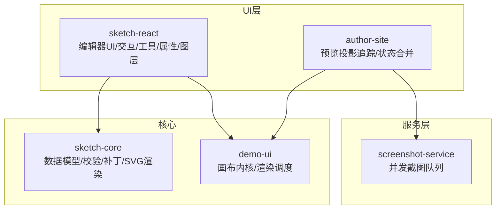
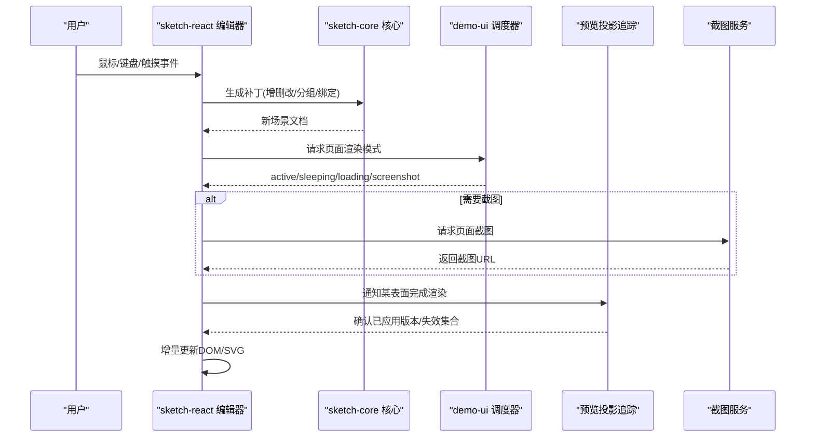
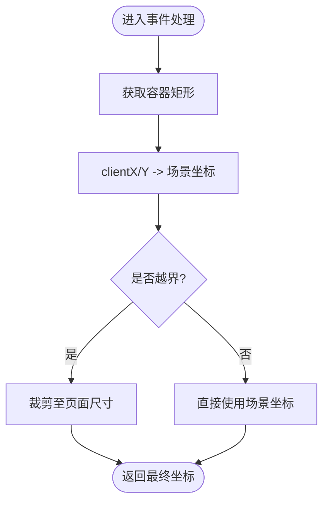
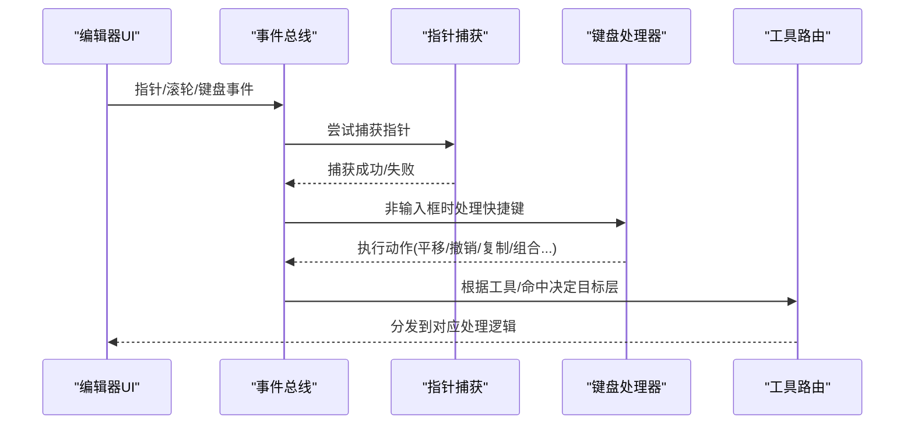
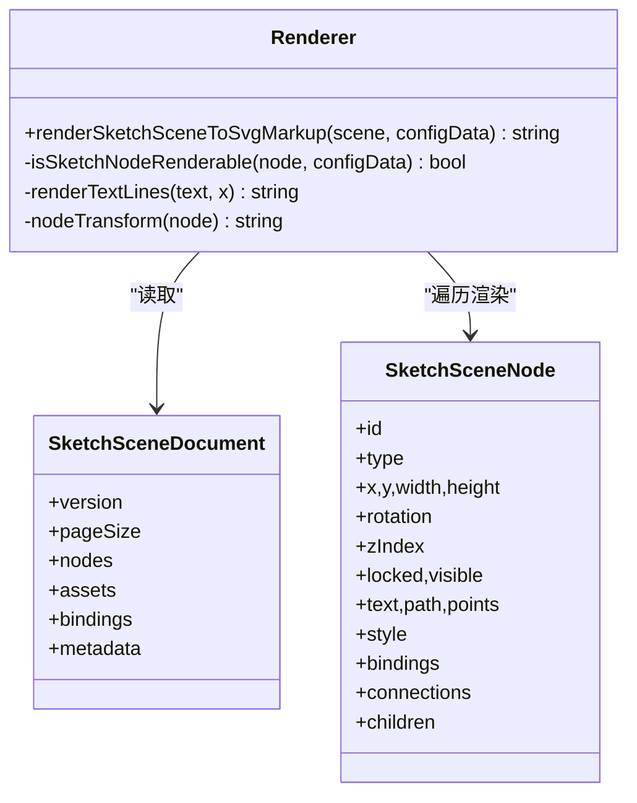
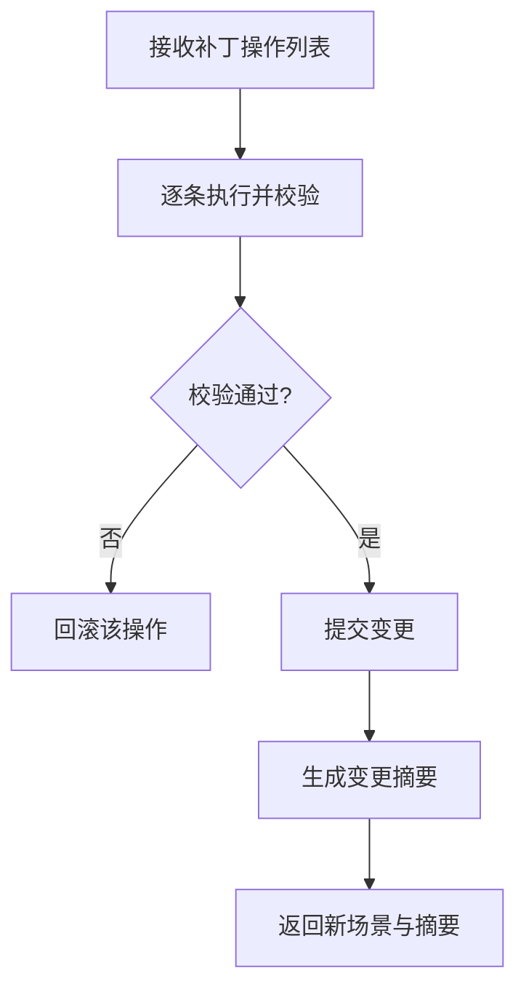
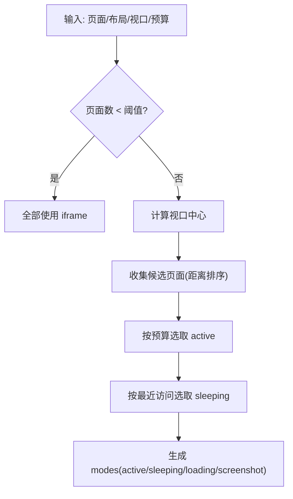
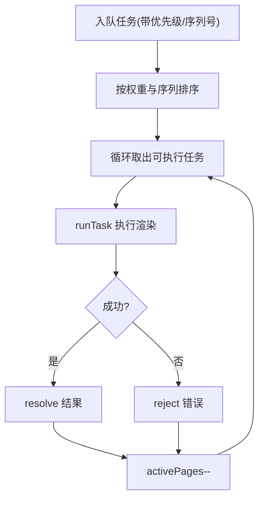
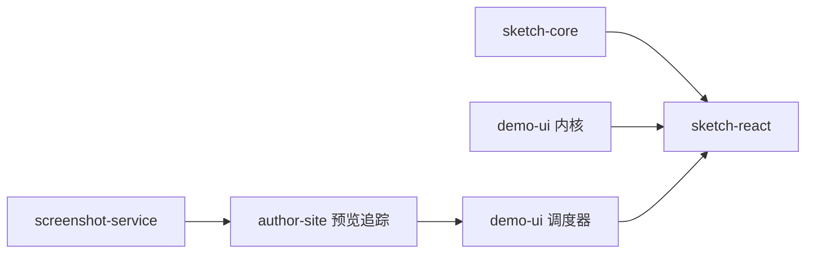

# 画布核心引擎

<cite>
**本文引用的文件**   
- [packages/sketch-core/src/index.ts](file://packages/sketch-core/src/index.ts)
- [packages/sketch-react/src/index.tsx](file://packages/sketch-react/src/index.tsx)
- [packages/demo-ui/src/canvas-kernel.ts](file://packages/demo-ui/src/canvas-kernel.ts)
- [packages/demo-ui/src/canvas-render-scheduler.ts](file://packages/demo-ui/src/canvas-render-scheduler.ts)
- [packages/author-site/src/lib/preview-projection-tracker.ts](file://packages/author-site/src/lib/preview-projection-tracker.ts)
- [packages/screenshot-service/src/utils/browser-pool.ts](file://packages/screenshot-service/src/utils/browser-pool.ts)
</cite>

## 目录
1. [简介](#简介)
2. [项目结构](#项目结构)
3. [核心组件](#核心组件)
4. [架构总览](#架构总览)
5. [详细组件分析](#详细组件分析)
6. [依赖关系分析](#依赖关系分析)
7. [性能考量](#性能考量)
8. [故障排查指南](#故障排查指南)
9. [结论](#结论)
10. [附录：API 参考与使用示例](#附录api-参考与使用示例)

## 简介
本技术文档面向“画布核心引擎”，聚焦于以下目标：
- 渲染系统实现原理：基于 SVG 的节点渲染、元素绘制流程与优化策略。
- 坐标系统设计：屏幕坐标与画布坐标转换、缩放与平移机制。
- 事件处理架构：鼠标/指针事件捕获、触摸事件支持、键盘快捷键处理。
- 性能优化：增量渲染、离屏渲染（截图/休眠 iframe）、内存管理策略。
- 核心 API 接口参考与使用示例路径。

## 项目结构
仓库中与画布核心相关的模块主要分布在以下包中：
- sketch-core：场景数据模型、校验、补丁操作、SVG 渲染等核心能力。
- sketch-react：React 编辑器 UI，封装交互、工具栏、属性面板、图层面板等。
- demo-ui：通用画布内核（坐标转换、指针路由、文本摘要）与渲染调度器（页面模式计算）。
- author-site：预览投影追踪、编辑态状态合并与历史管理等上层集成。
- screenshot-service：服务端截图服务，用于批量渲染与并发控制。

图表来源
- [packages/sketch-core/src/index.ts:1385-1405](file://packages/sketch-core/src/index.ts#L1385-L1405)
- [packages/demo-ui/src/canvas-kernel.ts:33-54](file://packages/demo-ui/src/canvas-kernel.ts#L33-L54)
- [packages/demo-ui/src/canvas-render-scheduler.ts:45-163](file://packages/demo-ui/src/canvas-render-scheduler.ts#L45-L163)
- [packages/author-site/src/lib/preview-projection-tracker.ts:130-220](file://packages/author-site/src/lib/preview-projection-tracker.ts#L130-L220)
- [packages/screenshot-service/src/utils/browser-pool.ts:263-313](file://packages/screenshot-service/src/utils/browser-pool.ts#L263-L313)

章节来源
- [packages/sketch-core/src/index.ts:1-1802](file://packages/sketch-core/src/index.ts#L1-L1802)
- [packages/sketch-react/src/index.tsx:1-200](file://packages/sketch-react/src/index.tsx#L1-L200)
- [packages/demo-ui/src/canvas-kernel.ts:1-201](file://packages/demo-ui/src/canvas-kernel.ts#L1-L201)
- [packages/demo-ui/src/canvas-render-scheduler.ts:1-163](file://packages/demo-ui/src/canvas-render-scheduler.ts#L1-L163)
- [packages/author-site/src/lib/preview-projection-tracker.ts:130-220](file://packages/author-site/src/lib/preview-projection-tracker.ts#L130-L220)
- [packages/screenshot-service/src/utils/browser-pool.ts:263-313](file://packages/screenshot-service/src/utils/browser-pool.ts#L263-L313)

## 核心组件
- 场景数据与渲染（sketch-core）
  - 定义 SketchSceneDocument、SketchSceneNode、样式、绑定、连接等类型。
  - 提供文档解析、规范化、校验、补丁操作、选择边界、锚点计算、SVG 渲染等。
- 画布内核与调度（demo-ui）
  - 提供屏幕/画布坐标转换、指针路由、文本摘要、页面渲染模式计算（active/sleeping/loading/screenshot）。
- 编辑器 UI（sketch-react）
  - 提供编辑器模式、工具集、选择、拖拽/旋转/调整大小、键盘快捷键、视图缩放/平移等。
- 预览投影追踪（author-site）
  - 跟踪各预览表面的失效与已应用版本，驱动按需重渲染与重试。
- 截图服务（screenshot-service）
  - 并发队列与任务执行，为大量页面提供高效截图能力。

章节来源
- [packages/sketch-core/src/index.ts:1-1802](file://packages/sketch-core/src/index.ts#L1-L1802)
- [packages/demo-ui/src/canvas-kernel.ts:1-201](file://packages/demo-ui/src/canvas-kernel.ts#L1-L201)
- [packages/demo-ui/src/canvas-render-scheduler.ts:1-163](file://packages/demo-ui/src/canvas-render-scheduler.ts#L1-L163)
- [packages/sketch-react/src/index.tsx:1-200](file://packages/sketch-react/src/index.tsx#L1-L200)
- [packages/author-site/src/lib/preview-projection-tracker.ts:130-220](file://packages/author-site/src/lib/preview-projection-tracker.ts#L130-L220)
- [packages/screenshot-service/src/utils/browser-pool.ts:263-313](file://packages/screenshot-service/src/utils/browser-pool.ts#L263-L313)

## 架构总览
整体采用“数据驱动 + 分层渲染”的架构：
- 数据层（sketch-core）维护不可变场景文档，通过补丁操作进行增量更新。
- 渲染层（sketch-core）将场景转换为 SVG 标记，供浏览器原生渲染。
- 交互层（sketch-react）负责用户输入、工具状态、选择与变换，调用核心库生成补丁并触发重渲染。
- 调度层（demo-ui）根据视口与布局决定页面渲染模式（iframe/截图/休眠），减少 DOM 压力。
- 预览追踪（author-site）协调多表面渲染进度与失效，避免重复工作。
- 截图服务（screenshot-service）在服务器端批量生成静态图，作为离屏替代方案。

图表来源
- [packages/sketch-react/src/index.tsx:6104-6227](file://packages/sketch-react/src/index.tsx#L6104-L6227)
- [packages/sketch-core/src/index.ts:850-1034](file://packages/sketch-core/src/index.ts#L850-L1034)
- [packages/demo-ui/src/canvas-render-scheduler.ts:45-163](file://packages/demo-ui/src/canvas-render-scheduler.ts#L45-L163)
- [packages/author-site/src/lib/preview-projection-tracker.ts:130-220](file://packages/author-site/src/lib/preview-projection-tracker.ts#L130-L220)
- [packages/screenshot-service/src/utils/browser-pool.ts:263-313](file://packages/screenshot-service/src/utils/browser-pool.ts#L263-L313)

## 详细组件分析

### 坐标系统与视图变换
- 屏幕到画布坐标转换
  - 提供 screenPointToCanvasPoint / canvasPointToScreenPoint，考虑 viewport.x/y 与 zoom。
- 画布内点击定位
  - getClientScenePoint 基于容器 rect 与 scene.pageSize 将 clientX/Y 映射到场景坐标。
- 缩放与平移
  - clampViewportScale 限制缩放范围；normalizeViewport 对偏移做四舍五入；zoomViewportAt 以锚点为中心缩放；getCenteredViewportForBounds 自动居中适配。
- 指针捕获与手势
  - setPointerCapture/releasePointerCapture 统一指针捕获，兼容鼠标与触摸。

图表来源
- [packages/demo-ui/src/canvas-kernel.ts:33-54](file://packages/demo-ui/src/canvas-kernel.ts#L33-L54)
- [packages/sketch-react/src/index.tsx:695-757](file://packages/sketch-react/src/index.tsx#L695-L757)
- [packages/sketch-react/src/index.tsx:6104-6127](file://packages/sketch-react/src/index.tsx#L6104-L6127)

章节来源
- [packages/demo-ui/src/canvas-kernel.ts:33-54](file://packages/demo-ui/src/canvas-kernel.ts#L33-L54)
- [packages/sketch-react/src/index.tsx:695-757](file://packages/sketch-react/src/index.tsx#L695-L757)
- [packages/sketch-react/src/index.tsx:6104-6127](file://packages/sketch-react/src/index.tsx#L6104-L6127)

### 事件处理架构
- 指针捕获
  - 使用 PointerEvent.pointerId 与 setPointerCapture 确保拖拽/绘制过程中事件稳定。
- 键盘快捷键
  - 空格键临时平移、Esc 取消选择/关闭面板/退出绘制、Ctrl/Cmd+Z/Y 撤销重做、复制粘贴、组合/解锁/显隐等。
- 工具路由
  - routeCanvasPointerLayer 根据工具模式、修饰键、命中区域决定事件落入 kernel/page-preview/free-annotation/overlay。

图表来源
- [packages/sketch-react/src/index.tsx:6104-6227](file://packages/sketch-react/src/index.tsx#L6104-L6227)
- [packages/demo-ui/src/canvas-kernel.ts:56-81](file://packages/demo-ui/src/canvas-kernel.ts#L56-L81)

章节来源
- [packages/sketch-react/src/index.tsx:6104-6227](file://packages/sketch-react/src/index.tsx#L6104-L6227)
- [packages/demo-ui/src/canvas-kernel.ts:56-81](file://packages/demo-ui/src/canvas-kernel.ts#L56-L81)

### 渲染系统与 SVG 输出
- 渲染入口
  - renderSketchSceneToSvgMarkup 将场景文档排序后逐节点渲染为 SVG 字符串，包含背景、箭头标记、节点图形与文本。
- 节点可见性与样式
  - isSketchNodeRenderable 依据 visible 绑定与图片 src 决定是否渲染；样式字段按节点类型启用。
- 文本与连线
  - 文本行使用 tspan 对齐；连线/箭头使用 marker 与 path。
- 几何与旋转
  - getSketchNodeBounds/getSketchConnectorAnchorPoint 计算包围盒与锚点；nodeTransform 应用旋转。

图表来源
- [packages/sketch-core/src/index.ts:1385-1405](file://packages/sketch-core/src/index.ts#L1385-L1405)
- [packages/sketch-core/src/index.ts:1143-1151](file://packages/sketch-core/src/index.ts#L1143-L1151)
- [packages/sketch-core/src/index.ts:1187-1195](file://packages/sketch-core/src/index.ts#L1187-L1195)
- [packages/sketch-core/src/index.ts:1157-1169](file://packages/sketch-core/src/index.ts#L1157-L1169)
- [packages/sketch-core/src/index.ts:1447-1477](file://packages/sketch-core/src/index.ts#L1447-L1477)

章节来源
- [packages/sketch-core/src/index.ts:1385-1405](file://packages/sketch-core/src/index.ts#L1385-L1405)
- [packages/sketch-core/src/index.ts:1143-1151](file://packages/sketch-core/src/index.ts#L1143-L1151)
- [packages/sketch-core/src/index.ts:1187-1195](file://packages/sketch-core/src/index.ts#L1187-L1195)
- [packages/sketch-core/src/index.ts:1157-1169](file://packages/sketch-core/src/index.ts#L1157-L1169)
- [packages/sketch-core/src/index.ts:1447-1477](file://packages/sketch-core/src/index.ts#L1447-L1477)

### 增量更新与补丁系统
- 补丁操作类型
  - add/update/delete/duplicate/reorder/group/ungroup/set-locked/set-visible/bind/unbind。
- 一致性保障
  - applySketchScenePatchOperations 在执行每个操作后验证场景有效性，失败则回滚。
- 变更摘要
  - buildSketchScenePatchSummary 统计新增/删除/更新节点及字段差异，便于增量渲染与日志。

图表来源
- [packages/sketch-core/src/index.ts:850-1034](file://packages/sketch-core/src/index.ts#L850-L1034)
- [packages/sketch-core/src/index.ts:1047-1083](file://packages/sketch-core/src/index.ts#L1047-L1083)

章节来源
- [packages/sketch-core/src/index.ts:850-1034](file://packages/sketch-core/src/index.ts#L850-L1034)
- [packages/sketch-core/src/index.ts:1047-1083](file://packages/sketch-core/src/index.ts#L1047-L1083)

### 渲染调度与离屏渲染
- 页面渲染模式
  - computeCanvasRenderModes 根据页面数量、视口中心距离、最近访问记录与预算，分配 active/sleeping/loading/screenshot/prototype 模式。
- 截图与休眠
  - 当页面数较多时，优先使用截图或休眠 iframe，降低主线程压力。
- 预览投影追踪
  - PreviewProjectionTracker 维护各 surface 的 appliedRevision 与 invalidated 标志，配合 ack/fail/resetFromSnapshot 保证一致性与重试。

图表来源
- [packages/demo-ui/src/canvas-render-scheduler.ts:45-163](file://packages/demo-ui/src/canvas-render-scheduler.ts#L45-L163)
- [packages/author-site/src/lib/preview-projection-tracker.ts:130-220](file://packages/author-site/src/lib/preview-projection-tracker.ts#L130-L220)

章节来源
- [packages/demo-ui/src/canvas-render-scheduler.ts:45-163](file://packages/demo-ui/src/canvas-render-scheduler.ts#L45-L163)
- [packages/author-site/src/lib/preview-projection-tracker.ts:130-220](file://packages/author-site/src/lib/preview-projection-tracker.ts#L130-L220)

### 服务端截图与并发控制
- 优先级队列
  - 按优先级与入队顺序排序，维持最大并发页面数。
- 任务执行
  - runTask 包装渲染过程，记录等待时间与渲染耗时，异常统一上报。

图表来源
- [packages/screenshot-service/src/utils/browser-pool.ts:263-313](file://packages/screenshot-service/src/utils/browser-pool.ts#L263-L313)

章节来源
- [packages/screenshot-service/src/utils/browser-pool.ts:263-313](file://packages/screenshot-service/src/utils/browser-pool.ts#L263-L313)

## 依赖关系分析
- 低耦合高内聚
  - sketch-core 不依赖 UI，仅暴露数据与渲染函数；sketch-react 依赖 core 与 demo-ui 的能力。
- 外部依赖
  - 截图服务通过浏览器池并发执行，避免阻塞主进程。
- 潜在循环依赖
  - 当前未见循环引用；UI 层单向依赖核心与调度层。

图表来源
- [packages/sketch-core/src/index.ts:1385-1405](file://packages/sketch-core/src/index.ts#L1385-L1405)
- [packages/demo-ui/src/canvas-kernel.ts:33-54](file://packages/demo-ui/src/canvas-kernel.ts#L33-L54)
- [packages/demo-ui/src/canvas-render-scheduler.ts:45-163](file://packages/demo-ui/src/canvas-render-scheduler.ts#L45-L163)
- [packages/author-site/src/lib/preview-projection-tracker.ts:130-220](file://packages/author-site/src/lib/preview-projection-tracker.ts#L130-L220)
- [packages/screenshot-service/src/utils/browser-pool.ts:263-313](file://packages/screenshot-service/src/utils/browser-pool.ts#L263-L313)

章节来源
- [packages/sketch-core/src/index.ts:1385-1405](file://packages/sketch-core/src/index.ts#L1385-L1405)
- [packages/demo-ui/src/canvas-kernel.ts:33-54](file://packages/demo-ui/src/canvas-kernel.ts#L33-L54)
- [packages/demo-ui/src/canvas-render-scheduler.ts:45-163](file://packages/demo-ui/src/canvas-render-scheduler.ts#L45-L163)
- [packages/author-site/src/lib/preview-projection-tracker.ts:130-220](file://packages/author-site/src/lib/preview-projection-tracker.ts#L130-L220)
- [packages/screenshot-service/src/utils/browser-pool.ts:263-313](file://packages/screenshot-service/src/utils/browser-pool.ts#L263-L313)

## 性能考量
- 增量渲染
  - 基于补丁操作的变更摘要，仅更新受影响节点，避免全量重绘。
- 离屏渲染
  - 大页面集使用截图与休眠 iframe，显著降低 DOM 与 JS 开销。
- 并发与限流
  - 截图服务通过优先级队列与并发上限控制吞吐与稳定性。
- 内存管理
  - 场景文档不可变更新，结合 JSON 比较快速判断无变更；及时释放指针捕获与定时器。
- 数值精度
  - 视口偏移四舍五入到小数点后三位，减少抖动与重排。

[本节为通用指导，无需具体文件分析]

## 故障排查指南
- 预览表面未更新
  - 检查 PreviewProjectionTracker 的 invalidated 标志与 appliedRevision 是否被正确 ack。
- 截图失败或超时
  - 查看 browser-pool 的错误上报与队列等待时间，评估并发上限与任务优先级。
- 键盘快捷键无效
  - 确认焦点不在 INPUT/TEXTAREA，且当前键盘作用域激活。
- 缩放/平移异常
  - 检查 normalizeViewport 与 clampViewportScale 的边界值，以及容器 rect 是否为空。

章节来源
- [packages/author-site/src/lib/preview-projection-tracker.ts:130-220](file://packages/author-site/src/lib/preview-projection-tracker.ts#L130-L220)
- [packages/screenshot-service/src/utils/browser-pool.ts:263-313](file://packages/screenshot-service/src/utils/browser-pool.ts#L263-L313)
- [packages/sketch-react/src/index.tsx:6130-6227](file://packages/sketch-react/src/index.tsx#L6130-L6227)
- [packages/sketch-react/src/index.tsx:719-757](file://packages/sketch-react/src/index.tsx#L719-L757)

## 结论
本引擎以不可变场景文档为核心，通过补丁驱动的增量更新与 SVG 原生渲染，结合页面级渲染调度与离屏截图，实现了高性能、可扩展的画布体验。事件与坐标系统清晰分离，便于扩展新的工具与交互。未来可在 GPU 加速、WebAssembly 渲染与更细粒度的脏区域检测方面继续优化。

[本节为总结性内容，无需具体文件分析]

## 附录：API 参考与使用示例
- 场景与渲染（sketch-core）
  - 渲染入口：renderSketchSceneToSvgMarkup
    - 用途：将场景文档转为 SVG 字符串，供浏览器直接渲染。
    - 参考路径：[packages/sketch-core/src/index.ts:1385-1405](file://packages/sketch-core/src/index.ts#L1385-L1405)
  - 补丁操作：applySketchScenePatchOperations / applySketchScenePatchOperationsWithResult
    - 用途：批量修改场景并返回变更摘要。
    - 参考路径：[packages/sketch-core/src/index.ts:850-1034](file://packages/sketch-core/src/index.ts#L850-L1034), [packages/sketch-core/src/index.ts:1085-1095](file://packages/sketch-core/src/index.ts#L1085-L1095)
  - 几何与锚点：getSketchNodeBounds / getSketchConnectorAnchorPoint
    - 用途：计算包围盒与连接锚点。
    - 参考路径：[packages/sketch-core/src/index.ts:1447-1477](file://packages/sketch-core/src/index.ts#L1447-L1477), [packages/sketch-core/src/index.ts:524-536](file://packages/sketch-core/src/index.ts#L524-L536)
- 坐标与交互（demo-ui + sketch-react）
  - 坐标转换：screenPointToCanvasPoint / canvasPointToScreenPoint
    - 参考路径：[packages/demo-ui/src/canvas-kernel.ts:33-54](file://packages/demo-ui/src/canvas-kernel.ts#L33-L54)
  - 视图变换：getClientScenePoint / clampViewportScale / normalizeViewport / zoomViewportAt
    - 参考路径：[packages/sketch-react/src/index.tsx:695-757](file://packages/sketch-react/src/index.tsx#L695-L757)
  - 指针捕获：setPointerCapture / releasePointerCapture
    - 参考路径：[packages/sketch-react/src/index.tsx:6104-6127](file://packages/sketch-react/src/index.tsx#L6104-L6127)
  - 键盘快捷键：空格平移、Esc 取消、Ctrl/Cmd+Z/Y 撤销重做、复制粘贴、组合/锁定/显隐
    - 参考路径：[packages/sketch-react/src/index.tsx:6130-6227](file://packages/sketch-react/src/index.tsx#L6130-L6227)
- 渲染调度（demo-ui）
  - 页面模式计算：computeCanvasRenderModes
    - 参考路径：[packages/demo-ui/src/canvas-render-scheduler.ts:45-163](file://packages/demo-ui/src/canvas-render-scheduler.ts#L45-L163)
- 预览追踪（author-site）
  - 失效与确认：ackPreview / failPreview / resetFromSnapshot / hasInvalidatedSurfaces
    - 参考路径：[packages/author-site/src/lib/preview-projection-tracker.ts:130-220](file://packages/author-site/src/lib/preview-projection-tracker.ts#L130-L220)
- 截图服务（screenshot-service）
  - 并发队列：drainQueue / runTask
    - 参考路径：[packages/screenshot-service/src/utils/browser-pool.ts:263-313](file://packages/screenshot-service/src/utils/browser-pool.ts#L263-L313)