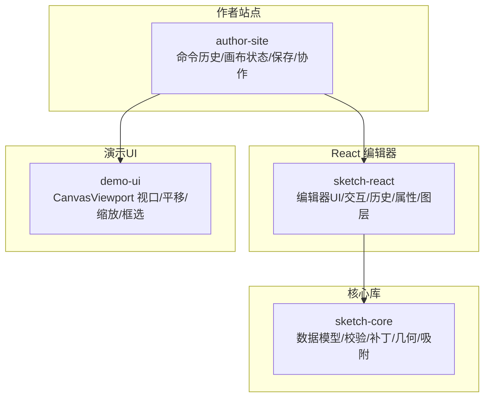
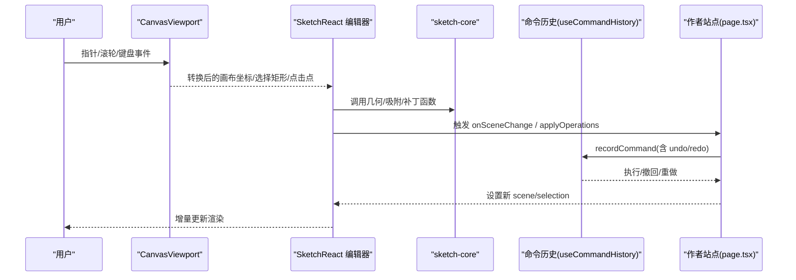
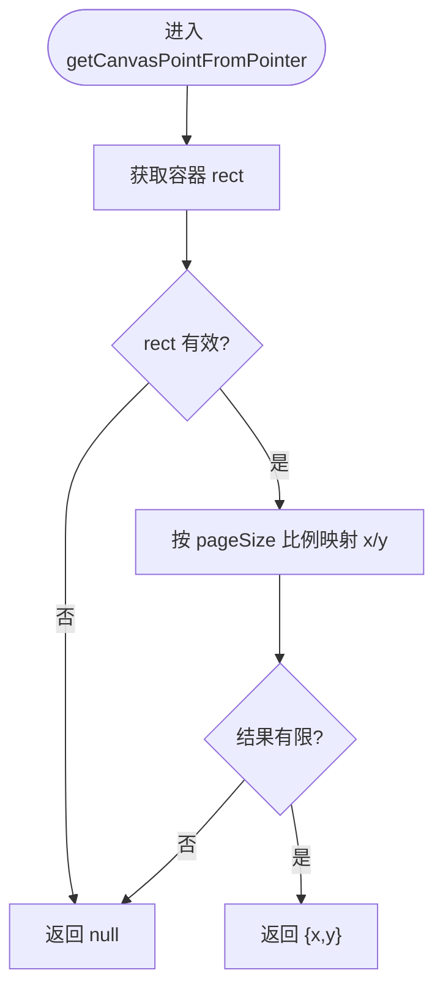
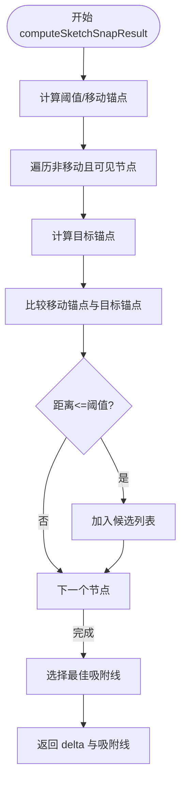
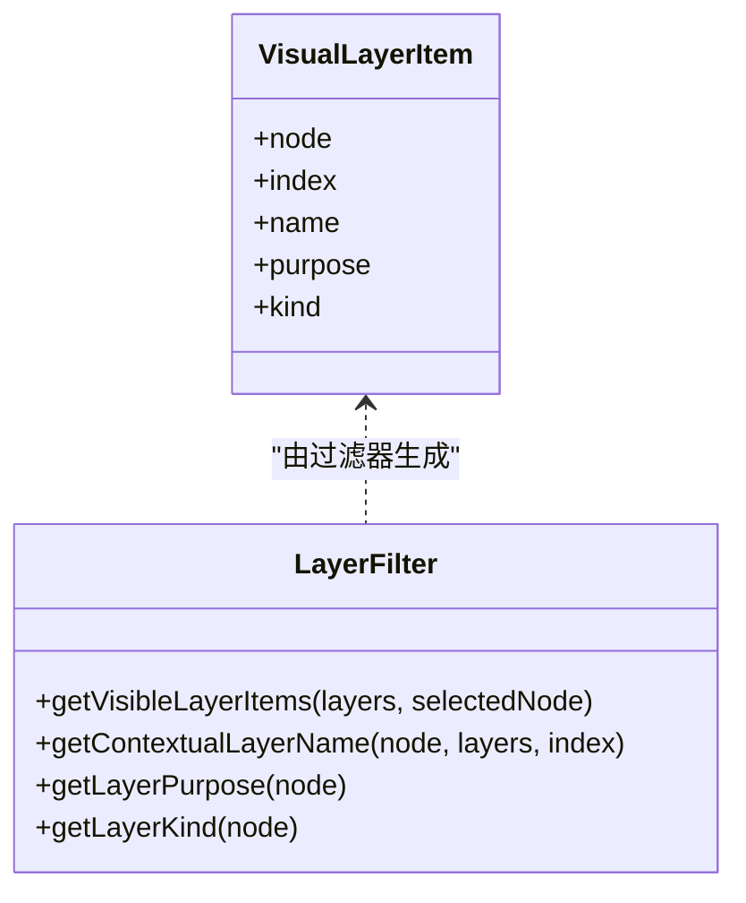
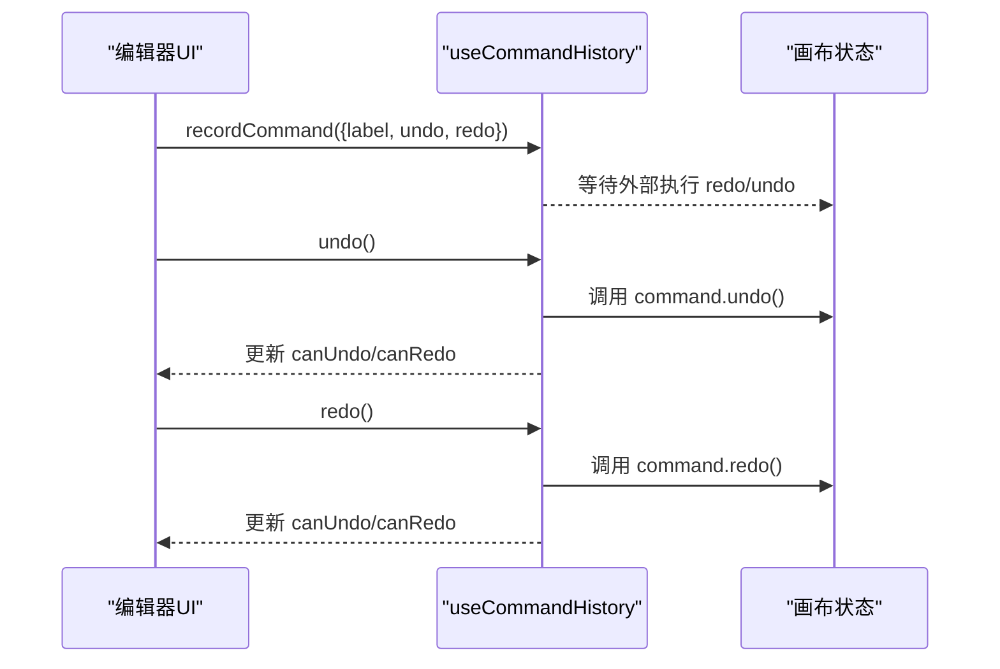
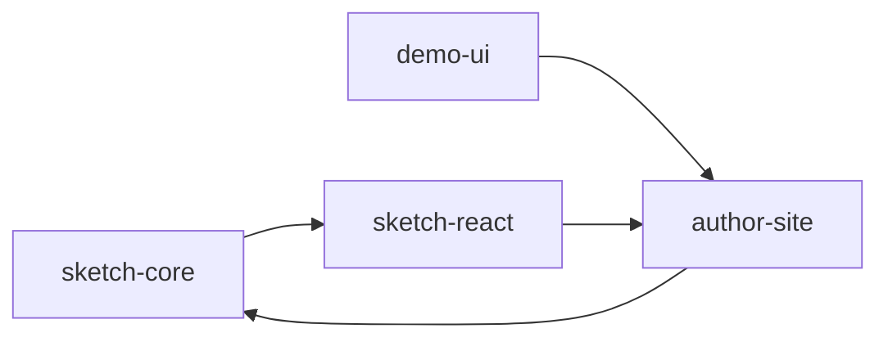

# 画布编辑器

<cite>
**本文引用的文件**
- [packages/sketch-core/src/index.ts](file://packages/sketch-core/src/index.ts)
- [packages/sketch-react/src/index.tsx](file://packages/sketch-react/src/index.tsx)
- [packages/demo-ui/src/CanvasViewport.tsx](file://packages/demo-ui/src/CanvasViewport.tsx)
- [packages/author-site/src/app/demo/[id]/edit/page.tsx](file://packages/author-site/src/app/demo/[id]/edit/page.tsx)
- [packages/author-site/src/app/demo/[id]/edit/hooks/useCommandHistory.ts](file://packages/author-site/src/app/demo/[id]/edit/hooks/useCommandHistory.ts)
- [packages/author-site/src/app/demo/[id]/edit/components/VisualPropertyPanel.tsx](file://packages/author-site/src/app/demo/[id]/edit/components/VisualPropertyPanel.tsx)
</cite>

## 目录
1. [简介](#简介)
2. [项目结构](#项目结构)
3. [核心组件](#核心组件)
4. [架构总览](#架构总览)
5. [详细组件分析](#详细组件分析)
6. [依赖关系分析](#依赖关系分析)
7. [性能考量](#性能考量)
8. [故障排查指南](#故障排查指南)
9. [结论](#结论)
10. [附录：API 参考与扩展指南](#附录api-参考与扩展指南)

## 简介
本技术文档面向可视化画布编辑器的实现，围绕以下目标展开：
- 画布核心引擎：元素渲染、事件处理与坐标系统
- 拖拽交互机制：鼠标/指针事件、碰撞检测与吸附对齐
- 图层管理：层级关系、可见性控制与选择状态
- 撤销重做：操作历史与状态快照
- 性能优化：虚拟滚动、增量更新与内存管理
- 完整 API 参考与扩展开发指南

该仓库采用分层设计：
- sketch-core：场景数据模型、校验、补丁（Patch）应用、几何计算与吸附算法等“纯逻辑”能力
- sketch-react：基于 React 的编辑器 UI 与交互（工具栏、属性面板、图层树、画布视图、历史记录等）
- demo-ui：通用画布视口与交互（平移、缩放、框选、快捷键）
- author-site：业务集成层（命令历史、画布状态合并、保存与协作推送等）

## 项目结构
下图展示与画布编辑器相关的核心包与职责划分。

图表来源
- [packages/sketch-core/src/index.ts](file://packages/sketch-core/src/index.ts)
- [packages/sketch-react/src/index.tsx](file://packages/sketch-react/src/index.tsx)
- [packages/demo-ui/src/CanvasViewport.tsx](file://packages/demo-ui/src/CanvasViewport.tsx)
- [packages/author-site/src/app/demo/[id]/edit/page.tsx](file://packages/author-site/src/app/demo/[id]/edit/page.tsx)

章节来源
- [packages/sketch-core/src/index.ts](file://packages/sketch-core/src/index.ts)
- [packages/sketch-react/src/index.tsx](file://packages/sketch-react/src/index.tsx)
- [packages/demo-ui/src/CanvasViewport.tsx](file://packages/demo-ui/src/CanvasViewport.tsx)
- [packages/author-site/src/app/demo/[id]/edit/page.tsx](file://packages/author-site/src/app/demo/[id]/edit/page.tsx)

## 核心组件
- 场景数据模型与校验
  - 定义节点类型、样式、绑定、连接端点、页面尺寸等数据结构
  - 提供文档解析、克隆、规范化与严格校验（版本、页尺寸、节点几何、样式、绑定、连接引用、循环子节点等）
- 补丁系统与变更摘要
  - 支持增删改、复制、排序、分组/解组、锁定/可见性、绑定/解绑等操作
  - 生成变更摘要（新增/删除/更新计数、受影响节点集合、字段级差异）
- 几何与吸附
  - 节点边界、选择边界、锚点计算
  - 吸附阈值、网格/中心/边距/间距辅助线计算
- React 编辑器
  - 工具模式（选择、手型、绘制、橡皮擦等）、选择状态、内联文本编辑、浮动工具栏、导出
  - 视口缩放/平移、键盘快捷键、资源导入与大小提示
  - 使用 sketch-core 的补丁接口进行增量更新
- 演示视口 CanvasViewport
  - 平移、缩放、框选、快捷键（空格平移、H/V 切换工具、Ctrl/Cmd + 0/1/+/- 缩放）
  - 将屏幕坐标转换为画布坐标，输出选择矩形或点击点位回调
- 作者站点命令历史
  - 记录/执行/撤回/重做命令，支持异步命令与错误上报
  - 全局快捷键绑定（Z/Y/Shift+Z），忽略输入框事件
  - 画布状态变更聚合与去抖，避免重复历史条目

章节来源
- [packages/sketch-core/src/index.ts](file://packages/sketch-core/src/index.ts)
- [packages/sketch-react/src/index.tsx](file://packages/sketch-react/src/index.tsx)
- [packages/demo-ui/src/CanvasViewport.tsx](file://packages/demo-ui/src/CanvasViewport.tsx)
- [packages/author-site/src/app/demo/[id]/edit/hooks/useCommandHistory.ts](file://packages/author-site/src/app/demo/[id]/edit/hooks/useCommandHistory.ts)
- [packages/author-site/src/app/demo/[id]/edit/page.tsx](file://packages/author-site/src/app/demo/[id]/edit/page.tsx)

## 架构总览
下图展示了从用户交互到数据变更再到渲染更新的端到端流程。

图表来源
- [packages/demo-ui/src/CanvasViewport.tsx](file://packages/demo-ui/src/CanvasViewport.tsx)
- [packages/sketch-react/src/index.tsx](file://packages/sketch-react/src/index.tsx)
- [packages/sketch-core/src/index.ts](file://packages/sketch-core/src/index.ts)
- [packages/author-site/src/app/demo/[id]/edit/hooks/useCommandHistory.ts](file://packages/author-site/src/app/demo/[id]/edit/hooks/useCommandHistory.ts)
- [packages/author-site/src/app/demo/[id]/edit/page.tsx](file://packages/author-site/src/app/demo/[id]/edit/page.tsx)

## 详细组件分析

### 坐标系统与视口变换
- 客户端坐标到场景坐标
  - 通过容器元素的 bounding rect 与场景 pageSize 将 clientX/clientY 映射为场景坐标
  - 对无效值进行防御性检查，确保返回有限数值
- 视口归一化与缩放
  - 限制缩放范围并四舍五入偏移量，保证稳定性
  - 以锚点为中心的缩放计算，保持视觉焦点不变
- 演示视口的平移与缩放
  - 捕获指针事件，区分手型模式、空格+左键、中键平移
  - 使用 requestAnimationFrame 节流更新，减少重排
  - 滚轮缩放以鼠标位置为中心，支持最小/最大缩放步长

图表来源
- [packages/sketch-react/src/index.tsx](file://packages/sketch-react/src/index.tsx)
- [packages/demo-ui/src/CanvasViewport.tsx](file://packages/demo-ui/src/CanvasViewport.tsx)

章节来源
- [packages/sketch-react/src/index.tsx](file://packages/sketch-react/src/index.tsx)
- [packages/demo-ui/src/CanvasViewport.tsx](file://packages/demo-ui/src/CanvasViewport.tsx)

### 拖拽与吸附对齐
- 拖拽状态机
  - 包含指针位置、修饰键、节点集合、操作类型（移动/调整大小/旋转）、初始场景、是否已创建历史检查点等
  - 根据操作类型计算 delta 并批量更新选中节点
- 吸附算法
  - 提取移动节点的锚点集合，遍历其他节点锚点，计算距离与候选吸附线
  - 阈值过滤后生成垂直/水平吸附线，返回 delta 与吸附信息
- 交互细节
  - 按住 Ctrl/Cmd 可抑制吸附
  - 线条/箭头绘制时支持角度吸附（45° 步进）
  - 路径绘制支持采样与简化，降低点数

图表来源
- [packages/sketch-core/src/index.ts](file://packages/sketch-core/src/index.ts)
- [packages/sketch-react/src/index.tsx](file://packages/sketch-react/src/index.tsx)

章节来源
- [packages/sketch-core/src/index.ts](file://packages/sketch-core/src/index.ts)
- [packages/sketch-react/src/index.tsx](file://packages/sketch-react/src/index.tsx)

### 图层管理与选择状态
- 图层可见性与上下文名称
  - 根据节点类型、父子关系与选择状态计算上下文图层名与用途
  - 去重策略：容器类节点按名称/用途去重，但保留当前选中项
- 选择状态
  - 基于节点 ID 集合构建选择对象，计算可见选择的包围盒
  - 与配置数据联动，仅对可见节点生效
- 图层树展示
  - 可视化属性面板中动态计算图层项，确保选中项始终可见

图表来源
- [packages/author-site/src/app/demo/[id]/edit/components/VisualPropertyPanel.tsx](file://packages/author-site/src/app/demo/[id]/edit/components/VisualPropertyPanel.tsx)

章节来源
- [packages/author-site/src/app/demo/[id]/edit/components/VisualPropertyPanel.tsx](file://packages/author-site/src/app/demo/[id]/edit/components/VisualPropertyPanel.tsx)
- [packages/sketch-react/src/index.tsx](file://packages/sketch-react/src/index.tsx)

### 撤销重做与命令历史
- 命令栈
  - 记录命令（含 label、undo、redo），清空 redo 栈
  - 执行命令时先运行 redo，成功后压入 undo 栈；失败则回滚并上报错误
  - 撤回/重做均带运行态保护，防止并发
- 全局快捷键
  - Z 撤回，Y 或 Shift+Z 重做，忽略输入框事件
- 画布状态聚合
  - 在高频变更时合并 pending 状态，延迟写入历史，避免冗余条目
  - 内容签名对比，相同内容不产生新历史

图表来源
- [packages/author-site/src/app/demo/[id]/edit/hooks/useCommandHistory.ts](file://packages/author-site/src/app/demo/[id]/edit/hooks/useCommandHistory.ts)
- [packages/author-site/src/app/demo/[id]/edit/page.tsx](file://packages/author-site/src/app/demo/[id]/edit/page.tsx)

章节来源
- [packages/author-site/src/app/demo/[id]/edit/hooks/useCommandHistory.ts](file://packages/author-site/src/app/demo/[id]/edit/hooks/useCommandHistory.ts)
- [packages/author-site/src/app/demo/[id]/edit/page.tsx](file://packages/author-site/src/app/demo/[id]/edit/page.tsx)

### 渲染与增量更新
- 补丁驱动更新
  - 使用补丁操作（增删改、复制、排序、分组/解组、锁定/可见性、绑定/解绑）直接作用于场景
  - 生成变更摘要，便于上层统计与调试
- 渲染管线
  - 将场景渲染为 SVG 标记，结合 React 组件树进行高效更新
  - 选择与吸附辅助线作为叠加层渲染，不参与主场景节点

章节来源
- [packages/sketch-core/src/index.ts](file://packages/sketch-core/src/index.ts)
- [packages/sketch-react/src/index.tsx](file://packages/sketch-react/src/index.tsx)

## 依赖关系分析
- 耦合与内聚
  - sketch-core 无 UI 依赖，内聚于数据与算法
  - sketch-react 依赖 sketch-core 的补丁与几何能力，封装交互与状态
  - demo-ui 独立提供视口交互，供上层组合
  - author-site 整合命令历史与画布状态，向上暴露统一 API
- 外部依赖
  - React 生态（事件、状态、渲染）
  - lucide-react 图标库
  - tailwind-merge/clsx 样式合并

图表来源
- [packages/sketch-core/src/index.ts](file://packages/sketch-core/src/index.ts)
- [packages/sketch-react/src/index.tsx](file://packages/sketch-react/src/index.tsx)
- [packages/demo-ui/src/CanvasViewport.tsx](file://packages/demo-ui/src/CanvasViewport.tsx)
- [packages/author-site/src/app/demo/[id]/edit/page.tsx](file://packages/author-site/src/app/demo/[id]/edit/page.tsx)

章节来源
- [packages/sketch-core/src/index.ts](file://packages/sketch-core/src/index.ts)
- [packages/sketch-react/src/index.tsx](file://packages/sketch-react/src/index.tsx)
- [packages/demo-ui/src/CanvasViewport.tsx](file://packages/demo-ui/src/CanvasViewport.tsx)
- [packages/author-site/src/app/demo/[id]/edit/page.tsx](file://packages/author-site/src/app/demo/[id]/edit/page.tsx)

## 性能考量
- 视口更新节流
  - 使用 requestAnimationFrame 合并多次平移/缩放更新，降低重绘开销
- 增量更新
  - 基于补丁的细粒度变更，避免全量重建
  - 变更摘要用于上层统计与调试，有助于定位热点区域
- 内存管理
  - 图片资源大小估算与超限提示，避免过大 data URL 导致内存压力
  - 路径点简化算法减少 path 数据规模
- 渲染优化
  - will-change transform 提示浏览器提前优化合成层
  - 吸附线与选择框作为叠加层，不参与主节点渲染

[本节为通用指导，无需特定文件来源]

## 故障排查指南
- 无法撤销/重做
  - 检查命令是否成功执行，确认错误回调是否上报
  - 确认全局快捷键未被输入框拦截
- 吸附异常
  - 检查阈值设置与移动节点集合是否正确传入
  - 确认被吸附节点可见且非移动节点
- 视口缩放/平移异常
  - 检查容器 rect 是否为空或尺寸为 0
  - 确认缩放范围与四舍五入逻辑未引入抖动
- 选择框不显示或错位
  - 核对屏幕坐标到画布坐标的转换是否考虑了 viewport 偏移与缩放
  - 确认 selection box 的绝对定位与 z-index 正确

章节来源
- [packages/author-site/src/app/demo/[id]/edit/hooks/useCommandHistory.ts](file://packages/author-site/src/app/demo/[id]/edit/hooks/useCommandHistory.ts)
- [packages/sketch-core/src/index.ts](file://packages/sketch-core/src/index.ts)
- [packages/sketch-react/src/index.tsx](file://packages/sketch-react/src/index.tsx)
- [packages/demo-ui/src/CanvasViewport.tsx](file://packages/demo-ui/src/CanvasViewport.tsx)

## 结论
该画布编辑器通过清晰的分层与职责分离，实现了高内聚的数据与算法层、灵活的 React 交互层以及可扩展的业务集成层。补丁驱动的增量更新与完善的撤销重做机制保障了编辑体验与数据一致性；视口与吸附算法提供了流畅的交互基础。建议在大规模场景下进一步引入虚拟滚动与更精细的脏区计算，以提升渲染性能。

[本节为总结，无需特定文件来源]

## 附录：API 参考与扩展指南

### 数据模型与校验（sketch-core）
- 场景文档
  - SketchSceneDocument：包含版本、页面尺寸、节点数组、资源、绑定与元数据
- 节点类型
  - SketchSceneNodeType：矩形、菱形、椭圆、线条、箭头、路径、文本、图片、便签、按钮、输入、卡片、分组
- 样式与文本样式
  - SketchSceneStyle、SketchSceneTextStyleOverride、SketchSceneTextStyleRun
- 绑定与连接
  - SketchSceneNodeBindings、SketchSceneConnectorEndpointBinding、SketchSceneConnectorBindings
- 补丁操作
  - SketchScenePatchOperation：add/update/delete/duplicate/reorder/group/ungroup/set-locked/set-visible/bind/unbind
- 校验与验证
  - validateSketchSceneDocument：返回有效性及问题清单
- 几何与吸附
  - getSketchNodeBounds/getSketchSelectionBounds/getSketchConnectorAnchorPoint
  - computeSketchSnapResult：返回吸附 delta 与吸附线

章节来源
- [packages/sketch-core/src/index.ts](file://packages/sketch-core/src/index.ts)

### React 编辑器 API（sketch-react）
- 预览组件
  - SketchPagePreviewProps：scene/configData/previewSize/fillContainer/className/selectedNodeId/selectedNodeIds/onNodeSelect/onSelectionChange
- 编辑器组件
  - SketchPageEditorProps：继承预览属性，增加 mode/onSceneChange
- 控制器
  - SketchEditorController：keyboardScopeId/tool/setTool/selection/inlineTextSelection/setInlineTextSelection/setNodeIds/clearSelection/applyOperations/commitScene/recordHistoryCheckpoint/undo/redo/canUndo/canRedo
- 部件
  - SketchEditorPartProps/SketchEditorCanvasProps/SketchPropertyPanelProps/SketchEditorToolbarProps/SketchLayerPanelProps
- 工具与模式
  - SketchTool：select/hand/rect/diamond/ellipse/line/arrow/pencil/text/image/sticky/eraser
  - SketchEditorMode：edit/preview
- 选择与选择框
  - SketchEditorSelection：nodeIds/bounds
- 视口与坐标
  - normalizeViewport/clampViewportScale/roundViewportValue/zoomViewportAt/getCenteredViewportForBounds
  - getClientScenePoint/getPointerScenePoint

章节来源
- [packages/sketch-react/src/index.tsx](file://packages/sketch-react/src/index.tsx)

### 演示视口 API（demo-ui）
- 属性
  - CanvasViewportProps：viewport/onViewportChange/editable/interactionMode/onCanvasClick/onPageClick/onNodeClick/onFitToScreen/onToolModeChange/children/className/alignmentGuides/toolMode/onSelectionRectChange/creationMode/onCanvasPointClick
- 行为
  - 平移/缩放/框选/快捷键（Space/H/V/Ctrl+0/1/+/-/Esc）
  - 屏幕坐标转画布坐标，输出选择矩形或点击点

章节来源
- [packages/demo-ui/src/CanvasViewport.tsx](file://packages/demo-ui/src/CanvasViewport.tsx)

### 命令历史 API（author-site）
- useCommandHistory
  - 方法：executeCommand/recordCommand/undo/redo/reset/bindKeyboardShortcuts
  - 状态：canUndo/canRedo/running
  - 选项：onError
- 画布状态集成
  - 记录画布变更命令，合并 pending 状态，去抖写入历史
  - 内容签名对比避免重复历史

章节来源
- [packages/author-site/src/app/demo/[id]/edit/hooks/useCommandHistory.ts](file://packages/author-site/src/app/demo/[id]/edit/hooks/useCommandHistory.ts)
- [packages/author-site/src/app/demo/[id]/edit/page.tsx](file://packages/author-site/src/app/demo/[id]/edit/page.tsx)

### 扩展开发指南
- 自定义节点类型
  - 在 sketch-core 中扩展节点类型与校验规则，并在 sketch-react 中补充渲染与交互逻辑
- 自定义吸附规则
  - 在 computeSketchSnapResult 附近扩展候选吸附源（如网格、中心线、间距线）
- 自定义工具
  - 在 SketchTool 中添加新工具，实现 createDrawingNode 分支与绘制草稿状态
- 自定义命令
  - 在 author-site 中通过 recordCommand 包装业务命令，实现 undo/redo 语义
- 性能优化
  - 在大量节点场景下引入虚拟滚动与脏区计算，结合补丁摘要精准更新

[本节为通用指导，无需特定文件来源]