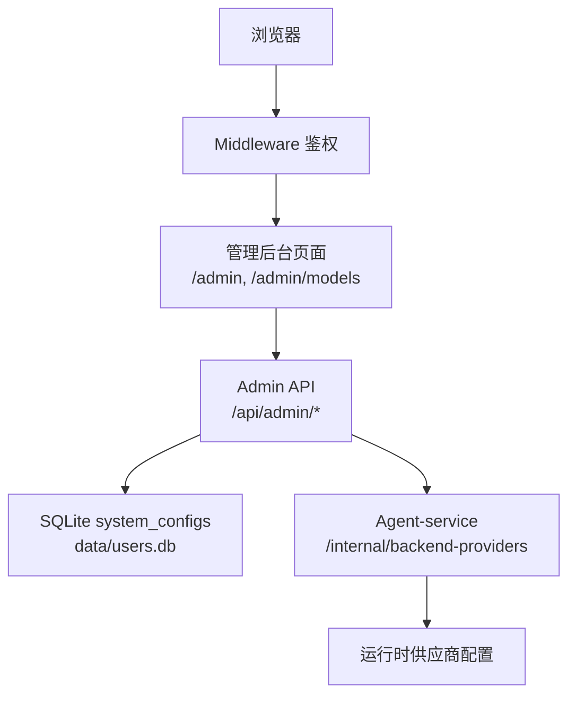
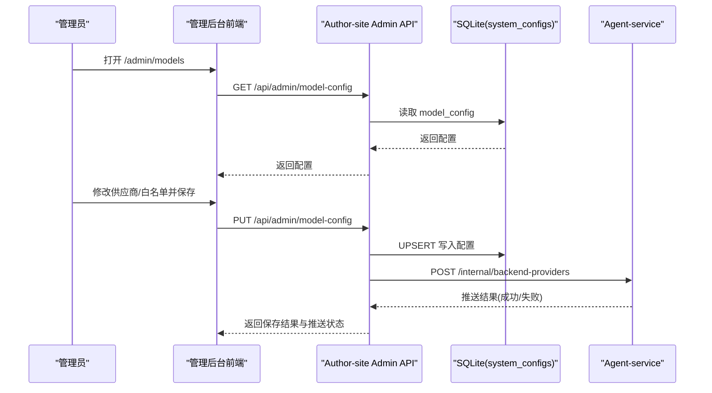
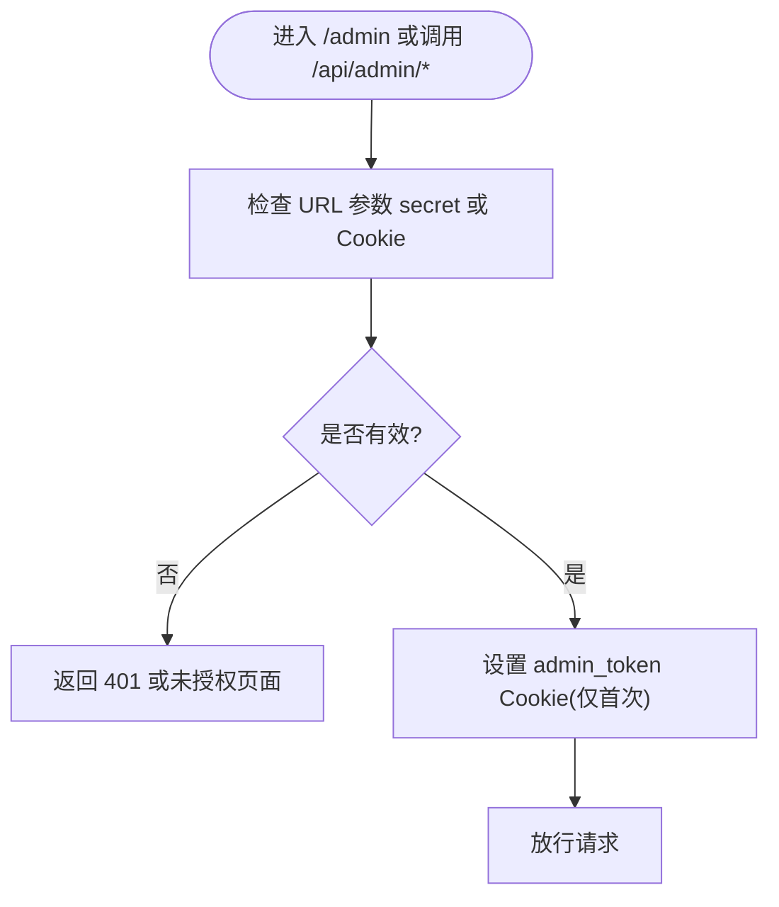
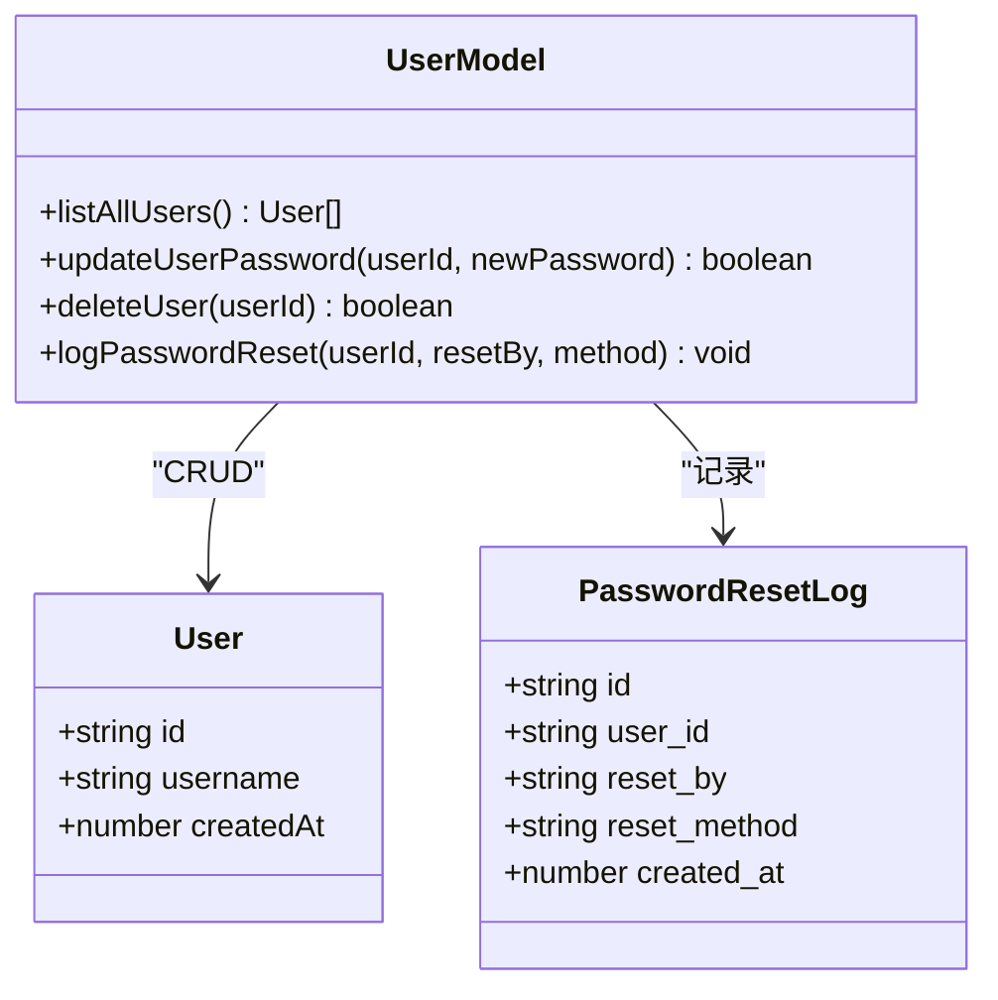
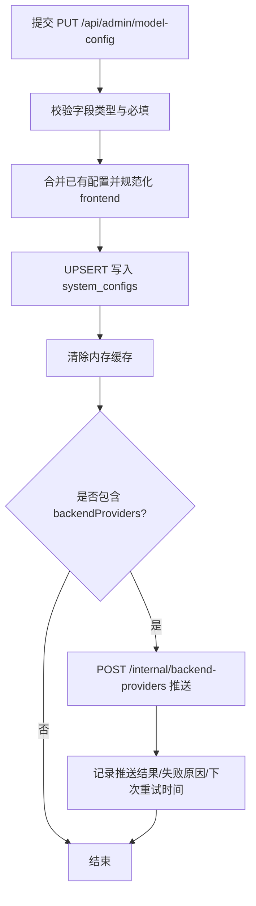
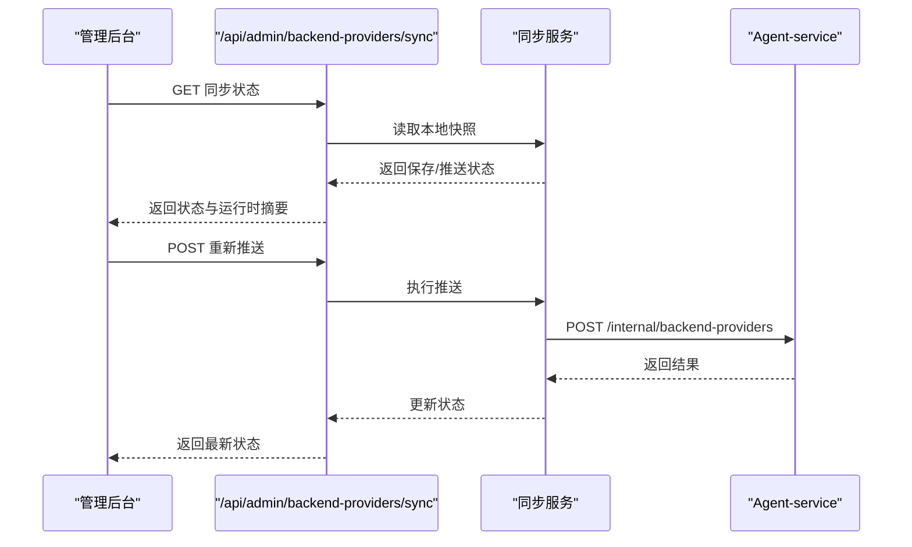
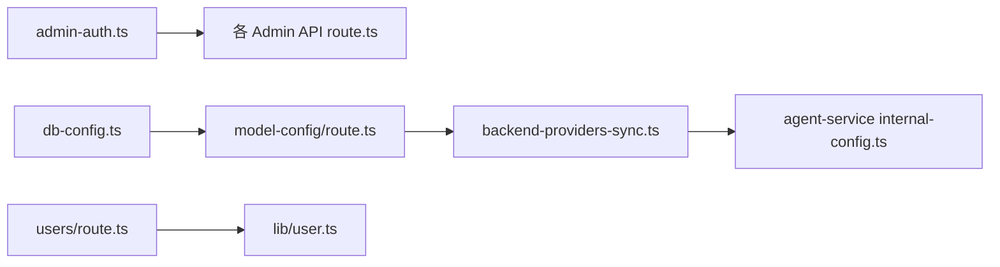

# 管理后台

<cite>
**本文引用的文件**   
- [01_架构设计.md](file://docs/项目文档/创作端/08-管理后台/技术/01_架构设计.md)
- [admin-auth.ts](file://packages/author-site/src/lib/admin-auth.ts)
- [db-config.ts](file://packages/author-site/src/lib/db-config.ts)
- [model-config/route.ts](file://packages/author-site/src/app/api/admin/model-config/route.ts)
- [users/route.ts](file://packages/author-site/src/app/api/admin/users/route.ts)
- [user.ts](file://packages/author-site/src/lib/user.ts)
- [schema.ts](file://packages/author-site/src/lib/db/schema.ts)
- [backend-providers/sync/route.ts](file://packages/author-site/src/app/api/admin/backend-providers/sync/route.ts)
- [available-models/route.ts](file://packages/author-site/src/app/api/admin/available-models/route.ts)
- [reload-config/route.ts](file://packages/author-site/src/app/api/admin/reload-config/route.ts)
- [models/config/route.ts](file://packages/author-site/src/app/api/models/config/route.ts)
- [agent-service models.ts](file://packages/agent-service/src/routes/models.ts)
- [agent-service internal-config.ts](file://packages/agent-service/src/routes/internal-config.ts)
- [agent-service backend-providers.ts](file://packages/agent-service/src/config/backend-providers.ts)
</cite>

## 目录
1. [简介](#简介)
2. [项目结构](#项目结构)
3. [核心组件](#核心组件)
4. [架构总览](#架构总览)
5. [详细组件分析](#详细组件分析)
6. [依赖关系分析](#依赖关系分析)
7. [性能与可靠性](#性能与可靠性)
8. [故障排查指南](#故障排查指南)
9. [结论](#结论)
10. [附录：管理 API 参考](#附录管理-api-参考)

## 简介
本文件为“管理后台”的权威功能与技术文档，覆盖管理员权限控制、用户管理、模型配置管理、系统监控、数据备份与恢复、以及完整的管理 API 参考与运维操作指南。内容基于仓库中现有实现进行梳理与归纳，确保与实际代码一致。

## 项目结构
管理后台采用三层架构：浏览器访问 → Middleware 鉴权 → 页面渲染 → API 读写配置 → SQLite 存储；同时支持将全局供应商配置推送至 agent-service 并维护同步状态。

图表来源
- [01_架构设计.md:24-44](file://docs/项目文档/创作端/08-管理后台/技术/01_架构设计.md#L24-L44)
- [01_架构设计.md:205-233](file://docs/项目文档/创作端/08-管理后台/技术/01_架构设计.md#L205-L233)

章节来源
- [01_架构设计.md:24-44](file://docs/项目文档/创作端/08-管理后台/技术/01_架构设计.md#L24-L44)
- [01_架构设计.md:205-233](file://docs/项目文档/创作端/08-管理后台/技术/01_架构设计.md#L205-L233)

## 核心组件
- 鉴权模块：提供 Admin Secret 校验、Cookie 签发与验证，统一拦截 /admin 与 /api/admin/*。
- 配置持久化：通过 db-config 封装对 system_configs 表的读写，支持 UPSERT 与元信息记录。
- 模型配置 API：提供获取与更新模型白名单、后端供应商配置，自动合并新旧结构并推送到 agent-service。
- 用户管理 API：提供用户列表查询、密码重置、删除等能力（当前已实现列表与密码重置/删除逻辑）。
- 同步与缓存：内存缓存 + 启动自动恢复 + 手动重试，保证配置热更新与一致性。

章节来源
- [admin-auth.ts:1-134](file://packages/author-site/src/lib/admin-auth.ts#L1-L134)
- [db-config.ts:1-130](file://packages/author-site/src/lib/db-config.ts#L1-L130)
- [model-config/route.ts:1-353](file://packages/author-site/src/app/api/admin/model-config/route.ts#L1-L353)
- [users/route.ts:1-16](file://packages/author-site/src/app/api/admin/users/route.ts#L1-L16)
- [user.ts:286-338](file://packages/author-site/src/lib/user.ts#L286-L338)
- [01_架构设计.md:126-173](file://docs/项目文档/创作端/08-管理后台/技术/01_架构设计.md#L126-L173)

## 架构总览
管理后台在 Next.js App Router 下运行，使用 Edge Runtime 兼容的鉴权中间件保护管理路由；配置落盘到 SQLite，并通过内部接口向 agent-service 推送全局供应商配置，形成“保存即生效”的热更新链路。

图表来源
- [01_架构设计.md:63-93](file://docs/项目文档/创作端/08-管理后台/技术/01_架构设计.md#L63-L93)
- [model-config/route.ts:179-353](file://packages/author-site/src/app/api/admin/model-config/route.ts#L179-L353)
- [agent-service internal-config.ts](file://packages/agent-service/src/routes/internal-config.ts)

## 详细组件分析

### 管理员权限控制系统
- 鉴权方式
  - URL 参数 secret 首次验证后设置 httpOnly Cookie，后续请求携带 Cookie 免密访问。
  - API 支持 Authorization: Bearer <secret> 或 Cookie 两种形式。
- 中间件保护
  - /admin 路径未授权重定向到 401 页面。
  - /api/admin/* 未授权返回 401 JSON。
- 安全要点
  - Cookie 设置 httpOnly、SameSite=Lax、生产环境 secure。
  - 密钥以哈希值比对，避免明文泄露。

图表来源
- [admin-auth.ts:38-134](file://packages/author-site/src/lib/admin-auth.ts#L38-L134)
- [01_架构设计.md:303-328](file://docs/项目文档/创作端/08-管理后台/技术/01_架构设计.md#L303-L328)

章节来源
- [admin-auth.ts:1-134](file://packages/author-site/src/lib/admin-auth.ts#L1-L134)
- [01_架构设计.md:303-328](file://docs/项目文档/创作端/08-管理后台/技术/01_架构设计.md#L303-L328)

### 用户管理功能
- 能力现状
  - 用户列表：GET /api/admin/users 返回所有注册用户基本信息（不含敏感字段）。
  - 密码重置：支持按用户 ID 重置密码并记录审计日志。
  - 删除用户：级联清理相关日志后删除用户。
- 数据结构
  - users 表包含 id、username、password_hash、created_at。
  - password_reset_logs 记录重置来源与方法。
- 批量操作
  - 当前未提供批量创建/批量禁用/批量删除接口；可通过循环调用单条接口实现。

图表来源
- [user.ts:286-338](file://packages/author-site/src/lib/user.ts#L286-L338)
- [schema.ts:1-51](file://packages/author-site/src/lib/db/schema.ts#L1-L51)

章节来源
- [users/route.ts:1-16](file://packages/author-site/src/app/api/admin/users/route.ts#L1-L16)
- [user.ts:286-338](file://packages/author-site/src/lib/user.ts#L286-L338)
- [schema.ts:1-51](file://packages/author-site/src/lib/db/schema.ts#L1-L51)

### 模型配置管理
- 功能范围
  - 前端模型白名单：enabledModels 与 autoEnableRules 双向兼容旧结构。
  - 后端供应商配置：providers、activeProviderId、activeModelId、multimodalModels。
  - 热更新：保存后立即清除内存缓存，必要时推送至 agent-service。
- 关键流程
  - 保存时自动将启用供应商的前缀规则注入 frontend.autoEnableRules，避免新模型被过滤。
  - 若推送失败，不阻塞保存，由后台有限指数退避重试与管理页手动重试兜底。

图表来源
- [model-config/route.ts:179-353](file://packages/author-site/src/app/api/admin/model-config/route.ts#L179-L353)
- [01_架构设计.md:77-110](file://docs/项目文档/创作端/08-管理后台/技术/01_架构设计.md#L77-L110)

章节来源
- [model-config/route.ts:1-353](file://packages/author-site/src/app/api/admin/model-config/route.ts#L1-L353)
- [01_架构设计.md:185-277](file://docs/项目文档/创作端/08-管理后台/技术/01_架构设计.md#L185-L277)

### 系统监控与告警
- 监控点
  - 同步状态：数据库保存状态、最近一次推送成功/失败时间与原因、agent-service 运行时摘要。
  - 模型拉取：代理 agent-service /models 获取可用模型列表。
- 告警机制
  - 当前未内置独立告警通道；建议结合外部日志/指标平台对接，对推送失败率、延迟等阈值触发告警。

图表来源
- [01_架构设计.md:97-110](file://docs/项目文档/创作端/08-管理后台/技术/01_架构设计.md#L97-L110)
- [backend-providers/sync/route.ts](file://packages/author-site/src/app/api/admin/backend-providers/sync/route.ts)

章节来源
- [01_架构设计.md:97-110](file://docs/项目文档/创作端/08-管理后台/技术/01_架构设计.md#L97-L110)
- [backend-providers/sync/route.ts](file://packages/author-site/src/app/api/admin/backend-providers/sync/route.ts)

### 数据备份与恢复
- 备份范围
  - 必须持久化 data/users.db 及其 WAL/SHM 文件，以及项目、会话、发布数据目录。
- 策略建议
  - 全量备份：定期拷贝 users.db 及业务数据目录。
  - 增量备份：基于文件系统变更或数据库 WAL 滚动策略实施。
  - 灾难恢复：停止服务后替换数据库与数据目录，重启服务即可恢复。
- 注意事项
  - Docker 部署需将容器内 /app/data 绑定到稳定宿主机目录，避免临时 volume 导致数据丢失。

章节来源
- [01_架构设计.md:299-302](file://docs/项目文档/创作端/08-管理后台/技术/01_架构设计.md#L299-L302)

## 依赖关系分析
- 组件耦合
  - 鉴权模块被中间件与各 Admin API 复用，低耦合高内聚。
  - 配置读写集中在 db-config，API 层仅负责校验与编排。
  - 同步逻辑集中到 backend-providers-sync，避免在各处重复实现。
- 外部依赖
  - SQLite 作为唯一持久化存储。
  - Agent-service 提供 /internal/backend-providers 接收全局供应商配置。

图表来源
- [admin-auth.ts:1-134](file://packages/author-site/src/lib/admin-auth.ts#L1-L134)
- [db-config.ts:1-130](file://packages/author-site/src/lib/db-config.ts#L1-L130)
- [model-config/route.ts:1-353](file://packages/author-site/src/app/api/admin/model-config/route.ts#L1-L353)
- [users/route.ts:1-16](file://packages/author-site/src/app/api/admin/users/route.ts#L1-L16)
- [user.ts:286-338](file://packages/author-site/src/lib/user.ts#L286-L338)
- [agent-service internal-config.ts](file://packages/agent-service/src/routes/internal-config.ts)

章节来源
- [01_架构设计.md:126-173](file://docs/项目文档/创作端/08-管理后台/技术/01_架构设计.md#L126-L173)

## 性能与可靠性
- 缓存策略
  - 内存缓存 TTL 1 分钟，保存配置后主动失效，支持手动刷新。
- 多实例注意
  - 当前内存缓存与同步状态为进程内，多实例需共享 SQLite 或引入 Redis/外部状态存储。
- 错误处理
  - 保存配置失败返回明确错误码；推送失败不阻塞保存，后台有限指数退避重试。

章节来源
- [01_架构设计.md:279-298](file://docs/项目文档/创作端/08-管理后台/技术/01_架构设计.md#L279-L298)
- [model-config/route.ts:179-353](file://packages/author-site/src/app/api/admin/model-config/route.ts#L179-L353)

## 故障排查指南
- 无法访问管理后台
  - 检查 ADMIN_SECRET 环境变量是否正确；确认 Cookie 是否过期或被浏览器拦截。
- 配置未生效
  - 确认内存缓存是否被清除；可调用重载接口强制刷新。
- 推送失败
  - 查看同步状态页的失败原因与下次重试时间；检查 agent-service 可达性与 INTERNAL_API_TOKEN。
- 用户操作异常
  - 核对 users 表结构与外键约束；确认密码重置日志是否写入。

章节来源
- [01_架构设计.md:303-328](file://docs/项目文档/创作端/08-管理后台/技术/01_架构设计.md#L303-L328)
- [reload-config/route.ts](file://packages/author-site/src/app/api/admin/reload-config/route.ts)
- [backend-providers/sync/route.ts](file://packages/author-site/src/app/api/admin/backend-providers/sync/route.ts)

## 结论
管理后台围绕“鉴权—配置—同步”的主线构建，具备热更新、容错与可观测性基础能力。建议在多实例部署场景升级缓存与状态存储方案，并接入统一的日志与告警体系，以提升整体稳定性与可运维性。

## 附录：管理 API 参考
- 页面路由
  - /admin：管理后台概览首页
  - /admin/models：AI 模型管理页
- Admin API
  - GET /api/admin/available-models：获取后端可用模型列表（需 Admin Secret）
  - GET /api/admin/model-config：获取当前模型配置（需 Admin Secret）
  - PUT /api/admin/model-config：更新模型配置（需 Admin Secret）
  - GET /api/admin/backend-providers/sync：获取保存/同步状态与运行时摘要（需 Admin Secret）
  - POST /api/admin/backend-providers/sync：重新推送全局供应商配置（需 Admin Secret）
  - POST /api/admin/reload-config：手动清除配置缓存（需 Admin Secret）
  - GET /api/admin/users：获取所有注册用户列表（需 Admin Secret）
- 公开 API
  - GET /api/models/config：公开模型配置（供前端组件调用，登录用户）
- Agent-service 路由
  - GET /models：查询可用模型列表（供管理后台代理）
  - POST /internal/backend-providers：接收全局供应商配置
  - GET /internal/backend-providers：获取当前全局供应商配置（调试用，API Key 脱敏）

章节来源
- [01_架构设计.md:205-233](file://docs/项目文档/创作端/08-管理后台/技术/01_架构设计.md#L205-L233)
- [model-config/route.ts:1-353](file://packages/author-site/src/app/api/admin/model-config/route.ts#L1-L353)
- [users/route.ts:1-16](file://packages/author-site/src/app/api/admin/users/route.ts#L1-L16)
- [models/config/route.ts](file://packages/author-site/src/app/api/models/config/route.ts)
- [agent-service models.ts](file://packages/agent-service/src/routes/models.ts)
- [agent-service internal-config.ts](file://packages/agent-service/src/routes/internal-config.ts)
- [agent-service backend-providers.ts](file://packages/agent-service/src/config/backend-providers.ts)