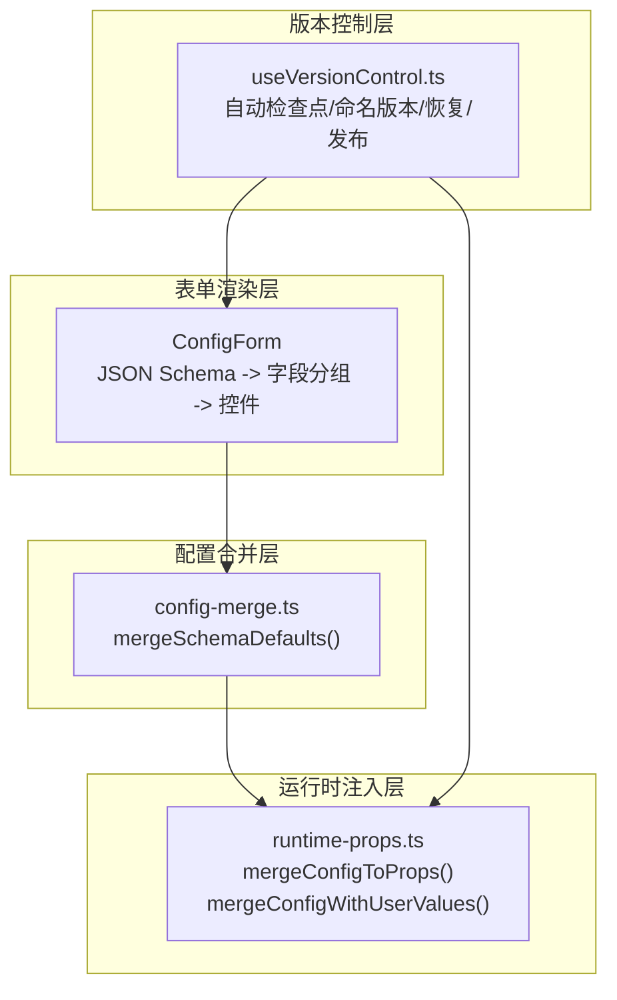
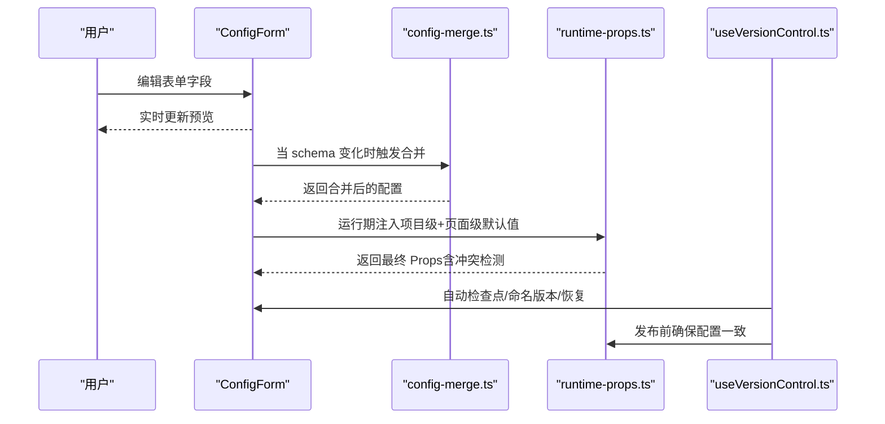
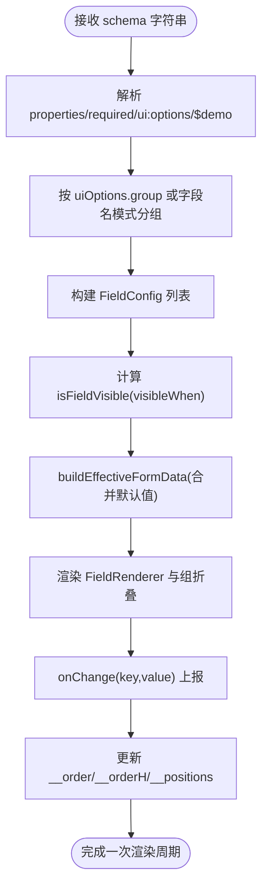
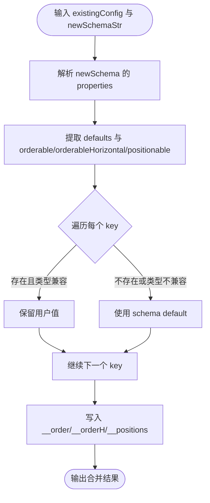
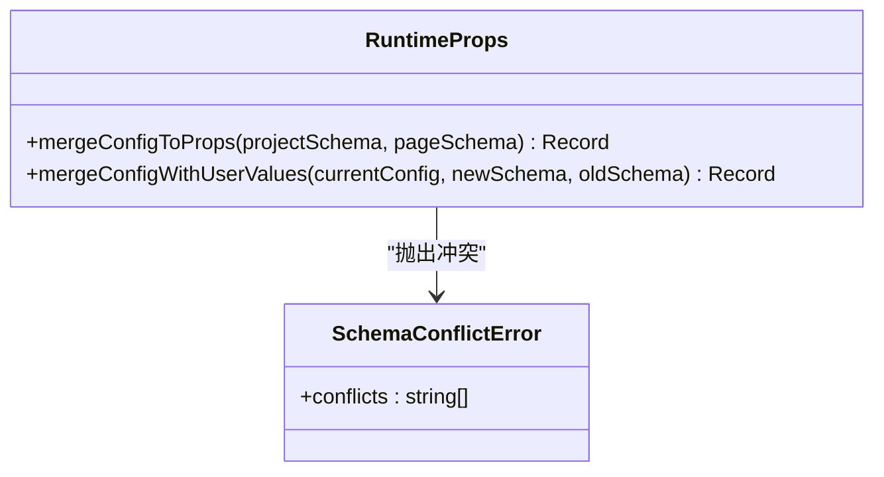
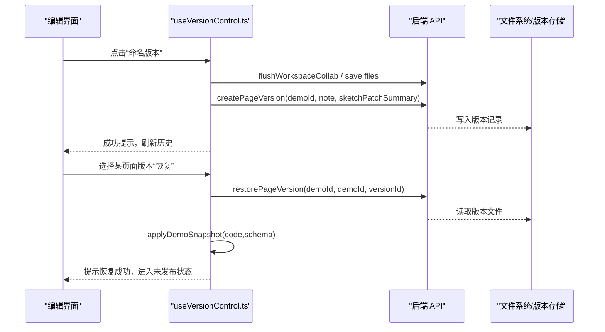
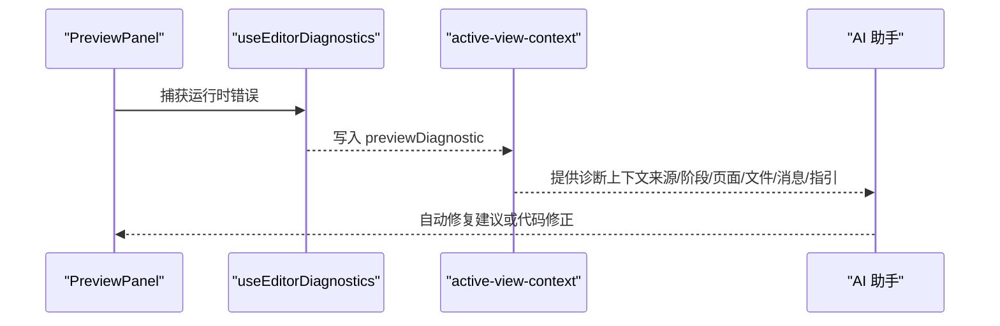
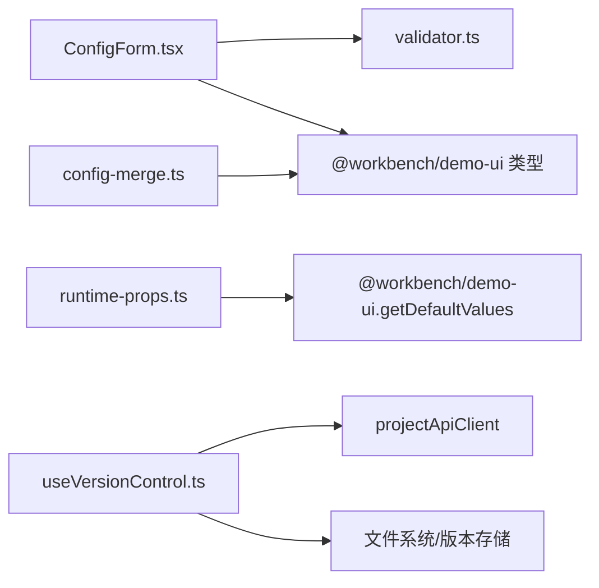

# 配置编辑器

<cite>
**本文引用的文件**
- [packages/demo-ui/src/ConfigForm.tsx](file://packages/demo-ui/src/ConfigForm.tsx)
- [packages/author-site/src/lib/config-merge.ts](file://packages/author-site/src/lib/config-merge.ts)
- [packages/author-site/src/lib/runtime-props.ts](file://packages/author-site/src/lib/runtime-props.ts)
- [packages/author-site/src/app/demo/[id]/edit/hooks/useVersionControl.ts](file://packages/author-site/src/app/demo/[id]/edit/hooks/useVersionControl.ts)
- [docs/项目文档/创作端/04-配置与预览/技术/03_表单生成器.md](file://docs/项目文档/创作端/04-配置与预览/技术/03_表单生成器.md)
- [docs/项目文档/创作端/04-配置与预览/技术/04_配置合并策略.md](file://docs/项目文档/创作端/04-配置与预览/技术/04_配置合并策略.md)
- [docs/项目文档/创作端/03-项目管理/技术/06_项目工作空间迁移方案.md](file://docs/项目文档/创作端/03-项目管理/技术/06_项目工作空间迁移方案.md)
- [docs/项目文档/创作端/03-项目管理/技术/04_版本管理.md](file://docs/项目文档/创作端/03-项目管理/技术/04_版本管理.md)
- [packages/author-site/src/lib/agent/active-view-context.ts](file://packages/author-site/src/lib/agent/active-view-context.ts)
- [packages/author-site/src/app/demo/[id]/edit/page.tsx](file://packages/author-site/src/app/demo/[id]/edit/page.tsx)
</cite>

## 目录
1. [简介](#简介)
2. [项目结构](#项目结构)
3. [核心组件](#核心组件)
4. [架构总览](#架构总览)
5. [详细组件分析](#详细组件分析)
6. [依赖关系分析](#依赖关系分析)
7. [性能考量](#性能考量)
8. [故障排查指南](#故障排查指南)
9. [结论](#结论)
10. [附录](#附录)

## 简介
本技术文档围绕“配置编辑器”展开，聚焦以下目标：
- JSON Schema 驱动的动态表单渲染、字段验证与用户交互
- 配置合并策略（默认值继承、环境特定配置、运行时覆盖）
- 配置版本管理（变更追踪、回滚机制、冲突解决）
- 配置预览能力（实时效果展示与错误诊断）
- 国际化支持与主题定制能力
- Schema 定义规范与自定义控件开发指南

## 项目结构
配置编辑器由“表单渲染层”、“配置合并层”、“运行时注入层”和“版本控制层”组成。关键模块分布如下：
- 表单渲染层：基于 JSON Schema 解析为字段分组与控件，支持可见性条件、排序与定位元数据等
- 配置合并层：在 schema 变更时智能合并旧配置与新默认值，保留用户修改并处理类型兼容
- 运行时注入层：将项目级与页面级 schema 的 default 值合并为运行时 Props，并进行冲突检测
- 版本控制层：提供自动检查点、命名版本、恢复、发布状态同步等能力

图表来源
- [packages/demo-ui/src/ConfigForm.tsx](file://packages/demo-ui/src/ConfigForm.tsx)
- [packages/author-site/src/lib/config-merge.ts](file://packages/author-site/src/lib/config-merge.ts)
- [packages/author-site/src/lib/runtime-props.ts](file://packages/author-site/src/lib/runtime-props.ts)
- [packages/author-site/src/app/demo/[id]/edit/hooks/useVersionControl.ts](file://packages/author-site/src/app/demo/[id]/edit/hooks/useVersionControl.ts)

章节来源
- [packages/demo-ui/src/ConfigForm.tsx](file://packages/demo-ui/src/ConfigForm.tsx)
- [packages/author-site/src/lib/config-merge.ts](file://packages/author-site/src/lib/config-merge.ts)
- [packages/author-site/src/lib/runtime-props.ts](file://packages/author-site/src/lib/runtime-props.ts)
- [packages/author-site/src/app/demo/[id]/edit/hooks/useVersionControl.ts](file://packages/author-site/src/app/demo/[id]/edit/hooks/useVersionControl.ts)

## 核心组件
- ConfigForm：根据 JSON Schema 字符串解析出字段分组与控件树，维护有效表单数据、可见性与布局元数据（__order/__orderH/__positions），并提供字段变更回调与 Schema 笔记更新能力
- config-merge.ts：实现 mergeSchemaDefaults，按规则合并现有配置与新 schema 默认值，保证类型兼容与元数据一致性
- runtime-props.ts：在运行期合并项目级与页面级 schema 的 default 值，进行字段冲突检测，并提供 mergeConfigWithUserValues 用于保留用户修改
- useVersionControl.ts：封装版本历史加载、自动检查点、命名版本、页面版本恢复与发布状态同步

章节来源
- [packages/demo-ui/src/ConfigForm.tsx](file://packages/demo-ui/src/ConfigForm.tsx)
- [packages/author-site/src/lib/config-merge.ts](file://packages/author-site/src/lib/config-merge.ts)
- [packages/author-site/src/lib/runtime-props.ts](file://packages/author-site/src/lib/runtime-props.ts)
- [packages/author-site/src/app/demo/[id]/edit/hooks/useVersionControl.ts](file://packages/author-site/src/app/demo/[id]/edit/hooks/useVersionControl.ts)

## 架构总览
下图展示了从 Schema 到表单渲染、配置合并、运行时注入以及版本控制的端到端流程。

图表来源
- [packages/demo-ui/src/ConfigForm.tsx](file://packages/demo-ui/src/ConfigForm.tsx)
- [packages/author-site/src/lib/config-merge.ts](file://packages/author-site/src/lib/config-merge.ts)
- [packages/author-site/src/lib/runtime-props.ts](file://packages/author-site/src/lib/runtime-props.ts)
- [packages/author-site/src/app/demo/[id]/edit/hooks/useVersionControl.ts](file://packages/author-site/src/app/demo/[id]/edit/hooks/useVersionControl.ts)

## 详细组件分析

### JSON Schema 驱动的表单渲染
- 解析与分组：将 properties 解析为 FieldGroup，支持显式 group 或按字段名模式自动分组（颜色、尺寸、文本、图片、显示选项、动画、布局、基础配置）
- 可见性条件：支持 visibleWhen 条件（field + equals），结合有效表单数据进行过滤
- 控件映射：
  - 文本/数字/布尔/枚举/富文本/颜色/图片上传/图片列表等
  - 数组支持 string 或 object itemsType，对象数组以 JSON 文本框编辑
  - 数值范围支持滑块与单位推断（px/ms 等）
- 布局元数据：
  - __order：垂直排序；__orderH：水平排序；__positions：定位信息（x,y）
- 变更通知：onChange 回调逐字段上报，父组件可聚合保存
- Schema 笔记：支持 $demo.note 的读取与更新，便于提示说明

图表来源
- [packages/demo-ui/src/ConfigForm.tsx](file://packages/demo-ui/src/ConfigForm.tsx)

章节来源
- [packages/demo-ui/src/ConfigForm.tsx](file://packages/demo-ui/src/ConfigForm.tsx)
- [docs/项目文档/创作端/04-配置与预览/技术/03_表单生成器.md](file://docs/项目文档/创作端/04-配置与预览/技术/03_表单生成器.md)

### 配置合并策略
- 核心函数：mergeSchemaDefaults(existingConfig, newSchemaStr)
- 合并规则：
  - 新增字段：使用 schema default
  - 删除字段：从配置中移除
  - 仍存在且类型兼容：保留用户值
  - 类型不兼容：使用新 default
  - 元数据：__order/__orderH/__positions 始终来自当前 schema
- 类型兼容性：string/number/integer/boolean/array/object 严格校验
- 集成方式：在 applyDemoSnapshot/handleEditorChange 等场景调用，避免 AI 修改 schema 后丢失用户值

图表来源
- [packages/author-site/src/lib/config-merge.ts](file://packages/author-site/src/lib/config-merge.ts)

章节来源
- [packages/author-site/src/lib/config-merge.ts](file://packages/author-site/src/lib/config-merge.ts)
- [docs/项目文档/创作端/04-配置与预览/技术/04_配置合并策略.md](file://docs/项目文档/创作端/04-配置与预览/技术/04_配置合并策略.md)

### 运行时 Props 注入与冲突检测
- 合并来源：项目级 schema 与页面级 schema 的 default 值
- 冲突检测：同名字段（排除保留键 __order/__orderH/__positions）抛出 SchemaConflictError
- 位置元数据合并：__positions 按项目级与页面级顺序叠加，页面级优先
- 用户修改保留：mergeConfigWithUserValues(currentConfig, newSchema, oldSchema?) 对比新旧默认值，仅保留用户修改过的值

图表来源
- [packages/author-site/src/lib/runtime-props.ts](file://packages/author-site/src/lib/runtime-props.ts)

章节来源
- [packages/author-site/src/lib/runtime-props.ts](file://packages/author-site/src/lib/runtime-props.ts)

### 版本管理与回滚
- 自动检查点：空闲与持续编辑两种策略，防丢与批量提交
- 命名版本：创建页面版本记录，附带备注与 SketchPatch 摘要
- 页面版本恢复：拉取指定版本的代码与 schema，应用至当前会话并标记未发布变更
- 发布状态：从未发布/已发布/有未发布变更三种状态，发布前可选同步工作区
- 工作区与版本：先同步再快照，基线随版本推进，数量受控（最多保留 50 条）

图表来源
- [packages/author-site/src/app/demo/[id]/edit/hooks/useVersionControl.ts](file://packages/author-site/src/app/demo/[id]/edit/hooks/useVersionControl.ts)

章节来源
- [packages/author-site/src/app/demo/[id]/edit/hooks/useVersionControl.ts](file://packages/author-site/src/app/demo/[id]/edit/hooks/useVersionControl.ts)
- [docs/项目文档/创作端/03-项目管理/技术/06_项目工作空间迁移方案.md](file://docs/项目文档/创作端/03-项目管理/技术/06_项目工作空间迁移方案.md)
- [docs/项目文档/创作端/03-项目管理/技术/04_版本管理.md](file://docs/项目文档/创作端/03-项目管理/技术/04_版本管理.md)

### 配置预览与错误诊断
- 预览错误捕获：统一收集 previewDiagnostic，包含来源、阶段、页面、文件、错误信息与修复指引
- 诊断上下文：active-view-context 汇总最近一次预览诊断，辅助 AI 自动修复
- 前端集成：在编辑页中通过 useEditorDiagnostics 收集快照并上报

图表来源
- [packages/author-site/src/lib/agent/active-view-context.ts](file://packages/author-site/src/lib/agent/active-view-context.ts)
- [packages/author-site/src/app/demo/[id]/edit/page.tsx](file://packages/author-site/src/app/demo/[id]/edit/page.tsx)

章节来源
- [packages/author-site/src/lib/agent/active-view-context.ts](file://packages/author-site/src/lib/agent/active-view-context.ts)
- [packages/author-site/src/app/demo/[id]/edit/page.tsx](file://packages/author-site/src/app/demo/[id]/edit/page.tsx)

### 国际化与主题定制
- 国际化：
  - 表单标题与占位符采用中文文案，可通过扩展 uiOptions 或字段 title 进行本地化
  - 发布资源本地化支持图片路径改写与下载，减少对外部资源的依赖
- 主题定制：
  - 表单控件基于通用 UI 组件（按钮、开关、滑块、输入、下拉、提示、分隔、折叠等），可通过主题变量与样式类名进行外观定制
  - 字段分组颜色与图标可按需扩展

章节来源
- [packages/demo-ui/src/ConfigForm.tsx](file://packages/demo-ui/src/ConfigForm.tsx)
- [docs/项目文档/创作端/03-项目管理/技术/12_发布资源本地化.md](file://docs/项目文档/创作端/03-项目管理/技术/12_发布资源本地化.md)

### Schema 定义规范与自定义控件
- 字段属性：
  - 基本：key/title/type/description/required/default/enum/enumNames/minimum/maximum/maxLength/format
  - UI 扩展：ui:widget/ui:options/group/category/visibleWhen/$demo.note/itemsType
- 可见性条件：visibleWhen.field 与 visibleWhen.equals 组合
- 布局元数据：$demo.orderable/$demo.orderableHorizontal/$demo.positionable
- 自定义控件：
  - 通过 ui:widget 指定控件类型（如 file/image/imageList/richtext）
  - 通过 ui:options 传递控件参数（如 maxItems、类别、可见性条件等）
  - 复杂数组支持 itemsType=object 的 JSON 文本编辑

章节来源
- [packages/demo-ui/src/ConfigForm.tsx](file://packages/demo-ui/src/ConfigForm.tsx)
- [docs/项目文档/创作端/04-配置与预览/技术/03_表单生成器.md](file://docs/项目文档/创作端/04-配置与预览/技术/03_表单生成器.md)

## 依赖关系分析
- ConfigForm 依赖 validator 工具获取 orderable/orderableHorizontal/positionable 等布局能力
- config-merge.ts 依赖 DemoSchema 类型，负责合并逻辑与类型兼容
- runtime-props.ts 依赖 @workbench/demo-ui 的 getDefaultValues，并在运行期执行冲突检测
- useVersionControl.ts 依赖 projectApiClient 与文件系统操作，协调自动检查点与版本恢复

图表来源
- [packages/demo-ui/src/ConfigForm.tsx](file://packages/demo-ui/src/ConfigForm.tsx)
- [packages/author-site/src/lib/config-merge.ts](file://packages/author-site/src/lib/config-merge.ts)
- [packages/author-site/src/lib/runtime-props.ts](file://packages/author-site/src/lib/runtime-props.ts)
- [packages/author-site/src/app/demo/[id]/edit/hooks/useVersionControl.ts](file://packages/author-site/src/app/demo/[id]/edit/hooks/useVersionControl.ts)

章节来源
- [packages/demo-ui/src/ConfigForm.tsx](file://packages/demo-ui/src/ConfigForm.tsx)
- [packages/author-site/src/lib/config-merge.ts](file://packages/author-site/src/lib/config-merge.ts)
- [packages/author-site/src/lib/runtime-props.ts](file://packages/author-site/src/lib/runtime-props.ts)
- [packages/author-site/src/app/demo/[id]/edit/hooks/useVersionControl.ts](file://packages/author-site/src/app/demo/[id]/edit/hooks/useVersionControl.ts)

## 性能考量
- 表单渲染：
  - 使用 useMemo 缓存解析结果与可见性过滤，降低重复计算
  - 有效表单数据 buildEffectiveFormData 仅在 fieldGroups 或 formData 变化时重建
- 配置合并：
  - O(n) 复杂度，n 为 properties 数量，纯函数易于缓存
- 版本控制：
  - 自动检查点去重签名，避免重复提交
  - 批量合并与异步提交，减少阻塞

[本节为通用指导，无需具体文件分析]

## 故障排查指南
- 表单值不同步：
  - 现象：Schema 变更后表单仍显示旧值
  - 原因：RJSF Form 内部状态不会因 formData 变更而重置
  - 解决：在父组件为 ConfigForm 添加 key={schema}，强制重新挂载
- 运行时冲突：
  - 现象：项目级与页面级 schema 出现同名字段
  - 解决：调整字段命名或使用保留键 __order/__orderH/__positions 之外的命名空间
- 预览错误：
  - 现象：预览区报错但无明确指引
  - 解决：查看 active-view-context 中的 previewDiagnostic，依据 instruction 进行修复
- 版本恢复失败：
  - 现象：恢复页面版本时报错
  - 解决：确认页面版本文件是否存在，检查网络与权限，重试恢复

章节来源
- [docs/项目文档/创作端/04-配置与预览/技术/03_表单生成器.md](file://docs/项目文档/创作端/04-配置与预览/技术/03_表单生成器.md)
- [packages/author-site/src/lib/runtime-props.ts](file://packages/author-site/src/lib/runtime-props.ts)
- [packages/author-site/src/lib/agent/active-view-context.ts](file://packages/author-site/src/lib/agent/active-view-context.ts)
- [packages/author-site/src/app/demo/[id]/edit/hooks/useVersionControl.ts](file://packages/author-site/src/app/demo/[id]/edit/hooks/useVersionControl.ts)

## 结论
配置编辑器通过 JSON Schema 驱动表单渲染、智能合并策略与运行期注入，实现了高可扩展的配置管理能力。配合完善的版本控制与预览诊断，显著提升了协作效率与用户体验。未来可在国际化与主题定制方面进一步抽象，提供更灵活的本地化与外观定制能力。

[本节为总结，无需具体文件分析]

## 附录
- 术语
  - Schema：描述配置结构与默认值的 JSON 文档
  - 有效表单数据：默认值与用户值的合并结果
  - 保留键：__order/__orderH/__positions，用于布局与定位元数据
- 最佳实践
  - 合理拆分字段分组，提升可读性
  - 使用 visibleWhen 控制复杂条件的字段显示
  - 谨慎修改字段类型，避免破坏用户值兼容性
  - 在发布前进行预览与诊断，确保配置与代码一致

[本节为补充说明，无需具体文件分析]