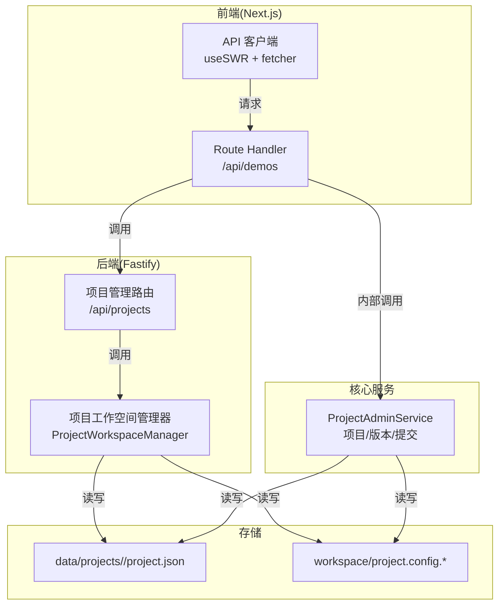
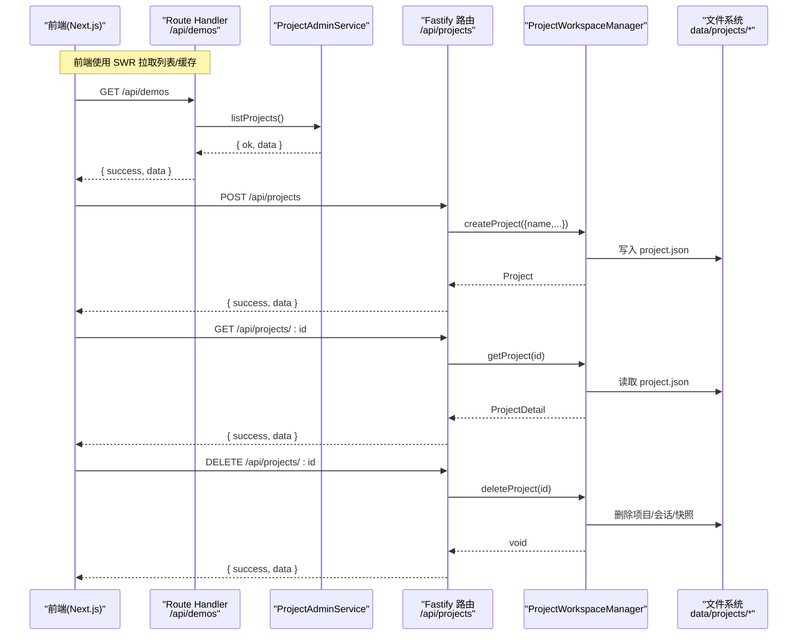
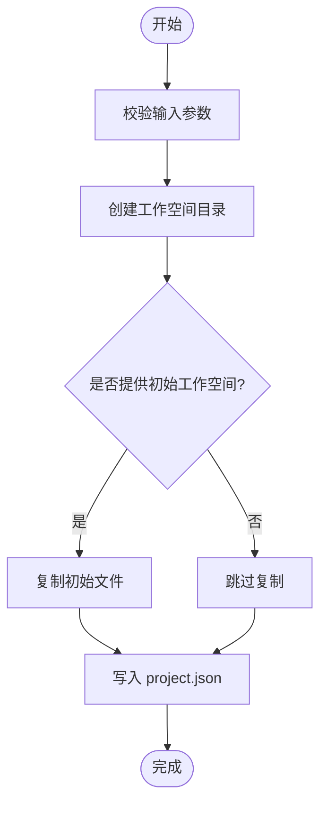
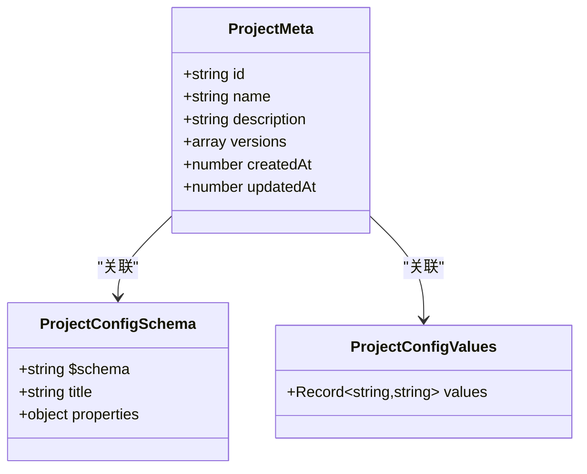
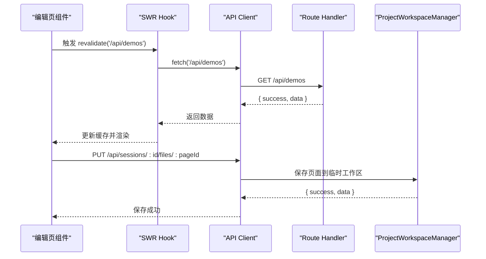
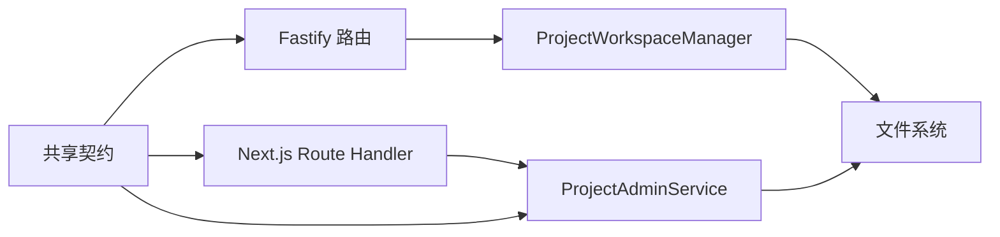

# 项目CRUD操作

<cite>
**本文引用的文件**
- [packages/agent-service/src/routes/projects.ts](file://packages/agent-service/src/routes/projects.ts)
- [packages/agent-service/src/workspace/project-workspace-manager.ts](file://packages/agent-service/src/workspace/project-workspace-manager.ts)
- [packages/author-site/src/app/api/demos/route.ts](file://packages/author-site/src/app/api/demos/route.ts)
- [packages/author-site/src/lib/project-admin-service.ts](file://packages/author-site/src/lib/project-admin-service.ts)
- [packages/project-core/src/service.ts](file://packages/project-core/src/service.ts)
- [packages/shared/src/contracts.ts](file://packages/shared/src/contracts.ts)
- [data/projects/proj_1782718595285_h4lda7/workspace/project.config.schema.json](file://data/projects/proj_1782718595285_h4lda7/workspace/project.config.schema.json)
- [data/projects/proj_1782718595285_h4lda7/workspace/project.config.values.json](file://data/projects/proj_1782718595285_h4lda7/workspace/project.config.values.json)
- [docs/项目文档/创作端/06-基础设施/技术/01_路由设计.md](file://docs/项目文档/创作端/06-基础设施/技术/01_路由设计.md)
- [docs/项目文档/创作端/02-Demo管理/技术/01_页面架构与路由设计.md](file://docs/项目文档/创作端/02-Demo管理/技术/01_页面架构与路由设计.md)
- [packages/author-site/src/lib/api.ts](file://packages/author-site/src/lib/api.ts)
- [packages/author-site/src/app/demo/[id]/edit/page.tsx](file://packages/author-site/src/app/demo/[id]/edit/page.tsx)
</cite>

## 目录
1. [简介](#简介)
2. [项目结构](#项目结构)
3. [核心组件](#核心组件)
4. [架构总览](#架构总览)
5. [详细组件分析](#详细组件分析)
6. [依赖关系分析](#依赖关系分析)
7. [性能考量](#性能考量)
8. [故障排查指南](#故障排查指南)
9. [结论](#结论)
10. [附录](#附录)

## 简介
本技术文档聚焦于项目的“创建、读取、更新、删除（CRUD）”能力，覆盖后端服务层、文件系统持久化、元数据管理与验证机制、RESTful API 设计、以及前端组件与服务端的交互模式。文档同时给出端到端的数据流图、关键流程时序图与最佳实践建议，帮助读者快速理解并正确扩展项目 CRUD 功能。

## 项目结构
本项目采用多包工作区组织，CRUD 相关的关键位置如下：
- 后端服务（Fastify）：负责 REST 路由与项目工作空间管理
- 创作端 Next.js：提供 Route Handler 与统一响应封装
- 项目核心服务：实现项目元数据、版本、内容提交等核心逻辑
- 共享契约：定义工作区变更、错误码等跨包类型
- 数据目录：以 JSON 文件形式持久化项目元数据、配置 Schema 与值

图表来源
- [packages/agent-service/src/routes/projects.ts:1-49](file://packages/agent-service/src/routes/projects.ts#L1-L49)
- [packages/agent-service/src/workspace/project-workspace-manager.ts:166-218](file://packages/agent-service/src/workspace/project-workspace-manager.ts#L166-L218)
- [packages/author-site/src/app/api/demos/route.ts:1-44](file://packages/author-site/src/app/api/demos/route.ts#L1-L44)
- [packages/author-site/src/lib/api.ts:1-57](file://packages/author-site/src/lib/api.ts#L1-L57)
- [packages/project-core/src/service.ts:477-521](file://packages/project-core/src/service.ts#L477-L521)

章节来源
- [packages/agent-service/src/routes/projects.ts:1-49](file://packages/agent-service/src/routes/projects.ts#L1-L49)
- [packages/author-site/src/app/api/demos/route.ts:1-44](file://packages/author-site/src/app/api/demos/route.ts#L1-L44)
- [packages/author-site/src/lib/api.ts:1-57](file://packages/author-site/src/lib/api.ts#L1-L57)
- [packages/project-core/src/service.ts:477-521](file://packages/project-core/src/service.ts#L477-L521)

## 核心组件
- 项目管理路由（Fastify）
  - 暴露 /api/projects 的 GET/POST 等接口，统一返回 { success, data } 或 { success, error }
  - 参数校验与异常处理，记录日志并返回标准错误体
- 项目工作空间管理器
  - 单例管理 projects/sessions/snapshots 目录
  - 提供 create/get/list/delete/openForEdit/saveChanges/discard/getVersionHistory 等方法
  - 基于 project.json 持久化项目元数据，按版本保留快照
- 创作端 Route Handler
  - 通过 Next.js Route Handler 调用 ProjectAdminService，统一包装为 { success, data/error }
  - 将内部错误码映射到前端友好的错误码
- 项目核心服务
  - 维护项目列表、详情、版本历史、内容提交、发布等
  - 提供工作区权限、锁定、审计等能力
- 共享契约
  - 定义工作区变更操作、事件、错误码等类型，约束前后端一致

章节来源
- [packages/agent-service/src/routes/projects.ts:1-49](file://packages/agent-service/src/routes/projects.ts#L1-L49)
- [packages/agent-service/src/workspace/project-workspace-manager.ts:166-218](file://packages/agent-service/src/workspace/project-workspace-manager.ts#L166-L218)
- [packages/author-site/src/app/api/demos/route.ts:1-44](file://packages/author-site/src/app/api/demos/route.ts#L1-L44)
- [packages/author-site/src/lib/project-admin-service.ts:1-57](file://packages/author-site/src/lib/project-admin-service.ts#L1-L57)
- [packages/project-core/src/service.ts:477-521](file://packages/project-core/src/service.ts#L477-L521)
- [packages/shared/src/contracts.ts:1-202](file://packages/shared/src/contracts.ts#L1-L202)

## 架构总览
下图展示从前端到后端的完整调用链与数据落盘路径，包括项目创建、读取、更新、删除的核心流程。

图表来源
- [packages/author-site/src/app/api/demos/route.ts:1-44](file://packages/author-site/src/app/api/demos/route.ts#L1-L44)
- [packages/agent-service/src/routes/projects.ts:1-49](file://packages/agent-service/src/routes/projects.ts#L1-L49)
- [packages/agent-service/src/workspace/project-workspace-manager.ts:189-218](file://packages/agent-service/src/workspace/project-workspace-manager.ts#L189-L218)
- [packages/agent-service/src/workspace/project-workspace-manager.ts:264-300](file://packages/agent-service/src/workspace/project-workspace-manager.ts#L264-L300)

## 详细组件分析

### 项目管理路由（Fastify）
- 职责
  - 注册 /api/projects 路由，统一成功/失败响应格式
  - 参数校验（如 name 必填），捕获异常并返回标准错误体
- 关键点
  - 初始化时确保基础目录存在
  - 对常见错误进行 4xx/5xx 区分，便于前端处理
- 典型接口
  - GET /api/projects：获取项目列表
  - POST /api/projects：创建项目
  - GET /api/projects/:id：获取项目详情
  - DELETE /api/projects/:id：删除项目
  - GET /api/projects/:id/versions：获取版本历史

章节来源
- [packages/agent-service/src/routes/projects.ts:1-49](file://packages/agent-service/src/routes/projects.ts#L1-L49)
- [packages/agent-service/src/routes/projects.ts:277-308](file://packages/agent-service/src/routes/projects.ts#L277-L308)

### 项目工作空间管理器
- 职责
  - 单例管理 projects/sessions/snapshots 目录
  - 生成唯一 ID、复制目录、统计文件数、读写 JSON 元数据
  - 支持打开编辑会话、保存变更（生成版本）、放弃编辑、获取版本历史
- 数据结构
  - project.json：项目元数据（名称、描述、版本列表、时间戳等）
  - sessions/<projectId>/<sessionId>.json：编辑会话状态
  - snapshots/<projectId>/<versionId>：版本快照
- 关键流程
  - 创建项目：生成 ID、创建工作空间目录、可选复制初始工作空间、写入 project.json
  - 保存变更：备份当前正式空间为快照、临时空间覆盖正式空间、追加版本信息、清理旧版本（最多保留 N 个）
  - 删除项目：递归删除项目、快照、会话目录

图表来源
- [packages/agent-service/src/workspace/project-workspace-manager.ts:189-218](file://packages/agent-service/src/workspace/project-workspace-manager.ts#L189-L218)

章节来源
- [packages/agent-service/src/workspace/project-workspace-manager.ts:166-218](file://packages/agent-service/src/workspace/project-workspace-manager.ts#L166-L218)
- [packages/agent-service/src/workspace/project-workspace-manager.ts:346-420](file://packages/agent-service/src/workspace/project-workspace-manager.ts#L346-L420)
- [packages/agent-service/src/workspace/project-workspace-manager.ts:448-461](file://packages/agent-service/src/workspace/project-workspace-manager.ts#L448-L461)

### 创作端 Route Handler 与统一响应
- 职责
  - 在 Next.js 中暴露 /api/demos 等接口
  - 调用 ProjectAdminService，并将结果转换为统一的 { success, data/error } 格式
- 错误映射
  - 将内部错误码映射为前端友好错误码，并设置合适的 HTTP 状态码

章节来源
- [packages/author-site/src/app/api/demos/route.ts:1-44](file://packages/author-site/src/app/api/demos/route.ts#L1-L44)
- [packages/author-site/src/lib/project-admin-service.ts:1-57](file://packages/author-site/src/lib/project-admin-service.ts#L1-L57)

### 项目核心服务（ProjectAdminService）
- 职责
  - 项目列表/详情、版本历史、内容提交、发布、资源增删改查
  - 工作区权限控制、锁定、审计、最大批处理大小等
- 关键方法
  - listProjects/getProject/resourceDelete/projectCommitList/projectCreatePublishCommit
  - 内部方法：createContentCommit、validateSchemaPair、parseSchema 等
- 复杂度与优化
  - 列表/详情涉及磁盘遍历与 JSON 解析，注意大目录下的 IO 开销
  - 版本历史倒序返回，避免前端二次排序

章节来源
- [packages/project-core/src/service.ts:643-700](file://packages/project-core/src/service.ts#L643-L700)
- [packages/project-core/src/service.ts:1896-1943](file://packages/project-core/src/service.ts#L1896-L1943)
- [packages/project-core/src/service.ts:1945-1962](file://packages/project-core/src/service.ts#L1945-L1962)
- [packages/project-core/src/service.ts:5004-5055](file://packages/project-core/src/service.ts#L5004-L5055)
- [packages/project-core/src/service.ts:6199-6292](file://packages/project-core/src/service.ts#L6199-L6292)

### 项目元数据与配置管理
- 存储结构
  - project.json：项目级元数据（ID、名称、描述、版本列表、时间戳等）
  - workspace/project.config.schema.json：项目级配置 Schema（JSON Schema Draft 2020-12）
  - workspace/project.config.values.json：项目级配置值（键值对）
- 验证机制
  - 校验 Schema 合法性与 properties 结构
  - 检测项目级与页面级配置字段冲突（SCHEMA_CONFLICT）
  - 限制受管资源路径与写入大小，防止非法操作
- 示例文件
  - 项目级配置 Schema 定义了图片、颜色等字段的默认值与 UI 选项
  - 配置值文件仅包含用户覆盖的值

图表来源
- [data/projects/proj_1782718595285_h4lda7/workspace/project.config.schema.json:1-74](file://data/projects/proj_1782718595285_h4lda7/workspace/project.config.schema.json#L1-L74)
- [data/projects/proj_1782718595285_h4lda7/workspace/project.config.values.json:1-4](file://data/projects/proj_1782718595285_h4lda7/workspace/project.config.values.json#L1-L4)
- [packages/project-core/src/service.ts:6199-6292](file://packages/project-core/src/service.ts#L6199-L6292)

章节来源
- [data/projects/proj_1782718595285_h4lda7/workspace/project.config.schema.json:1-74](file://data/projects/proj_1782718595285_h4lda7/workspace/project.config.schema.json#L1-L74)
- [data/projects/proj_1782718595285_h4lda7/workspace/project.config.values.json:1-4](file://data/projects/proj_1782718595285_h4lda7/workspace/project.config.values.json#L1-L4)
- [packages/project-core/src/service.ts:6199-6292](file://packages/project-core/src/service.ts#L6199-L6292)
- [packages/shared/src/contracts.ts:177-202](file://packages/shared/src/contracts.ts#L177-L202)

### 前端组件与服务端交互
- 数据流
  - 使用 SWR Hook 发起请求，自动缓存与重验证
  - 统一 fetcher 解析 ApiResponse，提取 data 或 error
- 编辑页交互
  - 保存当前页面到临时工作区（PUT /api/sessions/:sessionId/files/:pageId）
  - 刷新页面列表与标记工作区变更
- 状态分类
  - 服务端状态：由 SWR 管理（Demo 列表、Session 数据）
  - UI 状态：React State（对话框开关、搜索关键词）
  - 表单状态：RJSF 内置（配置表单数据）

图表来源
- [packages/author-site/src/lib/api.ts:1-57](file://packages/author-site/src/lib/api.ts#L1-L57)
- [packages/author-site/src/app/demo/[id]/edit/page.tsx:4532-4557](file://packages/author-site/src/app/demo/[id]/edit/page.tsx#L4532-L4557)
- [docs/项目文档/创作端/02-Demo管理/技术/01_页面架构与路由设计.md:79-150](file://docs/项目文档/创作端/02-Demo管理/技术/01_页面架构与路由设计.md#L79-L150)

章节来源
- [packages/author-site/src/lib/api.ts:1-57](file://packages/author-site/src/lib/api.ts#L1-L57)
- [packages/author-site/src/app/demo/[id]/edit/page.tsx:4532-4557](file://packages/author-site/src/app/demo/[id]/edit/page.tsx#L4532-L4557)
- [docs/项目文档/创作端/02-Demo管理/技术/01_页面架构与路由设计.md:79-150](file://docs/项目文档/创作端/02-Demo管理/技术/01_页面架构与路由设计.md#L79-L150)

## 依赖关系分析
- 模块耦合
  - Fastify 路由依赖 ProjectWorkspaceManager，后者直接操作文件系统
  - Next.js Route Handler 依赖 ProjectAdminService，后者同样操作文件系统
  - 共享契约在各层之间传递类型与错误码，保证一致性
- 外部依赖
  - Node fs/promises 用于目录与文件操作
  - JSON Schema 用于配置校验
- 潜在循环依赖
  - 当前分层清晰，未见循环导入；保持路由→服务→存储的单向依赖

图表来源
- [packages/agent-service/src/routes/projects.ts:1-49](file://packages/agent-service/src/routes/projects.ts#L1-L49)
- [packages/agent-service/src/workspace/project-workspace-manager.ts:166-218](file://packages/agent-service/src/workspace/project-workspace-manager.ts#L166-L218)
- [packages/author-site/src/app/api/demos/route.ts:1-44](file://packages/author-site/src/app/api/demos/route.ts#L1-L44)
- [packages/project-core/src/service.ts:477-521](file://packages/project-core/src/service.ts#L477-L521)
- [packages/shared/src/contracts.ts:1-202](file://packages/shared/src/contracts.ts#L1-L202)

章节来源
- [packages/agent-service/src/routes/projects.ts:1-49](file://packages/agent-service/src/routes/projects.ts#L1-L49)
- [packages/author-site/src/app/api/demos/route.ts:1-44](file://packages/author-site/src/app/api/demos/route.ts#L1-L44)
- [packages/project-core/src/service.ts:477-521](file://packages/project-core/src/service.ts#L477-L521)
- [packages/shared/src/contracts.ts:1-202](file://packages/shared/src/contracts.ts#L1-L202)

## 性能考量
- 列表与详情
  - 大量项目目录时，listProjects 会遍历磁盘并解析 JSON，建议分页或增量索引
- 版本历史
  - 版本过多会增加读取与排序成本，已内置最大保留数量策略
- 文件复制与快照
  - 保存变更时的目录复制可能耗时，建议在后台任务或异步队列执行
- 配置校验
  - 项目级与页面级 Schema 冲突检查需解析多个 JSON，可考虑缓存解析结果

[本节为通用指导，不直接分析具体文件]

## 故障排查指南
- 常见问题
  - 项目名称为空：返回 INVALID_REQUEST，请检查前端传参
  - 项目不存在：返回 PROJECT_NOT_FOUND，确认 ID 是否正确
  - 工作区未同步：返回 WORKSPACE_STALE，需先同步再执行写操作
  - 资源路径非法：返回 WORKSPACE_INVALID_OPERATION，检查路径与大小限制
- 定位步骤
  - 查看后端日志（logger.error）
  - 检查 data/projects 下对应 project.json 是否存在且合法
  - 核对 workspace/project.config.* 是否符合 JSON Schema
  - 使用统一错误码映射表对照前端提示

章节来源
- [packages/agent-service/src/routes/projects.ts:20-34](file://packages/agent-service/src/routes/projects.ts#L20-L34)
- [packages/agent-service/src/routes/projects.ts:66-90](file://packages/agent-service/src/routes/projects.ts#L66-L90)
- [packages/project-core/src/service.ts:702-723](file://packages/project-core/src/service.ts#L702-L723)
- [packages/shared/src/contracts.ts:197-202](file://packages/shared/src/contracts.ts#L197-L202)

## 结论
本项目在项目 CRUD 方面形成了清晰的层次：前端通过 SWR 与 Route Handler 交互，后端 Fastify 路由调用工作空间管理器进行文件持久化，核心服务提供高级语义（版本、提交、发布）。项目元数据与配置通过 JSON Schema 严格校验，保障数据质量。整体架构解耦良好，易于扩展与维护。

[本节为总结性内容，不直接分析具体文件]

## 附录

### RESTful API 规范（摘要）
- 统一响应格式
  - 成功：{ success: true, data: T }
  - 错误：{ success: false, error: { code, message, details? } }
- 主要接口
  - GET /api/projects：获取项目列表
  - POST /api/projects：创建项目（body.name 必填）
  - GET /api/projects/:id：获取项目详情
  - DELETE /api/projects/:id：删除项目
  - GET /api/projects/:id/versions：获取版本历史
- 错误码
  - INVALID_REQUEST、PROJECT_NOT_FOUND、FILE_READ_ERROR、WORKSPACE_CREATE_ERROR、WORKSPACE_STALE 等

章节来源
- [docs/项目文档/创作端/06-基础设施/技术/01_路由设计.md:114-247](file://docs/项目文档/创作端/06-基础设施/技术/01_路由设计.md#L114-L247)
- [packages/agent-service/src/routes/projects.ts:1-49](file://packages/agent-service/src/routes/projects.ts#L1-L49)
- [packages/agent-service/src/routes/projects.ts:277-308](file://packages/agent-service/src/routes/projects.ts#L277-L308)