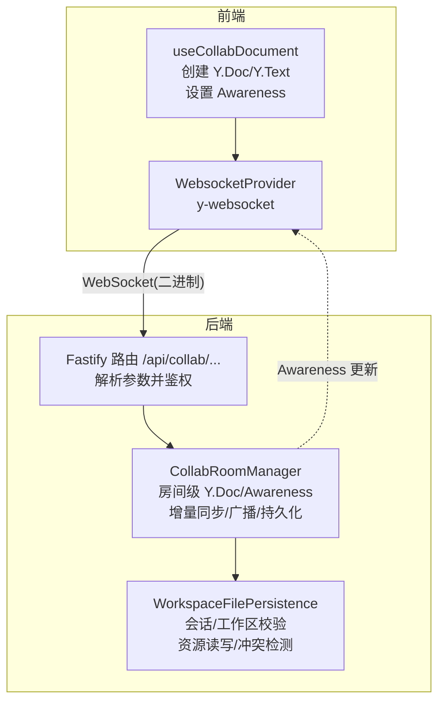
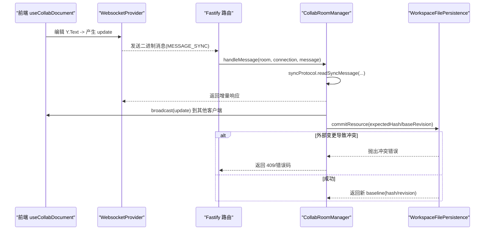
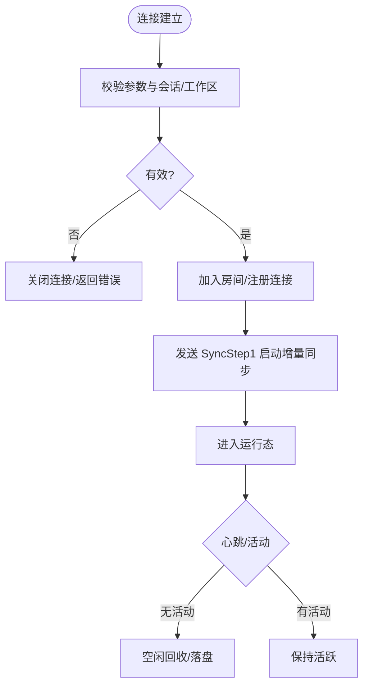
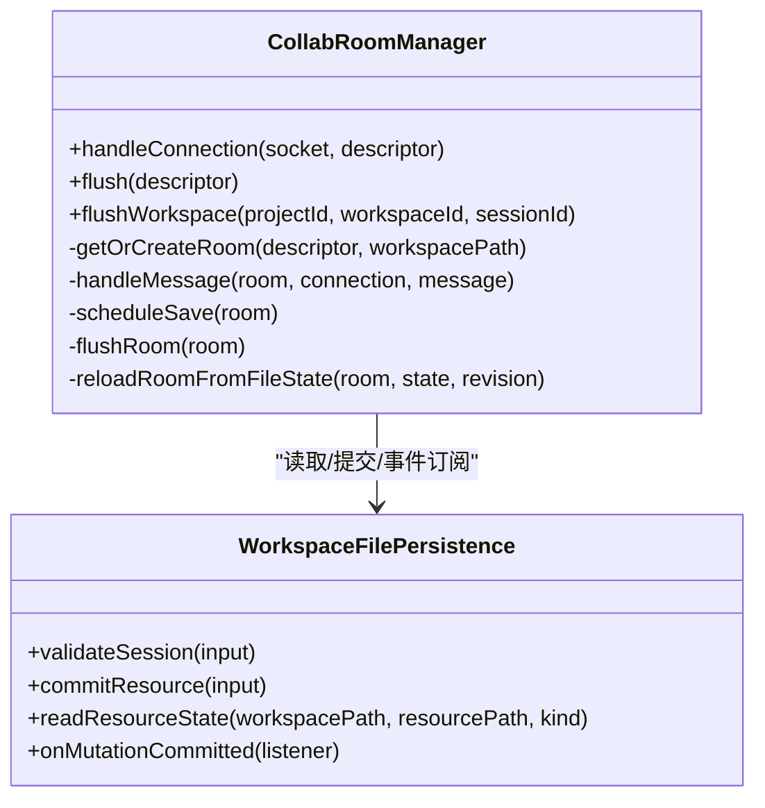
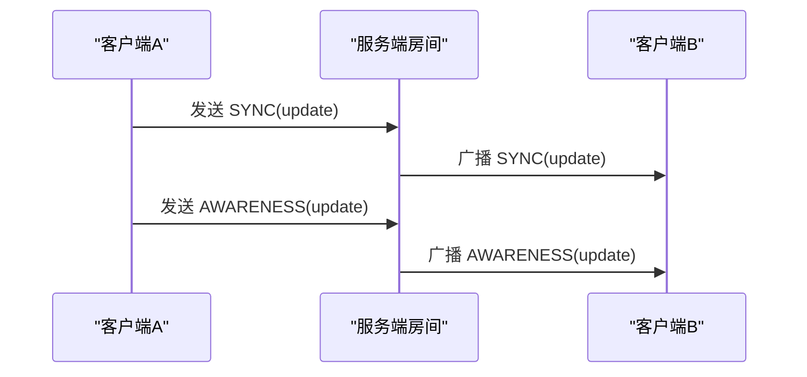
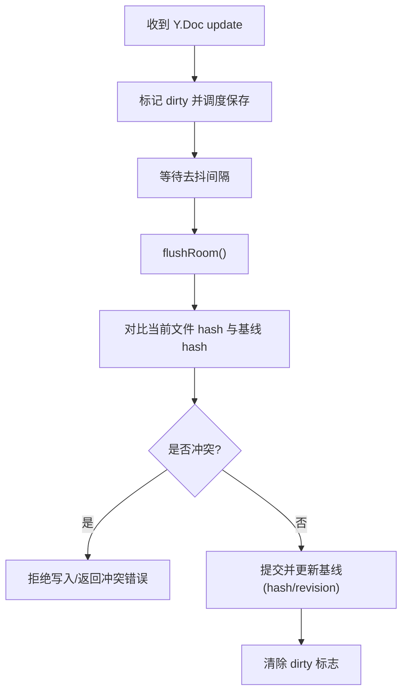
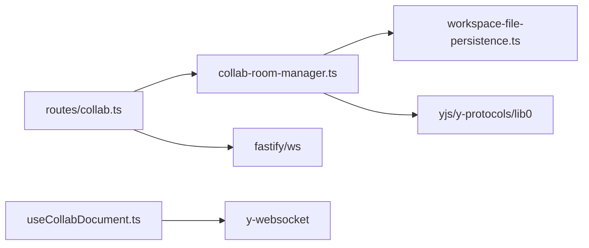

# 实时协作同步

<cite>
**本文引用的文件**
- [collab-room-manager.ts](file://packages/agent-service/src/collab/collab-room-manager.ts)
- [workspace-file-persistence.ts](file://packages/agent-service/src/collab/workspace-file-persistence.ts)
- [collab.ts](file://packages/agent-service/src/routes/collab.ts)
- [useCollabDocument.ts](file://packages/author-site/src/hooks/useCollabDocument.ts)
- [11_实时保存与协同编辑.md](file://docs/项目文档/创作端/03-项目管理/技术/11_实时保存与协同编辑.md)
- [websocket.ts](file://packages/agent-service/src/routes/websocket.ts)
- [client.ts](file://packages/agent-client/src/client.ts)
- [stream-service.ts](file://packages/author-site/src/components/ai-elements/chat/services/stream-service.ts)
</cite>

## 目录
1. [简介](#简介)
2. [项目结构](#项目结构)
3. [核心组件](#核心组件)
4. [架构总览](#架构总览)
5. [详细组件分析](#详细组件分析)
6. [依赖关系分析](#依赖关系分析)
7. [性能考量](#性能考量)
8. [故障排查指南](#故障排查指南)
9. [结论](#结论)
10. [附录：API 规范与消息格式](#附录api-规范与消息格式)

## 简介
本文件面向“实时协作同步”能力，系统性梳理 WebSocket 连接管理、消息路由、操作转换（基于 Yjs 的 CRDT）与冲突解决策略、增量同步机制、操作广播与状态同步实现细节，并给出 API 规范、性能优化建议与调试技巧。目标是帮助开发者快速理解从前端到后端的完整协作链路，并在生产环境中高效排障与调优。

## 项目结构
协作功能由前后端共同组成：
- 前端使用 React Hook 封装 y-websocket 客户端，负责建立连接、维护本地 Y.Doc/Y.Text、感知在线用户、处理断线重连与状态抖动抑制。
- 后端基于 Fastify 提供 WebSocket 路由，按房间维度复用 Yjs Doc 与 Awareness，完成增量同步、在线状态广播、持久化落盘与并发冲突控制。

图表来源
- [collab.ts:69-94](file://packages/agent-service/src/routes/collab.ts#L69-L94)
- [collab-room-manager.ts:115-157](file://packages/agent-service/src/collab/collab-room-manager.ts#L115-L157)
- [workspace-file-persistence.ts:82-136](file://packages/agent-service/src/collab/workspace-file-persistence.ts#L82-L136)
- [useCollabDocument.ts:173-211](file://packages/author-site/src/hooks/useCollabDocument.ts#L173-L211)

章节来源
- [collab.ts:69-142](file://packages/agent-service/src/routes/collab.ts#L69-L142)
- [collab-room-manager.ts:1-518](file://packages/agent-service/src/collab/collab-room-manager.ts#L1-L518)
- [workspace-file-persistence.ts:1-416](file://packages/agent-service/src/collab/workspace-file-persistence.ts#L1-L416)
- [useCollabDocument.ts:1-346](file://packages/author-site/src/hooks/useCollabDocument.ts#L1-L346)

## 核心组件
- 前端 Hook：useCollabDocument
  - 负责构造房间描述、建立 WebsocketProvider、设置 Awareness、监听文本变化与连接状态、延迟降级离线状态避免抖动。
- 后端路由：collab.ts
  - 暴露 WebSocket 与 HTTP flush 接口，解析并校验房间参数，委派给房间管理器。
- 房间管理器：CollabRoomManager
  - 管理房间生命周期、Yjs Doc/Awareness、增量同步、广播、去抖持久化、空闲回收、并发冲突拒绝。
- 持久化层：WorkspaceFilePersistence
  - 会话与工作区校验、资源路径安全校验、内容哈希计算、原子提交与冲突检测、事件订阅。

章节来源
- [useCollabDocument.ts:93-211](file://packages/author-site/src/hooks/useCollabDocument.ts#L93-L211)
- [collab.ts:69-142](file://packages/agent-service/src/routes/collab.ts#L69-L142)
- [collab-room-manager.ts:55-157](file://packages/agent-service/src/collab/collab-room-manager.ts#L55-L157)
- [workspace-file-persistence.ts:70-136](file://packages/agent-service/src/collab/workspace-file-persistence.ts#L70-L136)

## 架构总览
下图展示一次完整的协作写入流程：前端编辑触发 Yjs update，经 WebSocket 增量同步至服务端房间；服务端广播给其他客户端，同时调度持久化落盘；若外部变更导致冲突，则拒绝写入并回滚基线。

图表来源
- [collab-room-manager.ts:320-346](file://packages/agent-service/src/collab/collab-room-manager.ts#L320-L346)
- [collab-room-manager.ts:369-422](file://packages/agent-service/src/collab/collab-room-manager.ts#L369-L422)
- [workspace-file-persistence.ts:164-194](file://packages/agent-service/src/collab/workspace-file-persistence.ts#L164-L194)
- [collab.ts:83-94](file://packages/agent-service/src/routes/collab.ts#L83-L94)

## 详细组件分析

### 连接管理与消息路由
- 连接建立
  - 前端通过 WebsocketProvider 连接到 /api/collab/projects/:projectId/workspaces/:workspaceId/:room，附带 sessionId/resourcePath/kind 查询参数。
  - 后端路由校验参数完整性与资源类型白名单，随后调用房间管理器建立连接。
- 初始同步
  - 服务端在连接成功后立即发送 Sync Step1，驱动客户端与服务端进行增量握手，确保两端 Y.Doc 一致。
- 心跳与保活
  - 通用 Agent 流式通道内置 ping/pong 心跳与超时清理；协作通道未显式实现应用层心跳，但可通过上层 keepalive 或业务 ping 扩展。
- 断线与重连
  - 前端对短暂断开采用延迟降级策略，避免多房间场景下的状态抖动；超过阈值才标记为离线。

图表来源
- [collab.ts:72-94](file://packages/agent-service/src/routes/collab.ts#L72-L94)
- [collab-room-manager.ts:115-157](file://packages/agent-service/src/collab/collab-room-manager.ts#L115-L157)
- [collab-room-manager.ts:452-461](file://packages/agent-service/src/collab/collab-room-manager.ts#L452-L461)
- [websocket.ts:122-132](file://packages/agent-service/src/routes/websocket.ts#L122-L132)
- [useCollabDocument.ts:228-255](file://packages/author-site/src/hooks/useCollabDocument.ts#L228-L255)

章节来源
- [collab.ts:69-142](file://packages/agent-service/src/routes/collab.ts#L69-L142)
- [collab-room-manager.ts:115-157](file://packages/agent-service/src/collab/collab-room-manager.ts#L115-L157)
- [websocket.ts:134-180](file://packages/agent-service/src/routes/websocket.ts#L134-L180)
- [useCollabDocument.ts:228-255](file://packages/author-site/src/hooks/useCollabDocument.ts#L228-L255)

### 操作转换与冲突解决（CRDT）
- 算法选择
  - 采用 Yjs 作为底层 CRDT 引擎，自动处理插入、删除、移动等操作的合并，无需手写 OT 逻辑。
- 增量同步
  - 使用 y-protocols/sync 协议进行增量交换，仅传输差异，降低带宽占用。
- 冲突解决
  - 当外部写入导致文件内容与房间基线不一致时，持久化层会拒绝落盘并返回冲突错误码，房间侧记录日志并维持当前内存状态，等待后续重新加载或重试。

图表来源
- [collab-room-manager.ts:237-318](file://packages/agent-service/src/collab/collab-room-manager.ts#L237-L318)
- [collab-room-manager.ts:369-422](file://packages/agent-service/src/collab/collab-room-manager.ts#L369-L422)
- [workspace-file-persistence.ts:164-194](file://packages/agent-service/src/collab/workspace-file-persistence.ts#L164-L194)

章节来源
- [collab-room-manager.ts:237-318](file://packages/agent-service/src/collab/collab-room-manager.ts#L237-L318)
- [collab-room-manager.ts:369-422](file://packages/agent-service/src/collab/collab-room-manager.ts#L369-L422)
- [workspace-file-persistence.ts:164-194](file://packages/agent-service/src/collab/workspace-file-persistence.ts#L164-L194)

### 操作广播与状态同步
- 文本更新广播
  - 服务端监听 Y.Doc 的 update 事件，将增量编码为 MESSAGE_SYNC 并广播给房间内除发起者外的所有连接。
- 在线状态（Awareness）
  - 使用 awarenessProtocol 维护在线用户信息，包括用户标识、颜色、当前编辑页面等；新增/更新/移除均通过 MESSAGE_AWARENESS 广播。
- 前端状态聚合
  - 前端通过 provider.awareness 获取在线列表，并进行去重与稳定比较，避免不必要的 UI 刷新。

图表来源
- [collab-room-manager.ts:285-314](file://packages/agent-service/src/collab/collab-room-manager.ts#L285-L314)
- [collab-room-manager.ts:482-487](file://packages/agent-service/src/collab/collab-room-manager.ts#L482-L487)
- [useCollabDocument.ts:192-211](file://packages/author-site/src/hooks/useCollabDocument.ts#L192-L211)

章节来源
- [collab-room-manager.ts:285-314](file://packages/agent-service/src/collab/collab-room-manager.ts#L285-L314)
- [useCollabDocument.ts:192-211](file://packages/author-site/src/hooks/useCollabDocument.ts#L192-L211)

### 增量同步与序列化/反序列化
- 序列化
  - 使用 lib0/encoding 与 y-protocols/sync 将 Yjs 增量转换为二进制消息，包含消息类型与负载。
- 反序列化
  - 接收端使用 lib0/decoding 解析消息头与负载，交由 y-protocols/sync 应用到本地 Y.Doc。
- 效率优化
  - 仅传输增量，避免全量同步；Awareness 仅广播变更集合，减少冗余。

章节来源
- [collab-room-manager.ts:320-346](file://packages/agent-service/src/collab/collab-room-manager.ts#L320-L346)
- [collab-room-manager.ts:463-480](file://packages/agent-service/src/collab/collab-room-manager.ts#L463-L480)

### 持久化与冲突处理
- 去抖落盘
  - 每次 update 后调度定时器，达到间隔后执行 flushRoom，避免频繁 IO。
- 冲突检测
  - 落盘前比对当前文件 hash 与房间基线 hash，不一致则拒绝写入并返回冲突错误码。
- 外部变更恢复
  - 订阅持久化层的已提交事件，若检测到外部变更且房间未脏，则用最新文件内容替换房间文本并更新基线。

图表来源
- [collab-room-manager.ts:360-422](file://packages/agent-service/src/collab/collab-room-manager.ts#L360-L422)
- [workspace-file-persistence.ts:164-194](file://packages/agent-service/src/collab/workspace-file-persistence.ts#L164-L194)

章节来源
- [collab-room-manager.ts:360-422](file://packages/agent-service/src/collab/collab-room-manager.ts#L360-L422)
- [workspace-file-persistence.ts:164-194](file://packages/agent-service/src/collab/workspace-file-persistence.ts#L164-L194)

### 前端连接与状态抖动约束
- 连接建立
  - 根据房间描述生成 endpoint 与 roomName，携带 sessionId/resourcePath/kind 参数。
- 状态抖动约束
  - 短暂断开视为自动重连过程，不立即降级为“离线待同步”，超过阈值后才显示离线；进入真实离线后，connecting 不再覆盖离线状态，直到恢复。

章节来源
- [useCollabDocument.ts:173-211](file://packages/author-site/src/hooks/useCollabDocument.ts#L173-L211)
- [11_实时保存与协同编辑.md:252-255](file://docs/项目文档/创作端/03-项目管理/技术/11_实时保存与协同编辑.md#L252-L255)

## 依赖关系分析
- 模块耦合
  - 路由层仅做参数校验与转发，核心逻辑集中在房间管理器；房间管理器依赖持久化层进行鉴权与落盘。
- 外部依赖
  - Yjs/y-protocols/lib0 用于 CRDT 与编解码；ws 用于 WebSocket；Fastify 提供路由与中间件能力。
- 潜在循环
  - 当前设计单向依赖，未见循环引用风险。

图表来源
- [collab.ts:69-94](file://packages/agent-service/src/routes/collab.ts#L69-L94)
- [collab-room-manager.ts:1-22](file://packages/agent-service/src/collab/collab-room-manager.ts#L1-L22)
- [workspace-file-persistence.ts:1-14](file://packages/agent-service/src/collab/workspace-file-persistence.ts#L1-L14)
- [useCollabDocument.ts:1-12](file://packages/author-site/src/hooks/useCollabDocument.ts#L1-L12)

章节来源
- [collab.ts:69-142](file://packages/agent-service/src/routes/collab.ts#L69-L142)
- [collab-room-manager.ts:1-22](file://packages/agent-service/src/collab/collab-room-manager.ts#L1-L22)
- [workspace-file-persistence.ts:1-14](file://packages/agent-service/src/collab/workspace-file-persistence.ts#L1-L14)
- [useCollabDocument.ts:1-12](file://packages/author-site/src/hooks/useCollabDocument.ts#L1-L12)

## 性能考量
- 网络传输
  - 增量同步与 Awareness 增量广播显著降低带宽；建议在高并发场景下开启压缩（如 gzip/deflate）以进一步减小体积。
- 持久化频率
  - 合理配置 COLLAB_SAVE_DEBOUNCE_MS，平衡实时性与磁盘压力；默认 1s，可根据业务调整。
- 房间回收
  - 空闲回收周期 COLLAB_ROOM_IDLE_TTL_MS 默认 5 分钟，避免长时间占用内存；可结合业务活跃度动态调整。
- 连接限制
  - 单工作区最大连接数 COLLAB_MAX_CONNECTIONS_PER_WORKSPACE 默认 10，防止单租户独占资源。
- 前端状态抖动
  - 利用 OFFLINE_STATUS_DELAY_MS 避免频繁状态切换，提升用户体验。

[本节为通用指导，不直接分析具体文件]

## 故障排查指南
- 连接失败
  - 检查路由参数是否齐全（sessionId/resourcePath/kind），确认资源类型在白名单内。
- 同步异常
  - 查看服务端日志中“无效消息”警告；确认客户端与服务端版本兼容，确保增量协议一致。
- 冲突错误
  - 出现 WORKSPACE_RESOURCE_CONFLICT 时，说明外部修改了同一资源；需重新拉取最新内容或等待服务重载房间。
- 心跳与超时
  - 通用 Agent 通道存在心跳与超时清理；协作通道如需保活，可在上层增加 ping/pong 或业务心跳。

章节来源
- [collab.ts:52-67](file://packages/agent-service/src/routes/collab.ts#L52-L67)
- [collab-room-manager.ts:140-156](file://packages/agent-service/src/collab/collab-room-manager.ts#L140-L156)
- [websocket.ts:122-132](file://packages/agent-service/src/routes/websocket.ts#L122-L132)

## 结论
本项目采用 Yjs CRDT 与增量同步协议构建高可用、低开销的实时协作系统。通过房间级管理、Awareness 在线状态、去抖持久化与冲突检测，实现了多用户同时编辑的一致性体验。前端的状态抖动约束进一步优化了交互稳定性。建议在大规模部署时关注压缩、心跳、限流与资源回收策略，以获得更稳健的性能表现。

[本节为总结性内容，不直接分析具体文件]

## 附录：API 规范与消息格式

### WebSocket 接口
- 端点
  - GET /api/collab/projects/:projectId/workspaces/:workspaceId/:room
  - 查询参数：sessionId、resourcePath、kind
- 行为
  - 建立连接后，服务端发送 SyncStep1 启动增量同步；后续双向传输二进制消息。
  - 支持关闭与错误处理，非法参数将关闭连接并返回原因。

章节来源
- [collab.ts:72-94](file://packages/agent-service/src/routes/collab.ts#L72-L94)

### HTTP 接口
- 端点
  - POST /api/collab/projects/:projectId/workspaces/:workspaceId/flush
  - POST /api/collab/projects/:projectId/workspaces/:workspaceId/flush-all
- 行为
  - flush：针对指定资源落盘；flush-all：批量落盘该工作区下所有房间。
  - 冲突时返回 409 与错误码；权限不足返回 403。

章节来源
- [collab.ts:96-141](file://packages/agent-service/src/routes/collab.ts#L96-L141)

### 消息格式（二进制）
- 消息头
  - 变长整数：消息类型
- 消息类型
  - MESSAGE_SYNC = 0：增量同步（含 SyncStep1/SyncStep2/Update）
  - MESSAGE_AWARENESS = 1：在线状态更新
  - MESSAGE_QUERY_AWARENESS = 3：查询在线状态
- 负载
  - 使用 lib0/encoding 与 y-protocols/sync 编码/解码；Awareness 使用 awarenessProtocol 编码。

章节来源
- [collab-room-manager.ts:15-18](file://packages/agent-service/src/collab/collab-room-manager.ts#L15-L18)
- [collab-room-manager.ts:320-346](file://packages/agent-service/src/collab/collab-room-manager.ts#L320-L346)
- [collab-room-manager.ts:463-480](file://packages/agent-service/src/collab/collab-room-manager.ts#L463-L480)

### 前端连接示例（概念性）
- 连接 URL
  - ws(s)://{agentService}/api/collab/projects/{projectId}/workspaces/{workspaceId}/{encodedRoom}?sessionId=...&resourcePath=...&kind=...
- 房间名编码
  - 对 resourcePath 进行 Base64 安全编码，避免特殊字符影响路由。

章节来源
- [useCollabDocument.ts:173-185](file://packages/author-site/src/hooks/useCollabDocument.ts#L173-L185)
- [useCollabDocument.ts:54-59](file://packages/author-site/src/hooks/useCollabDocument.ts#L54-L59)

### 心跳与保活（通用通道）
- 心跳
  - 服务端周期性扫描连接，超过 HEARTBEAT_TIMEOUT 则主动关闭。
  - 客户端定期发送 ping，服务端回复 pong。
- 适用范围
  - 通用 Agent 流式通道；协作通道可按需扩展应用层心跳。

章节来源
- [websocket.ts:122-132](file://packages/agent-service/src/routes/websocket.ts#L122-L132)
- [client.ts:380-386](file://packages/agent-client/src/client.ts#L380-L386)
- [stream-service.ts:362-376](file://packages/author-site/src/components/ai-elements/chat/services/stream-service.ts#L362-L376)