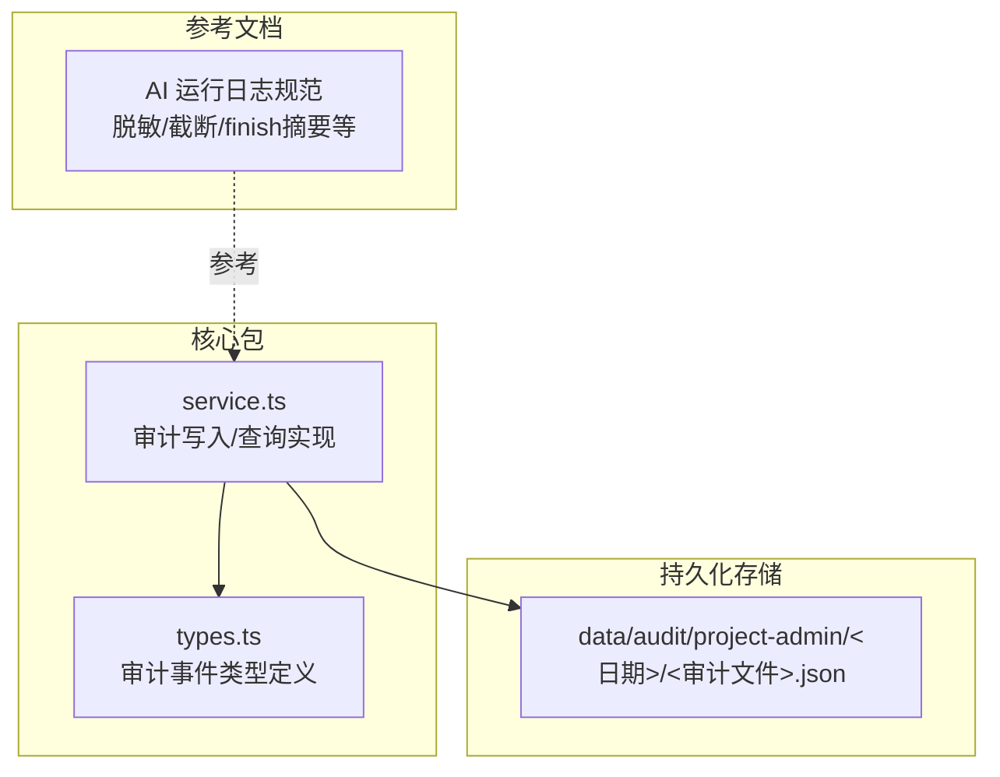
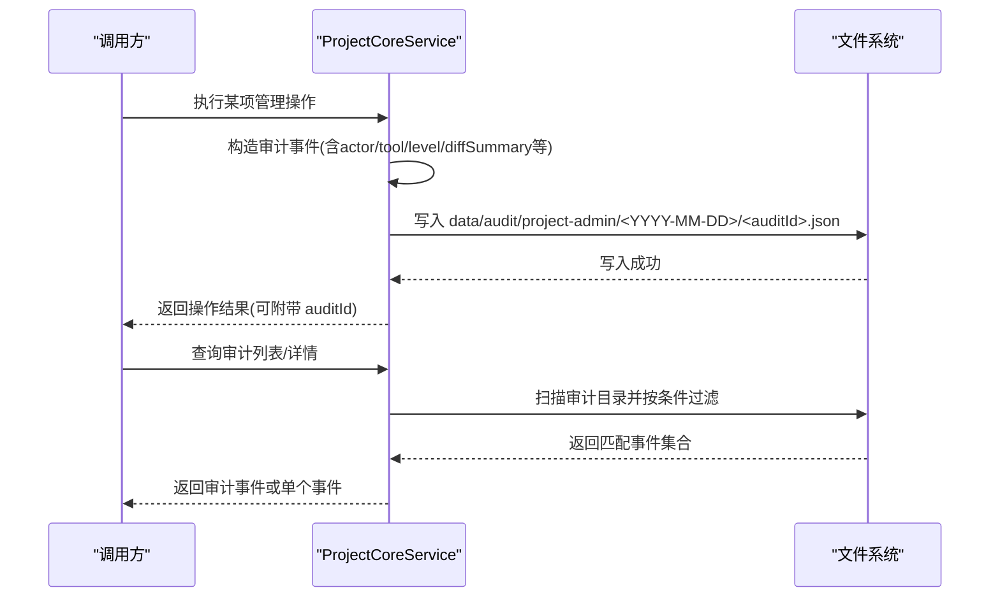
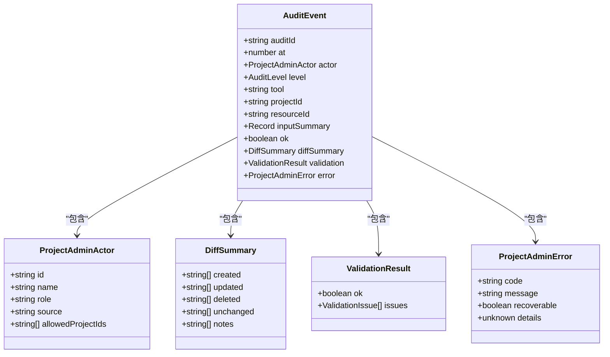
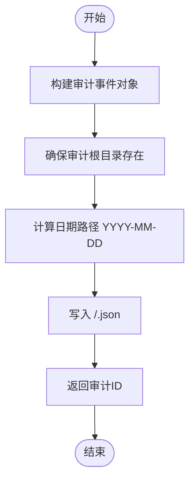
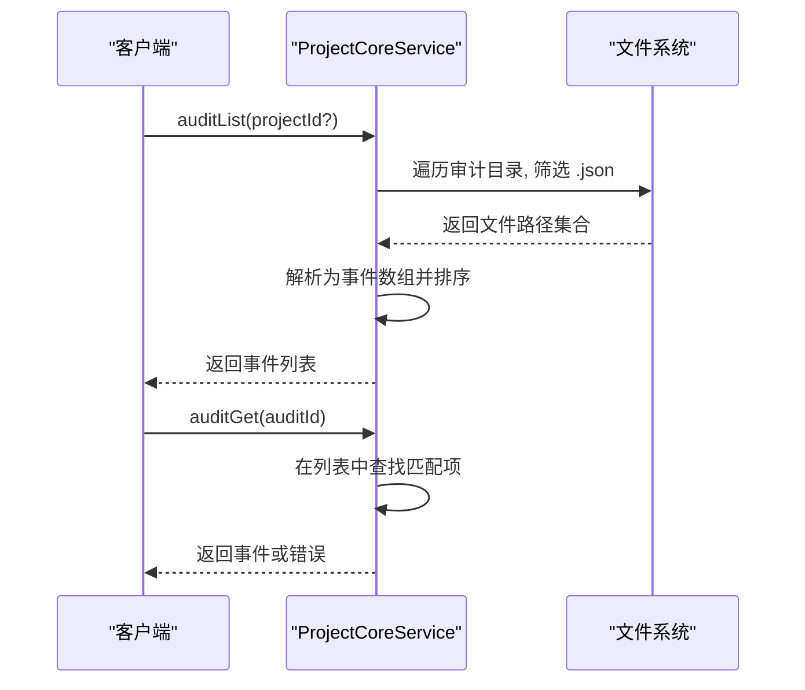
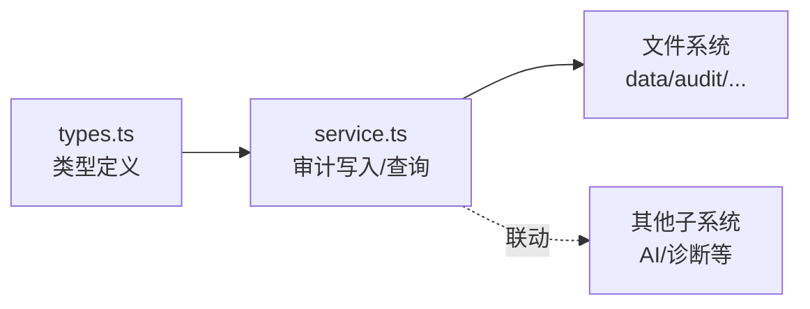

# 审计日志系统

<cite>
**本文引用的文件**
- [packages/project-core/src/types.ts](file://packages/project-core/src/types.ts)
- [packages/project-core/src/service.ts](file://packages/project-core/src/service.ts)
- [data/audit/project-admin/2026-07-01/audit_1782929116138_2fiel1.json](file://data/audit/project-admin/2026-07-01/audit_1782929116138_2fiel1.json)
- [data/audit/project-admin/2026-07-06/audit_1783308989230_3qrbkj.json](file://data/audit/project-admin/2026-07-06/audit_1783308989230_3qrbkj.json)
- [docs/项目文档/创作端/05-AI对话/技术/07_运行进度与事件日志.md](file://docs/项目文档/创作端/05-AI对话/技术/07_运行进度与事件日志.md)
</cite>

## 目录
1. [简介](#简介)
2. [项目结构](#项目结构)
3. [核心组件](#核心组件)
4. [架构总览](#架构总览)
5. [详细组件分析](#详细组件分析)
6. [依赖关系分析](#依赖关系分析)
7. [性能考量](#性能考量)
8. [故障排查指南](#故障排查指南)
9. [结论](#结论)
10. [附录](#附录)

## 简介
本技术文档围绕仓库中的“审计日志系统”展开，聚焦以下目标：
- 用户行为追踪机制：登录记录、操作日志、错误追踪的落地方式与数据结构。
- 存储策略与查询能力：按日归档、JSON 单条记录、高效检索与分析。
- 敏感操作安全审计：权限变更、数据修改与删除操作的审计覆盖与级别划分。
- 日志聚合与归档：长期存储与合规要求下的组织方式。
- 查询 API 与监控告警：提供审计记录的读取接口，并给出分析示例与优化建议。

## 项目结构
审计日志相关代码与数据主要分布在如下位置：
- 类型定义与公共模型：packages/project-core/src/types.ts
- 服务实现（写入、列举、获取）：packages/project-core/src/service.ts
- 实际落盘样例：data/audit/project-admin/<YYYY-MM-DD>/audit_<ts>_<id>.json
- AI 运行日志规范（辅助参考）：docs/项目文档/创作端/05-AI对话/技术/07_运行进度与事件日志.md

图表来源
- [packages/project-core/src/types.ts:558-574](file://packages/project-core/src/types.ts#L558-L574)
- [packages/project-core/src/service.ts:6482-6515](file://packages/project-core/src/service.ts#L6482-L6515)
- [data/audit/project-admin/2026-07-01/audit_1782929116138_2fiel1.json](file://data/audit/project-admin/2026-07-01/audit_1782929116138_2fiel1.json)
- [docs/项目文档/创作端/05-AI对话/技术/07_运行进度与事件日志.md:61-81](file://docs/项目文档/创作端/05-AI对话/技术/07_运行进度与事件日志.md#L61-L81)

章节来源
- [packages/project-core/src/types.ts:558-574](file://packages/project-core/src/types.ts#L558-L574)
- [packages/project-core/src/service.ts:6482-6515](file://packages/project-core/src/service.ts#L6482-L6515)
- [data/audit/project-admin/2026-07-01/audit_1782929116138_2fiel1.json](file://data/audit/project-admin/2026-07-01/audit_1782929116138_2fiel1.json)
- [docs/项目文档/创作端/05-AI对话/技术/07_运行进度与事件日志.md:61-81](file://docs/项目文档/创作端/05-AI对话/技术/07_运行进度与事件日志.md#L61-L81)

## 核心组件
- 审计事件模型
  - 审计级别：L0~L4，用于区分不同敏感度与影响面。
  - 审计事件包含：唯一标识、时间戳、操作者信息、工具名、资源标识、输入摘要、结果状态、差异摘要、校验结果、错误信息等。
- 审计写入器
  - 生成审计 ID、组装事件对象、按日期分目录写入 JSON 文件。
- 审计查询器
  - 支持按项目过滤、按审计 ID 精确获取、按时间倒序返回。

章节来源
- [packages/project-core/src/types.ts:558-574](file://packages/project-core/src/types.ts#L558-L574)
- [packages/project-core/src/service.ts:6482-6515](file://packages/project-core/src/service.ts#L6482-L6515)
- [packages/project-core/src/service.ts:4562-4578](file://packages/project-core/src/service.ts#L4562-L4578)

## 架构总览
审计日志在“项目核心服务”中完成统一采集与持久化，并通过内置 API 暴露查询能力。

图表来源
- [packages/project-core/src/service.ts:6482-6515](file://packages/project-core/src/service.ts#L6482-L6515)
- [packages/project-core/src/service.ts:4562-4578](file://packages/project-core/src/service.ts#L4562-L4578)

## 详细组件分析

### 审计事件模型与级别
- 审计级别
  - L0~L4：从低到高，通常 L3/L4 对应高风险或破坏性操作（如删除）。
- 关键字段
  - actor：操作者身份（id/name/role/source），便于溯源。
  - tool：触发审计的工具/方法名，便于分类统计。
  - projectId/resourceId：关联资源，便于按资源维度检索。
  - inputSummary/diffSummary：输入摘要与变更摘要，便于快速理解影响范围。
  - ok/validation/error：结果与校验信息，便于失败归因。

图表来源
- [packages/project-core/src/types.ts:558-574](file://packages/project-core/src/types.ts#L558-L574)
- [packages/project-core/src/types.ts:30-43](file://packages/project-core/src/types.ts#L30-L43)
- [packages/project-core/src/types.ts:105-111](file://packages/project-core/src/types.ts#L105-L111)
- [packages/project-core/src/types.ts:63-66](file://packages/project-core/src/types.ts#L63-L66)

章节来源
- [packages/project-core/src/types.ts:558-574](file://packages/project-core/src/types.ts#L558-L574)
- [packages/project-core/src/types.ts:30-43](file://packages/project-core/src/types.ts#L30-L43)
- [packages/project-core/src/types.ts:105-111](file://packages/project-core/src/types.ts#L105-L111)
- [packages/project-core/src/types.ts:63-66](file://packages/project-core/src/types.ts#L63-L66)

### 审计写入流程
- 生成审计 ID 与时间戳。
- 组装审计事件对象，填充 actor、tool、level、inputSummary、diffSummary、validation、error 等。
- 按日期创建子目录，将事件以 JSON 形式落盘。

图表来源
- [packages/project-core/src/service.ts:6482-6515](file://packages/project-core/src/service.ts#L6482-L6515)

章节来源
- [packages/project-core/src/service.ts:6482-6515](file://packages/project-core/src/service.ts#L6482-L6515)

### 审计查询 API
- 审计列表
  - 支持可选按 projectId 过滤，默认按时间倒序返回。
- 审计详情
  - 通过 auditId 精确获取单条记录。

图表来源
- [packages/project-core/src/service.ts:4562-4578](file://packages/project-core/src/service.ts#L4562-L4578)

章节来源
- [packages/project-core/src/service.ts:4562-4578](file://packages/project-core/src/service.ts#L4562-L4578)

### 典型审计样例
- 项目创建（L1）
  - 包含项目名称、分类等输入摘要，以及创建的资源清单。
- 项目删除（L3）
  - 高敏感操作，记录被删除资源清单，便于合规追溯。

章节来源
- [data/audit/project-admin/2026-07-01/audit_1782929116138_2fiel1.json](file://data/audit/project-admin/2026-07-01/audit_1782929116138_2fiel1.json)
- [data/audit/project-admin/2026-07-06/audit_1783308989230_3qrbkj.json](file://data/audit/project-admin/2026-07-06/audit_1783308989230_3qrbkj.json)

### 敏感操作与安全审计
- 权限变更
  - 涉及角色提升、访问控制调整等操作应使用较高审计级别（如 L3/L4），并在 diffSummary 中明确变更点。
- 数据修改与删除
  - 对关键资源的更新与删除必须记录 inputSummary 与 diffSummary，确保可回溯。
- 错误与异常
  - 当操作失败时，error 字段需包含错误码与消息，必要时附加 recoverable 提示与后续动作建议。

章节来源
- [packages/project-core/src/types.ts:558-574](file://packages/project-core/src/types.ts#L558-L574)
- [packages/project-core/src/service.ts:6482-6515](file://packages/project-core/src/service.ts#L6482-L6515)

### 日志聚合与归档
- 按日归档
  - 所有审计事件按日期分目录存放，天然具备时间维度的聚合能力。
- 合规与长期存储
  - 结合外部归档策略（如冷存储、压缩、保留周期）满足合规要求。
- 与 AI 运行日志的关系
  - AI 运行日志采用 JSONL 格式，并对敏感字段脱敏、长文本截断；审计日志侧重“谁在何时做了什么”，二者互补。

章节来源
- [packages/project-core/src/service.ts:6482-6515](file://packages/project-core/src/service.ts#L6482-L6515)
- [docs/项目文档/创作端/05-AI对话/技术/07_运行进度与事件日志.md:61-81](file://docs/项目文档/创作端/05-AI对话/技术/07_运行进度与事件日志.md#L61-L81)

## 依赖关系分析
- 模块内聚
  - 审计事件类型集中在 types.ts，服务层 service.ts 负责写入与查询，职责清晰。
- 外部依赖
  - 文件系统 I/O：按日期路径写入/读取 JSON 文件。
  - 其他子系统：通过 actor.source 与 nextActions 等字段与其他模块联动（例如 AI 会话、诊断事件）。

图表来源
- [packages/project-core/src/types.ts:558-574](file://packages/project-core/src/types.ts#L558-L574)
- [packages/project-core/src/service.ts:6482-6515](file://packages/project-core/src/service.ts#L6482-L6515)

章节来源
- [packages/project-core/src/types.ts:558-574](file://packages/project-core/src/types.ts#L558-L574)
- [packages/project-core/src/service.ts:6482-6515](file://packages/project-core/src/service.ts#L6482-L6515)

## 性能考量
- 写入路径
  - 当前实现为同步写 JSON 文件，适合中小规模场景。在高并发下建议引入异步队列与批量落盘。
- 查询路径
  - 列表查询会全量扫描审计目录并解析 JSON，数据量大时可能成为瓶颈。可考虑：
    - 增量索引：维护轻量级索引（如按日期+projectId 的倒排表）。
    - 分页与游标：避免一次性加载全部结果。
    - 预聚合：对高频查询维度（如 tool、level、actor）建立统计缓存。
- 存储优化
  - 定期压缩历史目录，冷热分层存储，降低热路径 I/O 压力。

[本节为通用指导，不直接分析具体文件]

## 故障排查指南
- 常见错误定位
  - 审计记录不存在：检查 auditId 是否正确，确认是否已被清理或归档。
  - 权限不足：核对 actor.role 与 allowedProjectIds，确认访问控制配置。
  - 写入失败：检查磁盘空间与目录权限，确认 ensureDirs 逻辑是否生效。
- 辅助手段
  - 使用审计列表接口缩小范围，再根据 auditId 精确定位。
  - 结合 AI 运行日志进行交叉验证，关注 finish 摘要与错误信息。

章节来源
- [packages/project-core/src/service.ts:4562-4578](file://packages/project-core/src/service.ts#L4562-L4578)
- [docs/项目文档/创作端/05-AI对话/技术/07_运行进度与事件日志.md:61-81](file://docs/项目文档/创作端/05-AI对话/技术/07_运行进度与事件日志.md#L61-L81)

## 结论
该审计日志系统以“类型集中、服务统一、按日归档”的方式实现了可靠的用户行为追踪与敏感操作审计。通过标准化的事件模型与清晰的查询接口，既满足了日常运维与合规需求，也为后续的性能优化与扩展（如索引、归档、告警）奠定了良好基础。

[本节为总结性内容，不直接分析具体文件]

## 附录

### 审计事件字段说明（节选）
- auditId：审计事件唯一标识
- at：事件发生时间戳（毫秒）
- actor：操作者信息（id/name/role/source）
- level：审计级别（L0~L4）
- tool：触发审计的工具/方法名
- projectId/resourceId：关联资源标识
- inputSummary：输入摘要（脱敏后）
- ok：操作是否成功
- diffSummary：变更摘要（created/updated/deleted/unchanged/notes）
- validation：校验结果
- error：错误信息（code/message/recoverable/details）

章节来源
- [packages/project-core/src/types.ts:558-574](file://packages/project-core/src/types.ts#L558-L574)

### 查询与分析示例
- 列出最近 100 条审计记录（可按 projectId 过滤）
  - 调用：auditList(projectId?)
  - 用途：快速浏览近期操作，定位问题时间点。
- 获取指定审计详情
  - 调用：auditGet(auditId)
  - 用途：深入查看某次操作的完整上下文。
- 结合 AI 运行日志
  - 通过 aiRunLogs(sessionId) 获取更详细的运行轨迹，与审计事件相互印证。

章节来源
- [packages/project-core/src/service.ts:4562-4578](file://packages/project-core/src/service.ts#L4562-L4578)