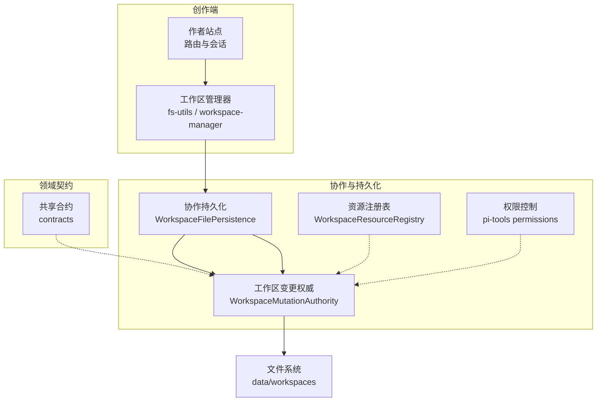
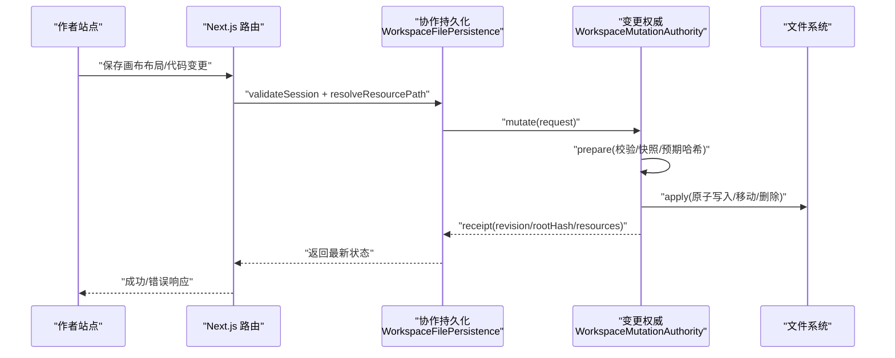
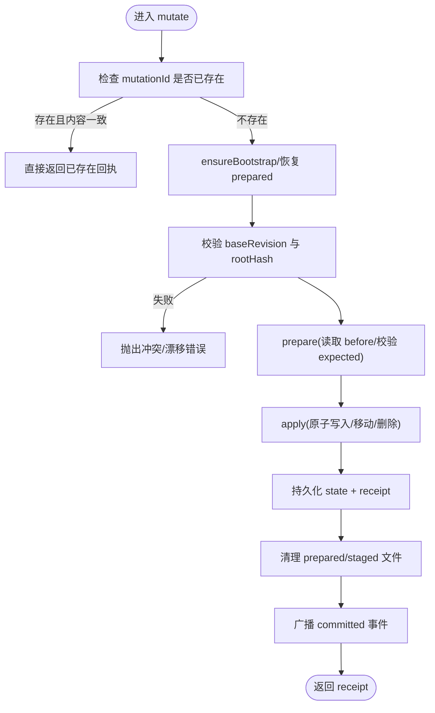
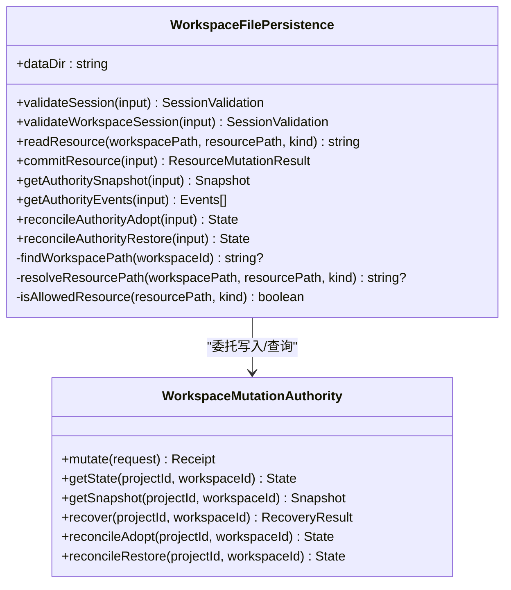
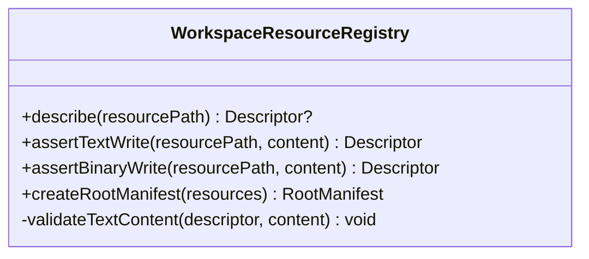
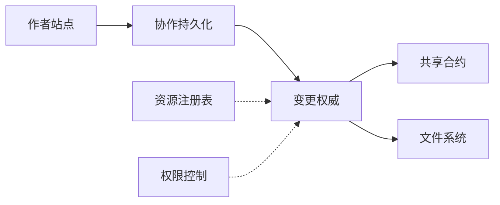

# 工作区隔离机制

<cite>
**本文引用的文件**   
- [packages/agent-service/src/workspace/workspace-mutation-authority.ts](file://packages/agent-service/src/workspace/workspace-mutation-authority.ts)
- [packages/agent-service/src/collab/workspace-file-persistence.ts](file://packages/agent-service/src/collab/workspace-file-persistence.ts)
- [packages/project-core/src/workspace-resource-registry.ts](file://packages/project-core/src/workspace-resource-registry.ts)
- [packages/agent-service/src/backends/pi-tools/permissions.ts](file://packages/agent-service/src/backends/pi-tools/permissions.ts)
- [packages/agent-service/src/workspace/utils.ts](file://packages/agent-service/src/workspace/utils.ts)
- [packages/author-site/src/lib/fs-utils.ts](file://packages/author-site/src/lib/fs-utils.ts)
- [packages/author-site/src/app/api/sessions/[sessionId]/canvas-layout/route.ts](file://packages/author-site/src/app/api/sessions/[sessionId]/canvas-layout/route.ts)
- [packages/author-site/src/app/demo/[id]/edit/page.tsx](file://packages/author-site/src/app/demo/[id]/edit/page.tsx)
- [packages/agent-service/src/routes/workspace-authority.ts](file://packages/agent-service/src/routes/workspace-authority.ts)
- [packages/author-site/src/app/api/workspace-authority/[projectId]/[workspaceId]/[...segments]/route.ts](file://packages/author-site/src/app/api/workspace-authority/[projectId]/[workspaceId]/[...segments]/route.ts)
- [docs/plans/已完成/项目级共享Workspace重构方案.md](file://docs/plans/已完成/项目级共享Workspace重构方案.md)
</cite>

## 目录
1. [引言](#引言)
2. [项目结构](#项目结构)
3. [核心组件](#核心组件)
4. [架构总览](#架构总览)
5. [详细组件分析](#详细组件分析)
6. [依赖关系分析](#依赖关系分析)
7. [性能与一致性](#性能与一致性)
8. [故障排查与恢复](#故障排查与恢复)
9. [结论](#结论)
10. [附录：API 规范与迁移策略](#附录api-规范与迁移策略)

## 引言
本技术文档围绕“工作区隔离机制”展开，系统阐述基准工作区、分支工作区与 Session 工作区的概念与实现原理；说明文件系统级别的隔离策略（路径映射与访问控制）；描述资源注册表的设计模式及其对多类型资源的统一管理；解释工作区切换与状态保存机制，确保用户操作的独立性；并提供工作区 API 接口规范与数据迁移策略，辅以实际隔离场景示例与故障恢复方案。

## 项目结构
工作区隔离涉及创作端（author-site）、协作与持久化层（agent-service）、领域资源契约（project-core）以及权限与工具包等模块。关键目录与职责如下：
- author-site：提供前端与 Next.js 路由，负责会话与工作区元数据管理、UI 状态持久化、向后端发起变更请求。
- agent-service：提供 Workspace Mutation Authority（权威写入器）、Session/Workspace 校验、资源持久化与事件总线。
- project-core：定义受管资源类型与路径规则，统一文本/二进制资源校验与根清单生成。
- backends/pi-tools：提供运行时命令与路径白名单/黑名单的权限控制。
- utils：通用路径规范化与越界检测工具。

图表来源
- [packages/agent-service/src/collab/workspace-file-persistence.ts:70-136](file://packages/agent-service/src/collab/workspace-file-persistence.ts#L70-L136)
- [packages/agent-service/src/workspace/workspace-mutation-authority.ts:112-189](file://packages/agent-service/src/workspace/workspace-mutation-authority.ts#L112-L189)
- [packages/project-core/src/workspace-resource-registry.ts:52-136](file://packages/project-core/src/workspace-resource-registry.ts#L52-L136)
- [packages/agent-service/src/backends/pi-tools/permissions.ts:10-38](file://packages/agent-service/src/backends/pi-tools/permissions.ts#L10-L38)

章节来源
- [packages/agent-service/src/collab/workspace-file-persistence.ts:70-136](file://packages/agent-service/src/collab/workspace-file-persistence.ts#L70-L136)
- [packages/agent-service/src/workspace/workspace-mutation-authority.ts:112-189](file://packages/agent-service/src/workspace/workspace-mutation-authority.ts#L112-L189)
- [packages/project-core/src/workspace-resource-registry.ts:52-136](file://packages/project-core/src/workspace-resource-registry.ts#L52-L136)
- [packages/agent-service/src/backends/pi-tools/permissions.ts:10-38](file://packages/agent-service/src/backends/pi-tools/permissions.ts#L10-L38)

## 核心组件
- 工作区变更权威（WorkspaceMutationAuthority）
  - 单活写入者：每个 live 工作区仅一个进程实例拥有写锁，串行队列保证并发安全。
  - 幂等提交：基于 mutationId 去重，避免重复提交导致的状态不一致。
  - 原子性与可恢复：prepared/reconcile-prepared 快照 + journal 日志，崩溃后可恢复或回滚。
  - 外部漂移检测：通过 rootHash 对比，拒绝非权威写入导致的漂移。
  - 二进制暂存：assets 大文件先 stage，再在 put_binary 时校验并落盘。
- 协作持久化（WorkspaceFilePersistence）
  - 会话与工作区校验：验证 sessionId、projectId、workspaceId 的一致性，解析真实 workspacePath。
  - 资源路径安全：normalize + 白名单匹配 + 越界检查，确保只允许受管资源路径。
  - 面向 API 的封装：暴露 commitResource/getSnapshot/getEvents 等能力，内部委托给 Authority。
- 资源注册表（WorkspaceResourceRegistry）
  - 集中式资源策略：按路径模式识别资源种类（页面代码、原型、Sketch、知识文档、配置等）。
  - 文本/二进制校验：大小限制、JSON/Sketch 结构校验，构建根清单（rootHash/resourceHashes）。
- 权限控制（pi-tools permissions）
  - 路径白/黑名单：禁止 node_modules、packages、隐藏状态文件等。
  - 命令白名单：限制 shell 命令集，防止危险操作。
- 工具函数（utils）
  - 路径规范化与越界检测：isPathInsideWorkspace、resolveWorkspacePath 等。

章节来源
- [packages/agent-service/src/workspace/workspace-mutation-authority.ts:112-189](file://packages/agent-service/src/workspace/workspace-mutation-authority.ts#L112-L189)
- [packages/agent-service/src/collab/workspace-file-persistence.ts:70-136](file://packages/agent-service/src/collab/workspace-file-persistence.ts#L70-L136)
- [packages/project-core/src/workspace-resource-registry.ts:52-136](file://packages/project-core/src/workspace-resource-registry.ts#L52-L136)
- [packages/agent-service/src/backends/pi-tools/permissions.ts:10-38](file://packages/agent-service/src/backends/pi-tools/permissions.ts#L10-L38)
- [packages/agent-service/src/workspace/utils.ts:59-76](file://packages/agent-service/src/workspace/utils.ts#L59-L76)

## 架构总览
下图展示了从创作端到工作区权威写入器的完整调用链，包括会话校验、资源路径校验、变更准备与应用、回执与事件广播。

图表来源
- [packages/author-site/src/app/api/sessions/[sessionId]/canvas-layout/route.ts:597-628](file://packages/author-site/src/app/api/sessions/[sessionId]/canvas-layout/route.ts#L597-L628)
- [packages/agent-service/src/collab/workspace-file-persistence.ts:164-200](file://packages/agent-service/src/collab/workspace-file-persistence.ts#L164-L200)
- [packages/agent-service/src/workspace/workspace-mutation-authority.ts:468-598](file://packages/agent-service/src/workspace/workspace-mutation-authority.ts#L468-L598)

## 详细组件分析

### 工作区变更权威（WorkspaceMutationAuthority）
- 设计要点
  - 全局队列与监听：按 dataDir 维度维护队列深度、已提交事件与投影确认监听器，避免多实例竞争。
  - 幂等与冲突处理：mutationId 去重；baseRevision 与 rootHash 双重保护，冲突时抛出明确错误码。
  - 可恢复性：prepared 与 reconcile-prepared 持久化，崩溃后启动自动恢复；journal 记录 prepared/committed/rolled_back/conflicted。
  - 健康度与健康检查：统计 staging/backups/receipts/journal 数量，检测 externalDrift、activeLease 等。
- 关键流程
  - mutate：接收请求 -> 校验 baseRevision/rootHash -> prepare -> apply -> 持久化 state/receipt -> 清理临时文件 -> 广播事件。
  - recover：恢复 prepared mutations 与 reconcile-prepared，必要时回滚到上次一致状态。
  - reconcileAdopt/reconcileRestore：显式接受或丢弃磁盘漂移，保持权威状态与磁盘一致。

图表来源
- [packages/agent-service/src/workspace/workspace-mutation-authority.ts:468-598](file://packages/agent-service/src/workspace/workspace-mutation-authority.ts#L468-L598)
- [packages/agent-service/src/workspace/workspace-mutation-authority.ts:710-744](file://packages/agent-service/src/workspace/workspace-mutation-authority.ts#L710-L744)
- [packages/agent-service/src/workspace/workspace-mutation-authority.ts:773-797](file://packages/agent-service/src/workspace/workspace-mutation-authority.ts#L773-L797)

章节来源
- [packages/agent-service/src/workspace/workspace-mutation-authority.ts:112-189](file://packages/agent-service/src/workspace/workspace-mutation-authority.ts#L112-L189)
- [packages/agent-service/src/workspace/workspace-mutation-authority.ts:468-598](file://packages/agent-service/src/workspace/workspace-mutation-authority.ts#L468-L598)
- [packages/agent-service/src/workspace/workspace-mutation-authority.ts:710-744](file://packages/agent-service/src/workspace/workspace-mutation-authority.ts#L710-L744)
- [packages/agent-service/src/workspace/workspace-mutation-authority.ts:773-797](file://packages/agent-service/src/workspace/workspace-mutation-authority.ts#L773-L797)

### 协作持久化（WorkspaceFilePersistence）
- 会话与工作区校验
  - validateWorkspaceSession：校验 sessionId 是否存在、未过期、与 projectId/workspaceId 一致；解析 workspacePath 并与 .workspace.json 中的 projectId 对齐。
  - validateSession：进一步校验 resourcePath 与 kind 的合法性。
- 资源路径安全
  - resolveResourcePath：normalize + 白名单 isAllowedResource + 越界检查，确保目标路径位于工作区内。
- 读写与快照
  - readResource/readResourceState：读取当前资源内容与哈希。
  - commitResource：构造 put_text 操作，委托 Authority.mutate 完成幂等提交。
  - getAuthoritySnapshot：返回权威视图下的资源文本快照（排除 assets 二进制）。

图表来源
- [packages/agent-service/src/collab/workspace-file-persistence.ts:70-136](file://packages/agent-service/src/collab/workspace-file-persistence.ts#L70-L136)
- [packages/agent-service/src/collab/workspace-file-persistence.ts:164-200](file://packages/agent-service/src/collab/workspace-file-persistence.ts#L164-L200)
- [packages/agent-service/src/collab/workspace-file-persistence.ts:281-313](file://packages/agent-service/src/collab/workspace-file-persistence.ts#L281-L313)
- [packages/agent-service/src/workspace/workspace-mutation-authority.ts:187-214](file://packages/agent-service/src/workspace/workspace-mutation-authority.ts#L187-L214)

章节来源
- [packages/agent-service/src/collab/workspace-file-persistence.ts:82-136](file://packages/agent-service/src/collab/workspace-file-persistence.ts#L82-L136)
- [packages/agent-service/src/collab/workspace-file-persistence.ts:164-200](file://packages/agent-service/src/collab/workspace-file-persistence.ts#L164-L200)
- [packages/agent-service/src/collab/workspace-file-persistence.ts:281-313](file://packages/agent-service/src/collab/workspace-file-persistence.ts#L281-L313)

### 资源注册表（WorkspaceResourceRegistry）
- 资源种类与路径模式
  - demos/*/index.tsx、prototype.html/css/meta、sketch.scene.json/meta、project.config.*、workspace-tree.json、.canvas-layout.json、knowledge/*、assets/*。
- 文本/二进制约束
  - 文本最大 2MB，二进制最大 20MB；JSON/Sketch 结构校验；workspace-tree 要求 pages/folders 数组。
- 根清单生成
  - createRootManifest：遍历资源，计算 resourceHashes 与 rootHash，用于权威一致性校验。

图表来源
- [packages/project-core/src/workspace-resource-registry.ts:52-136](file://packages/project-core/src/workspace-resource-registry.ts#L52-L136)

章节来源
- [packages/project-core/src/workspace-resource-registry.ts:52-136](file://packages/project-core/src/workspace-resource-registry.ts#L52-L136)

### 权限控制（pi-tools permissions）
- 路径白名单/黑名单
  - 允许 demos、project.schema、workspace-tree、AGENTS.md 等；拒绝 node_modules、packages、.git、.env、.workspace.json/.session.json/.canvas-layout.json 等。
- 命令白名单
  - 允许 node、ls、cat、grep 等；拒绝 rm、mv、cp、sudo、chmod 等；npm/npx 一律拒绝；node -e/--eval 拒绝。
- 只读工作区命令过滤
  - 针对 live 工作区，拒绝包含写入或组合语法（重定向、管道、子命令等）的命令。

章节来源
- [packages/agent-service/src/backends/pi-tools/permissions.ts:10-38](file://packages/agent-service/src/backends/pi-tools/permissions.ts#L10-L38)
- [packages/agent-service/src/backends/pi-tools/permissions.ts:40-95](file://packages/agent-service/src/backends/pi-tools/permissions.ts#L40-L95)
- [packages/agent-service/src/backends/pi-tools/permissions.ts:97-115](file://packages/agent-service/src/backends/pi-tools/permissions.ts#L97-L115)

### 工具函数（utils）
- 路径规范化与越界检测
  - normalizeWorkspacePath、isPathInsideWorkspace、resolveWorkspacePath 确保相对路径不会逃逸工作区根目录。
- 临时工作区支持
  - getSystemTempDir、generateTempWorkspaceName、isTemporaryWorkspace 辅助创建与管理临时工作区。

章节来源
- [packages/agent-service/src/workspace/utils.ts:46-76](file://packages/agent-service/src/workspace/utils.ts#L46-L76)

## 依赖关系分析
- 耦合与内聚
  - WorkspaceFilePersistence 对内聚合 Authority 与路径/权限校验，对外暴露简洁 API，内聚良好。
  - Authority 与文件系统强耦合，但通过 prepared/journal/backups 解耦了应用逻辑与持久细节。
- 外部依赖
  - contracts 提供事件与回执类型；shared 提供资源路径规范化与受管资源判断。
- 潜在循环依赖
  - 当前未见循环导入；Author Site 通过 HTTP 代理至 agent-service，避免直接依赖。

图表来源
- [packages/agent-service/src/collab/workspace-file-persistence.ts:70-136](file://packages/agent-service/src/collab/workspace-file-persistence.ts#L70-L136)
- [packages/agent-service/src/workspace/workspace-mutation-authority.ts:112-189](file://packages/agent-service/src/workspace/workspace-mutation-authority.ts#L112-L189)
- [packages/project-core/src/workspace-resource-registry.ts:52-136](file://packages/project-core/src/workspace-resource-registry.ts#L52-L136)
- [packages/agent-service/src/backends/pi-tools/permissions.ts:10-38](file://packages/agent-service/src/backends/pi-tools/permissions.ts#L10-L38)

章节来源
- [packages/agent-service/src/collab/workspace-file-persistence.ts:70-136](file://packages/agent-service/src/collab/workspace-file-persistence.ts#L70-L136)
- [packages/agent-service/src/workspace/workspace-mutation-authority.ts:112-189](file://packages/agent-service/src/workspace/workspace-mutation-authority.ts#L112-L189)

## 性能与一致性
- 并发与序列化
  - 每工作区串行队列，避免竞态；queueDepth 监控排队深度。
- 幂等与重试
  - mutationId 去重，客户端可安全重试；receipt 作为提交证明。
- 一致性保障
  - baseRevision 乐观锁 + rootHash 一致性校验，防止外部漂移。
- I/O 优化
  - 二进制走 staging，减少大对象内存占用；atomic 写入降低部分写入风险。
- 观测性
  - journal/projection-acks/diagnostics 提供延迟、冲突、外部漂移等指标。

[本节为通用指导，不直接分析具体文件]

## 故障排查与恢复
- 常见错误码
  - WORKSPACE_NOT_FOUND：工作区不存在或 projectId 不匹配。
  - WORKSPACE_EXTERNAL_DRIFT：磁盘状态与权威不一致。
  - WORKSPACE_RESOURCE_CONFLICT：baseRevision 落后或资源冲突。
  - WORKSPACE_INVALID_OPERATION：路径/内容/大小不合法。
  - WORKSPACE_MUTATION_ID_REUSED：mutationId 被重用且内容不一致。
- 恢复策略
  - 自动恢复：启动时恢复 prepared/reconcile-prepared，必要时回滚。
  - 显式修复：reconcileAdopt 接受漂移；reconcileRestore 恢复到上次一致状态。
  - 健康检查：getHealth 查看 queueDepth/preparedCount/missingBackupCount 等。
- 诊断定位
  - 查看 journal.jsonl、projection-acks.jsonl、backups/staging/receipts 目录。
  - 使用 diagnostics 追加事件，便于问题复盘。

章节来源
- [packages/agent-service/src/workspace/workspace-mutation-authority.ts:191-214](file://packages/agent-service/src/workspace/workspace-mutation-authority.ts#L191-L214)
- [packages/agent-service/src/workspace/workspace-mutation-authority.ts:286-378](file://packages/agent-service/src/workspace/workspace-mutation-authority.ts#L286-L378)
- [packages/agent-service/src/workspace/workspace-mutation-authority.ts:240-284](file://packages/agent-service/src/workspace/workspace-mutation-authority.ts#L240-L284)

## 结论
工作区隔离机制以“权威写入 + 资源注册表 + 路径权限”为核心，结合会话校验与幂等提交，实现了跨用户、跨会话、跨分支的安全隔离与高一致性。通过 prepared/journal/backups 的可恢复设计与完善的健康/诊断能力，系统在异常情况下也能快速收敛到一致状态。

[本节为总结，不直接分析具体文件]

## 附录：API 规范与迁移策略

### 工作区 API 概览
- 代理路由
  - Next.js 将 /api/workspace-authority/:projectId/:workspaceId/* 转发至 agent-service 的 Workspace Authority 服务。
- 典型能力
  - 获取权威状态/快照/事件：GET /api/workspace-authority/:projectId/:workspaceId/state | snapshot | events
  - 提交变更：POST /api/workspace-authority/:projectId/:workspaceId/mutate
  - 二进制暂存：POST /api/workspace-authority/:projectId/:workspaceId/stage-binary
  - 投影确认：POST /api/workspace-authority/:projectId/:workspaceId/projection-ack
  - 健康与修复：GET /api/workspace-authority/:projectId/:workspaceId/health | reconcile-adopt | reconcile-restore

章节来源
- [packages/author-site/src/app/api/workspace-authority/[projectId]/[workspaceId]/[...segments]/route.ts:66-91](file://packages/author-site/src/app/api/workspace-authority/[projectId]/[workspaceId]/[...segments]/route.ts#L66-L91)
- [packages/agent-service/src/routes/workspace-authority.ts:40-65](file://packages/agent-service/src/routes/workspace-authority.ts#L40-L65)

### 工作区切换与状态保存
- 切换策略
  - 默认绑定项目级共享 active Workspace；Session 主要承载对话上下文，不再默认创建私有文件副本。
  - 显式 branch/transaction 场景仍保留隔离 Workspace。
- 状态保存
  - 画布布局等 UI 状态优先写入 canonical 工作区（live），同时缓存到 session 目录作为快速恢复。
  - 持久化前建议 flush active Workspace，确保发布/版本恢复读取最新内容。

章节来源
- [docs/plans/已完成/项目级共享Workspace重构方案.md:1-24](file://docs/plans/已完成/项目级共享Workspace重构方案.md#L1-L24)
- [packages/author-site/src/app/api/sessions/[sessionId]/canvas-layout/route.ts:597-628](file://packages/author-site/src/app/api/sessions/[sessionId]/canvas-layout/route.ts#L597-L628)
- [packages/author-site/src/app/demo/[id]/edit/page.tsx:4616-4638](file://packages/author-site/src/app/demo/[id]/edit/page.tsx#L4616-L4638)

### 数据迁移策略
- 兼容旧格式
  - 支持 legacy 工作区读取；未被选中的旧工作区不自动删除。
- 迁移步骤
  - 扫描 workspaces 目录，读取 .workspace.json 元数据，补齐 scope/status/baseVersion 等字段。
  - 若检测到 externalDrift，优先 reconcileAdopt 或 reconcileRestore 后再继续迁移。
  - 更新 projects-index.json 与 published 索引，确保发布链路可见最新 active Workspace。

章节来源
- [packages/author-site/src/lib/fs-utils.ts:1700-1772](file://packages/author-site/src/lib/fs-utils.ts#L1700-1772)
- [packages/agent-service/src/collab/workspace-file-persistence.ts:321-359](file://packages/agent-service/src/collab/workspace-file-persistence.ts#L321-L359)

### 隔离场景示例
- 场景一：同项目多用户编辑
  - 每个用户通过独立 sessionId 访问同一 active Workspace；Authority 通过 baseRevision 与 rootHash 保证最终一致。
- 场景二：分支实验
  - 创建 branch 工作区，隔离修改；合并前通过 reconcileAdopt 接受变更，或 revert 回滚。
- 场景三：AI 助手只读
  - 使用只读命令白名单与路径黑名单，禁止写入与越界访问。

章节来源
- [packages/agent-service/src/backends/pi-tools/permissions.ts:10-38](file://packages/agent-service/src/backends/pi-tools/permissions.ts#L10-L38)
- [packages/agent-service/src/workspace/workspace-mutation-authority.ts:468-598](file://packages/agent-service/src/workspace/workspace-mutation-authority.ts#L468-L598)